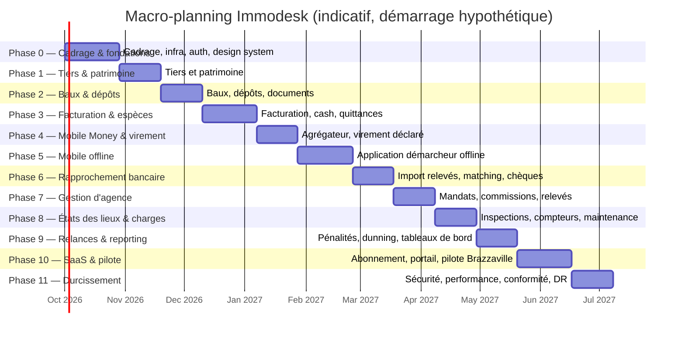

# Lettre de cadrage — Immodesk

## 1. Fiche d'identité du projet

| Champ                          | Valeur                                                                                                                                                                     |
| :----------------------------- | :------------------------------------------------------------------------------------------------------------------------------------------------------------------------- |
| Nom du projet                  | **Immodesk** — Plateforme SaaS de gestion locative                                                                                                                         |
| Marché cible                   | Congo-Brazzaville (Brazzaville, Pointe-Noire) en phase 1, extension zone CEMAC en phase ultérieure                                                                         |
| Version du document            | v1.0                                                                                                                                                                       |
| Date d'émission                | 10 septembre 2026                                                                                                                                                          |
| Statut                         | Projet de lettre de cadrage — soumis à validation du comité de pilotage                                                                                                    |
| Sponsor                        | À désigner par le comité de pilotage                                                                                                                                       |
| Chef de projet / Product Owner | À désigner par le comité de pilotage                                                                                                                                       |
| Rédacteur                      | Direction de projet Immodesk                                                                                                                                               |
| Diffusion                      | Comité de pilotage, équipe projet (lead tech, développeurs, designer), conseil juridique, partenaires d'intégration (agrégateur Mobile Money, opérateur WhatsApp Business) |
| Niveau de confidentialité      | Diffusion restreinte — document interne et partenaires sous accord de confidentialité                                                                                      |
| Documents de référence         | `docs/_DECISIONS_COMMUNES.md` (référentiel technique et fonctionnel partagé) ; `output_Prompts_Developpement_SaaS_Immobilier.md` (note de cadrage technique initiale)      |

Ce document constitue la lettre de cadrage officielle du projet Immodesk. Il fixe le contexte, la vision, les objectifs, le périmètre, la gouvernance, les contraintes, le macro-planning, les risques et le modèle économique du projet, en cohérence stricte avec le référentiel de décisions communes. Toute décision ultérieure divergente de ce document doit être validée en comité de pilotage et tracée dans l'historique des versions (section 16).

---

## 2. Contexte et problème

### 2.1 Un marché locatif largement informel

À Brazzaville et à Pointe-Noire, la gestion locative repose encore très majoritairement sur des pratiques manuelles et informelles, y compris chez des bailleurs possédant un patrimoine significatif (plusieurs immeubles, dizaines de lots). Les constats de terrain suivants motivent le projet Immodesk :

- **Encaissement en espèces par des démarcheurs.** Une part importante des loyers est perçue en numéraire par des agents de terrain (souvent appelés « démarcheurs » ou « encaisseurs »), qui se déplacent auprès des locataires, encaissent le loyer, puis reversent — en théorie — la somme au bailleur ou à l'agence. Ce circuit expose à des risques de détournement, de retard de reversement et d'absence de traçabilité.
- **Loyers payés en plusieurs fois.** Le paiement intégral du loyer en une seule fois n'est pas systématique : de nombreux locataires règlent leur loyer par tranches successives au cours du mois, ce qui complique le suivi des soldes, la relance et la délivrance d'une quittance unique et fiable.
- **Absence de quittances formalisées.** Une part significative des transactions ne donne lieu à aucun document normé faisant foi. Lorsqu'un reçu existe, il s'agit souvent d'un simple mot manuscrit sur un carnet, sans numérotation, sans mention systématique de la période concernée, et facilement contestable en cas de litige.
- **Virements bancaires sans libellé exploitable.** Quand le paiement transite par une banque locale (BGFI, BSCA, LCB, Ecobank, UBA, Crédit du Congo, etc.), le libellé du virement ne permet pas toujours d'identifier automatiquement le bail, la période ou le locataire concerné, ce qui impose un rapprochement manuel long et sujet à erreur.
- **Adoption forte du Mobile Money.** Les usages MTN Mobile Money et Airtel Money sont très répandus dans la population congolaise, y compris pour des montants significatifs, et constituent un canal de paiement en croissance rapide pour les transactions du quotidien (montant exact du taux de pénétration : à confirmer par l'étude de marché).
- **Connectivité réseau irrégulière.** La couverture et la qualité du réseau mobile (data) restent hétérogènes selon les quartiers de Brazzaville et de Pointe-Noire, avec des zones de couverture faible ou instable, en particulier en périphérie. Toute solution numérique de terrain doit fonctionner en mode dégradé ou déconnecté.
- **Litiges fréquents entre bailleur, locataire et démarcheur.** L'absence de preuve fiable de paiement alimente des différends : locataire affirmant avoir payé sans preuve acceptée, bailleur contestant avoir reçu les fonds reversés par le démarcheur, désaccords sur le montant des charges (eau, électricité) imputées.
- **Bailleurs en diaspora.** Une partie non négligeable des propriétaires de biens loués à Brazzaville et Pointe-Noire réside à l'étranger (France, autres pays d'Afrique centrale, etc.) et délègue la gestion quotidienne à une agence ou à un proche, avec un besoin fort de visibilité à distance sur l'état locatif de leur patrimoine, les encaissements réalisés et les sommes qui leur sont dues.
- **Agences immobilières en position d'intermédiaire de confiance.** Les agences qui gèrent pour le compte de propriétaires (souvent en diaspora ou peu disponibles) jouent un rôle pivot mais s'appuient encore largement sur des outils bureautiques génériques (tableurs, cahiers, messagerie) pour suivre les mandats, les encaissements et les reversements aux propriétaires.

### 2.2 Une opportunité de structuration numérique

Ce contexte crée une opportunité claire : une plateforme qui digitalise la chaîne complète (contrat de bail, facturation, encaissement multicanal, quittance vérifiable, reversement au bailleur) tout en respectant les pratiques réelles du terrain — y compris les espèces et les paiements fractionnés — peut réduire significativement les litiges, sécuriser les flux financiers et redonner confiance aux bailleurs, notamment ceux en diaspora. La taille exacte du marché adressable (nombre d'agences, de bailleurs indépendants, de lots gérés à Brazzaville et Pointe-Noire) reste à confirmer par une étude de marché dédiée ; les objectifs chiffrés de la section 4 sont donc formulés comme cibles de pilote et non comme extrapolations de marché.

Trois convictions structurent la réponse produit apportée par Immodesk :

1. **Ne pas combattre les usages existants, les fiabiliser.** Le paiement en espèces et le paiement fractionné ne sont pas des anomalies à éliminer mais des pratiques à sécuriser par la traçabilité (reçu numéroté, signature, remise de caisse contrôlée), sans imposer un mode de paiement unique dès le premier jour.
2. **Concevoir pour le réseau réel, pas pour le réseau idéal.** Toute fonctionnalité critique de terrain doit être pensée « offline-first » dès sa conception, et non comme une amélioration ajoutée après coup.
3. **La preuve doit être vérifiable par un tiers, pas seulement affichée dans l'application.** La quittance porte un QR code de vérification publique afin qu'un locataire, un bailleur ou, le cas échéant, une autorité puisse contrôler son authenticité indépendamment de l'application elle-même.

### 2.2bis Les démarcheurs, acteur pivot

Les démarcheurs et gestionnaires informels décrits en section 2.1 ne sont pas un public périphérique du projet : ce sont eux qui, au quotidien, détiennent la relation de confiance avec le locataire et, souvent, avec le bailleur. Ce constat appelle une vigilance stratégique particulière.

- **Un risque de rejet de l'outil.** Un démarcheur ou un gestionnaire informel peut percevoir Immodesk comme une menace directe pour son activité : traçabilité systématique des encaissements perçue comme un contrôle, crainte d'une perte d'autonomie, voire d'une substitution pure et simple par la plateforme ou par l'agence qui l'emploie. Ce risque de rejet, s'il n'est pas anticipé, peut compromettre à lui seul l'adoption terrain visée par le pilote (cf. risque R5, section 11).
- **Un choix stratégique : convertir plutôt que contourner.** Plutôt que de concevoir Immodesk en dehors du circuit des démarcheurs et gestionnaires informels — ou pire, contre eux —, le projet fait le choix délibéré d'en faire des prescripteurs de la plateforme. Cela se traduit par un espace gestionnaire indépendant dédié (nouveau type d'organisation, cf. `docs/_DECISIONS_COMMUNES.md`), une commission automatiquement calculée sur les loyers qu'ils encaissent, et une preuve d'honnêteté opposable au bailleur via un portail dédié : l'outil devient ainsi un argument de crédibilité pour le démarcheur auprès de ses propres mandants, et non une contrainte qui lui est imposée.

### 2.3 Segmentation indicative du marché cible

La segmentation ci-dessous est fournie à titre d'hypothèse de travail pour orienter la conception produit et la sélection des organisations pilotes (section 13). Elle ne constitue pas une donnée de marché validée.

| Segment                                   | Caractéristiques typiques                                                                               | Enjeu principal pour Immodesk                                                   | Taille estimée                    |
| :---------------------------------------- | :------------------------------------------------------------------------------------------------------ | :------------------------------------------------------------------------------ | :-------------------------------- |
| Agences immobilières structurées          | Portefeuille de plusieurs dizaines à centaines de lots, équipe de démarcheurs salariés ou commissionnés | Traçabilité des encaissements, reporting aux propriétaires, gestion des mandats | À confirmer par l'étude de marché |
| Bailleurs indépendants multi-lots         | 2 à 20 lots gérés en propre, sans structure d'agence                                                    | Simplicité d'usage, facturation et relances automatisées                        | À confirmer par l'étude de marché |
| Bailleurs indépendants mono-lot ou bi-lot | 1 à 2 lots, souvent gérés en parallèle d'une autre activité                                             | Coût d'entrée faible, valeur perçue immédiate (quittance, relance)              | À confirmer par l'étude de marché |
| Propriétaires en diaspora                 | Bien(s) géré(s) par un tiers (agence ou proche), résidence hors du Congo                                | Visibilité à distance, confiance dans le reporting                              | À confirmer par l'étude de marché |

### 2.4 Alternatives actuelles et positionnement

En l'absence d'outil dédié, les organisations rencontrées recourent aujourd'hui à des solutions de fortune : cahiers manuscrits, tableurs partagés par messagerie, logiciels de comptabilité générale génériques non adaptés à la spécificité locative (baux, dépôts de garantie, relances), ou applications de messagerie utilisées comme unique canal de preuve (capture d'écran de virement envoyée par WhatsApp sans suivi structuré). Les solutions de gestion locative internationales existantes sont, à la connaissance de l'équipe projet, peu ou pas adaptées aux réalités locales décrites en section 2.1 (encaissement en espèces par démarcheur, Mobile Money, connectivité irrégulière) : une confirmation formelle de l'absence d'alternative directement concurrente reste toutefois **à établir par l'étude de marché**. Le positionnement d'Immodesk n'est donc pas, à ce stade, celui d'un remplacement d'un outil numérique existant, mais celui d'une première structuration numérique d'un processus aujourd'hui majoritairement manuel.

---

## 3. Vision et proposition de valeur

**Vision produit.** Faire d'Immodesk le système d'enregistrement de confiance de la relation locative en Afrique centrale : chaque loyer facturé, chaque paiement — quel que soit son mode — et chaque quittance délivrée doivent être traçables, vérifiables et accessibles à toutes les parties prenantes, y compris lorsque la connectivité est intermittente.

### 3.1 Proposition de valeur par persona

| Persona                                | Problème vécu aujourd'hui                                                                                                                                                                     | Valeur apportée par Immodesk                                                                                                                                                                                                                                                                                                                                                   |
| :------------------------------------- | :-------------------------------------------------------------------------------------------------------------------------------------------------------------------------------------------- | :----------------------------------------------------------------------------------------------------------------------------------------------------------------------------------------------------------------------------------------------------------------------------------------------------------------------------------------------------------------------------- |
| **Agence immobilière**                 | Suivi manuel des mandats, des loyers et des reversements aux propriétaires sur tableurs ; risque d'erreur et de perte d'information ; difficulté à prouver la bonne gestion aux propriétaires | Vue consolidée du portefeuille géré, facturation automatisée, relevés de gérance générés automatiquement, traçabilité complète des encaissements et des commissions, image professionnelle renforcée auprès des propriétaires                                                                                                                                                  |
| **Bailleur indépendant**               | Gestion artisanale de quelques lots, absence de quittance formelle, difficulté à relancer les impayés, pas de visibilité consolidée                                                           | Facturation automatique, relances outillées, quittances PDF vérifiables envoyées par WhatsApp, tableau de bord simple de l'état locatif                                                                                                                                                                                                                                        |
| **Démarcheur / gestionnaire informel** | Carnet de reçus papier, risque d'accusation de détournement, déplacements non optimisés, crainte que la digitalisation ne le prive de son activité                                            | Espace gestionnaire dédié (mandats, commissions, relevés de gérance comme une agence), application mobile offline-first pour encaisser, émettre un reçu numéroté signé par le locataire et déclarer sa remise de caisse, commission de 10 % calculée automatiquement sur les loyers encaissés, preuve d'honnêteté offerte au bailleur via le portail bailleur en lecture seule |
| **Locataire**                          | Absence de preuve de paiement fiable, incertitude sur le solde dû, difficulté à contester un litige                                                                                           | Quittance vérifiable par QR code, historique de paiement consultable, notification WhatsApp à chaque règlement, portail simple pour déclarer un virement ou payer par Mobile Money                                                                                                                                                                                             |
| **Propriétaire en diaspora**           | Dépendance totale à la bonne foi et à la disponibilité de l'agence ou du proche gestionnaire, absence de visibilité en temps réel                                                             | Accès à distance à l'état de son patrimoine, aux encaissements réalisés en son nom, aux relevés de gérance et aux reversements, réduction de l'asymétrie d'information                                                                                                                                                                                                         |
| **Partenaire apporteur d'affaires**    | Aucune reconnaissance ni rémunération formelle pour la mise en relation d'un bailleur ou d'un gestionnaire avec un outil ou un service utile                                                  | Code de parrainage personnel, suivi transparent des organisations apportées et de leur statut, commission calculée automatiquement sur les abonnements payés par les organisations parrainées, versement par Mobile Money                                                                                                                                                      |

Chaque persona bénéficie d'un même socle de confiance : une donnée financière unique, auditable, non falsifiable a posteriori (écritures financières en append-only, cf. référentiel technique), et une preuve de paiement opposable (quittance numérotée et vérifiable publiquement par QR code).

### 3.2 Piliers transverses de la proposition de valeur

- **Une seule source de vérité financière** par organisation, partagée entre l'agence ou le bailleur, le démarcheur et le locataire, avec des rôles d'accès différenciés (section « Identité et organisations »).
- **Une preuve de paiement systématique**, quel que soit le canal (espèces, Mobile Money, virement, chèque), délivrée dans un délai maîtrisé.
- **Une tolérance opérationnelle au terrain réel** : réseau intermittent, paiements fractionnés, diversité des niveaux d'alphabétisation numérique.
- **Une gouvernance des données conforme** à la réglementation congolaise de protection des données personnelles, condition de la confiance des utilisateurs comme des partenaires financiers.

### 3.3 Illustrations de parcours

**Parcours démarcheur (encaissement en espèces, hors ligne).** Le démarcheur ouvre l'application mobile chez le locataire, sans connexion data disponible. Il sélectionne le bail, saisit le montant remis, fait signer le locataire à l'écran, et l'application génère un reçu de caisse numéroté stocké localement avec le statut « en attente de synchronisation ». Dès le retour de connexion, le reçu est transmis au serveur, la facture est mise à jour, et une quittance est envoyée par WhatsApp au locataire — sans que le démarcheur n'ait eu à répéter une action.

**Parcours locataire (déclaration de virement).** Le locataire effectue un virement depuis son application bancaire en indiquant la référence de paiement fournie par Immodesk. Il ouvre ensuite le portail locataire, déclare son virement et joint une capture de l'ordre de virement. Le statut du paiement passe en attente de confirmation jusqu'à ce que l'agence ou le bailleur valide la réception effective des fonds (manuellement en version 1, puis via rapprochement automatique à partir de la phase 6).

**Parcours propriétaire en diaspora.** Le propriétaire se connecte au portail web depuis l'étranger, consulte l'état d'occupation de son patrimoine, les paiements reçus le mois courant, et le relevé de gérance produit par l'agence, sans dépendre d'un échange téléphonique ou d'un courriel manuel.

---

## 4. Objectifs SMART et indicateurs de succès

### 4.1 Objectifs SMART du projet

| #   | Objectif                                                                                                                                                                                                                                    | Horizon                                 |
| :-- | :------------------------------------------------------------------------------------------------------------------------------------------------------------------------------------------------------------------------------------------ | :-------------------------------------- |
| O1  | Lancer un pilote opérationnel à Brazzaville avec **10 organisations** (agences et/ou bailleurs indépendants) et **500 lots** actifs sur la plateforme                                                                                       | Fin de la phase 10 (cf. macro-planning) |
| O2  | Atteindre un taux d'émission de quittance de **95 %** sur les paiements confirmés dans les organisations pilotes, tous modes de paiement confondus                                                                                          | 8 semaines après le début du pilote     |
| O3  | Ramener le délai moyen de rapprochement d'un virement bancaire déclaré à **moins de 48 heures ouvrées** entre la déclaration du locataire et la confirmation par le bailleur ou l'agence                                                    | 8 semaines après le début du pilote     |
| O4  | Atteindre un taux de synchronisation réussie des actions terrain (encaissements, états des lieux) de **99 %** dans un délai de 24 heures après leur saisie hors ligne                                                                       | Fin de la phase 5                       |
| O5  | Réduire de **50 %** le délai moyen entre encaissement en espèces par un démarcheur et remise de caisse effective validée, par rapport à la pratique constatée en amont du projet (mesure de référence à établir lors du diagnostic terrain) | 12 semaines après le début du pilote    |
| O6  | Obtenir un taux de satisfaction déclaré des bailleurs et agences pilotes d'au moins **7/10** sur la confiance accordée aux quittances et à la traçabilité des encaissements                                                                 | Fin du pilote                           |
| O7  | Atteindre un taux d'adoption effective (connexion et action au moins hebdomadaire) de **80 %** des démarcheurs formés dans les organisations pilotes                                                                                        | 6 semaines après la formation           |

### 4.2 Indicateurs de succès

**KPI produit**

| Indicateur                                 | Définition                                                                    | Cible pilote  |
| :----------------------------------------- | :---------------------------------------------------------------------------- | :------------ |
| Taux de synchronisation offline            | Part des enregistrements créés hors ligne synchronisés sans conflit sous 24 h | ≥ 99 %        |
| Disponibilité de la plateforme             | Temps de disponibilité mensuel de l'API et du dashboard web                   | ≥ 99,5 %      |
| Temps de génération d'une quittance        | Délai entre confirmation du paiement et disponibilité du PDF                  | ≤ 60 secondes |
| Taux d'erreur de rapprochement automatique | Part des rapprochements automatiques erronés détectés a posteriori            | ≤ 1 %         |
| Taux de livraison WhatsApp                 | Part des messages WhatsApp effectivement délivrés (hors échec fournisseur)    | ≥ 95 %        |

**KPI métier**

| Indicateur                                                           | Définition                                                                                                      | Cible pilote                                                         |
| :------------------------------------------------------------------- | :-------------------------------------------------------------------------------------------------------------- | :------------------------------------------------------------------- |
| Taux de quittances émises                                            | Part des paiements confirmés donnant lieu à une quittance                                                       | ≥ 95 %                                                               |
| Délai moyen de rapprochement virement                                | Délai déclaration → confirmation                                                                                | ≤ 48 h ouvrées                                                       |
| Taux d'impayés à 30 jours                                            | Part des factures de loyer non soldées 30 jours après échéance                                                  | À mesurer, cible de réduction à définir après diagnostic             |
| Taux de reversement des remises de caisse                            | Part des encaissements en espèces effectivement remis et validés sous 72 h                                      | ≥ 90 %                                                               |
| Taux de rétention des organisations pilotes                          | Organisations actives à l'issue du pilote / organisations engagées au départ                                    | ≥ 80 %                                                               |
| Part des organisations acquises via le programme d'apport d'affaires | Organisations dont l'abonnement est rattaché à un `referral` actif ou expiré / total des organisations abonnées | À mesurer, cible indicative à définir après le pilote                |
| Nombre de gestionnaires indépendants actifs                          | Organisations de type `INDEPENDENT_MANAGER` ayant réalisé au moins un encaissement dans le mois                 | À mesurer dès la Phase 7, cible indicative à définir après le pilote |

Les chiffres de marché plus larges (nombre total de biens loués à Brazzaville et Pointe-Noire, taux de pénétration du Mobile Money dans les transactions locatives, taille du marché adressable en zone CEMAC) ne sont pas retenus comme objectifs chiffrés à ce stade : ils sont **à confirmer par l'étude de marché** prévue en amont ou en parallèle de la phase 0.

### 4.3 Objectifs volontairement écartés à ce stade (anti-objectifs)

Pour préserver la cohérence du pilote, le comité de pilotage écarte explicitement, en version 1, les objectifs suivants qui pourraient sembler naturels mais dilueraient l'effort :

- Maximiser dès le pilote le nombre d'organisations connectées plutôt que la qualité d'usage et la confiance dans les 10 organisations pilotes.
- Automatiser à 100 % le rapprochement bancaire dès le lancement (un taux de rapprochement automatique élevé est visé, mais une part de validation manuelle reste acceptée en version 1, cf. section 5).
- Couvrir l'ensemble de la zone CEMAC avant d'avoir validé le modèle à Brazzaville.
- Optimiser la marge unitaire avant d'avoir validé l'adoption et la rétention des organisations pilotes.

---

## 5. Périmètre fonctionnel détaillé

### 5.1 Principe d'organisation

Le périmètre fonctionnel est structuré en modules, alignés sur la liste canonique des tables du référentiel technique. Chaque module est rattaché à une phase de référence (numérotation 0 à 11) et qualifié « MVP pilote » ou non : un module MVP est indispensable pour que les 10 organisations pilotes puissent opérer un cycle locatif complet (bail, facturation, encaissement, quittance) ; un module non-MVP apporte une valeur réelle mais peut être différé sans remettre en cause la validité du pilote.

### 5.2 Vue d'ensemble des modules

| Module                                             | Description fonctionnelle                                                                                                                                                                                                                                                                                                                                                                                                                         | Entités principales concernées                                                                                                                       |                                                           MVP pilote                                                           | Phase de référence |
| :------------------------------------------------- | :------------------------------------------------------------------------------------------------------------------------------------------------------------------------------------------------------------------------------------------------------------------------------------------------------------------------------------------------------------------------------------------------------------------------------------------------ | :--------------------------------------------------------------------------------------------------------------------------------------------------- | :----------------------------------------------------------------------------------------------------------------------------: | :----------------: |
| Identité et organisations                          | Authentification par téléphone + OTP, gestion multi-tenant (organisations de type agence ou bailleur indépendant), rôles (OWNER, MANAGER, COLLECTOR, ACCOUNTANT, VIEWER), invitations, paramètres d'organisation                                                                                                                                                                                                                                  | organizations, organization_members, users, otp_codes, refresh_tokens, invitations                                                                   |                                                              Oui                                                               |      Phase 0       |
| Tiers                                              | Fiches bailleurs, locataires, garants, et leurs canaux de contact (téléphone, WhatsApp, e-mail)                                                                                                                                                                                                                                                                                                                                                   | landlords, tenants, guarantors, contact_channels                                                                                                     |                                                              Oui                                                               |      Phase 1       |
| Patrimoine                                         | Immeubles, lots (appartements, studios, locaux commerciaux, villas), comptes bancaires associés, compteurs                                                                                                                                                                                                                                                                                                                                        | properties, units, bank_accounts, meters                                                                                                             |                                                              Oui                                                               |      Phase 1       |
| Baux et dépôts                                     | Création et suivi des contrats de bail, dépôts de garantie et leurs mouvements, documents contractuels générés en PDF                                                                                                                                                                                                                                                                                                                             | leases, lease_parties, lease_documents, deposits, deposit_movements                                                                                  |                                                              Oui                                                               |      Phase 2       |
| Facturation                                        | Génération automatique mensuelle des factures de loyer (et charges), lignes de facture, numérotation séquentielle                                                                                                                                                                                                                                                                                                                                 | rent_invoices, invoice_lines, sequences                                                                                                              |                                                              Oui                                                               |      Phase 3       |
| Encaissements — 4 modes                            | Enregistrement des paiements en espèces, Mobile Money (deux modes activables séparément par organisation dans `organization_settings` : **déclaré**, sur le numéro Mobile Money du bailleur/agence, référence de transaction saisie par le locataire, zéro commission ; **agrégateur**, via `MobileMoneyProvider`, CinetPay en première intention, commission par transaction), virement bancaire déclaré et chèque, avec allocation aux factures | payments, payment_allocations, cash_receipts, mobile_money_transactions, bank_transfer_declarations, bank_checks, organization_settings              | Oui (espèces, virement déclaré, Mobile Money déclaré) — Mobile Money agrégateur si contrat signé, chèque en version simplifiée |   Phases 3 et 4    |
| Remises de caisse                                  | Reversement contrôlé des espèces collectées par un démarcheur vers l'organisation, avec rapprochement des reçus                                                                                                                                                                                                                                                                                                                                   | cash_remittances, cash_remittance_items                                                                                                              |                                                              Oui                                                               |      Phase 3       |
| Rapprochement bancaire                             | Import de relevés bancaires (CSV/MT940), rapprochement automatique, suggéré ou manuel avec les virements déclarés                                                                                                                                                                                                                                                                                                                                 | bank_statements, bank_statement_lines, reconciliation_matches                                                                                        |                                                           Non (V1.1)                                                           |      Phase 6       |
| Quittances et vérification QR                      | Génération de quittances PDF numérotées, envoi automatique par WhatsApp, vérification publique par QR code                                                                                                                                                                                                                                                                                                                                        | receipts, message_logs                                                                                                                               |                                                              Oui                                                               |      Phase 3       |
| Gestion d'agence et relevés de gérance             | Mandats de gestion, calcul des commissions, dépenses imputées, génération de relevés de gérance et reversements aux propriétaires                                                                                                                                                                                                                                                                                                                 | management_mandates, commissions, expenses, owner_statements, owner_statement_lines, owner_payouts                                                   |                                    Non — MVP limité aux mandats simples (Phase 7 différée)                                     |      Phase 7       |
| Espace gestionnaire indépendant & portail bailleur | Organisation dédiée aux démarcheurs et gestionnaires informels (`INDEPENDENT_MANAGER`), mandats et commission de 10 % calculée automatiquement, accès en lecture seule du bailleur (via `landlords.user_id`) à ses encaissements, quittances, relevés de gérance et reversements                                                                                                                                                                  | organizations (type INDEPENDENT_MANAGER), management_mandates, commissions, owner_statements, owner_statement_lines, owner_payouts, landlords, users |                                                           Non (V1.1)                                                           |      Phase 7       |
| États des lieux                                    | Inspections d'entrée/sortie avec grille d'état par pièce, photos horodatées                                                                                                                                                                                                                                                                                                                                                                       | inspections, inspection_items, inspection_photos                                                                                                     |                                                           Non (V1.1)                                                           |      Phase 8       |
| Compteurs et charges                               | Relevés de compteurs eau/électricité, tarifs, facturation des charges                                                                                                                                                                                                                                                                                                                                                                             | meters, meter_readings, utility_tariffs                                                                                                              |                                                           Non (V1.1)                                                           |      Phase 8       |
| Maintenance                                        | Demandes d'intervention, suivi des mises à jour de statut                                                                                                                                                                                                                                                                                                                                                                                         | maintenance_requests, maintenance_updates                                                                                                            |                                                           Non (V1.1)                                                           |      Phase 8       |
| Relances et pénalités                              | Règles de relance automatisée (WhatsApp/SMS), règles de pénalité de retard                                                                                                                                                                                                                                                                                                                                                                        | dunning_rules, dunning_runs, penalty_rules                                                                                                           |                                      Oui (version simplifiée : relance à échéance + J+N)                                       |      Phase 9       |
| Reporting                                          | Tableaux de bord (impayés, encaissements, occupation) pour agence, bailleur et propriétaire diaspora                                                                                                                                                                                                                                                                                                                                              | Vues agrégées sur factures et paiements                                                                                                              |                                                   Oui (indicateurs de base)                                                    |      Phase 9       |
| Portail locataire                                  | Application/portail permettant au locataire de consulter son solde, ses quittances, et de déclarer un paiement                                                                                                                                                                                                                                                                                                                                    | Interfaces web et mobile locataire                                                                                                                   |                                                     Oui (version de base)                                                      |      Phase 10      |
| Abonnement SaaS                                    | Plans tarifaires, souscription, facturation de l'abonnement des organisations clientes                                                                                                                                                                                                                                                                                                                                                            | subscription_plans, subscriptions, subscription_invoices                                                                                             |                                                              Oui                                                               |      Phase 10      |
| Application mobile offline démarcheur              | Encaissement terrain hors connexion, signature numérique, file de synchronisation prioritaire                                                                                                                                                                                                                                                                                                                                                     | sync_batches, idempotency_keys                                                                                                                       |                                                              Oui                                                               |      Phase 5       |
| Programme d'apport d'affaires                      | Parrainage d'organisations bailleurs ou gestionnaires par un partenaire (démarcheur en priorité), attribution d'un code unique, calcul et versement de commissions sur les abonnements des organisations parrainées                                                                                                                                                                                                                               | referral_programs, referral_partners, referrals, referral_commissions, referral_payouts                                                              |                                                           Non (V1.1)                                                           |      Phase 10      |

### 5.3 Description détaillée des modules du périmètre MVP

**Identité et organisations.** Socle de la plateforme : création d'une organisation (agence ou bailleur indépendant), authentification par téléphone et code à usage unique, gestion fine des rôles (propriétaire du compte, gestionnaire, démarcheur/encaisseur, profil comptable en lecture financière, profil visiteur), invitation de collaborateurs. Ce module conditionne l'isolation stricte des données entre organisations (Row Level Security).

**Tiers.** Fiches structurées des bailleurs, locataires et garants, avec leurs canaux de contact (téléphone, WhatsApp, e-mail), condition préalable à l'envoi de toute notification et à la génération de tout document contractuel.

**Patrimoine.** Saisie des immeubles et de leurs lots (appartement, studio, local commercial, villa), des comptes bancaires de réception des loyers, première brique du référentiel de compteurs. Un import initial du patrimoine existant (le cas échéant depuis un tableur) est prévu pour accélérer l'onboarding des organisations pilotes.

**Baux et dépôts.** Création du contrat de bail (parties, durée, loyer, jour d'échéance), suivi du dépôt de garantie et de ses mouvements, génération automatique du contrat en PDF à partir d'un modèle validé juridiquement. C'est le point d'entrée obligatoire avant toute facturation.

**Facturation.** Génération automatique mensuelle des factures de loyer (et des charges lorsqu'elles sont définies), avec numérotation séquentielle infalsifiable et statuts de cycle de vie (brouillon, émise, partiellement payée, payée, en retard, annulée).

**Encaissements — 4 modes.** Enregistrement des règlements en espèces (avec reçu numéroté et signature), en Mobile Money selon deux modes au choix de chaque organisation (`organization_settings`) : le mode **déclaré** (le locataire règle directement sur le numéro Mobile Money du bailleur ou de l'agence puis saisit la référence de transaction de l'opérateur, capture d'écran facultative, validation manuelle par le gestionnaire ou rapprochement avec le relevé opérateur, zéro commission — priorité de la Phase 4) et le mode **agrégateur** (initiation et confirmation par re-interrogation du statut auprès de l'agrégateur, commission par transaction), par virement bancaire déclaré (téléversement de preuve par le locataire puis validation), et en version simplifiée par chèque (saisie du numéro et de la banque, sans automatisation de la compensation en version 1). Un paiement peut être partiel et s'imputer sur une ou plusieurs factures.

**Remises de caisse.** Processus de reversement contrôlé des espèces collectées par un démarcheur vers l'organisation, avec rapprochement entre les reçus émis sur le terrain et le montant effectivement remis — élément central de la lutte contre le risque de détournement (risque R3, section 11).

**Quittances et vérification QR.** Génération automatique d'une quittance PDF numérotée dès confirmation d'un paiement, envoi automatique par WhatsApp au locataire, et page de vérification publique accessible via un QR code, permettant à toute partie de contrôler l'authenticité d'une quittance sans avoir de compte sur la plateforme.

**Application mobile offline démarcheur.** Cœur de l'expérience terrain : capture des encaissements et des signatures sans connexion, file de synchronisation prioritaire, résolution d'idempotence par identifiant unique généré sur l'appareil, garantissant qu'aucun encaissement saisi hors ligne n'est perdu ni dupliqué.

**Relances (version simplifiée) et reporting basique.** Envoi automatique d'un rappel WhatsApp/SMS à l'échéance et à J+N en cas de non-paiement, et tableau de bord minimal (loyers en attente, loyers en retard, encaissements du mois) pour les rôles gestionnaire et propriétaire.

**Portail locataire (version de base) et abonnement SaaS.** Interface simple permettant au locataire de consulter son solde et ses quittances et de déclarer un virement ; en parallèle, mise en place des plans d'abonnement et de la facturation SaaS des organisations clientes, nécessaires dès le pilote pour tester l'acceptabilité du modèle économique (section 12).

Le détail technique de chaque module (schéma de données, endpoints, écrans) fait l'objet de documents de conception dédiés, non couverts par la présente lettre de cadrage.

---

## 6. Hors périmètre explicite (version 1)

Les éléments suivants sont **explicitement exclus** du périmètre de la version 1 d'Immodesk. Ils pourront être réévalués lors de versions ultérieures, sur décision du comité de pilotage :

- **Comptabilité générale OHADA complète** (plan comptable SYSCOHADA révisé, états financiers réglementaires, liasse fiscale) : Immodesk produit des relevés de gérance et des états financiers simplifiés, mais ne se substitue pas à un logiciel de comptabilité générale ni à un expert-comptable.
- **Gestion de syndic de copropriété** : répartition de charges de copropriété, assemblées générales, appels de fonds travaux — non couverts.
- **Transactions de vente immobilière** : Immodesk est un outil de gestion locative, pas une plateforme de transaction (achat/vente) de biens.
- **Signature électronique qualifiée** au sens réglementaire fort (eIDAS ou équivalent local) : la version 1 utilise une signature numérique tactile de type « preuve d'accord » (utilisée notamment pour les reçus de caisse), sans valeur de signature électronique qualifiée.
- **Intégration bancaire directe en temps réel** (agrégation de comptes, API bancaires ouvertes) : le rapprochement bancaire repose sur l'import de relevés (CSV/MT940) et la déclaration du locataire, pas sur une connexion API directe aux banques.
- **Multi-devise** : la version 1 fonctionne exclusivement en Franc CFA (XAF), sans conversion ni gestion multi-devise.
- **Paiement direct par carte bancaire internationale** : non prioritaire pour le marché cible en phase 1.
- **Marketplace de mise en location** (annonces publiques de biens à louer) : hors périmètre, Immodesk gère des baux existants ou en cours de création, pas la prospection commerciale de nouveaux locataires.
- **Gestion des sinistres et assurance habitation** : non couverte en version 1.

Ces exclusions ne traduisent pas un jugement sur la valeur de ces fonctionnalités, mais un choix délibéré de concentration des ressources sur le cœur du problème identifié en section 2 : la fiabilisation de la relation bailleur/locataire/démarcheur autour du paiement du loyer. Chaque exclusion pourra faire l'objet d'une étude d'opportunité dédiée après le lancement commercial, sur décision du comité de pilotage.

---

## 7. Parties prenantes et gouvernance

### 7.1 Rôles

| Rôle                           | Responsabilité principale                                                                                                                                                              |
| :----------------------------- | :------------------------------------------------------------------------------------------------------------------------------------------------------------------------------------- |
| Sponsor                        | Porte le projet au niveau stratégique, arbitre le budget, valide les jalons majeurs et les décisions de go/no-go                                                                       |
| Product Owner (chef de projet) | Porte la vision produit, priorise le backlog, arbitre les compromis fonctionnels, anime le comité de pilotage                                                                          |
| Lead tech                      | Responsable de l'architecture technique, garant du respect du référentiel de décisions communes, arbitre les choix d'implémentation                                                    |
| Développeurs backend/web (x2)  | Implémentent l'API NestJS, le dashboard Next.js, les intégrations tierces (agrégateur Mobile Money, WhatsApp, banques)                                                                 |
| Développeur mobile (x1)        | Implémente l'application Flutter offline-first (démarcheurs, bailleurs, locataires)                                                                                                    |
| Designer (mi-temps)            | Conçoit le système de design, les parcours utilisateurs, les maquettes web et mobile                                                                                                   |
| Juriste conseil                | Valide le modèle de quittance, les mentions légales des baux, la conformité à la loi congolaise sur la protection des données personnelles et au cadre OHADA pour les baux commerciaux |
| Testeurs terrain (Brazzaville) | Réalisent les tests d'acceptation en conditions réelles avec des démarcheurs, bailleurs et locataires pilotes                                                                          |

### 7.2 Instances de gouvernance

| Instance                      | Fréquence                                 | Participants                                             | Objet                                                                                                   |
| :---------------------------- | :---------------------------------------- | :------------------------------------------------------- | :------------------------------------------------------------------------------------------------------ |
| Comité de pilotage            | Mensuel                                   | Sponsor, Product Owner, Lead tech                        | Suivi d'avancement global, arbitrages budgétaires, décisions de go/no-go, revue des risques majeurs     |
| Revue de sprint               | Bi-hebdomadaire                           | Product Owner, Lead tech, développeurs, designer         | Démonstration des livrables du sprint, ajustement du backlog                                            |
| Daily                         | Quotidien                                 | Équipe de développement (backend, web, mobile, designer) | Synchronisation courte sur l'avancement et les blocages                                                 |
| Revue de risques              | Mensuelle (couplée au comité de pilotage) | Product Owner, Lead tech, Sponsor                        | Mise à jour du registre des risques (section 11)                                                        |
| Point juridique et conformité | Selon jalons (phases 0, 3, 4, 10)         | Product Owner, Juriste conseil                           | Validation des points de conformité réglementaire avant mise en production de fonctionnalités sensibles |

### 7.3 Matrice RACI des décisions majeures

Légende : **R** = Responsible (réalise), **A** = Accountable (rend compte, décide en dernier ressort), **C** = Consulted (consulté), **I** = Informed (informé).

| Décision                                       | Sponsor | Product Owner | Lead tech | Développeurs | Designer | Juriste conseil | Testeurs terrain |
| :--------------------------------------------- | :-----: | :-----------: | :-------: | :----------: | :------: | :-------------: | :--------------: |
| Choix d'architecture technique                 |    I    |       C       |    A/R    |      C       |    I     |        I        |        I         |
| Choix de l'agrégateur Mobile Money             |    A    |       R       |     C     |      I       |    I     |        C        |        I         |
| Validation du modèle juridique de la quittance |    A    |       C       |     I     |      I       |    I     |        R        |        I         |
| Priorisation du backlog produit                |    I    |      A/R      |     C     |      C       |    C     |        I        |        C         |
| Go/No-Go lancement du pilote                   |    A    |       R       |     C     |      I       |    I     |        C        |        C         |
| Go/No-Go lancement commercial                  |    A    |       R       |     C     |      I       |    I     |        C        |        I         |
| Validation du budget                           |   A/R   |       C       |     C     |      I       |    I     |        I        |        I         |
| Recrutement de l'équipe projet                 |    A    |       R       |     C     |      I       |    I     |        I        |        I         |
| Gestion de crise (incident de sécurité)        |    A    |       R       |     R     |      C       |    I     |        C        |        I         |
| Tarification SaaS                              |    A    |       R       |     C     |      I       |    I     |        C        |        I         |

### 7.4 Processus de décision et d'escalade

Les décisions courantes d'implémentation relèvent du lead tech et de l'équipe de développement, dans le respect strict du référentiel technique. Toute décision qui s'écarterait du référentiel, modifierait le périmètre MVP (section 5), ou engagerait une dépense non prévue, est portée par le Product Owner en comité de pilotage. En cas de blocage entre deux instances (par exemple désaccord entre exigence produit et faisabilité technique), l'arbitrage final revient au sponsor, éclairé par un avis écrit du lead tech et du Product Owner. Les décisions structurantes sont consignées dans l'historique des versions du présent document (section 16) ou dans un registre de décisions dédié si le volume le justifie.

### 7.5 Intégration des nouvelles parties prenantes

Tout nouveau membre de l'équipe projet (développeur, testeur terrain) reçoit, avant sa première contribution : un accès au référentiel de décisions communes, la présente lettre de cadrage, et une présentation du contexte terrain (section 2) assurée par le Product Owner. Cette exigence vise à limiter le risque de dérive par rapport aux choix déjà tranchés, notamment sur les règles financières non négociables.

---

## 8. Contraintes

### 8.1 Contraintes techniques

Le projet s'inscrit strictement dans le référentiel technique déjà tranché (`docs/_DECISIONS_COMMUNES.md`), sans alternative à discuter en cours de projet sauf décision explicite du comité de pilotage :

- Backend NestJS 11 (TypeScript 5) en Clean Architecture modulaire, ORM Prisma, file d'attente BullMQ sur Redis.
- Base de données PostgreSQL 16 avec Row Level Security activée sur toutes les tables portant `organization_id`.
- Web : Next.js 15 (App Router), Tailwind CSS, shadcn/ui, TanStack Query.
- Mobile : Flutter 3.x, Riverpod, Drift (SQLite), architecture offline-first.
- Stockage fichiers : stockage objet compatible S3, **MinIO auto-hébergé** sur le VPS en phase pilote (open source, gratuit), Cloudflare R2 seulement si le volume l'exige ; URLs signées.
- Génération PDF : Puppeteer dans un worker dédié.
- WhatsApp d'abord : Meta WhatsApp Cloud API en accès direct (templates approuvés) pour les OTP, quittances et relances ; repli automatique par SMS via une **passerelle open source sur téléphone Android** (SIM MTN, forfait SMS illimité) pour les numéros sans WhatsApp ou en cas d'échec, derrière l'interface `SmsProvider` (qui permettra de brancher plus tard une passerelle SMS commerciale).
- Mobile Money : deux modes activables séparément par organisation dans `organization_settings` — mode **déclaré** (paiement sur le numéro Mobile Money du bailleur/agence, référence de transaction saisie par le locataire, validation manuelle ou rapprochement opérateur, zéro commission) et mode **agrégateur** (interface `MobileMoneyProvider`, première implémentation via CinetPay, commission par transaction, confirmation systématique par re-interrogation du statut côté agrégateur).
- Authentification par téléphone + OTP, contrat d'API OpenAPI 3.1.
- Infrastructure Docker, déploiement sur un **VPS Hetzner ou OVH** en région Europe (Paris), reverse proxy **Caddy**, CI/CD GitHub Actions, supervision **GlitchTip auto-hébergé** (open source, compatible SDK Sentry) + Grafana/Prometheus, sauvegardes PostgreSQL quotidiennes chiffrées.
- Principe « open source d'abord » : tout composant est auto-hébergé et open source dès qu'une alternative crédible existe ; les services payants sont limités à ce qui n'a pas d'équivalent (opérateurs Mobile Money via agrégateur si activé, WhatsApp officiel à la conversation, serveur, nom de domaine).
- Règles financières non négociables : montants en BIGINT XAF (jamais de flottant), clés primaires UUID v7, écritures financières en transaction SQL, tables financières append-only, idempotence par `client_ref` (ULID) pour toute action créée sur mobile.

### 8.2 Contraintes réglementaires

- **OHADA** : les baux à usage commercial relèvent de l'Acte uniforme OHADA portant sur le droit commercial général ; les clauses générées par Immodesk pour ce type de bail doivent être conformes à ce cadre.
- **Loi congolaise sur le bail à usage d'habitation** : les mentions obligatoires des contrats de bail d'habitation et des quittances doivent respecter le droit congolais en vigueur ; validation juridique requise avant mise en production du module Baux (Phase 2) et du module Quittances (Phase 3).
- **Loi congolaise de 2019 sur la protection des données à caractère personnel** : traitement, conservation et transfert des données personnelles (identité des locataires, bailleurs, garants, données de paiement) soumis à cette loi ; nécessité d'un registre de traitement et, le cas échéant, de formalités déclaratives auprès de l'autorité compétente.
- **Exigences BEAC/COBAC** : si l'agrégateur ou Immodesk venait à détenir des fonds pour le compte de tiers (au-delà du simple rôle d'intermédiaire technique de paiement), un agrément ou un partenariat avec un établissement agréé serait requis. Le principe retenu pour la version 1 est qu'**Immodesk ne détient jamais les fonds** : en mode Mobile Money agrégateur, les flux transitent par un agrégateur agréé ; en mode Mobile Money déclaré, le paiement va directement du locataire au numéro Mobile Money du bailleur/agence, sans transiter par Immodesk ni par un agrégateur ; les espèces et virements restent gérés directement entre le locataire, le démarcheur/agence et le bailleur.
- **Fiscalité des loyers** : la plateforme doit permettre l'édition de documents (relevés, quittances) exploitables par les bailleurs et agences pour leurs obligations déclaratives, sans se substituer à leur conseil fiscal.

Synthèse des exigences réglementaires et de leur statut de validation à date :

| Exigence                                         | Application dans Immodesk                                                                                     | Statut de validation                                                                                         |
| :----------------------------------------------- | :------------------------------------------------------------------------------------------------------------ | :----------------------------------------------------------------------------------------------------------- |
| Mentions obligatoires du bail d'habitation       | Modèle de contrat PDF généré à partir d'un gabarit validé                                                     | À valider par le juriste conseil avant Phase 2                                                               |
| Mentions obligatoires du bail commercial (OHADA) | Variante de gabarit pour les locaux commerciaux                                                               | À valider par le juriste conseil avant Phase 2                                                               |
| Valeur probatoire de la quittance numérique      | Numérotation séquentielle, horodatage, QR de vérification publique                                            | À valider par le juriste conseil avant Phase 3                                                               |
| Registre de traitement des données personnelles  | Documentation des finalités, durées de conservation, destinataires                                            | À produire en Phase 0, revu à chaque nouveau module traitant des données personnelles                        |
| Non-détention de fonds par Immodesk              | Mobile Money agrégateur agréé si activé ; Mobile Money déclaré directement entre locataire et bailleur/agence | Principe de conception ; volet agrégateur à confirmer contractuellement (Phase 4), sans dépendance du pilote |

### 8.3 Contraintes opérationnelles

- Connectivité réseau irrégulière à Brazzaville et Pointe-Noire, notamment en périphérie : nécessité d'une expérience mobile pleinement fonctionnelle hors ligne.
- Niveau d'alphabétisation numérique hétérogène chez les démarcheurs et certains locataires : exigence d'une interface simple, en français, avec un minimum de saisie manuelle.
- Coût des SMS et de la bande passante WhatsApp : privilégier WhatsApp (moins coûteux à l'usage une fois le compte vérifié) avec repli SMS uniquement en cas d'échec, et maîtriser le volume de notifications. Le repli SMS s'appuie sur une passerelle open source installée sur un téléphone Android équipé d'une SIM MTN à forfait SMS illimité (coût fixe indépendant du volume), ce qui suppose la disponibilité opérationnelle continue de ce téléphone (cf. risques R2/R6, section 11).
- Disponibilité limitée de certains partenaires bancaires pour la fourniture de relevés dans un format exploitable (CSV/MT940) : dépendance identifiée en section 9.

### 8.4 Contraintes budgétaires

Le budget global du projet **reste à valider** par le sponsor et le comité de pilotage (cf. section 12 pour la structure de coûts indicative). Aucun engagement de dépense au-delà de la phase 0 ne doit être pris sans validation budgétaire explicite en comité de pilotage.

---

## 9. Hypothèses et dépendances

| #   | Hypothèse / dépendance                                                                                                                                                                               | Impact si non vérifiée                                                                                                                                                                                                 | Porteur                 |
| :-- | :--------------------------------------------------------------------------------------------------------------------------------------------------------------------------------------------------- | :--------------------------------------------------------------------------------------------------------------------------------------------------------------------------------------------------------------------- | :---------------------- |
| H1  | Un contrat est signé avec un agrégateur Mobile Money (CinetPay en première intention) permettant l'intégration MTN Mobile Money et Airtel Money en mode agrégateur                                   | Report du seul sous-module Mobile Money agrégateur (Phase 4) ; **sans impact sur le pilote**, qui repose en priorité sur le mode Mobile Money déclaré (`organization_settings`), non dépendant d'un contrat agrégateur | Sponsor / Product Owner |
| H2  | Un compte Meta Business est vérifié et un numéro WhatsApp Business dédié est obtenu, avec des templates de message approuvés (démarche lancée dès le jour 1 de la Phase 0, cf. section 11)           | Impossibilité d'envoyer les OTP, quittances et relances par WhatsApp, repli intégral sur SMS (coût plus élevé, dépendance accrue à la passerelle Android)                                                              | Lead tech               |
| H3  | Les formats de relevés bancaires (CSV ou MT940) des banques locales partenaires sont obtenus et documentés                                                                                           | Report ou dégradation du module de rapprochement bancaire (Phase 6)                                                                                                                                                    | Lead tech               |
| H4  | Un accès (même manuel dans un premier temps) aux relevés des banques locales pilotes (BGFI, BSCA, LCB, Ecobank, UBA, Crédit du Congo) est obtenu pour les organisations pilotes                      | Rapprochement des virements bancaires réalisé manuellement pendant le pilote                                                                                                                                           | Product Owner           |
| H5  | Le modèle de quittance numérique (mentions légales, valeur probatoire) est validé par le conseil juridique avant la mise en production                                                               | Risque de contestation juridique des quittances émises, retard de la Phase 3                                                                                                                                           | Juriste conseil         |
| H6  | Les organisations pilotes acceptent de former leurs démarcheurs et de participer activement aux tests terrain                                                                                        | Retard ou échec du pilote (Phase 10)                                                                                                                                                                                   | Product Owner           |
| H7  | Le budget nécessaire au financement des phases 0 à 11 est sécurisé progressivement, au moins jalon par jalon                                                                                         | Interruption du développement en cours de projet                                                                                                                                                                       | Sponsor                 |
| H8  | Les numéros de téléphone des utilisateurs (locataires, bailleurs, démarcheurs) sont suffisamment stables pour servir d'identifiant d'authentification (OTP)                                          | Complexité accrue de gestion des comptes en cas de changement fréquent de numéro                                                                                                                                       | Lead tech               |
| H9  | Les organisations pilotes disposent d'un patrimoine et de baux déjà identifiables (adresses, montants de loyer connus), même de manière informelle, permettant un import initial dans Immodesk       | Ralentissement de l'onboarding, saisie manuelle intégrale à réaliser en début de pilote                                                                                                                                | Product Owner           |
| H10 | Les autorités compétentes en matière de protection des données personnelles n'imposent pas, sur la durée du projet, de formalité déclarative bloquante incompatible avec le calendrier de la Phase 0 | Report du lancement du pilote dans l'attente d'une régularisation administrative                                                                                                                                       | Juriste conseil         |
| H11 | Un téléphone Android dédié à la passerelle SMS open source et une SIM MTN avec forfait SMS illimité sont acquis dès la Phase 0, avant tout besoin de repli SMS en production                         | Absence de repli SMS opérationnel pour les numéros sans WhatsApp le jour du lancement du pilote                                                                                                                        | Lead tech               |

---

## 10. Macro-planning

Le macro-planning suit strictement la numérotation des 12 phases du référentiel (Phase 0 à Phase 11). Les durées sont indicatives et fondées sur une équipe cible de **1 lead tech, 2 développeurs backend/web, 1 développeur mobile, 1 designer à mi-temps et 1 Product Owner**. Une date de démarrage au 1er octobre 2026 est prise comme hypothèse de travail pour le diagramme ci-dessous ; elle sera confirmée à l'issue de la validation de la présente lettre de cadrage.

### 10.1 Détail des phases

| Phase | Contenu                                                                                             | Durée indicative | Jalon                                                  | Livrables principaux                                                                                                                                                   | Critères de sortie                                                                                                           |
| :---: | :-------------------------------------------------------------------------------------------------- | :--------------: | :----------------------------------------------------- | :--------------------------------------------------------------------------------------------------------------------------------------------------------------------- | :--------------------------------------------------------------------------------------------------------------------------- |
|   0   | Cadrage, monorepo, CI/CD, infra, auth OTP, multi-tenant, design system, OpenAPI                     |    4 semaines    | Fondations techniques prêtes                           | Monorepo initialisé (`apps/api`, `apps/web`, `apps/mobile`, `packages/shared`), pipeline CI/CD fonctionnel, authentification OTP opérationnelle, design system initial | Un utilisateur peut créer une organisation et s'authentifier de bout en bout sur un environnement de démonstration           |
|   1   | Tiers & patrimoine (landlords, tenants, properties, units, bank_accounts, documents)                |    3 semaines    | Référentiel de données de base en place                | CRUD complet tiers et patrimoine, upload de documents                                                                                                                  | Une organisation pilote peut saisir l'intégralité de son patrimoine et de ses tiers                                          |
|   2   | Baux & dépôts (leases, deposits, lease_documents, génération de contrat PDF)                        |    3 semaines    | Premier bail numérique généré                          | Création de bail, gestion des dépôts de garantie, génération PDF du contrat                                                                                            | Un bail complet est créé et son PDF généré, conforme aux mentions légales validées par le juriste                            |
|   3   | Facturation & espèces (rent_invoices cron, cash_receipts, cash_remittances, receipts PDF, WhatsApp) |    4 semaines    | Premier cycle de facturation et de quittance           | Génération automatique des factures, encaissement espèces, quittance PDF, envoi WhatsApp                                                                               | Une facture générée automatiquement peut être soldée en espèces et donner lieu à une quittance envoyée par WhatsApp          |
|   4   | Mobile Money & virement déclaré (agrégateur, webhooks, déclarations, validation)                    |    3 semaines    | Premier paiement Mobile Money confirmé de bout en bout | Intégration agrégateur, gestion des webhooks, déclaration de virement                                                                                                  | Un paiement Mobile Money réel est initié, confirmé par re-interrogation du statut, et donne lieu à une quittance automatique |
|   5   | Application mobile offline (Drift, sync_batches, signature, photos, mode démarcheur)                |    4 semaines    | Application démarcheur utilisable sans réseau          | Application Flutter offline-first, moteur de synchronisation, signature numérique                                                                                      | Un encaissement saisi hors connexion se synchronise sans perte ni doublon dans un délai de 24 h                              |
|   6   | Rapprochement bancaire & chèques (import CSV/MT940, matching, bank_checks)                          |    3 semaines    | Premier rapprochement automatique réussi               | Import de relevés, moteur de rapprochement (exact/suggéré/manuel), gestion des chèques                                                                                 | Un relevé bancaire importé rapproche automatiquement au moins 80 % des virements déclarés correspondants                     |
|   7   | Gestion d'agence (mandats, commissions, dépenses, relevés de gérance, reversements)                 |    3 semaines    | Premier relevé de gérance généré                       | Mandats de gestion, calcul de commissions, relevés de gérance, reversements propriétaires                                                                              | Une agence pilote génère un relevé de gérance mensuel complet pour un propriétaire                                           |
|   8   | États des lieux, compteurs & charges, maintenance                                                   |    3 semaines    | Premier état des lieux numérique complet               | Module inspections avec photos, relevés de compteurs, demandes de maintenance                                                                                          | Un état des lieux d'entrée est réalisé intégralement sur mobile, avec photos horodatées                                      |
|   9   | Relances, pénalités, reporting & tableaux de bord                                                   |    3 semaines    | Premier cycle de relance automatisée                   | Règles de relance et de pénalité, tableaux de bord agence/bailleur                                                                                                     | Une relance automatique est déclenchée et un tableau de bord d'impayés est disponible                                        |
|  10   | Abonnement SaaS, onboarding, portail locataire, pilote Brazzaville                                  |    4 semaines    | Lancement du pilote                                    | Plans d'abonnement, parcours d'onboarding, portail locataire, déploiement des 10 organisations pilotes                                                                 | Les 10 organisations pilotes et leurs locataires utilisent activement la plateforme                                          |
|  11   | Durcissement (sécurité, performance, conformité, DR)                                                |    3 semaines    | Prêt pour le lancement commercial                      | Audit de sécurité, tests de charge, plan de reprise d'activité, conformité vérifiée                                                                                    | Le comité de pilotage valide le go/no-go de lancement commercial                                                             |

Durée totale indicative : **40 semaines** (environ 9 à 10 mois), hors aléas et hors délais externes (homologation agrégateur, validations juridiques).

### 10.2bis Ressources mobilisées par phase (indicatif)

| Phase |  Lead tech  |   Backend/Web    |   Mobile    |  Designer   | Product Owner | Sollicitation externe                   |
| :---: | :---------: | :--------------: | :---------: | :---------: | :-----------: | :-------------------------------------- |
|   0   | Plein temps | Plein temps (x2) |    Léger    | Plein temps |  Plein temps  | —                                       |
|   1   |   Soutien   | Plein temps (x2) |      —      |    Léger    |  Plein temps  | —                                       |
|   2   |   Soutien   | Plein temps (x2) |      —      |    Léger    |  Plein temps  | Juriste conseil (mentions du bail)      |
|   3   | Plein temps | Plein temps (x2) |    Léger    |    Léger    |  Plein temps  | Juriste conseil (quittance)             |
|   4   | Plein temps | Plein temps (x2) |      —      |      —      |  Plein temps  | Agrégateur Mobile Money                 |
|   5   |   Soutien   |      Léger       | Plein temps |    Léger    |  Plein temps  | —                                       |
|   6   | Plein temps | Plein temps (x2) |      —      |      —      |     Léger     | Partenaires bancaires                   |
|   7   |   Soutien   | Plein temps (x2) |    Léger    |    Léger    |  Plein temps  | —                                       |
|   8   |   Soutien   | Plein temps (x2) | Plein temps |    Léger    |     Léger     | —                                       |
|   9   |   Soutien   | Plein temps (x2) |    Léger    |    Léger    |  Plein temps  | —                                       |
|  10   | Plein temps | Plein temps (x2) | Plein temps | Plein temps |  Plein temps  | Organisations pilotes, testeurs terrain |
|  11   | Plein temps | Plein temps (x2) |    Léger    |    Léger    |  Plein temps  | Auditeur sécurité externe (recommandé)  |

### 10.3 Dépendances critiques entre phases

- La Phase 3 (facturation et quittance) ne peut démarrer utilement qu'une fois la Phase 2 (baux) stabilisée, un bail étant le préalable à toute facturation.
- La Phase 4 (Mobile Money) livre en priorité le mode déclaré, qui ne dépend d'aucun contrat externe ; seul le sous-module agrégateur dépend de la signature du contrat avec l'agrégateur (hypothèse H1, section 9) et peut glisser sans décaler le pilote ni nécessairement les phases suivantes, l'équipe pouvant avancer sur la Phase 5 en parallèle.
- La Phase 5 (application mobile offline) peut être menée en parallélisme partiel avec la Phase 4, le moteur de synchronisation ne dépendant pas strictement de l'intégration Mobile Money.
- La Phase 6 (rapprochement bancaire) dépend de l'obtention de formats de relevés exploitables auprès des banques partenaires (hypothèse H3) ; en cas de retard, le rapprochement manuel reste opérationnel pour ne pas bloquer le pilote.
- La Phase 10 (lancement du pilote) est le point de convergence de toutes les phases précédentes et ne peut être avancée sans un socle fonctionnel complet sur la facturation, les encaissements et les quittances.

### 10.2 Diagramme Gantt (indicatif)

---

## 11. Analyse des risques

Le registre ci-dessous couvre les risques identifiés à ce stade sur les plans réglementaire, technique, opérationnel et financier. Il ne se substitue pas à un registre de risques projet détaillé, qui sera tenu et mis à jour par le Product Owner tout au long du projet.

|  #  | Risque                                                                                                                                                            | Probabilité |  Impact  | Mitigation                                                                                                                                                                                                                                     | Responsable                    |
| :-: | :---------------------------------------------------------------------------------------------------------------------------------------------------------------- | :---------: | :------: | :--------------------------------------------------------------------------------------------------------------------------------------------------------------------------------------------------------------------------------------------- | :----------------------------- |
| R1  | Retard d'homologation ou de mise en production de l'agrégateur Mobile Money                                                                                       |   Moyenne   |  Élevé   | Engager la due diligence dès la phase 0, prévoir un plan B (second agrégateur en interface `MobileMoneyProvider`)                                                                                                                              | Product Owner                  |
| R2  | Suspension ou bannissement du compte WhatsApp Business (non-respect des règles Meta, volume anormal, plaintes)                                                    |   Moyenne   |  Élevé   | Respecter strictement les templates approuvés, limiter le volume de notifications, prévoir un repli SMS automatique opérationnel via la passerelle open source sur téléphone Android (SIM MTN)                                                 | Lead tech                      |
| R3  | Fraude sur les reçus de caisse (démarcheur encaissant sans reverser)                                                                                              |   Moyenne   |  Élevé   | Numérotation séquentielle infalsifiable, signature numérique du locataire, contrôle systématique des remises de caisse                                                                                                                         | Product Owner                  |
| R4  | Faux justificatifs de virement bancaire téléversés par un locataire                                                                                               |   Moyenne   |  Moyen   | Rapprochement obligatoire avec le relevé bancaire officiel avant confirmation définitive, double validation                                                                                                                                    | Lead tech                      |
| R5  | Faible adoption par les démarcheurs (résistance au changement, alphabétisation numérique limitée)                                                                 |   Élevée    |  Élevé   | Formation terrain approfondie, interface simplifiée, accompagnement de proximité pendant le pilote                                                                                                                                             | Product Owner                  |
| R6  | Coûts SMS/WhatsApp plus élevés que budgété                                                                                                                        |   Moyenne   |  Moyen   | Priorité systématique à WhatsApp, plafonnement des notifications, suivi budgétaire mensuel ; le repli SMS via forfait MTN illimité plafonne le coût marginal par message                                                                       | Product Owner                  |
| R7  | Conflits de synchronisation offline (doublons, écarts entre appareils)                                                                                            |   Moyenne   |  Élevé   | Idempotence stricte par `client_ref` (ULID), tests de charge de synchronisation, procédure de résolution manuelle des conflits                                                                                                                 | Lead tech                      |
| R8  | Perte de données sur mobile (téléphone perdu, volé ou endommagé avant synchronisation)                                                                            |   Moyenne   |  Moyen   | Synchronisation fréquente et automatique dès connexion disponible, chiffrement local, procédure de récupération de compte                                                                                                                      | Développeur mobile             |
| R9  | Faille de sécurité ou fuite de données personnelles                                                                                                               |   Faible    | Critique | Chiffrement des données sensibles, Row Level Security PostgreSQL, audits de sécurité réguliers, conformité à la loi de 2019                                                                                                                    | Lead tech                      |
| R10 | Dépendance excessive à un fournisseur unique (agrégateur, hébergeur cloud)                                                                                        |   Moyenne   |  Moyen   | Interfaces d'abstraction (`MobileMoneyProvider`, `SmsProvider`), clauses contractuelles de portabilité des données                                                                                                                             | Lead tech                      |
| R11 | Incertitude ou évolution du cadre légal des quittances numériques                                                                                                 |   Moyenne   |  Élevé   | Validation juridique préalable du modèle de quittance, veille réglementaire continue                                                                                                                                                           | Juriste conseil / Sponsor      |
| R12 | Churn élevé des organisations pilotes en cours ou en fin de pilote                                                                                                |   Moyenne   |  Élevé   | Accompagnement rapproché, mise en avant de gains rapides et visibles (quittances, relevés), écoute active des retours                                                                                                                          | Product Owner                  |
| R13 | Sous-estimation du support terrain nécessaire pendant le pilote                                                                                                   |   Élevée    |  Moyen   | Budget de support dédié, présence physique renforcée à Brazzaville pendant les premières semaines                                                                                                                                              | Product Owner                  |
| R14 | Connectivité réseau irrégulière dégradant l'expérience utilisateur                                                                                                |   Élevée    |  Moyen   | Architecture offline-first généralisée, compression des données, mode dégradé explicite dans l'interface                                                                                                                                       | Lead tech / Développeur mobile |
| R15 | Financement insuffisant pour couvrir le développement jusqu'au lancement commercial                                                                               |   Moyenne   | Critique | Jalons de financement alignés sur les phases, réserve de trésorerie, reporting budgétaire régulier au sponsor                                                                                                                                  | Sponsor                        |
| R16 | Retard ou blocage réglementaire BEAC/COBAC en cas d'évolution vers la détention de fonds                                                                          |   Faible    |  Élevé   | Principe de non-détention de fonds maintenu en version 1, recours exclusif à un agrégateur agréé                                                                                                                                               | Sponsor / Juriste conseil      |
| R17 | Rotation du personnel clé (lead tech, Product Owner) en cours de projet                                                                                           |   Faible    |  Élevé   | Documentation technique et fonctionnelle continue, partage de connaissances, redondance de compétences sur les points critiques                                                                                                                | Sponsor                        |
| R18 | Fraude au programme d'apport d'affaires (auto-parrainage, organisations fictives, collusion entre partenaire et organisation parrainée pour capter la commission) |   Moyenne   |  Moyen   | Règle d'unicité du parrain par organisation, interdiction technique de l'auto-parrainage, vérification d'identité légère avant tout versement, plafond mensuel par partenaire, commission calculée uniquement sur facture réellement encaissée | Product Owner                  |
| R19 | Requalification juridique ou fiscale des commissions versées aux apporteurs d'affaires (relation de travail déguisée, régime fiscal applicable non anticipé)      |   Moyenne   |  Élevé   | Qualification juridique du statut de partenaire apporteur d'affaires validée en amont par le conseil juridique, montants et seuils de versement encadrés contractuellement                                                                     | Juriste conseil / Sponsor      |
| R20 | Passerelle SMS Android peu fiable (panne du téléphone, coupure réseau du device, batterie, mise à jour bloquante)                                                 |   Moyenne   |  Moyen   | Téléphone Android de secours préconfiguré en redondance, supervision de la disponibilité de la passerelle, procédure de bascule rapide sur le second appareil                                                                                  | Lead tech                      |
| R21 | Délai de vérification du compte Meta Business plus long que prévu, retardant l'obtention du numéro WhatsApp Business dédié et le lancement du pilote              |   Moyenne   |  Moyen   | Lancer la démarche de vérification Meta Business dès le jour 1 de la Phase 0 pour absorber le délai avant que la Phase 3/4 n'en dépende opérationnellement                                                                                     | Lead tech                      |

Ce registre des risques est revu mensuellement en comité de pilotage (section 7.2) et mis à jour en fonction de l'avancement réel du projet.

### 11.1 Priorisation des risques

Les risques R1, R5, R9, R11, R15, R16 et R19 combinent une probabilité au moins moyenne avec un impact élevé ou critique : ils font l'objet d'un suivi renforcé, avec un point d'avancement dédié à chaque comité de pilotage jusqu'à leur réduction à un niveau acceptable (probabilité faible ou impact limité). Les autres risques sont revus mensuellement selon le cycle standard.

---

## 12. Budget et modèle économique

### 12.1 Structure de coûts indicative

Les montants ci-dessous sont des **hypothèses de travail à valider** par le sponsor et ne constituent pas un budget engagé.

| Poste de coût                                                                                      | Nature                                                                                                | Périodicité                                        | Statut                              |
| :------------------------------------------------------------------------------------------------- | :---------------------------------------------------------------------------------------------------- | :------------------------------------------------- | :---------------------------------- |
| Équipe projet (salaires/prestations : lead tech, 2 backend/web, 1 mobile, designer mi-temps, PO)   | Coût principal du projet                                                                              | Mensuel, sur toute la durée des phases 0 à 11      | À valider                           |
| VPS Hetzner ou OVH (hébergement PostgreSQL, Redis, MinIO, Caddy) + nom de domaine                  | Coût fixe, indépendant de la volumétrie en phase pilote                                               | Mensuel (VPS) + annuel (domaine)                   | À valider                           |
| Supervision GlitchTip auto-hébergé + Grafana/Prometheus                                            | Open source, gratuit, inclus dans le coût du VPS                                                      | —                                                  | Acté (principe open source d'abord) |
| Stockage fichiers MinIO auto-hébergé                                                               | Open source, gratuit, inclus dans le coût du VPS en pilote                                            | —                                                  | Acté (principe open source d'abord) |
| SIM MTN dédiée à la passerelle SMS (forfait SMS illimité)                                          | Coût fixe du forfait local (en XAF), indépendant du volume de SMS envoyés                             | Mensuel                                            | À valider (chiffrage opérateur)     |
| Téléphone Android dédié à la passerelle SMS (et un second en redondance, cf. risque R20)           | Achat unique, à amortir                                                                               | Ponctuel                                           | À valider                           |
| WhatsApp Business Cloud API                                                                        | Coût à l'unité au-delà du quota gratuit de conversations (service payant sans équivalent open source) | Variable                                           | À valider                           |
| Frais d'intégration et commissions de l'agrégateur Mobile Money (si le mode agrégateur est activé) | Frais fixes d'intégration + commission par transaction ; sans coût si seul le mode déclaré est activé | Ponctuel + variable                                | À valider avec le partenaire retenu |
| Conseil juridique                                                                                  | Validation du modèle de quittance, des baux types, conformité protection des données                  | Ponctuel (phases 0, 2, 3) puis suivi               | À valider                           |
| Formation et support terrain pendant le pilote                                                     | Déplacements, supports pédagogiques, hotline                                                          | Ponctuel (phase 10)                                | À valider                           |
| Marketing et acquisition (au-delà du pilote)                                                       | Communication, démarchage commercial                                                                  | À partir de la phase 11                            | Hors budget de cadrage initial      |
| Contingence                                                                                        | Réserve pour aléas techniques, réglementaires ou de marché                                            | Recommandée à hauteur de 10 à 15 % du budget total | À valider                           |

### 12.1bis Chiffrage indicatif de l'infrastructure du pilote (principe « open source d'abord »)

En cohérence avec le principe « open source d'abord » (GlitchTip auto-hébergé au lieu de Sentry SaaS, VPS avec Caddy au lieu d'un PaaS, MinIO auto-hébergé au lieu de Cloudflare R2 en pilote), le coût mensuel d'infrastructure du pilote est estimé, à titre indicatif et à confirmer par le sponsor, à environ **15 euros par mois** (VPS Hetzner/OVH d'entrée de gamme + nom de domaine), auquel s'ajoute le coût de la SIM MTN dédiée à la passerelle SMS (forfait SMS illimité local, en XAF, à chiffrer auprès de l'opérateur). Les seuls postes payants sans équivalent open source restent les opérateurs Mobile Money (agrégateur, si ce mode est activé), le WhatsApp Business Cloud API à la conversation, la location du serveur et le nom de domaine.

### 12.2 Pistes de tarification SaaS (hypothèses à valider)

| Modèle                                               | Principe                                                                                                                                                                                           | Fourchette indicative (hypothèse)                                                                                            | Cible                                    |
| :--------------------------------------------------- | :------------------------------------------------------------------------------------------------------------------------------------------------------------------------------------------------- | :--------------------------------------------------------------------------------------------------------------------------- | :--------------------------------------- |
| Tarification par lot géré / mois                     | Abonnement proportionnel au nombre de lots actifs dans l'organisation                                                                                                                              | De l'ordre de 1 000 à 3 000 XAF par lot et par mois (à confirmer par l'étude de marché et les tests de prix pilote)          | Agences immobilières                     |
| Paliers pour bailleur indépendant                    | Forfait mensuel par tranche de lots (ex. 1-5 lots, 6-20 lots, 20+ lots)                                                                                                                            | Fourchette à définir en cohérence avec le tarif par lot                                                                      | Bailleurs indépendants                   |
| Frais d'onboarding                                   | Frais ponctuel à la mise en service (paramétrage initial, import de données)                                                                                                                       | Optionnel, à évaluer selon la taille de l'organisation                                                                       | Toutes organisations                     |
| Commission optionnelle sur transactions Mobile Money | Commission additionnelle prélevée sur chaque transaction Mobile Money facilitée, en complément ou substitution partielle de l'abonnement                                                           | De l'ordre de 0,5 % à 1 % (hypothèse, sous réserve de compatibilité avec le cadre réglementaire et le contrat agrégateur)    | Modèle mixte abonnement + transaction    |
| Plan Gestionnaire indépendant                        | Abonnement dédié aux organisations de type `INDEPENDENT_MANAGER` (démarcheurs et gestionnaires informels), tarif d'entrée inférieur au plan agence, onboarding mobile-first en moins de 10 minutes | Fourchette inférieure au tarif par lot des agences (hypothèse à confirmer par l'étude de marché et les tests de prix pilote) | Démarcheurs / gestionnaires indépendants |

Ces fourchettes doivent être confrontées à une étude de marché et à des tests de disposition à payer (« willingness to pay ») auprès des organisations pilotes avant toute communication commerciale ferme.

### 12.2bis Coût du programme d'apport d'affaires (hypothèse à valider)

Le programme d'apport d'affaires (parrainage, cf. `docs/_DECISIONS_COMMUNES.md`) constitue un coût variable additionnel, distinct des postes de la section 12.1 : une commission, exprimée en **pourcentage de l'abonnement payé par l'organisation parrainée** (`subscription_invoice`), est versée au partenaire apporteur d'affaires pour une **durée limitée dans le temps** (nombre de mois défini par le `referral_program`), plafonnée par un montant minimum de versement et un plafond mensuel par partenaire. Ni le taux de commission, ni la durée, ni le coût d'acquisition marginal ainsi généré ne sont figés à ce stade : **ces hypothèses chiffrées restent à valider** par le sponsor et le comité de pilotage, en cohérence avec la structure tarifaire retenue (section 12.2) et le suivi budgétaire mensuel (section 12.4).

### 12.3 Illustration chiffrée (hypothèse, à ne pas utiliser telle quelle en communication commerciale)

À seul titre d'illustration de la mécanique du modèle, et sous réserve de validation par l'étude de marché : pour une agence pilote gérant 50 lots, à un tarif hypothétique de 2 000 XAF par lot et par mois, l'abonnement mensuel théorique serait de l'ordre de 100 000 XAF. Rapporté aux 10 organisations pilotes visées et à l'objectif de 500 lots (section 4), le revenu récurrent théorique du portefeuille pilote complet serait de l'ordre de 1 000 000 XAF par mois, avant tout coût d'acquisition, de support ou d'infrastructure. Ce calcul illustratif ne préjuge ni du tarif finalement retenu, ni du taux de conversion réel des organisations pilotes vers un abonnement payant.

### 12.4 Principes de gouvernance budgétaire

- Aucune dépense supérieure à un seuil défini par le sponsor (à fixer lors de la validation de cette lettre de cadrage) n'est engagée sans validation préalable en comité de pilotage.
- Le suivi budgétaire (consommé vs. prévisionnel) est présenté à chaque comité de pilotage mensuel.
- Les coûts variables directement indexés sur l'usage (SMS, WhatsApp, commissions Mobile Money) font l'objet d'un suivi spécifique dès la Phase 3, afin de calibrer précocement la structure tarifaire.

---

## 13. Plan de pilote

### 13.1 Sélection des organisations pilotes

- Cible : **10 organisations** à Brazzaville, représentatives de la diversité du marché : agences immobilières établies, bailleurs indépendants gérant plusieurs lots, au moins une organisation avec un propriétaire en diaspora.
- Critères de sélection : volonté déclarée de digitaliser leur gestion, disponibilité pour la formation et les retours terrain, diversité des modes de paiement pratiqués (espèces, virement, Mobile Money), taille de portefeuille compatible avec la cible de 500 lots au total.
- Modalités : engagement formel (charte pilote) précisant les attentes réciproques, la durée du pilote, et les conditions tarifaires préférentielles éventuelles.
- Cible complémentaire : recrutement de **10 démarcheurs prescripteurs** à Brazzaville, invités à devenir partenaires apporteurs d'affaires et à ouvrir, le cas échéant, leur propre espace gestionnaire indépendant, afin de tester en conditions réelles la conversion des démarcheurs en prescripteurs de la plateforme (cf. section 2.2bis).

### 13.1bis Équipement de la passerelle SMS

- Un téléphone Android dédié, équipé de la passerelle SMS open source et d'une SIM MTN à forfait SMS illimité, est acquis dès la Phase 0 (cf. hypothèse H11, section 9) et maintenu opérationnel pendant toute la durée du pilote pour assurer le repli SMS des numéros sans WhatsApp ou en cas d'échec de remise.
- Un second téléphone Android préconfiguré est conservé en redondance pour limiter le risque d'indisponibilité de la passerelle (cf. risque R20, section 11).

### 13.2 Formation des démarcheurs

- Sessions de formation en présentiel à Brazzaville, organisées par organisation pilote ou en groupe, centrées sur l'application mobile d'encaissement.
- Support pédagogique simplifié (visuel, pas à pas) adapté à des niveaux d'alphabétisation numérique variables.
- Désignation d'un référent par organisation pilote, formé en profondeur, capable de relayer les bonnes pratiques auprès des autres démarcheurs.

### 13.3 Support terrain

- Présence renforcée de l'équipe projet (ou de relais locaux formés) à Brazzaville pendant les 4 à 6 premières semaines du pilote.
- Canal de support dédié (WhatsApp et/ou ligne téléphonique) pour les questions urgentes des démarcheurs et des organisations pilotes.
- Suivi hebdomadaire des indicateurs d'usage (connexions, encaissements saisis, taux de synchronisation) avec remontée au comité de pilotage.

### 13.4 Critères go/no-go pour le lancement commercial

Le passage du pilote au lancement commercial (fin de phase 11) est conditionné à l'atteinte cumulée des critères suivants, revus en comité de pilotage :

- Objectifs O2 à O7 (section 4.1) atteints ou en trajectoire crédible d'atteinte sous 4 semaines supplémentaires.
- Aucun incident de sécurité majeur non résolu, aucun litige juridique non traité sur la valeur probatoire des quittances.
- Validation juridique définitive du modèle de quittance et des mentions légales des baux.
- Modèle économique testé auprès des organisations pilotes (acceptation d'un tarif, même préférentiel) avec un taux de rétention pilote ≥ 80 %.
- Capacité de support terrain jugée soutenable pour un passage à l'échelle (au moins jusqu'à 3 à 5 fois le volume du pilote).

En cas de non-atteinte, le comité de pilotage décide soit d'une prolongation du pilote avec plan d'action correctif, soit d'un ajustement du périmètre ou du calendrier, soit d'un arrêt du projet.

### 13.5 Chronologie indicative du pilote (12 premières semaines)

| Semaine(s) | Activité principale                                                                                                                |
| :--------- | :--------------------------------------------------------------------------------------------------------------------------------- |
| S1-S2      | Finalisation de la charte pilote avec les 10 organisations, collecte des données de patrimoine et des tiers                        |
| S3         | Formation des référents et des démarcheurs, mise en place du canal de support dédié                                                |
| S4         | Démarrage effectif des encaissements sur la plateforme dans les organisations pilotes                                              |
| S5-S6      | Présence terrain renforcée, résolution des blocages d'usage, premiers ajustements UX                                               |
| S7-S8      | Mesure des indicateurs O2 et O3 (quittances émises, délai de rapprochement des virements)                                          |
| S9-S10     | Mesure des indicateurs O4 à O7 (synchronisation, remises de caisse, satisfaction, adoption démarcheurs)                            |
| S11-S12    | Bilan intermédiaire du pilote en comité de pilotage, décision de poursuite, d'ajustement ou de préparation du lancement commercial |

---

## 14. Critères d'acceptation globaux et Definition of Done du projet

### 14.1 Critères d'acceptation globaux

- Chaque module livré en MVP (section 5) est testé fonctionnellement par au moins un utilisateur réel (organisation pilote ou testeur terrain) avant validation.
- Toute fonctionnalité touchant à un flux financier (facturation, encaissement, quittance) respecte intégralement les règles financières non négociables du référentiel (montants en BIGINT XAF, transactions SQL, append-only, idempotence).
- Toute fonctionnalité mobile critique (encaissement, état des lieux) fonctionne en mode hors ligne et se synchronise sans perte de données.
- La documentation d'API (OpenAPI 3.1) est à jour pour chaque endpoint livré.
- Aucune donnée personnelle n'est traitée sans base légale identifiée au regard de la loi congolaise de 2019.

### 14.2 Definition of Done (niveau projet)

Une phase du macro-planning (section 10) est considérée comme terminée lorsque :

1. Les critères de sortie définis pour la phase (tableau 10.1) sont vérifiés et documentés.
2. Les tests automatisés (unitaires et d'intégration) associés aux modules livrés passent en continu dans le pipeline CI/CD.
3. Une revue de code a été réalisée par le lead tech ou un pair sur l'ensemble des livrables.
4. Les écrans et parcours concernés ont été validés par le designer au regard du système de design.
5. Un test d'acceptation terrain (au moins un utilisateur réel ou un testeur dédié) a été réalisé pour les fonctionnalités orientées utilisateur final.
6. La documentation fonctionnelle et technique associée est mise à jour.
7. Le comité de pilotage a formellement acté la clôture de la phase lors de sa réunion mensuelle.

### 14.3 Critères d'acceptation par type d'utilisateur final

| Utilisateur              | Critère d'acceptation minimal                                                                                     |
| :----------------------- | :---------------------------------------------------------------------------------------------------------------- |
| Démarcheur               | Peut encaisser, faire signer et émettre un reçu entièrement hors connexion, en moins de 2 minutes par transaction |
| Locataire                | Reçoit systématiquement une quittance vérifiable par WhatsApp dans un délai maîtrisé après tout paiement confirmé |
| Bailleur indépendant     | Dispose d'une vue à jour de ses factures en cours, réglées et en retard, sans manipulation de tableur             |
| Agence immobilière       | Peut produire un relevé de gérance basique pour un propriétaire à partir des données saisies dans la plateforme   |
| Propriétaire en diaspora | Peut consulter à distance l'état de son patrimoine sans solliciter directement l'agence par téléphone ou courriel |

---

## 15. Glossaire

| Terme                                 | Définition                                                                                                                                                                                                                                                                                     |
| :------------------------------------ | :--------------------------------------------------------------------------------------------------------------------------------------------------------------------------------------------------------------------------------------------------------------------------------------------- |
| **Bail**                              | Contrat par lequel un bailleur met un logement ou local à disposition d'un locataire moyennant un loyer, pour une durée déterminée ou indéterminée.                                                                                                                                            |
| **Quittance**                         | Document délivré par le bailleur (ou l'agence) attestant qu'un paiement de loyer a été reçu pour une période donnée ; dans Immodesk, la quittance est numérotée et vérifiable publiquement par QR code.                                                                                        |
| **Démarcheur**                        | Agent de terrain (aussi appelé encaisseur) chargé de collecter les loyers, notamment en espèces, auprès des locataires, pour le compte d'un bailleur ou d'une agence.                                                                                                                          |
| **Caution / dépôt de garantie**       | Somme versée par le locataire à la signature du bail, destinée à couvrir d'éventuels manquements (dégradations, impayés), restituable en fin de bail sous conditions.                                                                                                                          |
| **Mandat de gestion**                 | Contrat par lequel un propriétaire confie la gestion locative de son bien à une agence immobilière, en contrepartie d'une commission.                                                                                                                                                          |
| **Relevé de gérance**                 | Document périodique (généralement mensuel) récapitulant, pour un propriétaire, les loyers encaissés, les charges et commissions déduites, et le solde reversé.                                                                                                                                 |
| **Rapprochement (bancaire)**          | Opération consistant à faire correspondre une ligne de relevé bancaire avec une transaction déclarée dans le système, afin de confirmer un paiement.                                                                                                                                           |
| **Mobile Money**                      | Service de paiement mobile (MTN Mobile Money, Airtel Money) permettant de transférer et recevoir de l'argent via un téléphone portable, sans compte bancaire traditionnel.                                                                                                                     |
| **USSD**                              | Protocole de communication utilisé notamment par les services Mobile Money pour interagir avec l'utilisateur via un menu texte sur téléphone, sans connexion data.                                                                                                                             |
| **MT940**                             | Format standard d'échange de relevés de compte bancaire, utilisé pour l'import automatisé de transactions bancaires.                                                                                                                                                                           |
| **RLS (Row Level Security)**          | Mécanisme de sécurité de PostgreSQL permettant de restreindre l'accès aux lignes d'une table en fonction du contexte (ici, l'organisation), garantissant l'étanchéité des données entre organisations dans un système multi-tenant.                                                            |
| **Organisation**                      | Dans Immodesk, le tenant SaaS : une agence immobilière ou un bailleur indépendant utilisant la plateforme. À ne pas confondre avec le locataire (« tenant » au sens immobilier).                                                                                                               |
| **Multi-tenant**                      | Architecture logicielle dans laquelle une même instance de l'application sert plusieurs organisations clientes, avec une isolation stricte des données de chacune.                                                                                                                             |
| **Offline-first**                     | Approche de conception logicielle où l'application est conçue pour fonctionner pleinement sans connexion réseau, la synchronisation avec le serveur intervenant dès que la connexion est rétablie.                                                                                             |
| **Idempotence**                       | Propriété d'une opération qui, exécutée plusieurs fois avec les mêmes paramètres, produit toujours le même résultat sans effet de bord dupliqué — essentielle pour éviter les doublons lors de la synchronisation offline ou du traitement de webhooks.                                        |
| **ULID / UUID**                       | Identifiants uniques utilisés comme clés techniques ; l'ULID généré côté mobile sert notamment de clé d'idempotence (`client_ref`) pour les actions créées hors ligne.                                                                                                                         |
| **Webhook**                           | Mécanisme par lequel un service tiers (ex. agrégateur Mobile Money) notifie automatiquement Immodesk d'un événement (ex. confirmation de paiement) via une requête HTTP entrante.                                                                                                              |
| **XAF**                               | Franc CFA (BEAC), devise unique utilisée dans Immodesk en version 1, sans sous-unité ni conversion multi-devise.                                                                                                                                                                               |
| **OHADA**                             | Organisation pour l'Harmonisation en Afrique du Droit des Affaires, dont les actes uniformes encadrent notamment le droit commercial général applicable aux baux commerciaux.                                                                                                                  |
| **BEAC / COBAC**                      | Banque des États de l'Afrique Centrale et Commission Bancaire de l'Afrique Centrale, autorités monétaires et de supervision bancaire de la zone CEMAC, dont le cadre s'applique notamment à la détention de fonds pour le compte de tiers.                                                     |
| **Reçu de caisse**                    | Justificatif numéroté émis immédiatement lors d'un encaissement en espèces par un démarcheur, signé numériquement par le locataire, avant reversement à l'organisation.                                                                                                                        |
| **Remise de caisse**                  | Opération de reversement, par un démarcheur, des espèces collectées vers l'organisation (agence ou bailleur), rapprochée avec les reçus de caisse émis.                                                                                                                                        |
| **Garant**                            | Personne physique ou morale qui s'engage à honorer les obligations locatives du locataire (notamment le paiement du loyer) en cas de défaillance de ce dernier ; élément optionnel d'un bail.                                                                                                  |
| **Pénalité de retard**                | Majoration appliquée à une facture de loyer non réglée à l'échéance, selon des règles paramétrables par organisation.                                                                                                                                                                          |
| **Relance (dunning)**                 | Processus automatisé de notification progressive d'un locataire en situation d'impayé, déclenché selon des règles définies (ex. à l'échéance, puis à J+7, J+15).                                                                                                                               |
| **Séquence (sequence)**               | Mécanisme technique garantissant une numérotation continue et sans trou des documents sensibles (reçus, quittances, factures), verrouillé en transaction pour éviter tout doublon.                                                                                                             |
| **Client_ref**                        | Identifiant unique (ULID) généré sur l'appareil mobile au moment de la création d'une action hors ligne, utilisé comme clé d'idempotence lors de la synchronisation avec le serveur.                                                                                                           |
| **Sync_batch**                        | Lot d'actions créées hors ligne sur l'application mobile, transmis groupé au serveur lors du rétablissement de la connexion.                                                                                                                                                                   |
| **Application mobile offline-first**  | Application conçue pour être pleinement utilisable sans connexion réseau, la synchronisation des données avec le serveur central intervenant de façon différée et asynchrone.                                                                                                                  |
| **Portail locataire**                 | Interface (web et/ou mobile) mise à disposition du locataire pour consulter son solde, ses quittances et déclarer un paiement.                                                                                                                                                                 |
| **Apporteur d'affaires / parrainage** | Utilisateur (démarcheur en priorité) disposant d'un code de parrainage unique, dont la mise en relation avec une organisation bailleur ou gestionnaire donne lieu à une commission calculée sur les abonnements payés par cette organisation, pour une durée limitée définie par le programme. |
| **Gestionnaire indépendant**          | Démarcheur ou gestionnaire informel exerçant en agence unipersonnelle, disposant dans Immodesk d'un espace gestionnaire dédié (organisation de type `INDEPENDENT_MANAGER`) avec mandats, commissions et relevés de gérance, comme une agence immobilière.                                      |
| **Portail bailleur**                  | Accès en lecture seule mis à disposition d'un bailleur sous mandat pour suivre les encaissements, quittances, relevés de gérance et reversements réalisés par son gestionnaire ou démarcheur, sans possibilité de modification.                                                                |

---

## 16. Annexes

### 16.1 Documents de référence

| Document                                                     | Rôle                                                                                                                                                                                                                                    |
| :----------------------------------------------------------- | :-------------------------------------------------------------------------------------------------------------------------------------------------------------------------------------------------------------------------------------- |
| `docs/_DECISIONS_COMMUNES.md`                                | Référentiel technique et fonctionnel partagé par l'ensemble des documents projet ; toute décision de la présente lettre de cadrage s'appuie sur ce référentiel et ne peut le contredire sans validation explicite du comité de pilotage |
| `output_Prompts_Developpement_SaaS_Immobilier.md`            | Note de cadrage technique initiale ayant servi de point de départ à la réflexion produit                                                                                                                                                |
| Charte pilote (à produire)                                   | Document d'engagement réciproque avec chaque organisation pilote sélectionnée (section 13)                                                                                                                                              |
| Registre de traitement des données personnelles (à produire) | Document de conformité à la loi congolaise de 2019, à établir en Phase 0                                                                                                                                                                |

### 16.2 Matrice de traçabilité domaines techniques / modules fonctionnels

Cette matrice relie les domaines de données du référentiel technique (`docs/_DECISIONS_COMMUNES.md`, liste canonique des tables) aux modules fonctionnels décrits en section 5, afin de garantir qu'aucune table du référentiel n'est orpheline d'un module fonctionnel identifié.

| Domaine (référentiel)      | Tables canoniques concernées                                                                                                                                                                                                                                                                               | Module(s) fonctionnel(s) correspondant(s)                                                                                   | Couverture MVP pilote                                                 |
| :------------------------- | :--------------------------------------------------------------------------------------------------------------------------------------------------------------------------------------------------------------------------------------------------------------------------------------------------------- | :-------------------------------------------------------------------------------------------------------------------------- | :-------------------------------------------------------------------- |
| Tenancy & sécurité         | organizations, organization_settings, organization_members, users, user_credentials, otp_codes, refresh_tokens, invitations, api_keys                                                                                                                                                                      | Identité et organisations                                                                                                   | Oui                                                                   |
| Tiers                      | landlords, tenants, guarantors, contact_channels                                                                                                                                                                                                                                                           | Tiers                                                                                                                       | Oui                                                                   |
| Patrimoine                 | properties, units, bank_accounts, meters, meter_readings, utility_tariffs                                                                                                                                                                                                                                  | Patrimoine ; Compteurs et charges                                                                                           | Oui pour Patrimoine ; Non pour Compteurs et charges                   |
| Contrats                   | management_mandates, leases, lease_parties, lease_documents, deposits, deposit_movements, inspections, inspection_items, inspection_photos                                                                                                                                                                 | Baux et dépôts ; Gestion d'agence (mandats) ; États des lieux                                                               | Oui pour Baux et dépôts ; Non pour États des lieux et mandats avancés |
| Facturation & encaissement | sequences, rent_invoices, invoice_lines, penalty_rules, payments, payment_allocations, tenant_credits, cash_receipts, cash_remittances, cash_remittance_items, bank_transfer_declarations, bank_checks, mobile_money_transactions, bank_statements, bank_statement_lines, reconciliation_matches, receipts | Facturation ; Encaissements 4 modes ; Remises de caisse ; Rapprochement bancaire ; Quittances et vérification QR            | Oui, hors Rapprochement bancaire automatisé                           |
| Gestion d'agence           | expenses, commissions, owner_statements, owner_statement_lines, owner_payouts                                                                                                                                                                                                                              | Gestion d'agence et relevés de gérance                                                                                      | Non (MVP limité aux mandats simples)                                  |
| Exploitation               | maintenance_requests, maintenance_updates                                                                                                                                                                                                                                                                  | Maintenance                                                                                                                 | Non                                                                   |
| Communication              | notification_templates, notifications, message_logs, dunning_rules, dunning_runs                                                                                                                                                                                                                           | Quittances (envoi et traçabilité des messages) ; Relances et pénalités                                                      | Oui (version simplifiée des relances)                                 |
| Technique                  | documents, webhook_events, idempotency_keys, sync_batches, audit_logs, feature_flags                                                                                                                                                                                                                       | Transverse à l'ensemble des modules ; spécifiquement Application mobile offline démarcheur (idempotency_keys, sync_batches) | Oui                                                                   |
| SaaS                       | subscription_plans, subscriptions, subscription_invoices                                                                                                                                                                                                                                                   | Abonnement SaaS                                                                                                             | Oui                                                                   |

### 16.3 Registre des questions ouvertes

| #   | Question ouverte                                                                                 | Porteur         | Échéance souhaitée            |
| :-- | :----------------------------------------------------------------------------------------------- | :-------------- | :---------------------------- |
| Q1  | Choix définitif de l'agrégateur Mobile Money (CinetPay ou alternative)                           | Product Owner   | Avant fin de Phase 0          |
| Q2  | Validation juridique définitive du modèle de quittance numérique                                 | Juriste conseil | Avant fin de Phase 2          |
| Q3  | Confirmation des formats de relevés bancaires disponibles auprès des banques locales partenaires | Lead tech       | Avant fin de Phase 5          |
| Q4  | Montant et modalités de financement des phases 0 à 11                                            | Sponsor         | Avant démarrage de la Phase 0 |
| Q5  | Liste définitive des 10 organisations pilotes                                                    | Product Owner   | Avant fin de Phase 9          |
| Q6  | Niveau de tarification SaaS testé auprès des organisations pilotes                               | Product Owner   | Pendant la Phase 10           |

---

## 17. Historique des versions et signatures

### 17.1 Historique des versions

| Version | Date              | Auteur                       | Nature des modifications                                                             |
| :-----: | :---------------- | :--------------------------- | :----------------------------------------------------------------------------------- |
|  v1.0   | 10 septembre 2026 | Direction de projet Immodesk | Version initiale de la lettre de cadrage, soumise à validation du comité de pilotage |
|         |                   |                              |                                                                                      |
|         |                   |                              |                                                                                      |

### 17.2 Signatures

| Fonction                       | Nom | Date | Signature |
| :----------------------------- | :-- | :--- | :-------- |
| Sponsor                        |     |      |           |
| Product Owner / Chef de projet |     |      |           |
| Lead tech                      |     |      |           |
| Conseil juridique              |     |      |           |

_Document à faire signer par l'ensemble des parties prenantes listées ci-dessus avant lancement effectif de la phase 0._
