# IMMODESK — Architecture technique

> Document de référence des développeurs. Version 1.0 — applicable à partir de la Phase 0.
> Référentiel amont : `docs/_DECISIONS_COMMUNES.md`. En cas de divergence, le référentiel commun prime.
> Marché : Congo-Brazzaville puis CEMAC. Devise unique : XAF. Langue produit : `fr-CG`. Langue du code : anglais.

---

## Table des matières

1. [Vue d'ensemble](#1-vue-densemble)
2. [Justification des choix de stack](#2-justification-des-choix-de-stack)
3. [Structure du monorepo et outillage](#3-structure-du-monorepo-et-outillage)
4. [Architecture du backend](#4-architecture-du-backend)
5. [Multi-tenant](#5-multi-tenant)
6. [Authentification et autorisation](#6-authentification-et-autorisation)
7. [Moteur de facturation](#7-moteur-de-facturation)
8. [Encaissements par mode](#8-encaissements-par-mode)
9. [Quittances et documents](#9-quittances-et-documents)
10. [Application mobile offline-first](#10-application-mobile-offline-first)
11. [Application web Next.js](#11-application-web-nextjs)
12. [Notifications et relances](#12-notifications-et-relances)
12bis. [Cycle de la commission d'apport d'affaires](#12bis-cycle-de-la-commission-dapport-daffaires)
13. [Sécurité](#13-sécurité)
14. [Infrastructure et exploitation](#14-infrastructure-et-exploitation)
15. [Stratégie de tests](#15-stratégie-de-tests)
16. [Conventions de code et de contribution](#16-conventions-de-code-et-de-contribution)
17. [Annexe : ADR initiaux](#17-annexe--adr-initiaux)

---

## 1. Vue d'ensemble

### 1.1 Principe directeur

Immodesk est un **monolithe modulaire** NestJS déployé en trois processus distincts (API HTTP, workers BullMQ, worker PDF), adossé à une seule base PostgreSQL 16 avec Row Level Security. Le choix du monolithe modulaire — et non des microservices — est structurant : l'équipe est petite, les invariants financiers sont transactionnels (une facture, ses allocations et son écriture d'audit doivent commiter ensemble), et le coût opérationnel d'un maillage de services sur un VPS unique serait sans contrepartie.

La modularité est obtenue par la discipline de découpage (§4) et non par la distribution réseau. Chaque module est extractible ultérieurement : il possède ses entités, expose une façade applicative, et communique avec les autres exclusivement par événements de domaine ou par ports explicitement déclarés.

Trois contraintes de terrain façonnent l'architecture bien plus que les préférences technologiques :

| Contrainte terrain | Conséquence architecturale |
| :--- | :--- |
| Réseau mobile intermittent (démarcheurs en tournée à Poto-Poto, Mpila, Ngoyo) | Mobile **offline-first** obligatoire, outbox durable, idempotence par `client_ref` ULID |
| Webhooks Mobile Money non fiables (perdus, dupliqués, hors ordre) | Confirmation **jamais** sur la seule foi du webhook : re-interrogation systématique du statut + job de rattrapage |
| Coût des données et des SMS pour l'utilisateur final | Budget de bundle web strict, images optimisées, WhatsApp privilégié sur le SMS, quiet hours et opt-out |

### 1.2 Schéma des composants

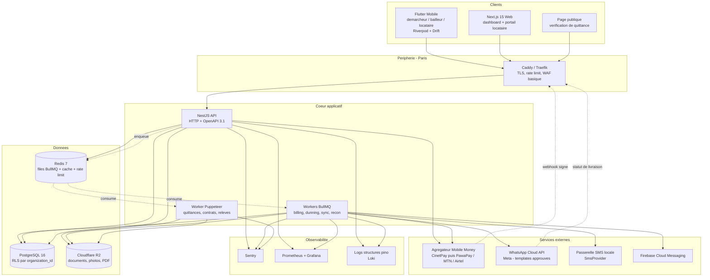

### 1.3 Flux nominal d'un loyer

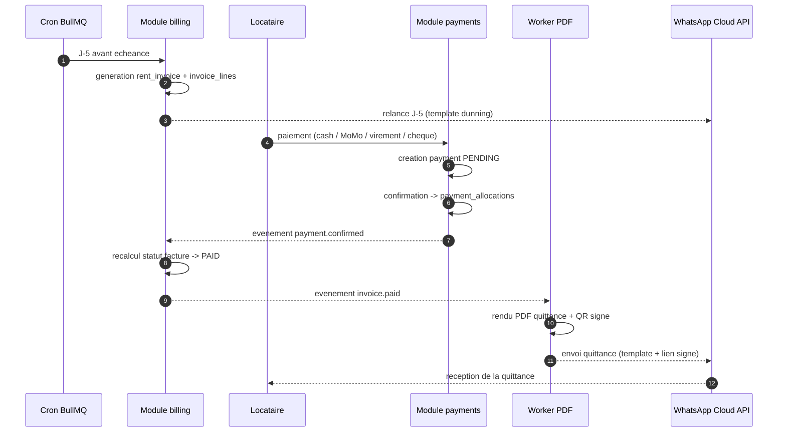

### 1.4 Découpage en processus et dimensionnement initial

| Processus | Rôle | Réplication initiale | Ressources cibles |
| :--- | :--- | :--- | :--- |
| `api` | HTTP, OpenAPI, webhooks entrants | 2 instances | 1 vCPU / 1 Go chacune |
| `worker-general` | billing, dunning, notifications, sync, reconciliation | 2 instances | 1 vCPU / 1 Go |
| `worker-pdf` | Puppeteer / Chromium | 1 instance | 2 vCPU / 2 Go (Chromium est gourmand) |
| `postgres` | Base primaire + réplica logique de secours | 1 primaire | 4 vCPU / 8 Go / SSD NVMe |
| `redis` | BullMQ, cache, compteurs de rate limit | 1 | 1 vCPU / 1 Go, AOF activé |

Le worker PDF est isolé parce que Chromium a un profil mémoire irrégulier : un pic de rendu ne doit jamais faire tomber la génération de factures ou le traitement des webhooks de paiement.

---

## 2. Justification des choix de stack

Cette section justifie les arbitrages du référentiel commun. Elle ne les rouvre pas : elle documente *pourquoi* ils ont été tranchés, afin qu'un développeur qui rejoint le projet comprenne la contrainte plutôt que la préférence.

### 2.1 NestJS 11 + Prisma plutôt que Laravel 12

| Critère | NestJS + Prisma | Laravel + Eloquent | Verdict |
| :--- | :--- | :--- | :--- |
| Langage partagé client/serveur | TypeScript sur API, web, et `packages/shared` (types, enums, schémas zod) | PHP côté serveur, TypeScript côté web : duplication des contrats | **NestJS** |
| Contrat d'API typé de bout en bout | OpenAPI 3.1 généré, clients TS et Dart générés, rupture détectée à la compilation | OpenAPI via annotations tierces, dérive fréquente | **NestJS** |
| Modularité imposée | Modules, providers, injection de dépendances : la Clean Architecture est le chemin naturel | Structure MVC par défaut plate, la discipline repose entièrement sur l'équipe | **NestJS** |
| Migrations et introspection SQL | Prisma Migrate produit du SQL versionné, lisible, revu en PR | Migrations PHP expressives mais moins proches du SQL réel | **NestJS** |
| Files d'attente et cron | BullMQ (Redis) : retries exponentiels, jobs répétables, DLQ, dashboard | Horizon, très bon, mais lié à l'écosystème PHP | Égalité fonctionnelle |
| Vivier de développeurs à Brazzaville | PHP/Laravel plus répandu localement | Avantage réel de Laravel | **Laravel** |
| Rendu PDF | Puppeteer natif dans le même runtime Node | Passerelle vers un service Node de toute façon | **NestJS** |

**Décision.** L'argument décisif est l'unification du contrat : le domaine financier d'Immodesk (montants BIGINT, statuts de paiement, règles d'allocation) doit être exprimé **une seule fois** dans `packages/shared` et consommé sans retranscription par l'API et par le web. Le seul avantage de Laravel — le vivier local — se compense par la formation, alors qu'une duplication de contrat financier se paie en incidents de production.

**Réserve assumée sur Prisma.** Prisma est un client typé, pas un ORM de domaine riche : pas de lazy loading, agrégations SQL limitées, et surtout la RLS demande une attention particulière (§5.3). Nous l'acceptons et compensons par du SQL brut encadré (`$queryRaw` typé) pour les requêtes analytiques et le rapprochement bancaire.

### 2.2 Riverpod + Drift plutôt que BLoC + Hive

| Critère | Riverpod + Drift | BLoC + Hive | Verdict |
| :--- | :--- | :--- | :--- |
| Requêtes locales relationnelles | SQLite : jointures bail ↔ facture ↔ paiement, agrégats de tournée, index | Hive est un store clé-valeur : les jointures se font en Dart, en mémoire | **Drift** |
| Réactivité sur la base locale | `Stream` Drift : l'UI se rafraîchit dès qu'une ligne d'outbox change | Nécessite une couche d'invalidation manuelle | **Drift** |
| Migrations du schéma local | Migrations Drift versionnées et testables | Migrations Hive manuelles, risque de perte de données terrain | **Drift** |
| Chiffrement au repos | `sqlcipher_flutter_libs` : base entièrement chiffrée | Chiffrement par boîte, clé gérée à la main | **Drift** |
| Verbosité | Providers concis, `ref.watch`, invalidation déclarative | Beaucoup d'événements/états à écrire pour un simple formulaire | **Riverpod** |
| Testabilité | `ProviderContainer` avec overrides, sans widget tree | Excellente aussi (`bloc_test`) | Égalité |
| Cache dérivé et dépendances | Providers composables, `family`, `autoDispose` | Composition de BLoC plus lourde | **Riverpod** |

**Décision.** Le mobile Immodesk n'est pas un client REST à cache : c'est une **base de données locale synchronisée** avec un outbox transactionnel. Ce besoin est relationnel (§10.2) et disqualifie un store clé-valeur. Riverpod suit parce qu'il compose naturellement avec les streams Drift et évite la cérémonie BLoC sur les dizaines d'écrans de saisie.

### 2.3 WhatsApp Cloud API (Meta) plutôt qu'Evolution API

| Critère | Cloud API officielle | Evolution API / bridges WhatsApp Web | Verdict |
| :--- | :--- | :--- | :--- |
| Conformité aux CGU Meta | Canal officiel, compte Business vérifié | Automatisation d'un client WhatsApp Web : violation des CGU | **Cloud API** |
| Risque de bannissement | Nul en usage conforme | Élevé — un ban coupe le canal de quittance de toute la clientèle | **Cloud API** |
| SLA et statuts de livraison | Webhooks `sent`/`delivered`/`read`/`failed` normalisés | Best effort, dépend d'une session téléphone active | **Cloud API** |
| Pièces jointes PDF | Supporté nativement (media upload) | Supporté mais instable | **Cloud API** |
| Coût | Facturation Meta par conversation | Quasi nul (hors hébergement) | **Evolution** |
| Messages libres | Fenêtre de service de 24 h, sinon template approuvé | Libre | **Evolution** |
| Délai de mise en route | Vérification Business + approbation des templates : 1 à 3 semaines | Immédiat | **Evolution** |

**Décision.** La quittance de loyer est une **pièce à valeur probante** : son acheminement ne peut pas dépendre d'un canal susceptible d'être coupé du jour au lendemain, ni d'un téléphone qui doit rester appairé. Le surcoût par conversation est intégré au prix de l'abonnement. La contrainte de la fenêtre de 24 h est absorbée par une bibliothèque de templates approuvés (§12.3), ce qui est de toute façon souhaitable pour la cohérence du ton.

### 2.4 Agrégateur Mobile Money plutôt qu'intégration directe MTN / Airtel au démarrage

| Critère | Agrégateur (CinetPay) | Direct MTN MoMo + Airtel Money | Verdict |
| :--- | :--- | :--- | :--- |
| Délai contractuel | Compte marchand en quelques jours | Négociation opérateur par opérateur, plusieurs mois au Congo | **Agrégateur** |
| Surface d'intégration | Une API, un format de webhook | Deux API, deux signatures, deux modèles d'état, deux environnements de test | **Agrégateur** |
| Réconciliation des frais | Frais agrégateur explicites dans la réponse | Grilles opérateur, souvent hors API | **Agrégateur** |
| Coût par transaction | Marge agrégateur au-dessus du coût opérateur | Meilleur taux à volume | **Direct** |
| Dépendance | Point de défaillance unique commercial | Résilience par diversification | **Direct** |
| Couverture multi-pays CEMAC | Immédiate pour l'expansion | À renégocier pays par pays | **Agrégateur** |

**Décision.** Démarrer par l'agrégateur, **mais derrière l'interface `MobileMoneyProvider`** (§8.2.1), ce qui rend le choix réversible. La bascule vers du direct devient rentable au-delà d'un seuil de volume mensuel : elle sera alors une nouvelle implémentation de la même interface, activable par organisation via `feature_flags`, sans modifier une ligne du domaine `payments-mobile-money`.

**Règle non négociable liée.** Quel que soit le fournisseur, un paiement n'est confirmé qu'après **re-interrogation du statut** auprès du fournisseur. Le webhook est un signal de réveil, jamais une preuve.

### 2.5 Hébergement en région Europe (Paris)

| Critère | Paris (Hetzner / OVH / Scaleway) | Afrique du Sud / Nairobi | Congo (datacenter local) |
| :--- | :--- | :--- | :--- |
| Latence depuis Brazzaville | 130–180 ms via câbles WACS/SAT-3 | 180–260 ms (routage souvent via l'Europe) | < 30 ms théorique |
| Disponibilité électrique et réseau | Tier III+, redondance éprouvée | Bonne | Irrégulière, coupures fréquentes |
| Coût au Go et au vCPU | Le plus bas du marché | Moyen à élevé | Élevé |
| Écosystème managé (PostgreSQL, sauvegardes, CDN) | Complet | Partiel | Quasi inexistant |
| Proximité des API tierces (Meta, CinetPay, R2) | Excellente | Moyenne | Moyenne |
| Cadre juridique des données | RGPD, socle exigeant et lisible | Variable | Loi congolaise de 2019 (§13.6) |

**Décision.** Paris. La latence n'est pas le facteur limitant : l'expérience terrain est gouvernée par l'**offline-first mobile**, pas par le RTT serveur, et le web est optimisé pour les connexions lentes (§11.6). L'argument de souveraineté est traité par conformité (§13.6) — consentement, finalité, durée de conservation, droit d'accès — et par la capacité d'exporter l'intégralité des données d'une organisation, pas par la géographie du serveur. Une réplique locale reste envisageable si le cadre réglementaire l'impose (voir ADR-010).

### 2.6 Choix secondaires, en une ligne

| Choix | Raison |
| :--- | :--- |
| **PostgreSQL 16** | RLS native (pilier du multi-tenant), `BIGINT` exact, JSONB pour les payloads bruts, contraintes d'exclusion pour les chevauchements de baux |
| **BullMQ sur Redis** | Retries exponentiels, jobs répétables (cron), DLQ, verrous distribués ; déjà présent pour le cache et le rate limit |
| **Cloudflare R2** | Compatible S3, **pas de frais de sortie** — décisif pour des PDF et photos servis à des mobiles africains |
| **Puppeteer** | Le rendu HTML/CSS est le seul moyen réaliste d'obtenir des quittances typographiquement correctes et modifiables par un non-développeur |
| **Next.js 15 App Router** | Rendu serveur (bundle réduit sur connexion lente), Server Actions pour les mutations simples, streaming |
| **UUID v7** | Ordonnancement temporel (index B-tree performant à l'insertion) tout en restant un UUID standard |
| **ULID pour `client_ref`** | Généré hors ligne sur l'appareil, triable, court, lisible dans les logs de synchronisation |

---

## 3. Structure du monorepo et outillage

### 3.1 Arborescence

```text
immodesk/
├── apps/
│   ├── api/                             # NestJS 11 — API HTTP + workers
│   │   ├── prisma/
│   │   │   ├── schema.prisma
│   │   │   ├── migrations/
│   │   │   │   └── 20260101000000_init/migration.sql
│   │   │   ├── rls/                     # policies RLS, appliquées par migration
│   │   │   │   ├── 001_enable_rls.sql
│   │   │   │   └── 002_policies.sql
│   │   │   └── seed/
│   │   │       ├── demo-brazzaville.ts  # jeu de démo congolais
│   │   │       └── reference-data.ts    # devises, types de bien, quartiers
│   │   ├── src/
│   │   │   ├── main.ts                  # bootstrap API
│   │   │   ├── worker.ts                # bootstrap workers BullMQ
│   │   │   ├── pdf-worker.ts            # bootstrap worker Puppeteer
│   │   │   ├── app.module.ts
│   │   │   ├── config/                  # chargement + validation zod de l'env
│   │   │   ├── common/
│   │   │   │   ├── errors/              # ImmodeskError, codes stables, mapping HTTP
│   │   │   │   ├── pagination/          # curseur opaque, encodage base64url
│   │   │   │   ├── money/               # Money (BIGINT XAF), jamais de float
│   │   │   │   ├── ids/                 # uuidv7(), ulid(), validation
│   │   │   │   ├── audit/               # décorateur @Audited + intercepteur
│   │   │   │   ├── idempotency/         # garde Idempotency-Key / client_ref
│   │   │   │   ├── tenancy/             # AsyncLocalStorage du contexte org
│   │   │   │   └── events/              # bus d'événements de domaine
│   │   │   ├── infrastructure/
│   │   │   │   ├── prisma/              # PrismaService + extension RLS
│   │   │   │   ├── redis/
│   │   │   │   ├── queue/               # déclaration des files BullMQ
│   │   │   │   ├── storage/             # adaptateur R2 (S3 compatible)
│   │   │   │   ├── sms/                 # implémentations SmsProvider
│   │   │   │   ├── whatsapp/            # client Cloud API + templates
│   │   │   │   ├── mobile-money/        # cinetpay/, pawapay/, mtn/, airtel/
│   │   │   │   ├── pdf/                 # pool Puppeteer, Handlebars
│   │   │   │   └── telemetry/           # pino, Sentry, métriques Prometheus
│   │   │   └── modules/
│   │   │       ├── identity/
│   │   │       ├── organizations/
│   │   │       ├── parties/
│   │   │       ├── portfolio/
│   │   │       ├── leases/
│   │   │       ├── billing/
│   │   │       ├── payments-cash/
│   │   │       ├── payments-mobile-money/
│   │   │       ├── payments-bank/
│   │   │       ├── reconciliation/
│   │   │       ├── receipts/
│   │   │       ├── agency-accounting/
│   │   │       ├── inspections/
│   │   │       ├── maintenance/
│   │   │       ├── notifications/
│   │   │       ├── documents/
│   │   │       ├── sync/
│   │   │       ├── audit/
│   │   │       └── subscriptions/
│   │   ├── test/
│   │   │   ├── e2e/                     # supertest
│   │   │   ├── integration/             # testcontainers PostgreSQL
│   │   │   └── fixtures/
│   │   └── package.json
│   │
│   ├── web/                             # Next.js 15 App Router
│   │   ├── src/
│   │   │   ├── app/
│   │   │   │   ├── (public)/
│   │   │   │   │   ├── verifier/[token]/page.tsx   # vérification de quittance
│   │   │   │   │   └── connexion/page.tsx
│   │   │   │   ├── (dashboard)/
│   │   │   │   │   └── [orgSlug]/
│   │   │   │   │       ├── layout.tsx              # garde de rôle + shell
│   │   │   │   │       ├── tableau-de-bord/
│   │   │   │   │       ├── biens/
│   │   │   │   │       ├── baux/
│   │   │   │   │       ├── factures/
│   │   │   │   │       ├── encaissements/
│   │   │   │   │       ├── rapprochement/
│   │   │   │   │       ├── gerance/
│   │   │   │   │       ├── relances/
│   │   │   │   │       └── parametres/
│   │   │   │   ├── (tenant-portal)/
│   │   │   │   │   └── mon-espace/
│   │   │   │   └── api/                            # BFF minimal (cookies, upload)
│   │   │   ├── components/ui/                      # shadcn/ui
│   │   │   ├── features/                           # un dossier par domaine métier
│   │   │   ├── lib/
│   │   │   │   ├── api-client/                     # client généré depuis OpenAPI
│   │   │   │   ├── auth/                           # session serveur, cookies
│   │   │   │   └── query/                          # TanStack Query
│   │   │   └── i18n/fr-CG/
│   │   ├── e2e/                                    # Playwright
│   │   └── package.json
│   │
│   └── mobile/                          # Flutter 3.x, melos
│       ├── melos.yaml
│       ├── apps/immodesk_app/
│       │   └── lib/
│       │       ├── main.dart
│       │       ├── app/                 # go_router, thème, bootstrap
│       │       └── features/
│       │           ├── auth/
│       │           ├── collection/      # encaissement terrain
│       │           ├── leases/
│       │           ├── inspections/
│       │           ├── remittances/
│       │           └── tenant/          # espace locataire
│       └── packages/
│           ├── core_domain/             # entités, value objects, erreurs
│           ├── core_data/               # Drift, outbox, repositories
│           ├── core_sync/               # SyncEngine, résolution de conflits
│           ├── core_network/            # dio, interceptors, client généré
│           └── core_ui/                 # design system partagé
│
├── packages/
│   └── shared/                          # TypeScript, consommé par api et web
│       ├── src/
│       │   ├── enums/                   # PaymentMethod, PaymentStatus, Role…
│       │   ├── schemas/                 # schémas zod (source de vérité)
│       │   ├── errors/                  # catalogue des codes d'erreur métier
│       │   ├── money/                   # formatage XAF, arrondi, parsing
│       │   ├── dates/                   # helpers Africa/Brazzaville
│       │   └── permissions/             # matrice permissions × rôles
│       └── package.json
│
├── infra/
│   ├── docker/
│   │   ├── docker-compose.dev.yml
│   │   ├── api.Dockerfile
│   │   ├── worker.Dockerfile
│   │   └── pdf-worker.Dockerfile
│   ├── caddy/Caddyfile
│   ├── postgres/
│   │   ├── pgbackrest.conf
│   │   └── tuning.conf
│   ├── grafana/dashboards/
│   ├── prometheus/prometheus.yml
│   └── scripts/
│       ├── restore-drill.sh             # exercice de restauration trimestriel
│       └── rotate-secrets.sh
│
├── docs/
│   ├── _DECISIONS_COMMUNES.md
│   ├── 02_architecture_technique.md     # ce document
│   └── adr/
│       ├── 0000-template.md
│       └── 0001-monolithe-modulaire-nestjs.md
│
├── .github/workflows/
│   ├── ci.yml
│   ├── deploy-staging.yml
│   ├── deploy-production.yml
│   └── security.yml
│
├── package.json
├── pnpm-workspace.yaml
├── turbo.json
├── .eslintrc.cjs
├── .prettierrc
├── commitlint.config.cjs
└── .husky/
```

### 3.2 Outillage JavaScript / TypeScript

| Outil | Version cible | Rôle |
| :--- | :--- | :--- |
| **pnpm workspaces** | ≥ 9 | Gestion des dépendances, store dur (économie de disque et de bande passante, non négligeable en CI) |
| **Turborepo** | ≥ 2 | Orchestration des tâches, cache local et distant, graphe de dépendances entre `api`, `web`, `shared` |
| **TypeScript** | 5.x, `strict: true` | `noUncheckedIndexedAccess` et `exactOptionalPropertyTypes` activés |
| **ESLint** | 9 (flat config) | Règles partagées + **règles de frontière d'architecture** (§4.3) via `eslint-plugin-boundaries` |
| **Prettier** | 3 | Formatage unique, non discutable en revue |
| **Vitest** | 2 | Tests unitaires du domaine (rapides, sans base) |
| **Jest + supertest** | — | Tests e2e API (l'écosystème NestJS y est mieux outillé) |
| **Testcontainers** | — | PostgreSQL 16 réel pour les tests d'intégration Prisma et de RLS |
| **Husky + lint-staged** | — | Hooks pre-commit (format + lint sur les fichiers modifiés) et pre-push (typecheck + tests unitaires) |
| **commitlint** | — | Conventional Commits obligatoires |
| **Changesets** | — | Versionnement de `packages/shared` et génération du CHANGELOG |

`turbo.json` définit trois pipelines clés :

```json
{
  "tasks": {
    "build": { "dependsOn": ["^build"], "outputs": ["dist/**", ".next/**"] },
    "lint": { "dependsOn": ["^build"] },
    "typecheck": { "dependsOn": ["^build"] },
    "test:unit": { "dependsOn": ["^build"], "outputs": ["coverage/**"] },
    "test:integration": { "dependsOn": ["^build"], "cache": false },
    "openapi:generate": { "dependsOn": ["^build"], "outputs": ["openapi.json"] }
  }
}
```

### 3.3 Outillage Flutter

| Outil | Rôle |
| :--- | :--- |
| **melos** | Orchestration du multi-package Dart : `melos bootstrap`, `melos run analyze`, `melos run test` |
| **build_runner** | Génération Drift, `freezed`, `json_serializable`, Riverpod generator |
| **very_good_analysis** | Jeu de règles `analysis_options.yaml`, strict |
| **openapi-generator (dart-dio)** | Client Dart généré depuis `openapi.json` de l'API — jamais écrit à la main |
| **flutter_test / integration_test** | Widget tests et parcours critiques |
| **fastlane** | Build et publication Play Store / TestFlight depuis GitHub Actions |

### 3.4 Convention de commits

Format Conventional Commits, portée obligatoire correspondant à un module ou une application :

```text
feat(payments-mobile-money): re-verification du statut avant confirmation
fix(billing): prorata de sortie exclut le jour de restitution des cles
chore(infra): montee de PostgreSQL 16.4
docs(adr): ADR-004 agregateur Mobile Money
```

Types autorisés : `feat`, `fix`, `perf`, `refactor`, `test`, `docs`, `build`, `ci`, `chore`, `revert`.
Portées autorisées : les noms de modules du §4.1, plus `api`, `web`, `mobile`, `shared`, `infra`, `adr`.

Une PR qui touche une règle financière doit citer dans son corps l'invariant concerné (§15.6).


---

## 4. Architecture du backend

### 4.1 Carte des modules

Un module = un domaine métier, un dossier sous `apps/api/src/modules/`, un propriétaire de tables. **Une table a un et un seul module propriétaire** : lui seul l'écrit. Les autres modules la lisent via une façade applicative exposée par le propriétaire, jamais via `prisma.<table>` directement.

| Module | Responsabilités | Tables possédées | Événements émis / consommés | Dépendances autorisées |
| :--- | :--- | :--- | :--- | :--- |
| `identity` | Comptes utilisateurs globaux, OTP, sessions, jetons, clés API | `users`, `user_credentials`, `otp_codes`, `refresh_tokens`, `api_keys` | émet `user.registered`, `user.session_revoked` | `notifications` (port `OtpSender`) |
| `organizations` | Tenants, adhésions, rôles, paramètres, invitations, drapeaux | `organizations`, `organization_settings`, `organization_members`, `invitations`, `feature_flags` | émet `organization.created`, `member.role_changed` ; consomme `user.registered` | `identity`, `notifications` |
| `parties` | Bailleurs, locataires, garants, canaux de contact | `landlords`, `tenants`, `guarantors`, `contact_channels` | émet `tenant.created`, `contact_channel.verified` | `organizations`, `documents` |
| `portfolio` | Biens, lots, comptes bancaires, compteurs, relevés, tarifs | `properties`, `units`, `bank_accounts`, `meters`, `meter_readings`, `utility_tariffs` | émet `unit.status_changed`, `meter_reading.recorded` | `organizations`, `parties`, `documents` |
| `leases` | Mandats de gestion, baux, parties au bail, dépôts de garantie | `management_mandates`, `leases`, `lease_parties`, `lease_documents`, `deposits`, `deposit_movements` | émet `lease.activated`, `lease.terminated`, `deposit.movement_recorded` ; consomme `unit.status_changed` | `portfolio`, `parties`, `documents` |
| `billing` | Factures de loyer, lignes, pénalités, numérotation, cron mensuel | `rent_invoices`, `invoice_lines`, `penalty_rules`, `sequences`, `tenant_credits` | émet `invoice.issued`, `invoice.paid`, `invoice.overdue`, `invoice.cancelled` ; consomme `lease.activated`, `lease.terminated`, `payment.confirmed`, `payment.reversed`, `meter_reading.recorded` | `leases`, `portfolio` |
| `payments-cash` | Encaissement espèces, reçus signés, remises des démarcheurs | `cash_receipts`, `cash_remittances`, `cash_remittance_items` | émet `payment.confirmed`, `remittance.closed`, `remittance.discrepancy_detected` | `payments` (noyau partagé), `billing`, `documents` |
| `payments-mobile-money` | Initiation MoMo, webhooks, re-vérification, frais, rattrapage | `mobile_money_transactions`, `webhook_events` | émet `payment.initiated`, `payment.confirmed`, `payment.rejected` | `payments`, `billing` |
| `payments-bank` | Déclarations de virement, chèques, cycle de compensation | `bank_transfer_declarations`, `bank_checks` | émet `payment.pending_verification`, `payment.confirmed`, `payment.rejected` | `payments`, `billing`, `documents`, `portfolio` |
| `payments` (noyau) | Agrégat `payment`, allocations, machine à états, idempotence | `payments`, `payment_allocations`, `idempotency_keys` | émet `payment.confirmed`, `payment.reversed`, `payment.allocated` | `billing` (lecture seule via façade) |
| `reconciliation` | Import de relevés (CSV / MT940), rapprochement 3 niveaux | `bank_statements`, `bank_statement_lines`, `reconciliation_matches` | émet `statement.imported`, `match.confirmed` ; consomme `payment.pending_verification` | `payments-bank`, `portfolio` |
| `receipts` | Quittances : émission, numérotation, token QR, vérification publique | `receipts` | émet `receipt.generated` ; consomme `invoice.paid`, `payment.confirmed` | `billing`, `documents`, `notifications` |
| `agency-accounting` | Dépenses, commissions, relevés de gérance, reversements bailleurs | `expenses`, `commissions`, `owner_statements`, `owner_statement_lines`, `owner_payouts` | émet `owner_statement.closed`, `owner_payout.executed` ; consomme `payment.confirmed`, `invoice.paid` | `leases`, `parties`, `documents` |
| `inspections` | États des lieux d'entrée et de sortie, postes, photos | `inspections`, `inspection_items`, `inspection_photos` | émet `inspection.signed` ; consomme `lease.activated`, `lease.terminated` | `leases`, `portfolio`, `documents` |
| `maintenance` | Demandes d'intervention, suivi, imputation bailleur / locataire | `maintenance_requests`, `maintenance_updates` | émet `maintenance.created`, `maintenance.resolved` | `portfolio`, `leases`, `notifications` |
| `notifications` | Templates, envois WhatsApp / SMS / push, relances, journalisation | `notification_templates`, `notifications`, `message_logs`, `dunning_rules`, `dunning_runs` | consomme la quasi-totalité des événements métier ; émet `message.delivered`, `message.failed` | aucune (module feuille, ports sortants uniquement) |
| `documents` | Dépôt R2, URLs signées, antivirus, cycle de vie des fichiers | `documents` | émet `document.uploaded`, `document.deleted` | aucune (module feuille) |
| `sync` | Lots de synchronisation mobile, rejeu idempotent, conflits | `sync_batches` | consomme les commandes des modules cibles via façades | tous les modules (orchestrateur, en écriture par façade uniquement) |
| `audit` | Journal append-only des transitions d'état, traçabilité | `audit_logs` | consomme tous les événements de domaine | aucune (module feuille) |
| `subscriptions` | Plans SaaS, abonnements des organisations, facturation Immodesk | `subscription_plans`, `subscriptions`, `subscription_invoices` | émet `subscription.activated`, `subscription.suspended` | `organizations`, `documents`, `notifications` |
| `referrals` | Partenaires d'apport d'affaires, qualification des filleuls, cumul et approbation des commissions, versements groupés | `referral_programs`, `referral_partners`, `referrals`, `referral_commissions`, `referral_payouts` | émet `referral.qualified`, `referral_commission.accrued` ; consomme `subscription_invoice.paid` | `subscriptions`, `notifications`, `payments-mobile-money` |

Trois règles de lecture de ce tableau :

1. `payments` est un **noyau partagé** entre les trois modules d'encaissement. Il détient l'agrégat `payment` et sa machine à états (§8.5) ; `payments-cash`, `payments-mobile-money` et `payments-bank` sont des *adaptateurs de mode* qui produisent des transitions via sa façade. Aucun d'eux n'écrit dans `payments`.
2. `notifications`, `documents` et `audit` sont des **modules feuilles** : ils ne dépendent d'aucun module métier. C'est ce qui rend possible leur consommation d'événements sans créer de cycle.
3. `sync` est le seul module autorisé à dépendre de tous les autres, et exclusivement en écriture par façade applicative. Il ne contient aucune règle métier : il rejoue des commandes.

### 4.2 Les quatre couches

Chaque module reproduit la même structure en couches. La dépendance va **toujours vers l'intérieur** :

```text
presentation  ──▶  application  ──▶  domain  ◀──  infrastructure
```

| Couche | Contient | Ne contient jamais |
| :--- | :--- | :--- |
| `domain/` | Entités, value objects (`Money`, `PhoneNumber`, `InvoicePeriod`), règles d'invariant, machines à états, événements de domaine, **ports** (interfaces de repository et de service externe) | Aucun import de `@nestjs/*`, `@prisma/client`, `axios`, `bullmq`. Zéro dépendance technique. |
| `application/` | Commandes, requêtes, handlers, orchestration transactionnelle, façade exposée aux autres modules | SQL, HTTP, DTO de transport, décorateurs Swagger |
| `infrastructure/` | Implémentations Prisma des ports, clients HTTP, producteurs BullMQ, mappers entité ↔ ligne | Règle métier. Une implémentation qui contient un `if` métier est un bug de conception. |
| `presentation/` | Contrôleurs NestJS, DTO d'entrée/sortie, décorateurs OpenAPI, gardes, mapping erreur → HTTP | Accès direct à Prisma, logique de calcul |

Le `domain/` est testable par Vitest sans base ni conteneur : c'est le critère de validation de la couche. Si un test de domaine réclame PostgreSQL, la règle est au mauvais endroit.

### 4.3 Frontières et interdictions d'import

Les frontières sont **mécanisées**, pas conventionnelles. `eslint-plugin-boundaries` échoue la CI sur violation.

```js
// .eslintrc.cjs — extrait
'boundaries/element-types': ['error', {
  default: 'disallow',
  rules: [
    { from: 'domain',         allow: ['domain', 'shared'] },
    { from: 'application',    allow: ['domain', 'application', 'shared'] },
    { from: 'infrastructure', allow: ['domain', 'infrastructure', 'shared', 'common'] },
    { from: 'presentation',   allow: ['application', 'domain', 'shared', 'common'] },
    { from: 'module',         allow: ['module-facade', 'shared', 'common'] },
  ],
}]
```

Interdictions explicites, vérifiées en revue et par le linter :

| Interdit | Raison |
| :--- | :--- |
| `import { PrismaService }` dans `domain/` ou `application/` | La couche applicative orchestre des ports, elle n'écrit pas de SQL |
| `import ... from '../../billing/infrastructure/...'` | Franchir la frontière d'un autre module ailleurs que par sa façade `BillingFacade` |
| Import croisé entre deux modules qui se citent mutuellement | Un cycle de modules interdit toute extraction ultérieure ; le découplage passe par un événement |
| `import { PrismaClient }` hors de `infrastructure/prisma/` | Toute connexion doit passer par le client étendu qui pose le contexte RLS (§5.3) |
| Import d'un type Prisma généré dans une signature de façade publique | La façade expose des types de `packages/shared`, jamais le schéma physique |
| `number` pour un montant | Les montants sont `bigint` XAF de bout en bout, encapsulés dans `Money` |


---

### 4.4 CQRS léger

Pas de bus CQRS complet, pas d'*event sourcing*, pas de base de lecture séparée. On retient uniquement la **séparation des chemins** :

- **Commandes** (`application/commands/`) : muter l'état, retourner un identifiant ou rien, toujours transactionnelles, toujours auditées, toujours idempotentes lorsqu'elles sont exposées au mobile.
- **Requêtes** (`application/queries/`) : lecture seule, autorisées à contourner les entités de domaine et à utiliser `$queryRaw` typé pour projeter directement le DTO de sortie (tableaux de bord, balances âgées, rapprochement).

```ts
// modules/billing/application/commands/issue-invoice.command.ts
export class IssueInvoiceCommand {
  constructor(
    readonly leaseId: string,
    readonly period: InvoicePeriod,
    readonly clientRef?: string, // idempotence mobile
  ) {}
}
```

Les handlers sont de simples providers NestJS injectés par le contrôleur ou par la façade. Un handler de commande n'appelle jamais un autre handler de commande d'un autre module : il émet un événement.

### 4.5 Événements de domaine

Les événements sont des faits au passé, immuables, nommés `<agrégat>.<fait>`, versionnés par un champ `version`. Ils portent toujours `organizationId`, `occurredAt` et `correlationId`.

```ts
// packages/shared/src/events/payment-confirmed.event.ts
export interface PaymentConfirmedEvent {
  name: 'payment.confirmed';
  version: 1;
  organizationId: string;
  correlationId: string;
  occurredAt: string;          // ISO 8601, UTC
  payload: {
    paymentId: string;
    method: PaymentMethod;
    amount: string;            // bigint sérialisé en chaîne
    currency: 'XAF';
    allocations: Array<{ invoiceId: string; amount: string }>;
  };
}
```

**Deux temps de propagation, une seule API pour le producteur.** Le module émetteur appelle `eventBus.publish(event)`. Le bus décide du transport :

| Type d'abonné | Transport | Garantie | Exemple |
| :--- | :--- | :--- | :--- |
| Synchrone, dans la transaction | `EventEmitter2` appelé **après** commit via un outbox mémoire | Au plus une fois, même processus | Recalcul du statut d'une facture après allocation |
| Asynchrone, hors transaction | Job BullMQ (`domain-events`), payload = l'événement | Au moins une fois, retries exponentiels, DLQ | Génération PDF de quittance, envoi WhatsApp, écriture d'audit |

**Règle d'ordre.** Aucun événement n'est publié avant le `COMMIT`. Les événements produits pendant la transaction sont accumulés dans le contexte `AsyncLocalStorage` et vidés par un `onCommit` hook. Un rollback les jette. Cela évite le cas classique « la quittance est envoyée alors que le paiement n'a jamais été écrit ».

Les abonnés BullMQ doivent être **idempotents** : la clé de déduplication est `${event.name}:${correlationId}` en Redis, TTL 7 jours.

### 4.6 Transactions Prisma, isolation et RLS

Toute écriture financière est encapsulée dans une transaction interactive qui pose d'abord le contexte de tenancy.

```ts
// infrastructure/prisma/transactional.runner.ts
await this.prisma.$transaction(
  async (tx) => {
    await tx.$executeRaw`SELECT set_config('app.current_organization_id', ${orgId}, true)`;
    await tx.$executeRaw`SELECT set_config('app.current_user_id', ${userId}, true)`;
    const result = await work(tx);
    collectEvents(result);           // publiés après commit uniquement
    return result;
  },
  {
    isolationLevel: Prisma.TransactionIsolationLevel.ReadCommitted,
    timeout: 15_000,
    maxWait: 5_000,
  },
);
```

Le troisième argument `true` de `set_config` équivaut à `SET LOCAL` : la valeur est **portée par la transaction** et disparaît au commit ou au rollback. C'est indispensable avec un pool de connexions — sans cela, une connexion recyclée conserverait le tenant du requêteur précédent.

| Situation | Niveau d'isolation | Justification |
| :--- | :--- | :--- |
| Écriture courante (facture, allocation, quittance) | `READ COMMITTED` | Suffisant : les invariants sont protégés par des contraintes et des verrous de ligne explicites |
| Attribution d'un numéro de séquence | `READ COMMITTED` + `SELECT ... FOR UPDATE` sur `sequences` | Sérialise les concurrents sur la seule ligne du compteur, sans pénaliser le reste |
| Clôture d'une remise de caisse, clôture d'un relevé de gérance | `SERIALIZABLE` | Agrégation d'un ensemble de lignes dont la composition ne doit pas changer sous les pieds ; retry automatique sur `40001` |
| Rapprochement bancaire automatique | `REPEATABLE READ` | Le lot de lignes candidates doit être stable pendant tout l'algorithme de matching |

Trois règles complémentaires : pas d'appel réseau (Mobile Money, WhatsApp, R2) à l'intérieur d'une transaction ; une transaction de plus de 15 s est annulée et remontée en incident ; toute transaction en `SERIALIZABLE` est retentée jusqu'à 3 fois sur erreur de sérialisation, avec *jitter*.


---

### 4.7 Codes d'erreur métier stables

Le catalogue vit dans `packages/shared/src/errors/` (en phase 0, dans `apps/api/src/shared/errors/`, à déplacer dès que le web le consomme). L'enveloppe est plate, conforme à `docs/api/phase0-contract.md`. Un code est un **contrat public** : il est consommé par le web, par le mobile hors ligne et par les intégrateurs. On peut modifier son message, jamais son identifiant.

```ts
throw new ImmodeskError('BILLING.INVOICE_ALREADY_PAID', {
  httpStatus: 409,
  details: { invoiceId, paidAt },
});
```

Réponse HTTP normalisée :

```json
{
  "code": "BILLING.INVOICE_ALREADY_PAID",
  "message": "Cette facture est déjà soldée.",
  "details": { "invoiceId": "018f...", "paidAt": "2026-03-05T09:12:00Z" },
  "correlationId": "01HZX..."
}
```

| Code | HTTP | Message `fr-CG` |
| :--- | :--- | :--- |
| `IAM.OTP_INVALID` | 401 | Code de vérification incorrect. |
| `IAM.OTP_TOO_MANY_ATTEMPTS` | 429 | Trop de tentatives. Réessayez dans %{minutes} minutes. |
| `IAM.SESSION_REVOKED` | 401 | Votre session a été fermée. Reconnectez-vous. |
| `TENANCY.ORGANIZATION_MISMATCH` | 403 | Cette ressource n'appartient pas à votre organisation. |
| `RBAC.PERMISSION_DENIED` | 403 | Votre rôle ne permet pas cette action. |
| `BILLING.PERIOD_ALREADY_INVOICED` | 409 | Une facture existe déjà pour ce bail sur cette période. |
| `BILLING.INVOICE_ALREADY_PAID` | 409 | Cette facture est déjà soldée. |
| `BILLING.METER_READING_MISSING` | 422 | Relevé de compteur manquant pour la période. |
| `PAYMENT.AMOUNT_EXCEEDS_BALANCE` | 422 | Le montant dépasse le solde restant dû. |
| `PAYMENT.ALREADY_CONFIRMED` | 409 | Ce paiement est déjà confirmé. |
| `PAYMENT.PROVIDER_UNAVAILABLE` | 503 | Opérateur momentanément indisponible. Réessayez. |
| `MOMO.STATUS_MISMATCH` | 409 | Le statut opérateur ne confirme pas ce paiement. |
| `CASH.REMITTANCE_DISCREPANCY` | 422 | Écart entre les reçus et le montant remis. |
| `BANK.DUPLICATE_PROOF` | 409 | Cette preuve de virement a déjà été déposée. |
| `SYNC.CLIENT_REF_CONFLICT` | 409 | Cette opération a déjà été enregistrée. |
| `SUBSCRIPTION.QUOTA_EXCEEDED` | 402 | Votre formule ne permet pas d'ajouter ce lot. |

Un test de non-régression parcourt le catalogue et échoue si un code disparaît ou change de statut HTTP entre deux versions de `packages/shared`.

### 4.8 Validation : zod partagé, class-validator en bordure

La **source de vérité** est le schéma zod de `packages/shared/src/schemas/` : il est consommé par l'API, par les formulaires web (`react-hook-form` + résolveur zod) et exporté en JSON Schema pour la génération Dart.

```ts
// packages/shared/src/schemas/cash-receipt.schema.ts
export const createCashReceiptSchema = z.object({
  leaseId: z.string().uuid(),
  amount: z.coerce.bigint().positive(),         // XAF, jamais de décimale
  collectedAt: z.string().datetime(),
  clientRef: z.string().ulid(),
  signaturePng: z.string().base64().max(512_000),
});
export type CreateCashReceiptInput = z.infer<typeof createCashReceiptSchema>;
```

Côté NestJS, un `ZodValidationPipe` global valide le corps, les paramètres et la requête avant le contrôleur, et convertit toute `ZodError` en `VALIDATION.INVALID_PAYLOAD` (HTTP 422) avec le détail par champ. **class-validator n'est conservé que sur les DTO de présentation** — pour alimenter la génération OpenAPI via `@nestjs/swagger`, qui ne sait pas lire zod. Les deux ne doivent jamais exprimer la même règle : le DTO décrit la forme du transport, zod décrit la règle métier.

### 4.9 Pagination par curseur

Aucun `OFFSET` sur les listes métier : les jeux de données croissent, et un `OFFSET 50000` sur `payments` est une régression garantie. Toutes les collections paginent par curseur opaque, encodé base64url.

```
GET /v1/payments?limit=50&cursor=eyJpZCI6IjAxOGYuLi4iLCJjIjoiMjAyNi0wMy0wNVQwOToxMjowMFoifQ
```

```json
{
  "data": [ /* ... */ ],
  "pageInfo": { "nextCursor": "eyJpZCI6...", "hasNextPage": true, "limit": 50 }
}
```

Le curseur encode le couple `(createdAt, id)`, jamais un simple offset ; le tri est systématiquement `ORDER BY created_at DESC, id DESC` avec un index composite `(organization_id, created_at DESC, id DESC)`. `limit` est plafonné à 100 (200 pour les exports authentifiés par clé API). Le curseur est signé par HMAC afin qu'il ne puisse pas être forgé pour sauter la frontière de tenant.

### 4.10 Arborescence type d'un module

```text
modules/payments-cash/
├── payments-cash.module.ts
├── domain/
│   ├── entities/cash-receipt.entity.ts
│   ├── entities/cash-remittance.entity.ts
│   ├── value-objects/receipt-number.vo.ts
│   ├── events/remittance-closed.event.ts
│   ├── services/remittance-balance.service.ts     # règle pure de contrôle d'écart
│   └── ports/
│       ├── cash-receipt.repository.ts
│       └── signature-storage.port.ts
├── application/
│   ├── commands/record-cash-receipt.{command,handler}.ts
│   ├── commands/close-remittance.{command,handler}.ts
│   ├── queries/list-collector-receipts.{query,handler}.ts
│   └── payments-cash.facade.ts                    # seule surface publique du module
├── infrastructure/
│   ├── prisma/cash-receipt.prisma.repository.ts
│   ├── prisma/mappers/cash-receipt.mapper.ts
│   └── storage/r2-signature.adapter.ts
├── presentation/
│   ├── cash-receipts.controller.ts
│   ├── dto/create-cash-receipt.dto.ts
│   └── dto/cash-receipt.response.ts
└── __tests__/
    ├── remittance-balance.spec.ts                 # Vitest, sans base
    └── record-cash-receipt.integration.spec.ts    # testcontainers
```

Le fichier `payments-cash.facade.ts` est le seul export du `index.ts` du module. Tout le reste est privé, et le linter le vérifie.

---


---

## 5. Multi-tenant

### 5.1 Modèle retenu

**Base unique, schéma unique, isolation par ligne.** Chaque table métier porte `organization_id UUID NOT NULL` et une policy Row Level Security. Ce choix — plutôt qu'un schéma ou une base par tenant — tient à trois raisons : les migrations sont uniques (une agence de trois lots et une de huit cents partagent le même DDL), les requêtes transverses de la plateforme restent possibles, et le coût d'exploitation reste celui d'une seule instance PostgreSQL.

La RLS n'est pas une optimisation : c'est le **dernier rempart**. Le filtrage applicatif peut être oublié dans une requête ; la policy, elle, ne l'est jamais. Un `SELECT * FROM payments` sans `WHERE` exécuté par le rôle applicatif ne retourne que les paiements du tenant courant.

### 5.2 Résolution de l'organisation

Un utilisateur appartenant à plusieurs organisations doit dire laquelle il utilise. La résolution suit un ordre strict :

| Rang | Source | Cas d'usage |
| :--- | :--- | :--- |
| 1 | En-tête `X-Organization-Id` | Web et mobile : bascule d'organisation sans reconnexion |
| 2 | Revendication `org` du JWT d'accès | Session mono-organisation, jetons de service |
| 3 | Organisation par défaut de l'utilisateur (`users.default_organization_id`) | Première requête après connexion |

**Invariant.** Si l'en-tête est présent, il doit correspondre à une adhésion active de l'utilisateur (`organization_members` avec `status = 'ACTIVE'`), sinon `TENANCY.ORGANIZATION_MISMATCH` (403). Si le JWT porte déjà un `org` et que l'en-tête en désigne un autre, l'en-tête gagne **uniquement** après revérification de l'adhésion en base ; le rôle effectif est alors relu, jamais repris du jeton.

L'adhésion résolue (`organizationId`, `role`, `permissions`) est mise en cache Redis 60 secondes, clé `member:{userId}:{orgId}`, invalidée par l'événement `member.role_changed`.

### 5.3 Propagation à PostgreSQL

La chaîne complète, du HTTP au SQL :

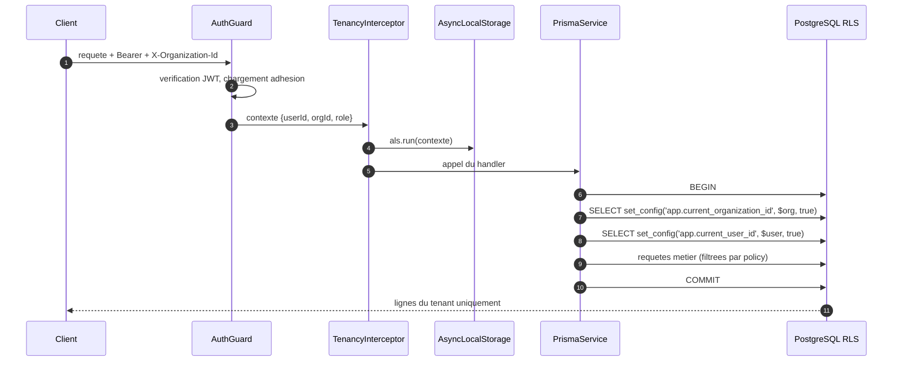

Le contexte transite par `AsyncLocalStorage` (`common/tenancy/`) et non par un paramètre de fonction : cela évite de faire traverser `organizationId` à toutes les signatures, y compris dans les repositories. Une extension du client Prisma (`$extends`) intercepte chaque opération et refuse de s'exécuter si le contexte est absent, sauf sur une liste blanche explicite de tables globales.

```sql
-- prisma/rls/002_policies.sql (motif appliqué à chaque table métier)
ALTER TABLE payments ENABLE ROW LEVEL SECURITY;
ALTER TABLE payments FORCE ROW LEVEL SECURITY;   -- s'applique aussi au proprietaire

CREATE POLICY tenant_isolation ON payments
  USING      (organization_id = current_setting('app.current_organization_id', true)::uuid)
  WITH CHECK (organization_id = current_setting('app.current_organization_id', true)::uuid);
```

`FORCE ROW LEVEL SECURITY` est obligatoire : sans lui, le rôle propriétaire des tables — celui qu'utilise Prisma Migrate — contournerait silencieusement les policies. Le rôle applicatif runtime (`immodesk_app`) est distinct du rôle de migration (`immodesk_migrator`) et n'est ni `SUPERUSER` ni `BYPASSRLS`.

**Workers BullMQ.** Un job n'a pas de requête HTTP : le `organizationId` est un champ obligatoire du payload de tout job, et le `TenancyJobWrapper` ouvre le même contexte avant d'appeler le processeur. Un job sans `organizationId` est rejeté à l'enfilement, pas à l'exécution.

### 5.4 Données globales

Cinq catégories échappent à la RLS, et la liste est fermée :

| Table | Statut | Contrôle d'accès |
| :--- | :--- | :--- |
| `users`, `user_credentials`, `otp_codes`, `refresh_tokens` | Globales — un utilisateur existe indépendamment des organisations | Filtrage applicatif par `user_id` du jeton ; jamais exposées en liste |
| `organizations` | Globale, lue par le porteur d'une adhésion | Policy fondée sur l'existence d'une ligne `organization_members` |
| `subscription_plans`, référentiels (quartiers, types de bien, devises) | Publiques en lecture | Lecture seule, écriture réservée aux migrations |
| `webhook_events` | Globale à l'ingestion (le tenant n'est connu qu'après résolution du payload) | Table non exposée par l'API ; résolution puis rattachement |
| `audit_logs` | Porte `organization_id`, mais **append-only** | RLS en lecture, `INSERT` seul autorisé, aucun `UPDATE`/`DELETE` (révoqué au niveau du rôle) |

### 5.5 Tests d'isolation obligatoires

Aucune table métier n'est fusionnée sans son test d'isolation. La CI échoue si une table portant `organization_id` n'apparaît pas dans la matrice du test générique.

```ts
// test/integration/tenancy/isolation.spec.ts
describe('isolation multi-tenant', () => {
  it("l'organisation B ne voit aucun paiement de l'organisation A", async () => {
    const paymentA = await asOrganization(orgA, (tx) =>
      tx.payment.create({ data: { ...basePayment, organizationId: orgA } }),
    );

    const visible = await asOrganization(orgB, (tx) =>
      tx.payment.findMany({ where: {} }),           // volontairement sans filtre
    );
    expect(visible).toHaveLength(0);

    const direct = await asOrganization(orgB, (tx) =>
      tx.payment.findUnique({ where: { id: paymentA.id } }),
    );
    expect(direct).toBeNull();                       // RLS, pas 403 : la ligne n'existe pas
  });

  it('une ecriture avec un organization_id etranger est rejetee par WITH CHECK', async () => {
    await expect(
      asOrganization(orgB, (tx) =>
        tx.payment.create({ data: { ...basePayment, organizationId: orgA } }),
      ),
    ).rejects.toThrow(/row-level security/i);
  });

  it('une requete sans contexte de tenant echoue au lieu de tout retourner', async () => {
    await expect(rawPrisma.payment.findMany()).rejects.toThrow('TENANCY.CONTEXT_MISSING');
  });
});
```

Trois assertions structurantes en découlent : une fuite se manifeste par une **liste vide**, jamais par un 403 ; une écriture croisée est refusée par `WITH CHECK` et non par le code applicatif ; l'absence de contexte est une **erreur**, jamais un accès non filtré. Un test de charge nocturne rejoue en outre le parcours complet (facture → paiement → quittance) sur deux organisations en parallèle et vérifie qu'aucune séquence, aucun numéro de quittance et aucun document R2 ne se croise.

---


---

## 6. Authentification et autorisation

### 6.1 Principe : le téléphone est l'identité

Au Congo-Brazzaville, l'adresse e-mail est marginale chez les démarcheurs et la majorité des locataires ; le numéro de téléphone est universel et déjà utilisé pour le Mobile Money. L'identifiant primaire d'un compte est donc le **numéro au format E.164** (`+242…`), normalisé et vérifié par OTP. L'e-mail et le mot de passe sont facultatifs, proposés seulement aux profils web bureautiques (MANAGER, ACCOUNTANT) qui se connectent plusieurs fois par jour.

### 6.2 Flux de connexion par OTP

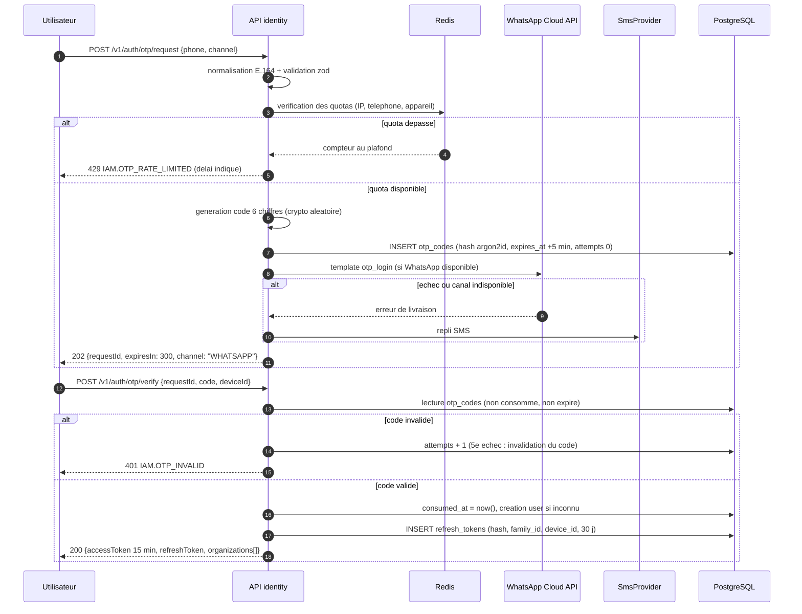

Le code est stocké **haché en argon2id**, jamais en clair. La comparaison est à temps constant. Le message ne contient ni le nom de l'organisation ni le montant d'une opération : il ne doit rien révéler à qui lirait l'écran verrouillé.

### 6.3 Anti-abus

L'OTP est le point d'entrée le plus exposé : il coûte de l'argent à chaque envoi (SMS et conversation WhatsApp facturés) et il ouvre l'accès à des données financières.

| Contrôle | Seuil | Portée | Réaction au dépassement |
| :--- | :--- | :--- | :--- |
| Demandes par numéro | 3 / 15 min, 8 / 24 h | `otp:req:{phone}` | 429, délai renvoyé au client |
| Demandes par IP | 20 / heure | `otp:ip:{ip}` | 429 puis blocage progressif 1 h |
| Demandes par appareil | 5 / heure | `otp:dev:{deviceId}` | 429 |
| Tentatives de vérification | 5 par code | colonne `otp_codes.attempts` | Code invalidé, nouvelle demande obligatoire |
| Durée de vie du code | 5 minutes | `expires_at` | Expiration, `IAM.OTP_EXPIRED` |
| Réutilisation d'un code consommé | — | `consumed_at` | Refus + alerte Sentry |
| Coût d'envoi par organisation | Plafond quotidien selon la formule | `subscriptions` | Bascule SMS → WhatsApp only, alerte à l'OWNER |

Trois mesures complémentaires : délai plancher de 30 s entre deux demandes pour un même numéro ; réponse **identique** que le numéro existe ou non (pas d'énumération de comptes) ; les numéros marqués `blocked` par abus répété sont refusés en amont de tout envoi. Les compteurs Redis utilisent une fenêtre glissante (`INCR` + `EXPIRE`), et les envois transitent par la file `notifications` afin d'absorber les pics sans multiplier les appels opérateur.

### 6.4 Jetons, rotation et révocation

| Jeton | Durée | Contenu | Stockage client |
| :--- | :--- | :--- | :--- |
| **Access token** (JWT, RS256) | 15 min | `sub`, `org`, `role`, `perms` (bitmask), `sid`, `jti`, `exp` | Mémoire (web : cookie `HttpOnly` `Secure` `SameSite=Lax` ; mobile : mémoire seule) |
| **Refresh token** | 30 j glissants | Opaque (32 octets aléatoires), haché en base | `Keychain` / `EncryptedSharedPreferences` (mobile), cookie `HttpOnly` (web) |

La **rotation est systématique** : chaque `POST /v1/auth/refresh` invalide le jeton présenté et en émet un nouveau dans la même `family_id`. Si un jeton déjà consommé est rejoué — signature d'un vol — toute la famille est révoquée immédiatement, un `user.session_revoked` est émis, et une notification est envoyée au titulaire. Chaque famille est liée à un `device_id` et à un empreinte User-Agent ; un changement d'empreinte n'invalide pas mais est journalisé.

Révocation, par ordre de granularité : un appareil (`family_id`), toutes les sessions d'un utilisateur (déclenché par l'utilisateur ou par un OWNER), toutes les sessions d'une organisation (incident de sécurité). Les access tokens restant valides jusqu'à 15 minutes, une **liste de révocation** Redis (`revoked:sid:{sessionId}`, TTL 15 min) est consultée par le garde d'authentification : c'est le seul appel Redis du chemin critique, et il est mutualisé avec le cache d'adhésion (§5.2).

Les clés RS256 sont rotées tous les 90 jours, exposées via un JWKS interne, avec chevauchement de 24 h (`kid` dans l'en-tête du jeton).

### 6.5 RBAC : matrice permissions × rôles

Les permissions sont des chaînes `domaine:action`, définies **une seule fois** dans `packages/shared/src/permissions/` et compilées en bitmask pour tenir dans le JWT. Le rôle est porté par `organization_members`, jamais par `users`.

Légende : ● autorisé — ◐ autorisé sur son propre périmètre (ses tournées, ses baux, ses factures) — ○ interdit.

| Permission | OWNER | MANAGER | COLLECTOR | ACCOUNTANT | VIEWER | TENANT | LANDLORD_PORTAL | REFERRAL_PARTNER |
| :--- | :---: | :---: | :---: | :---: | :---: | :---: | :---: | :---: |
| `organization:read` | ● | ● | ● | ● | ● | ○ | ○ | ○ |
| `organization:update` | ● | ○ | ○ | ○ | ○ | ○ | ○ | ○ |
| `member:invite` / `member:role_change` | ● | ○ | ○ | ○ | ○ | ○ | ○ | ○ |
| `subscription:manage` | ● | ○ | ○ | ○ | ○ | ○ | ○ | ○ |
| `apikey:manage` | ● | ○ | ○ | ○ | ○ | ○ | ○ | ○ |
| `party:read` | ● | ● | ◐ | ● | ● | ○ | ○ | ○ |
| `party:write` | ● | ● | ○ | ○ | ○ | ○ | ○ | ○ |
| `property:read` / `unit:read` | ● | ● | ◐ | ● | ● | ◐ | ◐ | ○ |
| `property:write` / `unit:write` | ● | ● | ○ | ○ | ○ | ○ | ○ | ○ |
| `lease:read` | ● | ● | ◐ | ● | ● | ◐ | ◐ | ○ |
| `lease:write` / `lease:terminate` | ● | ● | ○ | ○ | ○ | ○ | ○ | ○ |
| `invoice:read` | ● | ● | ◐ | ● | ● | ◐ | ◐ | ○ |
| `invoice:issue` / `invoice:cancel` | ● | ● | ○ | ○ | ○ | ○ | ○ | ○ |
| `payment:read` | ● | ● | ◐ | ● | ● | ◐ | ◐ | ○ |
| `payment:record_cash` | ● | ● | ● | ○ | ○ | ○ | ○ | ○ |
| `payment:initiate_momo` | ● | ● | ● | ○ | ○ | ● | ○ | ○ |
| `payment:validate_transfer` | ● | ● | ○ | ● | ○ | ○ | ○ | ○ |
| `payment:reverse` | ● | ○ | ○ | ○ | ○ | ○ | ○ | ○ |
| `remittance:submit` | ○ | ○ | ● | ○ | ○ | ○ | ○ | ○ |
| `remittance:validate` | ● | ● | ○ | ● | ○ | ○ | ○ | ○ |
| `receipt:read` | ● | ● | ◐ | ● | ● | ◐ | ◐ | ○ |
| `receipt:resend` | ● | ● | ◐ | ● | ○ | ○ | ○ | ○ |
| `reconciliation:import` / `reconciliation:match` | ● | ● | ○ | ● | ○ | ○ | ○ | ○ |
| `expense:write` / `commission:read` | ● | ● | ○ | ● | ○ | ○ | ○ | ○ |
| `owner_statement:close` / `owner_payout:execute` | ● | ○ | ○ | ◐ (préparer) | ○ | ○ | ○ | ○ |
| `owner_statement:read` / `owner_payout:read` | ● | ● | ○ | ● | ● | ○ | ◐ | ○ |
| `inspection:conduct` / `inspection:sign` | ● | ● | ● | ○ | ○ | ◐ (contresigner) | ○ | ○ |
| `maintenance:create` | ● | ● | ● | ○ | ○ | ● | ○ | ○ |
| `maintenance:resolve` | ● | ● | ○ | ○ | ○ | ○ | ○ | ○ |
| `notification:send_manual` | ● | ● | ○ | ○ | ○ | ○ | ○ | ○ |
| `audit:read` | ● | ○ | ○ | ● | ○ | ○ | ○ | ○ |
| `export:full` | ● | ○ | ○ | ● | ○ | ○ | ○ | ○ |
| `referral:read` / `referral_payout:read` | ○ | ○ | ○ | ○ | ○ | ○ | ○ | ◐ |

Quatre points de vigilance. **TENANT n'est pas un rôle d'`organization_members`** : c'est un rôle dérivé, accordé au porteur d'un bail actif via le portail locataire, dont le périmètre se limite strictement à ses propres baux, factures, quittances et demandes. **COLLECTOR est le rôle le plus contraint** : il encaisse, il ne modifie ni bail ni facture, et son ◐ est appliqué par une clause `collector_id = :userId` ajoutée par un intercepteur, en plus de la RLS. **`payment:reverse` est réservé à l'OWNER** : la contre-passation est la seule opération capable de défaire une écriture financière. Enfin, `OWNER` ne porte pas `remittance:submit` : celui qui remet les fonds ne peut pas être celui qui valide la remise (séparation des tâches, §8.1).

**Deux rôles dérivés supplémentaires.** `LANDLORD_PORTAL` est accordé au titulaire d'un compte `users` lié à `landlords.user_id` lorsque le bailleur est sous mandat d'un `INDEPENDENT_MANAGER` ou d'une `AGENCY` : lecture seule sur son propre patrimoine (biens, baux, factures, encaissements, quittances, relevés de gérance, reversements), sur le même modèle que le portail locataire. `REFERRAL_PARTNER` est accordé à tout utilisateur inscrit au programme d'apport d'affaires : son périmètre se limite à son propre espace partenaire (ses filleuls, ses commissions, ses versements). Les tables globales du programme (`referral_programs`, `referral_partners`, `referrals`, `referral_commissions`, `referral_payouts`) ne portent pas `organization_id` : leur cloisonnement par partenaire repose sur une politique RLS assise sur `app.current_user_id`, posé dans le contexte de transaction (§4.6), et non sur le mécanisme `organization_id` habituel.

La vérification se fait par un garde `@RequirePermission('payment:record_cash')` évalué sur le bitmask du JWT, **puis** revalidé en base lorsque l'opération est financière — un jeton de 15 minutes peut survivre à une rétrogradation de rôle.

### 6.6 Clés API

Destinées aux intégrations (logiciel comptable d'une agence, portail d'un grand bailleur, futur connecteur bancaire). Format `imk_live_<32 caractères base62>`, préfixe visible pour la détection de fuite par scanners de dépôts publics ; seul un hachage SHA-256 est stocké dans `api_keys`, la valeur en clair n'est affichée qu'une fois à la création.

Une clé est **rattachée à une organisation et à un jeu de permissions en lecture seule par défaut** ; l'octroi d'une permission d'écriture exige une confirmation OTP de l'OWNER. Chaque clé porte une liste d'IP autorisées facultative, une date d'expiration obligatoire (365 jours maximum), un quota propre (600 requêtes/minute) et un compteur `last_used_at`. L'authentification se fait par l'en-tête `Authorization: Bearer imk_live_…`, résolue par le même garde que le JWT, qui pose le contexte de tenancy à partir de la clé. Une clé ne peut jamais porter `payment:reverse`, `apikey:manage` ni `member:role_change`, et toute utilisation est tracée dans `audit_logs` avec l'empreinte de la clé.

---


---

## 7. Moteur de facturation

### 7.1 Fuseau horaire : une règle avant tout le reste

Toute date métier est calculée en **`Africa/Brazzaville` (UTC+1, sans heure d'été)** et stockée en `timestamptz` UTC. Les périodes de facturation, les échéances, les délais de grâce et les prorata se raisonnent en **jours calendaires locaux**. Une facture datée du 1er mars à 00:00 Brazzaville est stockée `2026-02-28T23:00:00Z` : le worker qui la génère doit donc convertir avant de comparer, jamais après.

Les helpers de `packages/shared/src/dates/` (`startOfBillingDay`, `localDateOf`, `daysInLocalMonth`) sont les **seuls** points autorisés à manipuler des dates métier. `new Date()` nu est interdit dans `domain/` : le temps est injecté par un port `Clock`, ce qui rend les tests de prorata déterministes.

### 7.2 Cron mensuel

Un job répétable BullMQ `billing:monthly-run` s'exécute **chaque jour à 02:00 Brazzaville** — quotidien et non mensuel, afin d'absorber les baux dont l'échéance n'est pas le 1er et de rattraper un jour d'indisponibilité.

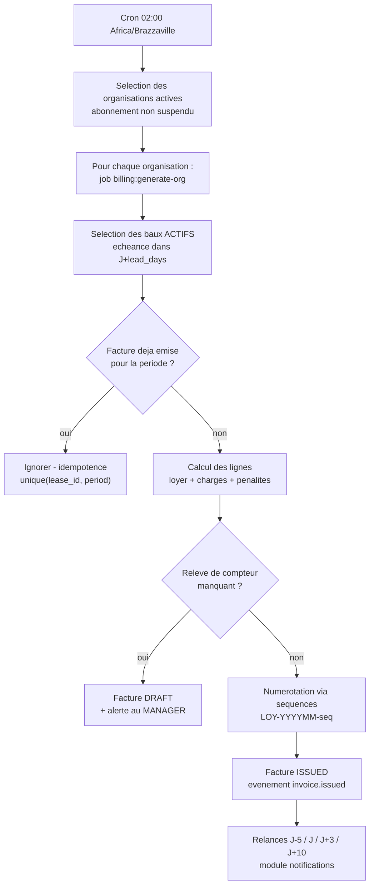

Le paramètre `lead_days` (par défaut 5) est réglable par organisation dans `organization_settings`. Chaque organisation est traitée dans **son propre job**, avec sa propre transaction : la panne d'un bail malformé chez une agence n'interrompt pas la facturation des autres. Un second job `billing:mark-overdue` tourne à 03:00 et bascule en `OVERDUE` toute facture `ISSUED` ou `PARTIALLY_PAID` dont l'échéance est dépassée.

L'idempotence repose sur une contrainte physique : `UNIQUE (lease_id, period_year, period_month) WHERE status <> 'CANCELLED'`. Un double déclenchement du cron produit une violation de contrainte, interceptée et convertie en « déjà traité », jamais une facture en double.

### 7.3 Calcul des lignes

Une facture est une somme de lignes typées (`invoice_lines.type`), calculées dans cet ordre :

| Ordre | Type de ligne | Source | Règle de calcul |
| :--- | :--- | :--- | :--- |
| 1 | `RENT` | `leases.rent_amount` | Montant du bail, éventuellement prorata (§7.5) |
| 2 | `CHARGES_FIXED` | `leases.charges_amount` | Forfait de charges, prorata identique au loyer |
| 3 | `WATER_CHARGE` / `ELECTRICITY_CHARGE` (compteurs `WATER_LCDE`, `ELECTRICITY_E2C`) | `meter_readings` + `utility_tariffs` | (index fin − index début) × tarif applicable, plus abonnement fixe éventuel |
| 4 | `PENALTY` | `penalty_rules` | Appliquée sur le **reliquat impayé de la période précédente**, après délai de grâce |
| 5 | `REPAIR_REBILL` / `DISCOUNT` / `OTHER` | Saisie manuelle | Réparation refacturée, régularisation, remise commerciale (montant négatif autorisé) |

**Charges de compteur.** Le tarif est résolu par `utility_tariffs` valide à la date de fin de relevé (`valid_from` / `valid_to`), avec tranches progressives possibles : chaque tranche est une ligne de détail agrégée en une seule `invoice_line` dont le `metadata` JSONB conserve le décompte. Si le relevé de fin de période manque, la facture reste en `DRAFT` avec le code `BILLING.METER_READING_MISSING` remonté au MANAGER : **on ne facture jamais une estimation** — c'est la première source de litige locataire.

**Pénalités.** `penalty_rules` porte `grace_days`, `basis` (`RATE_BPS_PER_DAY`, `RATE_BPS_PER_MONTH`, `FLAT_AMOUNT`, `FLAT_AMOUNT_PER_DAY`), `rate_bps` ou `flat_amount`, et `cap_rate_bps` (plafond en pourcentage du loyer dû). La pénalité n'est calculée que si, au jour de génération, `échéance + grace_days < aujourd'hui` et que le reliquat est strictement positif. Elle est plafonnée par `cap_rate_bps` et **jamais** calculée sur une pénalité antérieure. Toute pénalité est annulable par un ACCOUNTANT via une ligne `DISCOUNT` négative, tracée dans `audit_logs`.

Tous les calculs se font en `bigint` XAF. La seule opération produisant un reste est le prorata : l'arrondi est **au franc le plus proche, moitié vers le haut**, et le cumul des lignes est réconcilié avec `rent_invoices.total_amount` par une assertion en fin de transaction.

### 7.4 Numérotation

Les numéros sont attribués par la table `sequences`, verrouillée en transaction :

```sql
SELECT next_value FROM sequences
 WHERE organization_id = $1 AND scope = 'RENT_INVOICE' AND period = '202603'
   FOR UPDATE;
UPDATE sequences SET next_value = next_value + 1 WHERE id = $2;
```

| Portée | Format | Réinitialisation |
| :--- | :--- | :--- |
| `RENT_INVOICE` | `LOY-{YYYYMM}-{seq:5}` → `LOY-202603-00147` | Mensuelle, par organisation |
| `RECEIPT` | `QUI-{YYYYMM}-{seq:5}` → `QUI-202603-00131` | Mensuelle, par organisation |
| `CASH_RECEIPT` | `CASH-{orgCode}-{collectorCode}-{seq:6}` | Jamais, par démarcheur |
| `BANK_TRANSFER_REF` | `LOY-{YYYYMM}-{seq:5}` (référence structurée, §8.3) | Mensuelle, par organisation |

Le numéro n'est attribué qu'au passage `DRAFT → ISSUED` : une facture abandonnée en brouillon ne consomme pas de numéro, ce qui garantit une **série continue sans trou**, condition d'acceptation par un commissaire aux comptes. Le verrou `FOR UPDATE` porte sur une seule ligne et est pris le plus tard possible dans la transaction, afin de ne pas sérialiser toute la génération mensuelle sur un unique compteur.

### 7.5 Prorata d'entrée et de sortie

Base de calcul : **jours réels du mois civil local** (28, 29, 30 ou 31), pas de mois commercial de 30 jours. Le jour d'entrée est facturé ; le jour de restitution des clés ne l'est pas.

```
montant_prorata = arrondi( montant_mensuel × jours_occupes / jours_du_mois )
```

**Exemple d'entrée.** Bail sur un studio à Moungali, loyer 120 000 XAF, charges forfaitaires 15 000 XAF, entrée le 12 mars 2026 (31 jours). Jours occupés : 12 au 31 inclus = 20 jours.

| Ligne | Calcul | Montant |
| :--- | :--- | ---: |
| `RENT` prorata | 120 000 × 20 / 31 = 77 419,35 | **77 419 XAF** |
| `CHARGES_FIXED` prorata | 15 000 × 20 / 31 = 9 677,42 | **9 677 XAF** |
| **Total facture `LOY-202603-00147`** | | **87 096 XAF** |

**Exemple de sortie avec charges et pénalité.** Même bail, congé au 9 juin 2026 (30 jours), clés restituées le 9 : jours occupés = 1 au 8 inclus = 8 jours. Relevé d'eau : index 1 482 → 1 497 m³, tarif `utility_tariffs` 950 XAF/m³ plus abonnement 2 000 XAF. Reliquat impayé de mai : 30 000 XAF, `penalty_rules` = 5 %, `grace_days` = 10, échéance du 1er mai dépassée de plus de 10 jours.

| Ligne | Calcul | Montant |
| :--- | :--- | ---: |
| `RENT` prorata sortie | 120 000 × 8 / 30 = 32 000,00 | **32 000 XAF** |
| `CHARGES_FIXED` prorata | 15 000 × 8 / 30 = 4 000,00 | **4 000 XAF** |
| `UTILITY_WATER` | (1 497 − 1 482) × 950 + 2 000 = 14 250 + 2 000 | **16 250 XAF** |
| `PENALTY` sur reliquat de mai | 30 000 × 5 % = 1 500 | **1 500 XAF** |
| **Total facture `LOY-202606-00203`** | | **53 750 XAF** |

Le dépôt de garantie n'est **jamais** compensé automatiquement avec cette facture : il suit son propre cycle (`deposits`, `deposit_movements`) et sa restitution dépend de l'état des lieux de sortie (§4.1, module `inspections`). Un MANAGER peut le faire manuellement, ce qui produit un `payment` de méthode `DEPOSIT_OFFSET` et une écriture dans `deposit_movements`.

### 7.6 Machine à états d'une facture

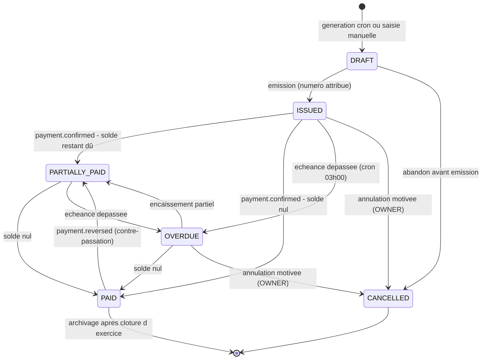

Quatre invariants de la machine, couverts par des tests dédiés (§15.6) :

1. `CANCELLED` est **terminal** ; une facture émise puis annulée conserve son numéro, qui n'est jamais réattribué (annulation, pas suppression).
2. Aucune transition n'écrase une allocation : `PAID → PARTIALLY_PAID` résulte exclusivement d'un `payment.reversed`, jamais d'une modification de ligne.
3. `OVERDUE` est un état **dérivé et réversible** : il ne bloque rien, il déclenche les relances de `dunning_rules`.
4. Une facture `ISSUED` ou au-delà est **immuable dans ses lignes** : toute correction passe par une ligne `DISCOUNT` ou `OTHER` ou par une annulation suivie d'une nouvelle facture.

---


---

## 8. Encaissements par mode

Les quatre modes partagent le même agrégat `payment` et la même machine à états (§8.5). Ce qui les distingue est la **nature de la preuve** et donc le chemin qui mène à `CONFIRMED` : signature du locataire pour les espèces, statut opérateur re-interrogé pour le Mobile Money, ligne de relevé bancaire pour le virement, compensation pour le chèque.

### 8.1 Espèces

C'est le mode dominant à Brazzaville et Pointe-Noire, et le plus exposé au risque : l'argent transite physiquement par un démarcheur avant d'atteindre l'agence ou le bailleur.

**Encaissement.** Le démarcheur saisit le montant dans l'application mobile, hors ligne si nécessaire. Une ligne `cash_receipts` est créée localement avec un `client_ref` ULID, un numéro provisoire, et il fait signer le locataire **sur l'écran du téléphone**. La signature est capturée en PNG (≤ 512 Ko, fond transparent), et son empreinte `SHA-256` est calculée sur l'appareil puis stockée en colonne `signature_hash`. Le PNG part sur R2 ; la ligne conserve le hash. Toute altération ultérieure du fichier est donc détectable, et le hash figure sur le reçu imprimé comme sur la quittance.

Le numéro définitif `CASH-{orgCode}-{collectorCode}-{seq}` est attribué **côté serveur** à la synchronisation, via `sequences` (§7.4) ; le mobile affiche jusque-là le numéro provisoire, clairement marqué « en attente de synchronisation ». Le reçu est immédiatement partageable en PDF ou WhatsApp dès confirmation serveur.

**Remise (`cash_remittances`).** À la fin de sa tournée, le démarcheur déclare une remise : il sélectionne les reçus encaissés, l'application calcule le total attendu, il saisit le montant physiquement remis et le destinataire (caisse agence ou compte bancaire du bailleur). Chaque reçu retenu produit un `cash_remittance_item`. Un reçu ne peut appartenir qu'à **une seule remise** (contrainte d'unicité sur `cash_receipt_id`).

**Contrôle des écarts.** Le validateur — jamais le remettant, séparation des tâches (§6.5) — compte l'argent et saisit le montant reçu.

| Situation | `expected_amount` vs `counted_amount` | Traitement |
| :--- | :--- | :--- |
| Conforme | Écart nul | Remise `VERIFIED` (`variance_amount = 0`), reçus marqués `REMITTED`, événement `remittance.verified` |
| Manquant | Compté < attendu | Remise `VERIFIED` avec `variance_amount < 0` (ou `REJECTED` si l'écart dépasse le seuil), code `CASH.REMITTANCE_DISCREPANCY`, blocage de nouvelles remises pour ce démarcheur au-delà du seuil de l'organisation |
| Excédent | Compté > attendu | Remise `DISCREPANCY`, `surplus_amount` porté en attente d'affectation, jamais absorbé silencieusement |
| Écart régularisé | — | Écriture d'ajustement motivée par un OWNER, `audit_logs` avant/après, la remise passe `SETTLED` |

Les paiements espèces restent `CONFIRMED` dès le reçu signé : le locataire s'est acquitté de sa dette, et le risque de remise est un risque **interne** à l'organisation. Cette dissociation est délibérée — confondre les deux ferait porter au locataire la défaillance d'un démarcheur. Le tableau de bord expose en permanence l'encours détenu par chaque démarcheur (`collector_float`) et son ancienneté.

### 8.2 Mobile Money

#### 8.2.1 Interface `MobileMoneyProvider`

Le fournisseur est un détail d'infrastructure. Le domaine ne connaît que ce port :

```ts
// modules/payments-mobile-money/domain/ports/mobile-money.provider.ts
export interface MobileMoneyProvider {
  readonly code: 'CINETPAY' | 'PAWAPAY' | 'MTN_MOMO' | 'AIRTEL_MONEY';

  /** Declenche le push USSD/STK sur le telephone du payeur. */
  initiate(input: InitiatePaymentInput): Promise<InitiateResult>;

  /** Source de verite : interroge le fournisseur. Aucune confirmation sans cet appel. */
  getStatus(providerReference: string): Promise<ProviderStatus>;

  /** Normalise un corps de webhook heterogene vers un evenement interne. */
  parseWebhook(raw: RawWebhook): ParsedWebhook;

  /** Verifie signature HMAC, horodatage et anti-rejeu. Retourne un booleen, ne jette pas. */
  verifyWebhook(raw: RawWebhook): boolean;
}

export interface InitiatePaymentInput {
  amount: bigint;                 // XAF
  currency: 'XAF';
  payerMsisdn: string;            // E.164, +242...
  operator: 'MTN' | 'AIRTEL';
  externalReference: string;      // paymentId Immodesk, idempotent cote fournisseur
  description: string;            // "Loyer mars 2026 - LOY-202603-00147"
  callbackUrl: string;
}

export interface ProviderStatus {
  state: 'PENDING' | 'SUCCEEDED' | 'FAILED' | 'EXPIRED' | 'UNKNOWN';
  providerReference: string;
  operatorReference?: string;     // reference operateur, imprimee sur la quittance
  amount?: bigint;
  feeAmount?: bigint;
  failureReason?: string;
  rawPayload: unknown;            // conserve tel quel en JSONB
}
```

Chaque implémentation vit dans `infrastructure/mobile-money/<fournisseur>/` et est sélectionnée par organisation via `feature_flags`. **Aucun `if (provider === 'CINETPAY')` n'est autorisé hors de ce dossier** : c'est la condition qui rend le basculement vers une intégration directe MTN/Airtel non intrusif (§2.4).

#### 8.2.2 Séquence complète

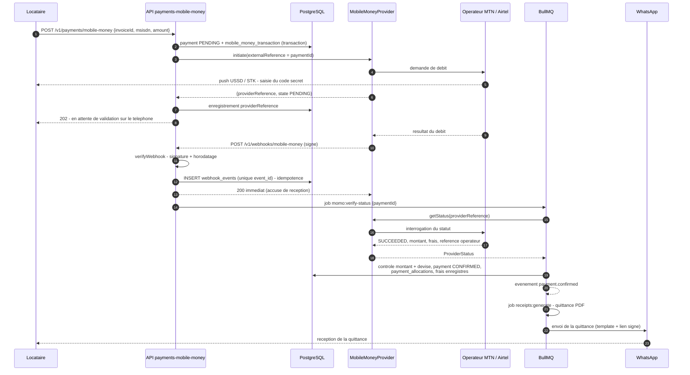

#### 8.2.3 Idempotence, rattrapage, frais et délais

**Idempotence.** Chaque webhook est inséré dans `webhook_events` avec une contrainte `UNIQUE (provider, event_id)` — à défaut d'`event_id` fourni, un hash SHA-256 du corps brut. Une violation d'unicité signifie « déjà reçu » : le serveur répond `200` sans retraiter. Le corps brut, les en-têtes et l'horodatage sont conservés 90 jours pour l'expertise en cas de litige. L'accusé de réception est renvoyé **avant** tout traitement métier : un fournisseur qui n'obtient pas son `200` rapidement rejoue en boucle.

**La confirmation ne vient jamais du webhook.** Le webhook déclenche un job `momo:verify-status` ; c'est le retour de `getStatus()` qui autorise le passage à `CONFIRMED`, après trois contrôles : le montant retourné égale le montant attendu, la devise est `XAF`, et le paiement n'est pas déjà confirmé. Toute divergence produit `MOMO.STATUS_MISMATCH`, laisse le paiement en `PENDING_VERIFICATION` et lève une alerte Sentry pour arbitrage humain.

**Job de rattrapage.** `momo:reconcile-pending` s'exécute toutes les 5 minutes et reprend toute transaction `PENDING` de plus de 3 minutes, avec un backoff croissant (3, 5, 10, 20, 30 min) sur une fenêtre de 2 heures. Il couvre les webhooks perdus, qui sont fréquents. Au-delà de la fenêtre, la transaction passe `EXPIRED`, le paiement `CANCELLED`, et le locataire reçoit une invitation à réessayer. Une réconciliation quotidienne rapproche en outre le journal du fournisseur avec `mobile_money_transactions` et signale toute transaction connue de l'opérateur mais absente d'Immodesk.

**Frais.** Le modèle par défaut est `fee_bearer = TENANT` : le locataire est débité du loyer plus les frais opérateur, et l'organisation reçoit le montant net. `mobile_money_transactions.fee_amount` conserve les frais réellement prélevés, et l'allocation à la facture porte sur le **montant du loyer**, jamais sur le net encaissé — sinon la facture ne se solderait jamais. Le mode `fee_bearer = ORGANIZATION` (frais à la charge de l'organisation) est activable par `organization_settings` ; l'écart net/brut est alors comptabilisé en `expenses` de type `PAYMENT_FEES`. Les frais figurent sur la quittance à titre informatif.

**Délais.** Push USSD non validé : expiration à 3 minutes côté opérateur. Appel `initiate` : timeout HTTP 10 s, 2 tentatives avec le **même** `externalReference` (idempotent côté fournisseur). Appel `getStatus` : timeout 8 s, 5 tentatives exponentielles. Fournisseur injoignable au-delà : `PAYMENT.PROVIDER_UNAVAILABLE` (503), le paiement reste `PENDING` et le job de rattrapage prend le relais — aucun paiement n'est jamais annulé sur la seule indisponibilité d'un appel réseau.


---

### 8.3 Virement bancaire

Le virement pose un problème que les autres modes n'ont pas : la banque ne prévient personne. Immodesk n'apprend l'existence du virement que par le locataire (déclaration) ou par le relevé (import), souvent plusieurs jours plus tard.

**Référence structurée.** Chaque facture émise porte une référence de virement `LOY-{YYYYMM}-{seq}` — la même série que le numéro de facture, ce qui évite au locataire de manipuler deux identifiants. Elle est imprimée sur la facture, rappelée dans le message de relance, et copiable en un geste depuis le portail locataire. Une variante compacte sans tirets (`LOY202603 00147`) est acceptée au rapprochement, les libellés bancaires étant fréquemment tronqués ou reformatés. La référence est **le** levier de rapprochement automatique : tout le reste est du travail manuel.

**Déclaration (`bank_transfer_declarations`).** Le locataire déclare son virement depuis le portail : montant, date d'exécution, banque émettrice, référence utilisée, et **preuve** (photo du bordereau ou capture d'écran, stockée sur R2 via le module `documents`). Le `payment` est créé en `PENDING_VERIFICATION` — jamais `CONFIRMED` : une capture d'écran n'est pas un encaissement. Un `proof_hash` SHA-256 du fichier est calculé à l'upload, avec une contrainte `UNIQUE (organization_id, proof_hash)` : la même preuve ne peut pas servir deux fois, ce qui bloque la fraude la plus simple (rejouer un ancien bordereau).

**Validation.** Un ACCOUNTANT ou un MANAGER valide (`payment:validate_transfer`) : le paiement passe `CONFIRMED`, ses allocations sont écrites et la quittance est générée. Le rejet exige un motif (`REJECTED` + `rejection_reason`), notifié au locataire. Un délai de validation supérieur à 72 h ouvrées déclenche une alerte : le locataire a payé, il attend sa quittance.

**Import de relevés.** Deux formats, un seul port `BankStatementParser` :

| Format | Mise en œuvre | Particularités |
| :--- | :--- | :--- |
| CSV | Un **adaptateur par banque** (`bank_accounts.bank_code`) : mappage de colonnes, format de date, séparateur décimal, encodage | Les banques de la place (BGFI, LCB, Ecobank, UBA, BCI) exportent des CSV incompatibles entre eux ; l'adaptateur est déclaratif, décrit en JSON, testé sur un échantillon réel versionné |
| MT940 | Parseur SWIFT standard : blocs `:20:`, `:25:`, `:28C:`, `:61:` (mouvements), `:86:` (libellé étendu) | Format normalisé, mais le libellé `:86:` est libre : c'est là que se trouve la référence structurée |

L'import crée une ligne `bank_statements` (compte, période, soldes d'ouverture et de clôture) et ses `bank_statement_lines`. Un contrôle d'intégrité vérifie que `solde_ouverture + Σ mouvements = solde_clôture` ; en cas d'écart, l'import est refusé en bloc. Chaque ligne porte une empreinte `line_hash` sur `(compte, date, montant, libellé)` avec unicité : réimporter deux fois le même relevé ne duplique aucune ligne.

**Rapprochement à trois niveaux** (module `reconciliation`) :

| Niveau | Critère | Action |
| :--- | :--- | :--- |
| **1 — Exact** | Référence structurée trouvée dans le libellé **et** montant identique au centime **et** date dans une fenêtre de 15 jours | Rapprochement automatique, `reconciliation_matches.type = 'EXACT'`, paiement `CONFIRMED`, quittance émise |
| **2 — Suggéré** | Score ≥ 0,75 combinant montant (±2 %), proximité de date, similarité du nom du payeur avec `tenants.full_name` (trigramme `pg_trgm`), déclaration en attente pour le même montant | Proposition affichée à l'ACCOUNTANT, acceptation ou rejet en un clic, `type = 'SUGGESTED'` |
| **3 — Manuel** | Aucun critère automatique | L'opérateur relie une ligne de relevé à une ou plusieurs factures, motif obligatoire, `type = 'MANUAL'`, audit systématique |

Une ligne de relevé peut être rapprochée de plusieurs factures (virement groupé d'un locataire ayant deux lots) et une facture de plusieurs lignes (paiement en deux fois) : `reconciliation_matches` est une table de liaison n↔n portant le montant affecté. Toute ligne non rapprochée reste visible (`is_matched = false`) ; le tableau de bord affiche l'âge du plus ancien non rapproché, indicateur de santé du processus. Un rapprochement est annulable ; l'annulation produit un `payment.reversed` et repasse la facture en `PARTIALLY_PAID` ou `OVERDUE`.

### 8.4 Chèque

Marginal en volume, mais utilisé par les bailleurs institutionnels et quelques entreprises locataires. Le chèque a un cycle de vie propre, plus long que les autres modes, et un risque spécifique : le rejet après encaissement apparent.

`bank_checks` porte le numéro du chèque, la banque tirée, le nom du tireur, le montant, la date d'émission, la date de dépôt, la date de compensation et le motif de rejet éventuel.

| Étape | État `bank_checks` | État `payment` | Règle |
| :--- | :--- | :--- | :--- |
| Saisie à la remise du chèque | `RECEIVED` | `PENDING_VERIFICATION` | Unicité `(bank_code, check_number)` : un chèque ne peut être saisi deux fois |
| Dépôt en banque | `DEPOSITED` | `PENDING_VERIFICATION` | Date de dépôt obligatoire, bordereau optionnel dans `documents` |
| Compensation | `CLEARED` | `CONFIRMED` | Confirmé par validation manuelle **ou** par rapprochement automatique avec une ligne de relevé (§8.3) |
| Rejet | `BOUNCED` | `REJECTED` | Motif obligatoire (provision insuffisante, opposition, signature) ; si le paiement avait été confirmé, `payment.reversed` et retour de la facture en impayé |
| Annulation avant dépôt | `CANCELLED` | `CANCELLED` | Chèque rendu au tireur, motif obligatoire |

Le délai de compensation sur la place de Brazzaville est de 3 à 10 jours ouvrés. Un job quotidien alerte sur tout chèque `DEPOSITED` depuis plus de 15 jours ouvrés sans issue. Les frais de rejet éventuellement refacturés au locataire passent par une ligne `OTHER` sur la facture suivante, jamais par une modification de la facture d'origine (§7.6).

### 8.5 Machine à états d'un paiement

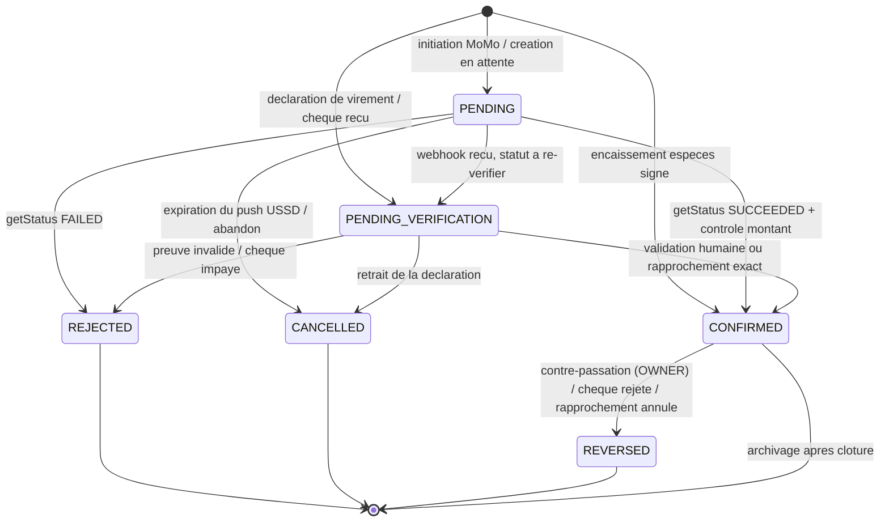

Cinq invariants, protégés par des tests et par des contraintes SQL :

1. **`payments` est append-only sur ses colonnes financières.** Un montant confirmé ne se modifie pas : il se contre-passe. `REVERSED` crée une écriture miroir de signe opposé, sans jamais supprimer l'originale.
2. **`CONFIRMED` exige toujours une preuve externe** : signature du locataire (espèces), `getStatus` du fournisseur (Mobile Money), validation humaine ou ligne de relevé (virement, chèque). Aucun chemin de code ne confirme un paiement sur la seule déclaration du payeur.
3. **La somme des `payment_allocations` d'un paiement ne dépasse jamais son montant** — contrainte vérifiée en transaction. Le surplus devient un `tenant_credits`, imputable sur une facture ultérieure.
4. **`REJECTED`, `CANCELLED` et `REVERSED` sont terminaux.** Un locataire qui repaie produit un **nouveau** `payment`, avec un nouveau `client_ref`.
5. **Toute transition écrit dans `audit_logs`** : état avant, état après, auteur (utilisateur, job ou webhook), `correlationId`, horodatage. C'est la trace opposable en cas de litige.

---


---

## 9. Quittances et documents

La quittance de loyer est la pièce la plus sensible du produit : c'est elle que le locataire présente comme preuve de paiement, et c'est souvent le seul artefact d'Immodesk qu'il conservera. Elle doit être générée de façon déterministe, vérifiable par un tiers, et acheminée sur le canal que le destinataire utilise réellement.

### 9.1 Pipeline de génération PDF

```mermaid
flowchart LR
    A["invoice.paid<br/>ou payment.confirmed"] --> B["Job receipts:generate<br/>file pdf, concurrence 2"]
    B --> C["Numerotation QUI-YYYYMM-seq<br/>sequences FOR UPDATE"]
    C --> D["Assemblage du modele de donnees<br/>bail, lignes, paiements, organisation"]
    D --> E["Rendu Handlebars<br/>templates/receipt/fr-CG.hbs"]
    E --> F["Puppeteer : setContent + emulateMedia print<br/>PDF A4, marges 15 mm"]
    F --> G["QR : token signe HMAC<br/>vers /verifier/{token}"]
    G --> H["Upload R2<br/>org/{orgId}/receipts/{annee}/{id}.pdf"]
    H --> I["INSERT receipts + documents<br/>sha256 du PDF"]
    I --> J["Evenement receipt.generated"]
    J --> K["Job notifications:send<br/>WhatsApp puis repli SMS"]
```

**Worker isolé.** Le rendu tourne dans le processus `worker-pdf` (§1.4), avec un **pool de 2 à 4 onglets Chromium** maintenus chauds : le coût de démarrage de Chromium (800 ms à 1,5 s) est amorti, et un onglet est recyclé toutes les 200 pages pour contenir les fuites mémoire. Le conteneur tourne sans `--no-sandbox` (utilisateur non privilégié, `seccomp` par défaut), sans accès réseau sortant, et charge polices et images depuis le système de fichiers local : **aucune ressource distante n'est chargée pendant le rendu**, ce qui rend le PDF reproductible et supprime une classe entière de SSRF.

**Templates.** Handlebars, un dossier par type de document (`receipt/`, `invoice/`, `lease-contract/`, `owner-statement/`, `inspection-report/`), un fichier par locale (`fr-CG.hbs`). Les helpers sont restreints à une liste blanche : `xaf` (formatage `120 000 XAF`, espace insécable, aucun décimal), `dateFr` (`Africa/Brazzaville`), `periodFr`, `qr`. Aucun helper n'exécute de code arbitraire et les données sont échappées par défaut. Le rendu est **idempotent** : rejouer le job sur une quittance déjà générée retourne le document existant plutôt que d'en créer un second, et le numéro de quittance n'est jamais réattribué.

Une quittance porte toujours : le numéro `QUI-{YYYYMM}-{seq}`, l'identification du bailleur et du locataire, l'adresse du lot, la période couverte, le détail des lignes réglées, le mode de paiement et sa référence (référence opérateur Mobile Money, numéro de reçu de caisse, référence de virement), le solde restant dû s'il y en a un, le QR de vérification et la mention légale d'usage.

**Stockage.** Le PDF part sur Cloudflare R2 sous `org/{orgId}/receipts/{YYYY}/{receiptId}.pdf`, chiffré au repos, bucket **privé sans exception**. La ligne `documents` conserve le `sha256` du fichier, sa taille, son type MIME et son auteur. L'accès se fait exclusivement par **URL signée de 15 minutes**, générée à la demande après contrôle de permission (`receipt:read`) et de tenancy : le lien envoyé par WhatsApp pointe vers un point d'entrée Immodesk, pas vers R2 directement, afin que la révocation reste possible. Aucun objet R2 n'est jamais public.

### 9.2 Page publique de vérification

Un bailleur, une banque ou une administration doit pouvoir vérifier une quittance **sans compte Immodesk**. Le QR imprimé encode `https://app.immodesk.cg/verifier/{token}`.

Le token est un JWT compact signé HMAC-SHA256 avec une clé dédiée à la vérification (distincte des clés de session), portant `{ rid: receiptId, org: organizationId, v: 1 }` et **sans expiration** — une quittance de 2026 doit rester vérifiable en 2031. Il est stocké dans `receipts.verification_token` avec un index unique, et il est **révocable** : une quittance annulée conserve son token mais la page affiche l'annulation.

La page publique est une route Next.js statique et légère (`(public)/verifier/[token]`), pensée pour un téléphone d'entrée de gamme sur réseau 2G. Elle expose le **minimum vérificateur** et rien d'autre :

| Affiché | Volontairement masqué |
| :--- | :--- |
| Numéro de quittance, statut (valide / annulée) | Adresse complète et étage du lot |
| Montant réglé et devise | Coordonnées bancaires, mode de paiement détaillé |
| Période couverte, date de règlement | Numéro de téléphone du locataire ou du bailleur |
| Initiales du locataire (`M. N.`), nom de l'organisation émettrice | Historique des autres factures, solde du compte |

Aucun PDF n'est téléchargeable depuis cette page : elle atteste, elle ne diffuse pas. Les accès sont limités à 30 requêtes par minute et par IP, les tokens inconnus renvoient une réponse générique en temps constant (pas d'énumération), et chaque consultation est comptée dans `receipts.verification_count` avec la date du dernier accès — un bailleur voit ainsi que sa quittance a été vérifiée.

### 9.3 Acheminement : WhatsApp d'abord, SMS en repli

L'envoi est un job BullMQ du module `notifications`, jamais un appel synchrone dans la requête HTTP.

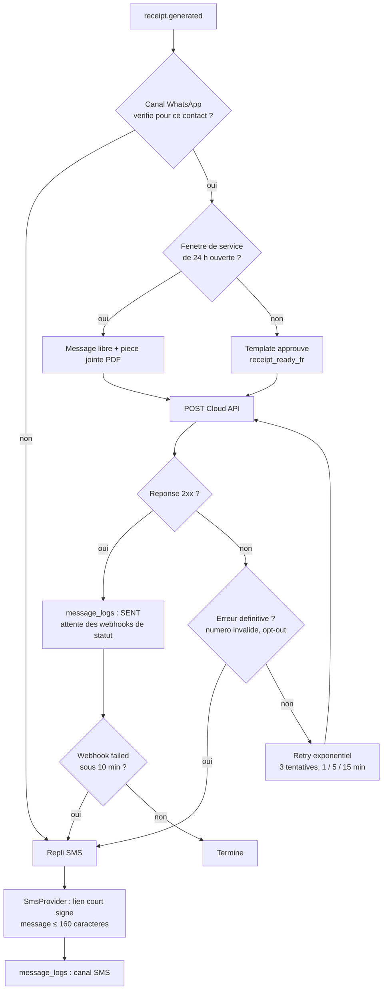

**Templates Meta.** Trois templates approuvés couvrent la quittance et les relances : `receipt_ready_fr` (quittance disponible), `rent_due_reminder_fr` (échéance à venir), `rent_overdue_fr` (impayé). Chacun est versionné dans `notification_templates` avec son nom Meta, sa langue, ses paramètres positionnels et l'identifiant d'approbation. Une modification de contenu **exige une nouvelle approbation Meta** : le template est donc traité comme une migration, revu en PR, et le déploiement ne bascule sur la nouvelle version qu'une fois l'approbation obtenue. Les paramètres sont exclusivement : nom du locataire, période, montant formaté en XAF, numéro de quittance, lien signé.

**Repli SMS.** Déclenché sur canal WhatsApp absent ou non vérifié, erreur définitive de la Cloud API, ou statut `failed` reçu dans les 10 minutes. Le SMS tient en 160 caractères GSM-7 (les accents sont translittérés pour éviter la bascule en UCS-2, qui double le coût) et contient un **lien court signé** vers la quittance plutôt que la pièce jointe. Le SMS n'est jamais envoyé en doublon d'un WhatsApp délivré.

**Quiet hours et opt-out.** Aucun envoi automatique entre 21:00 et 07:00 `Africa/Brazzaville` : le job est reporté au créneau suivant. Les quittances transactionnelles sont prioritaires sur les relances. Tout contact peut se désabonner des relances, jamais des quittances, qui sont des pièces contractuelles.

### 9.4 Traçabilité `message_logs`

Chaque tentative d'envoi produit une ligne, jamais un `UPDATE` destructif : `id`, `organization_id`, `channel` (`WHATSAPP` / `SMS` / `PUSH` / `EMAIL`), `provider_message_id`, `template_name`, `template_version`, `to_masked` (`+242 06 ** ** 41`, le numéro complet reste dans `contact_channels`), `related_type` / `related_id` (quittance, facture, relance), `status`, `status_at`, `error_code`, `cost_estimate` et `correlation_id`.

Les statuts suivent le cycle Meta : `QUEUED → SENT → DELIVERED → READ`, avec `FAILED` possible à toute étape. Les webhooks de statut de la Cloud API mettent à jour la ligne existante par `provider_message_id` ; un statut plus ancien que celui déjà enregistré est ignoré (les webhooks arrivent hors ordre). Le `correlation_id` relie le message à l'événement de domaine d'origine, ce qui permet de reconstituer une chaîne complète — `payment.confirmed` → quittance → message WhatsApp → accusé de lecture — depuis un seul identifiant en support.

Deux exploitations directes : le tableau de bord expose le taux de délivrance par canal et le coût mensuel de communication par organisation (facturé dans l'abonnement) ; en cas de litige, l'horodatage `DELIVERED` fait foi de la mise à disposition de la quittance. Les lignes sont conservées 24 mois, puis agrégées en statistiques et purgées.

---


---

## 10. Application mobile offline-first

### 10.1 Postulat

Le démarcheur encaisse un loyer en espèces à Poto-Poto, dans une cour où la 3G tombe à zéro. Il doit pouvoir : ouvrir sa tournée, retrouver le bail et la facture du locataire, saisir le montant, faire signer sur l'écran, photographier le reçu, et imprimer ou envoyer la quittance **plus tard**. L'application n'est donc pas un client REST avec un cache : c'est une **base de données locale qui se synchronise**, et le réseau est un événement optionnel.

Trois règles gouvernent tout le reste :

1. **Aucun écran ne dépend du réseau.** Toute lecture provient de Drift, tout écrit va d'abord dans Drift.
2. **Aucune écriture n'est perdue.** Toute action métier crée une ligne d'`outbox` dans la même transaction SQLite que la donnée métier.
3. **Aucune écriture n'est appliquée deux fois.** Le `client_ref` (ULID) est généré sur l'appareil et sert de clé d'idempotence côté API (référentiel commun).

### 10.2 Découpage en couches

Le multi-package `melos` (§3.1) matérialise physiquement les couches : une dépendance interdite ne compile pas.

| Package | Couche | Contenu | Dépend de |
| :--- | :--- | :--- | :--- |
| `core_domain` | Domaine | Entités (`Lease`, `RentInvoice`, `CashReceipt`), value objects (`Money` en XAF entier, `PhoneNumber` +242), erreurs métier, politiques d'allocation | rien |
| `core_data` | Données | Base Drift, DAO, tables miroir, tables `outbox`, repositories implémentant les ports du domaine | `core_domain` |
| `core_sync` | Données | `SyncEngine`, `OutboxDispatcher`, `PullService`, résolution de conflits, file « à traiter » | `core_domain`, `core_data`, `core_network` |
| `core_network` | Infrastructure | `dio` + intercepteurs (auth, retry, trace), client Dart généré depuis `openapi.json` | `core_domain` |
| `core_ui` | Présentation | Design system, composants XAF, badges de synchronisation, thème | `core_domain` |
| `immodesk_app` | Présentation | `go_router`, écrans par feature, providers Riverpod | tous |

**Règle de dépendance.** `core_domain` ne connaît ni Drift, ni dio, ni Flutter. Les repositories sont déclarés comme des interfaces dans le domaine et implémentés dans `core_data`. Un cas d'usage (`RecordCashPaymentUseCase`) est testable sans base ni widget tree.

### 10.3 Riverpod : conventions d'état

| Type de provider | Usage | Exemple |
| :--- | :--- | :--- |
| `Provider` | Dépendances singleton | `appDatabaseProvider`, `apiClientProvider` |
| `StreamProvider` | Lecture réactive de Drift : l'UI se rafraîchit dès qu'une ligne change | `overdueInvoicesProvider(leaseId)` |
| `AsyncNotifierProvider` | Cas d'usage avec effet de bord (écriture + outbox) | `cashCollectionControllerProvider` |
| `NotifierProvider` | État d'UI pur (filtres, étape de formulaire) | `collectionRouteFilterProvider` |
| `.family` | Paramétrage par identifiant | `leaseDetailProvider(leaseId)` |
| `.autoDispose` | Par défaut sur tout provider d'écran | — |

Les providers sont générés (`riverpod_generator`) pour éviter les erreurs de typage manuelles. **Aucun widget n'appelle `dio` directement** : la chaîne est toujours `Widget → Notifier → UseCase → Repository → Drift`, et le réseau n'intervient que depuis `core_sync`.

### 10.4 Navigation

`go_router` avec routes typées et redirection centralisée. Trois arbres de navigation selon le rôle porté par la session : `COLLECTOR` (tournée, encaissement, remise), gestionnaire (`OWNER`/`MANAGER` : portefeuille, baux, factures), locataire (`/mon-espace`). La redirection lit l'état d'authentification local — **jamais le réseau** — afin que l'ouverture de l'app hors ligne aboutisse toujours à un écran utilisable.

### 10.5 Modèle local Drift

Le modèle local est un **miroir partiel** : on ne réplique jamais toute l'organisation, seulement le périmètre affecté à l'utilisateur (ses immeubles, ses baux actifs, les factures des 12 derniers mois), plus les tables de sortie.

| Groupe | Tables locales | Nature | Cardinalité typique |
| :--- | :--- | :--- | :--- |
| Référentiels miroir | `properties`, `units`, `leases`, `tenants`, `landlords`, `contact_channels` | Lecture seule locale, écrasée par le serveur | 10²–10³ |
| Financier miroir | `rent_invoices`, `invoice_lines`, `payments`, `payment_allocations` | Lecture seule locale | 10³ |
| Écritures locales | `outbox`, `outbox_attachments` | Source de vérité tant que non synchronisée | 10¹–10² |
| Brouillons | `draft_cash_receipts`, `draft_inspections`, `draft_readings` | Saisie en cours, non encore validée | 10¹ |
| Fichiers | `local_media` (chemin, hash, statut d'upload, taille compressée) | Photos, signatures | 10²  |
| Technique | `sync_state` (curseurs par entité), `conflict_queue`, `kv_settings` | — | 10⁰–10¹ |

Chaque table miroir porte `server_updated_at` et `server_version` pour piloter le pull incrémental. Chaque table d'écriture porte `client_ref TEXT NOT NULL UNIQUE` (ULID).

```dart
class Outbox extends Table {
  TextColumn get clientRef => text()();                       // ULID, cle d'idempotence
  TextColumn get organizationId => text()();
  TextColumn get operation => text()();                       // cash_receipt.create, remittance.close...
  TextColumn get payload => text()();                         // JSON canonique
  TextColumn get dependsOnClientRef => text().nullable()();    // ordre de rejeu
  IntColumn  get attemptCount => integer().withDefault(const Constant(0))();
  TextColumn get status => text()();                          // PENDING, SENDING, ACKED, REJECTED
  TextColumn get lastErrorCode => text().nullable()();
  DateTimeColumn get createdAt => dateTime()();
  DateTimeColumn get nextAttemptAt => dateTime()();
  @override Set<Column> get primaryKey => {clientRef};
}
```

**Migrations.** Versionnées via `MigrationStrategy` Drift, testées avec des bases de référence figées (`test/migrations/vN.sqlite`). Une migration ne doit **jamais** supprimer une ligne d'`outbox` non acquittée : c'est de l'argent encaissé non encore remonté.


---

### 10.6 SyncEngine

Le `SyncEngine` (package `core_sync`) est un automate à deux voies indépendantes : **push** (outbox → serveur) et **pull** (serveur → miroir). Le push est toujours exécuté **avant** le pull d'un cycle, afin que le miroir rafraîchi intègre déjà les écritures locales acceptées.

| Étage | Responsabilité | Déclencheurs |
| :--- | :--- | :--- |
| `SyncScheduler` | Décide qu'un cycle doit démarrer | retour réseau, ouverture d'app, action utilisateur, tâche périodique (15 min), fin de tournée |
| `OutboxDispatcher` | Constitue un lot, l'envoie, applique les acquittements | cycle push |
| `PullService` | Rafraîchit les miroirs par curseur `updated_since` et par entité | cycle pull |
| `ConflictResolver` | Applique les règles du §10.8, alimente `conflict_queue` | acquittements et pull |
| `MediaUploader` | Envoie les photos et signatures vers R2 via URL signée | après acquittement de l'opération porteuse |

#### 10.6.1 Lot de synchronisation (`sync_batches`)

Un cycle push envoie un lot de **50 opérations maximum**, ordonné, à `POST /v1/sync/batches`. Le corps porte un `batch_client_ref` (ULID) et le tableau `operations[]`. Le serveur enregistre une ligne `sync_batches` (appareil, utilisateur, organisation, nombre d'opérations, horodatages, résultat agrégé) et traite **chaque opération dans sa propre transaction**, en s'appuyant sur `idempotency_keys` pour le `client_ref`.

La réponse est un tableau d'acquittements individuels — un lot n'est jamais « tout ou rien » :

| `result` | Signification | Action locale |
| :--- | :--- | :--- |
| `APPLIED` | Opération appliquée, entité serveur créée | `status = ACKED`, écriture de l'`id` serveur dans le miroir |
| `DUPLICATE` | `client_ref` déjà connu, réponse rejouée | Identique à `APPLIED` (idempotence) |
| `REJECTED` | Refus métier définitif (voir §10.8) | `status = REJECTED` + entrée dans `conflict_queue` |
| `RETRY` | Erreur transitoire (verrou, 5xx, timeout) | Backoff exponentiel plafonné à 30 min |
| `SKIPPED` | Dépendance non satisfaite dans le lot | Réordonnancement au cycle suivant |

#### 10.6.2 Ordre de rejeu

Les opérations sont rejouées dans l'ordre `created_at` croissant, **contraint par le graphe `depends_on_client_ref`**. Certaines dépendances sont structurelles et connues à la saisie :

| Opération | Dépend de |
| :--- | :--- |
| `cash_receipt.create` | `tenant.create` (locataire créé hors ligne), `lease.create` le cas échéant |
| `remittance.close` | tous les `cash_receipt.create` de la tournée |
| `media.attach` | l'opération qui crée l'entité porteuse |
| `inspection.finalize` | `inspection.create` + tous les `inspection_item.upsert` |

Si une dépendance est `REJECTED`, tous ses dépendants passent en `REJECTED` avec le code `DEPENDENCY_REJECTED` et rejoignent la file « à traiter » en bloc, présentés à l'utilisateur comme un ensemble cohérent (une tournée, un état des lieux).

### 10.7 Séquence de synchronisation

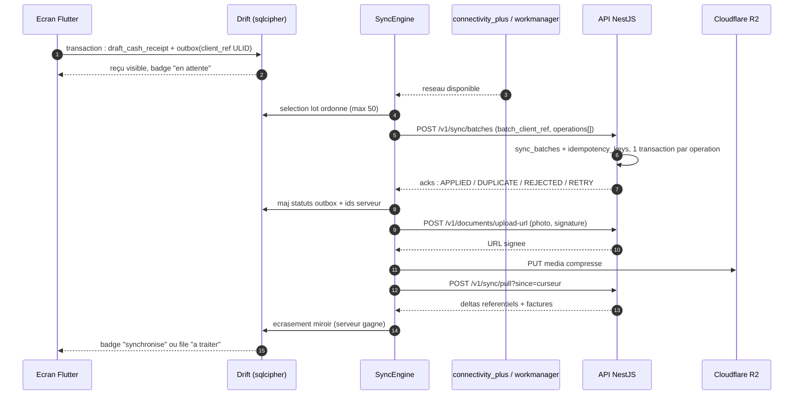

### 10.8 Règles de conflit

| Situation | Règle | Justification |
| :--- | :--- | :--- |
| Divergence sur un **référentiel** (bail, unité, locataire, tarif) | **Le serveur gagne**, écrasement du miroir local sans question | Le miroir est une copie de lecture ; il n'a pas d'autorité |
| Opération d'**outbox** rejouée (réseau incertain, double envoi) | **Toujours acceptée** si idempotente : le `client_ref` renvoie l'acquittement d'origine | Un encaissement ne doit jamais être doublé ni perdu |
| Facture déjà soldée entre-temps par un autre canal | Accepté : le paiement devient un **trop-perçu** → `tenant_credits` | Le démarcheur a réellement reçu l'argent |
| Encaissement sur un **bail clôturé** | **Rejet explicite** `LEASE_CLOSED` | Aucune imputation possible sans décision humaine |
| Encaissement sur une **facture annulée** | **Rejet explicite** `INVOICE_CANCELLED` | Idem |
| Montant supérieur au plafond d'encaissement du démarcheur | Rejet `COLLECTION_LIMIT_EXCEEDED` | Contrôle anti-fraude (§13.7) |
| Remise clôturée dont un reçu est rejeté | Remise remise en `OPEN`, reçu isolé | La remise doit rester équilibrée |

**File « à traiter ».** Tout `REJECTED` alimente `conflict_queue` et remonte dans un écran dédié, non masquable, avec un compteur permanent dans la barre d'application. L'utilisateur y dispose de trois actions : **réaffecter** (choisir une autre facture ou un autre bail), **convertir en avoir** (`tenant_credits`), **annuler avec motif** (trace conservée). Aucune ligne ne peut être supprimée silencieusement : la donnée correspond à des espèces physiques.

### 10.9 Médias, chiffrement et reprise réseau

**Compression photos.** Toute image passe par un pipeline unique avant écriture disque : redimensionnement au plus grand côté à **1600 px**, ré-encodage JPEG qualité **72**, suppression des métadonnées EXIF sauf horodatage et coordonnées GPS (utiles aux états des lieux), cible **≤ 300 Ko** par photo. Les signatures manuscrites sont stockées en PNG monochrome (≤ 30 Ko). Le hash SHA-256 du fichier compressé sert de clé de déduplication et de contrôle d'intégrité après upload. L'upload est différé, séquentiel, **suspendu hors Wi-Fi** si l'option « économie de données » est active (par défaut : activée).

**Chiffrement local.** La base Drift s'ouvre via `sqlcipher_flutter_libs` (AES-256). La clé est aléatoire, générée à la première ouverture, conservée dans le Keystore Android / Keychain iOS (`flutter_secure_storage`, `first_unlock_this_device`), jamais dans les préférences ni dans un fichier. Les médias en attente sont écrits dans le répertoire privé de l'application, exclus des sauvegardes système. Le verrouillage à distance ou trois échecs de code PIN déclenchent un **effacement de la clé** : la base devient illisible sans que l'outbox déjà acquittée soit perdue côté serveur (§13.7).

**Reprise réseau.** `connectivity_plus` déclenche un cycle immédiat au retour de connectivité ; `workmanager` planifie une tâche périodique (15 min, contrainte `NetworkType.connected`, batterie non faible) qui survit à la fermeture de l'app et au redémarrage de l'appareil. Backoff exponentiel 5 s → 30 min avec gigue, remis à zéro à chaque succès. La session est renouvelée par refresh token avant tout cycle ; un `401` suspend le push sans jamais vider l'outbox.

### 10.10 Indicateurs de synchronisation dans l'UI

| Indicateur | Emplacement | États |
| :--- | :--- | :--- |
| Pastille par entité | Ligne de liste, en-tête de détail | **En attente** (horloge, gris), **Envoi** (spinner), **Synchronisé** (coche verte), **À traiter** (triangle orange) |
| Bandeau global | Sous la barre d'application | « Hors ligne — N opérations en attente » / « Synchronisation… k/N » / masqué si tout est à jour |
| Compteur de conflits | Badge permanent sur l'icône de la file | Nombre de `conflict_queue` non résolus |
| Horodatage | Écran Réglages → Synchronisation | Dernier push réussi, dernier pull réussi, taille de l'outbox, volume média en attente |
| Bouton « Synchroniser maintenant » | Écran Réglages et fin de tournée | Déclenche un cycle et affiche le journal du dernier lot |

**Règle d'UX non négociable :** un reçu non synchronisé est **imprimable et présentable** au locataire ; son numéro provisoire porte le préfixe `CASH-…-LOCAL` et est remplacé par le numéro définitif issu de `sequences` à l'acquittement. La quittance officielle (`receipts`, PDF signé) n'est en revanche émise que côté serveur.


---

## 11. Application web Next.js

### 11.1 Rôle du web et principe de rendu

Le web sert trois publics distincts avec une exigence commune : **fonctionner sur une connexion 3G instable et un forfait data compté**. Next.js 15 App Router est retenu pour cette raison précise : le rendu se fait côté serveur par défaut, et seul ce qui est réellement interactif descend dans le bundle client.

| Public | Zone | Besoin dominant |
| :--- | :--- | :--- |
| Agence (`OWNER`, `MANAGER`, `COLLECTOR`, `ACCOUNTANT`, `VIEWER`) | `(dashboard)/[orgSlug]/…` | Densité d'information, saisie rapide, exports |
| Bailleur (agence tierce ou indépendant) | `(dashboard)/[orgSlug]/gerance/…` | Lecture de relevés, reversements, transparence |
| Locataire | `(tenant-portal)/mon-espace/…` | Consulter sa facture, payer, télécharger sa quittance |
| Public non authentifié | `(public)/verifier/[token]` | Vérifier l'authenticité d'une quittance par QR |

**Règle de composition.** Server Component par défaut ; `"use client"` uniquement sur les feuilles interactives (formulaire, tableau filtrable, sélecteur de date). Un layout ou une page n'est jamais un client component.

### 11.2 Authentification côté serveur

La session vit dans un cookie `__Host-immodesk_session`, **HttpOnly, Secure, SameSite=Lax**, contenant uniquement une référence de session opaque. Les JWT access (15 min) et refresh (30 j, rotatif) restent côté serveur, dans un store Redis lié à cette référence : **aucun jeton n'est exposé au JavaScript du navigateur**, ce qui neutralise l'exfiltration par XSS.

| Étape | Mécanisme |
| :--- | :--- |
| Connexion | Téléphone + OTP (SMS/WhatsApp) via Route Handler `POST /api/auth/otp/verify` ; mot de passe optionnel |
| Lecture de session | `getSession()` en `cache()` React, appelé dans les layouts serveur |
| Rafraîchissement | Silencieux côté serveur quand l'access token expire, avec verrou Redis pour éviter la course de rotation |
| Choix d'organisation | `orgSlug` de l'URL confronté aux `organization_members` de l'utilisateur ; incohérence → 404, jamais 403 (pas d'énumération de tenants) |
| Déconnexion | Révocation du refresh token côté API + suppression du cookie |

Le middleware Next se limite au strict nécessaire (présence du cookie, redirection vers `/connexion`, en-têtes de sécurité). **L'autorisation réelle n'est jamais dans le middleware** : elle est appliquée dans les layouts serveur et, surtout, par l'API et la RLS PostgreSQL (§5, §6).

### 11.3 Rôles et rendu conditionnel

La matrice permissions × rôles vit dans `packages/shared/permissions` et est consommée à l'identique par l'API et le web — une seule source de vérité.

| Rôle | Voit | Écrit | Interdit |
| :--- | :--- | :--- | :--- |
| `OWNER` | Tout le tenant | Tout, y compris paramètres et facturation SaaS | — |
| `MANAGER` | Portefeuille géré | Baux, factures, encaissements, relances | Paramètres d'organisation, suppression |
| `COLLECTOR` | Sa tournée | Reçus de caisse, remises | Factures, baux, montants d'autres démarcheurs |
| `ACCOUNTANT` | Financier complet | Rapprochement, exports | Baux, tiers, paramètres |
| `VIEWER` | Lecture | — | Toute écriture |

Le rendu masque ce qui n'est pas permis (`<Can action="payment.confirm">`), mais le masquage est un confort d'UI : toute action passe par un endpoint qui revérifie.

### 11.4 Client API généré et TanStack Query

Le client TypeScript est **généré depuis `openapi.json`** (`openapi-typescript` + `openapi-fetch`), jamais écrit à la main ; sa régénération est une étape de CI et une rupture de contrat casse la compilation du web.

| Élément | Convention |
| :--- | :--- |
| Clés de requête | `['invoices', orgId, filtres]` — hiérarchiques, préfixées par l'organisation |
| Hydratation | `prefetchQuery` côté serveur + `HydrationBoundary` : première peinture sans requête client |
| `staleTime` | 60 s pour les listes, 5 min pour les référentiels, 0 pour les soldes financiers |
| Mutations | `useMutation` + invalidation ciblée ; **pas d'`optimistic update` sur les montants** (le solde est calculé par le serveur) |
| Erreurs | Codes stables du catalogue `packages/shared/errors` mappés en messages fr-CG |
| Idempotence | En-tête `Idempotency-Key` (ULID) sur toute mutation financière, y compris depuis le web |

Le cache est **cloisonné par organisation** : le changement d'`orgSlug` vide le `QueryClient`, afin qu'aucune donnée d'un tenant ne subsiste en mémoire lors d'un basculement.

### 11.5 Internationalisation fr-CG et formats

Langue unique au lancement : **français (fr-CG)**, mais toutes les chaînes passent par `next-intl` (fichiers `src/i18n/fr-CG/*.json`), sans texte codé en dur, afin que l'ajout du lingala ou de l'anglais CEMAC ne soit qu'un fichier de plus.

| Format | Règle |
| :--- | :--- |
| Montants | Entier XAF, séparateur de milliers espace insécable, suffixe ` FCFA` — **jamais de décimales** |
| Dates | `jj/mm/aaaa`, fuseau `Africa/Brazzaville` (UTC+1, sans heure d'été) |
| Téléphones | Saisie tolérante, stockage E.164 `+242…`, affichage groupé `+242 06 XXX XX XX` |
| Vocabulaire | « quittance », « démarcheur », « bailleur », « caution », « cour », « parcelle » — le glossaire terrain prime sur le vocabulaire hexagonal |
| Adresses | Quartier + arrondissement + ville, pas de code postal (inexistant en pratique) |

### 11.6 Accessibilité

Cible **WCAG 2.1 AA**. shadcn/ui repose sur Radix, ce qui fournit le socle (rôles ARIA, gestion du focus, navigation clavier des menus et dialogues) ; le travail restant est de ne pas le casser.

- Contraste ≥ 4,5:1 sur le texte, ≥ 3:1 sur les bordures d'état ; **la couleur n'est jamais le seul porteur d'information** (un statut de facture porte toujours un libellé).
- Tout champ possède un `<label>` associé ; les erreurs sont liées par `aria-describedby` et annoncées en `aria-live="polite"`.
- Cibles tactiles ≥ 44 px : le dashboard est réellement utilisé sur téléphone par les gestionnaires.
- Lien « aller au contenu », ordre de tabulation conforme au DOM, focus visible non supprimé.
- Vérification automatique : `eslint-plugin-jsx-a11y` en CI, `@axe-core/playwright` sur les cinq parcours critiques (connexion, création de bail, encaissement, quittance, relance).

### 11.7 Performance sur connexions lentes

Le budget est une contrainte de CI, pas une intention.

| Budget | Seuil | Contrôle |
| :--- | :--- | :--- |
| JS initial par route (gzip) | ≤ 120 Ko | `@next/bundle-analyzer` + assertion `size-limit` en CI (échec de build au dépassement) |
| CSS initial | ≤ 40 Ko | Tailwind purgé |
| LCP sur 3G lente simulée | ≤ 3,5 s | Lighthouse CI sur cinq routes de référence |
| TTI sur 3G lente | ≤ 5 s | Lighthouse CI |
| Requêtes de la première peinture | ≤ 15 | Playwright + trace réseau |

Mesures appliquées : `next/image` (AVIF puis WebP, `sizes` explicite, `priority` réservé au LCP, photos de biens servies depuis R2 avec transformations Cloudflare) ; `next/font` en auto-hébergement avec `display: swap` ; import dynamique de tout composant lourd (éditeur de relevé, graphiques, visionneuse PDF) ; pagination par curseur avec taille de page 20 et jamais de tableau non paginé ; `Cache-Control: public, max-age=31536000, immutable` sur les actifs empreintés et `stale-while-revalidate` sur les pages de listes ; désactivation du prefetch agressif des liens hors du viewport pour économiser le forfait de l'utilisateur.

**Mode dégradé.** Un `Service Worker` minimal (Workbox) met en cache le shell applicatif et les dernières listes consultées en lecture seule, et affiche un bandeau « Vous êtes hors ligne — données du jj/mm à hh:mm ». Le web n'offre **pas** d'écriture hors ligne : cette capacité reste l'apanage du mobile (§10), afin de ne pas dupliquer un moteur de synchronisation dans deux runtimes.


---

## 12. Notifications et relances

### 12.1 Principes

Une relance mal calibrée coûte deux fois : en argent (conversation WhatsApp facturée, SMS à l'unité) et en confiance (un locataire à jour qui reçoit une mise en demeure change d'agence). Le moteur repose donc sur quatre garde-fous : **une seule relance par facture et par palier**, **jamais entre 21 h et 7 h**, **jamais après opt-out**, **jamais si la facture a été soldée entre la planification et l'envoi** (revérification au moment de l'émission).

### 12.2 Moteur de dunning

`dunning_rules` est configurable **par organisation**, avec un jeu par défaut appliqué à la création du tenant.

| Palier | Décalage | Canal préféré | Repli | Ton | Destinataires |
| :--- | :--- | :--- | :--- | :--- | :--- |
| `PRE_DUE` | **J-5** | WhatsApp | Push | Rappel courtois, montant et date | Locataire |
| `DUE` | **J** (jour d'échéance) | WhatsApp | SMS | Échéance du jour, moyens de paiement | Locataire |
| `OVERDUE_1` | **J+3** | WhatsApp | SMS | Retard constaté, pénalité annoncée | Locataire + copie gestionnaire |
| `OVERDUE_2` | **J+10** | SMS | Appel à programmer | Ferme, mention des `penalty_rules` | Locataire + gestionnaire + bailleur |

Chaque règle porte : `offset_days`, `channel_priority[]`, `template_code`, `is_active`, `min_amount_xaf` (ne pas relancer sous 5 000 FCFA par défaut), `max_attempts`, `applies_to_lease_types[]`. Les paliers au-delà de J+10 relèvent du recouvrement humain et ne sont pas automatisés.

**`dunning_runs`** trace chaque exécution : `dunning_rule_id`, `rent_invoice_id`, `scheduled_at`, `executed_at`, `channel_used`, `notification_id`, `status` (`PENDING`, `RUNNING`, `SENT`, `SKIPPED`, `FAILED`, `CANCELLED`) et `skip_reason` (`PAID`, `QUIET_HOURS`, `OPT_OUT`, `BELOW_MIN`). La contrainte d'unicité `(rent_invoice_id, dunning_rule_id)` **garantit l'absence de doublon** même si le cron est rejoué après incident.

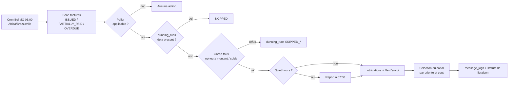

### 12.3 Canaux

| Canal | Implémentation | Usage | Coût relatif | Preuve de livraison |
| :--- | :--- | :--- | :--- | :--- |
| **WhatsApp** | Meta Cloud API, templates approuvés, pièce jointe PDF | Quittances, relances, confirmations | Moyen (par conversation de 24 h) | `sent` / `delivered` / `read` / `failed` |
| **SMS** | Interface `SmsProvider` (passerelle locale), segments GSM-7 | Repli si WhatsApp échoue ou absent, OTP | Élevé à l'unité | Accusé opérateur, souvent partiel |
| **Push FCM** | Firebase, application mobile | Alertes internes (nouvelle facture, remise à clôturer, conflit à traiter) | Nul | `success` / `failure` par token |
| **Email** | SMTP transactionnel | Relevés de gérance, exports, factures d'abonnement | Nul | Bounce / complaint |

**Ordre de repli.** Push (si l'appareil est actif depuis moins de 7 jours) → WhatsApp (si une ligne `contact_channels` WhatsApp est vérifiée) → SMS. Un canal n'est retenté qu'une fois ; l'échec définitif d'un palier n'entraîne **jamais** l'escalade automatique au palier suivant.

**Fenêtre de 24 h.** Hors fenêtre de service, seul un **template approuvé** peut être envoyé sur WhatsApp. La bibliothèque de templates est versionnée dans le dépôt (`infra/whatsapp/templates/`), soumise à approbation Meta, et son code d'approbation est stocké dans `notification_templates`.

### 12.4 `notification_templates`

Table unique pour tous les canaux : `code` (ex. `dunning_overdue_1`), `channel`, `locale` (`fr-CG`), `subject`, `body` (Handlebars), `variables` (JSONB décrivant les variables attendues et leur type), `whatsapp_template_name`, `whatsapp_approval_status`, `version`, `is_active`, `organization_id` **nullable** (NULL = template système, valeur = surcharge du tenant).

Variables canoniques disponibles : `{{tenant.firstName}}`, `{{invoice.number}}`, `{{invoice.amountFormatted}}`, `{{invoice.dueDate}}`, `{{lease.unitLabel}}`, `{{organization.name}}`, `{{payment.link}}`, `{{receipt.verifyUrl}}`.

**Contrôles.** Rendu en **sandbox** (pas d'accès aux helpers de fichiers), échappement systématique, longueur SMS calculée avant envoi (alerte au-delà de 2 segments), et test de rendu obligatoire en CI pour chaque template avec un jeu de variables de référence. Une variable manquante fait **échouer l'envoi** plutôt que d'expédier un message avec un trou.

### 12.5 Quiet hours, opt-out et fréquence

| Garde-fou | Règle par défaut | Portée |
| :--- | :--- | :--- |
| Quiet hours | Aucun envoi entre **21 h et 7 h** (`Africa/Brazzaville`) ; report à 7 h le lendemain | Paramétrable par organisation |
| Jours | Relances envoyées du lundi au samedi ; dimanche reporté au lundi | Paramétrable |
| Plafond par destinataire | **4 messages transactionnels / 7 jours** hors OTP et quittances | Global |
| Opt-out | Réponse `STOP` (SMS) ou blocage (WhatsApp) → `contact_channels.opted_out_at` renseigné | Par canal, par tiers |
| Périmètre de l'opt-out | Coupe les **relances**, jamais les OTP de sécurité ni les quittances (pièces contractuelles) | — |
| Réactivation | Uniquement par action explicite du locataire, tracée dans `audit_logs` | — |

Les OTP sont exclus des quiet hours et du plafond : ils sont déclenchés par l'utilisateur lui-même.

### 12.6 Maîtrise des coûts

| Levier | Mise en œuvre | Effet attendu |
| :--- | :--- | :--- |
| Priorité au canal gratuit | Push d'abord quand l'appareil est actif | Supprime des envois payants sur la population équipée |
| Regroupement | Un locataire avec plusieurs baux reçoit **un seul** message consolidé par palier | Divise les envois par le nombre de baux |
| Fenêtre de 24 h exploitée | Réponse du locataire → messages libres gratuits pendant 24 h : la quittance est envoyée dans la fenêtre ouverte quand c'est possible | Évite une conversation facturée supplémentaire |
| Seuil minimal | `min_amount_xaf` par défaut à 5 000 FCFA | Évite de relancer des soldes symboliques |
| SMS concis | Gabarits ≤ 160 caractères GSM-7, pas d'accents décoratifs, URL raccourcie | Un seul segment facturé |
| Budget mensuel | `organization_settings.messaging_budget_xaf` ; à 80 % alerte au gestionnaire, à 100 % **suspension des relances non critiques** (OTP et quittances maintenus) | Plafonne le risque financier |
| Suivi | Coût unitaire estimé par message dans `message_logs`, tableau Grafana « coût par organisation / par canal / par palier » | Rend le poste pilotable |

**Facturation refacturée.** Le coût messagerie est un poste explicite du modèle SaaS : chaque plan inclut un quota, le dépassement est facturé au réel dans `subscription_invoices`. Cette transparence est ce qui rend acceptable le choix du canal officiel WhatsApp (§2.3).


---

## 12bis. Cycle de la commission d'apport d'affaires

Le programme d'apport d'affaires du référentiel commun (`_DECISIONS_COMMUNES.md`, « Démarcheurs et gestionnaires informels ») distingue deux machines à états portées par le module `referrals` (§4.1) : celle du parrainage lui-même (`referrals.status`) et celle de chaque commission qu'il génère (`referral_commissions.status`).

| Table | Statuts | Portée |
| :--- | :--- | :--- |
| `referrals` (`referral_status`) | `PENDING` → `QUALIFIED` → `ACTIVE` (→ `EXPIRED` / `CANCELLED`) | Lien entre un `referral_partner` et l'organisation qu'il a apportée, valable pour la durée définie par le `referral_program` |
| `referral_commissions` (`referral_commission_status`) | `ACCRUED` → `APPROVED` → `PAID` (→ `REVERSED` / `CANCELLED`) | Une commission par `subscription_invoice` payée, rattachée à un `referral` `ACTIVE` |

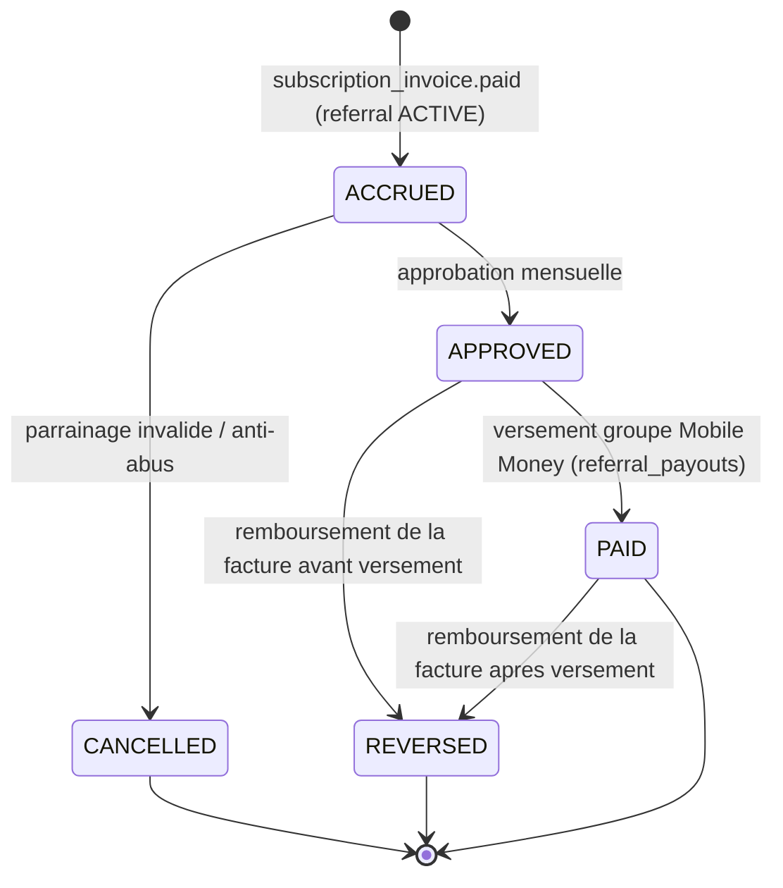

Une commission naît à l'état `ACCRUED` dès qu'une `subscription_invoice` est payée pour une organisation dont le `referral` est `ACTIVE` : le montant est calculé au taux en bps défini par le `referral_program`. Un job répétable BullMQ `referrals:monthly-approval` s'exécute en début de mois : chaque commission `ACCRUED` dont la facture source est toujours `PAID` passe à `APPROVED`, après vérification des règles anti-abus (identité du partenaire, plafond mensuel). Les commissions `APPROVED` d'un même partenaire sont regroupées dans un `referral_payout` dès que leur somme atteint le montant minimum de versement du programme ; le versement est exécuté par le port `MobileMoneyProvider` (§2.4, §8.2), confirmé par re-interrogation du statut avant que les commissions du lot ne passent à `PAID` — même règle de non-confiance au webhook que pour les encaissements locataires (§1.1).

Si la `subscription_invoice` d'origine est remboursée, la commission correspondante est contre-passée (`REVERSED`, `reversal_of_id`), qu'elle soit encore `APPROVED` ou déjà `PAID` ; un versement déjà exécuté n'est pas récupéré automatiquement et fait l'objet d'un traitement manuel par un administrateur de la plateforme. `referral_payouts` et `referral_commissions` suivent la même discipline que les autres écritures financières du référentiel commun : append-only sur les colonnes financières, correction uniquement par contre-passation (§4.6).

---

## 13. Sécurité

### 13.1 Référentiel et niveau visé

Immodesk vise **OWASP ASVS 4.0 niveau 2** (application manipulant des données financières et personnelles). Le niveau 2 est un engagement vérifiable : chaque chapitre ASVS est rattaché à un contrôle implémenté et à un test automatisé.

| Chapitre ASVS | Contrôle Immodesk | Vérification |
| :--- | :--- | :--- |
| V2 Authentification | OTP téléphone à 6 chiffres, TTL 5 min, 5 tentatives, hash Argon2id du code, verrouillage progressif | e2e `auth.otp.spec.ts` |
| V3 Session | JWT access 15 min, refresh rotatif 30 j avec détection de réutilisation (révocation de toute la famille), cookie `__Host-` | e2e + test de rejeu |
| V4 Contrôle d'accès | Matrice `packages/shared/permissions` + **RLS PostgreSQL** comme dernier rempart | Tests d'isolation (§15.5) |
| V5 Validation | `zod` sur toute entrée, Prisma paramétré, `$queryRaw` uniquement en template tagué | Lint interdisant `$queryRawUnsafe` |
| V7 Journalisation | `audit_logs` append-only, logs `pino` sans données sensibles | Revue + test de non-régression |
| V8 Données | Chiffrement au repos et en transit, minimisation, rétention (§13.6) | Audit trimestriel |
| V9 Communications | TLS 1.3, HSTS `max-age=63072000; includeSubDomains; preload` | `testssl.sh` en CI hebdomadaire |
| V12 Fichiers | Upload par URL signée, type MIME vérifié côté serveur, taille plafonnée, pas d'exécution | Tests d'intégration |
| V13 API | Rate limit par IP, par utilisateur et par organisation ; pagination par curseur opaque | Tests de charge |

### 13.2 Chiffrement

| Périmètre | Mécanisme |
| :--- | :--- |
| Transit externe | TLS 1.3 obligatoire (Caddy/Traefik, certificats Let's Encrypt automatiques), HSTS preload, redirection 301 systématique |
| Transit interne | Réseau Docker privé, PostgreSQL et Redis **non exposés publiquement**, `sslmode=require` vers la base |
| Repos — base | Chiffrement du volume (LUKS sur le VPS) + `pgcrypto` pour les colonnes hautement sensibles (numéro de pièce d'identité, RIB) |
| Repos — objets | R2 chiffré au repos ; accès exclusivement par **URL signée à 15 min**, jamais de bucket public |
| Repos — mobile | SQLCipher AES-256, clé en Keystore/Keychain (§10.9) |
| Sauvegardes | Chiffrement **age** (clé publique en CI, clé privée hors ligne) avant dépôt hors site |
| Secrets applicatifs | Voir §13.3 |

En-têtes de sécurité imposés par la périphérie : `Content-Security-Policy` stricte avec nonce (pas de `unsafe-inline`), `X-Content-Type-Options: nosniff`, `Referrer-Policy: strict-origin-when-cross-origin`, `Permissions-Policy` minimale, `X-Frame-Options: DENY` sauf sur la page publique de vérification.

### 13.3 Gestion des secrets

**Décision : SOPS + age**, avec Doppler évalué comme alternative si l'équipe dépasse cinq personnes.

| Aspect | Mise en œuvre |
| :--- | :--- |
| Stockage | `infra/secrets/{dev,staging,prod}.enc.yaml` chiffrés SOPS, **versionnés** dans le dépôt |
| Clés | age ; clé de production détenue par deux personnes, sauvegardée hors ligne, jamais dans le dépôt |
| CI/CD | `SOPS_AGE_KEY` en secret GitHub Actions, déchiffrement au moment du déploiement uniquement, en mémoire |
| Runtime | Variables d'environnement injectées par le compose de déploiement ; validation `zod` au démarrage, **le processus refuse de démarrer** si un secret est absent ou mal formé |
| Rotation | Trimestrielle pour les clés d'API tierces, immédiate en cas de départ ou de suspicion ; `infra/scripts/rotate-secrets.sh` |
| Détection de fuite | `gitleaks` en pre-commit et en CI, blocage de la PR |

Aucun secret ne transite en clair par un canal de discussion, un ticket ou un fichier `.env` partagé.

### 13.4 Webhooks : signature et anti-rejeu

Les webhooks entrants (agrégateur Mobile Money, WhatsApp Cloud API) sont la surface la plus exposée : ils sont publics, non authentifiés par session, et déclenchent des effets financiers.

| Contrôle | Règle |
| :--- | :--- |
| Signature | HMAC-SHA256 sur le **corps brut** (avant tout parsing JSON), comparaison à temps constant |
| Horodatage | En-tête de timestamp obligatoire, tolérance **± 5 minutes** ; hors fenêtre → 401 |
| Anti-rejeu | `webhook_events(provider, event_id)` en clé unique ; un doublon retourne **200** sans retraitement |
| Persistance d'abord | Le payload brut est enregistré, puis un job BullMQ traite l'événement : la réponse HTTP est rendue en moins de 500 ms |
| Filtrage réseau | Liste d'IP autorisées du fournisseur au niveau du reverse proxy quand elle est publiée |
| Autorité | Un webhook **ne confirme jamais** un paiement : il déclenche une re-interrogation du statut auprès du fournisseur (règle non négociable, §2.4) |
| Rattrapage | Job périodique de réconciliation des paiements `PENDING` de plus de 15 min, indépendant des webhooks |

Les webhooks **sortants** (intégrations futures) sont signés de la même façon, avec un secret par abonné et une rotation sans coupure (deux secrets valides pendant 24 h).

### 13.5 Journal d'audit

`audit_logs` est **append-only** : `REVOKE UPDATE, DELETE` sur le rôle applicatif, et un trigger qui lève une exception en cas de tentative. Colonnes : `id` (UUID v7), `organization_id`, `actor_user_id`, `actor_role`, `action`, `entity_type`, `entity_id`, `before` (JSONB), `after` (JSONB), `ip`, `user_agent`, `device_id`, `client_ref`, `request_id`, `occurred_at`.

Événements obligatoirement audités : toute transition d'état (bail, facture, paiement, remise, quittance), toute modification de montant ou de règle de pénalité, tout changement de rôle ou d'appartenance, toute connexion et tout échec d'authentification, tout export de données, tout accès à un document par URL signée, toute annulation ou contre-passation avec son motif obligatoire.

Les logs applicatifs (`pino`, JSON) portent `request_id`, `organization_id`, `user_id`, mais **jamais** de jeton, de code OTP, de payload de webhook brut ni de numéro de pièce d'identité — une liste de rédaction (`redact`) est configurée au niveau du logger et testée.

### 13.6 Protection des données personnelles — loi congolaise de 2019

La loi n° 29-2019 du 10 octobre 2019 sur la protection des données à caractère personnel structure les obligations. Les principes retenus, alignés sur un socle également compatible RGPD :

| Principe | Mise en œuvre |
| :--- | :--- |
| **Consentement** | Collecte explicite et horodatée à la création d'un tiers (`contact_channels.consent_at`, `consent_source`) ; consentement distinct pour les canaux de communication (§12.5) ; jamais de case pré-cochée |
| **Finalité** | Chaque catégorie de donnée est rattachée à une finalité déclarée (gestion locative, facturation, obligation légale) ; toute nouvelle finalité exige un nouveau consentement |
| **Minimisation** | Pièce d'identité **hachée et non conservée en clair** au-delà de la vérification, sauf obligation contractuelle ; pas de géolocalisation continue du démarcheur, seulement le point de l'encaissement |
| **Conservation** | Baux et pièces financières : **10 ans** (obligation comptable) ; prospects non convertis : 24 mois ; logs techniques : 12 mois ; médias d'états des lieux : durée du bail + 5 ans. Purge automatisée par job mensuel, tracée |
| **Droit d'accès et portabilité** | Export complet des données d'une personne ou d'une organisation (JSON + PDF) sous 30 jours, en libre-service pour l'`OWNER` |
| **Rectification et effacement** | Rectification en ligne ; effacement honoré sauf sur les pièces financières couvertes par l'obligation légale, avec réponse motivée |
| **Responsable de traitement** | L'**organisation cliente** est responsable de traitement ; Immodesk est **sous-traitant**, lié par une annexe contractuelle (mesures de sécurité, sous-traitants ultérieurs, notification de violation sous 72 h) |
| **Transfert hors du territoire** | Hébergement Paris déclaré aux clients dans les CGU, avec engagement de réversibilité et d'export intégral (voir ADR-010) |
| **Registre** | Registre des traitements maintenu dans `docs/conformite/registre.md`, revu semestriellement |

### 13.7 Matrice des menaces spécifiques au terrain

| Menace | Scénario | Contrôles préventifs | Détection | Réponse |
| :--- | :--- | :--- | :--- | :--- |
| **Faux reçu de caisse** | Un démarcheur remet un reçu fabriqué (carnet, capture retouchée) et garde l'argent | Numérotation serveur `CASH-{org}-{collector}-{seq}` non devinable, QR de vérification publique sur chaque reçu, signature du locataire capturée, notification WhatsApp au locataire à l'encaissement | Écart entre reçus émis et `cash_remittances` ; reçus jamais synchronisés ; vérifications QR négatives comptabilisées | Suspension du compte démarcheur, gel de sa tournée, export des `audit_logs`, plainte |
| **Faux justificatif de virement** | Un locataire téléverse une capture d'écran retouchée | `bank_transfer_declarations` en statut **`PENDING_VERIFICATION`** : jamais de confirmation automatique ; confrontation obligatoire à `bank_statement_lines` (§8) ; hash du fichier et conservation de l'original | Déclaration sans ligne bancaire correspondante après 5 jours ; hash identique réutilisé | Rejet motivé, facture réputée impayée, alerte gestionnaire |
| **Appareil de démarcheur volé** | Téléphone perdu avec base locale et tournée en cours | SQLCipher + code PIN applicatif obligatoire, verrouillage après 3 échecs, session courte, plafond d'encaissement par démarcheur, aucun export local en clair | Absence de synchronisation > 24 h ; connexion depuis un `device_id` inconnu ; géolocalisation d'encaissement aberrante | Révocation immédiate des refresh tokens du `device_id`, effacement de la clé SQLCipher au prochain contact, réémission des reçus non remontés |
| **Compte compromis** | Identifiants ou SIM d'un gestionnaire détournés (échange de SIM) | OTP avec verrouillage progressif, détection de réutilisation de refresh token, notification à toute nouvelle connexion, 2ᵉ facteur exigé pour les actions sensibles (changement d'IBAN de reversement, ajout de membre, export massif), délai de latence de 24 h sur un changement de coordonnées bancaires | Alerte sur connexion depuis un nouvel appareil ou une nouvelle géographie ; pic d'exports ; modification d'IBAN | Révocation globale de session, gel des reversements en attente, contact hors bande du bailleur |
| **Démarcheur qui rejoue un lot** | Renvoi manuel d'un `sync_batch` pour dupliquer des encaissements | Idempotence par `client_ref` ULID unique par organisation, `idempotency_keys` côté serveur | Taux de `DUPLICATE` anormal par appareil | Enquête, plafonnement, journalisation |
| **Fuite inter-tenant** | Un bug d'oubli de filtre expose les données d'une autre agence | RLS PostgreSQL activée sur toute table portant `organization_id`, contexte posé par `SET LOCAL`, rôle applicatif **non superutilisateur** et sans `BYPASSRLS` | Tests d'isolation obligatoires en CI (§15.5) ; alerte sur requête sans contexte org | Blocage du déploiement, notification de violation sous 72 h si avérée |

### 13.8 Sauvegardes chiffrées et scans en CI

**Sauvegardes.** pgBackRest : sauvegarde complète hebdomadaire, incrémentale quotidienne, archivage WAL continu ; chiffrement `age` avant dépôt sur un stockage objet distinct du fournisseur d'hébergement (règle 3-2-1). Les médias R2 bénéficient du versionnage d'objet et d'une règle de rétention de 30 jours sur les suppressions. **Une sauvegarde non restaurée n'est pas une sauvegarde** : l'exercice de restauration est trimestriel et chronométré (§14.7).

**Scans automatisés** (`.github/workflows/security.yml`) :

| Scan | Outil | Fréquence | Blocant |
| :--- | :--- | :--- | :--- |
| Dépendances JS/Dart | `pnpm audit`, `osv-scanner`, Dependabot | Chaque PR + quotidien | Oui à partir de « élevée » |
| Secrets | `gitleaks` | Pre-commit + chaque PR | Oui |
| SAST | CodeQL (TypeScript), `dart analyze` strict | Chaque PR | Oui sur « erreur » |
| Image Docker | `trivy` (OS + bibliothèques) | Chaque build | Oui à partir de « élevée » |
| IaC / compose | `checkov` | Chaque PR touchant `infra/` | Avertissement |
| DAST | OWASP ZAP baseline sur staging | Hebdomadaire | Avertissement + ticket |
| TLS | `testssl.sh` sur les domaines publics | Hebdomadaire | Avertissement |

Un test d'intrusion externe est planifié avant le lancement commercial (Phase 11).


---

## 14. Infrastructure et exploitation

### 14.1 Environnement de développement

Un seul prérequis pour démarrer : Docker et pnpm. `docker compose -f infra/docker/docker-compose.dev.yml up` lève PostgreSQL 16, Redis 7, MinIO (substitut R2 compatible S3), Mailpit (courriel), et un simulateur d'agrégateur Mobile Money maison qui reproduit les webhooks, y compris hors ordre, dupliqués et perdus — car un développeur doit rencontrer ces défauts **avant** la production.

| Service dev | Image | Port | Note |
| :--- | :--- | :--- | :--- |
| `postgres` | `postgres:16-alpine` | 5432 | Volume nommé, `pg_stat_statements` activé |
| `redis` | `redis:7-alpine` | 6379 | AOF activé, comme en production |
| `minio` | `minio/minio` | 9000/9001 | Bucket `immodesk-dev` créé au démarrage |
| `mailpit` | `axllent/mailpit` | 8025 | Interception de tout courriel sortant |
| `momo-sandbox` | Image locale | 4010 | Webhooks retardés, dupliqués, signatures valides et invalides |

L'API, les workers et le web tournent **hors conteneur** en développement (rechargement à chaud rapide) ; seules les dépendances sont conteneurisées. `pnpm dev` orchestre le tout via Turborepo. `pnpm db:reset` rejoue migrations, policies RLS et seed de démo congolais (§15.4).

### 14.2 Environnements

| Environnement | Hébergement | Données | Accès | Déploiement |
| :--- | :--- | :--- | :--- | :--- |
| **dev** | Poste développeur | Seed de démo | Local | — |
| **staging** | VPS Paris (mutualisé, 4 vCPU / 8 Go) | Copie **anonymisée** de production, rafraîchie chaque semaine | VPN + authentification supplémentaire à la périphérie, `noindex` | Automatique à chaque fusion sur `main` |
| **production** | VPS Paris dédiés (Hetzner CX/CCX ou OVH), 2 nœuds applicatifs + 1 nœud base | Réelles | SSH par clé uniquement, port non standard, pare-feu restrictif, aucun accès direct à la base | Manuel, sur tag `v*`, avec approbation |

L'anonymisation de staging est un script obligatoire (`infra/scripts/anonymize.sql`) : téléphones remplacés par une plage de test, noms substitués par un jeu congolais fictif, documents R2 non copiés, montants conservés (les invariants financiers doivent rester vérifiables).

### 14.3 Schéma de déploiement

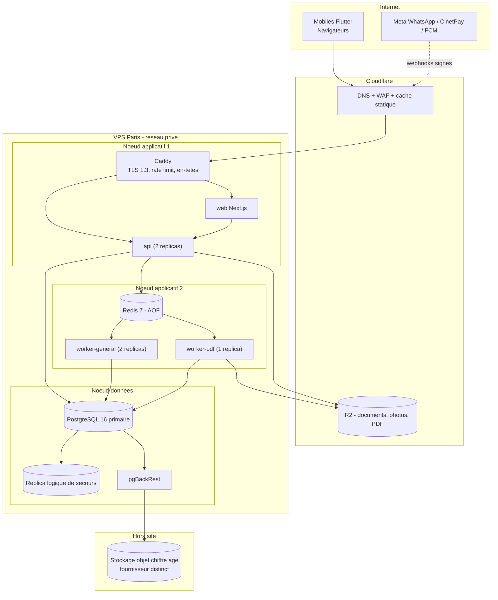

### 14.4 Périphérie, base et files

**Caddy** est retenu par défaut : configuration de dix lignes, TLS automatique, rechargement à chaud. Traefik reste l'option si l'orchestration devient dynamique (découverte de services, montée en charge horizontale) — le `Caddyfile` et l'équivalent Traefik sont maintenus dans `infra/`. La périphérie porte : TLS 1.3, HSTS, en-têtes de sécurité (§13.2), rate limit (100 req/min par IP, 1 000 par organisation authentifiée, 5 par minute sur l'envoi d'OTP), corps limité à 10 Mo, et journalisation d'accès structurée.

**PostgreSQL 16** : `shared_buffers` à 25 % de la RAM, `work_mem` calibré sur les requêtes de rapprochement, `pg_stat_statements`, `log_min_duration_statement = 500ms`, connexions via **PgBouncer** en mode transaction (compatible avec `SET LOCAL` du contexte RLS). Réplica logique de secours sur le même nœud initialement, sur un nœud distinct dès que le volume le justifie.

**Redis 7** : AOF `everysec`, `maxmemory-policy noeviction` (une file BullMQ ne doit jamais être évincée), files séparées `billing`, `dunning`, `notifications`, `pdf`, `sync`, `reconciliation`, chacune avec sa concurrence, ses retries exponentiels et sa **DLQ** inspectée quotidiennement.

### 14.5 CI/CD GitHub Actions

| Workflow | Déclencheur | Étapes |
| :--- | :--- | :--- |
| `ci.yml` | PR et push | Install pnpm (cache) → lint + Prettier + règles de frontière → typecheck → tests unitaires Vitest → tests d'intégration testcontainers → e2e supertest → `melos analyze` + `flutter test` → build API/web/mobile (APK debug) → vérification que `openapi.json` régénéré est identique au fichier versionné → budgets de bundle (§11.7) |
| `security.yml` | PR + planifié | Scans du §13.8 |
| `deploy-staging.yml` | Fusion sur `main` | Build et push des images (SHA du commit), `prisma migrate deploy`, application des policies RLS, déploiement, smoke tests, notification |
| `deploy-production.yml` | Tag `v*` + approbation d'environnement | Sauvegarde préalable → migrations → déploiement progressif nœud par nœud → healthchecks → smoke tests → étiquetage de la version dans Sentry ; rollback automatique si les healthchecks échouent |
| `mobile-release.yml` | Tag `mobile-v*` | fastlane : build signé, montée sur Play Store (piste interne) et TestFlight |

**Règles de migration.** Les migrations sont **compatibles en avant** : on ajoute une colonne nullable, on déploie le code, on remplit, on contraint dans une migration ultérieure. Aucune migration bloquante longue en heure ouvrée ; `lock_timeout` et `statement_timeout` positionnés pour échouer vite plutôt que verrouiller la production. Toute migration est accompagnée d'une procédure de retour arrière décrite dans la PR.

### 14.6 Observabilité

| Pilier | Outil | Contenu |
| :--- | :--- | :--- |
| Erreurs | **Sentry** (API, workers, web, Flutter) | Traces, version, `release`, `organization_id` en tag, données personnelles filtrées avant envoi |
| Métriques | **Prometheus + Grafana** | Techniques : latence p50/p95/p99, taux d'erreur, profondeur des files, âge du plus vieux job, connexions PostgreSQL, mémoire Chromium. Métier : factures émises, taux d'encaissement, paiements `PENDING` > 15 min, lots de sync rejetés, coût messagerie |
| Logs | **pino** JSON → Loki | `request_id` propagé de bout en bout (en-tête `X-Request-Id` fourni par le mobile), rédaction des champs sensibles (§13.5) |
| Disponibilité | Sonde externe (UptimeRobot ou équivalent) | `/health/live`, `/health/ready`, page publique de vérification de quittance |

**Healthchecks.** `/health/live` répond sans dépendance (le processus est vivant) ; `/health/ready` vérifie PostgreSQL, Redis et R2 et conditionne la réception du trafic. Les workers exposent une sonde de battement dans Redis, dont l'absence pendant 2 min déclenche une alerte.

**Alertes qui réveillent** (astreinte) : API indisponible > 2 min, PostgreSQL injoignable, taux d'erreur 5xx > 2 % sur 5 min, file `payments` en croissance continue, sauvegarde quotidienne échouée, espace disque < 15 %, certificat TLS à moins de 7 jours. Les autres alertes créent un ticket sans notification nocturne.

### 14.7 Sauvegarde, restauration et plan de reprise

| Objectif | Valeur | Moyen |
| :--- | :--- | :--- |
| **RPO** | **24 h** au pire, **≤ 5 min** en pratique | Sauvegarde quotidienne + archivage WAL continu (PITR) |
| **RTO** | **4 h** | Procédure de restauration scriptée et répétée |
| Rétention | 7 quotidiennes, 4 hebdomadaires, 12 mensuelles | pgBackRest |
| Chiffrement | `age`, clé privée hors ligne | Avant tout dépôt hors site |
| Localisation | Deux fournisseurs distincts, dont un hors du fournisseur d'hébergement | Règle 3-2-1 |
| Vérification | **Exercice trimestriel chronométré** : `infra/scripts/restore-drill.sh` restaure la dernière sauvegarde sur un environnement jetable, rejoue les invariants financiers (§15.6), et le résultat est consigné dans `docs/exploitation/journal-restaurations.md` | Bloquant : un exercice raté ouvre un incident |

**Plan de reprise.** Scénarios prévus et documentés dans `docs/exploitation/pra.md` :

| Scénario | Réponse | Cible |
| :--- | :--- | :--- |
| Perte d'un nœud applicatif | Le second nœud absorbe le trafic ; recréation par script d'approvisionnement | < 30 min |
| Corruption logique (mauvaise migration, suppression massive) | PITR à l'instant précédant l'incident, rejeu des `sync_batches` postérieurs depuis les outbox mobiles encore présentes | < 4 h |
| Perte du nœud base | Promotion du réplica, ou restauration pgBackRest complète sur un nœud neuf | < 4 h |
| Perte du datacenter | Reconstruction chez le fournisseur secondaire depuis les sauvegardes hors site (procédure complète scriptée) | < 24 h |
| Compromission | Isolation réseau, révocation de tous les jetons et secrets, restauration à un point sain, notification sous 72 h (§13.6) | Immédiat |

**Atout structurel.** L'offline-first du mobile est un filet de sécurité opérationnel : pendant une indisponibilité de l'API, les démarcheurs continuent d'encaisser et l'outbox rejoue à la reprise. C'est la raison pour laquelle le RTO de 4 h est tenable sans architecture haute disponibilité coûteuse.


---

## 15. Stratégie de tests

### 15.1 Pyramide et budget de temps

La contrainte est double : les invariants financiers ne tolèrent aucune régression, et la CI doit rester sous **15 minutes** sinon elle est contournée.

| Étage | Périmètre | Outil | Volume cible | Durée cible |
| :--- | :--- | :--- | :--- | :--- |
| Unitaires domaine | Règles métier pures : prorata, pénalités, allocation, `Money` XAF, numérotation | **Vitest** (aucune base, aucun mock de framework) | ~70 % des tests | < 30 s |
| Intégration Prisma | Repositories, transactions, contraintes SQL, **policies RLS**, migrations | **Testcontainers** (PostgreSQL 16 réel) | ~20 % | < 5 min |
| e2e API | Parcours HTTP complets, authentification, idempotence, webhooks | **Jest + supertest** sur une base testcontainers | ~7 % | < 4 min |
| Widget / unitaires Flutter | Domaine Dart, DAO Drift, `SyncEngine`, écrans critiques | `flutter_test`, `drift` en mémoire | — | < 3 min |
| e2e web | Cinq parcours critiques, deux navigateurs | **Playwright** | ~3 % | < 5 min |

**Règle d'écriture.** Aucun mock de PostgreSQL : une base réelle est plus rapide à faire fonctionner qu'un double fidèle, et seule elle valide RLS, contraintes d'exclusion et comportement transactionnel. Inversement, aucun test unitaire ne touche la base : si un test du domaine a besoin d'une base, c'est que la règle a fui hors du domaine.

### 15.2 Tests d'intégration Prisma sur testcontainers

Un conteneur PostgreSQL 16 est levé une fois par exécution (`globalSetup`), les migrations et les policies RLS sont appliquées, puis **chaque test s'exécute dans une transaction annulée** (`ROLLBACK`) pour l'isolation, sauf les tests qui vérifient précisément le comportement transactionnel, lesquels utilisent un schéma dédié tronqué après coup.

Sont couverts en priorité : contrainte d'exclusion sur le chevauchement de baux d'une même unité ; unicité de `client_ref` par organisation ; verrouillage de `sequences` sous concurrence (10 insertions parallèles → 10 numéros contigus, aucun trou, aucun doublon) ; refus d'`UPDATE` sur `payments`, `receipts` et `audit_logs` ; comportement de `SET LOCAL` du contexte RLS à travers PgBouncer en mode transaction ; réversibilité déclarée de chaque migration.

### 15.3 e2e API et parcours couverts

| Parcours | Assertions clés |
| :--- | :--- |
| Inscription + OTP + création d'organisation | Verrouillage après 5 échecs, expiration à 5 min, rotation du refresh token et détection de réutilisation |
| Cycle de vie complet d'un loyer | Génération de facture → paiement partiel → paiement soldant → statut `PAID` → émission de quittance → vérification publique du QR |
| Encaissement espèces terrain | `POST /v1/sync/batches` avec `client_ref`, **rejeu du même lot** → `DUPLICATE` sans double écriture, remise et contrôle d'équilibre |
| Mobile Money | Webhook signé → **aucune confirmation** avant re-interrogation du statut ; webhook dupliqué → 200 sans effet ; webhook hors fenêtre de 5 min → 401 ; signature invalide → 401 |
| Virement déclaré | Déclaration `PENDING_VERIFICATION`, import de relevé, appariement, confirmation ; justificatif au hash déjà vu → alerte |
| Relance | J-5 / J / J+3 / J+10, quiet hours, opt-out, non-envoi si la facture est soldée entre planification et émission, unicité `dunning_runs` |
| Gérance | Relevé de bailleur, commissions, reversement, cohérence avec les encaissements de la période |

### 15.4 Données de démo congolaises

Un jeu de données unique (`prisma/seed/demo-brazzaville.ts`) sert au développement, à la démonstration commerciale et de socle aux tests e2e. Il doit être **crédible pour un professionnel de Brazzaville**, sinon les anomalies métier passent inaperçues.

| Élément | Contenu |
| :--- | :--- |
| Organisations | « Agence Kimbouala Immobilier » (`AGENCY`, Brazzaville) et « M. Ngoma Bailleur » (`INDEPENDENT_LANDLORD`, Pointe-Noire) |
| Patrimoine | Immeubles et parcelles à Bacongo, Poto-Poto, Moungali, Ouenzé, Mpita et Ngoyo ; studios, appartements 2 et 3 chambres, boutiques, cours communes |
| Loyers | 45 000 à 350 000 FCFA/mois, cautions de 1 à 3 mois, charges eau et électricité relevées au compteur |
| Personnes | Noms usuels (Mabiala, Nkodia, Loemba, Bouya, Samba), numéros `+242 06 / +242 05`, quelques locataires sans compte utilisateur |
| Situations | Un bail clôturé, une facture annulée, un trop-perçu converti en avoir, un impayé de 4 mois en relance J+10, une remise de démarcheur non clôturée, un virement déclaré non apparié, un chèque en compensation |
| Volumétrie « perf » | Variante à 5 000 baux et 60 000 factures pour les tests de charge et l'évaluation des index |

Le seed est **déterministe** (graine fixe) : deux exécutions produisent des identifiants et des montants identiques, condition nécessaire à des tests e2e stables.

### 15.5 Tests d'isolation multi-tenant

Ces tests sont **bloquants et non contournables** : une fuite inter-tenant est l'incident qui tue le produit.

| Test | Attendu |
| :--- | :--- |
| Lecture croisée | Un jeton de l'organisation A ne retourne **aucune** ligne de B — sur les 60+ tables portant `organization_id`, vérifié par un test paramétré qui énumère la métadonnée du schéma |
| Écriture croisée | `INSERT`/`UPDATE` avec un `organization_id` étranger → erreur RLS, jamais une écriture silencieuse |
| Accès direct par identifiant | `GET /v1/invoices/{id}` d'une facture de B avec un jeton de A → **404**, pas 403 (aucune divulgation d'existence) |
| Contexte manquant | Toute requête exécutée sans `SET LOCAL app.organization_id` → **0 ligne**, jamais toutes les lignes |
| Rôle applicatif | Le rôle de connexion n'est ni superutilisateur ni `BYPASSRLS` — assertion au démarrage de l'API et en test |
| Nouvelle table | Un test de métadonnée échoue si une table porte `organization_id` **sans** policy RLS associée : le filet se maintient tout seul |
| Fichiers | Une URL signée d'un document de B, présentée par A, est refusée ; les URL expirent bien à 15 min |
| Cache | Les clés Redis et les clés TanStack Query sont préfixées par l'organisation ; test de non-collision |

### 15.6 Invariants financiers

Ces invariants sont vérifiés à trois endroits : en **test unitaire** (règle pure), en **test d'intégration** (après chaque scénario, sur la base réelle), et en **production** par un job de contrôle nocturne qui lève une alerte et ouvre un incident en cas de violation. Ils sont également rejoués après chaque exercice de restauration (§14.7).

| # | Invariant | Expression |
| :--- | :--- | :--- |
| I1 | Somme des allocations = montant du paiement | `Σ payment_allocations.amount (payment_id = P) + trop_perçu(P) = payments.amount(P)` pour tout paiement `CONFIRMED` |
| I2 | Solde d'une facture | `solde(F) = rent_invoices.total(F) − Σ payment_allocations.amount(invoice_id = F)`, toujours **≥ 0** |
| I3 | Statut cohérent avec le solde | `solde = 0 ⇒ PAID` ; `0 < solde < total ⇒ PARTIALLY_PAID` ; `solde = total ∧ échéance dépassée ⇒ OVERDUE` |
| I4 | Total de facture | `rent_invoices.total = Σ invoice_lines.amount` (loyer + charges + pénalités + autres) |
| I5 | Remise de caisse | `cash_remittances.total = Σ cash_remittance_items.amount = Σ cash_receipts.amount` des reçus rattachés |
| I6 | Reçu non orphelin | Tout `cash_receipts.status = ISSUED` a `remittance_id` nul ; tout `REMITTED` est rattaché à exactement une remise `VERIFIED` ou `DEPOSITED` |
| I7 | Trop-perçu | Tout excédent d'un paiement crée un `tenant_credits` de montant égal ; `Σ crédits utilisés ≤ Σ crédits émis` par locataire |
| I8 | Dépôt de garantie | `deposits.balance = Σ deposit_movements.amount`, jamais négatif ; la restitution n'excède jamais le solde |
| I9 | Contre-passation | Toute annulation est une **écriture inverse** de même montant absolu référençant l'écriture d'origine ; aucun `UPDATE` sur `payments` ou `receipts` |
| I10 | Devise et type | Tout montant est un `BIGINT` en XAF ; aucune colonne monétaire n'est `NUMERIC` ni `FLOAT` — vérifié par un test de métadonnée du schéma |
| I11 | Numérotation | Les séquences de reçus, quittances et factures sont **contiguës par organisation et par exercice**, sans doublon, y compris sous concurrence |
| I12 | Relevé de gérance | `owner_statements.net_payout = Σ encaissements de la période − Σ commissions − Σ expenses imputées`, et `Σ owner_payouts ≤ net_payout cumulé` |
| I13 | Mobile Money | `payments.amount = mobile_money_transactions.amount − frais` selon la convention de l'organisation ; les frais sont toujours explicitement imputés |
| I14 | Audit exhaustif | Toute transition d'état d'une entité financière possède une ligne `audit_logs` correspondante ; test comparant les transitions d'un scénario complet au journal produit |

### 15.7 Couverture, qualité et données de test

Seuils de couverture exigés : **90 %** sur `core_domain` (Dart) et sur les modules `billing`, `payments-*`, `receipts` et `agency-accounting` (TypeScript) ; **70 %** ailleurs ; aucun seuil sur l'UI, où la valeur est apportée par les tests de parcours. La couverture est un garde-fou, jamais un objectif : une PR touchant une règle financière doit citer l'invariant concerné (§3.4) et présenter un test qui **échoue sans le correctif**.

Les tests utilisent des constructeurs de données explicites (`aLease().withRent(120_000).closed()`) plutôt que des fixtures JSON opaques, afin que l'intention du scénario soit lisible dans le test lui-même. Toute correction d'anomalie en production commence par un test de régression reproduisant l'anomalie.


---

## 16. Conventions de code et de contribution

### 16.1 Langue et nommage

**Le code est en anglais, le produit est en français.** La frontière est nette : identifiants, tables, colonnes, messages de commit et commentaires en anglais ; libellés d'interface, documentation et messages destinés à l'utilisateur en `fr-CG`, via les fichiers d'internationalisation. Un `catch` ne renvoie jamais une chaîne française : il renvoie un **code d'erreur stable** que la couche de présentation traduit.

| Élément | Convention | Exemple |
| :--- | :--- | :--- |
| Table PostgreSQL | `snake_case`, **pluriel** | `payment_allocations`, `cash_remittances` |
| Colonne | `snake_case` ; suffixes normalisés `_id`, `_at`, `_xaf`, `is_`, `has_` | `confirmed_at`, `total_xaf`, `is_active` |
| Modèle Prisma | `PascalCase` singulier, mappé par `@@map` | `model PaymentAllocation { @@map("payment_allocations") }` |
| Enum partagé | `PascalCase` pour le type, `SCREAMING_SNAKE_CASE` pour les valeurs | `PaymentStatus.PENDING_VERIFICATION` |
| Fichier TypeScript | `kebab-case.role.ts` | `confirm-payment.use-case.ts`, `payment.repository.ts` |
| Classe / interface | `PascalCase`, **sans préfixe `I`** | `MobileMoneyProvider`, `ConfirmPaymentUseCase` |
| Cas d'usage | Verbe à l'impératif + objet | `IssueRentInvoice`, `CloseCashRemittance` |
| Événement de domaine | `entité.verbe-au-passé` | `payment.confirmed`, `invoice.issued` |
| File BullMQ / job | `kebab-case` | `billing:issue-monthly-invoices` |
| Route API | `kebab-case`, ressources au pluriel, versionnée | `POST /v1/cash-remittances/{id}/close` |
| Route web (URL) | **En français**, car visible de l'utilisateur | `/agence-x/encaissements` |
| Fichier Dart | `snake_case.dart` | `cash_collection_controller.dart` |
| Provider Riverpod | `camelCase` + suffixe `Provider` | `overdueInvoicesProvider` |
| Montant | Toujours suffixé `_xaf`, type `BIGINT`/`int`/`bigint` | `amount_xaf` |
| Booléen | Préfixe `is_`, `has_`, `can_` | `has_guarantor` |
| Migration | `AAAAMMJJHHMMSS_verbe_objet` | `20260401120000_add_dunning_rules` |

**Interdits de nommage** : abréviations non conventionnelles (`pmt`, `inv`), `data`/`info`/`manager` comme nom de classe, pluriel sur une variable scalaire, et surtout tout identifiant mêlant français et anglais (`montantTotal`, `factureRepository`).

### 16.2 Structure d'un module backend

Chaque module de `apps/api/src/modules/` suit la même arborescence, sans exception — la prévisibilité vaut plus que l'optimisation locale.

```text
modules/billing/
├── domain/                       # aucune dependance technique
│   ├── entities/rent-invoice.entity.ts
│   ├── value-objects/billing-period.vo.ts
│   ├── events/invoice-issued.event.ts
│   ├── policies/penalty.policy.ts
│   ├── errors/billing.errors.ts
│   └── ports/rent-invoice.repository.ts       # interface uniquement
├── application/
│   ├── use-cases/issue-rent-invoice.use-case.ts
│   ├── handlers/on-payment-confirmed.handler.ts
│   └── dto/                                    # schemas zod importes de shared
├── infrastructure/
│   ├── persistence/prisma-rent-invoice.repository.ts
│   ├── jobs/monthly-invoicing.processor.ts
│   └── mappers/rent-invoice.mapper.ts
├── presentation/
│   ├── billing.controller.ts                   # HTTP + decorateurs OpenAPI
│   └── billing.facade.ts                       # SEULE surface exposee aux autres modules
├── billing.module.ts
└── __tests__/
```

**Règles de frontière**, appliquées par `eslint-plugin-boundaries` et donc vérifiées en CI :

1. `domain/` n'importe ni Prisma, ni NestJS, ni aucune bibliothèque d'infrastructure.
2. `application/` dépend de `domain/` et des ports, **jamais** d'une implémentation concrète.
3. `infrastructure/` implémente les ports ; personne n'importe une classe d'infrastructure d'un autre module.
4. Un module n'accède à un autre que par sa **façade** ou par un **événement de domaine** — jamais par son repository ni par ses tables.
5. Toute règle métier vit dans `domain/` ; un contrôleur qui contient un `if` métier est un défaut de revue.

Côté Flutter, la symétrie est physique (§10.2) : les packages `core_domain`, `core_data`, `core_sync` remplacent les dossiers, et le graphe de dépendances `melos` interdit les inversions à la compilation.

### 16.3 Modèle d'ADR

Toute décision structurante (choix de bibliothèque, modèle de données transverse, protocole d'intégration, arbitrage de sécurité ou de coût) fait l'objet d'un ADR numéroté dans `docs/adr/`, au format `NNNN-titre-en-kebab-case.md`. Un ADR est **immuable** : on ne le modifie pas, on en écrit un nouveau qui le remplace (`Superseded by ADR-0XX`).

```markdown
# ADR-0NNN — Titre court et factuel

- **Statut** : Proposé | Accepté | Rejeté | Remplacé par ADR-0XX
- **Date** : AAAA-MM-JJ
- **Décideurs** : rôles
- **Phase concernée** : Phase N

## Contexte
Situation, contrainte terrain, options considérées et ce qui les départage.

## Décision
Ce qui est tranché, à la voix active, sans conditionnel.

## Conséquences
### Positives
### Négatives / dette acceptée
### Réversibilité
Coût et déclencheur d'un retour en arrière.

## Alternatives écartées
| Option | Pourquoi écartée |
```

### 16.4 Branches, PR et revue de code

Branches : `main` (déployée en staging automatiquement), `feat/<portée>-<résumé>`, `fix/<portée>-<résumé>`, `hotfix/<résumé>`. Historique **linéaire** : rebase, puis `squash and merge` avec un message respectant les Conventional Commits (§3.4).

Une PR : **400 lignes modifiées au maximum** hors fichiers générés, une intention unique, un titre qui décrit l'effet métier. Le gabarit exige : le contexte, la portée, la façon de tester, les captures d'écran pour toute modification d'interface, la procédure de retour arrière pour toute migration, et l'**invariant financier concerné** (§15.6) quand une règle d'argent est touchée.

Revue : **un approbateur minimum**, **deux** pour tout changement touchant l'argent, la sécurité, la RLS ou les migrations. Le relecteur cherche, dans cet ordre : (1) correction métier et invariants, (2) isolation multi-tenant, (3) gestion des cas d'erreur et d'annulation, (4) conséquences sur la synchronisation hors ligne, (5) coût (requêtes N+1, messages payants, index manquant), (6) lisibilité. Le style n'est **jamais** un sujet de revue : Prettier et `dart format` tranchent.

Ton attendu : les remarques bloquantes sont préfixées `[bloquant]`, les suggestions `[suggestion]`, les questions `[question]`. Un désaccord non résolu en deux allers-retours est arbitré à l'oral, et sa conclusion devient un ADR si elle est structurante.

### 16.5 Definition of Done

Une tâche n'est terminée que lorsque **tous** ces points sont vrais :

| # | Critère |
| :--- | :--- |
| 1 | Le comportement attendu est implémenté, y compris les cas d'erreur, d'annulation et de contre-passation |
| 2 | Tests au bon étage de la pyramide (§15.1) ; une correction d'anomalie est accompagnée d'un test qui échouait avant |
| 3 | Les invariants financiers touchés (§15.6) sont couverts par un test |
| 4 | L'isolation multi-tenant est préservée : nouvelle table ⇒ policy RLS **et** test d'isolation |
| 5 | Migration réversible, compatible en avant, procédure de retour arrière documentée dans la PR |
| 6 | `openapi.json` régénéré et versionné ; clients TypeScript et Dart régénérés si le contrat change |
| 7 | Toute action mobile hors ligne possède son opération d'outbox, son `client_ref` et sa règle de conflit (§10.8) |
| 8 | Toute transition d'état écrit dans `audit_logs` |
| 9 | Textes utilisateur dans `fr-CG`, aucune chaîne codée en dur ; montants formatés en XAF entier |
| 10 | Accessibilité vérifiée sur les écrans web modifiés (§11.6) ; budgets de bundle respectés (§11.7) |
| 11 | Lint, typecheck, tests, scans de sécurité au vert en CI |
| 12 | Journalisation et métriques utiles ajoutées ; aucune donnée sensible dans les logs (§13.5) |
| 13 | Documentation mise à jour : ADR si la décision est structurante, section concernée de ce document si l'architecture bouge |
| 14 | Vérifié sur staging avec le jeu de démo congolais avant fusion vers la production |


---

## 17. Annexe : ADR initiaux

Les dix ADR ci-dessous figent les décisions de Phase 0. Ils sont résumés ici ; leur version intégrale vit dans `docs/adr/` au format du §16.3. Un ADR ne se modifie pas : il se remplace.

| N° | Décision | Statut | Phase |
| :--- | :--- | :--- | :--- |
| ADR-001 | Monolithe modulaire NestJS 11 + Prisma | Accepté | 0 |
| ADR-002 | Flutter offline-first : Riverpod + Drift | Accepté | 0 / 5 |
| ADR-003 | WhatsApp Cloud API officielle | Accepté | 0 / 3 |
| ADR-004 | Agrégateur Mobile Money derrière une interface | Accepté | 4 |
| ADR-005 | Montants en BIGINT XAF, sans décimale | Accepté | 0 |
| ADR-006 | UUID v7 en clé primaire | Accepté | 0 |
| ADR-007 | Multi-tenant par Row Level Security PostgreSQL | Accepté | 0 |
| ADR-008 | Authentification par téléphone + OTP | Accepté | 0 |
| ADR-009 | Monorepo unique pnpm + Turborepo | Accepté | 0 |
| ADR-010 | Hébergement en région Europe (Paris) | Accepté | 0 |

### ADR-001 — Monolithe modulaire NestJS 11 + Prisma

**Contexte.** Équipe de deux à quatre développeurs, domaine financier fortement transactionnel, budget d'exploitation contraint, besoin d'un contrat d'API partagé entre un web TypeScript et un mobile Dart. Les options étaient : microservices Node, monolithe Laravel/PHP (vivier local plus large à Brazzaville), monolithe modulaire NestJS.

**Décision.** Monolithe modulaire NestJS 11 en TypeScript strict, découpé en modules Clean Architecture (`domain` / `application` / `infrastructure` / `presentation`), ORM Prisma, files BullMQ sur Redis, déployé en trois processus (API, workers, worker PDF) contre une seule base PostgreSQL.

**Conséquences.** *Positives :* une facture, ses allocations et son écriture d'audit commitent dans une seule transaction SQL ; le domaine financier est écrit une fois dans `packages/shared` et consommé sans retranscription ; l'exploitation tient sur deux VPS. *Négatives :* montée en charge horizontale limitée par la base ; recrutement local plus difficile qu'en PHP, compensé par la formation ; Prisma n'est pas un ORM de domaine riche, d'où le recours encadré à `$queryRaw` typé pour l'analytique et le rapprochement. *Réversibilité :* chaque module est extractible en service autonome puisqu'il ne communique que par façade ou événement — le déclencheur serait un module dont le profil de charge diverge nettement (le rendu PDF est déjà isolé en processus).

**Alternatives écartées.** Microservices : coût opérationnel sans contrepartie à cette taille d'équipe, et invariants financiers distribués. Laravel : duplication du contrat financier entre PHP et TypeScript, payée en incidents.

### ADR-002 — Flutter offline-first : Riverpod + Drift

**Contexte.** Les démarcheurs encaissent en tournée dans des zones où la couverture tombe à zéro. Le mobile doit rester pleinement opérationnel hors ligne, avec des requêtes relationnelles locales (bail ↔ facture ↔ paiement, agrégats de tournée) et une garantie de non-perte des encaissements.

**Décision.** Flutter 3.x, **Drift** (SQLite, chiffré par SQLCipher) comme base locale et source de vérité des écritures non synchronisées, **Riverpod** pour l'état, `go_router` pour la navigation, `dio` pour le transport. Outbox transactionnel avec `client_ref` ULID, moteur de synchronisation dédié dans `core_sync` (§10.6).

**Conséquences.** *Positives :* jointures et agrégats en SQL local ; l'UI se rafraîchit par streams Drift dès qu'une ligne d'outbox change ; migrations locales versionnées et testées ; chiffrement intégral au repos. *Négatives :* `build_runner` alourdit le cycle de compilation ; la logique de conflit est un composant à part entière à tester ; une base locale chiffrée complique le débogage terrain. *Réversibilité :* faible et assumée — le modèle local et le moteur de synchronisation sont structurants, en changer équivaudrait à réécrire le mobile.

**Alternatives écartées.** BLoC + Hive : Hive est un store clé-valeur, les jointures se feraient en Dart, en mémoire, et les migrations manuelles risqueraient une perte de données terrain — inacceptable pour de l'argent encaissé.

### ADR-003 — WhatsApp Cloud API officielle

**Contexte.** WhatsApp est le canal de communication dominant au Congo-Brazzaville. La quittance de loyer est une pièce à valeur probante et son acheminement conditionne la valeur perçue du produit. Deux voies : l'API officielle Meta (facturée, templates soumis à approbation, délai de mise en route de 1 à 3 semaines) ou un pont non officiel de type Evolution API, quasi gratuit mais reposant sur l'automatisation d'un client WhatsApp Web.

**Décision.** **Meta WhatsApp Cloud API** exclusivement, avec compte Business vérifié et bibliothèque de templates approuvés versionnée dans le dépôt. Passerelle SMS locale en repli, derrière l'interface `SmsProvider`.

**Conséquences.** *Positives :* aucun risque de bannissement coupant le canal de quittance de toute la clientèle ; statuts de livraison normalisés exploitables dans `message_logs` ; pièces jointes PDF natives ; conformité aux CGU. *Négatives :* coût par conversation, refacturé dans le modèle SaaS avec un quota par plan ; contrainte de la fenêtre de service de 24 h, absorbée par les templates ; délai d'approbation à anticiper dès la Phase 0. *Réversibilité :* bonne au niveau du code (l'envoi passe par une interface de canal), nulle au niveau du risque : revenir à un pont non officiel réintroduirait le risque de bannissement.

**Alternatives écartées.** Evolution API et bridges WhatsApp Web : violation des CGU Meta, dépendance à un téléphone appairé, aucun SLA.

### ADR-004 — Agrégateur Mobile Money derrière l'interface `MobileMoneyProvider`

**Contexte.** MTN MoMo et Airtel Money couvrent l'essentiel des paiements électroniques au Congo. L'intégration directe suppose une négociation opérateur par opérateur, longue de plusieurs mois, deux API, deux signatures et deux modèles d'état. Un agrégateur ouvre un compte marchand en quelques jours, au prix d'une marge par transaction et d'une dépendance commerciale.

**Décision.** Démarrer par un **agrégateur** (première implémentation CinetPay), **mais systématiquement derrière l'interface `MobileMoneyProvider`**, activable par organisation via `feature_flags`. PawaPay et les connexions directes MTN/Airtel seront de nouvelles implémentations de la même interface.

**Conséquences.** *Positives :* mise en marché rapide, une seule surface d'intégration, frais explicites dans la réponse donc réconciliables, couverture CEMAC immédiate pour l'expansion. *Négatives :* marge par transaction ; point de défaillance unique commercial ; dépendance à la qualité des webhooks de l'agrégateur. *Réversibilité :* élevée par construction — la bascule vers du direct devient rentable au-delà d'un seuil de volume mensuel et ne modifiera pas une ligne du domaine `payments-mobile-money`.

**Règle non négociable attachée.** Un paiement n'est **jamais** confirmé sur la seule foi d'un webhook : le webhook réveille un job qui **re-interroge le statut** auprès du fournisseur. Un job de rattrapage traite en outre tous les paiements `PENDING` de plus de 15 minutes, ce qui rend le système correct même si tous les webhooks sont perdus.

### ADR-005 — Montants en BIGINT XAF, sans décimale

**Contexte.** Le franc CFA BEAC n'a pas de sous-unité en usage : les loyers s'expriment en unités entières, de 45 000 à plusieurs millions. Les erreurs d'arrondi en virgule flottante sont la première source d'anomalies comptables dans les logiciels de gestion locative.

**Décision.** Tout montant est un **`BIGINT` en XAF**, accompagné d'une colonne `currency CHAR(3) DEFAULT 'XAF'`. Aucun `FLOAT`, aucun `NUMERIC`, aucune décimale. Un value object `Money` (TypeScript dans `packages/shared`, Dart dans `core_domain`) encapsule les opérations ; les colonnes sont suffixées `_xaf` ; les répartitions (commissions, prorata) appliquent une règle d'arrondi documentée avec **imputation explicite du reste** à une ligne désignée, de sorte qu'aucun franc ne se perde.

**Conséquences.** *Positives :* exactitude arithmétique garantie ; comparaisons et sommes SQL triviales ; invariants financiers (§15.6) vérifiables par simple égalité entière. *Négatives :* l'ouverture à une devise à sous-unité (EUR, USD) exigera d'introduire une échelle par devise — le champ `currency` est déjà présent pour préparer ce jour. *Réversibilité :* migration lourde mais mécanique (passage en montants exprimés en plus petite unité).

**Contrôle.** Un test de métadonnée du schéma échoue si une colonne monétaire est déclarée dans un autre type que `BIGINT` (invariant I10).


---

### ADR-006 — UUID v7 en clé primaire

**Contexte.** Les identifiants doivent être générés **hors ligne** sur le mobile (un reçu créé sans réseau existe avant d'atteindre le serveur), non devinables (un numéro de reçu séquentiel exposé permettrait d'énumérer les encaissements d'une agence), et compatibles avec un futur partitionnement ou une fusion de bases. Les `BIGSERIAL` échouent sur les deux premiers points ; les UUID v4 dégradent les index B-tree à l'insertion par leur aléa complet.

**Décision.** **UUID v7** en clé primaire de toutes les tables : généré par l'application (préfixe temporel + aléa), avec `gen_random_uuid()` comme valeur par défaut SQL de repli. Les identifiants d'écritures créées hors ligne portent en outre un `client_ref` **ULID** distinct, qui sert de clé d'idempotence et reste lisible dans les journaux de synchronisation.

**Conséquences.** *Positives :* ordonnancement temporel préservé donc index B-tree performants à l'insertion ; génération distribuée sans coordination ; aucune énumération possible ; fusion de jeux de données sans collision. *Négatives :* 16 octets contre 8, index plus volumineux ; identifiants illisibles à l'œil nu, d'où le maintien de **numéros métier séparés** (`LOY-{YYYYMM}-{seq}`, `QUI-…`, `CASH-…`) produits par la table `sequences` verrouillée en transaction. *Réversibilité :* nulle en pratique — c'est une décision de fondation.

### ADR-007 — Multi-tenant par Row Level Security PostgreSQL

**Contexte.** Une agence ne doit **jamais** voir les données d'une autre. Trois modèles étaient possibles : une base par tenant (isolation maximale, exploitation et migrations ingérables au-delà de quelques dizaines de clients), un schéma par tenant (même difficulté à moindre degré), ou une base partagée filtrée par `organization_id`. Ce dernier modèle est le seul viable économiquement, mais son point faible est connu : un seul `WHERE` oublié suffit à provoquer une fuite.

**Décision.** Base partagée, colonne `organization_id` sur toute table métier, et **Row Level Security PostgreSQL activée sur chacune d'elles** comme dernier rempart. Le contexte est posé par `SET LOCAL app.organization_id` au début de chaque transaction, depuis un `AsyncLocalStorage` alimenté par le garde d'authentification. Le rôle applicatif de connexion n'est **ni superutilisateur ni `BYPASSRLS`**. Les policies sont versionnées dans `prisma/rls/` et appliquées par migration.

**Conséquences.** *Positives :* une erreur applicative ne produit pas une fuite mais zéro ligne ; une seule base à exploiter, sauvegarder et migrer ; le filet se maintient automatiquement grâce à un test de métadonnée qui échoue si une table porte `organization_id` sans policy. *Négatives :* attention constante requise avec Prisma (extension dédiée pour poser le contexte), PgBouncer imposé en **mode transaction** pour que `SET LOCAL` reste correct, léger surcoût de planification, et le débogage d'un « 0 ligne » inattendu demande de vérifier le contexte avant le code. *Réversibilité :* extraire un gros client vers une base dédiée reste possible, le modèle est identique.

**Contrôle.** Les tests d'isolation multi-tenant (§15.5) sont bloquants en CI et énumèrent automatiquement toutes les tables du schéma.

### ADR-008 — Authentification par téléphone + OTP

**Contexte.** Au Congo-Brazzaville, le numéro de téléphone est l'identité numérique réelle : l'adresse électronique est peu utilisée, souvent inexistante chez les locataires et les démarcheurs, et les mots de passe forts sont mal adoptés sur des téléphones d'entrée de gamme partagés. Le canal WhatsApp est déjà présent pour l'acheminement des messages.

**Décision.** **Téléphone (E.164, `+242…`) + code OTP à 6 chiffres**, envoyé par WhatsApp en priorité et par SMS en repli. Courriel optionnel, mot de passe optionnel pour les utilisateurs web qui le souhaitent. Session : JWT access de 15 minutes + refresh token rotatif de 30 jours, avec détection de réutilisation entraînant la révocation de toute la famille de jetons.

**Conséquences.** *Positives :* inscription sans friction, alignée sur l'usage réel ; pas de base de mots de passe à protéger pour la majorité des comptes ; le même canal sert l'authentification et les notifications. *Négatives :* coût par OTP envoyé (atténué par la priorité WhatsApp) ; dépendance à la disponibilité de la passerelle SMS ; exposition à l'échange de SIM, traitée par un second facteur sur les actions sensibles et un délai de 24 h sur tout changement de coordonnées bancaires (§13.7) ; changement de numéro à traiter par une procédure de récupération assistée. *Réversibilité :* bonne — l'ajout de TOTP ou de passkeys se greffe sans remettre en cause le modèle de session.

**Garde-fous.** Code haché en Argon2id, TTL de 5 minutes, 5 tentatives puis verrouillage progressif, limitation à 5 envois par minute et par numéro, OTP exclus des quiet hours et du plafond de fréquence.

### ADR-009 — Monorepo unique pnpm + Turborepo

**Contexte.** Quatre livrables partagent un même domaine financier : l'API NestJS, le web Next.js, le mobile Flutter et l'infrastructure. Le risque majeur d'un découpage en dépôts séparés est la **dérive du contrat** : un statut de paiement ajouté côté API, oublié côté web, mal interprété côté mobile.

**Décision.** **Monorepo unique** : `apps/api`, `apps/web`, `apps/mobile`, `packages/shared` (enums, schémas zod, catalogue d'erreurs, formatage XAF, matrice de permissions), `infra/`, `docs/`. Orchestration par **pnpm workspaces** et **Turborepo** (cache local et distant, graphe de tâches). Le mobile, en Dart, ne partage pas le code TypeScript mais consomme le **client Dart généré depuis `openapi.json`**, lui-même produit par l'API et versionné dans le dépôt.

**Conséquences.** *Positives :* un changement de contrat traverse l'API, le web et le client mobile dans **une seule PR**, et la CI échoue si `openapi.json` régénéré diffère du fichier versionné ; une seule configuration de lint, de formatage et de commits ; atomicité des migrations et du code qui les accompagne. *Négatives :* dépôt volumineux (le mobile pèse), CI plus longue si le filtrage par périmètre n'est pas soigné — d'où l'usage systématique de `turbo run --filter` et du cache distant ; les droits d'accès sont uniformes sur tout le dépôt. *Réversibilité :* une extraction reste possible avec `git subtree`, mais elle réintroduirait le risque de dérive du contrat qui motive cette décision.

### ADR-010 — Hébergement en région Europe (Paris)

**Contexte.** Le produit sert Brazzaville et Pointe-Noire. Trois options : un datacenter local congolais (latence inférieure à 30 ms en théorie, mais alimentation électrique et connectivité irrégulières, écosystème managé quasi inexistant, coût élevé), l'Afrique australe ou de l'Est (latence de 180 à 260 ms, routage souvent via l'Europe), ou l'Europe de l'Ouest — Paris (130 à 180 ms via les câbles WACS/SAT-3, Tier III+, coût au vCPU le plus bas, proximité des API tierces Meta, agrégateur et R2).

**Décision.** Hébergement en **région Europe (Paris)** sur VPS Hetzner ou OVH, avec sauvegardes chiffrées déposées chez un fournisseur distinct. La souveraineté des données est traitée par la **conformité** — consentement, finalité, durée de conservation, droit d'accès et portabilité au titre de la loi congolaise n° 29-2019 (§13.6) — et par la capacité d'exporter l'intégralité des données d'une organisation à tout moment, et non par la géographie du serveur.

**Conséquences.** *Positives :* disponibilité et exploitation éprouvées, coût maîtrisé, écosystème managé complet (sauvegardes, CDN, stockage objet), cadre juridique lisible (RGPD comme socle exigeant). *Négatives :* latence de 130 à 180 ms depuis Brazzaville ; transfert de données hors du territoire national, qui doit être **déclaré aux clients dans les CGU** et pourrait être contesté par une évolution réglementaire ou par un client institutionnel. *Réversibilité :* **c'est la raison d'être de cet ADR** — toute l'infrastructure est décrite en Docker Compose et en scripts d'approvisionnement versionnés, la base est standard et les objets sont compatibles S3 ; un déménagement vers un hébergeur local, ou l'ajout d'une réplique en lecture au Congo, est un exercice d'exploitation, pas une réécriture. Le déclencheur serait une obligation légale de localisation ou un marché institutionnel l'exigeant.

**Atténuation de la latence.** Elle n'est pas le facteur limitant de l'expérience : le terrain est gouverné par l'**offline-first mobile** (ADR-002), et le web est optimisé pour les connexions lentes par des budgets de bundle contrôlés en CI (§11.7). Le cache statique Cloudflare et l'absence de frais de sortie R2 réduisent en outre le coût et le temps de téléchargement des quittances et des photos.
