# Immodesk — Modèle de données

## Introduction

Ce document décrit le modèle de données d'Immodesk, la plateforme SaaS de gestion locative pour le marché du Congo-Brazzaville (Brazzaville, Pointe-Noire, puis zone CEMAC).

**Source de vérité.** Le DDL PostgreSQL validé — `docs/schema/schema.sql` (3 345 lignes, 71 tables, 80 types énumérés) — prime sur ce document en cas de divergence. Ce document en est la lecture pédagogique et n'introduit aucune colonne, contrainte ou règle qui n'y figure pas déjà. Le DDL est également disponible découpé par domaine dans `docs/schema/parts/` (fichiers `01_...` à `14_...`), référencés ci-dessous partie par partie.

**Comment lire ce document.**

- La section 1 pose les principes transversaux (identifiants, devise, multi-tenant, sécurité, suppression logique, écritures financières, idempotence, numérotation) : ils s'appliquent à toutes les tables sauf mention contraire.
- La section 2 donne une vue d'ensemble (diagramme entité-relation global et liste des domaines).
- La section 3 recense l'intégralité des types énumérés (`ENUM`) du schéma, regroupés par domaine, avec la signification de chaque valeur.
- Les sections 4 à 6 détaillent domaine par domaine (tenancy & sécurité, tiers & patrimoine, contrats) : rôle de chaque table, colonnes, clés étrangères, contraintes, index et règles métier, avec pour les entités à cycle de vie (bail, mandat, état des lieux, dépôt de garantie) le diagramme d'états et le tableau des transitions autorisées.
- La suite du modèle (facturation, encaissements, gestion d'agence, exploitation, communication, technique, SaaS, flux financiers de bout en bout, volumétrie, mapping Prisma) fait l'objet d'un document complémentaire.

Toutes les colonnes, types, contraintes et index cités sont vérifiés ligne à ligne dans le DDL ; aucune information n'est inventée ou extrapolée au-delà de ce qu'il déclare.

## 1. Principes de modélisation

### 1.1 Identifiants, devise et montants

- **Clés primaires** : `UUID`, générées côté application (UUID v7, ordonnées dans le temps) avec `DEFAULT gen_random_uuid()` en filet de sécurité côté SQL (extension `pgcrypto`, partie `01_extensions_enums.sql`).
- **Montants** : toujours en `BIGINT`, exprimés dans l'unité entière de la devise — le XAF (Franc CFA BEAC) n'a pas de sous-unité. Aucune colonne monétaire n'est un `FLOAT`, un `DOUBLE PRECISION` ou un `NUMERIC` à décimales.
- **Devise** : chaque table portant un montant porte aussi une colonne `currency CHAR(3) NOT NULL DEFAULT 'XAF'`. Sur `organizations`, une contrainte `CHECK (currency = 'XAF')` verrouille le mono-devise dès la V1 ; les autres tables gardent la colonne pour préparer une extension CEMAC multi-devises sans migration de schéma.
- **Quantités non monétaires nécessitant une décimale** (surfaces, index de compteurs, coordonnées GPS, taux de commission) utilisent `NUMERIC(p,s)` ou des entiers en points de base (`*_bps`, base 10 000 = 100 %) — jamais de flottant IEEE 754, y compris hors du domaine financier strict.

### 1.2 Multi-tenant et `organization_id`

`organizations` est la racine de l'isolation multi-tenant (le « tenant SaaS » : une agence immobilière `AGENCY` ou un bailleur indépendant `INDEPENDENT_LANDLORD`). Toute table métier porte une colonne `organization_id UUID NOT NULL REFERENCES organizations(id)` — à deux nuances près, vérifiées par introspection du DDL :

- **Tables strictement globales**, sans colonne `organization_id` du tout, car elles ne relèvent d'aucun tenant : `users`, `user_credentials`, `otp_codes`, `refresh_tokens`, `subscription_plans`. Leur autorisation d'accès est portée par la couche applicative (JWT + `organization_members`), pas par le RLS d'isolation.
- **Table mixte** : `feature_flags.organization_id` est `NULLABLE` — `NULL` signifie un drapeau global appliqué à tous les tenants (déploiement progressif via `rollout_percentage`), une valeur renseignée un drapeau propre à une organisation.

Sur les autres tables globales candidates (`sequences`, `penalty_rules`, etc.), `organization_id` reste `NOT NULL` : la numérotation et les barèmes sont propres à chaque organisation, jamais partagés.

### 1.3 Sécurité : Row Level Security

PostgreSQL 16 avec **Row Level Security activée et forcée** (`ENABLE ROW LEVEL SECURITY` + `FORCE ROW LEVEL SECURITY`, y compris pour le propriétaire de la table) sur toutes les tables portant `organization_id` (partie `13_rls_policies.sql`). Un rôle applicatif unique, `immodesk_app` (`NOLOGIN`, utilisé par le pool de connexions NestJS), reçoit `SELECT/INSERT/UPDATE/DELETE` sur toutes les tables et `EXECUTE` sur toutes les fonctions ; l'isolation ne repose donc pas sur des rôles PostgreSQL distincts par organisation mais entièrement sur la policy RLS.

- Chaque table reçoit une policy `org_isolation` (`PERMISSIVE FOR ALL`) dont la clause `USING`/`WITH CHECK` compare `organization_id` au paramètre de session `current_setting('app.current_organization_id', true)::uuid`.
- Sur les tables où `organization_id` est `NULLABLE` (`feature_flags`), la clause autorise en plus les lignes `organization_id IS NULL` (drapeaux globaux visibles de tous) ; des policies `RESTRICTIVE` complémentaires (`global_flags_readonly`, `global_flags_no_delete`) empêchent qu'un tenant modifie ou supprime un drapeau global.
- `organizations` n'a pas de colonne `organization_id` (elle est la racine) : sa policy compare directement sa clé primaire `id` au même paramètre de session.
- L'API positionne `SET LOCAL app.current_organization_id = '<uuid>'` en tout début de chaque transaction, avant toute requête — c'est ce paramètre, jamais un filtre applicatif `WHERE`, qui garantit l'étanchéité entre tenants, y compris en cas de bug applicatif.

### 1.4 Suppression logique (`deleted_at`)

`deleted_at TIMESTAMPTZ` (nullable, `NULL` = ligne active) est réservé aux entités de référence dont l'historique doit rester consultable après retrait, sans jamais être détruit physiquement : **`organizations`, `users`, `landlords`, `tenants`, `guarantors`, `properties`, `units`, `leases`, `documents`**. Les index métier de ces tables sont systématiquement partiels (`WHERE deleted_at IS NULL`), afin de n'indexer que les lignes actives et de garder les index compacts.

Aucune table financière ne porte `deleted_at` : leur intégrité est assurée autrement (voir 1.5).

### 1.5 Écritures financières : append-only strict vs verrou de colonnes

Toute écriture financière s'exécute dans une transaction SQL. Le DDL distingue deux niveaux de protection, tous deux implémentés par trigger dans `12_triggers_functions.sql` :

**Append-only strict** (`forbid_update_delete()`) — `UPDATE` et `DELETE` lèvent systématiquement une exception (`ERRCODE = restrict_violation`) :

- `audit_logs` : trace immuable de toute transition d'état.
- `payment_allocations` : imputation d'un paiement à une ou plusieurs factures — une correction se fait en insérant une allocation inverse, jamais en modifiant l'existante.

**Verrou de colonnes financières** (`guard_financial_row()`), appliqué à `payments`, `receipts`, `cash_receipts` et `referral_commissions` :

- `DELETE` est **interdit** sans exception, comme pour l'append-only.
- `UPDATE` est autorisé mais la fonction, paramétrée par la liste des colonnes financières de chaque table, empêche de modifier une colonne financière déjà renseignée (« set-once » : comparaison `OLD` vs `NEW`, exception si une valeur non nulle change).
  - `payments` verrouille : `organization_id`, `tenant_id`, `lease_id`, `landlord_id`, `direction`, `method`, `reference`, `amount`, `currency`, `payment_date`, `received_by_user_id`, `client_ref`, `reversal_of_id`, `created_at`.
  - `receipts` verrouille : `organization_id`, `payment_id`, `invoice_id`, `tenant_id`, `receipt_number`, `period_start`, `period_end`, `issue_date`, `rent_amount`, `charges_amount`, `penalty_amount`, `total_amount`, `currency`, `verification_token`, `content_hash`, `created_at`.
  - `cash_receipts` verrouille : `organization_id`, `payment_id`, `lease_id`, `tenant_id`, `collector_user_id`, `receipt_number`, `amount`, `currency`, `received_at`, `payer_name`, `signature_document_id`, `signature_hash`, `client_ref`, `reversal_of_id`, `created_at`.
  - `referral_commissions` verrouille : `referral_id`, `partner_id`, `subscription_invoice_id`, `base_amount`, `rate_bps`, `commission_amount`, `accrued_at`, `reversal_of_id`, `created_at` (§10bis.4).
  - Les **colonnes de workflow** (statut, dates de confirmation/rejet/annulation, montants imputés, liens vers documents et remises) ne figurent pas dans cette liste et restent librement modifiables : c'est ainsi qu'un paiement `PENDING` devient `CONFIRMED` puis, le cas échéant, `REVERSED`.

Dans les deux cas, **toute correction d'un montant déjà écrit se fait par contre-passation** : une nouvelle ligne portant `reversal_of_id` (vu sur `deposit_movements`, et par convention sur `payments`/`cash_receipts`), jamais par modification rétroactive.

### 1.6 Idempotence (`client_ref`)

L'application mobile (Flutter/Drift, offline-first) génère localement un `client_ref` (ULID) pour toute création faite hors connexion : `tenants`, `leases`, `meter_readings`, `inspections`, `inspection_photos`, etc. Chaque table concernée porte une contrainte `UNIQUE (organization_id, client_ref)` : le rejeu d'une requête de synchronisation (perte réseau, retry automatique) est absorbé sans doublon, `client_ref` servant de clé d'idempotence côté API.

### 1.7 Numérotation séquentielle atomique

La table `sequences` (`organization_id, kind, period, last_value, prefix, padding`, contrainte `UNIQUE (organization_id, kind, period)`) porte un compteur par organisation, nature de document (`sequence_kind` : `CASH_RECEIPT`, `RENT_INVOICE`, `RECEIPT`, `OWNER_STATEMENT`, `REMITTANCE`, `EXPENSE`, `PAYOUT`, `SUBSCRIPTION_INVOICE`) et période (`YYYYMM`, ou chaîne vide pour une séquence continue).

- `next_sequence(p_org, p_kind, p_period)` réserve atomiquement le numéro suivant via `INSERT ... ON CONFLICT (organization_id, kind, period) DO UPDATE SET last_value = last_value + 1 RETURNING last_value` : un seul aller-retour SQL, sans risque de doublon même sous forte concurrence (pas de `SELECT` puis `UPDATE` séparés).
- `format_sequence_number(prefix, period, value, padding = 5)` compose le numéro lisible correspondant, par exemple `format_sequence_number('LOY', '202603', 42, 5)` → `LOY-202603-00042`.
- Ces deux fonctions alimentent les formats métier définis dans les décisions communes : reçus de caisse `CASH-{org}-{collector}-{seq}`, quittances `QUI-{YYYYMM}-{seq}`, factures de loyer `LOY-{YYYYMM}-{seq}`.

### 1.8 Horodatage automatique (`set_updated_at`)

Toute table métier porte `created_at` et `updated_at` (`TIMESTAMPTZ NOT NULL DEFAULT now()`). La fonction `set_updated_at()` positionne `NEW.updated_at := now()` avant chaque `UPDATE` ; elle est attachée **automatiquement** à toutes les tables du schéma `public` possédant une colonne `updated_at`, via un bloc `DO $$` qui parcourt `information_schema.columns` et crée un trigger `trg_<table>_set_updated_at` pour chacune — aucune table ne peut donc oublier ce comportement, y compris une table ajoutée ultérieurement.

### 1.9 Clés étrangères circulaires différées

Certaines relations sont mutuellement dépendantes et ne peuvent pas être déclarées en une seule passe de `CREATE TABLE` ; le DDL les résout par un `ALTER TABLE ... ADD CONSTRAINT` différé, après la création de la table cible :

| FK différée                                                        | Déclarée dans                    | Ajoutée après                                     |
| ------------------------------------------------------------------ | -------------------------------- | ------------------------------------------------- |
| `organizations.default_landlord_id → landlords.id`                 | `02a_tenancy_core.sql`           | `03a_parties.sql` (création de `landlords`)       |
| `meter_readings.lease_id → leases.id`                              | `03c_meters.sql`                 | `04a_mandates_leases.sql` (création de `leases`)  |
| `deposit_movements.inspection_id → inspections.id`                 | `04b_lease_parties_deposits.sql` | `04c_inspections.sql` (création de `inspections`) |
| `leases.penalty_rule_id → penalty_rules.id`                        | `04a_mandates_leases.sql`        | partie facturation (création de `penalty_rules`)  |
| `organization_settings.default_penalty_rule_id → penalty_rules.id` | `02a_tenancy_core.sql`           | partie facturation (création de `penalty_rules`)  |

Ce schéma se répète pour toute FK pointant vers une table définie plus loin dans l'ordre de création (ex. les `*_document_id` vers `documents`, créée en partie technique) : la colonne existe dès la table d'origine, la contrainte `REFERENCES` est ajoutée une fois la table cible disponible.

## 2. Vue d'ensemble

### 2.1 Diagramme entité-relation global

Le diagramme ci-dessous limite le modèle complet (71 tables) à ses 29 entités pivots, pour rester lisible. Les tables de détail, de journalisation et les tables purement techniques (index composites, tables de jonction secondaires, tables globales) sont omises ici et détaillées dans les sections suivantes ou dans le document complémentaire.

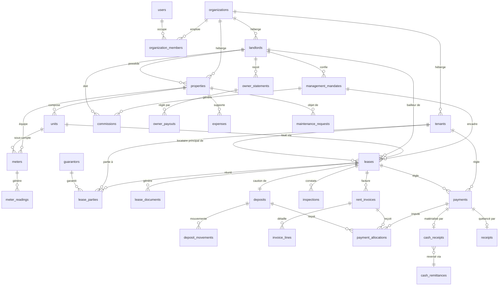
```mermaid
erDiagram
    organizations ||--o{ organization_members : "emploie"
    organizations ||--o{ landlords : "héberge"
    organizations ||--o{ tenants : "héberge"
    organizations ||--o{ properties : "héberge"
    users ||--o{ organization_members : "occupe"
    landlords ||--o{ properties : "possède"
    landlords ||--o{ management_mandates : "confie"
    properties ||--o{ units : "compose"
    properties ||--o{ meters : "équipe"
    units ||--o{ meters : "sous-compte"
    meters ||--o{ meter_readings : "génère"
    management_mandates ||--o{ leases : "encadre"
    units ||--o{ leases : "loué via"
    landlords ||--o{ leases : "bailleur de"
    tenants ||--o{ leases : "locataire principal de"
    leases ||--o{ lease_parties : "réunit"
    tenants ||--o{ lease_parties : "partie à"
    guarantors ||--o{ lease_parties : "garantit"
    leases ||--o{ lease_documents : "génère"
    leases ||--|| deposits : "caution de"
    deposits ||--o{ deposit_movements : "mouvemente"
    leases ||--o{ inspections : "constate"
    leases ||--o{ rent_invoices : "facture"
    rent_invoices ||--o{ invoice_lines : "détaille"
    tenants ||--o{ payments : "règle"
    leases ||--o{ payments : "règle"
    payments ||--o{ payment_allocations : "impute"
    rent_invoices ||--o{ payment_allocations : "reçoit"
    deposits ||--o{ payment_allocations : "reçoit"
    payments ||--o| cash_receipts : "matérialisé par"
    cash_receipts }o--|| cash_remittances : "reversé via"
    payments ||--o| receipts : "quittancé par"
    management_mandates ||--o{ commissions : "génère"
    landlords ||--o{ commissions : "doit"
    landlords ||--o{ owner_statements : "reçoit"
    owner_statements ||--o{ owner_payouts : "réglé par"
    properties ||--o{ expenses : "supporte"
    properties ||--o{ maintenance_requests : "objet de"
```

### 2.2 Domaines et tables (71 tables, 80 types énumérés)

Le nom du fichier partiel du DDL est indiqué entre parenthèses. Les domaines couverts par **ce document** (sections 4 à 6) sont marqués ●, ceux couverts par le document complémentaire sont marqués ○.

| Domaine                    | Fichier(s) DDL                                                                     | Tables                                                                                                                                                                                                                                                                                                                                       | Couverture                |
| -------------------------- | ---------------------------------------------------------------------------------- | -------------------------------------------------------------------------------------------------------------------------------------------------------------------------------------------------------------------------------------------------------------------------------------------------------------------------------------------- | ------------------------- |
| Tenancy & sécurité         | `02a_tenancy_core.sql`, `02b_tenancy_auth.sql`                                     | `organizations`, `organization_settings`, `organization_members`, `users`, `user_credentials`, `otp_codes`, `refresh_tokens`, `invitations`, `api_keys`                                                                                                                                                                                      | ● section 4               |
| Tiers                      | `03a_parties.sql`                                                                  | `landlords`, `tenants`, `guarantors`, `contact_channels`                                                                                                                                                                                                                                                                                     | ● section 5               |
| Patrimoine                 | `03b_portfolio.sql`, `03c_meters.sql`                                              | `properties`, `units`, `bank_accounts`, `meters`, `meter_readings`, `utility_tariffs`                                                                                                                                                                                                                                                        | ● section 5               |
| Contrats                   | `04a_mandates_leases.sql`, `04b_lease_parties_deposits.sql`, `04c_inspections.sql` | `management_mandates`, `leases`, `lease_parties`, `lease_documents`, `deposits`, `deposit_movements`, `inspections`, `inspection_items`, `inspection_photos`                                                                                                                                                                                 | ● section 6               |
| Facturation & encaissement | parties 05–07                                                                      | `sequences`, `rent_invoices`, `invoice_lines`, `penalty_rules`, `payments`, `payment_allocations`, `tenant_credits`, `cash_receipts`, `cash_remittances`, `cash_remittance_items`, `bank_transfer_declarations`, `bank_checks`, `mobile_money_transactions`, `bank_statements`, `bank_statement_lines`, `reconciliation_matches`, `receipts` | ○ document complémentaire |
| Gestion d'agence           | partie 09                                                                          | `expenses`, `commissions`, `owner_statements`, `owner_statement_lines`, `owner_payouts`                                                                                                                                                                                                                                                      | ○ document complémentaire |
| Exploitation               | partie 10a                                                                         | `maintenance_requests`, `maintenance_updates`                                                                                                                                                                                                                                                                                                | ○ document complémentaire |
| Communication              | partie 10b                                                                         | `notification_templates`, `notifications`, `message_logs`, `dunning_rules`, `dunning_runs`                                                                                                                                                                                                                                                   | ○ document complémentaire |
| Technique                  | partie 11                                                                          | `documents`, `webhook_events`, `idempotency_keys`, `sync_batches`, `audit_logs`, `feature_flags`                                                                                                                                                                                                                                             | ○ document complémentaire |
| SaaS                       | partie 14                                                                          | `subscription_plans`, `subscriptions`, `subscription_invoices`                                                                                                                                                                                                                                                                               | ○ document complémentaire |
| Apport d'affaires          | `11d_referral.sql`                                                                 | `referral_programs`, `referral_partners`, `referrals`, `referral_commissions`, `referral_payouts`                                                                                                                                                                                                                                            | ● section 10bis           |

Les fonctions et déclencheurs transversaux (`set_updated_at`, `forbid_update_delete`, `guard_financial_row`, `next_sequence`, `format_sequence_number`, partie `12_triggers_functions.sql`) et les politiques RLS (partie `13_rls_policies.sql`) s'appliquent à l'ensemble de ces domaines et sont décrits en section 1.

## 3. Énumérations

Le schéma déclare 80 types `ENUM` (partie `01_extensions_enums.sql`), regroupés ici par domaine dans leur ordre de déclaration dans le DDL.

### 3.1 Tenancy & sécurité (9 types)

| Type                  | Valeur                 | Signification                                                                                                                                                                                                                      |
| --------------------- | ---------------------- | ---------------------------------------------------------------------------------------------------------------------------------------------------------------------------------------------------------------------------------- |
| `organization_type`   | `AGENCY`               | Agence immobilière gérant le patrimoine d'un ou plusieurs bailleurs sous mandat de gestion.                                                                                                                                        |
| `organization_type`   | `INDEPENDENT_LANDLORD` | Bailleur indépendant qui gère seul son propre patrimoine (possède un `landlord` marqué `is_self`).                                                                                                                                 |
| `organization_type`   | `INDEPENDENT_MANAGER`  | Démarcheur ou gestionnaire informel constitué en agence unipersonnelle : mêmes capacités qu'une `AGENCY` (mandats, commissions, relevés de gérance, remises de caisse) avec un plan tarifaire dédié et un onboarding mobile-first. |
| `organization_status` | `ACTIVE`               | Organisation opérationnelle, accès complet à la plateforme.                                                                                                                                                                        |
| `organization_status` | `SUSPENDED`            | Accès suspendu (impayé d'abonnement, non-conformité) ; les données sont conservées.                                                                                                                                                |
| `organization_status` | `CLOSED`               | Organisation définitivement fermée.                                                                                                                                                                                                |
| `member_role`         | `OWNER`                | Créateur/administrateur de l'organisation, tous droits.                                                                                                                                                                            |
| `member_role`         | `MANAGER`              | Gestionnaire : administre biens, baux, facturation au quotidien.                                                                                                                                                                   |
| `member_role`         | `COLLECTOR`            | Démarcheur/encaisseur terrain, collecte les loyers en espèces sur sa zone.                                                                                                                                                         |
| `member_role`         | `ACCOUNTANT`           | Accès en lecture financière (relevés, exports comptables).                                                                                                                                                                         |
| `member_role`         | `VIEWER`               | Accès en lecture seule.                                                                                                                                                                                                            |
| `member_status`       | `ACTIVE`               | Membre actif dans l'organisation.                                                                                                                                                                                                  |
| `member_status`       | `SUSPENDED`            | Accès temporairement suspendu.                                                                                                                                                                                                     |
| `member_status`       | `REMOVED`              | Membre retiré de l'organisation (conserve son compte `users` global).                                                                                                                                                              |
| `user_status`         | `PENDING`              | Téléphone non encore vérifié par OTP ; compte non pleinement actif.                                                                                                                                                                |
| `user_status`         | `ACTIVE`               | Compte vérifié et actif.                                                                                                                                                                                                           |
| `user_status`         | `SUSPENDED`            | Compte suspendu (sécurité, fraude, demande de l'organisation).                                                                                                                                                                     |
| `user_status`         | `DELETED`              | Compte supprimé (soft delete via `deleted_at`).                                                                                                                                                                                    |
| `otp_purpose`         | `LOGIN`                | Code envoyé pour une connexion.                                                                                                                                                                                                    |
| `otp_purpose`         | `PHONE_VERIFICATION`   | Code envoyé pour vérifier la possession du numéro de téléphone.                                                                                                                                                                    |
| `otp_purpose`         | `PASSWORD_RESET`       | Code envoyé pour réinitialiser le mot de passe.                                                                                                                                                                                    |
| `otp_purpose`         | `SENSITIVE_ACTION`     | Code envoyé pour confirmer une action sensible (ex. changement de coordonnées bancaires).                                                                                                                                          |
| `otp_delivery`        | `SMS`                  | Envoi par SMS.                                                                                                                                                                                                                     |
| `otp_delivery`        | `WHATSAPP`             | Envoi par WhatsApp Cloud API (canal privilégié localement).                                                                                                                                                                        |
| `otp_delivery`        | `EMAIL`                | Envoi par courriel.                                                                                                                                                                                                                |
| `invitation_status`   | `PENDING`              | Invitation envoyée, en attente d'acceptation.                                                                                                                                                                                      |
| `invitation_status`   | `ACCEPTED`             | Invitation acceptée, membre créé.                                                                                                                                                                                                  |
| `invitation_status`   | `EXPIRED`              | Invitation arrivée à expiration sans réponse.                                                                                                                                                                                      |
| `invitation_status`   | `REVOKED`              | Invitation annulée avant réponse.                                                                                                                                                                                                  |
| `api_key_status`      | `ACTIVE`               | Clé d'API valide et utilisable.                                                                                                                                                                                                    |
| `api_key_status`      | `REVOKED`              | Clé révoquée, ne peut plus authentifier de requête.                                                                                                                                                                                |

### 3.2 Tiers (5 types)

| Type                   | Valeur             | Signification                                                           |
| ---------------------- | ------------------ | ----------------------------------------------------------------------- |
| `party_type`           | `INDIVIDUAL`       | Personne physique.                                                      |
| `party_type`           | `COMPANY`          | Personne morale (société, entreprise individuelle immatriculée).        |
| `id_document_type`     | `CNI`              | Carte nationale d'identité congolaise.                                  |
| `id_document_type`     | `PASSPORT`         | Passeport.                                                              |
| `id_document_type`     | `RESIDENCE_PERMIT` | Carte de séjour.                                                        |
| `id_document_type`     | `DRIVING_LICENSE`  | Permis de conduire.                                                     |
| `id_document_type`     | `VOTER_CARD`       | Carte d'électeur.                                                       |
| `id_document_type`     | `RCCM`             | Registre du Commerce et du Crédit Mobilier, pour les personnes morales. |
| `id_document_type`     | `NIU`              | Numéro d'Identification Unique fiscal.                                  |
| `id_document_type`     | `OTHER`            | Autre type de pièce non listé.                                          |
| `contact_channel_type` | `PHONE`            | Ligne fixe.                                                             |
| `contact_channel_type` | `MOBILE`           | Ligne mobile.                                                           |
| `contact_channel_type` | `WHATSAPP`         | Numéro joignable sur WhatsApp.                                          |
| `contact_channel_type` | `EMAIL`            | Adresse électronique.                                                   |
| `contact_channel_type` | `FAX`              | Télécopie (usage résiduel en contexte administratif/entreprise).        |
| `contact_owner_type`   | `LANDLORD`         | Le canal appartient à un bailleur.                                      |
| `contact_owner_type`   | `TENANT`           | Le canal appartient à un locataire.                                     |
| `contact_owner_type`   | `GUARANTOR`        | Le canal appartient à un garant.                                        |
| `contact_owner_type`   | `MEMBER`           | Le canal appartient à un membre de l'organisation.                      |
| `contact_owner_type`   | `SUPPLIER`         | Le canal appartient à un fournisseur/prestataire externe.               |
| `gender_type`          | `MALE`             | Genre masculin.                                                         |
| `gender_type`          | `FEMALE`           | Genre féminin.                                                          |
| `gender_type`          | `UNSPECIFIED`      | Non renseigné.                                                          |

### 3.3 Patrimoine (6 types)

| Type                       | Valeur                | Signification                                                                                           |
| -------------------------- | --------------------- | ------------------------------------------------------------------------------------------------------- |
| `property_type`            | `HOUSE`               | Maison individuelle.                                                                                    |
| `property_type`            | `VILLA`               | Villa (standing supérieur).                                                                             |
| `property_type`            | `APARTMENT_BUILDING`  | Immeuble d'appartements.                                                                                |
| `property_type`            | `COMPOUND`            | Concession/enclos regroupant plusieurs logements autour d'une cour commune (typologie locale courante). |
| `property_type`            | `COMMERCIAL_BUILDING` | Immeuble à usage commercial.                                                                            |
| `property_type`            | `MIXED_USE`           | Bien à usage mixte (habitation + commerce).                                                             |
| `property_type`            | `LAND`                | Terrain nu.                                                                                             |
| `property_type`            | `WAREHOUSE`           | Entrepôt.                                                                                               |
| `property_type`            | `OTHER`               | Autre typologie non listée.                                                                             |
| `unit_type`                | `STUDIO`              | Studio.                                                                                                 |
| `unit_type`                | `ROOM`                | Chambre louée séparément (habitat en concession).                                                       |
| `unit_type`                | `APARTMENT`           | Appartement.                                                                                            |
| `unit_type`                | `HOUSE`               | Maison entière louée comme un seul lot.                                                                 |
| `unit_type`                | `SHOP`                | Boutique commerciale.                                                                                   |
| `unit_type`                | `OFFICE`              | Bureau.                                                                                                 |
| `unit_type`                | `WAREHOUSE`           | Entrepôt loué comme lot.                                                                                |
| `unit_type`                | `PARKING`             | Place de stationnement.                                                                                 |
| `unit_type`                | `LAND_PLOT`           | Parcelle de terrain louée.                                                                              |
| `unit_type`                | `OTHER`               | Autre typologie de lot.                                                                                 |
| `unit_status`              | `AVAILABLE`           | Lot vacant, disponible à la location.                                                                   |
| `unit_status`              | `RESERVED`            | Lot réservé (visite/accord en cours) avant signature de bail.                                           |
| `unit_status`              | `OCCUPIED`            | Lot occupé par un bail actif.                                                                           |
| `unit_status`              | `UNDER_MAINTENANCE`   | Lot temporairement indisponible pour travaux.                                                           |
| `unit_status`              | `UNAVAILABLE`         | Lot retiré de la location pour une autre raison.                                                        |
| `meter_type`               | `ELECTRICITY_E2C`     | Compteur électrique du concessionnaire national E2C.                                                    |
| `meter_type`               | `WATER_LCDE`          | Compteur d'eau du concessionnaire national LCDE.                                                        |
| `meter_type`               | `GAS`                 | Compteur de gaz.                                                                                        |
| `meter_type`               | `PRIVATE_SUBMETER`    | Sous-compteur privé installé par le bailleur pour répartir une charge collective.                       |
| `meter_type`               | `SOLAR`               | Compteur/dispositif de production solaire.                                                              |
| `meter_type`               | `OTHER`               | Autre type de compteur.                                                                                 |
| `tariff_basis`             | `PER_UNIT_CONSUMED`   | Facturation au volume réellement consommé (kWh, m³).                                                    |
| `tariff_basis`             | `FLAT_MONTHLY`        | Forfait mensuel fixe, indépendant de la consommation.                                                   |
| `tariff_basis`             | `PER_OCCUPANT`        | Répartition au nombre d'occupants déclarés.                                                             |
| `tariff_basis`             | `PER_SQUARE_METER`    | Répartition à la surface du lot.                                                                        |
| `tariff_basis`             | `SHARED_PRORATA`      | Répartition au prorata défini par `meters.shared_ratio_bps` pour un compteur partagé.                   |
| `bank_account_holder_type` | `ORGANIZATION`        | Compte détenu par l'organisation (agence).                                                              |
| `bank_account_holder_type` | `LANDLORD`            | Compte détenu par un bailleur (réception des reversements).                                             |
| `bank_account_holder_type` | `TENANT`              | Compte détenu par un locataire (source d'un virement ou remboursement).                                 |

### 3.4 Contrats (11 types)

| Type                    | Valeur                 | Signification                                                                        |
| ----------------------- | ---------------------- | ------------------------------------------------------------------------------------ |
| `mandate_status`        | `DRAFT`                | Mandat en cours de rédaction, non encore signé.                                      |
| `mandate_status`        | `ACTIVE`               | Mandat en vigueur.                                                                   |
| `mandate_status`        | `SUSPENDED`            | Mandat suspendu temporairement.                                                      |
| `mandate_status`        | `TERMINATED`           | Mandat résilié avant son terme normal.                                               |
| `mandate_status`        | `EXPIRED`              | Mandat arrivé à échéance sans renouvellement.                                        |
| `mandate_scope`         | `FULL_MANAGEMENT`      | Gestion locative complète (recherche locataire, encaissement, entretien, reporting). |
| `mandate_scope`         | `RENT_COLLECTION_ONLY` | Encaissement des loyers uniquement.                                                  |
| `mandate_scope`         | `LETTING_ONLY`         | Mise en location uniquement (recherche et signature du bail), sans gestion courante. |
| `lease_status`          | `DRAFT`                | Bail en préparation, non signé.                                                      |
| `lease_status`          | `PENDING_SIGNATURE`    | En attente de signature d'une ou plusieurs parties.                                  |
| `lease_status`          | `ACTIVE`               | Bail en cours d'exécution.                                                           |
| `lease_status`          | `NOTICE_GIVEN`         | Préavis de départ déposé, bail toujours en cours jusqu'à son terme.                  |
| `lease_status`          | `TERMINATED`           | Bail résilié avant son terme contractuel.                                            |
| `lease_status`          | `EXPIRED`              | Bail arrivé à échéance sans reconduction.                                            |
| `lease_status`          | `CANCELLED`            | Bail annulé avant sa prise d'effet.                                                  |
| `lease_party_role`      | `PRIMARY_TENANT`       | Locataire titulaire principal du bail.                                               |
| `lease_party_role`      | `CO_TENANT`            | Colocataire, co-signataire du bail.                                                  |
| `lease_party_role`      | `GUARANTOR`            | Garant (caution) du bail.                                                            |
| `lease_party_role`      | `OCCUPANT`             | Occupant déclaré, non signataire (ex. membre de la famille).                         |
| `lease_document_kind`   | `CONTRACT`             | Contrat de bail signé.                                                               |
| `lease_document_kind`   | `AMENDMENT`            | Avenant modifiant le bail initial.                                                   |
| `lease_document_kind`   | `NOTICE`               | Lettre de préavis.                                                                   |
| `lease_document_kind`   | `TERMINATION`          | Acte de résiliation.                                                                 |
| `lease_document_kind`   | `INVENTORY`            | Inventaire annexé au bail (mobilier, équipements).                                   |
| `lease_document_kind`   | `INSURANCE`            | Attestation d'assurance habitation.                                                  |
| `lease_document_kind`   | `OTHER`                | Autre pièce contractuelle.                                                           |
| `rent_period`           | `MONTHLY`              | Périodicité mensuelle du loyer.                                                      |
| `rent_period`           | `QUARTERLY`            | Périodicité trimestrielle.                                                           |
| `rent_period`           | `SEMI_ANNUAL`          | Périodicité semestrielle.                                                            |
| `rent_period`           | `ANNUAL`               | Périodicité annuelle.                                                                |
| `deposit_status`        | `PENDING`              | Caution appelée, encaissement non commencé.                                          |
| `deposit_status`        | `PARTIALLY_PAID`       | Caution partiellement encaissée.                                                     |
| `deposit_status`        | `HELD`                 | Caution intégralement encaissée et conservée.                                        |
| `deposit_status`        | `PARTIALLY_REFUNDED`   | Caution partiellement restituée (après retenues).                                    |
| `deposit_status`        | `REFUNDED`             | Caution intégralement restituée.                                                     |
| `deposit_status`        | `FORFEITED`            | Caution intégralement conservée (retenue totale, ex. départ sans préavis).           |
| `deposit_movement_type` | `COLLECTION`           | Encaissement d'une fraction ou de la totalité de la caution.                         |
| `deposit_movement_type` | `REFUND`               | Restitution au locataire.                                                            |
| `deposit_movement_type` | `DEDUCTION`            | Retenue pour dégradations ou impayés.                                                |
| `deposit_movement_type` | `TRANSFER`             | Transfert de la caution entre détenteurs (ex. agence → bailleur).                    |
| `deposit_movement_type` | `ADJUSTMENT`           | Ajustement comptable divers.                                                         |
| `inspection_type`       | `MOVE_IN`              | État des lieux d'entrée.                                                             |
| `inspection_type`       | `MOVE_OUT`             | État des lieux de sortie.                                                            |
| `inspection_type`       | `PERIODIC`             | Visite périodique en cours de bail.                                                  |
| `inspection_type`       | `CONTRADICTORY`        | État des lieux contradictoire réalisé en présence des deux parties suite à litige.   |
| `inspection_status`     | `DRAFT`                | Constat en cours de saisie.                                                          |
| `inspection_status`     | `IN_PROGRESS`          | Visite en cours.                                                                     |
| `inspection_status`     | `PENDING_SIGNATURE`    | En attente de signature des parties.                                                 |
| `inspection_status`     | `SIGNED`               | Signé par les parties, définitif.                                                    |
| `inspection_status`     | `DISPUTED`             | Contesté par une des parties.                                                        |
| `inspection_status`     | `CANCELLED`            | Annulé.                                                                              |
| `inspection_condition`  | `NEW`                  | État neuf.                                                                           |
| `inspection_condition`  | `GOOD`                 | Bon état.                                                                            |
| `inspection_condition`  | `FAIR`                 | État moyen, usure normale.                                                           |
| `inspection_condition`  | `POOR`                 | État dégradé.                                                                        |
| `inspection_condition`  | `DAMAGED`              | Endommagé.                                                                           |
| `inspection_condition`  | `MISSING`              | Élément manquant.                                                                    |

### 3.5 Facturation & encaissement (21 types) — partie 1

| Type                  | Valeur                 | Signification                                                                        |
| --------------------- | ---------------------- | ------------------------------------------------------------------------------------ |
| `invoice_status`      | `DRAFT`                | Facture générée mais non émise.                                                      |
| `invoice_status`      | `ISSUED`               | Facture émise, envoyée au locataire.                                                 |
| `invoice_status`      | `PARTIALLY_PAID`       | Réglée partiellement.                                                                |
| `invoice_status`      | `PAID`                 | Intégralement réglée.                                                                |
| `invoice_status`      | `OVERDUE`              | Échéance dépassée au-delà des jours de grâce, impayée.                               |
| `invoice_status`      | `CANCELLED`            | Facture annulée.                                                                     |
| `invoice_line_type`   | `RENT`                 | Ligne de loyer principal.                                                            |
| `invoice_line_type`   | `WATER_CHARGE`         | Refacturation de consommation d'eau.                                                 |
| `invoice_line_type`   | `ELECTRICITY_CHARGE`   | Refacturation de consommation électrique.                                            |
| `invoice_line_type`   | `SERVICE_CHARGE`       | Charge de service (gardiennage, entretien commun).                                   |
| `invoice_line_type`   | `PENALTY`              | Pénalité de retard.                                                                  |
| `invoice_line_type`   | `DEPOSIT`              | Appel de caution facturé sur la même ligne qu'un loyer.                              |
| `invoice_line_type`   | `AGENCY_FEE`           | Frais d'agence facturés au locataire.                                                |
| `invoice_line_type`   | `REPAIR_REBILL`        | Refacturation d'une réparation imputable au locataire.                               |
| `invoice_line_type`   | `DISCOUNT`             | Remise (ligne négative, `is_credit`).                                                |
| `invoice_line_type`   | `OTHER`                | Autre nature de ligne.                                                               |
| `penalty_basis`       | `RATE_BPS_PER_DAY`     | Pénalité au taux journalier en points de base du principal impayé.                   |
| `penalty_basis`       | `RATE_BPS_PER_MONTH`   | Pénalité au taux mensuel en points de base.                                          |
| `penalty_basis`       | `FLAT_AMOUNT`          | Pénalité forfaitaire unique.                                                         |
| `penalty_basis`       | `FLAT_AMOUNT_PER_DAY`  | Pénalité forfaitaire par jour de retard.                                             |
| `payment_method`      | `CASH`                 | Espèces, généralement collectées sur le terrain par un démarcheur.                   |
| `payment_method`      | `MOBILE_MONEY`         | Paiement via un agrégateur Mobile Money (CinetPay, PawaPay, MTN MoMo, Airtel Money). |
| `payment_method`      | `BANK_TRANSFER`        | Virement bancaire déclaré par le locataire.                                          |
| `payment_method`      | `BANK_CHECK`           | Chèque bancaire.                                                                     |
| `payment_status`      | `PENDING`              | Règlement enregistré, en attente de traitement.                                      |
| `payment_status`      | `PENDING_VERIFICATION` | En attente de vérification (ex. contrôle du statut auprès de l'agrégateur).          |
| `payment_status`      | `CONFIRMED`            | Confirmé, définitivement encaissé.                                                   |
| `payment_status`      | `REJECTED`             | Rejeté (preuve invalide, transaction échouée).                                       |
| `payment_status`      | `CANCELLED`            | Annulé avant confirmation.                                                           |
| `payment_status`      | `REVERSED`             | Contre-passé après confirmation (erreur, litige).                                    |
| `payment_direction`   | `INBOUND`              | Encaissement (locataire → organisation/bailleur).                                    |
| `payment_direction`   | `OUTBOUND`             | Décaissement (ex. remboursement).                                                    |
| `credit_status`       | `OPEN`                 | Avoir locataire disponible, non utilisé.                                             |
| `credit_status`       | `PARTIALLY_USED`       | Avoir partiellement consommé.                                                        |
| `credit_status`       | `USED`                 | Avoir intégralement consommé.                                                        |
| `credit_status`       | `REFUNDED`             | Avoir remboursé au locataire.                                                        |
| `credit_status`       | `EXPIRED`              | Avoir expiré sans utilisation.                                                       |
| `cash_receipt_status` | `DRAFT`                | Reçu en cours de constitution.                                                       |
| `cash_receipt_status` | `ISSUED`               | Reçu émis et signé, en attente de reversement.                                       |
| `cash_receipt_status` | `REMITTED`             | Rattaché à un reversement (`cash_remittance`).                                       |
| `cash_receipt_status` | `CANCELLED`            | Reçu annulé (contre-passé).                                                          |
| `remittance_status`   | `OPEN`                 | Reversement en cours de constitution par le démarcheur.                              |
| `remittance_status`   | `SUBMITTED`            | Soumis au caissier/à l'agence pour vérification.                                     |
| `remittance_status`   | `VERIFIED`             | Comptage contradictoire effectué et validé.                                          |
| `remittance_status`   | `DEPOSITED`            | Fonds déposés en banque.                                                             |
| `remittance_status`   | `REJECTED`             | Rejeté (écart de caisse non justifié).                                               |
| `remittance_status`   | `CANCELLED`            | Reversement annulé.                                                                  |
| `declaration_status`  | `SUBMITTED`            | Déclaration de virement soumise par le locataire, preuve téléversée.                 |
| `declaration_status`  | `UNDER_REVIEW`         | En cours d'examen par l'agence.                                                      |
| `declaration_status`  | `MATCHED`              | Rapprochée avec une ligne de relevé bancaire.                                        |
| `declaration_status`  | `APPROVED`             | Validée et transformée en paiement confirmé.                                         |
| `declaration_status`  | `REJECTED`             | Rejetée (preuve invalide, montant erroné).                                           |
| `declaration_status`  | `CANCELLED`            | Annulée par le déclarant.                                                            |
| `momo_provider`       | `MTN_MOMO`             | Portefeuille MTN Mobile Money.                                                       |
| `momo_provider`       | `AIRTEL_MONEY`         | Portefeuille Airtel Money.                                                           |
| `momo_provider`       | `CINETPAY`             | Agrégateur CinetPay (première intégration).                                          |
| `momo_provider`       | `PAWAPAY`              | Agrégateur PawaPay.                                                                  |
| `momo_provider`       | `OTHER`                | Autre opérateur/agrégateur Mobile Money.                                             |

### 3.5 Facturation & encaissement (21 types) — partie 2

| Type                       | Valeur                 | Signification                                                                |
| -------------------------- | ---------------------- | ---------------------------------------------------------------------------- |
| `momo_status`              | `INITIATED`            | Transaction initiée auprès de l'agrégateur.                                  |
| `momo_status`              | `PENDING`              | En attente de confirmation opérateur.                                        |
| `momo_status`              | `SUCCEEDED`            | Transaction réussie.                                                         |
| `momo_status`              | `FAILED`               | Transaction échouée.                                                         |
| `momo_status`              | `EXPIRED`              | Transaction expirée sans réponse de l'opérateur.                             |
| `momo_status`              | `CANCELLED`            | Transaction annulée par l'utilisateur ou l'agrégateur.                       |
| `momo_status`              | `REFUNDED`             | Transaction remboursée.                                                      |
| `fee_bearer`               | `TENANT`               | Frais du canal à la charge du locataire.                                     |
| `fee_bearer`               | `ORGANIZATION`         | Frais à la charge de l'organisation (agence).                                |
| `fee_bearer`               | `LANDLORD`             | Frais à la charge du bailleur.                                               |
| `fee_bearer`               | `SHARED`               | Frais partagés entre plusieurs parties.                                      |
| `check_status`             | `RECEIVED`             | Chèque reçu, non encore déposé.                                              |
| `check_status`             | `DEPOSITED`            | Déposé en banque.                                                            |
| `check_status`             | `CLEARED`              | Compensé, fonds disponibles.                                                 |
| `check_status`             | `BOUNCED`              | Rejeté pour défaut de provision.                                             |
| `check_status`             | `CANCELLED`            | Annulé avant dépôt.                                                          |
| `check_status`             | `RETURNED`             | Retourné par la banque après dépôt (autre motif que le défaut de provision). |
| `statement_format`         | `CSV`                  | Relevé bancaire au format CSV.                                               |
| `statement_format`         | `MT940`                | Format SWIFT MT940.                                                          |
| `statement_format`         | `CAMT053`              | Format ISO 20022 CAMT.053.                                                   |
| `statement_format`         | `OFX`                  | Format Open Financial Exchange.                                              |
| `statement_format`         | `XLSX`                 | Fichier tableur Excel.                                                       |
| `statement_format`         | `PDF_OCR`              | Relevé PDF scanné, traité par reconnaissance optique de caractères.          |
| `bank_statement_status`    | `UPLOADED`             | Fichier de relevé téléversé.                                                 |
| `bank_statement_status`    | `PARSING`              | Analyse du fichier en cours.                                                 |
| `bank_statement_status`    | `PARSED`               | Lignes extraites avec succès.                                                |
| `bank_statement_status`    | `RECONCILING`          | Rapprochement avec les paiements en cours.                                   |
| `bank_statement_status`    | `RECONCILED`           | Rapprochement terminé.                                                       |
| `bank_statement_status`    | `FAILED`               | Échec d'analyse du fichier.                                                  |
| `statement_line_direction` | `CREDIT`               | Ligne créditrice (entrée de fonds).                                          |
| `statement_line_direction` | `DEBIT`                | Ligne débitrice (sortie de fonds).                                           |
| `match_type`               | `EXACT`                | Rapprochement automatique exact (montant, référence).                        |
| `match_type`               | `SUGGESTED`            | Rapprochement suggéré par l'algorithme, à confirmer.                         |
| `match_type`               | `MANUAL`               | Rapprochement effectué manuellement par un gestionnaire.                     |
| `match_type`               | `PARTIAL`              | Rapprochement partiel (montant différent).                                   |
| `match_type`               | `SPLIT`                | Une ligne de relevé rapprochée avec plusieurs paiements, ou l'inverse.       |
| `match_status`             | `PROPOSED`             | Rapprochement proposé, non validé.                                           |
| `match_status`             | `CONFIRMED`            | Rapprochement validé par un utilisateur.                                     |
| `match_status`             | `REJECTED`             | Rapprochement rejeté.                                                        |
| `match_status`             | `REVERSED`             | Rapprochement annulé après validation.                                       |
| `receipt_status`           | `DRAFT`                | Quittance en cours de génération.                                            |
| `receipt_status`           | `GENERATING`           | PDF en cours de production (job Puppeteer).                                  |
| `receipt_status`           | `ISSUED`               | PDF généré, prêt à l'envoi.                                                  |
| `receipt_status`           | `SENT`                 | Envoyée au locataire (WhatsApp/SMS/email).                                   |
| `receipt_status`           | `CANCELLED`            | Quittance annulée.                                                           |
| `sequence_kind`            | `CASH_RECEIPT`         | Séquence des reçus de caisse (`CASH-{org}-{collector}-{seq}`).               |
| `sequence_kind`            | `RENT_INVOICE`         | Séquence des factures de loyer (`LOY-{YYYYMM}-{seq}`).                       |
| `sequence_kind`            | `RECEIPT`              | Séquence des quittances (`QUI-{YYYYMM}-{seq}`).                              |
| `sequence_kind`            | `OWNER_STATEMENT`      | Séquence des relevés de gérance.                                             |
| `sequence_kind`            | `REMITTANCE`           | Séquence des reversements d'encaisse.                                        |
| `sequence_kind`            | `EXPENSE`              | Séquence des dépenses.                                                       |
| `sequence_kind`            | `PAYOUT`               | Séquence des reversements aux bailleurs.                                     |
| `sequence_kind`            | `SUBSCRIPTION_INVOICE` | Séquence des factures d'abonnement SaaS.                                     |

### 3.6 Gestion d'agence (8 types)

| Type                        | Valeur                       | Signification                                                               |
| --------------------------- | ---------------------------- | --------------------------------------------------------------------------- |
| `expense_category`          | `REPAIR`                     | Réparation ponctuelle.                                                      |
| `expense_category`          | `MAINTENANCE`                | Entretien courant.                                                          |
| `expense_category`          | `PLUMBING`                   | Plomberie.                                                                  |
| `expense_category`          | `ELECTRICITY`                | Électricité (installation, dépannage).                                      |
| `expense_category`          | `CLEANING`                   | Nettoyage.                                                                  |
| `expense_category`          | `SECURITY`                   | Gardiennage/sécurité.                                                       |
| `expense_category`          | `UTILITY_BILL`               | Facture de charge (eau, électricité) payée par l'agence/le bailleur.        |
| `expense_category`          | `TAX`                        | Impôts et taxes.                                                            |
| `expense_category`          | `INSURANCE`                  | Prime d'assurance.                                                          |
| `expense_category`          | `SYNDIC_FEE`                 | Charges de copropriété/syndic.                                              |
| `expense_category`          | `LEGAL_FEE`                  | Frais juridiques/contentieux.                                               |
| `expense_category`          | `TRAVEL`                     | Frais de déplacement.                                                       |
| `expense_category`          | `SUPPLIES`                   | Fournitures diverses.                                                       |
| `expense_category`          | `OTHER`                      | Autre catégorie de dépense.                                                 |
| `expense_status`            | `DRAFT`                      | Dépense saisie, non soumise.                                                |
| `expense_status`            | `SUBMITTED`                  | Soumise pour approbation.                                                   |
| `expense_status`            | `APPROVED`                   | Approuvée.                                                                  |
| `expense_status`            | `PAID`                       | Payée par l'agence/le bailleur.                                             |
| `expense_status`            | `REBILLED`                   | Refacturée au locataire (`invoice_lines.line_type = REPAIR_REBILL`).        |
| `expense_status`            | `REJECTED`                   | Rejetée.                                                                    |
| `expense_status`            | `CANCELLED`                  | Annulée.                                                                    |
| `expense_bearer`            | `LANDLORD`                   | Dépense à la charge du bailleur.                                            |
| `expense_bearer`            | `TENANT`                     | Dépense refacturée au locataire.                                            |
| `expense_bearer`            | `ORGANIZATION`               | Dépense à la charge de l'organisation (agence).                             |
| `commission_basis`          | `RATE_BPS_ON_RENT_COLLECTED` | Commission calculée en points de base sur le loyer effectivement encaissé.  |
| `commission_basis`          | `RATE_BPS_ON_RENT_DUE`       | Commission calculée en points de base sur le loyer appelé, encaissé ou non. |
| `commission_basis`          | `FLAT_AMOUNT_PER_MONTH`      | Commission forfaitaire mensuelle.                                           |
| `commission_basis`          | `FLAT_AMOUNT_PER_LEASE`      | Commission forfaitaire par bail.                                            |
| `commission_status`         | `PENDING`                    | Commission calculée, non encore validée.                                    |
| `commission_status`         | `ACCRUED`                    | Constatée, en attente d'intégration à un relevé de gérance.                 |
| `commission_status`         | `INVOICED`                   | Facturée au bailleur.                                                       |
| `commission_status`         | `SETTLED`                    | Réglée (déduite du reversement).                                            |
| `commission_status`         | `CANCELLED`                  | Annulée.                                                                    |
| `statement_status`          | `DRAFT`                      | Relevé de gérance en préparation.                                           |
| `statement_status`          | `ISSUED`                     | Émis.                                                                       |
| `statement_status`          | `SENT`                       | Envoyé au bailleur.                                                         |
| `statement_status`          | `PAID`                       | Soldé (reversement effectué).                                               |
| `statement_status`          | `CANCELLED`                  | Annulé.                                                                     |
| `owner_statement_line_type` | `RENT_COLLECTED`             | Ligne de loyer encaissé sur la période.                                     |
| `owner_statement_line_type` | `CHARGE_COLLECTED`           | Ligne de charges encaissées.                                                |
| `owner_statement_line_type` | `COMMISSION`                 | Ligne d'honoraires de gestion déduits.                                      |
| `owner_statement_line_type` | `EXPENSE`                    | Ligne de dépense déduite.                                                   |
| `owner_statement_line_type` | `VAT`                        | Ligne de TVA sur honoraires.                                                |
| `owner_statement_line_type` | `DEPOSIT_HELD`               | Ligne informative sur les cautions détenues.                                |
| `owner_statement_line_type` | `CARRY_FORWARD`              | Report du solde de la période précédente.                                   |
| `owner_statement_line_type` | `ADJUSTMENT`                 | Ligne d'ajustement divers.                                                  |
| `owner_statement_line_type` | `OTHER`                      | Autre nature de ligne.                                                      |
| `payout_status`             | `PENDING`                    | Reversement au bailleur en attente.                                         |
| `payout_status`             | `APPROVED`                   | Approuvé pour exécution.                                                    |
| `payout_status`             | `PROCESSING`                 | En cours de traitement (virement/Mobile Money émis).                        |
| `payout_status`             | `PAID`                       | Reversé avec succès.                                                        |
| `payout_status`             | `FAILED`                     | Échec du reversement.                                                       |
| `payout_status`             | `CANCELLED`                  | Annulé.                                                                     |

### 3.7 Exploitation & communication (8 types)

| Type                   | Valeur            | Signification                                                       |
| ---------------------- | ----------------- | ------------------------------------------------------------------- |
| `maintenance_status`   | `OPEN`            | Demande ouverte, non traitée.                                       |
| `maintenance_status`   | `ACKNOWLEDGED`    | Prise en compte accusée.                                            |
| `maintenance_status`   | `ASSIGNED`        | Assignée à un intervenant/prestataire.                              |
| `maintenance_status`   | `IN_PROGRESS`     | Intervention en cours.                                              |
| `maintenance_status`   | `ON_HOLD`         | Suspendue temporairement.                                           |
| `maintenance_status`   | `RESOLVED`        | Résolue techniquement.                                              |
| `maintenance_status`   | `CLOSED`          | Clôturée administrativement.                                        |
| `maintenance_status`   | `REJECTED`        | Rejetée (hors périmètre, doublon).                                  |
| `maintenance_priority` | `LOW`             | Priorité basse.                                                     |
| `maintenance_priority` | `NORMAL`          | Priorité normale.                                                   |
| `maintenance_priority` | `HIGH`            | Priorité haute.                                                     |
| `maintenance_priority` | `URGENT`          | Urgence (sécurité, dégât des eaux).                                 |
| `maintenance_reporter` | `TENANT`          | Signalée par le locataire.                                          |
| `maintenance_reporter` | `LANDLORD`        | Signalée par le bailleur.                                           |
| `maintenance_reporter` | `COLLECTOR`       | Signalée par un démarcheur lors d'une visite terrain.               |
| `maintenance_reporter` | `MANAGER`         | Signalée par un gestionnaire.                                       |
| `maintenance_reporter` | `INSPECTION`      | Générée automatiquement à partir d'un état des lieux.               |
| `notification_channel` | `WHATSAPP`        | Envoi via WhatsApp Cloud API.                                       |
| `notification_channel` | `SMS`             | Envoi par SMS (canal de secours).                                   |
| `notification_channel` | `EMAIL`           | Envoi par courriel.                                                 |
| `notification_channel` | `PUSH`            | Notification push mobile.                                           |
| `notification_channel` | `IN_APP`          | Notification affichée dans l'application.                           |
| `notification_status`  | `SCHEDULED`       | Programmée pour un envoi futur.                                     |
| `notification_status`  | `QUEUED`          | En file d'attente d'envoi (BullMQ).                                 |
| `notification_status`  | `SENT`            | Envoyée.                                                            |
| `notification_status`  | `FAILED`          | Échec d'envoi.                                                      |
| `notification_status`  | `CANCELLED`       | Annulée avant envoi.                                                |
| `message_status`       | `QUEUED`          | Message en file d'attente.                                          |
| `message_status`       | `SENT`            | Envoyé au fournisseur (opérateur, WhatsApp).                        |
| `message_status`       | `DELIVERED`       | Livré au destinataire.                                              |
| `message_status`       | `READ`            | Lu par le destinataire (accusé WhatsApp).                           |
| `message_status`       | `FAILED`          | Échec technique d'envoi.                                            |
| `message_status`       | `REJECTED`        | Rejeté par le fournisseur (numéro invalide, template non approuvé). |
| `message_status`       | `EXPIRED`         | Expiré sans être livré.                                             |
| `dunning_step_status`  | `PENDING`         | Étape de relance planifiée.                                         |
| `dunning_step_status`  | `RUNNING`         | En cours d'exécution.                                               |
| `dunning_step_status`  | `SENT`            | Relance envoyée.                                                    |
| `dunning_step_status`  | `SKIPPED`         | Ignorée (condition non remplie, ex. facture déjà réglée).           |
| `dunning_step_status`  | `FAILED`          | Échec d'exécution.                                                  |
| `dunning_step_status`  | `CANCELLED`       | Annulée.                                                            |
| `dunning_trigger`      | `DAYS_BEFORE_DUE` | Déclenchée un nombre de jours avant l'échéance.                     |
| `dunning_trigger`      | `DAYS_AFTER_DUE`  | Déclenchée un nombre de jours après l'échéance.                     |
| `dunning_trigger`      | `ON_ISSUE`        | Déclenchée à l'émission de la facture.                              |
| `dunning_trigger`      | `ON_OVERDUE`      | Déclenchée au passage en statut impayé.                             |

### 3.8 Technique & SaaS (8 types)

| Type                  | Valeur                | Signification                                                  |
| --------------------- | --------------------- | -------------------------------------------------------------- |
| `document_kind`       | `ID_DOCUMENT`         | Pièce d'identité scannée.                                      |
| `document_kind`       | `LEASE_CONTRACT`      | Contrat de bail PDF.                                           |
| `document_kind`       | `MANDATE`             | Mandat de gestion PDF.                                         |
| `document_kind`       | `RECEIPT_PDF`         | Quittance PDF.                                                 |
| `document_kind`       | `INVOICE_PDF`         | Facture PDF.                                                   |
| `document_kind`       | `CASH_RECEIPT_PDF`    | Reçu de caisse PDF.                                            |
| `document_kind`       | `TRANSFER_PROOF`      | Preuve de virement téléversée par le locataire.                |
| `document_kind`       | `CHECK_IMAGE`         | Image d'un chèque.                                             |
| `document_kind`       | `BANK_STATEMENT`      | Fichier de relevé bancaire importé.                            |
| `document_kind`       | `INSPECTION_REPORT`   | Rapport d'état des lieux PDF.                                  |
| `document_kind`       | `INSPECTION_PHOTO`    | Photo d'état des lieux.                                        |
| `document_kind`       | `MAINTENANCE_PHOTO`   | Photo liée à une demande de maintenance.                       |
| `document_kind`       | `SIGNATURE`           | Image de signature manuscrite capturée sur mobile.             |
| `document_kind`       | `OWNER_STATEMENT_PDF` | Relevé de gérance PDF.                                         |
| `document_kind`       | `EXPENSE_INVOICE`     | Facture fournisseur justifiant une dépense.                    |
| `document_kind`       | `PROPERTY_PHOTO`      | Photo d'un bien ou d'un lot.                                   |
| `document_kind`       | `OTHER`               | Autre type de document.                                        |
| `storage_provider`    | `R2`                  | Stockage Cloudflare R2 (choix par défaut, compatible S3).      |
| `storage_provider`    | `S3`                  | Stockage Amazon S3 ou compatible.                              |
| `storage_provider`    | `LOCAL`               | Stockage local (environnement de développement/tests).         |
| `webhook_source`      | `CINETPAY`            | Webhook entrant de l'agrégateur CinetPay.                      |
| `webhook_source`      | `PAWAPAY`             | Webhook entrant de l'agrégateur PawaPay.                       |
| `webhook_source`      | `MTN_MOMO`            | Webhook entrant direct MTN MoMo.                               |
| `webhook_source`      | `AIRTEL_MONEY`        | Webhook entrant direct Airtel Money.                           |
| `webhook_source`      | `WHATSAPP_CLOUD`      | Webhook entrant WhatsApp Cloud API (statuts de message).       |
| `webhook_source`      | `SMS_GATEWAY`         | Webhook entrant de la passerelle SMS.                          |
| `webhook_source`      | `OTHER`               | Autre source de webhook.                                       |
| `webhook_status`      | `RECEIVED`            | Webhook reçu, non encore traité.                               |
| `webhook_status`      | `PROCESSING`          | En cours de traitement.                                        |
| `webhook_status`      | `PROCESSED`           | Traité avec succès.                                            |
| `webhook_status`      | `IGNORED`             | Ignoré (événement non pertinent, doublon).                     |
| `webhook_status`      | `FAILED`              | Échec de traitement.                                           |
| `sync_batch_status`   | `RECEIVED`            | Lot de synchronisation mobile reçu.                            |
| `sync_batch_status`   | `VALIDATING`          | Validation des enregistrements en cours.                       |
| `sync_batch_status`   | `APPLIED`             | Lot intégralement appliqué.                                    |
| `sync_batch_status`   | `PARTIALLY_APPLIED`   | Lot partiellement appliqué (certains enregistrements rejetés). |
| `sync_batch_status`   | `REJECTED`            | Lot rejeté en totalité.                                        |
| `sync_batch_status`   | `FAILED`              | Échec technique de traitement du lot.                          |
| `audit_action`        | `CREATE`              | Création d'un enregistrement.                                  |
| `audit_action`        | `UPDATE`              | Modification d'un enregistrement.                              |
| `audit_action`        | `DELETE`              | Suppression (logique ou physique) d'un enregistrement.         |
| `audit_action`        | `STATE_TRANSITION`    | Transition d'état métier (bail, facture, paiement, etc.).      |
| `audit_action`        | `LOGIN`               | Connexion d'un utilisateur.                                    |
| `audit_action`        | `EXPORT`              | Export de données.                                             |
| `audit_action`        | `IMPORT`              | Import de données.                                             |
| `subscription_status` | `TRIALING`            | Période d'essai en cours.                                      |
| `subscription_status` | `ACTIVE`              | Abonnement actif.                                              |
| `subscription_status` | `PAST_DUE`            | Facture d'abonnement impayée, abonnement encore actif.         |
| `subscription_status` | `SUSPENDED`           | Suspendu pour impayé prolongé.                                 |
| `subscription_status` | `CANCELLED`           | Résilié par le client.                                         |
| `subscription_status` | `EXPIRED`             | Expiré sans renouvellement.                                    |
| `billing_interval`    | `MONTHLY`             | Facturation mensuelle.                                         |
| `billing_interval`    | `QUARTERLY`           | Facturation trimestrielle.                                     |
| `billing_interval`    | `ANNUAL`              | Facturation annuelle.                                          |

### 3.9 Apport d'affaires (4 types)

| Type                         | Valeur                        | Signification                                                                                                                               |
| ---------------------------- | ----------------------------- | ------------------------------------------------------------------------------------------------------------------------------------------- |
| `referral_partner_status`    | `PENDING_VERIFICATION`        | Partenaire inscrit, pièce d'identité et numéro Mobile Money non encore vérifiés : aucun versement possible.                                 |
| `referral_partner_status`    | `ACTIVE`                      | Identité vérifiée et coordonnées de versement validées : les commissions peuvent être payées.                                               |
| `referral_partner_status`    | `SUSPENDED`                   | Suspendu pour soupçon d'abus (auto-parrainage déguisé, faux filleuls) ; les commissions continuent de s'accumuler mais ne sont pas versées. |
| `referral_partner_status`    | `CLOSED`                      | Compte partenaire clos définitivement, à sa demande ou après fraude avérée.                                                                 |
| `referral_status`            | `PENDING`                     | Code saisi ou immeuble apporté, en attente de confirmation du bailleur.                                                                     |
| `referral_status`            | `QUALIFIED`                   | Filleul confirmé (OTP le cas échéant) : la fenêtre de commissionnement démarre.                                                             |
| `referral_status`            | `ACTIVE`                      | Au moins une facture d'abonnement du filleul a été réellement encaissée.                                                                    |
| `referral_status`            | `EXPIRED`                     | Durée du programme écoulée (`expires_at` dépassé) : plus aucune commission n'est constatée.                                                 |
| `referral_status`            | `CANCELLED`                   | Parrainage annulé (abus constaté, renonciation, doublon) ; les commissions déjà versées restent acquises.                                   |
| `referral_commission_status` | `ACCRUED`                     | Commission constatée sur une facture d'abonnement encaissée, non encore contrôlée.                                                          |
| `referral_commission_status` | `APPROVED`                    | Contrôlée par la plateforme, éligible au prochain versement.                                                                                |
| `referral_commission_status` | `PAID`                        | Versée au partenaire par Mobile Money (`payout_id` renseigné).                                                                              |
| `referral_commission_status` | `REVERSED`                    | Contre-passée parce que la facture d'abonnement a été remboursée ou annulée.                                                                |
| `referral_commission_status` | `CANCELLED`                   | Écartée avant tout versement (plafond mensuel atteint, fraude, doublon technique).                                                          |
| `referral_source`            | `CODE_AT_SIGNUP`              | Le filleul a saisi le code du partenaire à la création de son organisation.                                                                 |
| `referral_source`            | `PARTNER_REGISTERED_PROPERTY` | Le partenaire a lui-même enregistré le premier immeuble ; confirmation du bailleur par OTP obligatoire.                                     |
| `referral_source`            | `LINK`                        | Rattachement par lien de parrainage tracé (campagne WhatsApp, QR code).                                                                     |
| `referral_source`            | `MANUAL_ADMIN`                | Rattachement saisi manuellement par l'administration plateforme après vérification d'un litige d'attribution.                               |

## 4. Tenancy et sécurité

Ce domaine porte la racine multi-tenant (`organizations`), son paramétrage, les utilisateurs globaux et tout ce qui sécurise l'accès (identifiants, OTP, sessions, invitations, clés d'API). Fichiers DDL : `02a_tenancy_core.sql`, `02b_tenancy_auth.sql`.

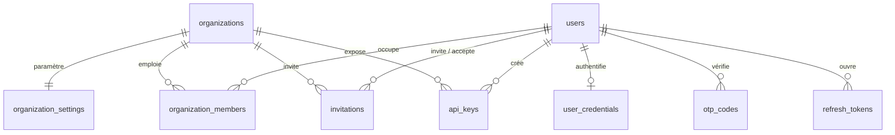
```mermaid
erDiagram
    organizations ||--|| organization_settings : "paramètre"
    organizations ||--o{ organization_members : "emploie"
    organizations ||--o{ invitations : "invite"
    organizations ||--o{ api_keys : "expose"
    users ||--o{ organization_members : "occupe"
    users ||--o| user_credentials : "authentifie"
    users ||--o{ otp_codes : "vérifie"
    users ||--o{ refresh_tokens : "ouvre"
    users ||--o{ invitations : "invite / accepte"
    users ||--o{ api_keys : "crée"
```

### 4.1 `organizations`

**Rôle.** Racine de l'isolation multi-tenant : une agence immobilière (`AGENCY`) ou un bailleur indépendant (`INDEPENDENT_LANDLORD`). Toute donnée métier référence, directement ou indirectement, une ligne de cette table.

| Colonne                     | Type                  | Null | Défaut              | Description                                                                    |
| --------------------------- | --------------------- | ---- | ------------------- | ------------------------------------------------------------------------------ |
| `id`                        | UUID                  | non  | `gen_random_uuid()` | Identifiant primaire.                                                          |
| `type`                      | `organization_type`   | non  | —                   | `AGENCY` ou `INDEPENDENT_LANDLORD`.                                            |
| `status`                    | `organization_status` | non  | `ACTIVE`            | Cycle de vie du tenant.                                                        |
| `legal_name`                | TEXT                  | non  | —                   | Raison sociale / nom légal.                                                    |
| `trade_name`                | TEXT                  | oui  | —                   | Nom commercial affiché.                                                        |
| `slug`                      | TEXT                  | non  | —                   | Identifiant court URL-safe, utilisé dans les numérotations (`CASH-{org}-...`). |
| `rccm_number`               | TEXT                  | oui  | —                   | Registre du Commerce et du Crédit Mobilier.                                    |
| `niu_number`                | TEXT                  | oui  | —                   | Numéro d'Identification Unique fiscal.                                         |
| `tax_regime`                | TEXT                  | oui  | —                   | Régime fiscal déclaré.                                                         |
| `contact_phone`             | TEXT                  | non  | —                   | Téléphone principal, format E.164.                                             |
| `contact_email`             | TEXT                  | oui  | —                   | Courriel de contact.                                                           |
| `address_line`              | TEXT                  | oui  | —                   | Adresse.                                                                       |
| `district`                  | TEXT                  | oui  | —                   | Quartier/arrondissement (ex. Bacongo, Poto-Poto, Tié-Tié).                     |
| `city`                      | TEXT                  | non  | `'Brazzaville'`     | Ville.                                                                         |
| `country_code`              | CHAR(2)               | non  | `'CG'`              | Code pays ISO.                                                                 |
| `logo_document_id`          | UUID                  | oui  | —                   | Logo (FK vers `documents`, ajoutée en partie technique).                       |
| `default_landlord_id`       | UUID                  | oui  | —                   | Pour `INDEPENDENT_LANDLORD` : le landlord « self » possédé par l'organisation. |
| `currency`                  | CHAR(3)               | non  | `'XAF'`             | Devise, verrouillée à XAF.                                                     |
| `created_at` / `updated_at` | TIMESTAMPTZ           | non  | `now()`             | Horodatage standard.                                                           |
| `deleted_at`                | TIMESTAMPTZ           | oui  | —                   | Suppression logique.                                                           |

**Clés étrangères** : `default_landlord_id → landlords(id) ON DELETE SET NULL` (contrainte `organizations_default_landlord_fk`, ajoutée après création de `landlords` en partie `03a_parties.sql` — FK circulaire différée, voir 1.9).

**Contraintes** : `UNIQUE (slug)` ; `CHECK (contact_phone ~ '^\+[1-9][0-9]{7,14}$')` (E.164) ; `CHECK (currency = 'XAF')`.

**Index** : l'unicité de `slug` crée un index implicite ; aucun autre index métier n'est déclaré (table de faible volumétrie, une ligne par tenant).

**Règles métier** :

- `type` détermine si l'organisation gère des biens de tiers sous mandat (`AGENCY`) ou son propre patrimoine (`INDEPENDENT_LANDLORD`, via `default_landlord_id`).
- La policy RLS `org_isolation` compare directement `id` (et non `organization_id`, absent de cette table) au paramètre de session `app.current_organization_id`.
- `status = SUSPENDED`/`CLOSED` ne supprime pas les données : elles restent consultables pour export/conformité.

### 4.2 `organization_settings`

**Rôle.** Paramétrage métier d'une organisation : échéances par défaut, pénalités, commission, canaux de communication activés.

| Colonne                           | Type         | Null | Défaut                 | Description                                                        |
| --------------------------------- | ------------ | ---- | ---------------------- | ------------------------------------------------------------------ |
| `id`                              | UUID         | non  | `gen_random_uuid()`    | Identifiant primaire.                                              |
| `organization_id`                 | UUID         | non  | —                      | Organisation propriétaire, unique (relation 1–1).                  |
| `timezone`                        | TEXT         | non  | `'Africa/Brazzaville'` | Fuseau horaire des traitements planifiés.                          |
| `locale`                          | TEXT         | non  | `'fr-CG'`              | Locale d'affichage.                                                |
| `currency`                        | CHAR(3)      | non  | `'XAF'`                | Devise de l'organisation.                                          |
| `default_payment_due_day`         | SMALLINT     | non  | `5`                    | Jour du mois d'échéance du loyer par défaut (1–28).                |
| `default_grace_days`              | SMALLINT     | non  | `5`                    | Jours de grâce avant pénalités (0–60).                             |
| `invoice_generation_lead_days`    | SMALLINT     | non  | `7`                    | Délai d'anticipation (J-N) de génération des factures.             |
| `default_penalty_rule_id`         | UUID         | oui  | —                      | Barème de pénalité par défaut (FK différée vers `penalty_rules`).  |
| `default_commission_rate_bps`     | INTEGER      | non  | `1000`                 | Commission de gestion par défaut, en points de base (1000 = 10 %). |
| `momo_fee_bearer`                 | `fee_bearer` | non  | `'TENANT'`             | Partie supportant les frais Mobile Money par défaut.               |
| `receipt_verification_base_url`   | TEXT         | oui  | —                      | Base d'URL publique de vérification des quittances (QR code).      |
| `whatsapp_enabled`                | BOOLEAN      | non  | `true`                 | Canal WhatsApp actif.                                              |
| `sms_fallback_enabled`            | BOOLEAN      | non  | `true`                 | Repli SMS actif si WhatsApp indisponible.                          |
| `cash_remittance_max_open_amount` | BIGINT       | non  | `0`                    | Plafond d'encaisse ouverte par démarcheur ; `0` = illimité.        |
| `settings_json`                   | JSONB        | non  | `'{}'`                 | Paramètres libres additionnels.                                    |
| `created_at` / `updated_at`       | TIMESTAMPTZ  | non  | `now()`                | Horodatage standard.                                               |

**Clés étrangères** : `organization_id → organizations(id) ON DELETE CASCADE` ; `default_penalty_rule_id → penalty_rules(id) ON DELETE SET NULL` (FK différée, ajoutée à la création de `penalty_rules`).

**Contraintes** : `UNIQUE (organization_id)` (relation 1–1 stricte) ; `CHECK (default_payment_due_day BETWEEN 1 AND 28)` ; `CHECK (default_grace_days BETWEEN 0 AND 60)` ; `CHECK (default_commission_rate_bps BETWEEN 0 AND 10000)`.

**Index** : l'unicité de `organization_id` suffit à toutes les lectures (une ligne par organisation, accès direct par clé).

**Règles métier** : ces valeurs sont des **défauts** copiés au moment de la création d'un bail ou d'un mandat (`leases.payment_due_day`, `leases.grace_days`, `management_mandates.commission_rate_bps`) — leur modification ultérieure n'affecte pas les contrats déjà signés.

### 4.3 `users`

**Rôle.** Table **GLOBALE** (hors RLS d'isolation) : un individu identifié par son téléphone, pouvant appartenir à plusieurs organisations (`organization_members`) et être locataire d'une organisation tout en étant démarcheur d'une autre.

| Colonne                     | Type          | Null | Défaut              | Description                                                 |
| --------------------------- | ------------- | ---- | ------------------- | ----------------------------------------------------------- |
| `id`                        | UUID          | non  | `gen_random_uuid()` | Identifiant primaire.                                       |
| `phone_e164`                | TEXT          | non  | —                   | Identifiant de connexion principal, format E.164 (+242...). |
| `phone_verified_at`         | TIMESTAMPTZ   | oui  | —                   | Date de vérification du téléphone par OTP.                  |
| `email`                     | TEXT          | oui  | —                   | Courriel optionnel.                                         |
| `email_verified_at`         | TIMESTAMPTZ   | oui  | —                   | Date de vérification du courriel.                           |
| `first_name` / `last_name`  | TEXT          | oui  | —                   | Identité.                                                   |
| `display_name`              | TEXT          | oui  | —                   | Nom d'affichage.                                            |
| `gender`                    | `gender_type` | non  | `'UNSPECIFIED'`     | Genre déclaré.                                              |
| `locale`                    | TEXT          | non  | `'fr-CG'`           | Langue préférée.                                            |
| `avatar_document_id`        | UUID          | oui  | —                   | Photo de profil (FK vers `documents`).                      |
| `status`                    | `user_status` | non  | `'PENDING'`         | `PENDING` tant que le téléphone n'est pas vérifié par OTP.  |
| `last_login_at`             | TIMESTAMPTZ   | oui  | —                   | Dernière connexion.                                         |
| `created_at` / `updated_at` | TIMESTAMPTZ   | non  | `now()`             | Horodatage standard.                                        |
| `deleted_at`                | TIMESTAMPTZ   | oui  | —                   | Suppression logique.                                        |

**Clés étrangères** : aucune (table racine des identités).

**Contraintes** : `UNIQUE (phone_e164)` ; `CHECK` E.164 sur `phone_e164` ; `CHECK` de forme sur `email`.

**Index** : `UNIQUE INDEX users_email_uk ON users (lower(email)) WHERE email IS NOT NULL AND deleted_at IS NULL` — unicité insensible à la casse, restreinte aux comptes actifs ayant renseigné un courriel (un compte supprimé ne bloque pas la réutilisation de son adresse).

**Règles métier** : `users` n'a pas de colonne `organization_id` et n'est donc **pas soumise à la policy RLS d'isolation** — l'autorisation d'accès à un utilisateur donné est portée par la couche applicative (JWT + appartenance via `organization_members`), jamais par PostgreSQL seul.

### 4.4 `user_credentials`

**Rôle.** Table **GLOBALE** : secrets d'authentification d'un utilisateur. L'authentification principale est téléphone + OTP ; le mot de passe est optionnel (usage web) et le PIN sert au déverrouillage rapide de l'app mobile hors ligne.

| Colonne                     | Type        | Null | Défaut              | Description                                                     |
| --------------------------- | ----------- | ---- | ------------------- | --------------------------------------------------------------- |
| `id`                        | UUID        | non  | `gen_random_uuid()` | Identifiant primaire.                                           |
| `user_id`                   | UUID        | non  | —                   | Utilisateur propriétaire, unique (relation 1–1).                |
| `password_hash`             | TEXT        | oui  | —                   | Hash du mot de passe (web), optionnel.                          |
| `password_algo`             | TEXT        | non  | `'argon2id'`        | Algorithme de hachage utilisé.                                  |
| `password_updated_at`       | TIMESTAMPTZ | oui  | —                   | Dernière modification du mot de passe.                          |
| `pin_hash`                  | TEXT        | oui  | —                   | Code PIN court utilisé par l'app démarcheur en mode hors ligne. |
| `totp_secret_encrypted`     | BYTEA       | oui  | —                   | Secret TOTP chiffré (MFA).                                      |
| `mfa_enabled`               | BOOLEAN     | non  | `false`             | Authentification à deux facteurs activée.                       |
| `failed_attempts`           | SMALLINT    | non  | `0`                 | Compteur de tentatives échouées.                                |
| `locked_until`              | TIMESTAMPTZ | oui  | —                   | Verrouillage temporaire après trop de tentatives échouées.      |
| `created_at` / `updated_at` | TIMESTAMPTZ | non  | `now()`             | Horodatage standard.                                            |

**Clés étrangères** : `user_id → users(id) ON DELETE CASCADE`.

**Contraintes** : `UNIQUE (user_id)`.

**Index** : aucun au-delà de la contrainte d'unicité (accès systématique par `user_id`).

**Règles métier** : `password_hash`, `pin_hash` et `totp_secret_encrypted` peuvent tous être `NULL` simultanément pour un utilisateur n'utilisant que l'OTP téléphonique ; `failed_attempts`/`locked_until` implémentent un verrouillage progressif anti-bruteforce côté application.

### 4.5 `otp_codes`

**Rôle.** Table **GLOBALE** : codes à usage unique envoyés par SMS ou WhatsApp pour la connexion, la vérification de téléphone, la réinitialisation de mot de passe ou la confirmation d'une action sensible. Le code en clair n'est jamais stocké.

| Colonne                     | Type           | Null | Défaut              | Description                                                                   |
| --------------------------- | -------------- | ---- | ------------------- | ----------------------------------------------------------------------------- |
| `id`                        | UUID           | non  | `gen_random_uuid()` | Identifiant primaire.                                                         |
| `user_id`                   | UUID           | oui  | —                   | Utilisateur ciblé, si déjà connu (peut être `NULL` avant création de compte). |
| `phone_e164`                | TEXT           | non  | —                   | Numéro destinataire.                                                          |
| `purpose`                   | `otp_purpose`  | non  | —                   | `LOGIN`, `PHONE_VERIFICATION`, `PASSWORD_RESET`, `SENSITIVE_ACTION`.          |
| `delivery`                  | `otp_delivery` | non  | `'SMS'`             | Canal d'envoi.                                                                |
| `code_hash`                 | TEXT           | non  | —                   | Hash du code (pgcrypto), jamais le code en clair.                             |
| `attempts`                  | SMALLINT       | non  | `0`                 | Nombre de tentatives de saisie.                                               |
| `max_attempts`              | SMALLINT       | non  | `5`                 | Plafond de tentatives autorisées.                                             |
| `expires_at`                | TIMESTAMPTZ    | non  | —                   | Date d'expiration du code.                                                    |
| `consumed_at`               | TIMESTAMPTZ    | oui  | —                   | Date de consommation réussie.                                                 |
| `request_ip`                | INET           | oui  | —                   | Adresse IP de la demande.                                                     |
| `created_at` / `updated_at` | TIMESTAMPTZ    | non  | `now()`             | Horodatage standard.                                                          |

**Clés étrangères** : `user_id → users(id) ON DELETE CASCADE`.

**Contraintes** : `CHECK` E.164 sur `phone_e164` ; `CHECK (attempts >= 0)`.

**Index** :

- `otp_codes_phone_purpose_idx (phone_e164, purpose, created_at DESC)` : retrouver rapidement le dernier code émis pour un couple téléphone/usage (anti-spam, limitation de fréquence).
- `otp_codes_active_idx (expires_at) WHERE consumed_at IS NULL` : purge/expiration efficace des seuls codes encore actifs.

**Règles métier** : un code expiré ou ayant dépassé `max_attempts` est refusé même s'il correspond au hash ; `consumed_at` rend le code définitivement inutilisable (pas de rejeu).

### 4.6 `refresh_tokens`

**Rôle.** Table **GLOBALE** : jetons de rafraîchissement rotatifs (30 jours) permettant de renouveler un JWT d'accès (15 minutes) sans ré-authentification complète.

| Colonne                     | Type        | Null | Défaut              | Description                               |
| --------------------------- | ----------- | ---- | ------------------- | ----------------------------------------- |
| `id`                        | UUID        | non  | `gen_random_uuid()` | Identifiant primaire.                     |
| `user_id`                   | UUID        | non  | —                   | Utilisateur propriétaire de la session.   |
| `token_hash`                | TEXT        | non  | —                   | Hash du jeton, jamais la valeur en clair. |
| `family_id`                 | UUID        | non  | `gen_random_uuid()` | Identifiant de la chaîne de rotation.     |
| `parent_token_id`           | UUID        | oui  | —                   | Jeton précédent de la chaîne (rotation).  |
| `device_id`                 | TEXT        | oui  | —                   | Identifiant de l'appareil.                |
| `device_label`              | TEXT        | oui  | —                   | Libellé lisible de l'appareil.            |
| `user_agent`                | TEXT        | oui  | —                   | Agent utilisateur HTTP.                   |
| `ip_address`                | INET        | oui  | —                   | Adresse IP à l'émission.                  |
| `issued_at`                 | TIMESTAMPTZ | non  | `now()`             | Date d'émission.                          |
| `expires_at`                | TIMESTAMPTZ | non  | —                   | Date d'expiration.                        |
| `revoked_at`                | TIMESTAMPTZ | oui  | —                   | Date de révocation.                       |
| `revoked_reason`            | TEXT        | oui  | —                   | Motif de révocation.                      |
| `created_at` / `updated_at` | TIMESTAMPTZ | non  | `now()`             | Horodatage standard.                      |

**Clés étrangères** : `user_id → users(id) ON DELETE CASCADE` ; `parent_token_id → refresh_tokens(id) ON DELETE SET NULL` (auto-référence formant la chaîne de rotation).

**Contraintes** : `UNIQUE (token_hash)`.

**Index** : `refresh_tokens_user_idx (user_id) WHERE revoked_at IS NULL` — récupération rapide des sessions actives d'un utilisateur, sans balayer l'historique révoqué.

**Règles métier** : chaque utilisation d'un refresh token en émet un nouveau et révoque l'ancien (`parent_token_id` chaîne la famille) ; **la réutilisation d'un token déjà révoqué déclenche la révocation de toute la famille `family_id`** — signal fort de vol de jeton (rejeu après compromission).

### 4.7 `organization_members`

**Rôle.** Rattachement d'un utilisateur à une organisation avec son rôle (`OWNER`, `MANAGER`, `COLLECTOR`, `ACCOUNTANT`, `VIEWER`). Porte les attributs spécifiques au rôle terrain (zone de tournée, plafond de caisse du démarcheur).

| Colonne                     | Type            | Null | Défaut              | Description                                                                 |
| --------------------------- | --------------- | ---- | ------------------- | --------------------------------------------------------------------------- |
| `id`                        | UUID            | non  | `gen_random_uuid()` | Identifiant primaire.                                                       |
| `organization_id`           | UUID            | non  | —                   | Organisation.                                                               |
| `user_id`                   | UUID            | non  | —                   | Utilisateur membre.                                                         |
| `role`                      | `member_role`   | non  | —                   | Rôle dans l'organisation.                                                   |
| `status`                    | `member_status` | non  | `'ACTIVE'`          | Statut du rattachement.                                                     |
| `job_title`                 | TEXT            | oui  | —                   | Intitulé de poste.                                                          |
| `employee_ref`              | TEXT            | oui  | —                   | Matricule interne.                                                          |
| `collector_zone`            | TEXT            | oui  | —                   | Zone/quartier de tournée du démarcheur (`COLLECTOR`).                       |
| `cash_limit_amount`         | BIGINT          | non  | `0`                 | Encaisse maximale autorisée avant reversement obligatoire ; `0` = illimité. |
| `currency`                  | CHAR(3)         | non  | `'XAF'`             | Devise du plafond de caisse.                                                |
| `invited_by_user_id`        | UUID            | oui  | —                   | Membre à l'origine de l'invitation.                                         |
| `joined_at`                 | TIMESTAMPTZ     | non  | `now()`             | Date d'entrée effective.                                                    |
| `left_at`                   | TIMESTAMPTZ     | oui  | —                   | Date de sortie.                                                             |
| `created_at` / `updated_at` | TIMESTAMPTZ     | non  | `now()`             | Horodatage standard.                                                        |

**Clés étrangères** : `organization_id → organizations(id) ON DELETE CASCADE` ; `user_id → users(id) ON DELETE CASCADE` ; `invited_by_user_id → users(id) ON DELETE SET NULL`.

**Contraintes** : `UNIQUE (organization_id, user_id)` — un utilisateur ne peut avoir qu'un seul rattachement actif par organisation.

**Index** : `organization_members_org_role_idx (organization_id, role) WHERE status = 'ACTIVE'` — lister rapidement, par organisation, les membres actifs d'un rôle donné (ex. tous les `COLLECTOR` actifs pour l'affectation de tournées), sans balayer les membres retirés.

**Règles métier** : `cash_limit_amount = 0` signifie « illimité » (convention partagée avec `organization_settings.cash_remittance_max_open_amount`) ; le retrait d'un membre se fait en passant `status = REMOVED` et en renseignant `left_at`, jamais en supprimant la ligne (traçabilité des rôles passés).

### 4.8 `invitations`

**Rôle.** Invitation d'un collaborateur à rejoindre une organisation, par lien signé combiné à un OTP.

| Colonne                     | Type                | Null | Défaut              | Description                                                    |
| --------------------------- | ------------------- | ---- | ------------------- | -------------------------------------------------------------- |
| `id`                        | UUID                | non  | `gen_random_uuid()` | Identifiant primaire.                                          |
| `organization_id`           | UUID                | non  | —                   | Organisation invitante.                                        |
| `phone_e164`                | TEXT                | oui  | —                   | Téléphone du destinataire.                                     |
| `email`                     | TEXT                | oui  | —                   | Courriel du destinataire.                                      |
| `role`                      | `member_role`       | non  | —                   | Rôle proposé.                                                  |
| `token_hash`                | TEXT                | non  | —                   | Hash du jeton d'invitation.                                    |
| `status`                    | `invitation_status` | non  | `'PENDING'`         | Cycle de vie de l'invitation.                                  |
| `invited_by_user_id`        | UUID                | oui  | —                   | Membre émetteur.                                               |
| `accepted_user_id`          | UUID                | oui  | —                   | Utilisateur ayant accepté (une fois le compte créé/identifié). |
| `expires_at`                | TIMESTAMPTZ         | non  | —                   | Date d'expiration.                                             |
| `accepted_at`               | TIMESTAMPTZ         | oui  | —                   | Date d'acceptation.                                            |
| `revoked_at`                | TIMESTAMPTZ         | oui  | —                   | Date de révocation.                                            |
| `created_at` / `updated_at` | TIMESTAMPTZ         | non  | `now()`             | Horodatage standard.                                           |

**Clés étrangères** : `organization_id → organizations(id) ON DELETE CASCADE` ; `invited_by_user_id → users(id) ON DELETE SET NULL` ; `accepted_user_id → users(id) ON DELETE SET NULL`.

**Contraintes** : `UNIQUE (token_hash)` ; `CHECK (phone_e164 IS NOT NULL OR email IS NOT NULL)` — un destinataire identifiable par au moins un canal.

**Index** : `invitations_org_status_idx (organization_id, status)` — filtrer les invitations en attente ou révoquées par organisation dans l'écran de gestion des accès.

**Règles métier** : l'acceptation crée (ou relie) une ligne `organization_members` puis fait passer `status` à `ACCEPTED` ; une invitation expirée (`expires_at` dépassé) n'est plus acceptable même avec un jeton valide, contrôle applicatif complété par `status = EXPIRED` positionné par un job planifié.

### 4.9 `api_keys`

**Rôle.** Clés d'API machine-to-machine par organisation, pour intégrations externes et exports comptables automatisés.

| Colonne                     | Type             | Null | Défaut              | Description                                                       |
| --------------------------- | ---------------- | ---- | ------------------- | ----------------------------------------------------------------- |
| `id`                        | UUID             | non  | `gen_random_uuid()` | Identifiant primaire.                                             |
| `organization_id`           | UUID             | non  | —                   | Organisation propriétaire.                                        |
| `name`                      | TEXT             | non  | —                   | Nom lisible de la clé.                                            |
| `key_prefix`                | TEXT             | non  | —                   | Préfixe public (8 caractères) identifiant la clé sans la révéler. |
| `key_hash`                  | TEXT             | non  | —                   | Hash de la clé secrète.                                           |
| `scopes`                    | TEXT[]           | non  | `'{}'`              | Périmètre de permissions accordées.                               |
| `status`                    | `api_key_status` | non  | `'ACTIVE'`          | Statut de la clé.                                                 |
| `allowed_ips`               | INET[]           | oui  | —                   | Restriction optionnelle par IP source.                            |
| `last_used_at`              | TIMESTAMPTZ      | oui  | —                   | Dernière utilisation.                                             |
| `expires_at`                | TIMESTAMPTZ      | oui  | —                   | Expiration optionnelle.                                           |
| `created_by_user_id`        | UUID             | oui  | —                   | Membre ayant créé la clé.                                         |
| `revoked_at`                | TIMESTAMPTZ      | oui  | —                   | Date de révocation.                                               |
| `created_at` / `updated_at` | TIMESTAMPTZ      | non  | `now()`             | Horodatage standard.                                              |

**Clés étrangères** : `organization_id → organizations(id) ON DELETE CASCADE` ; `created_by_user_id → users(id) ON DELETE SET NULL`.

**Contraintes** : `UNIQUE (key_hash)` ; `UNIQUE (key_prefix)`.

**Index** : l'unicité de `key_hash` sert directement l'authentification par recherche exacte ; aucun index supplémentaire nécessaire (volumétrie faible par organisation).

**Règles métier** : seul `key_prefix` est affiché a posteriori dans l'interface (la clé secrète complète n'est montrée qu'à la création) ; `scopes` restreint les actions autorisées indépendamment du rôle applicatif PostgreSQL, qui reste unique (`immodesk_app`) pour toutes les clés.

## 5. Tiers et patrimoine

Ce domaine porte les tiers (bailleurs, locataires, garants, canaux de contact) et le patrimoine géré (biens, lots, comptes bancaires, compteurs, tarifs de charges). Fichiers DDL : `03a_parties.sql`, `03b_portfolio.sql`, `03c_meters.sql`.

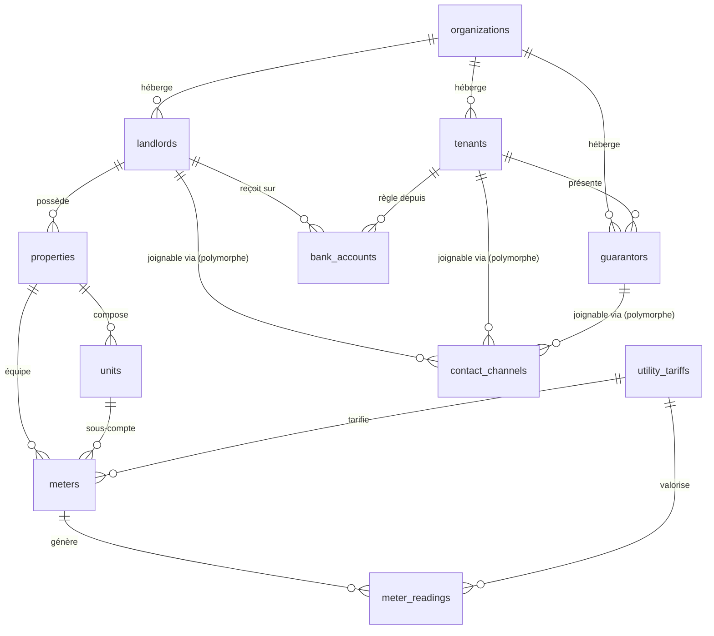
```mermaid
erDiagram
    organizations ||--o{ landlords : "héberge"
    organizations ||--o{ tenants : "héberge"
    organizations ||--o{ guarantors : "héberge"
    tenants ||--o{ guarantors : "présente"
    landlords ||--o{ properties : "possède"
    properties ||--o{ units : "compose"
    properties ||--o{ meters : "équipe"
    units ||--o{ meters : "sous-compte"
    meters ||--o{ meter_readings : "génère"
    utility_tariffs ||--o{ meters : "tarifie"
    utility_tariffs ||--o{ meter_readings : "valorise"
    landlords ||--o{ bank_accounts : "reçoit sur"
    tenants ||--o{ bank_accounts : "règle depuis"
    landlords ||--o{ contact_channels : "joignable via (polymorphe)"
    tenants ||--o{ contact_channels : "joignable via (polymorphe)"
    guarantors ||--o{ contact_channels : "joignable via (polymorphe)"
```

### 5.1 `landlords`

**Rôle.** Propriétaire d'un bien : tiers sous mandat de gestion dans une agence, ou landlord « self » possédé par l'organisation dans le cas d'un bailleur indépendant.

| Colonne                      | Type               | Null | Défaut              | Description                                                                                                                                                                    |
| ---------------------------- | ------------------ | ---- | ------------------- | ------------------------------------------------------------------------------------------------------------------------------------------------------------------------------ |
| `id`                         | UUID               | non  | `gen_random_uuid()` | Identifiant primaire.                                                                                                                                                          |
| `organization_id`            | UUID               | non  | —                   | Organisation propriétaire de la fiche.                                                                                                                                         |
| `user_id`                    | UUID               | oui  | —                   | Compte `users` global lié au bailleur : ouvre le **portail bailleur en lecture seule**. `NULL` tant que le bailleur n'a pas activé son accès.                                  |
| `party_type`                 | `party_type`       | non  | `'INDIVIDUAL'`      | Personne physique ou morale.                                                                                                                                                   |
| `is_self`                    | BOOLEAN            | non  | `false`             | `true` = le bailleur est l'organisation elle-même (`INDEPENDENT_LANDLORD`).                                                                                                    |
| `first_name` / `last_name`   | TEXT               | oui  | —                   | Identité (personne physique).                                                                                                                                                  |
| `company_name`               | TEXT               | oui  | —                   | Raison sociale (personne morale).                                                                                                                                              |
| `gender`                     | `gender_type`      | non  | `'UNSPECIFIED'`     | Genre déclaré.                                                                                                                                                                 |
| `birth_date`                 | DATE               | oui  | —                   | Date de naissance.                                                                                                                                                             |
| `nationality`                | CHAR(2)            | oui  | —                   | Code pays de nationalité.                                                                                                                                                      |
| `id_document_type`           | `id_document_type` | oui  | —                   | Type de pièce d'identité.                                                                                                                                                      |
| `id_document_number`         | TEXT               | oui  | —                   | Numéro de la pièce.                                                                                                                                                            |
| `id_document_expiry`         | DATE               | oui  | —                   | Date d'expiration de la pièce.                                                                                                                                                 |
| `id_document_id`             | UUID               | oui  | —                   | Scan de la pièce (FK vers `documents`).                                                                                                                                        |
| `rccm_number` / `niu_number` | TEXT               | oui  | —                   | Identifiants légaux (personne morale).                                                                                                                                         |
| `primary_phone`              | TEXT               | non  | —                   | Téléphone principal, format E.164.                                                                                                                                             |
| `secondary_phone`            | TEXT               | oui  | —                   | Téléphone secondaire.                                                                                                                                                          |
| `email`                      | TEXT               | oui  | —                   | Courriel.                                                                                                                                                                      |
| `address_line` / `district`  | TEXT               | oui  | —                   | Adresse ; `district` = quartier de résidence (ex. Moungali, Mpita).                                                                                                            |
| `city`                       | TEXT               | non  | `'Brazzaville'`     | Ville.                                                                                                                                                                         |
| `country_code`               | CHAR(2)            | non  | `'CG'`              | Code pays.                                                                                                                                                                     |
| `default_bank_account_id`    | UUID               | oui  | —                   | Compte de reversement par défaut. FK `landlords_default_bank_account_fk` vers `bank_accounts(id)` ON DELETE SET NULL, ajoutée en différé après la création de `bank_accounts`. |
| `payout_method`              | `payment_method`   | non  | `'MOBILE_MONEY'`    | Canal de reversement des loyers nets au bailleur.                                                                                                                              |
| `notes`                      | TEXT               | oui  | —                   | Notes libres.                                                                                                                                                                  |
| `created_at` / `updated_at`  | TIMESTAMPTZ        | non  | `now()`             | Horodatage standard.                                                                                                                                                           |
| `deleted_at`                 | TIMESTAMPTZ        | oui  | —                   | Suppression logique.                                                                                                                                                           |

**Clés étrangères** : `organization_id → organizations(id) ON DELETE CASCADE` ; `user_id → users(id) ON DELETE SET NULL` ; `id_document_id → documents(id) ON DELETE SET NULL` (FK différée, partie technique).

**Contraintes** : `CHECK` cohérence nom/type (`INDIVIDUAL` exige `last_name`, `COMPANY` exige `company_name`) ; `CHECK` E.164 sur `primary_phone`.

**Index** :

- `UNIQUE INDEX landlords_self_uk (organization_id) WHERE is_self AND deleted_at IS NULL` — **au plus un** landlord « self » actif par organisation.
- `landlords_org_idx (organization_id) WHERE deleted_at IS NULL` — accès courant filtré sur les fiches actives.
- `landlords_phone_idx (organization_id, primary_phone)` — recherche par téléphone (accueil, standard).

**Règles métier** : `organizations.default_landlord_id` pointe vers le landlord `is_self = true` d'un bailleur indépendant ; un bailleur agence (`is_self = false`) est toujours rattaché à au moins un `management_mandate` pour que ses biens soient gérés.

**Portail bailleur (`user_id`)** : `landlords.user_id` est le pivot de la _preuve d'honnêteté_ que l'agence ou le gestionnaire indépendant apporte au propriétaire. Le gestionnaire invite le bailleur par WhatsApp ; celui-ci crée (ou réutilise) son compte `users` global, qui est alors rattaché à sa fiche `landlords`. Il accède ensuite, **en lecture seule et sans jamais devenir membre de l'organisation**, à ce qui le concerne : encaissements de ses lots, quittances émises, relevés de gérance (`owner_statements`, `owner_statement_lines`) et reversements (`owner_payouts`). Conséquences de modélisation :

- l'accès n'est **pas** porté par `organization_members` : le bailleur n'a aucun `member_role`, l'autorisation se résout par la jointure `users → landlords (user_id) → properties/leases` dans la couche applicative, à l'intérieur du RLS de l'organisation gestionnaire ;
- un même `user` peut être bailleur chez plusieurs gestionnaires : il existe alors une ligne `landlords` par organisation, toutes pointant vers le même `user_id` — d'où l'absence d'unicité globale sur `landlords.user_id` (l'unicité se raisonne par organisation) ;
- le bailleur en diaspora est la cible première : le portail est la contrepartie visible du mandat, et le premier argument commercial auprès des démarcheurs `INDEPENDENT_MANAGER`.

### 5.2 `tenants`

**Rôle.** Locataire personne physique ou morale, avec ou sans compte utilisateur (portail locataire).

| Colonne                                                                             | Type          | Null | Défaut              | Description                                                                   |
| ----------------------------------------------------------------------------------- | ------------- | ---- | ------------------- | ----------------------------------------------------------------------------- |
| `id`                                                                                | UUID          | non  | `gen_random_uuid()` | Identifiant primaire.                                                         |
| `organization_id`                                                                   | UUID          | non  | —                   | Organisation propriétaire de la fiche.                                        |
| `user_id`                                                                           | UUID          | oui  | —                   | Compte utilisateur associé (portail locataire), optionnel.                    |
| `party_type`                                                                        | `party_type`  | non  | `'INDIVIDUAL'`      | Personne physique ou morale.                                                  |
| `first_name` / `last_name` / `company_name`                                         | TEXT          | oui  | —                   | Identité selon `party_type`.                                                  |
| `gender`                                                                            | `gender_type` | non  | `'UNSPECIFIED'`     | Genre déclaré.                                                                |
| `birth_date` / `birth_place`                                                        | DATE / TEXT   | oui  | —                   | État civil.                                                                   |
| `nationality`                                                                       | CHAR(2)       | oui  | —                   | Code pays de nationalité.                                                     |
| `id_document_type` / `id_document_number` / `id_document_expiry` / `id_document_id` | —             | oui  | —                   | Pièce d'identité, scan inclus (FK vers `documents`).                          |
| `rccm_number` / `niu_number`                                                        | TEXT          | oui  | —                   | Identifiants légaux (personne morale).                                        |
| `profession` / `employer_name`                                                      | TEXT          | oui  | —                   | Situation professionnelle.                                                    |
| `monthly_income`                                                                    | BIGINT        | oui  | —                   | Revenu mensuel déclaré en XAF, utilisé pour le scoring de solvabilité.        |
| `currency`                                                                          | CHAR(3)       | non  | `'XAF'`             | Devise du revenu déclaré.                                                     |
| `primary_phone`                                                                     | TEXT          | non  | —                   | Téléphone principal, E.164.                                                   |
| `secondary_phone` / `whatsapp_phone`                                                | TEXT          | oui  | —                   | Téléphones complémentaires.                                                   |
| `email`                                                                             | TEXT          | oui  | —                   | Courriel.                                                                     |
| `address_line` / `district`                                                         | TEXT          | oui  | —                   | Adresse.                                                                      |
| `city`                                                                              | TEXT          | non  | `'Brazzaville'`     | Ville.                                                                        |
| `country_code`                                                                      | CHAR(2)       | non  | `'CG'`              | Code pays.                                                                    |
| `emergency_contact_name` / `emergency_contact_phone`                                | TEXT          | oui  | —                   | Contact d'urgence.                                                            |
| `client_ref`                                                                        | TEXT          | oui  | —                   | ULID généré sur l'appareil mobile, clé d'idempotence unique par organisation. |
| `notes`                                                                             | TEXT          | oui  | —                   | Notes libres.                                                                 |
| `created_at` / `updated_at`                                                         | TIMESTAMPTZ   | non  | `now()`             | Horodatage standard.                                                          |
| `deleted_at`                                                                        | TIMESTAMPTZ   | oui  | —                   | Suppression logique.                                                          |

**Clés étrangères** : `organization_id → organizations(id) ON DELETE CASCADE` ; `user_id → users(id) ON DELETE SET NULL` ; `id_document_id → documents(id) ON DELETE SET NULL` (FK différée).

**Contraintes** : `CHECK` cohérence nom/type ; `CHECK` E.164 sur `primary_phone` ; `CHECK (monthly_income IS NULL OR monthly_income >= 0)` ; `UNIQUE (organization_id, client_ref)`.

**Index** :

- `tenants_org_idx (organization_id) WHERE deleted_at IS NULL` — accès courant sur les fiches actives.
- `tenants_phone_idx (organization_id, primary_phone)` — recherche par téléphone.
- `tenants_name_idx (organization_id, lower(coalesce(last_name, company_name)))` — recherche/tri alphabétique insensible à la casse, quel que soit `party_type`.

**Règles métier** : `client_ref` absorbe les créations effectuées hors ligne par un démarcheur sur le terrain ; un même `user_id` peut être locataire dans plusieurs organisations (table `users` globale), chaque fiche `tenants` restant propre à son organisation.

### 5.3 `guarantors`

**Rôle.** Garant (caution) rattaché à un locataire et/ou à un bail. Optionnel.

| Colonne                                                      | Type         | Null | Défaut              | Description                                                                                       |
| ------------------------------------------------------------ | ------------ | ---- | ------------------- | ------------------------------------------------------------------------------------------------- |
| `id`                                                         | UUID         | non  | `gen_random_uuid()` | Identifiant primaire.                                                                             |
| `organization_id`                                            | UUID         | non  | —                   | Organisation propriétaire de la fiche.                                                            |
| `tenant_id`                                                  | UUID         | oui  | —                   | Locataire cautionné (le garant peut exister avant d'être rattaché à un bail via `lease_parties`). |
| `party_type`                                                 | `party_type` | non  | `'INDIVIDUAL'`      | Personne physique ou morale.                                                                      |
| `first_name` / `last_name` / `company_name`                  | TEXT         | oui  | —                   | Identité.                                                                                         |
| `relationship`                                               | TEXT         | oui  | —                   | Lien avec le locataire (parent, employeur, ami...).                                               |
| `id_document_type` / `id_document_number` / `id_document_id` | —            | oui  | —                   | Pièce d'identité (FK vers `documents`).                                                           |
| `profession` / `employer_name`                               | TEXT         | oui  | —                   | Situation professionnelle.                                                                        |
| `monthly_income`                                             | BIGINT       | oui  | —                   | Revenu mensuel déclaré en XAF.                                                                    |
| `guarantee_amount`                                           | BIGINT       | oui  | —                   | Plafond de la caution solidaire en XAF ; `NULL` = illimité.                                       |
| `currency`                                                   | CHAR(3)      | non  | `'XAF'`             | Devise des montants.                                                                              |
| `primary_phone`                                              | TEXT         | non  | —                   | Téléphone, E.164.                                                                                 |
| `email` / `address_line` / `district`                        | TEXT         | oui  | —                   | Coordonnées.                                                                                      |
| `city`                                                       | TEXT         | non  | `'Brazzaville'`     | Ville.                                                                                            |
| `country_code`                                               | CHAR(2)      | non  | `'CG'`              | Code pays.                                                                                        |
| `notes`                                                      | TEXT         | oui  | —                   | Notes libres.                                                                                     |
| `created_at` / `updated_at`                                  | TIMESTAMPTZ  | non  | `now()`             | Horodatage standard.                                                                              |
| `deleted_at`                                                 | TIMESTAMPTZ  | oui  | —                   | Suppression logique.                                                                              |

**Clés étrangères** : `organization_id → organizations(id) ON DELETE CASCADE` ; `tenant_id → tenants(id) ON DELETE SET NULL` ; `id_document_id → documents(id) ON DELETE SET NULL` (FK différée).

**Contraintes** : `CHECK` E.164 sur `primary_phone` ; `CHECK (monthly_income IS NULL OR monthly_income >= 0)` ; `CHECK (guarantee_amount IS NULL OR guarantee_amount >= 0)`.

**Index** : `guarantors_org_idx (organization_id) WHERE deleted_at IS NULL` — accès courant sur les fiches actives.

**Règles métier** : le lien formel à un bail précis se fait via `lease_parties` (rôle `GUARANTOR`) — `guarantors.tenant_id` n'est qu'un rattachement informatif au locataire principal ; `guarantee_amount = NULL` signifie une garantie solidaire sans plafond explicite.

### 5.4 `contact_channels`

**Rôle.** Coordonnées multiples (téléphone, WhatsApp, email) d'un tiers, avec consentement de contact — complète les colonnes `primary_phone`/`email` portées directement par `landlords`/`tenants`/`guarantors` pour les cas multi-canaux.

| Colonne                     | Type                   | Null | Défaut              | Description                                                                                             |
| --------------------------- | ---------------------- | ---- | ------------------- | ------------------------------------------------------------------------------------------------------- |
| `id`                        | UUID                   | non  | `gen_random_uuid()` | Identifiant primaire.                                                                                   |
| `organization_id`           | UUID                   | non  | —                   | Organisation propriétaire.                                                                              |
| `owner_type`                | `contact_owner_type`   | non  | —                   | `LANDLORD`, `TENANT`, `GUARANTOR`, `MEMBER`, `SUPPLIER`.                                                |
| `owner_id`                  | UUID                   | non  | —                   | Référence polymorphe vers `landlords`/`tenants`/`guarantors`/`organization_members` selon `owner_type`. |
| `channel_type`              | `contact_channel_type` | non  | —                   | `PHONE`, `MOBILE`, `WHATSAPP`, `EMAIL`, `FAX`.                                                          |
| `value`                     | TEXT                   | non  | —                   | Valeur du canal (numéro, adresse).                                                                      |
| `label`                     | TEXT                   | oui  | —                   | Libellé libre (« bureau », « domicile »).                                                               |
| `is_primary`                | BOOLEAN                | non  | `false`             | Canal principal pour ce type, pour ce tiers.                                                            |
| `is_verified`               | BOOLEAN                | non  | `false`             | Canal vérifié (OTP, clic de confirmation).                                                              |
| `verified_at`               | TIMESTAMPTZ            | oui  | —                   | Date de vérification.                                                                                   |
| `opt_in`                    | BOOLEAN                | non  | `true`              | Consentement à recevoir relances et quittances sur ce canal.                                            |
| `opt_out_at`                | TIMESTAMPTZ            | oui  | —                   | Date de retrait du consentement.                                                                        |
| `created_at` / `updated_at` | TIMESTAMPTZ            | non  | `now()`             | Horodatage standard.                                                                                    |

**Clés étrangères** : `organization_id → organizations(id) ON DELETE CASCADE`. **Aucune FK sur `owner_id`** : la référence est polymorphe (le type de la table cible dépend de `owner_type`), non vérifiable par une contrainte `REFERENCES` unique — l'intégrité est assurée par l'application.

**Contraintes** : `UNIQUE (organization_id, owner_type, owner_id, channel_type, value)` — pas de doublon strict de la même valeur pour un même tiers et un même type de canal.

**Index** :

- `UNIQUE INDEX contact_channels_primary_uk (organization_id, owner_type, owner_id, channel_type) WHERE is_primary` — **au plus un** canal principal par tiers et par type de canal.
- `contact_channels_value_idx (organization_id, value)` — recherche inverse d'un tiers à partir d'un numéro/email (ex. identification d'un appelant).

**Règles métier** : `opt_in = false` ou `opt_out_at` renseigné doit bloquer tout envoi automatisé (relances, quittances) sur ce canal, contrôle applicatif appuyé par ces colonnes.

### 5.5 `properties`

**Rôle.** Bien immobilier (immeuble, parcelle, villa) rattaché à un bailleur ; support physique des lots loués.

| Colonne                                          | Type            | Null | Défaut                | Description                                                                         |
| ------------------------------------------------ | --------------- | ---- | --------------------- | ----------------------------------------------------------------------------------- |
| `id`                                             | UUID            | non  | `gen_random_uuid()`   | Identifiant primaire.                                                               |
| `organization_id`                                | UUID            | non  | —                     | Organisation gestionnaire.                                                          |
| `landlord_id`                                    | UUID            | non  | —                     | Bailleur propriétaire.                                                              |
| `code`                                           | TEXT            | oui  | —                     | Code interne du bien.                                                               |
| `name`                                           | TEXT            | non  | —                     | Nom/désignation du bien.                                                            |
| `property_type`                                  | `property_type` | non  | `'HOUSE'`             | Typologie du bien.                                                                  |
| `address_line`                                   | TEXT            | non  | —                     | Adresse.                                                                            |
| `district`                                       | TEXT            | non  | —                     | Quartier — élément d'adressage principal au Congo-Brazzaville.                      |
| `arrondissement`                                 | TEXT            | oui  | —                     | Arrondissement (grandes villes).                                                    |
| `landmark`                                       | TEXT            | oui  | —                     | Repère d'orientation (« derrière l'école X »), l'adressage postal étant peu fiable. |
| `city`                                           | TEXT            | non  | `'Brazzaville'`       | Ville.                                                                              |
| `country_code`                                   | CHAR(2)         | non  | `'CG'`                | Code pays.                                                                          |
| `latitude` / `longitude`                         | NUMERIC(9,6)    | oui  | —                     | Coordonnées GPS.                                                                    |
| `land_title_reference`                           | TEXT            | oui  | —                     | Référence du titre foncier ou de l'attestation de propriété.                        |
| `parcel_number`                                  | TEXT            | oui  | —                     | Numéro de parcelle cadastrale.                                                      |
| `built_year`                                     | SMALLINT        | oui  | —                     | Année de construction.                                                              |
| `total_area_sqm`                                 | NUMERIC(10,2)   | oui  | —                     | Surface totale (m²).                                                                |
| `floors_count`                                   | SMALLINT        | oui  | —                     | Nombre d'étages.                                                                    |
| `units_count`                                    | INTEGER         | non  | `0`                   | Compteur dénormalisé de lots actifs, maintenu par l'application.                    |
| `has_water` / `has_electricity` / `has_borehole` | BOOLEAN         | non  | `true`/`true`/`false` | Équipements de base (eau, électricité, forage).                                     |
| `caretaker_name` / `caretaker_phone`             | TEXT            | oui  | —                     | Gardien/concierge (téléphone en E.164).                                             |
| `cover_document_id`                              | UUID            | oui  | —                     | Photo de couverture (FK vers `documents`).                                          |
| `notes`                                          | TEXT            | oui  | —                     | Notes libres.                                                                       |
| `created_at` / `updated_at`                      | TIMESTAMPTZ     | non  | `now()`               | Horodatage standard.                                                                |
| `deleted_at`                                     | TIMESTAMPTZ     | oui  | —                     | Suppression logique.                                                                |

**Clés étrangères** : `organization_id → organizations(id) ON DELETE CASCADE` ; `landlord_id → landlords(id) ON DELETE RESTRICT` (un bien ne peut être orphelin de bailleur) ; `cover_document_id → documents(id) ON DELETE SET NULL` (FK différée).

**Contraintes** : `UNIQUE (organization_id, code)` ; `CHECK (total_area_sqm IS NULL OR total_area_sqm > 0)` ; `CHECK (floors_count IS NULL OR floors_count >= 0)` ; `CHECK (units_count >= 0)`.

**Index** :

- `properties_org_idx (organization_id) WHERE deleted_at IS NULL`.
- `properties_landlord_idx (organization_id, landlord_id) WHERE deleted_at IS NULL` — portefeuille d'un bailleur donné.
- `properties_district_idx (organization_id, city, district)` — recherche géographique par quartier, essentielle vu la fiabilité limitée de l'adressage postal local.

**Règles métier** : `ON DELETE RESTRICT` sur `landlord_id` empêche la suppression physique d'un bailleur tant qu'il possède des biens actifs ou archivés ; `units_count` est un compteur dénormalisé recalculé par l'application à chaque création/suppression logique de lot, à ne jamais mettre à jour manuellement en SQL.

### 5.6 `units`

**Rôle.** Lot louable d'un bien (studio, chambre, appartement, boutique, parcelle) — l'entité directement liée à un bail.

| Colonne                                              | Type          | Null | Défaut              | Description                                                                        |
| ---------------------------------------------------- | ------------- | ---- | ------------------- | ---------------------------------------------------------------------------------- |
| `id`                                                 | UUID          | non  | `gen_random_uuid()` | Identifiant primaire.                                                              |
| `organization_id`                                    | UUID          | non  | —                   | Organisation gestionnaire.                                                         |
| `property_id`                                        | UUID          | non  | —                   | Bien parent.                                                                       |
| `code`                                               | TEXT          | non  | —                   | Code du lot au sein du bien (ex. « A1 »).                                          |
| `label`                                              | TEXT          | oui  | —                   | Libellé descriptif.                                                                |
| `unit_type`                                          | `unit_type`   | non  | `'APARTMENT'`       | Typologie du lot.                                                                  |
| `status`                                             | `unit_status` | non  | `'AVAILABLE'`       | Disponibilité courante.                                                            |
| `floor_number`                                       | SMALLINT      | oui  | —                   | Étage.                                                                             |
| `rooms_count` / `bedrooms_count` / `bathrooms_count` | SMALLINT      | oui  | —                   | Composition du lot.                                                                |
| `area_sqm`                                           | NUMERIC(10,2) | oui  | —                   | Surface (m²).                                                                      |
| `is_furnished`                                       | BOOLEAN       | non  | `false`             | Lot meublé.                                                                        |
| `has_private_meter`                                  | BOOLEAN       | non  | `false`             | Dispose d'un compteur privatif.                                                    |
| `base_rent_amount`                                   | BIGINT        | non  | `0`                 | Loyer de référence en XAF ; le loyer contractuel réel est porté par `leases`.      |
| `base_charges_amount`                                | BIGINT        | non  | `0`                 | Charges forfaitaires de référence en XAF (eau, électricité communes, gardiennage). |
| `deposit_months`                                     | SMALLINT      | non  | `2`                 | Nombre de mois de loyer exigés en caution (usage local : 2 à 3 mois).              |
| `currency`                                           | CHAR(3)       | non  | `'XAF'`             | Devise des montants de référence.                                                  |
| `amenities`                                          | JSONB         | non  | `'{}'`              | Équipements libres (climatisation, cour, forage, groupe électrogène...).           |
| `notes`                                              | TEXT          | oui  | —                   | Notes libres.                                                                      |
| `created_at` / `updated_at`                          | TIMESTAMPTZ   | non  | `now()`             | Horodatage standard.                                                               |
| `deleted_at`                                         | TIMESTAMPTZ   | oui  | —                   | Suppression logique.                                                               |

**Clés étrangères** : `organization_id → organizations(id) ON DELETE CASCADE` ; `property_id → properties(id) ON DELETE RESTRICT`.

**Contraintes** : `UNIQUE (organization_id, property_id, code)` ; `CHECK` positivité sur `rooms_count`, `bedrooms_count`, `bathrooms_count`, `area_sqm`, montants et `deposit_months`.

**Index** :

- `units_org_status_idx (organization_id, status) WHERE deleted_at IS NULL` — tableau de bord de disponibilité (lots `AVAILABLE`, `OCCUPIED`, etc.).
- `units_property_idx (organization_id, property_id) WHERE deleted_at IS NULL` — liste des lots d'un bien.

**Règles métier** : `base_rent_amount`/`base_charges_amount` sont des valeurs de référence utilisées pour l'affichage et la pré-remplissage d'un nouveau bail ; elles n'influent jamais sur un bail déjà signé, dont les montants (`leases.rent_amount`, `leases.charges_amount`) sont figés à la signature.

### 5.7 `bank_accounts`

**Rôle.** Comptes de règlement : banques locales (BGFI, LCB, Ecobank, UBA, BSCA, Crédit du Congo...) ou portefeuilles Mobile Money, détenus par l'organisation, un bailleur ou un locataire.

| Colonne                     | Type                       | Null | Défaut              | Description                                             |
| --------------------------- | -------------------------- | ---- | ------------------- | ------------------------------------------------------- |
| `id`                        | UUID                       | non  | `gen_random_uuid()` | Identifiant primaire.                                   |
| `organization_id`           | UUID                       | non  | —                   | Organisation propriétaire de la fiche.                  |
| `holder_type`               | `bank_account_holder_type` | non  | `'ORGANIZATION'`    | Nature du détenteur.                                    |
| `landlord_id`               | UUID                       | oui  | —                   | Bailleur détenteur (si `holder_type = LANDLORD`).       |
| `tenant_id`                 | UUID                       | oui  | —                   | Locataire détenteur (si `holder_type = TENANT`).        |
| `label`                     | TEXT                       | non  | —                   | Libellé du compte.                                      |
| `bank_code`                 | TEXT                       | non  | —                   | Code banque libre — sert au rapprochement des relevés.  |
| `bank_name`                 | TEXT                       | non  | —                   | Nom de la banque.                                       |
| `branch_name`               | TEXT                       | oui  | —                   | Agence.                                                 |
| `account_holder_name`       | TEXT                       | non  | —                   | Nom du titulaire tel qu'il apparaît sur le compte.      |
| `account_number`            | TEXT                       | oui  | —                   | Numéro de compte.                                       |
| `rib_key`                   | TEXT                       | oui  | —                   | Clé RIB à 2 chiffres du plan de comptes bancaire CEMAC. |
| `iban` / `swift_bic`        | TEXT                       | oui  | —                   | Coordonnées internationales, le cas échéant.            |
| `momo_provider`             | `momo_provider`            | oui  | —                   | Opérateur Mobile Money, si applicable.                  |
| `momo_msisdn`               | TEXT                       | oui  | —                   | Numéro du portefeuille Mobile Money, format E.164.      |
| `currency`                  | CHAR(3)                    | non  | `'XAF'`             | Devise du compte.                                       |
| `is_default`                | BOOLEAN                    | non  | `false`             | Compte par défaut pour ce détenteur.                    |
| `is_active`                 | BOOLEAN                    | non  | `true`              | Compte actif.                                           |
| `created_at` / `updated_at` | TIMESTAMPTZ                | non  | `now()`             | Horodatage standard.                                    |

**Clés étrangères** : `organization_id → organizations(id) ON DELETE CASCADE` ; `landlord_id → landlords(id) ON DELETE CASCADE` ; `tenant_id → tenants(id) ON DELETE CASCADE`.

**Contraintes** :

- `CHECK` de cohérence `holder_type`/`landlord_id`/`tenant_id` : `ORGANIZATION` exige les deux `NULL`, `LANDLORD` exige `landlord_id`, `TENANT` exige `tenant_id`.
- `CHECK (account_number IS NOT NULL OR iban IS NOT NULL OR momo_msisdn IS NOT NULL)` — au moins un identifiant de règlement renseigné.
- `CHECK` E.164 sur `momo_msisdn`.
- `UNIQUE (organization_id, bank_code, account_number)`.

**Index** :

- `UNIQUE INDEX bank_accounts_default_org_uk (organization_id) WHERE is_default AND holder_type = 'ORGANIZATION' AND is_active` — un seul compte organisation par défaut actif.
- `UNIQUE INDEX bank_accounts_default_landlord_uk (organization_id, landlord_id) WHERE is_default AND holder_type = 'LANDLORD' AND is_active` — un seul compte par défaut actif par bailleur.

**Règles métier** : cette table sert à la fois de compte de réception (reversement bailleur) et de compte de règlement source (déclaration de virement locataire). La FK différée `landlords_default_bank_account_fk` garantit que `landlords.default_bank_account_id` pointe vers un compte existant ; la cohérence du `holder_type` (LANDLORD) et du `landlord_id` avec le bailleur porteur reste à vérifier applicativement.

### 5.8 `utility_tariffs`

**Rôle.** Grille de refacturation des charges (E2C électricité, LCDE eau, sous-compteurs privés) applicable à une organisation entière ou à un bien précis.

| Colonne                           | Type                | Null | Défaut                 | Description                                                                  |
| --------------------------------- | ------------------- | ---- | ---------------------- | ---------------------------------------------------------------------------- |
| `id`                              | UUID                | non  | `gen_random_uuid()`    | Identifiant primaire.                                                        |
| `organization_id`                 | UUID                | non  | —                      | Organisation propriétaire du tarif.                                          |
| `property_id`                     | UUID                | oui  | —                      | Bien concerné ; `NULL` = tarif par défaut de l'organisation.                 |
| `meter_type`                      | `meter_type`        | non  | —                      | Type de compteur concerné.                                                   |
| `basis`                           | `tariff_basis`      | non  | `'PER_UNIT_CONSUMED'`  | Base de calcul de la refacturation.                                          |
| `label`                           | TEXT                | non  | —                      | Libellé du tarif.                                                            |
| `unit_price_amount`               | BIGINT              | non  | `0`                    | Prix en XAF de l'unité consommée (kWh, m³) pour la base `PER_UNIT_CONSUMED`. |
| `flat_amount`                     | BIGINT              | non  | `0`                    | Montant forfaitaire mensuel en XAF pour la base `FLAT_MONTHLY`.              |
| `standing_charge_amount`          | BIGINT              | non  | `0`                    | Abonnement/prime fixe ajoutée à la consommation.                             |
| `minimum_amount`                  | BIGINT              | non  | `0`                    | Montant minimum facturable.                                                  |
| `measurement_unit`                | TEXT                | non  | `'kWh'`                | Unité de mesure du compteur (kWh pour E2C, m³ pour LCDE).                    |
| `invoice_line_type`               | `invoice_line_type` | non  | `'ELECTRICITY_CHARGE'` | Type de ligne de facture généré.                                             |
| `effective_from` / `effective_to` | DATE                | oui* | —                      | Période de validité (`effective_from` non nul).                              |
| `is_active`                       | BOOLEAN             | non  | `true`                 | Tarif actif.                                                                 |
| `currency`                        | CHAR(3)             | non  | `'XAF'`                | Devise.                                                                      |
| `created_at` / `updated_at`       | TIMESTAMPTZ         | non  | `now()`                | Horodatage standard.                                                         |

**Clés étrangères** : `organization_id → organizations(id) ON DELETE CASCADE` ; `property_id → properties(id) ON DELETE CASCADE`.

**Contraintes** : `CHECK` positivité sur tous les montants ; `CHECK (effective_to IS NULL OR effective_from < effective_to)`.

**Index** : `utility_tariffs_lookup_idx (organization_id, meter_type, effective_from DESC) WHERE is_active` — retrouver le tarif actif le plus récent pour un type de compteur, au moment de valoriser un relevé.

**Règles métier** : plusieurs tarifs peuvent coexister dans le temps pour un même `meter_type` (historique des grilles tarifaires) ; la valorisation d'un relevé (`meter_readings.computed_amount`) fige le tarif appliqué au moment du relevé et n'est jamais recalculée rétroactivement si le tarif change ensuite.

### 5.9 `meters`

**Rôle.** Compteur d'eau (LCDE) ou d'électricité (E2C), général ou divisionnaire, rattaché à un bien et éventuellement à un lot précis.

| Colonne                     | Type          | Null | Défaut              | Description                                                                    |
| --------------------------- | ------------- | ---- | ------------------- | ------------------------------------------------------------------------------ |
| `id`                        | UUID          | non  | `gen_random_uuid()` | Identifiant primaire.                                                          |
| `organization_id`           | UUID          | non  | —                   | Organisation gestionnaire.                                                     |
| `property_id`               | UUID          | non  | —                   | Bien équipé.                                                                   |
| `unit_id`                   | UUID          | oui  | —                   | Lot desservi ; `NULL` pour un compteur général du bien.                        |
| `meter_type`                | `meter_type`  | non  | —                   | Type de compteur.                                                              |
| `serial_number`             | TEXT          | non  | —                   | Numéro de série physique.                                                      |
| `subscriber_number`         | TEXT          | oui  | —                   | Numéro d'abonné auprès du concessionnaire (E2C/LCDE).                          |
| `provider_name`             | TEXT          | oui  | —                   | Nom du fournisseur.                                                            |
| `is_prepaid`                | BOOLEAN       | non  | `false`             | Compteur prépayé (recharge) : pas de relevé différentiel facturable.           |
| `is_shared`                 | BOOLEAN       | non  | `false`             | Compteur partagé entre plusieurs lots.                                         |
| `shared_ratio_bps`          | INTEGER       | oui  | —                   | Quote-part en points de base imputée au lot quand le compteur est partagé.     |
| `measurement_unit`          | TEXT          | non  | `'kWh'`             | Unité de mesure de l'afficheur.                                                |
| `digits_count`              | SMALLINT      | non  | `6`                 | Nombre de chiffres de l'afficheur, pour détecter le passage à zéro (rollover). |
| `initial_index`             | NUMERIC(14,3) | non  | `0`                 | Index de départ à l'installation.                                              |
| `tariff_id`                 | UUID          | oui  | —                   | Tarif par défaut appliqué à ce compteur.                                       |
| `installed_at`              | DATE          | oui  | —                   | Date d'installation.                                                           |
| `is_active`                 | BOOLEAN       | non  | `true`              | Compteur en service.                                                           |
| `created_at` / `updated_at` | TIMESTAMPTZ   | non  | `now()`             | Horodatage standard.                                                           |

**Clés étrangères** : `organization_id → organizations(id) ON DELETE CASCADE` ; `property_id → properties(id) ON DELETE CASCADE` ; `unit_id → units(id) ON DELETE SET NULL` ; `tariff_id → utility_tariffs(id) ON DELETE SET NULL`.

**Contraintes** : `UNIQUE (organization_id, serial_number)` ; `CHECK (shared_ratio_bps BETWEEN 0 AND 10000)` ; `CHECK (digits_count BETWEEN 3 AND 12)` ; `CHECK (initial_index >= 0)`.

**Index** :

- `meters_property_idx (organization_id, property_id) WHERE is_active` — liste des compteurs actifs d'un bien.
- `meters_unit_idx (organization_id, unit_id) WHERE unit_id IS NOT NULL` — compteurs privatifs d'un lot.

**Règles métier** : `digits_count` permet à l'application de détecter un rollover (retour à zéro de l'afficheur) lors du calcul de consommation entre deux relevés ; un compteur `is_prepaid = true` n'alimente pas de refacturation différentielle (le paiement se fait par recharge, hors modèle de facturation locative).

### 5.10 `meter_readings`

**Rôle.** Relevé de compteur saisi sur le terrain (photo à l'appui), base de la refacturation des charges au locataire.

| Colonne                            | Type          | Null | Défaut              | Description                                                                                         |
| ---------------------------------- | ------------- | ---- | ------------------- | --------------------------------------------------------------------------------------------------- |
| `id`                               | UUID          | non  | `gen_random_uuid()` | Identifiant primaire.                                                                               |
| `organization_id`                  | UUID          | non  | —                   | Organisation gestionnaire.                                                                          |
| `meter_id`                         | UUID          | non  | —                   | Compteur relevé.                                                                                    |
| `unit_id`                          | UUID          | oui  | —                   | Lot concerné (répartition partagée).                                                                |
| `lease_id`                         | UUID          | oui  | —                   | Bail auquel la charge est imputée (FK différée vers `leases`).                                      |
| `reading_date`                     | DATE          | non  | —                   | Date du relevé.                                                                                     |
| `period_start` / `period_end`      | DATE          | oui  | —                   | Période couverte par le relevé.                                                                     |
| `previous_index` / `current_index` | NUMERIC(14,3) | non  | `0` / —             | Index de départ et d'arrivée.                                                                       |
| `consumption`                      | NUMERIC(14,3) | non  | `0`                 | Consommation calculée = `current_index - previous_index`, corrigée du rollover et de la quote-part. |
| `rollover_applied`                 | BOOLEAN       | non  | `false`             | Un passage à zéro de l'afficheur a été détecté et corrigé.                                          |
| `tariff_id`                        | UUID          | oui  | —                   | Tarif appliqué à ce relevé.                                                                         |
| `unit_price_amount`                | BIGINT        | non  | `0`                 | Prix unitaire figé au moment du relevé.                                                             |
| `computed_amount`                  | BIGINT        | non  | `0`                 | Montant en XAF à refacturer, figé au moment du relevé.                                              |
| `currency`                         | CHAR(3)       | non  | `'XAF'`             | Devise.                                                                                             |
| `is_estimated`                     | BOOLEAN       | non  | `false`             | Relevé estimé (compteur inaccessible) à régulariser au relevé suivant.                              |
| `is_invoiced`                      | BOOLEAN       | non  | `false`             | Déjà intégré à une facture.                                                                         |
| `invoice_line_id`                  | UUID          | oui  | —                   | Ligne de facture résultante (FK différée vers `invoice_lines`).                                     |
| `photo_document_id`                | UUID          | oui  | —                   | Photo du compteur (FK vers `documents`).                                                            |
| `recorded_by_user_id`              | UUID          | oui  | —                   | Agent ayant effectué le relevé.                                                                     |
| `client_ref`                       | TEXT          | oui  | —                   | ULID d'idempotence produit par l'application mobile hors ligne.                                     |
| `sync_batch_id`                    | UUID          | oui  | —                   | Lot de synchronisation d'origine.                                                                   |
| `notes`                            | TEXT          | oui  | —                   | Notes libres.                                                                                       |
| `created_at` / `updated_at`        | TIMESTAMPTZ   | non  | `now()`             | Horodatage standard.                                                                                |

**Clés étrangères** : `organization_id → organizations(id) ON DELETE CASCADE` ; `meter_id → meters(id) ON DELETE CASCADE` ; `unit_id → units(id) ON DELETE SET NULL` ; `tariff_id → utility_tariffs(id) ON DELETE SET NULL` ; `recorded_by_user_id → users(id) ON DELETE SET NULL` ; `lease_id → leases(id) ON DELETE SET NULL` (FK différée, ajoutée en partie `04a_mandates_leases.sql`) ; `invoice_line_id → invoice_lines(id) ON DELETE SET NULL` (FK différée, partie facturation) ; `photo_document_id → documents(id) ON DELETE SET NULL` (FK différée, partie technique).

**Contraintes** : `UNIQUE (organization_id, client_ref)` ; `CHECK` positivité sur les index et la consommation ; `CHECK (period_start IS NULL OR period_end IS NULL OR period_start < period_end)`.

**Index** :

- `meter_readings_meter_date_idx (organization_id, meter_id, reading_date DESC)` — historique d'un compteur, dernier relevé en premier (base du calcul différentiel).
- `meter_readings_to_invoice_idx (organization_id, lease_id) WHERE NOT is_invoiced` — file d'attente des relevés restant à facturer pour un bail.
- `meter_readings_sync_idx (sync_batch_id) WHERE sync_batch_id IS NOT NULL` — suivi des lots de synchronisation mobile.

**Règles métier** : `computed_amount` et `unit_price_amount` sont figés à l'instant du relevé (même logique que les colonnes financières verrouillées, bien que cette table ne soit pas sous trigger `guard_financial_row`) : un changement ultérieur du tarif n'altère jamais un relevé déjà valorisé ; `is_estimated = true` signale un relevé à contrôler/régulariser dès que le compteur redevient accessible.

## 6. Contrats

Ce domaine porte les mandats de gestion, les baux et leurs parties, les documents contractuels, les dépôts de garantie et les états des lieux. Fichiers DDL : `04a_mandates_leases.sql`, `04b_lease_parties_deposits.sql`, `04c_inspections.sql`.

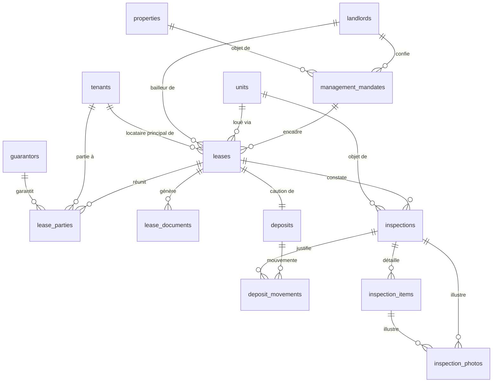
```mermaid
erDiagram
    landlords ||--o{ management_mandates : "confie"
    properties ||--o{ management_mandates : "objet de"
    management_mandates ||--o{ leases : "encadre"
    units ||--o{ leases : "loué via"
    landlords ||--o{ leases : "bailleur de"
    tenants ||--o{ leases : "locataire principal de"
    leases ||--o{ lease_parties : "réunit"
    tenants ||--o{ lease_parties : "partie à"
    guarantors ||--o{ lease_parties : "garantit"
    leases ||--o{ lease_documents : "génère"
    leases ||--|| deposits : "caution de"
    deposits ||--o{ deposit_movements : "mouvemente"
    leases ||--o{ inspections : "constate"
    units ||--o{ inspections : "objet de"
    inspections ||--o{ inspection_items : "détaille"
    inspections ||--o{ inspection_photos : "illustre"
    inspection_items ||--o{ inspection_photos : "illustre"
    inspections ||--o{ deposit_movements : "justifie"
```

### 6.1 `management_mandates`

**Rôle.** Mandat de gestion liant une agence à un bailleur, pour tout son portefeuille ou pour un bien donné.

| Colonne                                | Type               | Null | Défaut                         | Description                                                                                               |
| -------------------------------------- | ------------------ | ---- | ------------------------------ | --------------------------------------------------------------------------------------------------------- |
| `id`                                   | UUID               | non  | `gen_random_uuid()`            | Identifiant primaire.                                                                                     |
| `organization_id`                      | UUID               | non  | —                              | Agence mandataire.                                                                                        |
| `landlord_id`                          | UUID               | non  | —                              | Bailleur mandant.                                                                                         |
| `property_id`                          | UUID               | oui  | —                              | Bien concerné ; `NULL` = mandat portant sur tout le portefeuille du bailleur.                             |
| `reference`                            | TEXT               | non  | —                              | Référence du mandat.                                                                                      |
| `scope`                                | `mandate_scope`    | non  | `'FULL_MANAGEMENT'`            | Étendue du mandat.                                                                                        |
| `status`                               | `mandate_status`   | non  | `'DRAFT'`                      | Cycle de vie (voir 6.6).                                                                                  |
| `start_date` / `end_date`              | DATE               | oui* | —                              | Période (`start_date` non nul).                                                                           |
| `notice_days`                          | SMALLINT           | non  | `90`                           | Préavis de résiliation, en jours.                                                                         |
| `auto_renew`                           | BOOLEAN            | non  | `true`                         | Reconduction tacite.                                                                                      |
| `commission_basis`                     | `commission_basis` | non  | `'RATE_BPS_ON_RENT_COLLECTED'` | Base de calcul de la commission.                                                                          |
| `commission_rate_bps`                  | INTEGER            | oui  | —                              | Taux de commission en points de base (1000 = 10 %) ; exclusif ou cumulable avec `commission_flat_amount`. |
| `commission_flat_amount`               | BIGINT             | oui  | —                              | Commission forfaitaire alternative.                                                                       |
| `letting_fee_rate_bps`                 | INTEGER            | oui  | —                              | Honoraires de mise en location, en points de base du loyer annuel.                                        |
| `vat_rate_bps`                         | INTEGER            | non  | `1800`                         | TVA applicable aux honoraires (18 % au Congo-Brazzaville).                                                |
| `payout_day`                           | SMALLINT           | non  | `10`                           | Jour du mois de reversement des loyers nets au bailleur.                                                  |
| `payout_bank_account_id`               | UUID               | oui  | —                              | Compte de reversement.                                                                                    |
| `currency`                             | CHAR(3)            | non  | `'XAF'`                        | Devise.                                                                                                   |
| `signed_at`                            | TIMESTAMPTZ        | oui  | —                              | Date de signature.                                                                                        |
| `signature_document_id`                | UUID               | oui  | —                              | Image de signature (FK vers `documents`).                                                                 |
| `signature_hash`                       | TEXT               | oui  | —                              | Empreinte SHA-256 du document signé, gage d'intégrité.                                                    |
| `terminated_at` / `termination_reason` | —                  | oui  | —                              | Résiliation.                                                                                              |
| `document_id`                          | UUID               | oui  | —                              | PDF du mandat (FK vers `documents`).                                                                      |
| `notes`                                | TEXT               | oui  | —                              | Notes libres.                                                                                             |
| `created_at` / `updated_at`            | TIMESTAMPTZ        | non  | `now()`                        | Horodatage standard.                                                                                      |

**Clés étrangères** : `organization_id → organizations(id) ON DELETE CASCADE` ; `landlord_id → landlords(id) ON DELETE RESTRICT` ; `property_id → properties(id) ON DELETE CASCADE` ; `payout_bank_account_id → bank_accounts(id) ON DELETE SET NULL` ; `signature_document_id → documents(id) ON DELETE SET NULL` et `document_id → documents(id) ON DELETE SET NULL` (FK différées, partie technique).

**Contraintes** : `UNIQUE (organization_id, reference)` ; `CHECK (end_date IS NULL OR start_date < end_date)` ; `CHECK (commission_rate_bps IS NOT NULL OR commission_flat_amount IS NOT NULL)` — au moins un mode de calcul de commission défini.

**Index** : `management_mandates_landlord_idx (organization_id, landlord_id, status)` — portefeuille de mandats d'un bailleur filtré par statut.

**Règles métier** : `ON DELETE RESTRICT` sur `landlord_id` protège l'historique des mandats même si le bailleur est retiré ; un mandat `property_id IS NULL` s'applique à tous les biens actuels et futurs du bailleur, tandis qu'un mandat `property_id` renseigné ne couvre que ce bien.

### 6.2 `leases`

**Rôle.** Contrat de bail : loyer, charges, caution, échéance et pénalités. Pivot de toute la facturation et des encaissements (document complémentaire).

| Colonne                                                  | Type             | Null | Défaut              | Description                                                                                                       |
| -------------------------------------------------------- | ---------------- | ---- | ------------------- | ----------------------------------------------------------------------------------------------------------------- |
| `id`                                                     | UUID             | non  | `gen_random_uuid()` | Identifiant primaire.                                                                                             |
| `organization_id`                                        | UUID             | non  | —                   | Organisation gestionnaire.                                                                                        |
| `unit_id`                                                | UUID             | non  | —                   | Lot loué.                                                                                                         |
| `property_id`                                            | UUID             | non  | —                   | Bien parent (dénormalisé pour éviter une jointure via `unit_id`).                                                 |
| `landlord_id`                                            | UUID             | non  | —                   | Bailleur du bien.                                                                                                 |
| `primary_tenant_id`                                      | UUID             | non  | —                   | Locataire titulaire principal.                                                                                    |
| `mandate_id`                                             | UUID             | oui  | —                   | Mandat de gestion encadrant ce bail, si applicable.                                                               |
| `reference`                                              | TEXT             | non  | —                   | Référence du bail.                                                                                                |
| `status`                                                 | `lease_status`   | non  | `'DRAFT'`           | Cycle de vie (voir 6.6).                                                                                          |
| `start_date` / `end_date`                                | DATE             | oui* | —                   | Période contractuelle (`start_date` non nul).                                                                     |
| `move_in_date` / `move_out_date`                         | DATE             | oui  | —                   | Dates réelles d'entrée/sortie (peuvent différer du contrat).                                                      |
| `rent_period`                                            | `rent_period`    | non  | `'MONTHLY'`         | Périodicité du loyer.                                                                                             |
| `rent_amount`                                            | BIGINT           | non  | —                   | Loyer contractuel en XAF pour une période `rent_period`.                                                          |
| `charges_amount`                                         | BIGINT           | non  | `0`                 | Charges forfaitaires ou provisionnelles.                                                                          |
| `charges_are_provisional`                                | BOOLEAN          | non  | `false`             | `true` = provisions sur charges régularisées sur relevés de compteurs.                                            |
| `deposit_amount`                                         | BIGINT           | non  | `0`                 | Montant de caution exigé.                                                                                         |
| `agency_fee_amount`                                      | BIGINT           | non  | `0`                 | Frais d'agence facturés au locataire.                                                                             |
| `advance_months`                                         | SMALLINT         | non  | `0`                 | Nombre de mois de loyer payés d'avance à l'entrée (usage local courant).                                          |
| `currency`                                               | CHAR(3)          | non  | `'XAF'`             | Devise.                                                                                                           |
| `payment_due_day`                                        | SMALLINT         | non  | `5`                 | Jour du mois d'exigibilité du loyer.                                                                              |
| `grace_days`                                             | SMALLINT         | non  | `5`                 | Jours de tolérance après échéance avant bascule `OVERDUE` et pénalités.                                           |
| `penalty_rule_id`                                        | UUID             | oui  | —                   | Barème de pénalités applicable (FK différée vers `penalty_rules`).                                                |
| `preferred_payment_method`                               | `payment_method` | non  | `'CASH'`            | Canal de règlement privilégié du locataire.                                                                       |
| `collector_user_id`                                      | UUID             | oui  | —                   | Démarcheur affecté à la collecte terrain de ce bail.                                                              |
| `indexation_rate_bps`                                    | INTEGER          | oui  | —                   | Taux de révision annuelle du loyer en points de base.                                                             |
| `next_indexation_date`                                   | DATE             | oui  | —                   | Prochaine date de révision.                                                                                       |
| `notice_days`                                            | SMALLINT         | non  | `30`                | Préavis de départ, en jours.                                                                                      |
| `auto_renew`                                             | BOOLEAN          | non  | `true`              | Reconduction tacite.                                                                                              |
| `signed_at` / `signature_document_id` / `signature_hash` | —                | oui  | —                   | Signature du bail (image + empreinte SHA-256, capturée sur mobile).                                               |
| `contract_document_id`                                   | UUID             | oui  | —                   | PDF du contrat généré.                                                                                            |
| `terminated_at` / `termination_reason`                   | —                | oui  | —                   | Résiliation.                                                                                                      |
| `balance_amount`                                         | BIGINT           | non  | `0`                 | Solde locataire dénormalisé en XAF : positif = dette, négatif = avoir. Peut être négatif, donc sans `CHECK >= 0`. |
| `client_ref`                                             | TEXT             | oui  | —                   | ULID d'idempotence mobile.                                                                                        |
| `notes`                                                  | TEXT             | oui  | —                   | Notes libres.                                                                                                     |
| `created_at` / `updated_at`                              | TIMESTAMPTZ      | non  | `now()`             | Horodatage standard.                                                                                              |
| `deleted_at`                                             | TIMESTAMPTZ      | oui  | —                   | Suppression logique.                                                                                              |

**Clés étrangères** : `unit_id → units(id) ON DELETE RESTRICT` ; `property_id → properties(id) ON DELETE RESTRICT` ; `landlord_id → landlords(id) ON DELETE RESTRICT` ; `primary_tenant_id → tenants(id) ON DELETE RESTRICT` ; `mandate_id → management_mandates(id) ON DELETE SET NULL` ; `collector_user_id → users(id) ON DELETE SET NULL` ; `penalty_rule_id → penalty_rules(id) ON DELETE SET NULL` (FK différée) ; `signature_document_id`/`contract_document_id → documents(id) ON DELETE SET NULL` (FK différées).

**Contraintes** : `UNIQUE (organization_id, reference)` ; `UNIQUE (organization_id, client_ref)` ; `CHECK (end_date IS NULL OR start_date < end_date)` ; `CHECK (move_out_date IS NULL OR move_in_date IS NULL OR move_in_date <= move_out_date)` ; `CHECK` positivité sur tous les montants sauf `balance_amount`.

**Index** :

- `leases_org_status_idx (organization_id, status) WHERE deleted_at IS NULL` — file de travail par statut (baux actifs, en préavis...).
- `leases_unit_idx (organization_id, unit_id) WHERE deleted_at IS NULL` — historique des baux d'un lot.
- `leases_tenant_idx (organization_id, primary_tenant_id) WHERE deleted_at IS NULL` — baux d'un locataire.
- `leases_collector_idx (organization_id, collector_user_id) WHERE status = 'ACTIVE'` — portefeuille terrain d'un démarcheur.
- `leases_unpaid_idx (organization_id, balance_amount DESC) WHERE status = 'ACTIVE' AND balance_amount > 0` — file des baux actifs en dette, triée par montant décroissant (priorisation des relances/tournées).

**Règles métier** : `ON DELETE RESTRICT` sur `unit_id`, `property_id`, `landlord_id`, `primary_tenant_id` empêche toute suppression physique d'une entité référencée par un bail, actif ou archivé — seule la suppression logique (`deleted_at`) est possible ; `balance_amount` est un solde dénormalisé recalculé par l'application à chaque facturation/encaissement, jamais à corriger manuellement en SQL ; `mandate_id` reste `NULL` pour un bailleur indépendant (`INDEPENDENT_LANDLORD`) qui gère lui-même son bien sans mandat d'agence.

### 6.3 `lease_parties`

**Rôle.** Parties signataires d'un bail : locataire principal, co-locataires, garants, occupants déclarés.

| Colonne                                                  | Type               | Null | Défaut              | Description                                                                    |
| -------------------------------------------------------- | ------------------ | ---- | ------------------- | ------------------------------------------------------------------------------ |
| `id`                                                     | UUID               | non  | `gen_random_uuid()` | Identifiant primaire.                                                          |
| `organization_id`                                        | UUID               | non  | —                   | Organisation gestionnaire.                                                     |
| `lease_id`                                               | UUID               | non  | —                   | Bail concerné.                                                                 |
| `role`                                                   | `lease_party_role` | non  | —                   | `PRIMARY_TENANT`, `CO_TENANT`, `GUARANTOR`, `OCCUPANT`.                        |
| `tenant_id`                                              | UUID               | oui  | —                   | Locataire/occupant, si `role ≠ GUARANTOR`.                                     |
| `guarantor_id`                                           | UUID               | oui  | —                   | Garant, si `role = GUARANTOR`.                                                 |
| `share_bps`                                              | INTEGER            | non  | `10000`             | Quote-part du loyer imputée à cette partie, en points de base (10000 = 100 %). |
| `is_solidary`                                            | BOOLEAN            | non  | `true`              | Clause de solidarité : chaque co-locataire est redevable de la totalité.       |
| `signed_at` / `signature_document_id` / `signature_hash` | —                  | oui  | —                   | Signature individuelle de cette partie.                                        |
| `created_at` / `updated_at`                              | TIMESTAMPTZ        | non  | `now()`             | Horodatage standard.                                                           |

**Clés étrangères** : `organization_id → organizations(id) ON DELETE CASCADE` ; `lease_id → leases(id) ON DELETE CASCADE` ; `tenant_id → tenants(id) ON DELETE CASCADE` ; `guarantor_id → guarantors(id) ON DELETE CASCADE` ; `signature_document_id → documents(id) ON DELETE SET NULL` (FK différée).

**Contraintes** :

- `CHECK` de cohérence rôle/cible : `role = GUARANTOR` exige `guarantor_id` renseigné et `tenant_id` nul ; tout autre rôle exige l'inverse.
- `UNIQUE (lease_id, tenant_id)` et `UNIQUE (lease_id, guarantor_id)` — un même tiers ne peut apparaître qu'une fois par bail.

**Index** : `UNIQUE INDEX lease_parties_primary_uk (lease_id) WHERE role = 'PRIMARY_TENANT'` — **exactement un** locataire principal par bail.

**Règles métier** : `leases.primary_tenant_id` et la ligne `lease_parties` de rôle `PRIMARY_TENANT` doivent référencer le même locataire (cohérence assurée par l'application, non par une contrainte SQL croisée entre les deux tables) ; `share_bps` et `is_solidary` permettent de modéliser une colocation avec répartition inégale mais solidarité totale, ou une répartition stricte sans solidarité.

### 6.4 `lease_documents`

**Rôle.** Pièces contractuelles d'un bail : contrat PDF généré, avenants, congés, attestations d'assurance.

| Colonne                        | Type                  | Null | Défaut              | Description                                                 |
| ------------------------------ | --------------------- | ---- | ------------------- | ----------------------------------------------------------- |
| `id`                           | UUID                  | non  | `gen_random_uuid()` | Identifiant primaire.                                       |
| `organization_id`              | UUID                  | non  | —                   | Organisation gestionnaire.                                  |
| `lease_id`                     | UUID                  | non  | —                   | Bail concerné.                                              |
| `kind`                         | `lease_document_kind` | non  | `'CONTRACT'`        | Nature de la pièce.                                         |
| `document_id`                  | UUID                  | non  | —                   | Fichier physique (FK vers `documents`).                     |
| `version`                      | SMALLINT              | non  | `1`                 | Version du document (avenants successifs d'un même `kind`). |
| `title`                        | TEXT                  | non  | —                   | Titre affiché.                                              |
| `effective_date`               | DATE                  | oui  | —                   | Date de prise d'effet.                                      |
| `is_signed`                    | BOOLEAN               | non  | `false`             | Signé.                                                      |
| `signed_at` / `signature_hash` | —                     | oui  | —                   | Signature.                                                  |
| `generated_by_job`             | TEXT                  | oui  | —                   | Identifiant du job BullMQ ayant produit le PDF (Puppeteer). |
| `created_by_user_id`           | UUID                  | oui  | —                   | Membre à l'origine du document.                             |
| `created_at` / `updated_at`    | TIMESTAMPTZ           | non  | `now()`             | Horodatage standard.                                        |

**Clés étrangères** : `organization_id → organizations(id) ON DELETE CASCADE` ; `lease_id → leases(id) ON DELETE CASCADE` ; `document_id → documents(id) ON DELETE RESTRICT` (FK différée — un document déjà rattaché à un bail ne peut être supprimé physiquement) ; `created_by_user_id → users(id) ON DELETE SET NULL`.

**Contraintes** : `UNIQUE (lease_id, kind, version)` — versionnement strict par nature de pièce.

**Index** : `lease_documents_lease_idx (organization_id, lease_id, kind)` — liste des pièces d'un bail filtrable par nature.

**Règles métier** : `version` s'incrémente à chaque nouvelle génération d'un même `kind` (ex. un avenant remplaçant le précédent) ; le PDF du contrat principal généré est également référencé directement par `leases.contract_document_id` pour un accès rapide sans jointure, `lease_documents` portant l'historique complet et les autres natures de pièces.

### 6.5 `deposits`

**Rôle.** Dépôt de garantie (caution) d'un bail : appel, encaissement fractionné, retenues et restitution.

| Colonne                     | Type             | Null | Défaut              | Description                                                             |
| --------------------------- | ---------------- | ---- | ------------------- | ----------------------------------------------------------------------- |
| `id`                        | UUID             | non  | `gen_random_uuid()` | Identifiant primaire.                                                   |
| `organization_id`           | UUID             | non  | —                   | Organisation gestionnaire.                                              |
| `lease_id`                  | UUID             | non  | —                   | Bail concerné, unique (relation 1–1).                                   |
| `tenant_id`                 | UUID             | non  | —                   | Locataire redevable de la caution.                                      |
| `status`                    | `deposit_status` | non  | `'PENDING'`         | Cycle de vie (voir 6.6).                                                |
| `required_amount`           | BIGINT           | non  | —                   | Montant de caution exigé.                                               |
| `collected_amount`          | BIGINT           | non  | `0`                 | Montant encaissé à date.                                                |
| `deducted_amount`           | BIGINT           | non  | `0`                 | Montant retenu (dégradations, impayés).                                 |
| `refunded_amount`           | BIGINT           | non  | `0`                 | Montant restitué au locataire.                                          |
| `held_amount`               | BIGINT           | non  | `0`                 | Solde encore détenu en XAF = `collected - deducted - refunded`.         |
| `currency`                  | CHAR(3)          | non  | `'XAF'`             | Devise.                                                                 |
| `held_by`                   | TEXT             | non  | `'ORGANIZATION'`    | Détenteur des fonds : `ORGANIZATION` (agence) ou `LANDLORD` (bailleur). |
| `months_equivalent`         | SMALLINT         | oui  | —                   | Nombre de mois de loyer équivalent à la caution.                        |
| `due_date`                  | DATE             | oui  | —                   | Date limite d'appel de fonds.                                           |
| `fully_collected_at`        | TIMESTAMPTZ      | oui  | —                   | Date d'encaissement complet.                                            |
| `refund_due_date`           | DATE             | oui  | —                   | Date limite légale de restitution après état des lieux de sortie.       |
| `refunded_at`               | TIMESTAMPTZ      | oui  | —                   | Date de restitution effective.                                          |
| `refund_bank_account_id`    | UUID             | oui  | —                   | Compte de restitution.                                                  |
| `notes`                     | TEXT             | oui  | —                   | Notes libres.                                                           |
| `created_at` / `updated_at` | TIMESTAMPTZ      | non  | `now()`             | Horodatage standard.                                                    |

**Clés étrangères** : `organization_id → organizations(id) ON DELETE CASCADE` ; `lease_id → leases(id) ON DELETE RESTRICT` ; `tenant_id → tenants(id) ON DELETE RESTRICT` ; `refund_bank_account_id → bank_accounts(id) ON DELETE SET NULL`.

**Contraintes** : `UNIQUE (lease_id)` — un seul dépôt de garantie par bail ; `CHECK` positivité sur tous les montants ; `CHECK (deducted_amount + refunded_amount <= collected_amount)` — on ne peut retenir ou restituer plus que ce qui a été effectivement encaissé.

**Index** : `deposits_org_status_idx (organization_id, status)` — file de travail par statut (cautions à réclamer, à restituer...).

**Règles métier** : `held_amount` est dénormalisé et doit toujours vérifier `held_amount = collected_amount - deducted_amount - refunded_amount` (recalculé par l'application à chaque mouvement) ; `held_by` détermine qui doit matérialiser la restitution en fin de bail — l'agence pour un mandat `FULL_MANAGEMENT`, potentiellement le bailleur directement dans d'autres cas.

### 6.6 `deposit_movements`

**Rôle.** Mouvements du dépôt de garantie (encaissement, retenue, restitution). Correction par contre-passation via `reversal_of_id`.

| Colonne                     | Type                    | Null | Défaut              | Description                                                                               |
| --------------------------- | ----------------------- | ---- | ------------------- | ----------------------------------------------------------------------------------------- |
| `id`                        | UUID                    | non  | `gen_random_uuid()` | Identifiant primaire.                                                                     |
| `organization_id`           | UUID                    | non  | —                   | Organisation gestionnaire.                                                                |
| `deposit_id`                | UUID                    | non  | —                   | Dépôt concerné.                                                                           |
| `lease_id`                  | UUID                    | non  | —                   | Bail concerné (dénormalisé).                                                              |
| `movement_type`             | `deposit_movement_type` | non  | —                   | `COLLECTION`, `REFUND`, `DEDUCTION`, `TRANSFER`, `ADJUSTMENT`.                            |
| `amount`                    | BIGINT                  | non  | —                   | Montant du mouvement, toujours positif (le sens est porté par `movement_type`).           |
| `currency`                  | CHAR(3)                 | non  | `'XAF'`             | Devise.                                                                                   |
| `movement_date`             | DATE                    | non  | `CURRENT_DATE`      | Date du mouvement.                                                                        |
| `payment_id`                | UUID                    | oui  | —                   | Paiement source, pour un `COLLECTION` (FK différée vers `payments`).                      |
| `inspection_id`             | UUID                    | oui  | —                   | État des lieux justifiant une retenue pour dégradations (FK différée vers `inspections`). |
| `reason`                    | TEXT                    | oui  | —                   | Motif du mouvement.                                                                       |
| `reversal_of_id`            | UUID                    | oui  | —                   | Mouvement annulé par cette écriture de contre-passation.                                  |
| `created_by_user_id`        | UUID                    | oui  | —                   | Membre à l'origine du mouvement.                                                          |
| `created_at` / `updated_at` | TIMESTAMPTZ             | non  | `now()`             | Horodatage standard.                                                                      |

**Clés étrangères** : `organization_id → organizations(id) ON DELETE CASCADE` ; `deposit_id → deposits(id) ON DELETE RESTRICT` ; `lease_id → leases(id) ON DELETE RESTRICT` ; `reversal_of_id → deposit_movements(id) ON DELETE SET NULL` (auto-référence) ; `created_by_user_id → users(id) ON DELETE SET NULL` ; `payment_id → payments(id) ON DELETE SET NULL` (FK différée, partie facturation) ; `inspection_id → inspections(id) ON DELETE SET NULL` (FK différée, ajoutée en partie `04c_inspections.sql`).

**Contraintes** : `CHECK (amount >= 0)`.

**Index** : `deposit_movements_deposit_idx (organization_id, deposit_id, movement_date DESC)` — historique chronologique des mouvements d'une caution.

**Règles métier** : cette table n'est **pas** sous append-only strict (`forbid_update_delete`) ni sous `guard_financial_row`, mais la convention de correction par contre-passation (`reversal_of_id`) s'applique par discipline applicative, cohérente avec le reste des écritures financières du modèle ; chaque `DEDUCTION` s'appuie typiquement sur un `inspections.total_damage_amount` chiffré lors de l'état des lieux de sortie.

### 6.7 `inspections`

**Rôle.** État des lieux d'entrée, de sortie, périodique ou contradictoire, réalisé sur mobile hors ligne.

| Colonne                                | Type                   | Null | Défaut              | Description                                                                 |
| -------------------------------------- | ---------------------- | ---- | ------------------- | --------------------------------------------------------------------------- |
| `id`                                   | UUID                   | non  | `gen_random_uuid()` | Identifiant primaire.                                                       |
| `organization_id`                      | UUID                   | non  | —                   | Organisation gestionnaire.                                                  |
| `lease_id`                             | UUID                   | oui  | —                   | Bail concerné (peut être `NULL` pour une visite hors bail actif).           |
| `unit_id`                              | UUID                   | non  | —                   | Lot visité.                                                                 |
| `property_id`                          | UUID                   | non  | —                   | Bien parent.                                                                |
| `tenant_id`                            | UUID                   | oui  | —                   | Locataire présent/concerné.                                                 |
| `reference`                            | TEXT                   | non  | —                   | Référence du constat.                                                       |
| `inspection_type`                      | `inspection_type`      | non  | —                   | `MOVE_IN`, `MOVE_OUT`, `PERIODIC`, `CONTRADICTORY`.                         |
| `status`                               | `inspection_status`    | non  | `'DRAFT'`           | Cycle de vie (voir 6.8).                                                    |
| `scheduled_at` / `performed_at`        | TIMESTAMPTZ            | oui  | —                   | Planification et réalisation effective.                                     |
| `performed_by_user_id`                 | UUID                   | oui  | —                   | Agent ayant réalisé la visite.                                              |
| `tenant_present`                       | BOOLEAN                | non  | `true`              | Locataire présent lors de la visite.                                        |
| `landlord_present`                     | BOOLEAN                | non  | `false`             | Bailleur présent.                                                           |
| `overall_condition`                    | `inspection_condition` | oui  | —                   | Appréciation globale de l'état du lot.                                      |
| `keys_handed_count`                    | SMALLINT               | oui  | —                   | Nombre de clés remises.                                                     |
| `total_damage_amount`                  | BIGINT                 | non  | `0`                 | Somme des chiffrages de dégradations en XAF, base des retenues sur caution. |
| `currency`                             | CHAR(3)                | non  | `'XAF'`             | Devise.                                                                     |
| `tenant_signed_at` / `agent_signed_at` | TIMESTAMPTZ            | oui  | —                   | Signatures respectives.                                                     |
| `signature_document_id`                | UUID                   | oui  | —                   | Image de signature.                                                         |
| `signature_hash`                       | TEXT                   | oui  | —                   | Empreinte SHA-256 du rapport signé par le locataire sur l'écran du mobile.  |
| `report_document_id`                   | UUID                   | oui  | —                   | Rapport PDF généré.                                                         |
| `dispute_reason`                       | TEXT                   | oui  | —                   | Motif de contestation.                                                      |
| `client_ref`                           | TEXT                   | oui  | —                   | ULID d'idempotence produit par l'appareil mobile.                           |
| `sync_batch_id`                        | UUID                   | oui  | —                   | Lot de synchronisation d'origine.                                           |
| `notes`                                | TEXT                   | oui  | —                   | Notes libres.                                                               |
| `created_at` / `updated_at`            | TIMESTAMPTZ            | non  | `now()`             | Horodatage standard.                                                        |

**Clés étrangères** : `organization_id → organizations(id) ON DELETE CASCADE` ; `lease_id → leases(id) ON DELETE SET NULL` ; `unit_id → units(id) ON DELETE RESTRICT` ; `property_id → properties(id) ON DELETE RESTRICT` ; `tenant_id → tenants(id) ON DELETE SET NULL` ; `performed_by_user_id → users(id) ON DELETE SET NULL` ; `signature_document_id`/`report_document_id → documents(id) ON DELETE SET NULL` (FK différées).

**Contraintes** : `UNIQUE (organization_id, reference)` ; `UNIQUE (organization_id, client_ref)` ; `CHECK` positivité sur `keys_handed_count` et `total_damage_amount`.

**Index** :

- `inspections_org_type_idx (organization_id, inspection_type, status)` — filtrage par nature et statut (ex. toutes les sorties en attente de signature).
- `inspections_lease_idx (organization_id, lease_id)` — historique des constats d'un bail.
- `inspections_sync_idx (sync_batch_id) WHERE sync_batch_id IS NOT NULL` — suivi des lots de synchronisation mobile.

**Règles métier** : `total_damage_amount` alimente les `deposit_movements` de type `DEDUCTION` lors de la clôture d'un état des lieux de sortie ; un état des lieux de type `MOVE_IN` ou `MOVE_OUT` est en principe rattaché à un `lease_id`, alors qu'une visite `PERIODIC` peut n'en porter aucun changement immédiat.

### 6.8 `inspection_items`

**Rôle.** Ligne d'état des lieux : un élément (mur, porte, robinetterie) d'une pièce et son état constaté.

| Colonne                     | Type                   | Null | Défaut              | Description                                                                |
| --------------------------- | ---------------------- | ---- | ------------------- | -------------------------------------------------------------------------- |
| `id`                        | UUID                   | non  | `gen_random_uuid()` | Identifiant primaire.                                                      |
| `organization_id`           | UUID                   | non  | —                   | Organisation gestionnaire.                                                 |
| `inspection_id`             | UUID                   | non  | —                   | État des lieux parent.                                                     |
| `room_label`                | TEXT                   | non  | —                   | Pièce concernée.                                                           |
| `element_label`             | TEXT                   | non  | —                   | Élément constaté.                                                          |
| `element_category`          | TEXT                   | oui  | —                   | Catégorie libre de l'élément.                                              |
| `condition`                 | `inspection_condition` | non  | `'GOOD'`            | État constaté.                                                             |
| `quantity`                  | SMALLINT               | non  | `1`                 | Quantité de l'élément.                                                     |
| `is_damaged`                | BOOLEAN                | non  | `false`             | Élément endommagé.                                                         |
| `damage_description`        | TEXT                   | oui  | —                   | Description de la dégradation.                                             |
| `repair_amount`             | BIGINT                 | non  | `0`                 | Chiffrage de la remise en état en XAF.                                     |
| `charged_to`                | `expense_bearer`       | non  | `'TENANT'`          | Partie supportant le coût : locataire (dégradation) ou bailleur (vétusté). |
| `currency`                  | CHAR(3)                | non  | `'XAF'`             | Devise.                                                                    |
| `position`                  | SMALLINT               | non  | `0`                 | Ordre d'affichage dans le rapport.                                         |
| `created_at` / `updated_at` | TIMESTAMPTZ            | non  | `now()`             | Horodatage standard.                                                       |

**Clés étrangères** : `organization_id → organizations(id) ON DELETE CASCADE` ; `inspection_id → inspections(id) ON DELETE CASCADE`.

**Contraintes** : `CHECK (quantity >= 0)` ; `CHECK (repair_amount >= 0)`.

**Index** : `inspection_items_inspection_idx (organization_id, inspection_id, position)` — restitution ordonnée des lignes d'un rapport.

**Règles métier** : la somme des `repair_amount` des lignes où `is_damaged = true` et `charged_to = TENANT` doit correspondre à `inspections.total_damage_amount` (agrégat maintenu par l'application, non par un trigger SQL).

### 6.9 `inspection_photos`

**Rôle.** Photos horodatées et géolocalisées attachées à un état des lieux ou à l'une de ses lignes.

| Colonne                     | Type         | Null | Défaut              | Description                                                                      |
| --------------------------- | ------------ | ---- | ------------------- | -------------------------------------------------------------------------------- |
| `id`                        | UUID         | non  | `gen_random_uuid()` | Identifiant primaire.                                                            |
| `organization_id`           | UUID         | non  | —                   | Organisation gestionnaire.                                                       |
| `inspection_id`             | UUID         | non  | —                   | État des lieux parent.                                                           |
| `inspection_item_id`        | UUID         | oui  | —                   | Ligne précise illustrée, si applicable.                                          |
| `document_id`               | UUID         | non  | —                   | Fichier image (FK vers `documents`).                                             |
| `caption`                   | TEXT         | oui  | —                   | Légende.                                                                         |
| `taken_at`                  | TIMESTAMPTZ  | oui  | —                   | Date de prise de vue.                                                            |
| `latitude` / `longitude`    | NUMERIC(9,6) | oui  | —                   | Position GPS de la prise de vue.                                                 |
| `checksum_sha256`           | TEXT         | oui  | —                   | Empreinte du fichier capturé sur l'appareil, garantissant l'absence de retouche. |
| `position`                  | SMALLINT     | non  | `0`                 | Ordre d'affichage.                                                               |
| `client_ref`                | TEXT         | oui  | —                   | Identifiant d'idempotence mobile.                                                |
| `created_at` / `updated_at` | TIMESTAMPTZ  | non  | `now()`             | Horodatage standard.                                                             |

**Clés étrangères** : `organization_id → organizations(id) ON DELETE CASCADE` ; `inspection_id → inspections(id) ON DELETE CASCADE` ; `inspection_item_id → inspection_items(id) ON DELETE CASCADE` ; `document_id → documents(id) ON DELETE RESTRICT` (FK différée — une photo rattachée à un constat ne peut être supprimée physiquement du stockage).

**Contraintes** : aucune contrainte `UNIQUE`/`CHECK` déclarée au-delà des clés étrangères.

**Index** : `inspection_photos_inspection_idx (organization_id, inspection_id, position)` — restitution ordonnée de la galerie photo d'un constat.

**Règles métier** : `checksum_sha256` permet de détecter a posteriori une substitution du fichier image (contrôle d'intégrité), dans le même esprit que `signature_hash` sur les documents signés ; une photo peut illustrer soit l'état des lieux dans son ensemble (`inspection_item_id IS NULL`), soit un élément précis.

### 6.10 Machines à états

Les colonnes `status` ne portent aucune contrainte `CHECK` de transition dans le DDL (un `ENUM` PostgreSQL n'exprime que l'ensemble des valeurs possibles, pas le graphe de passage de l'une à l'autre) : les transitions ci-dessous formalisent la logique métier que la couche applicative (services NestJS) doit faire respecter, en s'appuyant sur `audit_logs` (action `STATE_TRANSITION`) pour la traçabilité de chaque changement.

#### Baux (`leases.status`)

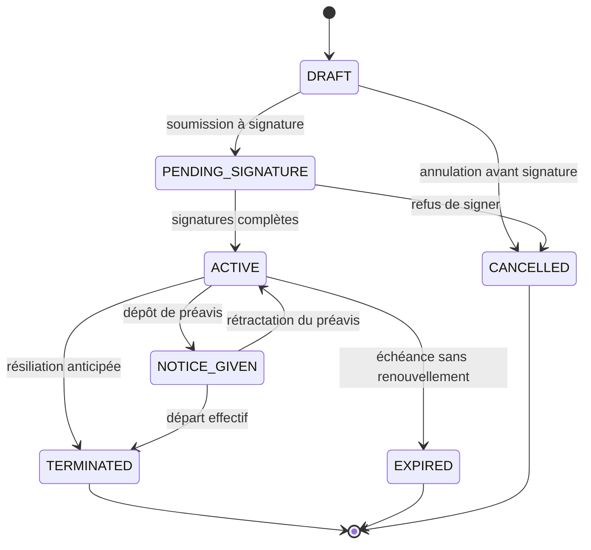
```mermaid
stateDiagram-v2
    [*] --> DRAFT
    DRAFT --> PENDING_SIGNATURE : soumission à signature
    DRAFT --> CANCELLED : annulation avant signature
    PENDING_SIGNATURE --> ACTIVE : signatures complètes
    PENDING_SIGNATURE --> CANCELLED : refus de signer
    ACTIVE --> NOTICE_GIVEN : dépôt de préavis
    ACTIVE --> TERMINATED : résiliation anticipée
    ACTIVE --> EXPIRED : échéance sans renouvellement
    NOTICE_GIVEN --> ACTIVE : rétractation du préavis
    NOTICE_GIVEN --> TERMINATED : départ effectif
    TERMINATED --> [*]
    EXPIRED --> [*]
    CANCELLED --> [*]
```

| De                  | Vers                | Condition                                                | Déclenché par                    |
| ------------------- | ------------------- | -------------------------------------------------------- | -------------------------------- |
| `DRAFT`             | `PENDING_SIGNATURE` | Bail rédigé, prêt à signer                               | MANAGER / OWNER                  |
| `DRAFT`             | `CANCELLED`         | Abandon avant toute signature                            | MANAGER / OWNER                  |
| `PENDING_SIGNATURE` | `ACTIVE`            | Toutes les parties (`lease_parties.signed_at`) ont signé | système, à la dernière signature |
| `PENDING_SIGNATURE` | `CANCELLED`         | Une partie refuse de signer                              | MANAGER / OWNER                  |
| `ACTIVE`            | `NOTICE_GIVEN`      | Préavis de départ déposé                                 | TENANT (portail) ou MANAGER      |
| `ACTIVE`            | `TERMINATED`        | Résiliation anticipée (manquement, accord amiable)       | MANAGER / OWNER                  |
| `ACTIVE`            | `EXPIRED`           | `end_date` atteinte, `auto_renew = false`                | système (job planifié)           |
| `NOTICE_GIVEN`      | `ACTIVE`            | Rétractation du préavis avant son terme                  | TENANT ou MANAGER                |
| `NOTICE_GIVEN`      | `TERMINATED`        | Sortie effective, état des lieux de sortie réalisé       | MANAGER                          |

`TERMINATED`, `EXPIRED`, `CANCELLED` sont des états terminaux : un nouveau besoin locatif sur le même lot ouvre un nouveau bail.

#### Mandats de gestion (`management_mandates.status`)

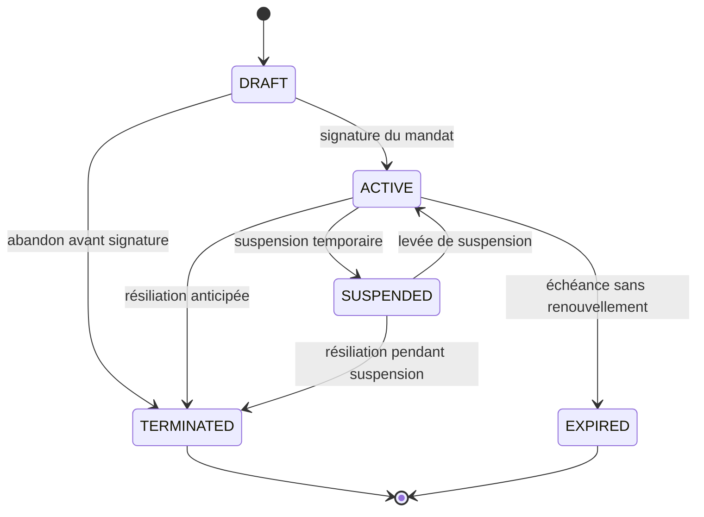
```mermaid
stateDiagram-v2
    [*] --> DRAFT
    DRAFT --> ACTIVE : signature du mandat
    DRAFT --> TERMINATED : abandon avant signature
    ACTIVE --> SUSPENDED : suspension temporaire
    SUSPENDED --> ACTIVE : levée de suspension
    ACTIVE --> TERMINATED : résiliation anticipée
    SUSPENDED --> TERMINATED : résiliation pendant suspension
    ACTIVE --> EXPIRED : échéance sans renouvellement
    TERMINATED --> [*]
    EXPIRED --> [*]
```

| De          | Vers         | Condition                                         | Déclenché par              |
| ----------- | ------------ | ------------------------------------------------- | -------------------------- |
| `DRAFT`     | `ACTIVE`     | Signature du mandat par le bailleur               | OWNER (bailleur)           |
| `DRAFT`     | `TERMINATED` | Abandon du projet de mandat                       | MANAGER / OWNER            |
| `ACTIVE`    | `SUSPENDED`  | Suspension temporaire (litige, audit)             | OWNER (agence)             |
| `SUSPENDED` | `ACTIVE`     | Levée de la suspension                            | OWNER (agence)             |
| `ACTIVE`    | `TERMINATED` | Résiliation anticipée par l'agence ou le bailleur | MANAGER / OWNER / bailleur |
| `SUSPENDED` | `TERMINATED` | Résiliation confirmée pendant la suspension       | MANAGER / OWNER            |
| `ACTIVE`    | `EXPIRED`    | `end_date` atteinte, `auto_renew = false`         | système (job planifié)     |

`TERMINATED` et `EXPIRED` sont terminaux : les baux déjà rattachés (`leases.mandate_id`) subsistent, seul le lien de gestion futur est rompu.

#### États des lieux (`inspections.status`)

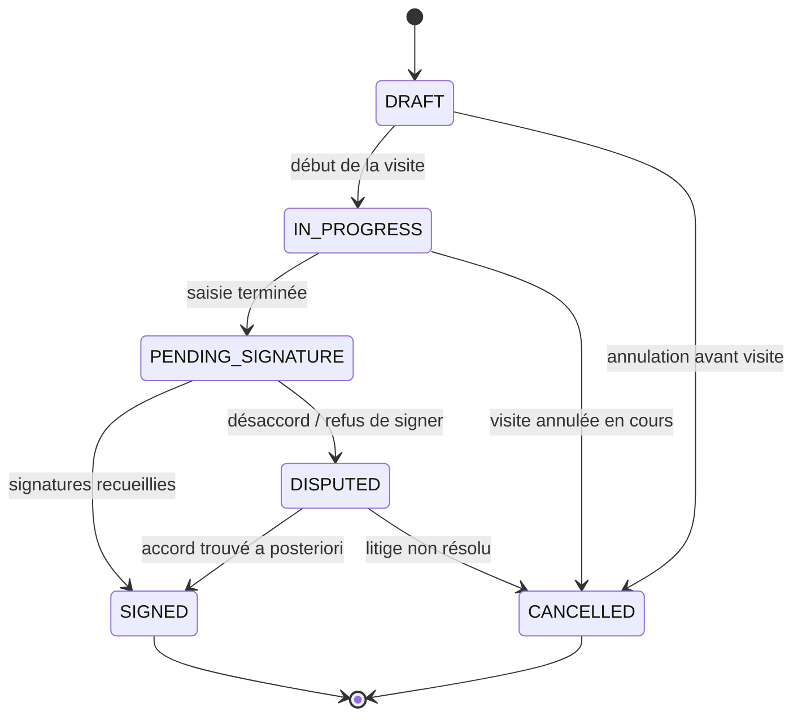
```mermaid
stateDiagram-v2
    [*] --> DRAFT
    DRAFT --> IN_PROGRESS : début de la visite
    DRAFT --> CANCELLED : annulation avant visite
    IN_PROGRESS --> PENDING_SIGNATURE : saisie terminée
    IN_PROGRESS --> CANCELLED : visite annulée en cours
    PENDING_SIGNATURE --> SIGNED : signatures recueillies
    PENDING_SIGNATURE --> DISPUTED : désaccord / refus de signer
    DISPUTED --> SIGNED : accord trouvé a posteriori
    DISPUTED --> CANCELLED : litige non résolu
    SIGNED --> [*]
    CANCELLED --> [*]
```

| De                  | Vers                | Condition                                                           | Déclenché par              |
| ------------------- | ------------------- | ------------------------------------------------------------------- | -------------------------- |
| `DRAFT`             | `IN_PROGRESS`       | Le constat débute sur site                                          | COLLECTOR / MANAGER        |
| `DRAFT`             | `CANCELLED`         | Visite annulée avant réalisation                                    | MANAGER                    |
| `IN_PROGRESS`       | `PENDING_SIGNATURE` | Toutes les lignes (`inspection_items`) et photos saisies            | COLLECTOR / MANAGER        |
| `IN_PROGRESS`       | `CANCELLED`         | Visite interrompue                                                  | MANAGER                    |
| `PENDING_SIGNATURE` | `SIGNED`            | Locataire (`tenant_signed_at`) et agent (`agent_signed_at`) signent | TENANT + COLLECTOR/MANAGER |
| `PENDING_SIGNATURE` | `DISPUTED`          | Le locataire conteste ou refuse de signer                           | TENANT                     |
| `DISPUTED`          | `SIGNED`            | Contradictoire organisé, accord trouvé (`dispute_reason` clos)      | MANAGER                    |
| `DISPUTED`          | `CANCELLED`         | Litige non résolu, constat abandonné                                | MANAGER                    |

`SIGNED` est l'état définitif servant de base légale aux retenues sur caution (`deposit_movements.inspection_id`) ; `CANCELLED` ne produit aucun effet sur le dépôt de garantie.

#### Dépôts de garantie (`deposits.status`)

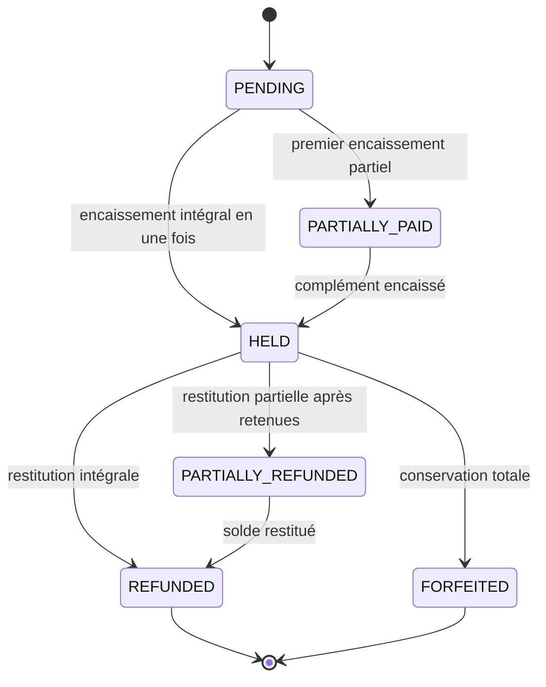
```mermaid
stateDiagram-v2
    [*] --> PENDING
    PENDING --> PARTIALLY_PAID : premier encaissement partiel
    PENDING --> HELD : encaissement intégral en une fois
    PARTIALLY_PAID --> HELD : complément encaissé
    HELD --> PARTIALLY_REFUNDED : restitution partielle après retenues
    HELD --> REFUNDED : restitution intégrale
    HELD --> FORFEITED : conservation totale
    PARTIALLY_REFUNDED --> REFUNDED : solde restitué
    REFUNDED --> [*]
    FORFEITED --> [*]
```

| De                   | Vers                 | Condition                                                                                    | Déclenché par                                     |
| -------------------- | -------------------- | -------------------------------------------------------------------------------------------- | ------------------------------------------------- |
| `PENDING`            | `PARTIALLY_PAID`     | Premier `deposit_movement` de type `COLLECTION`, `collected_amount < required_amount`        | système, à l'allocation d'un paiement             |
| `PENDING`            | `HELD`               | Encaissement intégral en un seul mouvement                                                   | système                                           |
| `PARTIALLY_PAID`     | `HELD`               | `collected_amount` atteint `required_amount`                                                 | système                                           |
| `HELD`               | `PARTIALLY_REFUNDED` | Restitution partielle après retenues (`DEDUCTION` puis `REFUND` partiel) à la sortie         | MANAGER, sur la base d'un état des lieux `SIGNED` |
| `HELD`               | `REFUNDED`           | Restitution intégrale, aucune retenue                                                        | MANAGER                                           |
| `HELD`               | `FORFEITED`          | Conservation totale (départ sans préavis, dégradations couvrant l'intégralité de la caution) | MANAGER / OWNER                                   |
| `PARTIALLY_REFUNDED` | `REFUNDED`           | Solde restant finalement restitué                                                            | MANAGER                                           |

`REFUNDED` et `FORFEITED` sont terminaux ; chaque mouvement de restitution ou de retenue est une ligne `deposit_movements` distincte, jamais une modification rétroactive d'un mouvement antérieur (voir 1.5).

## 7. Facturation et encaissement

Ce domaine porte la séparation stricte **facture / paiement** décidée dans les principes communs : une facture (`rent_invoices`) constate une dette, un paiement (`payments`) constate un encaissement, et une table pivot (`payment_allocations`) relie les deux, potentiellement en plusieurs fois et sur plusieurs factures. Chaque canal d'encaissement (espèces, Mobile Money, virement, chèque) alimente sa propre table de preuve, mais converge toujours vers `payments`. Les tables `payments`, `receipts` et `cash_receipts` sont protégées par le trigger `guard_financial_row` (DELETE interdit, colonnes financières verrouillées après écriture) ; `payment_allocations` est strictement append-only.

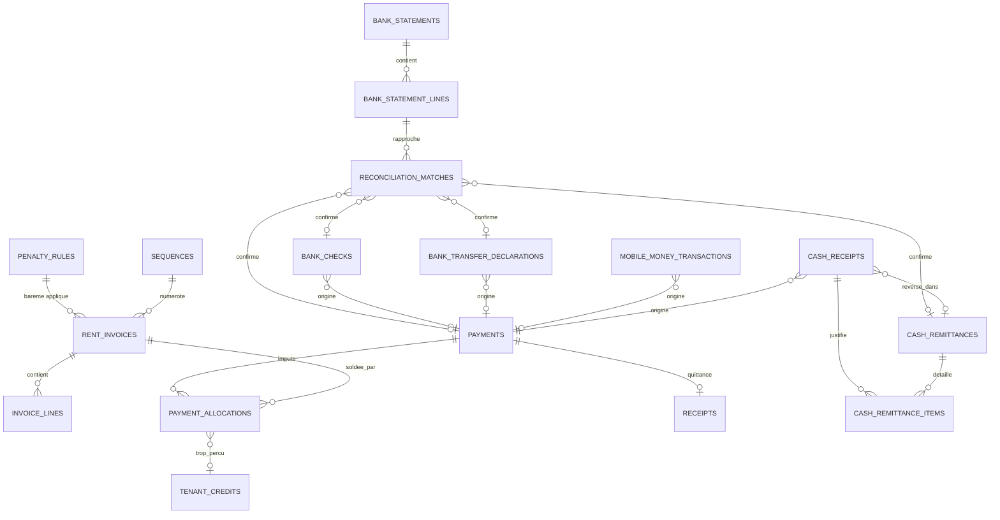
```mermaid
erDiagram
    SEQUENCES ||--o{ RENT_INVOICES : numerote
    PENALTY_RULES ||--o{ RENT_INVOICES : "bareme applique"
    RENT_INVOICES ||--o{ INVOICE_LINES : contient
    RENT_INVOICES ||--o{ PAYMENT_ALLOCATIONS : soldee_par
    PAYMENTS ||--o{ PAYMENT_ALLOCATIONS : impute
    PAYMENT_ALLOCATIONS }o--o| TENANT_CREDITS : trop_percu
    PAYMENTS ||--o| RECEIPTS : quittance
    CASH_RECEIPTS }o--|| PAYMENTS : origine
    CASH_RECEIPTS }o--o| CASH_REMITTANCES : reverse_dans
    CASH_REMITTANCES ||--o{ CASH_REMITTANCE_ITEMS : detaille
    CASH_REMITTANCE_ITEMS }o--|| CASH_RECEIPTS : justifie
    MOBILE_MONEY_TRANSACTIONS }o--o| PAYMENTS : origine
    BANK_TRANSFER_DECLARATIONS }o--o| PAYMENTS : origine
    BANK_CHECKS }o--o| PAYMENTS : origine
    BANK_STATEMENTS ||--o{ BANK_STATEMENT_LINES : contient
    BANK_STATEMENT_LINES ||--o{ RECONCILIATION_MATCHES : rapproche
    RECONCILIATION_MATCHES }o--o| PAYMENTS : confirme
    RECONCILIATION_MATCHES }o--o| BANK_TRANSFER_DECLARATIONS : confirme
    RECONCILIATION_MATCHES }o--o| BANK_CHECKS : confirme
    RECONCILIATION_MATCHES }o--o| CASH_REMITTANCES : confirme
```

### 7.1 `sequences`

Compteur atomique de numérotation, une ligne par `(organization_id, kind, period)`. Alimente `next_sequence()` (§12) qui incrémente `last_value` via `INSERT ... ON CONFLICT DO UPDATE RETURNING`, garantissant l'absence de trou ou de doublon sous concurrence.

| Colonne         | Type        | Nullable | Défaut              | Description                                                                                                                  |
| :-------------- | :---------- | :------- | :------------------ | :--------------------------------------------------------------------------------------------------------------------------- |
| id              | UUID        | non      | `gen_random_uuid()` | Identifiant technique                                                                                                        |
| organization_id | UUID        | non      | —                   | Organisation propriétaire                                                                                                    |
| kind            | TEXT        | non      | —                   | Nature du document (CASH_RECEIPT, RENT_INVOICE, RECEIPT, OWNER_STATEMENT, REMITTANCE, EXPENSE, PAYOUT, SUBSCRIPTION_INVOICE) |
| period          | TEXT        | non      | `''`                | Période de remise à zéro (YYYYMM) ou chaîne vide si continue                                                                 |
| last_value      | BIGINT      | non      | 0                   | Dernière valeur attribuée                                                                                                    |
| prefix          | TEXT        | oui      | —                   | Préfixe imprimé (LOY, QUI, CASH...)                                                                                          |
| padding         | SMALLINT    | non      | 5                   | Longueur du numéro complété par des zéros                                                                                    |
| created_at      | TIMESTAMPTZ | non      | `now()`             | Création                                                                                                                     |
| updated_at      | TIMESTAMPTZ | non      | `now()`             | Dernière incrémentation                                                                                                      |

**Clés étrangères** : `organization_id` → `organizations(id)` ON DELETE CASCADE.
**Contraintes** : `sequences_uk` UNIQUE `(organization_id, kind, period)` — une seule ligne de compteur par triplet, socle de l'atomicité.
**Index** : la contrainte d'unicité sert directement le pattern d'accès `UPSERT` de `next_sequence()`, aucun index supplémentaire n'est nécessaire.
**Règles métier** : jamais de lecture-puis-écriture côté application ; toute numérotation passe par `next_sequence()` en transaction, qui verrouille implicitement la ligne via l'`UPSERT`.

### 7.2 `penalty_rules`

Barème de pénalités de retard applicable aux baux, en taux (points de base) ou montant forfaitaire, avec franchise et plafond.

| Colonne                 | Type          | Nullable | Défaut              | Description                                                            |
| :---------------------- | :------------ | :------- | :------------------ | :--------------------------------------------------------------------- |
| id                      | UUID          | non      | `gen_random_uuid()` | Identifiant technique                                                  |
| organization_id         | UUID          | non      | —                   | Organisation propriétaire                                              |
| name                    | TEXT          | non      | —                   | Nom du barème                                                          |
| basis                   | penalty_basis | non      | RATE_BPS_PER_MONTH  | RATE_BPS_PER_DAY, RATE_BPS_PER_MONTH, FLAT_AMOUNT, FLAT_AMOUNT_PER_DAY |
| rate_bps                | INTEGER       | oui      | —                   | Taux en points de base (500 = 5 %)                                     |
| flat_amount             | BIGINT        | oui      | —                   | Pénalité forfaitaire en XAF                                            |
| currency                | CHAR(3)       | non      | 'XAF'               | Devise                                                                 |
| grace_days              | SMALLINT      | non      | 5                   | Franchise en jours avant application                                   |
| cap_amount              | BIGINT        | oui      | —                   | Plafond absolu en XAF                                                  |
| cap_rate_bps            | INTEGER       | oui      | —                   | Plafond exprimé en points de base du principal impayé                  |
| max_periods             | SMALLINT      | oui      | —                   | Nombre maximal de périodes pénalisables                                |
| applies_to_charges      | BOOLEAN       | non      | false               | Étend la pénalité aux charges, pas seulement au loyer                  |
| is_active               | BOOLEAN       | non      | true                | Barème utilisable                                                      |
| is_default              | BOOLEAN       | non      | false               | Barème appliqué par défaut de l'organisation                           |
| created_at / updated_at | TIMESTAMPTZ   | non      | `now()`             | Horodatage                                                             |

**Clés étrangères** : `organization_id` → `organizations(id)` ON DELETE CASCADE ; référencé par `leases.penalty_rule_id`, `organization_settings.default_penalty_rule_id`, `rent_invoices.penalty_rule_id`, `invoice_lines.penalty_rule_id`, `dunning_rules.penalty_rule_id` (toutes en `ON DELETE SET NULL`).
**Contraintes** : `penalty_rules_name_uk` UNIQUE `(organization_id, name)` ; `penalty_rules_value_chk` CHECK `rate_bps IS NOT NULL OR flat_amount IS NOT NULL` — un barème doit porter au moins un mode de calcul.
**Index** : `penalty_rules_default_uk` UNIQUE partiel `(organization_id) WHERE is_default AND is_active` — garantit un seul barème par défaut actif, sert la résolution automatique du barème d'un bail qui n'en précise pas.
**Règles métier** : le calcul effectif de la pénalité est produit par le job de relance (`dunning_runs`, §9) qui matérialise le résultat en `invoice_lines` de type `PENALTY` ; `penalty_rules` ne contient que le barème, jamais un montant calculé.

### 7.3 `rent_invoices`

Facture de loyer d'un bail pour une période, générée par le cron mensuel J‑N jours avant échéance. Une seule facture par `(lease_id, period_start)`.

| Colonne                            | Type           | Nullable | Défaut              | Description                                                  |
| :--------------------------------- | :------------- | :------- | :------------------ | :----------------------------------------------------------- |
| id                                 | UUID           | non      | `gen_random_uuid()` | Identifiant technique                                        |
| organization_id                    | UUID           | non      | —                   | Organisation propriétaire                                    |
| lease_id                           | UUID           | non      | —                   | Bail facturé                                                 |
| tenant_id                          | UUID           | non      | —                   | Locataire débiteur                                           |
| unit_id                            | UUID           | non      | —                   | Lot loué                                                     |
| property_id                        | UUID           | non      | —                   | Bien porteur du lot                                          |
| landlord_id                        | UUID           | non      | —                   | Bailleur bénéficiaire                                        |
| invoice_number                     | TEXT           | non      | —                   | Numéro `LOY-{YYYYMM}-{seq}`                                  |
| status                             | invoice_status | non      | DRAFT               | DRAFT, ISSUED, PARTIALLY_PAID, PAID, OVERDUE, CANCELLED      |
| period_start / period_end          | DATE           | non      | —                   | Période facturée                                             |
| issue_date                         | DATE           | non      | `CURRENT_DATE`      | Date d'émission                                              |
| due_date                           | DATE           | non      | —                   | Échéance                                                     |
| grace_until_date                   | DATE           | oui      | —                   | `due_date` + `grace_days` du bail ; au-delà, bascule OVERDUE |
| rent_amount                        | BIGINT         | non      | 0                   | Loyer en XAF                                                 |
| charges_amount                     | BIGINT         | non      | 0                   | Charges (eau, électricité, services)                         |
| penalty_amount                     | BIGINT         | non      | 0                   | Pénalités cumulées                                           |
| other_amount                       | BIGINT         | non      | 0                   | Autres lignes                                                |
| discount_amount                    | BIGINT         | non      | 0                   | Remises                                                      |
| total_amount                       | BIGINT         | non      | 0                   | Total dû en XAF                                              |
| paid_amount                        | BIGINT         | non      | 0                   | Cumul réglé                                                  |
| balance_amount                     | BIGINT         | non      | 0                   | Reste dû = total − payé                                      |
| currency                           | CHAR(3)        | non      | 'XAF'               | Devise                                                       |
| penalty_rule_id                    | UUID           | oui      | —                   | Barème appliqué                                              |
| last_penalty_run_date              | DATE           | oui      | —                   | Dernière exécution du calcul de pénalités                    |
| issued_at / paid_at / cancelled_at | TIMESTAMPTZ    | oui      | —                   | Horodatages de transition                                    |
| cancellation_reason                | TEXT           | oui      | —                   | Motif d'annulation                                           |
| document_id                        | UUID           | oui      | —                   | PDF de la facture                                            |
| generated_by_job                   | TEXT           | oui      | —                   | Identifiant du job cron générateur                           |
| client_ref                         | TEXT           | oui      | —                   | Idempotence mobile                                           |
| notes                              | TEXT           | oui      | —                   | Remarques libres                                             |
| created_at / updated_at            | TIMESTAMPTZ    | non      | `now()`             | Horodatage                                                   |

**Clés étrangères** : `organization_id` → `organizations(id)` CASCADE ; `lease_id` → `leases(id)` RESTRICT ; `tenant_id` → `tenants(id)` RESTRICT ; `unit_id` → `units(id)` RESTRICT ; `property_id` → `properties(id)` RESTRICT ; `landlord_id` → `landlords(id)` RESTRICT ; `penalty_rule_id` → `penalty_rules(id)` SET NULL ; `document_id` → `documents(id)` SET NULL (FK différée, partie 11a).
**Contraintes** : `rent_invoices_number_uk` UNIQUE `(organization_id, invoice_number)` ; `rent_invoices_period_uk` UNIQUE `(lease_id, period_start)` — empêche la double facturation d'une même période ; `rent_invoices_client_ref_uk` UNIQUE `(organization_id, client_ref)` ; `rent_invoices_period_chk` CHECK `period_start < period_end` ; `rent_invoices_paid_chk` CHECK `paid_amount <= total_amount`. Toutes les colonnes de montant portent en outre un `CHECK (>= 0)`.
**Index** : `rent_invoices_org_status_idx (organization_id, status, due_date)` sert le tableau de bord par statut ; `rent_invoices_lease_period_idx (organization_id, lease_id, period_start DESC)` sert l'historique d'un bail ; `rent_invoices_overdue_idx` partiel `WHERE status IN ('ISSUED','PARTIALLY_PAID','OVERDUE') AND balance_amount > 0` sert directement la vue `v_unpaid_invoices` et les relances ; `rent_invoices_tenant_open_idx` partiel sert le solde locataire (`v_tenant_balances`).
**Règles métier** : `balance_amount` est recalculé à chaque affectation de paiement (`payment_allocations`), jamais saisi manuellement. Le passage en `OVERDUE` est automatique (job quotidien) dès `CURRENT_DATE > grace_until_date` et `balance_amount > 0`. Une facture `CANCELLED` ne peut plus recevoir d'affectation ; un trop-perçu résiduel bascule en `tenant_credits`. La numérotation `invoice_number` provient de `next_sequence(organization_id, 'RENT_INVOICE', to_char(issue_date,'YYYYMM'))`.

### 7.4 `invoice_lines`

Détail d'une facture : loyer, charges eau/électricité, pénalités, refacturations de dépenses, remises. Le montant est toujours positif ; le sens (charge/avoir) est porté par `is_credit`.

| Colonne                   | Type              | Nullable | Défaut              | Description                                                                                                          |
| :------------------------ | :---------------- | :------- | :------------------ | :------------------------------------------------------------------------------------------------------------------- |
| id                        | UUID              | non      | `gen_random_uuid()` | Identifiant technique                                                                                                |
| organization_id           | UUID              | non      | —                   | Organisation propriétaire                                                                                            |
| invoice_id                | UUID              | non      | —                   | Facture parente                                                                                                      |
| line_type                 | invoice_line_type | non      | —                   | RENT, WATER_CHARGE, ELECTRICITY_CHARGE, SERVICE_CHARGE, PENALTY, DEPOSIT, AGENCY_FEE, REPAIR_REBILL, DISCOUNT, OTHER |
| label                     | TEXT              | non      | —                   | Libellé affiché                                                                                                      |
| description               | TEXT              | oui      | —                   | Détail complémentaire                                                                                                |
| quantity                  | NUMERIC(12,3)     | non      | 1                   | Quantité                                                                                                             |
| unit_price_amount         | BIGINT            | non      | 0                   | Prix unitaire en XAF                                                                                                 |
| amount                    | BIGINT            | non      | 0                   | Montant HT de la ligne, toujours positif                                                                             |
| vat_rate_bps              | INTEGER           | non      | 0                   | Taux de TVA en points de base                                                                                        |
| vat_amount                | BIGINT            | non      | 0                   | TVA correspondante                                                                                                   |
| currency                  | CHAR(3)           | non      | 'XAF'               | Devise                                                                                                               |
| is_credit                 | BOOLEAN           | non      | false               | true = ligne en diminution du total                                                                                  |
| meter_reading_id          | UUID              | oui      | —                   | Relevé de compteur source (charges refacturées)                                                                      |
| expense_id                | UUID              | oui      | —                   | Dépense refacturée au locataire                                                                                      |
| penalty_rule_id           | UUID              | oui      | —                   | Barème à l'origine d'une ligne PENALTY                                                                               |
| period_start / period_end | DATE              | oui      | —                   | Sous-période couverte par la ligne                                                                                   |
| position                  | SMALLINT          | non      | 0                   | Ordre d'affichage                                                                                                    |
| created_at / updated_at   | TIMESTAMPTZ       | non      | `now()`             | Horodatage                                                                                                           |

**Clés étrangères** : `organization_id` → `organizations(id)` CASCADE ; `invoice_id` → `rent_invoices(id)` CASCADE ; `meter_reading_id` → `meter_readings(id)` SET NULL ; `expense_id` → `expenses(id)` SET NULL (FK différée, partie 09a) ; `penalty_rule_id` → `penalty_rules(id)` SET NULL. Référencée en retour par `meter_readings.invoice_line_id` (FK différée) et `expenses.rebilled_invoice_line_id`.
**Contraintes** : `invoice_lines_period_chk` CHECK `period_start IS NULL OR period_end IS NULL OR period_start < period_end` ; CHECK `>= 0` sur `quantity`, `unit_price_amount`, `amount`, `vat_amount` ; `vat_rate_bps BETWEEN 0 AND 10000`.
**Index** : `invoice_lines_invoice_idx (organization_id, invoice_id, position)` sert la reconstitution ordonnée d'une facture ; `invoice_lines_type_idx (organization_id, line_type)` sert les agrégats par nature (ex. total des pénalités facturées).
**Règles métier** : la somme des lignes non-crédit moins les lignes crédit doit égaler `rent_invoices.total_amount` (contrôlée applicativement à l'émission, pas par contrainte SQL inter-tables). Une ligne `PENALTY` est toujours produite par `dunning_runs`, jamais saisie manuellement hors dérogation d'un OWNER (tracée en `audit_logs`).

### 7.5 `tenant_credits`

Avoir locataire issu d'un trop-perçu, d'une annulation de facture ou d'un geste commercial, imputable sur les factures suivantes.

| Colonne                 | Type          | Nullable | Défaut              | Description                                                               |
| :---------------------- | :------------ | :------- | :------------------ | :------------------------------------------------------------------------ |
| id                      | UUID          | non      | `gen_random_uuid()` | Identifiant technique                                                     |
| organization_id         | UUID          | non      | —                   | Organisation propriétaire                                                 |
| tenant_id               | UUID          | non      | —                   | Locataire bénéficiaire                                                    |
| lease_id                | UUID          | oui      | —                   | Bail d'origine, le cas échéant                                            |
| status                  | credit_status | non      | OPEN                | OPEN, PARTIALLY_USED, USED, REFUNDED, EXPIRED                             |
| origin                  | TEXT          | non      | 'OVERPAYMENT'       | OVERPAYMENT, INVOICE_CANCELLATION, DEPOSIT_TRANSFER, GOODWILL, ADJUSTMENT |
| amount                  | BIGINT        | non      | —                   | Montant total de l'avoir                                                  |
| used_amount             | BIGINT        | non      | 0                   | Montant déjà imputé                                                       |
| remaining_amount        | BIGINT        | non      | 0                   | Solde disponible = amount − used_amount                                   |
| currency                | CHAR(3)       | non      | 'XAF'               | Devise                                                                    |
| source_payment_id       | UUID          | oui      | —                   | Paiement à l'origine du trop-perçu                                        |
| source_invoice_id       | UUID          | oui      | —                   | Facture annulée à l'origine de l'avoir                                    |
| expires_at              | DATE          | oui      | —                   | Date d'expiration                                                         |
| refunded_at             | TIMESTAMPTZ   | oui      | —                   | Date de remboursement au locataire                                        |
| reason                  | TEXT          | oui      | —                   | Motif libre                                                               |
| created_at / updated_at | TIMESTAMPTZ   | non      | `now()`             | Horodatage                                                                |

**Clés étrangères** : `organization_id` → `organizations(id)` CASCADE ; `tenant_id` → `tenants(id)` RESTRICT ; `lease_id` → `leases(id)` SET NULL ; `source_invoice_id` → `rent_invoices(id)` SET NULL ; `source_payment_id` → `payments(id)` SET NULL (FK différée, partie 06a). Référencée par `payment_allocations.tenant_credit_id`.
**Contraintes** : `tenant_credits_used_chk` CHECK `used_amount <= amount` ; CHECK `>= 0` sur `amount`, `used_amount`, `remaining_amount`.
**Index** : `tenant_credits_open_idx` partiel `(organization_id, tenant_id) WHERE status IN ('OPEN','PARTIALLY_USED')` — sert la recherche du crédit disponible d'un locataire au moment de l'affectation d'un nouveau paiement, opération exécutée à chaque encaissement.
**Règles métier** : `remaining_amount` est recalculé par le service d'affectation à chaque `payment_allocation` vers `tenant_credit_id` (imputation d'un ancien trop-perçu) ou depuis `tenant_credit_id` (usage). Un avoir n'est jamais supprimé ; épuisé, il passe `USED`.

### 7.6 `payments`

Règlement encaissé ou décaissé, tous canaux confondus. **APPEND-ONLY** : protégée par `guard_financial_row`, DELETE interdit, colonnes financières verrouillées après écriture ; seule une contre-passation (`reversal_of_id`) corrige un montant.

| Colonne                                        | Type              | Nullable | Défaut              | Description                                                             |
| :--------------------------------------------- | :---------------- | :------- | :------------------ | :---------------------------------------------------------------------- |
| id                                             | UUID              | non      | `gen_random_uuid()` | Identifiant technique                                                   |
| organization_id                                | UUID              | non      | —                   | Organisation propriétaire                                               |
| tenant_id                                      | UUID              | oui      | —                   | Locataire payeur                                                        |
| lease_id                                       | UUID              | oui      | —                   | Bail concerné                                                           |
| landlord_id                                    | UUID              | oui      | —                   | Bailleur bénéficiaire (paiement sortant)                                |
| direction                                      | payment_direction | non      | INBOUND             | INBOUND / OUTBOUND                                                      |
| method                                         | payment_method    | non      | —                   | CASH, MOBILE_MONEY, BANK_TRANSFER, BANK_CHECK                           |
| status                                         | payment_status    | non      | PENDING             | PENDING, PENDING_VERIFICATION, CONFIRMED, REJECTED, CANCELLED, REVERSED |
| reference                                      | TEXT              | non      | —                   | Référence interne unique, imprimée sur la quittance                     |
| external_reference                             | TEXT              | oui      | —                   | Référence opérateur (transaction Mobile Money, virement, chèque)        |
| amount                                         | BIGINT            | non      | —                   | Montant brut en XAF                                                     |
| fee_amount                                     | BIGINT            | non      | 0                   | Frais du canal                                                          |
| fee_bearer                                     | fee_bearer        | non      | TENANT              | TENANT, ORGANIZATION, LANDLORD, SHARED                                  |
| net_amount                                     | BIGINT            | non      | 0                   | Montant net après frais                                                 |
| allocated_amount                               | BIGINT            | non      | 0                   | Part déjà imputée à une facture                                         |
| unallocated_amount                             | BIGINT            | non      | 0                   | Part non imputée, source d'un `tenant_credit`                           |
| currency                                       | CHAR(3)           | non      | 'XAF'               | Devise                                                                  |
| payment_date                                   | DATE              | non      | `CURRENT_DATE`      | Date du règlement                                                       |
| value_date                                     | DATE              | oui      | —                   | Date de valeur bancaire                                                 |
| received_by_user_id                            | UUID              | oui      | —                   | Agent ayant encaissé (démarcheur)                                       |
| bank_account_id                                | UUID              | oui      | —                   | Compte crédité                                                          |
| collection_latitude / longitude                | NUMERIC(9,6)      | oui      | —                   | Position GPS de l'encaissement terrain                                  |
| confirmed_at / confirmed_by_user_id            | —                 | oui      | —                   | Confirmation                                                            |
| rejected_at / rejection_reason                 | —                 | oui      | —                   | Rejet                                                                   |
| reversed_at / reversal_of_id / reversal_reason | —                 | oui      | —                   | Contre-passation                                                        |
| idempotency_key                                | TEXT              | oui      | —                   | Clé d'idempotence API                                                   |
| client_ref                                     | TEXT              | oui      | —                   | ULID d'idempotence mobile hors ligne                                    |
| sync_batch_id                                  | UUID              | oui      | —                   | Lot de synchronisation d'origine                                        |
| notes                                          | TEXT              | oui      | —                   | Remarques                                                               |
| created_at / updated_at                        | TIMESTAMPTZ       | non      | `now()`             | Horodatage                                                              |

**Clés étrangères** : `organization_id` → `organizations(id)` CASCADE ; `tenant_id` → `tenants(id)` RESTRICT ; `lease_id` → `leases(id)` RESTRICT ; `landlord_id` → `landlords(id)` RESTRICT ; `received_by_user_id`, `confirmed_by_user_id` → `users(id)` SET NULL ; `bank_account_id` → `bank_accounts(id)` SET NULL ; `reversal_of_id` → `payments(id)` RESTRICT ; `sync_batch_id` → `sync_batches(id)` SET NULL (FK différée, partie 11b).
**Contraintes** : `payments_reference_uk` UNIQUE `(organization_id, reference)` ; `payments_client_ref_uk` UNIQUE `(organization_id, client_ref)` ; `payments_allocated_chk` CHECK `allocated_amount <= amount` ; CHECK `>= 0` sur tous les montants.
**Index** : `payments_org_date_idx` et `payments_lease_idx`/`payments_tenant_idx` servent les historiques ; `payments_reference_lookup_idx` sert la recherche d'un règlement par référence (support client) ; `payments_external_ref_idx` partiel sert le rapprochement Mobile Money/virement ; `payments_pending_idx` partiel `WHERE status IN ('PENDING','PENDING_VERIFICATION')` sert les jobs de rattrapage ; `payments_unallocated_idx` partiel sert la détection des trop-perçus à clôturer ; `payments_collector_idx` partiel `WHERE method='CASH'` sert le suivi des tournées.
**Règles métier** : un paiement `CONFIRMED` ne devient jamais `REJECTED` ; toute erreur post-confirmation se corrige par un nouveau paiement `reversal_of_id` pointant vers l'original, ce dernier passant `REVERSED`. `unallocated_amount = amount − allocated_amount` ; un solde non nul et un paiement `CONFIRMED` déclenchent la création d'un `tenant_credit`.

### 7.7 `payment_allocations`

Imputation d'un paiement sur une facture, une caution ou un avoir. **APPEND-ONLY strict** (trigger `forbid_update_delete`, §12) : ni UPDATE ni DELETE ; une désaffectation est une écriture inverse marquée `is_reversal`.

| Colonne                 | Type        | Nullable | Défaut              | Description                                                                       |
| :---------------------- | :---------- | :------- | :------------------ | :-------------------------------------------------------------------------------- |
| id                      | UUID        | non      | `gen_random_uuid()` | Identifiant technique                                                             |
| organization_id         | UUID        | non      | —                   | Organisation propriétaire                                                         |
| payment_id              | UUID        | non      | —                   | Paiement imputé                                                                   |
| invoice_id              | UUID        | oui      | —                   | Facture ciblée (exclusif avec les deux suivants)                                  |
| invoice_line_id         | UUID        | oui      | —                   | Ligne de facture ciblée, le cas échéant                                           |
| deposit_id              | UUID        | oui      | —                   | Caution ciblée                                                                    |
| tenant_credit_id        | UUID        | oui      | —                   | Avoir ciblé (constitution ou usage)                                               |
| amount                  | BIGINT      | non      | —                   | Montant imputé en XAF                                                             |
| currency                | CHAR(3)     | non      | 'XAF'               | Devise                                                                            |
| allocation_date         | DATE        | non      | `CURRENT_DATE`      | Date d'imputation                                                                 |
| allocation_order        | SMALLINT    | non      | 0                   | Ordre d'apurement (pénalités, charges, puis loyer, du plus ancien au plus récent) |
| is_reversal             | BOOLEAN     | non      | false               | true = écriture de contre-passation                                               |
| reversal_of_id          | UUID        | oui      | —                   | Affectation annulée                                                               |
| created_by_user_id      | UUID        | oui      | —                   | Auteur                                                                            |
| created_at / updated_at | TIMESTAMPTZ | non      | `now()`             | Horodatage                                                                        |

**Clés étrangères** : `organization_id` → `organizations(id)` CASCADE ; `payment_id` → `payments(id)` RESTRICT ; `invoice_id` → `rent_invoices(id)` RESTRICT ; `invoice_line_id` → `invoice_lines(id)` SET NULL ; `deposit_id` → `deposits(id)` RESTRICT ; `tenant_credit_id` → `tenant_credits(id)` RESTRICT ; `reversal_of_id` → `payment_allocations(id)` RESTRICT ; `created_by_user_id` → `users(id)` SET NULL.
**Contraintes** : `payment_allocations_target_chk` CHECK `num_nonnulls(invoice_id, deposit_id, tenant_credit_id) = 1` — une affectation cible exactement une cible ; CHECK `amount >= 0`.
**Index** : `payment_allocations_payment_idx (organization_id, payment_id)` reconstitue la ventilation d'un paiement ; `payment_allocations_invoice_idx (organization_id, invoice_id)` reconstitue l'historique de règlement d'une facture — les deux accès les plus fréquents de l'écran de détail.
**Règles métier** : la somme des `amount` non-reversal moins les `amount` reversal pour un `payment_id` donné ne peut excéder `payments.amount` (contrôlé applicativement en transaction). L'`allocation_order` matérialise l'ordre légal d'apurement congolais (pénalités puis charges puis loyer, périodes les plus anciennes en premier).

### 7.8 `cash_remittances`

Reversement de l'encaisse d'un démarcheur vers l'agence ou le bailleur, avec comptage contradictoire.

| Colonne                                               | Type              | Nullable | Défaut                 | Description                                                |
| :---------------------------------------------------- | :---------------- | :------- | :--------------------- | :--------------------------------------------------------- |
| id                                                    | UUID              | non      | `gen_random_uuid()`    | Identifiant technique                                      |
| organization_id                                       | UUID              | non      | —                      | Organisation propriétaire                                  |
| collector_user_id                                     | UUID              | non      | —                      | Démarcheur remettant                                       |
| reference                                             | TEXT              | non      | —                      | Référence du bordereau                                     |
| status                                                | remittance_status | non      | OPEN                   | OPEN, SUBMITTED, VERIFIED, DEPOSITED, REJECTED, CANCELLED  |
| opened_at / submitted_at / verified_at / deposited_at | TIMESTAMPTZ       | oui*     | `now()` pour opened_at | Horodatages de transition                                  |
| declared_amount                                       | BIGINT            | non      | 0                      | Montant déclaré par le démarcheur                          |
| counted_amount                                        | BIGINT            | non      | 0                      | Montant compté au guichet                                  |
| expected_amount                                       | BIGINT            | non      | 0                      | Somme des reçus rattachés, calculée par le système         |
| variance_amount                                       | BIGINT            | non      | 0                      | Écart compté − attendu, sans CHECK ≥ 0 (peut être négatif) |
| receipts_count                                        | INTEGER           | non      | 0                      | Nombre de reçus rattachés                                  |
| currency                                              | CHAR(3)           | non      | 'XAF'                  | Devise                                                     |
| denominations                                         | JSONB             | non      | `{}`                   | Détail du comptage par coupure XAF                         |
| deposit_bank_account_id                               | UUID              | oui      | —                      | Compte de dépôt                                            |
| deposit_slip_document_id                              | UUID              | oui      | —                      | Bordereau de dépôt scanné                                  |
| verified_by_user_id                                   | UUID              | oui      | —                      | Caissier vérificateur                                      |
| rejection_reason                                      | TEXT              | oui      | —                      | Motif de rejet                                             |
| signature_document_id                                 | UUID              | oui      | —                      | Signature du bordereau                                     |
| signature_hash                                        | TEXT              | oui      | —                      | Empreinte SHA-256 du bordereau signé                       |
| client_ref                                            | TEXT              | oui      | —                      | Idempotence mobile                                         |
| notes                                                 | TEXT              | oui      | —                      | Remarques                                                  |
| created_at / updated_at                               | TIMESTAMPTZ       | non      | `now()`                | Horodatage                                                 |

**Clés étrangères** : `organization_id` → `organizations(id)` CASCADE ; `collector_user_id` → `users(id)` RESTRICT ; `deposit_bank_account_id` → `bank_accounts(id)` SET NULL ; `verified_by_user_id` → `users(id)` SET NULL ; `deposit_slip_document_id`, `signature_document_id` → `documents(id)` SET NULL (FK différées, partie 11a).
**Contraintes** : `cash_remittances_ref_uk` UNIQUE `(organization_id, reference)` ; `cash_remittances_client_ref_uk` UNIQUE `(organization_id, client_ref)` ; CHECK `>= 0` sur `declared_amount`, `counted_amount`, `expected_amount`, `receipts_count` (pas sur `variance_amount`).
**Index** : `cash_remittances_one_open_per_collector_uk` UNIQUE partiel `(organization_id, collector_user_id) WHERE status = 'OPEN'` — impose la règle métier « un seul panier ouvert par démarcheur » directement en base ; `cash_remittances_org_status_idx (organization_id, status, opened_at DESC)` sert le tableau de bord de trésorerie.
**Règles métier** : `expected_amount` est recalculé à chaque ajout/retrait de `cash_remittance_item`. Le contrôle des écarts est réalisé par un validateur distinct du remettant (séparation des tâches). Une remise `VERIFIED` ou `DEPOSITED` ne peut plus recevoir de nouveaux `cash_remittance_items`.

### 7.9 `cash_receipts`

Reçu de caisse numéroté `CASH-{org}-{collector}-{seq}`, signé par le locataire sur mobile. **APPEND-ONLY** (`guard_financial_row`).

| Colonne                            | Type                | Nullable | Défaut              | Description                                  |
| :--------------------------------- | :------------------ | :------- | :------------------ | :------------------------------------------- |
| id                                 | UUID                | non      | `gen_random_uuid()` | Identifiant technique                        |
| organization_id                    | UUID                | non      | —                   | Organisation propriétaire                    |
| payment_id                         | UUID                | oui      | —                   | Paiement `CASH` associé                      |
| lease_id                           | UUID                | oui      | —                   | Bail concerné                                |
| tenant_id                          | UUID                | non      | —                   | Locataire                                    |
| collector_user_id                  | UUID                | non      | —                   | Démarcheur encaisseur                        |
| remittance_id                      | UUID                | oui      | —                   | Remise de rattachement                       |
| receipt_number                     | TEXT                | non      | —                   | Numéro `CASH-{org}-{collector}-{seq}`        |
| status                             | cash_receipt_status | non      | ISSUED              | DRAFT, ISSUED, REMITTED, CANCELLED           |
| amount                             | BIGINT              | non      | —                   | Montant encaissé                             |
| currency                           | CHAR(3)             | non      | 'XAF'               | Devise                                       |
| received_at                        | TIMESTAMPTZ         | non      | `now()`             | Date/heure d'encaissement                    |
| payer_name                         | TEXT                | non      | —                   | Nom du payeur déclaré sur le terrain         |
| payer_phone                        | TEXT                | oui      | —                   | Téléphone du payeur                          |
| purpose                            | TEXT                | oui      | —                   | Objet du versement                           |
| latitude / longitude               | NUMERIC(9,6)        | oui      | —                   | Position GPS de l'encaissement               |
| signature_document_id              | UUID                | oui      | —                   | Image de la signature manuscrite             |
| signature_hash                     | TEXT                | oui      | —                   | Empreinte SHA-256 liant signature et contenu |
| document_id                        | UUID                | oui      | —                   | PDF du reçu                                  |
| cancelled_at / cancellation_reason | —                   | oui      | —                   | Annulation                                   |
| reversal_of_id                     | UUID                | oui      | —                   | Reçu annulé par contre-passation             |
| client_ref                         | TEXT                | oui      | —                   | ULID d'idempotence mobile                    |
| sync_batch_id                      | UUID                | oui      | —                   | Lot de synchronisation d'origine             |
| created_at / updated_at            | TIMESTAMPTZ         | non      | `now()`             | Horodatage                                   |

**Clés étrangères** : `organization_id` → `organizations(id)` CASCADE ; `payment_id` → `payments(id)` RESTRICT ; `lease_id` → `leases(id)` RESTRICT ; `tenant_id` → `tenants(id)` RESTRICT ; `collector_user_id` → `users(id)` RESTRICT ; `remittance_id` → `cash_remittances(id)` SET NULL ; `reversal_of_id` → `cash_receipts(id)` RESTRICT ; `sync_batch_id` → `sync_batches(id)` SET NULL (FK différée, partie 11b).
**Contraintes** : `cash_receipts_number_uk` UNIQUE `(organization_id, receipt_number)` ; `cash_receipts_client_ref_uk` UNIQUE `(organization_id, client_ref)` ; CHECK `amount >= 0`.
**Index** : `cash_receipts_collector_idx` sert l'historique d'un démarcheur (et la vue `v_collector_cash_positions`) ; `cash_receipts_open_idx` partiel `WHERE status='ISSUED' AND remittance_id IS NULL` — cœur de la même vue, identifie l'encaisse détenue non reversée ; `cash_receipts_remittance_idx` reconstitue le détail d'une remise ; `cash_receipts_sync_idx` partiel sert la réconciliation post-synchronisation offline.
**Règles métier** : la signature est capturée côté mobile, son empreinte SHA-256 est calculée sur l'appareil avant envoi ; toute altération du fichier stocké est détectable en recomparant le hash. Le numéro définitif est attribué côté serveur à la synchronisation ; le mobile affiche un numéro provisoire jusque-là.

### 7.10 `cash_remittance_items`

Détail d'un bordereau de reversement : un reçu de caisse justifié pièce par pièce.

| Colonne                 | Type        | Nullable | Défaut              | Description                                       |
| :---------------------- | :---------- | :------- | :------------------ | :------------------------------------------------ |
| id                      | UUID        | non      | `gen_random_uuid()` | Identifiant technique                             |
| organization_id         | UUID        | non      | —                   | Organisation propriétaire                         |
| remittance_id           | UUID        | non      | —                   | Remise parente                                    |
| cash_receipt_id         | UUID        | non      | —                   | Reçu justifié                                     |
| payment_id              | UUID        | oui      | —                   | Paiement associé au reçu                          |
| amount                  | BIGINT      | non      | —                   | Montant de la pièce                               |
| currency                | CHAR(3)     | non      | 'XAF'               | Devise                                            |
| is_verified             | BOOLEAN     | non      | false               | Pièce contrôlée au comptage                       |
| variance_amount         | BIGINT      | non      | 0                   | Écart constaté sur cette pièce, peut être négatif |
| variance_reason         | TEXT        | oui      | —                   | Motif de l'écart                                  |
| created_at / updated_at | TIMESTAMPTZ | non      | `now()`             | Horodatage                                        |

**Clés étrangères** : `organization_id` → `organizations(id)` CASCADE ; `remittance_id` → `cash_remittances(id)` CASCADE ; `cash_receipt_id` → `cash_receipts(id)` RESTRICT ; `payment_id` → `payments(id)` RESTRICT.
**Contraintes** : `cash_remittance_items_uk` UNIQUE `(remittance_id, cash_receipt_id)` ; CHECK `amount >= 0`. L'unicité, combinée à l'absence d'autre FK `remittance_id` sur `cash_receipts`, impose qu'un reçu n'appartienne qu'à une seule remise à la fois.
**Index** : `cash_remittance_items_remittance_idx (organization_id, remittance_id)` reconstitue le détail d'un bordereau.
**Règles métier** : chaque ajout/retrait recalcule `cash_remittances.expected_amount` et `receipts_count`. `is_verified` et `variance_amount` ne sont renseignés qu'à l'étape de contrôle contradictoire, jamais par le remettant.

### 7.11 `bank_transfer_declarations`

Déclaration de virement par le locataire, preuve à l'appui, en attente de confirmation par le relevé bancaire.

| Colonne                                                  | Type               | Nullable | Défaut              | Description                                                     |
| :------------------------------------------------------- | :----------------- | :------- | :------------------ | :-------------------------------------------------------------- |
| id                                                       | UUID               | non      | `gen_random_uuid()` | Identifiant technique                                           |
| organization_id                                          | UUID               | non      | —                   | Organisation propriétaire                                       |
| tenant_id                                                | UUID               | oui      | —                   | Locataire déclarant                                             |
| lease_id                                                 | UUID               | oui      | —                   | Bail concerné                                                   |
| invoice_id                                               | UUID               | oui      | —                   | Facture visée                                                   |
| payment_id                                               | UUID               | oui      | —                   | Paiement créé après rapprochement                               |
| status                                                   | declaration_status | non      | SUBMITTED           | SUBMITTED, UNDER_REVIEW, MATCHED, APPROVED, REJECTED, CANCELLED |
| declared_amount                                          | BIGINT             | non      | —                   | Montant déclaré                                                 |
| currency                                                 | CHAR(3)            | non      | 'XAF'               | Devise                                                          |
| transfer_date                                            | DATE               | non      | —                   | Date du virement déclarée                                       |
| transfer_reference                                       | TEXT               | oui      | —                   | Libellé/référence de l'ordre, clé de rapprochement              |
| payer_name                                               | TEXT               | non      | —                   | Nom de l'émetteur                                               |
| payer_bank_code / payer_bank_name / payer_account_number | TEXT               | oui      | —                   | Coordonnées bancaires de l'émetteur                             |
| beneficiary_bank_account_id                              | UUID               | oui      | —                   | Compte bénéficiaire attendu                                     |
| proof_document_id                                        | UUID               | oui      | —                   | Avis de virement téléversé                                      |
| submitted_by_user_id / reviewed_by_user_id               | UUID               | oui      | —                   | Déclarant / réviseur                                            |
| reviewed_at                                              | TIMESTAMPTZ        | oui      | —                   | Date de revue                                                   |
| rejection_reason                                         | TEXT               | oui      | —                   | Motif de rejet                                                  |
| matched_statement_line_id                                | UUID               | oui      | —                   | Ligne de relevé confirmant l'encaissement                       |
| client_ref                                               | TEXT               | oui      | —                   | Idempotence mobile                                              |
| notes                                                    | TEXT               | oui      | —                   | Remarques                                                       |
| created_at / updated_at                                  | TIMESTAMPTZ        | non      | `now()`             | Horodatage                                                      |

**Clés étrangères** : `organization_id` → `organizations(id)` CASCADE ; `tenant_id` → `tenants(id)` RESTRICT ; `lease_id` → `leases(id)` RESTRICT ; `invoice_id` → `rent_invoices(id)` SET NULL ; `payment_id` → `payments(id)` SET NULL ; `beneficiary_bank_account_id` → `bank_accounts(id)` SET NULL ; `proof_document_id` → `documents(id)` SET NULL (FK différée, partie 11a) ; `matched_statement_line_id` → `bank_statement_lines(id)` SET NULL (FK différée, partie 08a) ; `submitted_by_user_id`, `reviewed_by_user_id` → `users(id)` SET NULL.
**Contraintes** : `bank_transfer_declarations_client_ref_uk` UNIQUE `(organization_id, client_ref)` ; CHECK `declared_amount >= 0`.
**Index** : `bank_transfer_declarations_status_idx (organization_id, status, transfer_date DESC)` sert la file de revue ; `bank_transfer_declarations_ref_idx (organization_id, transfer_reference)` sert le rapprochement automatique par référence (§7.16, §11.d).
**Règles métier** : une déclaration ne crée jamais un paiement `CONFIRMED` par elle-même ; elle attend un `reconciliation_match` `CONFIRMED` avec une ligne de relevé du même montant. `status` bascule `MATCHED` dès qu'un rapprochement `PROPOSED` existe, `APPROVED` seulement après confirmation humaine ou automatique du match.

### 7.12 `bank_checks`

Chèque remis par un locataire : réception, remise en banque, compensation ou rejet.

| Colonne                 | Type         | Nullable | Défaut              | Description                                                |
| :---------------------- | :----------- | :------- | :------------------ | :--------------------------------------------------------- |
| id                      | UUID         | non      | `gen_random_uuid()` | Identifiant technique                                      |
| organization_id         | UUID         | non      | —                   | Organisation propriétaire                                  |
| tenant_id               | UUID         | oui      | —                   | Locataire remettant                                        |
| lease_id                | UUID         | oui      | —                   | Bail concerné                                              |
| payment_id              | UUID         | oui      | —                   | Paiement créé après compensation                           |
| status                  | check_status | non      | RECEIVED            | RECEIVED, DEPOSITED, CLEARED, BOUNCED, CANCELLED, RETURNED |
| check_number            | TEXT         | non      | —                   | Numéro du chèque                                           |
| drawer_name             | TEXT         | non      | —                   | Nom du tireur                                              |
| drawer_bank_code        | TEXT         | non      | —                   | Code banque (BGFI, LCB, ECOBANK, UBA, BSCA...)             |
| drawer_bank_name        | TEXT         | non      | —                   | Nom de la banque tirée                                     |
| drawer_account_number   | TEXT         | oui      | —                   | Compte du tireur                                           |
| amount                  | BIGINT       | non      | —                   | Montant du chèque                                          |
| currency                | CHAR(3)      | non      | 'XAF'               | Devise                                                     |
| issue_date              | DATE         | non      | —                   | Date d'émission                                            |
| received_at             | TIMESTAMPTZ  | non      | `now()`             | Date de réception                                          |
| deposit_date            | DATE         | oui      | —                   | Date de remise en banque                                   |
| deposit_bank_account_id | UUID         | oui      | —                   | Compte de dépôt                                            |
| clearing_date           | DATE         | oui      | —                   | Date de compensation prévue/constatée                      |
| cleared_at / bounced_at | TIMESTAMPTZ  | oui      | —                   | Compensation / rejet effectifs                             |
| bounce_reason           | TEXT         | oui      | —                   | Motif de rejet                                             |
| bounce_fee_amount       | BIGINT       | non      | 0                   | Frais de rejet refacturés                                  |
| image_document_id       | UUID         | oui      | —                   | Image du chèque                                            |
| received_by_user_id     | UUID         | oui      | —                   | Agent réceptionnaire                                       |
| notes                   | TEXT         | oui      | —                   | Remarques                                                  |
| created_at / updated_at | TIMESTAMPTZ  | non      | `now()`             | Horodatage                                                 |

**Clés étrangères** : `organization_id` → `organizations(id)` CASCADE ; `tenant_id` → `tenants(id)` RESTRICT ; `lease_id` → `leases(id)` RESTRICT ; `payment_id` → `payments(id)` SET NULL ; `deposit_bank_account_id` → `bank_accounts(id)` SET NULL ; `image_document_id` → `documents(id)` SET NULL (FK différée, partie 11a) ; `received_by_user_id` → `users(id)` SET NULL.
**Contraintes** : `bank_checks_number_uk` UNIQUE `(organization_id, drawer_bank_code, check_number)` — un numéro de chèque n'est unique que par banque tirée ; `bank_checks_dates_chk` CHECK `deposit_date IS NULL OR issue_date <= deposit_date` ; CHECK `>= 0` sur `amount`, `bounce_fee_amount`.
**Index** : `bank_checks_status_idx (organization_id, status, deposit_date)` sert le suivi des remises en cours de compensation ; `bank_checks_tenant_idx` sert l'historique d'un locataire.
**Règles métier** : le paiement associé n'est `CONFIRMED` qu'à `CLEARED` (compensation effective), jamais à la réception ni au dépôt — un chèque peut être rejeté (`BOUNCED`) après remise. Un rejet génère une dépense `bounce_fee_amount` refacturable au locataire et notifie la relance (§9).

### 7.13 `mobile_money_transactions`

Transaction Mobile Money via agrégateur (CinetPay, PawaPay) ou opérateur direct (MTN MoMo, Airtel Money). La confirmation d'un paiement repose sur la re-interrogation du statut auprès de l'agrégateur, jamais sur la seule réception d'un webhook.

| Colonne                        | Type              | Nullable | Défaut              | Description                                                               |
| :----------------------------- | :---------------- | :------- | :------------------ | :------------------------------------------------------------------------ |
| id                             | UUID              | non      | `gen_random_uuid()` | Identifiant technique                                                     |
| organization_id                | UUID              | non      | —                   | Organisation propriétaire                                                 |
| payment_id                     | UUID              | oui      | —                   | Paiement associé                                                          |
| tenant_id                      | UUID              | oui      | —                   | Locataire payeur                                                          |
| lease_id                       | UUID              | oui      | —                   | Bail concerné                                                             |
| invoice_id                     | UUID              | oui      | —                   | Facture visée                                                             |
| provider                       | momo_provider     | non      | —                   | MTN_MOMO, AIRTEL_MONEY, CINETPAY, PAWAPAY, OTHER                          |
| aggregator                     | TEXT              | non      | 'CINETPAY'          | Agrégateur technique effectivement utilisé                                |
| direction                      | payment_direction | non      | INBOUND             | INBOUND / OUTBOUND                                                        |
| status                         | momo_status       | non      | INITIATED           | INITIATED, PENDING, SUCCEEDED, FAILED, EXPIRED, CANCELLED, REFUNDED       |
| provider_transaction_id        | TEXT              | oui      | —                   | Référence opérateur                                                       |
| aggregator_transaction_id      | TEXT              | oui      | —                   | Référence agrégateur                                                      |
| merchant_reference             | TEXT              | non      | —                   | Référence marchande, clé d'idempotence de la demande                      |
| payer_msisdn                   | TEXT              | non      | —                   | Numéro débité, format E.164                                               |
| payee_msisdn                   | TEXT              | oui      | —                   | Numéro crédité (paiement sortant)                                         |
| amount                         | BIGINT            | non      | —                   | Montant demandé                                                           |
| fee_amount                     | BIGINT            | non      | 0                   | Frais opérateur prélevés                                                  |
| fee_bearer                     | fee_bearer        | non      | TENANT              | Partie supportant les frais                                               |
| net_amount                     | BIGINT            | non      | 0                   | Montant net                                                               |
| currency                       | CHAR(3)           | non      | 'XAF'               | Devise                                                                    |
| initiated_at                   | TIMESTAMPTZ       | non      | `now()`             | Déclenchement                                                             |
| completed_at / expires_at      | TIMESTAMPTZ       | oui      | —                   | Fin de vie de la transaction                                              |
| status_checked_at              | TIMESTAMPTZ       | oui      | —                   | Dernière re-interrogation                                                 |
| status_check_count             | SMALLINT          | non      | 0                   | Nombre de re-interrogations : un webhook seul ne vaut jamais confirmation |
| failure_code / failure_message | TEXT              | oui      | —                   | Détail d'échec                                                            |
| raw_payload                    | JSONB             | non      | `{}`                | Payload brut de l'agrégateur, conservé pour audit et rejeu                |
| webhook_event_id               | UUID              | oui      | —                   | Webhook déclencheur                                                       |
| idempotency_key                | TEXT              | oui      | —                   | Idempotence API                                                           |
| client_ref                     | TEXT              | oui      | —                   | Idempotence mobile                                                        |
| created_at / updated_at        | TIMESTAMPTZ       | non      | `now()`             | Horodatage                                                                |

**Clés étrangères** : `organization_id` → `organizations(id)` CASCADE ; `payment_id` → `payments(id)` SET NULL ; `tenant_id` → `tenants(id)` RESTRICT ; `lease_id` → `leases(id)` RESTRICT ; `invoice_id` → `rent_invoices(id)` SET NULL ; `webhook_event_id` → `webhook_events(id)` SET NULL (FK différée, partie 11b).
**Contraintes** : `momo_merchant_ref_uk` UNIQUE `(organization_id, merchant_reference)` ; `momo_provider_tx_uk` UNIQUE `(provider, provider_transaction_id)` ; `momo_msisdn_chk` CHECK `payer_msisdn ~ '^\+[1-9][0-9]{7,14}$'` ; CHECK `>= 0` sur les montants.
**Index** : `momo_status_idx` sert le tableau de bord ; `momo_pending_recheck_idx` partiel `WHERE status IN ('INITIATED','PENDING')` alimente directement le job `momo:reconcile-pending` ; `momo_payer_idx` sert la recherche par numéro ; `momo_payload_gin` (GIN `jsonb_path_ops`) sert les recherches ad hoc dans le payload brut lors d'un litige.
**Règles métier** : `status_check_count` doit être strictement positif avant tout passage de `payment_id` à `CONFIRMED`. Le mode de frais par défaut est `PAYER_PAYS` ; en `MERCHANT_PAYS`, l'écart net/brut est comptabilisé en `expenses`.

### 7.14 `bank_statements`

Relevé bancaire importé (CSV, MT940, CAMT.053) servant de base au rapprochement des virements et chèques.

| Colonne                                  | Type                  | Nullable | Défaut                   | Description                                                |
| :--------------------------------------- | :-------------------- | :------- | :----------------------- | :--------------------------------------------------------- |
| id                                       | UUID                  | non      | `gen_random_uuid()`      | Identifiant technique                                      |
| organization_id                          | UUID                  | non      | —                        | Organisation propriétaire                                  |
| bank_account_id                          | UUID                  | non      | —                        | Compte concerné                                            |
| format                                   | statement_format      | non      | CSV                      | CSV, MT940, CAMT053, OFX, XLSX, PDF_OCR                    |
| status                                   | bank_statement_status | non      | UPLOADED                 | UPLOADED, PARSING, PARSED, RECONCILING, RECONCILED, FAILED |
| statement_reference                      | TEXT                  | oui      | —                        | Référence bancaire du relevé                               |
| period_start / period_end                | DATE                  | non      | —                        | Période couverte                                           |
| opening_balance / closing_balance        | BIGINT                | non      | 0                        | Soldes, sans CHECK ≥ 0 (découvert possible)                |
| currency                                 | CHAR(3)               | non      | 'XAF'                    | Devise                                                     |
| lines_count / matched_lines_count        | INTEGER               | non      | 0                        | Nombre de lignes / lignes rapprochées                      |
| total_credit_amount / total_debit_amount | BIGINT                | non      | 0                        | Totaux du relevé                                           |
| document_id                              | UUID                  | oui      | —                        | Fichier source                                             |
| file_checksum_sha256                     | TEXT                  | oui      | —                        | Empreinte du fichier, bloque le double import              |
| imported_by_user_id                      | UUID                  | oui      | —                        | Importateur                                                |
| imported_at / parsed_at / reconciled_at  | TIMESTAMPTZ           | oui*     | `now()` pour imported_at | Horodatages de traitement                                  |
| parse_error                              | TEXT                  | oui      | —                        | Erreur de parsing                                          |
| created_at / updated_at                  | TIMESTAMPTZ           | non      | `now()`                  | Horodatage                                                 |

**Clés étrangères** : `organization_id` → `organizations(id)` CASCADE ; `bank_account_id` → `bank_accounts(id)` RESTRICT ; `imported_by_user_id` → `users(id)` SET NULL ; `document_id` → `documents(id)` SET NULL (FK différée, partie 11a).
**Contraintes** : `bank_statements_period_chk` CHECK `period_start < period_end` ; `bank_statements_checksum_uk` UNIQUE `(organization_id, bank_account_id, file_checksum_sha256)` — empêche le double import du même fichier ; CHECK `>= 0` sur les compteurs et totaux (pas sur les soldes).
**Index** : `bank_statements_account_idx (organization_id, bank_account_id, period_start DESC)` sert l'historique par compte ; `bank_statements_status_idx` sert la file de traitement (import → parsing → rapprochement).
**Règles métier** : un relevé `RECONCILED` conserve ses lignes non rapprochées en l'état ; le taux de rapprochement (`matched_lines_count / lines_count`) est un indicateur de pilotage, pas une condition de blocage.

### 7.15 `bank_statement_lines`

Écriture unitaire d'un relevé bancaire, candidate au rapprochement avec un paiement ou une déclaration de virement.

| Colonne                                  | Type                     | Nullable | Défaut              | Description                                                                  |
| :--------------------------------------- | :----------------------- | :------- | :------------------ | :--------------------------------------------------------------------------- |
| id                                       | UUID                     | non      | `gen_random_uuid()` | Identifiant technique                                                        |
| organization_id                          | UUID                     | non      | —                   | Organisation propriétaire                                                    |
| statement_id                             | UUID                     | non      | —                   | Relevé parent                                                                |
| bank_account_id                          | UUID                     | non      | —                   | Compte concerné                                                              |
| line_number                              | INTEGER                  | non      | —                   | Position dans le relevé                                                      |
| direction                                | statement_line_direction | non      | —                   | CREDIT / DEBIT                                                               |
| operation_date / value_date              | DATE                     | non*     | —                   | Date d'opération (value_date nullable)                                       |
| amount                                   | BIGINT                   | non      | —                   | Montant de l'écriture                                                        |
| currency                                 | CHAR(3)                  | non      | 'XAF'               | Devise                                                                       |
| running_balance                          | BIGINT                   | oui      | —                   | Solde progressif après l'écriture, peut être négatif                         |
| label                                    | TEXT                     | non      | —                   | Libellé brut                                                                 |
| counterparty_name / counterparty_account | TEXT                     | oui      | —                   | Contrepartie                                                                 |
| bank_reference / end_to_end_reference    | TEXT                     | oui      | —                   | Références bancaires ; la seconde est la clé de rapprochement la plus fiable |
| operation_code                           | TEXT                     | oui      | —                   | Code opération bancaire                                                      |
| is_matched                               | BOOLEAN                  | non      | false               | Ligne rapprochée                                                             |
| matched_amount                           | BIGINT                   | non      | 0                   | Montant déjà rapproché (rapprochement partiel possible)                      |
| is_ignored                               | BOOLEAN                  | non      | false               | Ligne écartée du rapprochement (frais bancaires, etc.)                       |
| ignore_reason                            | TEXT                     | oui      | —                   | Motif d'exclusion                                                            |
| normalized_label                         | TEXT                     | oui      | —                   | Libellé normalisé pour le rapprochement approximatif                         |
| raw_payload                              | JSONB                    | non      | `{}`                | Ligne source brute conservée pour audit                                      |
| created_at / updated_at                  | TIMESTAMPTZ              | non      | `now()`             | Horodatage                                                                   |

**Clés étrangères** : `organization_id` → `organizations(id)` CASCADE ; `statement_id` → `bank_statements(id)` CASCADE ; `bank_account_id` → `bank_accounts(id)` RESTRICT.
**Contraintes** : `bank_statement_lines_uk` UNIQUE `(statement_id, line_number)` ; `bank_statement_lines_matched_chk` CHECK `matched_amount <= amount` ; CHECK `amount >= 0`.
**Index** : `bank_statement_lines_statement_idx` reconstitue un relevé dans l'ordre ; `bank_statement_lines_unmatched_idx` partiel `WHERE NOT is_matched AND NOT is_ignored AND direction='CREDIT'` alimente directement le moteur de suggestion de rapprochement (§7.16) ; `bank_statement_lines_amount_idx` et `bank_statement_lines_label_idx` servent respectivement le matching par montant/date et par libellé normalisé.
**Règles métier** : `is_matched` passe à `true` dès qu'un `reconciliation_match` `CONFIRMED` existe pour la ligne ; un rapprochement `SPLIT` peut laisser `matched_amount < amount` avec `is_matched = true` si le reliquat est explicitement classé sans suite (frais, arrondi).

### 7.16 `reconciliation_matches`

Rapprochement d'une ligne de relevé avec un paiement, une déclaration de virement, un chèque ou un reversement d'espèces.

| Colonne                             | Type         | Nullable | Défaut              | Description                              |
| :---------------------------------- | :----------- | :------- | :------------------ | :--------------------------------------- |
| id                                  | UUID         | non      | `gen_random_uuid()` | Identifiant technique                    |
| organization_id                     | UUID         | non      | —                   | Organisation propriétaire                |
| statement_line_id                   | UUID         | non      | —                   | Ligne de relevé rapprochée               |
| payment_id                          | UUID         | oui      | —                   | Paiement confirmé par ce rapprochement   |
| declaration_id                      | UUID         | oui      | —                   | Déclaration de virement confirmée        |
| bank_check_id                       | UUID         | oui      | —                   | Chèque confirmé (compensation)           |
| remittance_id                       | UUID         | oui      | —                   | Remise d'espèces confirmée (dépôt)       |
| match_type                          | match_type   | non      | SUGGESTED           | EXACT, SUGGESTED, MANUAL, PARTIAL, SPLIT |
| status                              | match_status | non      | PROPOSED            | PROPOSED, CONFIRMED, REJECTED, REVERSED  |
| matched_amount                      | BIGINT       | non      | —                   | Montant rapproché                        |
| currency                            | CHAR(3)      | non      | 'XAF'               | Devise                                   |
| confidence_score                    | SMALLINT     | non      | 0                   | Score 0–100 du moteur automatique        |
| match_criteria                      | JSONB        | non      | `{}`                | Critères ayant produit la suggestion     |
| matched_by_user_id                  | UUID         | oui      | —                   | Auteur si rapprochement manuel           |
| confirmed_at / confirmed_by_user_id | —            | oui      | —                   | Confirmation                             |
| rejected_at / rejection_reason      | —            | oui      | —                   | Rejet                                    |
| reversed_at / reversal_of_id        | —            | oui      | —                   | Contre-passation                         |
| created_at / updated_at             | TIMESTAMPTZ  | non      | `now()`             | Horodatage                               |

**Clés étrangères** : `organization_id` → `organizations(id)` CASCADE ; `statement_line_id` → `bank_statement_lines(id)` RESTRICT ; `payment_id` → `payments(id)` RESTRICT ; `declaration_id` → `bank_transfer_declarations(id)` RESTRICT ; `bank_check_id` → `bank_checks(id)` RESTRICT ; `remittance_id` → `cash_remittances(id)` RESTRICT ; `matched_by_user_id`, `confirmed_by_user_id` → `users(id)` SET NULL ; `reversal_of_id` → `reconciliation_matches(id)` RESTRICT.
**Contraintes** : `reconciliation_matches_target_chk` CHECK `num_nonnulls(payment_id, declaration_id, bank_check_id, remittance_id) >= 1` ; CHECK `matched_amount >= 0` ; `confidence_score BETWEEN 0 AND 100`.
**Index** : `reconciliation_matches_confirmed_line_uk` UNIQUE `(statement_line_id, coalesce(payment_id, declaration_id, bank_check_id, remittance_id)) WHERE status='CONFIRMED'` — empêche deux confirmations concurrentes de la même paire ligne/cible ; `reconciliation_matches_line_idx` reconstitue les propositions d'une ligne ; `reconciliation_matches_pending_idx` partiel `WHERE status='PROPOSED'` trié par `confidence_score DESC` alimente l'écran de validation humaine.
**Règles métier** : `EXACT` (référence de bout en bout et montant identiques) peut être auto-confirmé ; `SUGGESTED` et `MANUAL` requièrent une confirmation humaine ; `PARTIAL`/`SPLIT` couvrent une ligne réglant plusieurs paiements ou un paiement réglé par plusieurs lignes. Un rejet ne supprime jamais la ligne, il la laisse `NOT is_matched` disponible pour une nouvelle proposition.

### 7.17 `receipts`

Quittance de loyer `QUI-{YYYYMM}-{seq}` au format PDF, vérifiable publiquement par QR code. **APPEND-ONLY** (`guard_financial_row`).

| Colonne                                       | Type           | Nullable | Défaut                               | Description                                         |
| :-------------------------------------------- | :------------- | :------- | :----------------------------------- | :-------------------------------------------------- |
| id                                            | UUID           | non      | `gen_random_uuid()`                  | Identifiant technique                               |
| organization_id                               | UUID           | non      | —                                    | Organisation propriétaire                           |
| payment_id                                    | UUID           | non      | —                                    | Paiement quittancé                                  |
| invoice_id                                    | UUID           | oui      | —                                    | Facture soldée                                      |
| lease_id                                      | UUID           | oui      | —                                    | Bail concerné                                       |
| tenant_id                                     | UUID           | non      | —                                    | Locataire                                           |
| landlord_id                                   | UUID           | oui      | —                                    | Bailleur                                            |
| unit_id                                       | UUID           | oui      | —                                    | Lot loué                                            |
| receipt_number                                | TEXT           | non      | —                                    | Numéro `QUI-{YYYYMM}-{seq}`                         |
| status                                        | receipt_status | non      | DRAFT                                | DRAFT, GENERATING, ISSUED, SENT, CANCELLED          |
| period_start / period_end                     | DATE           | oui      | —                                    | Période quittancée                                  |
| issue_date                                    | DATE           | non      | `CURRENT_DATE`                       | Date d'émission                                     |
| rent_amount / charges_amount / penalty_amount | BIGINT         | non      | 0                                    | Décomposition du montant                            |
| total_amount                                  | BIGINT         | non      | —                                    | Montant total quittancé                             |
| remaining_balance_amount                      | BIGINT         | non      | 0                                    | Solde du bail après ce règlement, peut être négatif |
| currency                                      | CHAR(3)        | non      | 'XAF'                                | Devise                                              |
| verification_token                            | TEXT           | non      | `encode(gen_random_bytes(16),'hex')` | Jeton du QR code de vérification publique           |
| verification_url                              | TEXT           | oui      | —                                    | URL publique incorporant le jeton                   |
| qr_payload                                    | TEXT           | oui      | —                                    | Contenu exact encodé dans le QR                     |
| content_hash                                  | TEXT           | oui      | —                                    | Empreinte SHA-256 des données quittancées           |
| document_id                                   | UUID           | oui      | —                                    | PDF généré                                          |
| generated_at / generated_by_job               | —              | oui      | —                                    | Génération                                          |
| sent_at / sent_channel                        | —              | oui      | —                                    | Envoi                                               |
| message_log_id                                | UUID           | oui      | —                                    | Message d'envoi tracé                               |
| cancelled_at / cancellation_reason            | —              | oui      | —                                    | Annulation                                          |
| created_at / updated_at                       | TIMESTAMPTZ    | non      | `now()`                              | Horodatage                                          |

**Clés étrangères** : `organization_id` → `organizations(id)` CASCADE ; `payment_id` → `payments(id)` RESTRICT ; `invoice_id` → `rent_invoices(id)` RESTRICT ; `lease_id` → `leases(id)` RESTRICT ; `tenant_id` → `tenants(id)` RESTRICT ; `landlord_id` → `landlords(id)` RESTRICT ; `unit_id` → `units(id)` RESTRICT ; `document_id` → `documents(id)` SET NULL (FK différée, partie 11a) ; `message_log_id` → `message_logs(id)` SET NULL (FK différée, partie 10b).
**Contraintes** : `receipts_number_uk` UNIQUE `(organization_id, receipt_number)` ; `receipts_token_uk` UNIQUE `(verification_token)` — unicité globale, le jeton est exposé publiquement hors tenant ; `receipts_period_chk` CHECK `period_start IS NULL OR period_end IS NULL OR period_start < period_end` ; CHECK `>= 0` sur les montants sauf `remaining_balance_amount`.
**Index** : `receipts_tenant_idx` sert l'historique locataire ; `receipts_payment_idx` relie un paiement à sa quittance ; `receipts_pending_send_idx` partiel `WHERE status IN ('DRAFT','GENERATING','ISSUED')` alimente la file du worker PDF/WhatsApp.
**Règles métier** : une quittance n'est émise qu'après confirmation du paiement (`payments.status = 'CONFIRMED'`). La vérification publique recalcule `content_hash` à partir des données stockées et le compare à la valeur figée : toute quittance falsifiée après coup est détectable sans authentification.

### 7.18 Machines à états

#### `rent_invoices`

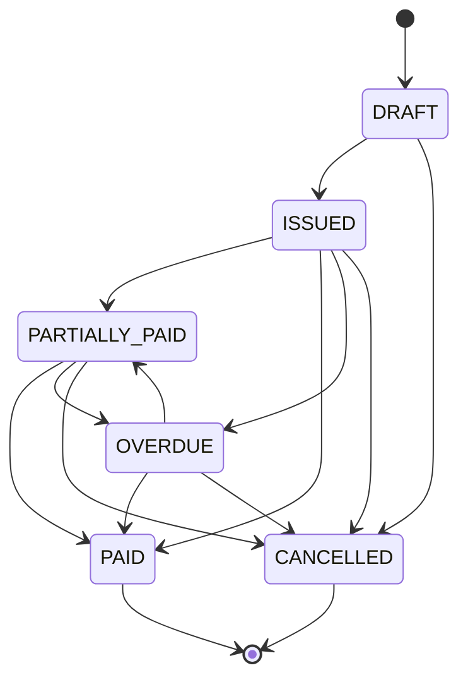
```mermaid
stateDiagram-v2
    [*] --> DRAFT
    DRAFT --> ISSUED
    ISSUED --> PARTIALLY_PAID
    ISSUED --> PAID
    ISSUED --> OVERDUE
    PARTIALLY_PAID --> PAID
    PARTIALLY_PAID --> OVERDUE
    OVERDUE --> PARTIALLY_PAID
    OVERDUE --> PAID
    DRAFT --> CANCELLED
    ISSUED --> CANCELLED
    PARTIALLY_PAID --> CANCELLED
    OVERDUE --> CANCELLED
    PAID --> [*]
    CANCELLED --> [*]
```

| Transition                                  | Déclencheur                                                              | Effets                                                                                                                |
| :------------------------------------------ | :----------------------------------------------------------------------- | :-------------------------------------------------------------------------------------------------------------------- |
| DRAFT → ISSUED                              | Cron mensuel de génération (J‑N avant échéance)                          | `issued_at` renseigné, `document_id` PDF généré, notification d'échéance planifiée                                    |
| ISSUED/PARTIALLY_PAID → PARTIALLY_PAID/PAID | `payment_allocations` créées pour un paiement `CONFIRMED`                | `paid_amount`/`balance_amount` recalculés, `receipts` généré si solde nul ou partiel                                  |
| ISSUED/PARTIALLY_PAID → OVERDUE             | Job quotidien, `CURRENT_DATE > grace_until_date` et `balance_amount > 0` | Déclenche `dunning_runs` (§9), pénalité éventuelle en `invoice_lines`                                                 |
| OVERDUE → PARTIALLY_PAID/PAID               | Paiement tardif confirmé                                                 | Idem ci-dessus, sort de la file de relance                                                                            |
| * → CANCELLED                               | MANAGER/OWNER, motif obligatoire                                         | `cancelled_at`, `cancellation_reason`, tout trop-perçu résiduel bascule en `tenant_credits`, `audit_logs` avant/après |

#### `payments`

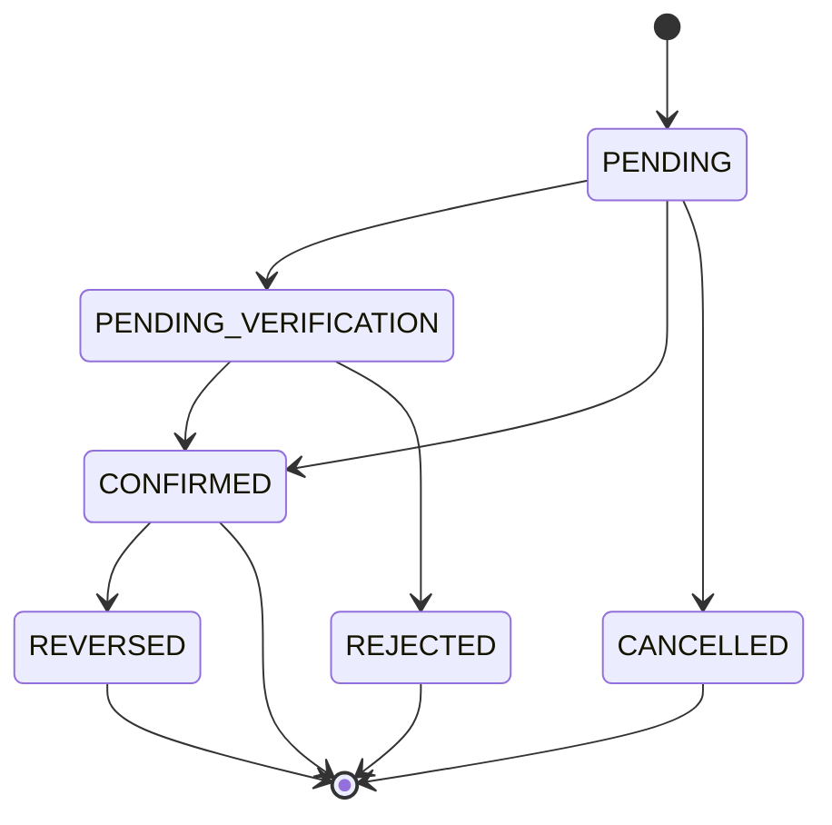
```mermaid
stateDiagram-v2
    [*] --> PENDING
    PENDING --> PENDING_VERIFICATION
    PENDING --> CONFIRMED
    PENDING --> CANCELLED
    PENDING_VERIFICATION --> CONFIRMED
    PENDING_VERIFICATION --> REJECTED
    CONFIRMED --> REVERSED
    CONFIRMED --> [*]
    REJECTED --> [*]
    CANCELLED --> [*]
    REVERSED --> [*]
```

| Transition                       | Déclencheur                                                                                                     | Effets                                                                                                                                                                                                                           |
| :------------------------------- | :-------------------------------------------------------------------------------------------------------------- | :------------------------------------------------------------------------------------------------------------------------------------------------------------------------------------------------------------------------------- |
| PENDING → CONFIRMED              | Espèces : signature locataire capturée. Mobile Money : `getStatus()` renvoie SUCCEEDED (jamais le webhook seul) | `confirmed_at/by`, `payment_allocations` créées, `receipts` généré                                                                                                                                                               |
| PENDING → PENDING_VERIFICATION   | Virement déclaré en attente de relevé ; Mobile Money en écart montant/devise                                    | Passage en file de revue humaine ou de rapprochement                                                                                                                                                                             |
| PENDING_VERIFICATION → CONFIRMED | `reconciliation_match` `CONFIRMED` (virement) ou arbitrage manuel (momo)                                        | Idem CONFIRMED ci-dessus                                                                                                                                                                                                         |
| PENDING_VERIFICATION → REJECTED  | Preuve invalide, montant non rapproché                                                                          | `rejected_at`, `rejection_reason`, notification au locataire                                                                                                                                                                     |
| PENDING → CANCELLED              | Timeout, locataire annule, chèque jamais déposé                                                                 | Aucune imputation créée                                                                                                                                                                                                          |
| CONFIRMED → REVERSED             | Contre-passation créée (`reversal_of_id`)                                                                       | Le paiement original passe `REVERSED` ; une **nouvelle ligne** `payments` de sens inverse est insérée avec `reversal_of_id` pointant vers l'original, et des `payment_allocations` `is_reversal = true` annulent les imputations |

#### `cash_remittances`

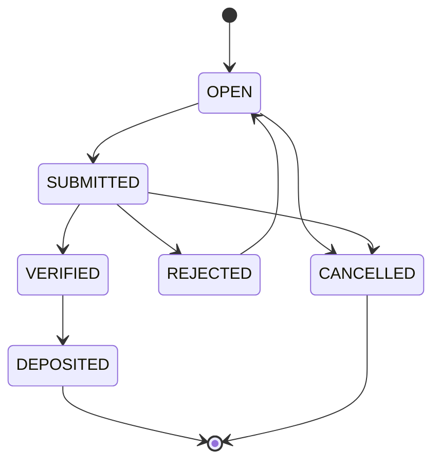
```mermaid
stateDiagram-v2
    [*] --> OPEN
    OPEN --> SUBMITTED
    SUBMITTED --> VERIFIED
    SUBMITTED --> REJECTED
    REJECTED --> OPEN
    VERIFIED --> DEPOSITED
    OPEN --> CANCELLED
    SUBMITTED --> CANCELLED
    DEPOSITED --> [*]
    CANCELLED --> [*]
```

| Transition                 | Déclencheur                                                          | Effets                                                                                     |
| :------------------------- | :------------------------------------------------------------------- | :----------------------------------------------------------------------------------------- |
| OPEN → SUBMITTED           | Démarcheur clôture sa tournée                                        | `submitted_at`, `declared_amount` figé, aucune modification possible de la liste des reçus |
| SUBMITTED → VERIFIED       | Caissier compte et le total correspond (ou écart régularisé, motivé) | `verified_at/by`, `counted_amount`, `variance_amount`, `cash_receipts.status = REMITTED`   |
| SUBMITTED → REJECTED       | Écart non couvert, signature invalide                                | `rejection_reason`, retour possible en OPEN pour le même démarcheur                        |
| VERIFIED → DEPOSITED       | Dépôt bancaire effectif constaté (rapprochement ou saisie manuelle)  | `deposited_at`, `deposit_bank_account_id`, `deposit_slip_document_id`                      |
| * (non finale) → CANCELLED | Erreur de saisie avant tout dépôt                                    | Reçus associés repassent disponibles pour une nouvelle remise                              |

#### `bank_transfer_declarations`

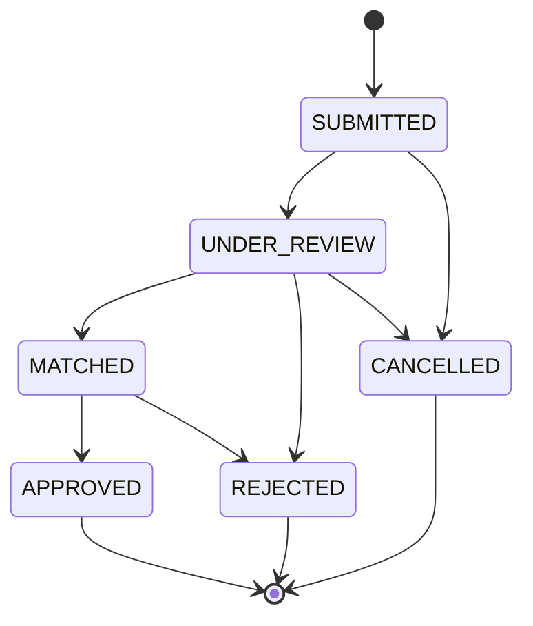
```mermaid
stateDiagram-v2
    [*] --> SUBMITTED
    SUBMITTED --> UNDER_REVIEW
    UNDER_REVIEW --> MATCHED
    MATCHED --> APPROVED
    UNDER_REVIEW --> REJECTED
    MATCHED --> REJECTED
    SUBMITTED --> CANCELLED
    UNDER_REVIEW --> CANCELLED
    APPROVED --> [*]
    REJECTED --> [*]
    CANCELLED --> [*]
```

| Transition                      | Déclencheur                                                                               | Effets                                        |
| :------------------------------ | :---------------------------------------------------------------------------------------- | :-------------------------------------------- |
| SUBMITTED → UNDER_REVIEW        | Prise en charge par un gestionnaire ou le moteur automatique                              | Aucun effet financier                         |
| UNDER_REVIEW → MATCHED          | `reconciliation_match` `PROPOSED`/`EXACT` trouvé sur `transfer_reference` ou montant+date | `matched_statement_line_id` renseigné         |
| MATCHED → APPROVED              | Confirmation du rapprochement (`match.status = CONFIRMED`)                                | `payment_id` créé/confirmé, `reviewed_at/by`  |
| UNDER_REVIEW/MATCHED → REJECTED | Aucune ligne compatible, preuve douteuse                                                  | `rejection_reason`, notification au locataire |
| * (non finale) → CANCELLED      | Déclaration retirée par son auteur                                                        | Aucun effet financier                         |

#### `mobile_money_transactions`

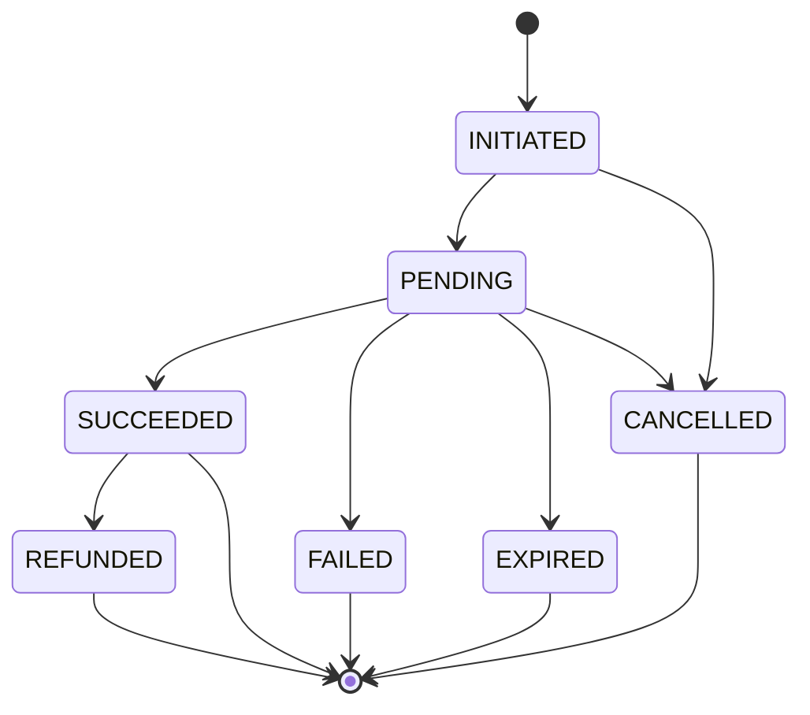
```mermaid
stateDiagram-v2
    [*] --> INITIATED
    INITIATED --> PENDING
    PENDING --> SUCCEEDED
    PENDING --> FAILED
    PENDING --> EXPIRED
    INITIATED --> CANCELLED
    PENDING --> CANCELLED
    SUCCEEDED --> REFUNDED
    SUCCEEDED --> [*]
    FAILED --> [*]
    EXPIRED --> [*]
    CANCELLED --> [*]
    REFUNDED --> [*]
```

| Transition           | Déclencheur                                                                | Effets                                                                          |
| :------------------- | :------------------------------------------------------------------------- | :------------------------------------------------------------------------------ |
| INITIATED → PENDING  | Push USSD/STK délivré au téléphone du payeur                               | `status_checked_at` initialisé                                                  |
| PENDING → SUCCEEDED  | `getStatus()` confirme après webhook (jamais le webhook seul)              | `completed_at`, `payment_id` passe `CONFIRMED`, `status_check_count` incrémenté |
| PENDING → FAILED     | Opérateur renvoie un échec (solde insuffisant, code refusé)                | `failure_code/message`, `payment_id` reste `PENDING` puis `CANCELLED`           |
| PENDING → EXPIRED    | Job `momo:reconcile-pending` au-delà de la fenêtre (2 h, backoff 3→30 min) | `payment_id` passe `CANCELLED`, invitation à réessayer                          |
| SUCCEEDED → REFUNDED | Décision manuelle exceptionnelle                                           | Nouveau paiement sortant, jamais de modification de la ligne d'origine          |

#### `bank_checks`

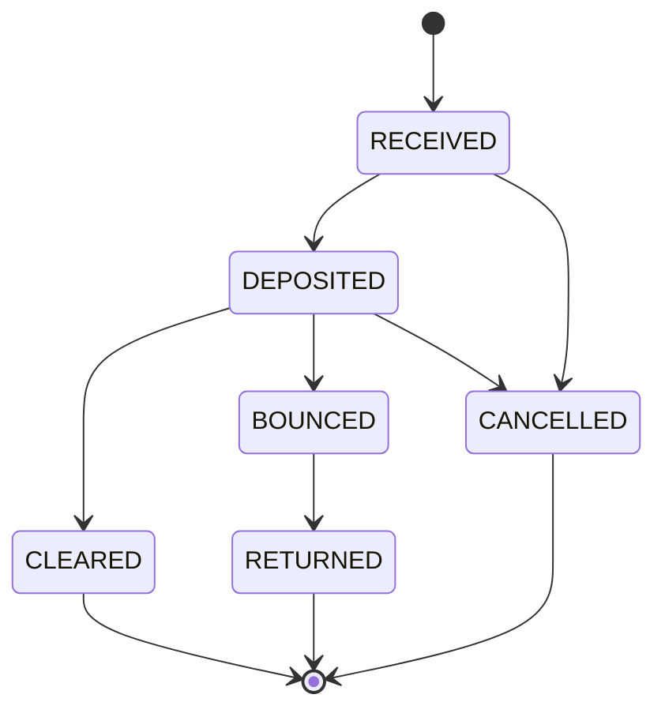
```mermaid
stateDiagram-v2
    [*] --> RECEIVED
    RECEIVED --> DEPOSITED
    DEPOSITED --> CLEARED
    DEPOSITED --> BOUNCED
    BOUNCED --> RETURNED
    RECEIVED --> CANCELLED
    DEPOSITED --> CANCELLED
    CLEARED --> [*]
    RETURNED --> [*]
    CANCELLED --> [*]
```

| Transition                     | Déclencheur                                                   | Effets                                                                                                |
| :----------------------------- | :------------------------------------------------------------ | :---------------------------------------------------------------------------------------------------- |
| RECEIVED → DEPOSITED           | Remise physique du chèque en banque                           | `deposit_date`, `deposit_bank_account_id`                                                             |
| DEPOSITED → CLEARED            | Compensation bancaire réussie (relevé ou confirmation banque) | `cleared_at`, `payment_id` passe `CONFIRMED`                                                          |
| DEPOSITED → BOUNCED            | Rejet banque (provision, opposition)                          | `bounced_at`, `bounce_reason`, `bounce_fee_amount`, dépense de frais refacturable, relance déclenchée |
| BOUNCED → RETURNED             | Chèque physiquement restitué au locataire                     | Aucun effet financier supplémentaire                                                                  |
| RECEIVED/DEPOSITED → CANCELLED | Erreur de saisie avant compensation                           | Aucun paiement confirmé n'a été créé                                                                  |

#### `receipts`

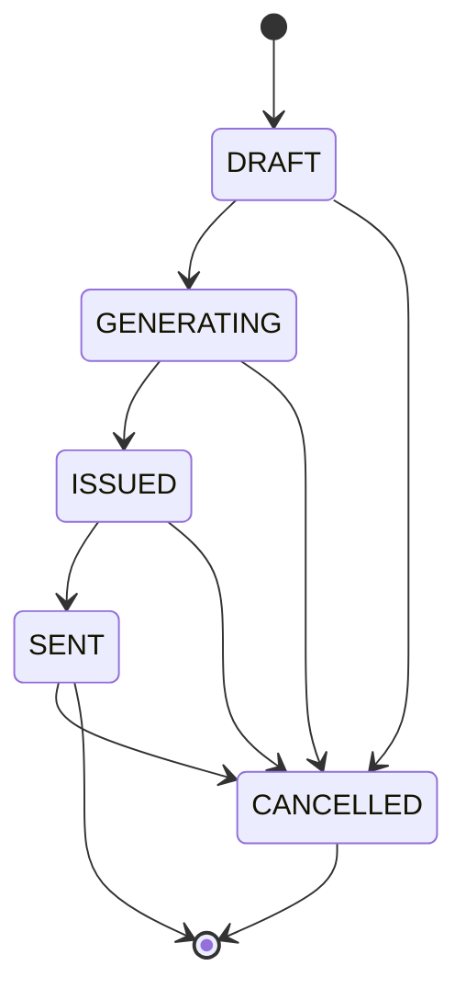
```mermaid
stateDiagram-v2
    [*] --> DRAFT
    DRAFT --> GENERATING
    GENERATING --> ISSUED
    ISSUED --> SENT
    DRAFT --> CANCELLED
    GENERATING --> CANCELLED
    ISSUED --> CANCELLED
    SENT --> CANCELLED
    SENT --> [*]
    CANCELLED --> [*]
```

| Transition                 | Déclencheur                                                        | Effets                                                                                                                                    |
| :------------------------- | :----------------------------------------------------------------- | :---------------------------------------------------------------------------------------------------------------------------------------- |
| DRAFT → GENERATING         | `payments.status = CONFIRMED` déclenche le job `receipts:generate` | Réservation du `receipt_number` via `next_sequence('RECEIPT', YYYYMM)`                                                                    |
| GENERATING → ISSUED        | PDF rendu par le worker Puppeteer                                  | `document_id`, `content_hash`, `qr_payload`, `verification_url` figés                                                                     |
| ISSUED → SENT              | Envoi WhatsApp/SMS réussi                                          | `sent_at`, `sent_channel`, `message_log_id`                                                                                               |
| * (non finale) → CANCELLED | Le paiement source est contre-passé (`REVERSED`)                   | `cancellation_reason` ; la quittance déjà envoyée n'est jamais supprimée, une mention d'annulation est ajoutée à la vérification publique |

### 7.19 Verrous transverses du domaine

**`guard_financial_row`** protège `payments`, `receipts` et `cash_receipts` : DELETE toujours interdit, et les colonnes financières listées en argument du trigger (montant, méthode, référence, tiers, dates d'origine, signature — cf. §12) sont **set-once** : une fois renseignées à une valeur non nulle, toute tentative de modification lève `restrict_violation`. Seules les colonnes de workflow restent modifiables : `status`, dates de confirmation/rejet/annulation/contre-passation, montants imputés (`allocated_amount`, `unallocated_amount`), liens vers `document_id`/`remittance_id`. Toute correction d'un montant erroné passe donc obligatoirement par une **contre-passation** : une nouvelle ligne portant `reversal_of_id`, jamais une modification de la ligne existante.

**`payment_allocations`** est protégée par `forbid_update_delete` : append-only **strict**, sans exception de colonnes. Une désaffectation (facture réémise, erreur d'imputation) s'écrit comme une nouvelle ligne `is_reversal = true` avec `reversal_of_id` pointant vers l'affectation annulée, de montant égal et de signe opposé dans le calcul du solde. `audit_logs` (§12) trace en complément chaque transition d'état des tables ci-dessus avec l'état complet avant/après en JSONB.

## 8. Gestion d'agence

Ce domaine outille le mandat de gestion : les dépenses engagées sur un bien, les honoraires de l'agence, et leur synthèse périodique adressée au bailleur sous forme de relevé de gérance, jusqu'au reversement effectif du net dû.

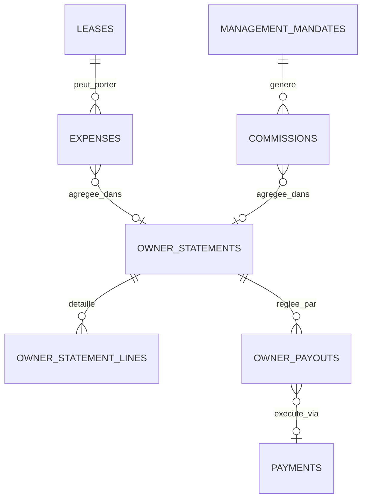
```mermaid
erDiagram
    MANAGEMENT_MANDATES ||--o{ COMMISSIONS : genere
    LEASES ||--o{ EXPENSES : peut_porter
    EXPENSES }o--o| OWNER_STATEMENTS : agregee_dans
    COMMISSIONS }o--o| OWNER_STATEMENTS : agregee_dans
    OWNER_STATEMENTS ||--o{ OWNER_STATEMENT_LINES : detaille
    OWNER_STATEMENTS ||--o{ OWNER_PAYOUTS : reglee_par
    OWNER_PAYOUTS }o--o| PAYMENTS : execute_via
```

### 8.1 `expenses`

Dépense engagée sur un bien : réparation, facture E2C/LCDE, taxe, gardiennage. Déduite du relevé de gérance ou refacturée au locataire.

| Colonne                                       | Type             | Nullable | Défaut              | Description                                                                                                                                  |
| :-------------------------------------------- | :--------------- | :------- | :------------------ | :------------------------------------------------------------------------------------------------------------------------------------------- |
| id                                            | UUID             | non      | `gen_random_uuid()` | Identifiant technique                                                                                                                        |
| organization_id                               | UUID             | non      | —                   | Organisation propriétaire                                                                                                                    |
| property_id / unit_id / lease_id              | UUID             | oui      | —                   | Périmètre de la dépense                                                                                                                      |
| landlord_id                                   | UUID             | oui      | —                   | Bailleur concerné                                                                                                                            |
| maintenance_request_id                        | UUID             | oui      | —                   | Demande de maintenance à l'origine                                                                                                           |
| reference                                     | TEXT             | non      | —                   | Référence interne                                                                                                                            |
| category                                      | expense_category | non      | REPAIR              | REPAIR, MAINTENANCE, PLUMBING, ELECTRICITY, CLEANING, SECURITY, UTILITY_BILL, TAX, INSURANCE, SYNDIC_FEE, LEGAL_FEE, TRAVEL, SUPPLIES, OTHER |
| status                                        | expense_status   | non      | DRAFT               | DRAFT, SUBMITTED, APPROVED, PAID, REBILLED, REJECTED, CANCELLED                                                                              |
| borne_by                                      | expense_bearer   | non      | LANDLORD            | Partie supportant réellement la charge                                                                                                       |
| label / description                           | TEXT             | non/oui  | —                   | Libellé et détail                                                                                                                            |
| supplier_name / supplier_phone / supplier_niu | TEXT             | oui      | —                   | Fournisseur ; NIU requis pour la déductibilité fiscale                                                                                       |
| amount                                        | BIGINT           | non      | —                   | Montant HT                                                                                                                                   |
| vat_rate_bps / vat_amount                     | —                | non      | 0                   | TVA                                                                                                                                          |
| total_amount                                  | BIGINT           | non      | 0                   | Montant TTC                                                                                                                                  |
| currency                                      | CHAR(3)          | non      | 'XAF'               | Devise                                                                                                                                       |
| expense_date                                  | DATE             | non      | `CURRENT_DATE`      | Date d'engagement                                                                                                                            |
| paid_at                                       | TIMESTAMPTZ      | oui      | —                   | Date de règlement au fournisseur                                                                                                             |
| payment_id                                    | UUID             | oui      | —                   | Paiement sortant correspondant                                                                                                               |
| is_rebillable                                 | BOOLEAN          | non      | false               | Refacturable au locataire                                                                                                                    |
| rebilled_invoice_line_id                      | UUID             | oui      | —                   | Ligne de refacturation                                                                                                                       |
| is_deductible_from_rent                       | BOOLEAN          | non      | true                | Déduite des loyers reversés au bailleur                                                                                                      |
| owner_statement_id                            | UUID             | oui      | —                   | Relevé de gérance de rattachement                                                                                                            |
| invoice_document_id                           | UUID             | oui      | —                   | Facture fournisseur scannée                                                                                                                  |
| approved_by_user_id / approved_at             | —                | oui      | —                   | Validation                                                                                                                                   |
| created_by_user_id                            | UUID             | oui      | —                   | Auteur                                                                                                                                       |
| client_ref                                    | TEXT             | oui      | —                   | Idempotence mobile                                                                                                                           |
| notes                                         | TEXT             | oui      | —                   | Remarques                                                                                                                                    |
| created_at / updated_at                       | TIMESTAMPTZ      | non      | `now()`             | Horodatage                                                                                                                                   |

**Clés étrangères** : `organization_id` → `organizations(id)` CASCADE ; `property_id`, `unit_id`, `lease_id`, `landlord_id` → SET NULL ; `maintenance_request_id` → `maintenance_requests(id)` SET NULL (FK différée, partie 10a) ; `payment_id` → `payments(id)` SET NULL ; `rebilled_invoice_line_id` → `invoice_lines(id)` SET NULL ; `owner_statement_id` → `owner_statements(id)` SET NULL (FK différée, partie 09b) ; `invoice_document_id` → `documents(id)` SET NULL ; `approved_by_user_id`, `created_by_user_id` → `users(id)` SET NULL.
**Contraintes** : `expenses_reference_uk` UNIQUE `(organization_id, reference)` ; `expenses_client_ref_uk` UNIQUE `(organization_id, client_ref)` ; CHECK `>= 0` sur les montants.
**Index** : `expenses_org_date_idx` sert l'historique global ; `expenses_property_idx` sert le suivi par bien ; `expenses_pending_statement_idx` partiel `WHERE status='PAID' AND owner_statement_id IS NULL AND is_deductible_from_rent` alimente directement la génération du prochain relevé de gérance.
**Règles métier** : une dépense `is_rebillable` produit une `invoice_lines` de type `REPAIR_REBILL` sur la facture du locataire responsable. Une dépense ne peut être rattachée qu'à un seul `owner_statement`, matérialisant qu'elle n'est déduite qu'une fois.

### 8.2 `commissions`

Honoraires de gestion dus à l'agence, calculés sur les loyers encaissés ou dus selon le mandat.

| Colonne                   | Type              | Nullable | Défaut                     | Description                                                                                    |
| :------------------------ | :---------------- | :------- | :------------------------- | :--------------------------------------------------------------------------------------------- |
| id                        | UUID              | non      | `gen_random_uuid()`        | Identifiant technique                                                                          |
| organization_id           | UUID              | non      | —                          | Organisation propriétaire                                                                      |
| mandate_id                | UUID              | oui      | —                          | Mandat de gestion source                                                                       |
| landlord_id               | UUID              | non      | —                          | Bailleur débiteur                                                                              |
| lease_id / property_id    | UUID              | oui      | —                          | Périmètre                                                                                      |
| invoice_id / payment_id   | UUID              | oui      | —                          | Facture / paiement source de l'assiette                                                        |
| status                    | commission_status | non      | PENDING                    | PENDING, ACCRUED, INVOICED, SETTLED, CANCELLED                                                 |
| basis                     | commission_basis  | non      | RATE_BPS_ON_RENT_COLLECTED | RATE_BPS_ON_RENT_COLLECTED, RATE_BPS_ON_RENT_DUE, FLAT_AMOUNT_PER_MONTH, FLAT_AMOUNT_PER_LEASE |
| period_start / period_end | DATE              | non      | —                          | Période de calcul                                                                              |
| base_amount               | BIGINT            | non      | 0                          | Assiette (loyer encaissé ou appelé)                                                            |
| rate_bps                  | INTEGER           | oui      | —                          | Taux en points de base                                                                         |
| flat_amount               | BIGINT            | oui      | —                          | Montant forfaitaire                                                                            |
| amount                    | BIGINT            | non      | 0                          | Commission HT                                                                                  |
| vat_rate_bps              | INTEGER           | non      | 1800                       | TVA (18 % par défaut)                                                                          |
| vat_amount / total_amount | BIGINT            | non      | 0                          | TVA et total TTC                                                                               |
| currency                  | CHAR(3)           | non      | 'XAF'                      | Devise                                                                                         |
| owner_statement_id        | UUID              | oui      | —                          | Relevé de rattachement                                                                         |
| accrued_at / settled_at   | TIMESTAMPTZ       | oui      | —                          | Constatation / règlement                                                                       |
| reversal_of_id            | UUID              | oui      | —                          | Commission annulée par contre-passation                                                        |
| notes                     | TEXT              | oui      | —                          | Remarques                                                                                      |
| created_at / updated_at   | TIMESTAMPTZ       | non      | `now()`                    | Horodatage                                                                                     |

**Clés étrangères** : `organization_id` → `organizations(id)` CASCADE ; `mandate_id` → `management_mandates(id)` SET NULL ; `landlord_id` → `landlords(id)` RESTRICT ; `lease_id`, `property_id`, `invoice_id`, `payment_id` → SET NULL ; `owner_statement_id` → `owner_statements(id)` SET NULL (FK différée, partie 09b) ; `reversal_of_id` → `commissions(id)` RESTRICT.
**Contraintes** : `commissions_period_chk` CHECK `period_start < period_end` ; `commissions_value_chk` CHECK `rate_bps IS NOT NULL OR flat_amount IS NOT NULL` ; CHECK `>= 0` sur les montants et taux.
**Index** : `commissions_landlord_period_idx` sert l'historique par bailleur ; `commissions_pending_statement_idx` partiel `WHERE status='ACCRUED' AND owner_statement_id IS NULL` alimente la génération du relevé, symétrique à `expenses_pending_statement_idx`.
**Règles métier** : une commission `ACCRUED` sur un loyer finalement impayé et annulé se corrige par contre-passation (`reversal_of_id`), jamais par suppression — cohérent avec l'absence de DELETE sur les tables financières du domaine.

### 8.3 `owner_statements`

Relevé de gérance périodique adressé au bailleur : loyers encaissés, honoraires, dépenses, net à reverser.

| Colonne                                                            | Type             | Nullable | Défaut              | Description                                           |
| :----------------------------------------------------------------- | :--------------- | :------- | :------------------ | :---------------------------------------------------- |
| id                                                                 | UUID             | non      | `gen_random_uuid()` | Identifiant technique                                 |
| organization_id                                                    | UUID             | non      | —                   | Organisation propriétaire                             |
| landlord_id                                                        | UUID             | non      | —                   | Bailleur destinataire                                 |
| mandate_id / property_id                                           | UUID             | oui      | —                   | Mandat et bien concernés                              |
| statement_number                                                   | TEXT             | non      | —                   | Numéro de relevé                                      |
| status                                                             | statement_status | non      | DRAFT               | DRAFT, ISSUED, SENT, PAID, CANCELLED                  |
| period_start / period_end                                          | DATE             | non      | —                   | Période couverte                                      |
| issue_date                                                         | DATE             | non      | `CURRENT_DATE`      | Date d'émission                                       |
| rent_due_amount / rent_collected_amount / charges_collected_amount | BIGINT           | non      | 0                   | Loyers appelés/encaissés, charges encaissées          |
| commission_amount / commission_vat_amount                          | BIGINT           | non      | 0                   | Honoraires et leur TVA                                |
| expenses_amount                                                    | BIGINT           | non      | 0                   | Dépenses déduites                                     |
| deposits_held_amount                                               | BIGINT           | non      | 0                   | Cautions détenues sur la période                      |
| carry_forward_amount                                               | BIGINT           | non      | 0                   | Report du solde précédent, peut être négatif          |
| net_payable_amount                                                 | BIGINT           | non      | 0                   | Net à reverser, négatif = le bailleur doit à l'agence |
| currency                                                           | CHAR(3)          | non      | 'XAF'               | Devise                                                |
| occupancy_rate_bps / collection_rate_bps                           | INTEGER          | oui      | —                   | Indicateurs d'occupation et de recouvrement           |
| document_id                                                        | UUID             | oui      | —                   | PDF du relevé                                         |
| generated_by_job                                                   | TEXT             | oui      | —                   | Job générateur                                        |
| issued_at / sent_at / settled_at / cancelled_at                    | TIMESTAMPTZ      | oui      | —                   | Horodatages de transition                             |
| notes                                                              | TEXT             | oui      | —                   | Remarques                                             |
| created_at / updated_at                                            | TIMESTAMPTZ      | non      | `now()`             | Horodatage                                            |

**Clés étrangères** : `organization_id` → `organizations(id)` CASCADE ; `landlord_id` → `landlords(id)` RESTRICT ; `mandate_id` → `management_mandates(id)` SET NULL ; `property_id` → `properties(id)` SET NULL ; `document_id` → `documents(id)` SET NULL (FK différée, partie 11a).
**Contraintes** : `owner_statements_number_uk` UNIQUE `(organization_id, statement_number)` ; `owner_statements_period_uk` UNIQUE `(organization_id, landlord_id, property_id, period_start)` — un seul relevé par bailleur/bien/période ; `owner_statements_period_chk` CHECK `period_start < period_end` ; CHECK `>= 0` sur les montants sauf `carry_forward_amount` et `net_payable_amount`.
**Index** : `owner_statements_landlord_idx` sert l'historique par bailleur ; `owner_statements_status_idx` sert la file d'émission/envoi.
**Règles métier** : `net_payable_amount = rent_collected_amount + charges_collected_amount − commission_amount − commission_vat_amount − expenses_amount + carry_forward_amount` (calcul applicatif, matérialisé à l'émission). Un relevé `ISSUED` fige ses montants ; toute correction ultérieure se fait sur le relevé de la période suivante via `carry_forward_amount`, jamais par modification rétroactive.

### 8.4 `owner_statement_lines`

Détail ligne à ligne d'un relevé de gérance, traçant chaque encaissement, honoraire et dépense.

| Colonne                                              | Type                      | Nullable | Défaut              | Description                                                                                                |
| :--------------------------------------------------- | :------------------------ | :------- | :------------------ | :--------------------------------------------------------------------------------------------------------- |
| id                                                   | UUID                      | non      | `gen_random_uuid()` | Identifiant technique                                                                                      |
| organization_id                                      | UUID                      | non      | —                   | Organisation propriétaire                                                                                  |
| statement_id                                         | UUID                      | non      | —                   | Relevé parent                                                                                              |
| line_type                                            | owner_statement_line_type | non      | —                   | RENT_COLLECTED, CHARGE_COLLECTED, COMMISSION, EXPENSE, VAT, DEPOSIT_HELD, CARRY_FORWARD, ADJUSTMENT, OTHER |
| label                                                | TEXT                      | non      | —                   | Libellé                                                                                                    |
| property_id / unit_id / lease_id / tenant_id         | UUID                      | oui      | —                   | Origine de la ligne                                                                                        |
| invoice_id / payment_id / expense_id / commission_id | UUID                      | oui      | —                   | Pièce justificative source                                                                                 |
| period_start / period_end                            | DATE                      | oui      | —                   | Sous-période couverte                                                                                      |
| amount                                               | BIGINT                    | non      | —                   | Montant de la ligne                                                                                        |
| is_debit                                             | BOOLEAN                   | non      | false               | true = en déduction du net à reverser                                                                      |
| currency                                             | CHAR(3)                   | non      | 'XAF'               | Devise                                                                                                     |
| position                                             | SMALLINT                  | non      | 0                   | Ordre d'affichage                                                                                          |
| created_at / updated_at                              | TIMESTAMPTZ               | non      | `now()`             | Horodatage                                                                                                 |

**Clés étrangères** : `organization_id` → `organizations(id)` CASCADE ; `statement_id` → `owner_statements(id)` CASCADE ; `property_id`, `unit_id`, `lease_id`, `tenant_id`, `invoice_id`, `payment_id`, `expense_id`, `commission_id` → SET NULL.
**Contraintes** : CHECK `amount >= 0` (le sens est porté par `is_debit`).
**Index** : `owner_statement_lines_statement_idx (organization_id, statement_id, position)` reconstitue le relevé dans son ordre d'impression.
**Règles métier** : chaque `commission` et chaque `expense` agrégée dans le relevé produit exactement une ligne traçable (`commission_id`/`expense_id`), garantissant la réconciliation ligne à ligne du PDF envoyé au bailleur avec les tables sources.

### 8.5 `owner_payouts`

Reversement effectif du net de gérance au bailleur (virement, Mobile Money, espèces ou chèque).

| Colonne                           | Type           | Nullable | Défaut              | Description                                            |
| :-------------------------------- | :------------- | :------- | :------------------ | :----------------------------------------------------- |
| id                                | UUID           | non      | `gen_random_uuid()` | Identifiant technique                                  |
| organization_id                   | UUID           | non      | —                   | Organisation propriétaire                              |
| landlord_id                       | UUID           | non      | —                   | Bailleur bénéficiaire                                  |
| statement_id                      | UUID           | oui      | —                   | Relevé de gérance réglé                                |
| payment_id                        | UUID           | oui      | —                   | Paiement sortant correspondant                         |
| reference                         | TEXT           | non      | —                   | Référence interne                                      |
| status                            | payout_status  | non      | PENDING             | PENDING, APPROVED, PROCESSING, PAID, FAILED, CANCELLED |
| method                            | payment_method | non      | MOBILE_MONEY        | CASH, MOBILE_MONEY, BANK_TRANSFER, BANK_CHECK          |
| amount                            | BIGINT         | non      | —                   | Montant brut à reverser                                |
| fee_amount                        | BIGINT         | non      | 0                   | Frais de transfert                                     |
| fee_bearer                        | fee_bearer     | non      | LANDLORD            | Partie supportant les frais                            |
| net_amount                        | BIGINT         | non      | 0                   | Montant net perçu par le bailleur                      |
| currency                          | CHAR(3)        | non      | 'XAF'               | Devise                                                 |
| bank_account_id                   | UUID           | oui      | —                   | Compte bailleur crédité                                |
| momo_transaction_id               | UUID           | oui      | —                   | Transaction Mobile Money sortante                      |
| scheduled_date                    | DATE           | oui      | —                   | Date planifiée                                         |
| approved_by_user_id / approved_at | —              | oui      | —                   | Validation                                             |
| paid_at                           | TIMESTAMPTZ    | oui      | —                   | Date d'exécution effective                             |
| failure_reason                    | TEXT           | oui      | —                   | Motif d'échec                                          |
| proof_document_id                 | UUID           | oui      | —                   | Justificatif du reversement                            |
| client_ref                        | TEXT           | oui      | —                   | Idempotence                                            |
| notes                             | TEXT           | oui      | —                   | Remarques                                              |
| created_at / updated_at           | TIMESTAMPTZ    | non      | `now()`             | Horodatage                                             |

**Clés étrangères** : `organization_id` → `organizations(id)` CASCADE ; `landlord_id` → `landlords(id)` RESTRICT ; `statement_id` → `owner_statements(id)` SET NULL ; `payment_id` → `payments(id)` SET NULL ; `bank_account_id` → `bank_accounts(id)` SET NULL ; `momo_transaction_id` → `mobile_money_transactions(id)` SET NULL ; `proof_document_id` → `documents(id)` SET NULL (FK différée, partie 11a) ; `approved_by_user_id` → `users(id)` SET NULL.
**Contraintes** : `owner_payouts_reference_uk` UNIQUE `(organization_id, reference)` ; `owner_payouts_client_ref_uk` UNIQUE `(organization_id, client_ref)` ; CHECK `>= 0` sur les montants.
**Index** : `owner_payouts_landlord_idx` sert l'historique par bailleur ; `owner_payouts_pending_idx` partiel `WHERE status IN ('PENDING','APPROVED','PROCESSING')` alimente la file d'exécution des reversements.
**Règles métier** : `net_amount = amount − fee_amount` lorsque `fee_bearer = LANDLORD`. Un `owner_payout` `PAID` est définitif ; une erreur se corrige par un nouveau `owner_payout` compensatoire, jamais par modification.

### 8.6 Machines à états

#### `owner_statements`

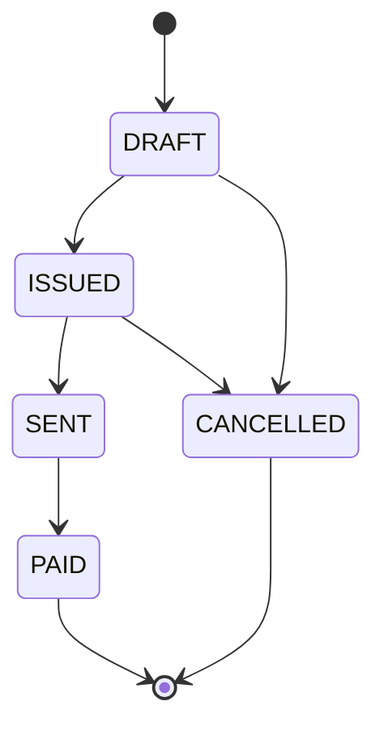
```mermaid
stateDiagram-v2
    [*] --> DRAFT
    DRAFT --> ISSUED
    ISSUED --> SENT
    SENT --> PAID
    DRAFT --> CANCELLED
    ISSUED --> CANCELLED
    PAID --> [*]
    CANCELLED --> [*]
```

| Transition               | Déclencheur                                          | Effets                                                                                                          |
| :----------------------- | :--------------------------------------------------- | :-------------------------------------------------------------------------------------------------------------- |
| DRAFT → ISSUED           | Cron mensuel de clôture de gérance ou action MANAGER | Agrégation des `commissions` ACCRUED et `expenses` PAID de la période, montants figés, `document_id` PDF généré |
| ISSUED → SENT            | Envoi WhatsApp/email/portail au bailleur             | `sent_at`, `message_log_id` associé                                                                             |
| SENT → PAID              | `owner_payout` correspondant passe `PAID`            | `settled_at`                                                                                                    |
| DRAFT/ISSUED → CANCELLED | Erreur avant envoi                                   | `commissions`/`expenses` rattachées redeviennent disponibles pour le relevé suivant                             |

#### `owner_payouts`

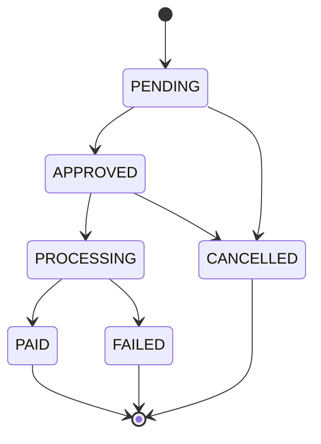
```mermaid
stateDiagram-v2
    [*] --> PENDING
    PENDING --> APPROVED
    APPROVED --> PROCESSING
    PROCESSING --> PAID
    PENDING --> CANCELLED
    APPROVED --> CANCELLED
    PROCESSING --> FAILED
    PAID --> [*]
    FAILED --> [*]
    CANCELLED --> [*]
```

| Transition                   | Déclencheur                                                     | Effets                                                                          |
| :--------------------------- | :-------------------------------------------------------------- | :------------------------------------------------------------------------------ |
| PENDING → APPROVED           | Validation MANAGER/OWNER                                        | `approved_at/by`                                                                |
| APPROVED → PROCESSING        | Envoi de l'ordre à l'agrégateur/la banque                       | `momo_transaction_id` ou virement initié                                        |
| PROCESSING → PAID            | Confirmation d'exécution (statut agrégateur ou relevé bancaire) | `paid_at`, `payment_id` créé, `owner_statements.status = PAID`                  |
| PROCESSING → FAILED          | Échec d'exécution                                               | `failure_reason`, repasse en `PENDING` après correction pour nouvelle tentative |
| PENDING/APPROVED → CANCELLED | Annulation avant exécution                                      | Aucun effet financier                                                           |

## 9. Exploitation et communication

Ce domaine couvre le cycle de vie d'une demande de maintenance, et l'ensemble de la communication sortante — modèles, notifications planifiées, journal technique des messages et scénarios de relance des impayés.

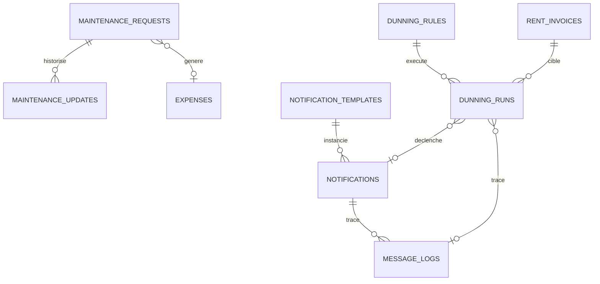
```mermaid
erDiagram
    MAINTENANCE_REQUESTS ||--o{ MAINTENANCE_UPDATES : historise
    MAINTENANCE_REQUESTS }o--o| EXPENSES : genere
    NOTIFICATION_TEMPLATES ||--o{ NOTIFICATIONS : instancie
    NOTIFICATIONS ||--o{ MESSAGE_LOGS : trace
    DUNNING_RULES ||--o{ DUNNING_RUNS : execute
    DUNNING_RUNS }o--o| NOTIFICATIONS : declenche
    DUNNING_RUNS }o--o| MESSAGE_LOGS : trace
    RENT_INVOICES ||--o{ DUNNING_RUNS : cible
```

### 9.1 `maintenance_requests`

Demande d'intervention technique signalée par un locataire, un démarcheur ou issue d'un état des lieux.

| Colonne                                             | Type                 | Nullable | Défaut              | Description                                                                    |
| :-------------------------------------------------- | :------------------- | :------- | :------------------ | :----------------------------------------------------------------------------- |
| id                                                  | UUID                 | non      | `gen_random_uuid()` | Identifiant technique                                                          |
| organization_id                                     | UUID                 | non      | —                   | Organisation propriétaire                                                      |
| property_id                                         | UUID                 | non      | —                   | Bien concerné                                                                  |
| unit_id / lease_id / tenant_id                      | UUID                 | oui      | —                   | Lot, bail, locataire concernés                                                 |
| reference                                           | TEXT                 | non      | —                   | Référence interne                                                              |
| status                                              | maintenance_status   | non      | OPEN                | OPEN, ACKNOWLEDGED, ASSIGNED, IN_PROGRESS, ON_HOLD, RESOLVED, CLOSED, REJECTED |
| priority                                            | maintenance_priority | non      | NORMAL              | LOW, NORMAL, HIGH, URGENT                                                      |
| reporter_type                                       | maintenance_reporter | non      | TENANT              | TENANT, LANDLORD, COLLECTOR, MANAGER, INSPECTION                               |
| reported_by_user_id                                 | UUID                 | oui      | —                   | Auteur du signalement                                                          |
| category                                            | expense_category     | non      | REPAIR              | Catégorie technique                                                            |
| title / description                                 | TEXT                 | non      | —                   | Objet et détail                                                                |
| location_detail                                     | TEXT                 | oui      | —                   | Localisation précise dans le bien                                              |
| reported_at                                         | TIMESTAMPTZ          | non      | `now()`             | Signalement                                                                    |
| acknowledged_at                                     | TIMESTAMPTZ          | oui      | —                   | Prise en compte                                                                |
| assigned_to_user_id / assigned_at                   | —                    | oui      | —                   | Affectation interne                                                            |
| supplier_name / supplier_phone                      | TEXT                 | oui      | —                   | Prestataire externe                                                            |
| scheduled_at / started_at / resolved_at / closed_at | TIMESTAMPTZ          | oui      | —                   | Jalons d'intervention                                                          |
| sla_due_at                                          | TIMESTAMPTZ          | oui      | —                   | Échéance contractuelle dérivée de la priorité                                  |
| estimated_amount / actual_amount                    | BIGINT               | non      | 0                   | Coût estimé / réel                                                             |
| currency                                            | CHAR(3)              | non      | 'XAF'               | Devise                                                                         |
| charged_to                                          | expense_bearer       | non      | LANDLORD            | Partie supportant le coût final                                                |
| landlord_approved / landlord_approved_at            | —                    | non/oui  | false               | Accord du bailleur au-delà du seuil de délégation                              |
| tenant_rating                                       | SMALLINT             | oui      | —                   | Satisfaction 1 à 5 après clôture                                               |
| rejection_reason                                    | TEXT                 | oui      | —                   | Motif de rejet                                                                 |
| inspection_id                                       | UUID                 | oui      | —                   | État des lieux à l'origine                                                     |
| client_ref / sync_batch_id                          | —                    | oui      | —                   | Idempotence et synchronisation mobile                                          |
| created_at / updated_at                             | TIMESTAMPTZ          | non      | `now()`             | Horodatage                                                                     |

**Clés étrangères** : `organization_id` → `organizations(id)` CASCADE ; `property_id` → `properties(id)` RESTRICT ; `unit_id`, `lease_id`, `tenant_id`, `reported_by_user_id`, `assigned_to_user_id` → SET NULL ; `inspection_id` → `inspections(id)` SET NULL ; `sync_batch_id` → `sync_batches(id)` SET NULL (FK différée, partie 11b). Référencée en retour par `expenses.maintenance_request_id` (FK différée, partie 10a).
**Contraintes** : `maintenance_requests_reference_uk` UNIQUE `(organization_id, reference)` ; `maintenance_requests_client_ref_uk` UNIQUE `(organization_id, client_ref)` ; CHECK `tenant_rating BETWEEN 1 AND 5` ; CHECK `>= 0` sur les montants.
**Index** : `maintenance_requests_org_status_idx (organization_id, status, priority DESC, reported_at DESC)` sert le tableau de pilotage ; `maintenance_requests_property_idx` sert la vue par bien ; `maintenance_requests_sla_idx` partiel `WHERE status NOT IN ('RESOLVED','CLOSED','REJECTED')` alimente l'alerte de dépassement de SLA ; `maintenance_requests_sync_idx` sert la réconciliation offline.
**Règles métier** : `sla_due_at` est calculé à la création à partir de `priority` (barème de délais par organisation). Une intervention dont `charged_to = TENANT` ou `LANDLORD` au-delà du seuil du mandat exige `landlord_approved = true` avant tout engagement de dépense.

### 9.2 `maintenance_updates`

Fil chronologique d'une demande de maintenance : changements de statut, commentaires, photos, coûts.

| Colonne                       | Type               | Nullable | Défaut              | Description                                  |
| :---------------------------- | :----------------- | :------- | :------------------ | :------------------------------------------- |
| id                            | UUID               | non      | `gen_random_uuid()` | Identifiant technique                        |
| organization_id               | UUID               | non      | —                   | Organisation propriétaire                    |
| request_id                    | UUID               | non      | —                   | Demande parente                              |
| author_user_id / author_label | —                  | oui      | —                   | Auteur interne ou prestataire externe nommé  |
| previous_status / new_status  | maintenance_status | oui      | —                   | Transition constatée                         |
| message                       | TEXT               | oui      | —                   | Commentaire                                  |
| is_visible_to_tenant          | BOOLEAN            | non      | true                | false = note interne                         |
| amount_delta                  | BIGINT             | non      | 0                   | Variation du coût estimé, peut être négative |
| currency                      | CHAR(3)            | non      | 'XAF'               | Devise                                       |
| photo_document_id             | UUID               | oui      | —                   | Photo jointe                                 |
| expense_id                    | UUID               | oui      | —                   | Dépense engagée à cette étape                |
| occurred_at                   | TIMESTAMPTZ        | non      | `now()`             | Horodatage métier                            |
| client_ref                    | TEXT               | oui      | —                   | Idempotence mobile                           |
| created_at / updated_at       | TIMESTAMPTZ        | non      | `now()`             | Horodatage technique                         |

**Clés étrangères** : `organization_id` → `organizations(id)` CASCADE ; `request_id` → `maintenance_requests(id)` CASCADE ; `author_user_id` → `users(id)` SET NULL ; `photo_document_id` → `documents(id)` SET NULL (FK différée, partie 11a) ; `expense_id` → `expenses(id)` SET NULL.
**Index** : `maintenance_updates_request_idx (organization_id, request_id, occurred_at DESC)` reconstitue le fil chronologique affiché au locataire et à l'équipe.
**Règles métier** : chaque transition de `maintenance_requests.status` doit produire une ligne `maintenance_updates` correspondante (cohérence applicative, en plus de la trace `audit_logs`). `is_visible_to_tenant = false` masque les échanges internes (négociation prestataire) du portail locataire.

### 9.3 `notification_templates`

Modèle de message par canal et par langue (quittance, relance, échéance, confirmation de paiement).

| Colonne                                         | Type                 | Nullable | Défaut              | Description                                                                   |
| :---------------------------------------------- | :------------------- | :------- | :------------------ | :---------------------------------------------------------------------------- |
| id                                              | UUID                 | non      | `gen_random_uuid()` | Identifiant technique                                                         |
| organization_id                                 | UUID                 | non      | —                   | Organisation propriétaire                                                     |
| code                                            | TEXT                 | non      | —                   | Code fonctionnel du modèle                                                    |
| channel                                         | notification_channel | non      | —                   | WHATSAPP, SMS, EMAIL, PUSH, IN_APP                                            |
| locale                                          | TEXT                 | non      | 'fr-CG'             | Langue                                                                        |
| name                                            | TEXT                 | non      | —                   | Nom d'affichage                                                               |
| subject                                         | TEXT                 | oui      | —                   | Objet (email)                                                                 |
| body                                            | TEXT                 | non      | —                   | Corps du message                                                              |
| provider_template_name / provider_template_lang | TEXT                 | oui      | —                   | Nom du template WhatsApp Cloud API approuvé, obligatoire hors fenêtre de 24 h |
| variables                                       | JSONB                | non      | `[]`                | Liste ordonnée des variables attendues                                        |
| is_active                                       | BOOLEAN              | non      | true                | Modèle utilisable                                                             |
| is_system                                       | BOOLEAN              | non      | false               | Modèle fourni par Immodesk, non éditable                                      |
| approved_at                                     | TIMESTAMPTZ          | oui      | —                   | Date d'approbation par Meta                                                   |
| created_at / updated_at                         | TIMESTAMPTZ          | non      | `now()`             | Horodatage                                                                    |

**Clés étrangères** : `organization_id` → `organizations(id)` CASCADE.
**Contraintes** : `notification_templates_uk` UNIQUE `(organization_id, code, channel, locale)`.
**Règles métier** : un modèle `channel = WHATSAPP` sans `provider_template_name` approuvé ne peut être utilisé que dans la fenêtre de 24 h suivant un message entrant du destinataire ; au-delà, l'envoi échoue et bascule sur `fallback_channel` (§9.5).

### 9.4 `notifications`

Notification planifiée ou envoyée à un tiers, indépendamment du canal effectif.

| Colonne                                                         | Type                 | Nullable | Défaut              | Description                                                         |
| :-------------------------------------------------------------- | :------------------- | :------- | :------------------ | :------------------------------------------------------------------ |
| id                                                              | UUID                 | non      | `gen_random_uuid()` | Identifiant technique                                               |
| organization_id                                                 | UUID                 | non      | —                   | Organisation propriétaire                                           |
| template_id                                                     | UUID                 | oui      | —                   | Modèle source                                                       |
| channel                                                         | notification_channel | non      | —                   | Canal effectif                                                      |
| status                                                          | notification_status  | non      | SCHEDULED           | SCHEDULED, QUEUED, SENT, FAILED, CANCELLED                          |
| recipient_user_id / recipient_tenant_id / recipient_landlord_id | UUID                 | oui      | —                   | Destinataire (un des trois selon le contexte)                       |
| recipient_address                                               | TEXT                 | non      | —                   | Numéro E.164, courriel ou jeton push                                |
| subject / body                                                  | TEXT                 | oui/non  | —                   | Contenu résolu                                                      |
| payload                                                         | JSONB                | non      | `{}`                | Variables de résolution du modèle                                   |
| related_entity_type / related_entity_id                         | —                    | oui      | —                   | Entité déclenchante (rent_invoice, receipt, maintenance_request...) |
| scheduled_at                                                    | TIMESTAMPTZ          | non      | `now()`             | Date de planification                                               |
| sent_at / failed_at                                             | TIMESTAMPTZ          | oui      | —                   | Résultat                                                            |
| attempts / max_attempts                                         | SMALLINT             | non      | 0 / 3               | Compteur de tentatives                                              |
| last_error                                                      | TEXT                 | oui      | —                   | Dernière erreur                                                     |
| job_id                                                          | TEXT                 | oui      | —                   | Job BullMQ associé                                                  |
| dedupe_key                                                      | TEXT                 | oui      | —                   | Clé anti-doublon (empêche deux relances identiques le même jour)    |
| created_at / updated_at                                         | TIMESTAMPTZ          | non      | `now()`             | Horodatage                                                          |

**Clés étrangères** : `organization_id` → `organizations(id)` CASCADE ; `template_id` → `notification_templates(id)` SET NULL ; `recipient_user_id`, `recipient_tenant_id`, `recipient_landlord_id` → SET NULL.
**Contraintes** : `notifications_dedupe_uk` UNIQUE `(organization_id, dedupe_key)`.
**Index** : `notifications_pending_idx` partiel `WHERE status IN ('SCHEDULED','QUEUED')` alimente le worker d'envoi ; `notifications_recipient_idx` sert l'historique d'un locataire ; `notifications_entity_idx` retrouve les notifications liées à une facture ou un incident.
**Règles métier** : `dedupe_key` combine typiquement `(related_entity_type, related_entity_id, template code, jour)` pour empêcher un double envoi en cas de rejeu de job.

### 9.5 `message_logs`

Journal technique des messages WhatsApp/SMS/e-mail, avec accusés de livraison et de lecture.

| Colonne                                      | Type                 | Nullable | Défaut              | Description                                              |
| :------------------------------------------- | :------------------- | :------- | :------------------ | :------------------------------------------------------- |
| id                                           | UUID                 | non      | `gen_random_uuid()` | Identifiant technique                                    |
| organization_id                              | UUID                 | non      | —                   | Organisation propriétaire                                |
| notification_id                              | UUID                 | oui      | —                   | Notification source                                      |
| channel                                      | notification_channel | non      | —                   | Canal effectif                                           |
| status                                       | message_status       | non      | QUEUED              | QUEUED, SENT, DELIVERED, READ, FAILED, REJECTED, EXPIRED |
| provider                                     | TEXT                 | non      | —                   | Fournisseur technique (Meta, passerelle SMS...)          |
| provider_message_id                          | TEXT                 | oui      | —                   | Identifiant du message chez le fournisseur               |
| direction                                    | TEXT                 | non      | 'OUTBOUND'          | Sens du message                                          |
| from_address / to_address                    | TEXT                 | oui/non  | —                   | Émetteur / destinataire                                  |
| template_code                                | TEXT                 | oui      | —                   | Modèle utilisé                                           |
| content_preview                              | TEXT                 | oui      | —                   | Aperçu tronqué du contenu                                |
| segments_count                               | SMALLINT             | non      | 1                   | Nombre de segments SMS facturés                          |
| cost_amount                                  | BIGINT               | non      | 0                   | Coût unitaire en XAF                                     |
| currency                                     | CHAR(3)              | non      | 'XAF'               | Devise                                                   |
| queued_at                                    | TIMESTAMPTZ          | non      | `now()`             | Mise en file                                             |
| sent_at / delivered_at / read_at / failed_at | TIMESTAMPTZ          | oui      | —                   | Accusés successifs                                       |
| error_code / error_message                   | TEXT                 | oui      | —                   | Détail d'échec                                           |
| raw_payload                                  | JSONB                | non      | `{}`                | Réponse brute et webhooks de statut                      |
| related_entity_type / related_entity_id      | —                    | oui      | —                   | Entité liée                                              |
| created_at / updated_at                      | TIMESTAMPTZ          | non      | `now()`             | Horodatage                                               |

**Clés étrangères** : `organization_id` → `organizations(id)` CASCADE ; `notification_id` → `notifications(id)` SET NULL. Référencée en retour par `receipts.message_log_id` et `dunning_runs.message_log_id` (FK différées).
**Contraintes** : `message_logs_provider_msg_uk` UNIQUE `(provider, provider_message_id)`.
**Index** : `message_logs_org_status_idx` sert le suivi de délivrabilité ; `message_logs_to_idx` sert l'historique d'un destinataire ; `message_logs_entity_idx` relie le journal à l'entité déclenchante (facture, quittance, incident).
**Règles métier** : chaque webhook de statut (delivered/read/failed) fournisseur met à jour la ligne existante via `provider_message_id`, jamais n'en crée une nouvelle. Le coût cumulé par organisation nourrit le suivi budgétaire des campagnes de relance.

### 9.6 `dunning_rules`

Scénario de relance impayés : palier, déclencheur, canal, modèle et pénalité éventuelle.

| Colonne                            | Type                 | Nullable | Défaut              | Description                                                        |
| :--------------------------------- | :------------------- | :------- | :------------------ | :----------------------------------------------------------------- |
| id                                 | UUID                 | non      | `gen_random_uuid()` | Identifiant technique                                              |
| organization_id                    | UUID                 | non      | —                   | Organisation propriétaire                                          |
| name                               | TEXT                 | non      | —                   | Nom du palier                                                      |
| step_order                         | SMALLINT             | non      | 1                   | Ordre d'exécution                                                  |
| trigger_type                       | dunning_trigger      | non      | DAYS_AFTER_DUE      | DAYS_BEFORE_DUE, DAYS_AFTER_DUE, ON_ISSUE, ON_OVERDUE              |
| offset_days                        | SMALLINT             | non      | 0                   | Décalage en jours par rapport à l'échéance (négatif = avant terme) |
| channel / fallback_channel         | notification_channel | non/oui  | WHATSAPP            | Canal principal et de secours                                      |
| template_id                        | UUID                 | oui      | —                   | Modèle de message                                                  |
| min_balance_amount                 | BIGINT               | non      | 0                   | Seuil d'impayé en dessous duquel la relance ne se déclenche pas    |
| currency                           | CHAR(3)              | non      | 'XAF'               | Devise                                                             |
| notify_landlord / notify_collector | BOOLEAN              | non      | false               | Copie au bailleur / démarcheur                                     |
| apply_penalty                      | BOOLEAN              | non      | false               | Applique le barème de pénalité à ce palier                         |
| penalty_rule_id                    | UUID                 | oui      | —                   | Barème appliqué                                                    |
| escalate_to_legal                  | BOOLEAN              | non      | false               | Palier de mise en demeure formelle                                 |
| send_hour_local                    | SMALLINT             | non      | 9                   | Heure d'envoi en Africa/Brazzaville                                |
| skip_weekends                      | BOOLEAN              | non      | false               | Décale l'envoi hors week-end                                       |
| is_active                          | BOOLEAN              | non      | true                | Palier actif                                                       |
| created_at / updated_at            | TIMESTAMPTZ          | non      | `now()`             | Horodatage                                                         |

**Clés étrangères** : `organization_id` → `organizations(id)` CASCADE ; `template_id` → `notification_templates(id)` SET NULL ; `penalty_rule_id` → `penalty_rules(id)` SET NULL.
**Contraintes** : `dunning_rules_step_uk` UNIQUE `(organization_id, step_order)` ; CHECK `send_hour_local BETWEEN 0 AND 23`.
**Index** : `dunning_rules_active_idx` partiel `WHERE is_active` sert la résolution du scénario applicable par le job quotidien.
**Règles métier** : les paliers d'une organisation s'exécutent dans l'ordre de `step_order` ; un palier `escalate_to_legal` déclenche en plus une notification interne à l'équipe contentieux, hors circuit `notifications` locataire.

### 9.7 `dunning_runs`

Exécution d'un palier de relance sur une facture impayée : message envoyé, pénalité éventuellement appliquée.

| Colonne                          | Type                 | Nullable | Défaut              | Description                                                              |
| :------------------------------- | :------------------- | :------- | :------------------ | :----------------------------------------------------------------------- |
| id                               | UUID                 | non      | `gen_random_uuid()` | Identifiant technique                                                    |
| organization_id                  | UUID                 | non      | —                   | Organisation propriétaire                                                |
| rule_id                          | UUID                 | non      | —                   | Palier exécuté                                                           |
| invoice_id / lease_id            | UUID                 | oui      | —                   | Facture et bail ciblés                                                   |
| tenant_id                        | UUID                 | non      | —                   | Locataire ciblé                                                          |
| step_order                       | SMALLINT             | non      | —                   | Copie de l'ordre du palier au moment de l'exécution                      |
| status                           | dunning_step_status  | non      | PENDING             | PENDING, RUNNING, SENT, SKIPPED, FAILED, CANCELLED                       |
| run_date                         | DATE                 | non      | `CURRENT_DATE`      | Jour d'exécution                                                         |
| scheduled_at / executed_at       | TIMESTAMPTZ          | non/oui  | `now()`             | Planification / exécution effective                                      |
| days_overdue                     | SMALLINT             | non      | 0                   | Jours de retard au moment de l'exécution (négatif si rappel avant terme) |
| balance_amount                   | BIGINT               | non      | 0                   | Solde impayé au moment de l'exécution                                    |
| currency                         | CHAR(3)              | non      | 'XAF'               | Devise                                                                   |
| channel                          | notification_channel | non      | —                   | Canal effectivement utilisé                                              |
| notification_id / message_log_id | UUID                 | oui      | —                   | Notification et message associés                                         |
| penalty_applied                  | BOOLEAN              | non      | false               | Pénalité appliquée à cette exécution                                     |
| penalty_amount                   | BIGINT               | non      | 0                   | Montant de la pénalité appliquée                                         |
| penalty_invoice_line_id          | UUID                 | oui      | —                   | Ligne de facture produite                                                |
| skip_reason                      | TEXT                 | oui      | —                   | Motif de non-envoi (paiement intervenu, opt-out, seuil non atteint)      |
| error_message                    | TEXT                 | oui      | —                   | Erreur technique                                                         |
| job_id                           | TEXT                 | oui      | —                   | Job BullMQ associé                                                       |
| created_at / updated_at          | TIMESTAMPTZ          | non      | `now()`             | Horodatage                                                               |

**Clés étrangères** : `organization_id` → `organizations(id)` CASCADE ; `rule_id` → `dunning_rules(id)` RESTRICT ; `invoice_id`, `lease_id` → `rent_invoices(id)`/`leases(id)` CASCADE ; `tenant_id` → `tenants(id)` CASCADE ; `notification_id` → `notifications(id)` SET NULL ; `message_log_id` → `message_logs(id)` SET NULL ; `penalty_invoice_line_id` → `invoice_lines(id)` SET NULL.
**Contraintes** : `dunning_runs_uk` UNIQUE `(organization_id, rule_id, invoice_id, run_date)` — empêche une double exécution du même palier le même jour ; CHECK `step_order >= 1`, `balance_amount >= 0`, `penalty_amount >= 0`.
**Index** : `dunning_runs_pending_idx` partiel `WHERE status IN ('PENDING','RUNNING')` alimente le worker d'exécution ; `dunning_runs_invoice_idx` reconstitue l'historique de relance d'une facture ; `dunning_runs_tenant_idx` sert la vue par locataire.
**Règles métier** : un run `SKIPPED` (paiement intervenu entre la planification et l'exécution) ne génère ni notification ni pénalité. `penalty_applied = true` matérialise systématiquement une `invoice_lines` de type `PENALTY` référencée par `penalty_invoice_line_id`.

### 9.8 Machine à états — `maintenance_requests`

```mermaid
stateDiagram-v2
    [*] --> OPEN
    OPEN --> ACKNOWLEDGED
    ACKNOWLEDGED --> ASSIGNED
    ASSIGNED --> IN_PROGRESS
    IN_PROGRESS --> ON_HOLD
    ON_HOLD --> IN_PROGRESS
    IN_PROGRESS --> RESOLVED
    RESOLVED --> CLOSED
    OPEN --> REJECTED
    ACKNOWLEDGED --> REJECTED
    CLOSED --> [*]
    REJECTED --> [*]
```

| Transition                   | Déclencheur                                               | Effets                                                      |
| :--------------------------- | :-------------------------------------------------------- | :---------------------------------------------------------- |
| OPEN → ACKNOWLEDGED          | Prise en compte par MANAGER/COLLECTOR                     | `acknowledged_at`, `maintenance_updates` créé               |
| ACKNOWLEDGED → ASSIGNED      | Affectation à un prestataire ou un agent interne          | `assigned_to_user_id/at`, `supplier_name/phone`             |
| ASSIGNED → IN_PROGRESS       | Intervention démarrée                                     | `started_at`                                                |
| IN_PROGRESS ↔ ON_HOLD        | Attente pièce, accord bailleur, accès locataire           | Motif tracé en `maintenance_updates.message`                |
| IN_PROGRESS → RESOLVED       | Travaux terminés                                          | `resolved_at`, `actual_amount`, `expense_id` le cas échéant |
| RESOLVED → CLOSED            | Confirmation locataire ou clôture automatique après délai | `closed_at`, `tenant_rating` optionnel                      |
| OPEN/ACKNOWLEDGED → REJECTED | Hors périmètre, doublon                                   | `rejection_reason`                                          |

## 10. Tables techniques et SaaS

Socle transverse : stockage des fichiers, réception des webhooks partenaires, idempotence des écritures API, synchronisation de l'application mobile hors ligne, audit append-only, activation progressive de fonctionnalités, et facturation de l'abonnement Immodesk lui-même.

```mermaid
erDiagram
    DOCUMENTS ||--o{ WEBHOOK_EVENTS : "sans lien direct"
    WEBHOOK_EVENTS ||--o{ MOBILE_MONEY_TRANSACTIONS : declenche
    SYNC_BATCHES ||--o{ PAYMENTS : contient
    SYNC_BATCHES ||--o{ CASH_RECEIPTS : contient
    SYNC_BATCHES ||--o{ MAINTENANCE_REQUESTS : contient
    SUBSCRIPTION_PLANS ||--o{ SUBSCRIPTIONS : souscrite_via
    SUBSCRIPTIONS ||--o{ SUBSCRIPTION_INVOICES : facturee_par
```

### 10.1 `documents`

Fichier stocké sur Cloudflare R2 (compatible S3), servi par URL signée. Référencé par toutes les entités porteuses de pièces jointes (signatures, photos, PDF, relevés, preuves).

| Colonne                                 | Type             | Nullable | Défaut              | Description                                                                                                                                                                                                                                                   |
| :-------------------------------------- | :--------------- | :------- | :------------------ | :------------------------------------------------------------------------------------------------------------------------------------------------------------------------------------------------------------------------------------------------------------ |
| id                                      | UUID             | non      | `gen_random_uuid()` | Identifiant technique                                                                                                                                                                                                                                         |
| organization_id                         | UUID             | non      | —                   | Organisation propriétaire                                                                                                                                                                                                                                     |
| kind                                    | document_kind    | non      | OTHER               | ID_DOCUMENT, LEASE_CONTRACT, MANDATE, RECEIPT_PDF, INVOICE_PDF, CASH_RECEIPT_PDF, TRANSFER_PROOF, CHECK_IMAGE, BANK_STATEMENT, INSPECTION_REPORT, INSPECTION_PHOTO, MAINTENANCE_PHOTO, SIGNATURE, OWNER_STATEMENT_PDF, EXPENSE_INVOICE, PROPERTY_PHOTO, OTHER |
| storage_provider                        | storage_provider | non      | R2                  | R2, S3, LOCAL                                                                                                                                                                                                                                                 |
| bucket / object_key                     | TEXT             | non      | —                   | Localisation dans le stockage objet                                                                                                                                                                                                                           |
| file_name / mime_type                   | TEXT             | non      | —                   | Nom et type MIME                                                                                                                                                                                                                                              |
| size_bytes                              | BIGINT           | non      | —                   | Taille du fichier                                                                                                                                                                                                                                             |
| checksum_sha256                         | TEXT             | oui      | —                   | Empreinte d'intégrité                                                                                                                                                                                                                                         |
| width_px / height_px / pages_count      | —                | oui      | —                   | Métadonnées image/PDF                                                                                                                                                                                                                                         |
| is_public                               | BOOLEAN          | non      | false               | true uniquement pour les quittances vérifiables par QR, servies sans authentification                                                                                                                                                                         |
| is_encrypted                            | BOOLEAN          | non      | false               | Chiffrement au repos additionnel                                                                                                                                                                                                                              |
| related_entity_type / related_entity_id | —                | oui      | —                   | Entité porteuse                                                                                                                                                                                                                                               |
| uploaded_by_user_id                     | UUID             | oui      | —                   | Auteur du téléversement                                                                                                                                                                                                                                       |
| uploaded_at                             | TIMESTAMPTZ      | non      | `now()`             | Date de dépôt                                                                                                                                                                                                                                                 |
| retention_until                         | DATE             | oui      | —                   | Date de purge autorisée                                                                                                                                                                                                                                       |
| metadata                                | JSONB            | non      | `{}`                | Métadonnées libres                                                                                                                                                                                                                                            |
| client_ref                              | TEXT             | oui      | —                   | Idempotence mobile                                                                                                                                                                                                                                            |
| created_at / updated_at                 | TIMESTAMPTZ      | non      | `now()`             | Horodatage                                                                                                                                                                                                                                                    |
| deleted_at                              | TIMESTAMPTZ      | oui      | —                   | Suppression logique                                                                                                                                                                                                                                           |

**Clés étrangères** : `organization_id` → `organizations(id)` CASCADE ; `uploaded_by_user_id` → `users(id)` SET NULL. Référencée par plus de vingt colonnes `*_document_id` dans l'ensemble du schéma (organizations.logo, leases.contract, cash_remittances.signature, receipts.document, owner_statements.document, etc. — toutes en `ON DELETE SET NULL`, sauf `lease_documents.document_id` et `inspection_photos.document_id` en `RESTRICT` : un document référencé comme pièce contractuelle ne peut être supprimé tant que le document métier existe).
**Contraintes** : `documents_object_uk` UNIQUE `(bucket, object_key)` ; `documents_client_ref_uk` UNIQUE `(organization_id, client_ref)` ; CHECK `size_bytes >= 0`.
**Index** : `documents_org_kind_idx` partiel `WHERE deleted_at IS NULL` sert le classement par nature ; `documents_entity_idx` retrouve les pièces jointes d'une entité métier donnée.
**Règles métier** : `object_key` est systématiquement préfixé par `organization_id`, cloisonnant le stockage même si le RLS PostgreSQL ne s'applique pas au bucket S3. La suppression est toujours logique (`deleted_at`) ; la purge physique sur R2 est un job asynchrone respectant `retention_until`.

### 10.2 `webhook_events`

Notification entrante d'un partenaire (agrégateur Mobile Money, WhatsApp, passerelle SMS). Le payload brut est conservé intégralement pour audit et rejeu.

| Colonne                                 | Type           | Nullable | Défaut              | Description                                                                            |
| :-------------------------------------- | :------------- | :------- | :------------------ | :------------------------------------------------------------------------------------- |
| id                                      | UUID           | non      | `gen_random_uuid()` | Identifiant technique                                                                  |
| organization_id                         | UUID           | oui      | —                   | Nullable : certains webhooks arrivent avant résolution du tenant                       |
| source                                  | webhook_source | non      | —                   | CINETPAY, PAWAPAY, MTN_MOMO, AIRTEL_MONEY, WHATSAPP_CLOUD, SMS_GATEWAY, OTHER          |
| event_type                              | TEXT           | non      | —                   | Type d'événement partenaire                                                            |
| status                                  | webhook_status | non      | RECEIVED            | RECEIVED, PROCESSING, PROCESSED, IGNORED, FAILED                                       |
| external_event_id                       | TEXT           | oui      | —                   | Identifiant d'événement du partenaire, clé d'idempotence                               |
| signature_header                        | TEXT           | oui      | —                   | En-tête de signature brut                                                              |
| signature_valid                         | BOOLEAN        | oui      | —                   | Résultat de la vérification HMAC ; un webhook non signé ne confirme jamais un paiement |
| http_method                             | TEXT           | non      | 'POST'              | Méthode HTTP reçue                                                                     |
| request_path                            | TEXT           | oui      | —                   | Chemin de la requête                                                                   |
| source_ip                               | INET           | oui      | —                   | Adresse IP source                                                                      |
| headers / raw_payload                   | JSONB          | non      | `{}`                | En-têtes et corps bruts                                                                |
| received_at / processed_at              | TIMESTAMPTZ    | non/oui  | `now()`             | Réception et traitement                                                                |
| processing_attempts                     | SMALLINT       | non      | 0                   | Nombre de tentatives de traitement                                                     |
| error_message                           | TEXT           | oui      | —                   | Erreur de traitement                                                                   |
| related_entity_type / related_entity_id | —              | oui      | —                   | Entité résultante (paiement, transaction momo)                                         |
| created_at / updated_at                 | TIMESTAMPTZ    | non      | `now()`             | Horodatage                                                                             |

**Clés étrangères** : `organization_id` → `organizations(id)` CASCADE (nullable). Référencée par `mobile_money_transactions.webhook_event_id` (FK différée, SET NULL).
**Contraintes** : `webhook_events_external_uk` UNIQUE `(source, external_event_id)` — assure l'idempotence de traitement d'un même événement partenaire.
**Index** : `webhook_events_pending_idx` partiel `WHERE status IN ('RECEIVED','PROCESSING')` alimente le worker de traitement ; `webhook_events_org_idx` sert l'audit par organisation ; `webhook_events_payload_gin` (GIN `jsonb_path_ops`) sert les recherches ad hoc en cas de litige.
**Règles métier** : l'accusé de réception HTTP est renvoyé avant tout traitement métier ; la table étant à `organization_id` nullable, sa policy RLS (§12) autorise la visibilité des lignes non encore rattachées à un tenant, réservée en pratique aux jobs internes.

### 10.3 `idempotency_keys`

Registre des clés d'idempotence des écritures API (`client_ref` mobile, en-tête `Idempotency-Key`) et de la réponse rejouée.

| Colonne                       | Type        | Nullable | Défaut              | Description                                    |
| :---------------------------- | :---------- | :------- | :------------------ | :--------------------------------------------- |
| id                            | UUID        | non      | `gen_random_uuid()` | Identifiant technique                          |
| organization_id               | UUID        | non      | —                   | Organisation propriétaire                      |
| key                           | TEXT        | non      | —                   | Clé d'idempotence fournie par le client        |
| scope                         | TEXT        | non      | —                   | Périmètre fonctionnel de la clé                |
| user_id                       | UUID        | oui      | —                   | Auteur de la requête                           |
| request_method / request_path | TEXT        | non      | —                   | Requête HTTP d'origine                         |
| request_hash                  | TEXT        | non      | —                   | Empreinte du corps de requête                  |
| response_status               | SMALLINT    | oui      | —                   | Code HTTP de la réponse mémorisée              |
| response_body                 | JSONB       | oui      | —                   | Réponse restituée telle quelle en cas de rejeu |
| resource_type / resource_id   | —           | oui      | —                   | Ressource créée                                |
| locked_at / completed_at      | TIMESTAMPTZ | oui      | —                   | Verrouillage pendant traitement / achèvement   |
| expires_at                    | TIMESTAMPTZ | non      | `now() + 30 jours`  | Purge programmée                               |
| created_at / updated_at       | TIMESTAMPTZ | non      | `now()`             | Horodatage                                     |

**Clés étrangères** : `organization_id` → `organizations(id)` CASCADE ; `user_id` → `users(id)` SET NULL.
**Contraintes** : `idempotency_keys_uk` UNIQUE `(organization_id, scope, key)` ; CHECK `response_status BETWEEN 100 AND 599`.
**Index** : `idempotency_keys_expiry_idx (expires_at)` sert le job de purge.
**Règles métier** : une même clé rejouée avec un `request_hash` différent est rejetée (`409 Conflict`) plutôt que rejouée — protection contre une réutilisation incorrecte de la clé côté client.

### 10.4 `sync_batches`

Lot d'opérations remontées par l'application mobile hors ligne (Drift/SQLite) et son résultat d'application.

| Colonne                                                             | Type              | Nullable | Défaut              | Description                                                        |
| :------------------------------------------------------------------ | :---------------- | :------- | :------------------ | :----------------------------------------------------------------- |
| id                                                                  | UUID              | non      | `gen_random_uuid()` | Identifiant technique                                              |
| organization_id                                                     | UUID              | non      | —                   | Organisation propriétaire                                          |
| user_id                                                             | UUID              | non      | —                   | Utilisateur de l'appareil                                          |
| device_id                                                           | TEXT              | non      | —                   | Identifiant de l'appareil                                          |
| device_platform / app_version                                       | TEXT              | oui      | —                   | Plateforme et version                                              |
| batch_ref                                                           | TEXT              | non      | —                   | ULID du lot, clé d'idempotence de la synchronisation               |
| status                                                              | sync_batch_status | non      | RECEIVED            | RECEIVED, VALIDATING, APPLIED, PARTIALLY_APPLIED, REJECTED, FAILED |
| operations_count / applied_count / rejected_count / conflicts_count | INTEGER           | non      | 0                   | Décompte du traitement                                             |
| client_generated_at                                                 | TIMESTAMPTZ       | oui      | —                   | Génération côté appareil                                           |
| received_at / applied_at                                            | TIMESTAMPTZ       | non/oui  | `now()`             | Réception / application                                            |
| payload / result                                                    | JSONB             | non      | `{}`                | Opérations brutes envoyées / résultat détaillé                     |
| error_message                                                       | TEXT              | oui      | —                   | Erreur globale                                                     |
| offline_duration_minutes                                            | INTEGER           | oui      | —                   | Durée hors ligne de l'appareil                                     |
| created_at / updated_at                                             | TIMESTAMPTZ       | non      | `now()`             | Horodatage                                                         |

**Clés étrangères** : `organization_id` → `organizations(id)` CASCADE ; `user_id` → `users(id)` CASCADE. Référencée par `meter_readings.sync_batch_id`, `inspections.sync_batch_id`, `payments.sync_batch_id`, `cash_receipts.sync_batch_id`, `maintenance_requests.sync_batch_id` (FK différées, toutes SET NULL).
**Contraintes** : `sync_batches_ref_uk` UNIQUE `(organization_id, device_id, batch_ref)` ; CHECK `>= 0` sur les compteurs.
**Index** : `sync_batches_org_status_idx` sert le tableau de suivi de synchronisation ; `sync_batches_device_idx` et `sync_batches_user_idx` servent le diagnostic par appareil/utilisateur.
**Règles métier** : un lot `PARTIALLY_APPLIED` conserve dans `result` le détail opération par opération (appliquée, rejetée, en conflit) pour permettre à l'application mobile de rejouer sélectivement les opérations rejetées après résolution du conflit.

### 10.5 `audit_logs`

Journal d'audit **APPEND-ONLY** (`forbid_update_delete`, §12) : toute transition d'état de bail, facture, paiement ou remise y est tracée avec les états avant/après.

| Colonne                    | Type         | Nullable | Défaut              | Description                                                     |
| :------------------------- | :----------- | :------- | :------------------ | :-------------------------------------------------------------- |
| id                         | UUID         | non      | `gen_random_uuid()` | Identifiant technique                                           |
| organization_id            | UUID         | non      | —                   | Organisation propriétaire                                       |
| actor_user_id              | UUID         | oui      | —                   | Utilisateur auteur                                              |
| actor_label                | TEXT         | oui      | —                   | Nom affiché si acteur non-utilisateur (job, système)            |
| actor_role                 | member_role  | oui      | —                   | Rôle de l'acteur au moment de l'action                          |
| action                     | audit_action | non      | —                   | CREATE, UPDATE, DELETE, STATE_TRANSITION, LOGIN, EXPORT, IMPORT |
| entity_type / entity_id    | —            | non      | —                   | Entité concernée                                                |
| previous_state / new_state | JSONB        | oui      | —                   | Instantanés avant/après                                         |
| changed_fields             | TEXT[]       | oui      | —                   | Liste des colonnes modifiées                                    |
| reason                     | TEXT         | oui      | —                   | Motif (obligatoire applicativement pour une annulation)         |
| ip_address                 | INET         | oui      | —                   | Adresse IP de la requête                                        |
| user_agent                 | TEXT         | oui      | —                   | Agent utilisateur                                               |
| request_id                 | TEXT         | oui      | —                   | Corrélation avec la trace HTTP/Sentry                           |
| api_key_id                 | UUID         | oui      | —                   | Clé API utilisée, le cas échéant                                |
| occurred_at                | TIMESTAMPTZ  | non      | `now()`             | Date métier de l'événement                                      |
| created_at                 | TIMESTAMPTZ  | non      | `now()`             | Date d'écriture                                                 |

**Clés étrangères** : `organization_id` → `organizations(id)` CASCADE ; `actor_user_id` → `users(id)` SET NULL ; `api_key_id` → `api_keys(id)` SET NULL.
**Contraintes** : aucune contrainte d'unicité — chaque événement est une ligne indépendante ; aucune colonne `updated_at` (pas de trigger `set_updated_at`), cohérent avec l'immutabilité totale de la table.
**Index** : `audit_logs_entity_idx (organization_id, entity_type, entity_id, occurred_at DESC)` sert l'historique d'une entité précise (écran « voir l'historique ») ; `audit_logs_actor_idx` sert la revue par utilisateur ; `audit_logs_occurred_idx` sert la timeline globale d'une organisation.
**Règles métier** : protégée par `trg_audit_logs_append_only` (§12), aucune ligne n'est jamais modifiée ni supprimée, y compris par un rôle administrateur applicatif. Le volume attendu (5 M lignes/an pour `message_logs`, comparable pour `audit_logs` aux pics d'activité) justifie le partitionnement mensuel recommandé au §13.

### 10.6 `feature_flags`

Activation progressive de fonctionnalités. `organization_id` NULL = drapeau global appliqué à tous les tenants.

| Colonne                 | Type        | Nullable | Défaut              | Description                                              |
| :---------------------- | :---------- | :------- | :------------------ | :------------------------------------------------------- |
| id                      | UUID        | non      | `gen_random_uuid()` | Identifiant technique                                    |
| organization_id         | UUID        | oui      | —                   | NULL = drapeau global                                    |
| key                     | TEXT        | non      | —                   | Identifiant du drapeau                                   |
| description             | TEXT        | oui      | —                   | Description fonctionnelle                                |
| is_enabled              | BOOLEAN     | non      | false               | Activation                                               |
| rollout_percentage      | SMALLINT    | non      | 0                   | Pourcentage de déploiement progressif (drapeaux globaux) |
| payload                 | JSONB       | non      | `{}`                | Configuration additionnelle                              |
| starts_at / ends_at     | TIMESTAMPTZ | oui      | —                   | Fenêtre d'activité                                       |
| created_at / updated_at | TIMESTAMPTZ | non      | `now()`             | Horodatage                                               |

**Clés étrangères** : `organization_id` → `organizations(id)` CASCADE (nullable).
**Contraintes** : `feature_flags_period_chk` CHECK `ends_at IS NULL OR starts_at IS NULL OR starts_at < ends_at` ; CHECK `rollout_percentage BETWEEN 0 AND 100`.
**Index** : `feature_flags_org_key_uk` UNIQUE partiel `(organization_id, key) WHERE organization_id IS NOT NULL` et `feature_flags_global_key_uk` UNIQUE partiel `(key) WHERE organization_id IS NULL` — un même `key` peut exister une fois par organisation et une fois globalement, sans collision.
**Règles métier** : politiques RLS dédiées (§12) — `global_flags_readonly` et `global_flags_no_delete` empêchent le rôle applicatif de modifier ou supprimer un drapeau global (`organization_id IS NULL`) depuis une transaction tenant ; seule une intervention d'administration plateforme le peut. C'est le mécanisme retenu pour basculer un fournisseur Mobile Money par organisation (§7.13) sans déploiement.

### 10.7 `subscription_plans`

Table **GLOBALE** (hors RLS, pas de colonne `organization_id`) : catalogue des offres Immodesk, tarifées au lot géré.

| Colonne                 | Type             | Nullable | Défaut              | Description                              |
| :---------------------- | :--------------- | :------- | :------------------ | :--------------------------------------- |
| id                      | UUID             | non      | `gen_random_uuid()` | Identifiant technique                    |
| code                    | TEXT             | non      | —                   | Code de l'offre                          |
| name / description      | TEXT             | non/oui  | —                   | Libellé commercial                       |
| billing_interval        | billing_interval | non      | MONTHLY             | MONTHLY, QUARTERLY, ANNUAL               |
| base_price_amount       | BIGINT           | non      | 0                   | Prix de base en XAF                      |
| price_per_unit_amount   | BIGINT           | non      | 0                   | Prix par lot au-delà de `included_units` |
| included_units          | INTEGER          | non      | 0                   | Lots inclus dans le prix de base         |
| max_units / max_members | INTEGER          | oui      | —                   | Plafonds de l'offre                      |
| currency                | CHAR(3)          | non      | 'XAF'               | Devise                                   |
| trial_days              | SMALLINT         | non      | 14                  | Durée d'essai                            |
| features                | JSONB            | non      | `{}`                | Fonctionnalités incluses                 |
| is_public / is_active   | BOOLEAN          | non      | true                | Visibilité commerciale / disponibilité   |
| position                | SMALLINT         | non      | 0                   | Ordre d'affichage                        |
| created_at / updated_at | TIMESTAMPTZ      | non      | `now()`             | Horodatage                               |

**Clés étrangères** : aucune (table racine, référencée par `subscriptions.plan_id` en RESTRICT).
**Contraintes** : `subscription_plans_code_uk` UNIQUE `(code)`.
**Règles métier** : n'étant rattachée à aucune organisation, cette table n'est pas soumise au RLS `org_isolation` (§12) ; elle est en lecture pour tous les tenants et en écriture réservée à l'administration plateforme.

### 10.8 `subscriptions`

Abonnement SaaS d'une organisation : offre, volume de lots facturé, période en cours.

| Colonne                                           | Type                | Nullable | Défaut              | Description                                               |
| :------------------------------------------------ | :------------------ | :------- | :------------------ | :-------------------------------------------------------- |
| id                                                | UUID                | non      | `gen_random_uuid()` | Identifiant technique                                     |
| organization_id                                   | UUID                | non      | —                   | Organisation abonnée                                      |
| plan_id                                           | UUID                | non      | —                   | Offre souscrite                                           |
| status                                            | subscription_status | non      | TRIALING            | TRIALING, ACTIVE, PAST_DUE, SUSPENDED, CANCELLED, EXPIRED |
| billing_interval                                  | billing_interval    | non      | MONTHLY             | Périodicité de facturation                                |
| units_count                                       | INTEGER             | non      | 0                   | Lots actifs facturés sur la période                       |
| unit_price_amount / recurring_amount              | BIGINT              | non      | 0                   | Prix unitaire et montant récurrent                        |
| discount_rate_bps                                 | INTEGER             | non      | 0                   | Remise commerciale                                        |
| currency                                          | CHAR(3)             | non      | 'XAF'               | Devise                                                    |
| trial_ends_at                                     | TIMESTAMPTZ         | oui      | —                   | Fin d'essai                                               |
| current_period_start / current_period_end         | DATE                | non      | —                   | Période en cours                                          |
| next_billing_date                                 | DATE                | oui      | —                   | Prochaine échéance                                        |
| payment_method                                    | payment_method      | non      | MOBILE_MONEY        | Moyen de règlement de l'abonnement                        |
| momo_msisdn                                       | TEXT                | oui      | —                   | Numéro Mobile Money de prélèvement                        |
| auto_renew                                        | BOOLEAN             | non      | true                | Renouvellement automatique                                |
| grace_days                                        | SMALLINT            | non      | 7                   | Tolérance avant suspension de l'accès                     |
| suspended_at / cancelled_at / cancellation_reason | —                   | oui      | —                   | Fin de vie de l'abonnement                                |
| created_at / updated_at                           | TIMESTAMPTZ         | non      | `now()`             | Horodatage                                                |

**Clés étrangères** : `organization_id` → `organizations(id)` CASCADE ; `plan_id` → `subscription_plans(id)` RESTRICT.
**Contraintes** : `subscriptions_org_uk` UNIQUE `(organization_id)` — un seul abonnement actif par organisation ; `subscriptions_period_chk` CHECK `current_period_start < current_period_end` ; CHECK `>= 0` sur les montants et taux.
**Index** : `subscriptions_billing_idx` partiel `WHERE status IN ('TRIALING','ACTIVE','PAST_DUE')` alimente le cron de facturation périodique.
**Règles métier** : au-delà de `grace_days` après une échéance impayée, l'abonnement passe `SUSPENDED` et l'accès applicatif est coupé (hors lecture de secours), contrôlé en dehors de PostgreSQL par la couche applicative.

### 10.9 `subscription_invoices`

Facture d'abonnement Immodesk adressée à l'organisation cliente, réglée par Mobile Money ou virement.

| Colonne                                 | Type           | Nullable | Défaut              | Description                                            |
| :-------------------------------------- | :------------- | :------- | :------------------ | :----------------------------------------------------- |
| id                                      | UUID           | non      | `gen_random_uuid()` | Identifiant technique                                  |
| organization_id                         | UUID           | non      | —                   | Organisation cliente                                   |
| subscription_id                         | UUID           | non      | —                   | Abonnement facturé                                     |
| invoice_number                          | TEXT           | non      | —                   | Numéro de facture                                      |
| status                                  | invoice_status | non      | ISSUED              | Statut réutilisant `invoice_status` (DRAFT..CANCELLED) |
| period_start / period_end               | DATE           | non      | —                   | Période facturée                                       |
| issue_date / due_date                   | DATE           | non      | `CURRENT_DATE`      | Émission / échéance                                    |
| units_count                             | INTEGER        | non      | 0                   | Lots facturés                                          |
| subtotal_amount / discount_amount       | BIGINT         | non      | 0                   | Sous-total et remise                                   |
| vat_rate_bps                            | INTEGER        | non      | 1800                | TVA congolaise (18 %)                                  |
| vat_amount / total_amount / paid_amount | BIGINT         | non      | 0                   | TVA, total, réglé                                      |
| currency                                | CHAR(3)        | non      | 'XAF'               | Devise                                                 |
| momo_transaction_id                     | UUID           | oui      | —                   | Transaction de règlement                               |
| document_id                             | UUID           | oui      | —                   | PDF de la facture                                      |
| paid_at                                 | TIMESTAMPTZ    | oui      | —                   | Date de règlement                                      |
| created_at / updated_at                 | TIMESTAMPTZ    | non      | `now()`             | Horodatage                                             |

**Clés étrangères** : `organization_id` → `organizations(id)` CASCADE ; `subscription_id` → `subscriptions(id)` RESTRICT ; `momo_transaction_id` → `mobile_money_transactions(id)` SET NULL ; `document_id` → `documents(id)` SET NULL.
**Contraintes** : `subscription_invoices_number_uk` UNIQUE `(invoice_number)` — unicité globale, ces factures portent la numérotation légale d'Immodesk elle-même, pas celle du tenant ; `subscription_invoices_period_uk` UNIQUE `(subscription_id, period_start)` ; `subscription_invoices_period_chk` CHECK `period_start < period_end` ; CHECK `>= 0` sur les montants.
**Index** : `subscription_invoices_status_idx (organization_id, status, due_date)` sert le suivi des impayés d'abonnement, symétrique à `rent_invoices_org_status_idx`.
**Règles métier** : le règlement emprunte le même rail Mobile Money que les loyers (`mobile_money_transactions`), mais ne transite jamais par `payments`/`payment_allocations`, réservées aux flux locatifs des tenants — Immodesk se facture elle-même en dehors du périmètre métier de ses clients.

## 10bis. Programme d'apport d'affaires

Le démarcheur et le gestionnaire informel ne sont pas des concurrents d'Immodesk : ce sont les **prescripteurs** qui détiennent la relation avec les bailleurs. Le programme d'apport d'affaires transforme cette position en canal d'acquisition rémunéré. Tout utilisateur — le démarcheur en priorité — obtient un code de parrainage ; chaque organisation qui s'abonne en indiquant ce code lui ouvre droit à un pourcentage de chaque facture d'abonnement **réellement encaissée**, pendant une durée déterminée, versé par Mobile Money.

Ces cinq tables sont **globales** : gérées par la plateforme, elles ne portent pas de colonne d'isolation `organization_id` et échappent à la policy `org_isolation` (§12.4bis). Fichier DDL : `11d_referral.sql`. `referral_commissions` est une table **financière** au sens du §1.5 : DELETE interdit, colonnes de montant verrouillées, correction par contre-passation uniquement.

```mermaid
erDiagram
    users ||--o| referral_partners : "devient partenaire"
    organizations ||--o| referral_partners : "espace propre du partenaire"
    referral_programs ||--o{ referrals : "barème figé"
    referral_partners ||--o{ referrals : "apporte"
    organizations ||--o| referrals : "est parrainée (1 seul parrain)"
    properties ||--o{ referrals : "immeuble apporté"
    referrals ||--o{ referral_commissions : "génère"
    referral_partners ||--o{ referral_commissions : "bénéficie"
    subscription_invoices ||--o| referral_commissions : "assiette encaissée"
    referral_commissions ||--o| referral_commissions : "contre-passation"
    referral_partners ||--o{ referral_payouts : "est payé"
    referral_payouts ||--o{ referral_commissions : "solde un lot"
```

### 10bis.1 `referral_programs`

**Rôle.** Barèmes du programme définis par la plateforme : taux, durée de commissionnement, seuil de versement et plafond mensuel. Un `referral` fige le programme en vigueur au moment de son rattachement ; une modification ultérieure du barème ne rétroagit jamais sur les parrainages existants.

| Colonne                     | Type        | Null | Défaut              | Description                                                                                                      |
| --------------------------- | ----------- | ---- | ------------------- | ---------------------------------------------------------------------------------------------------------------- |
| `id`                        | UUID        | non  | `gen_random_uuid()` | Identifiant primaire.                                                                                            |
| `code`                      | TEXT        | non  | —                   | Code lisible et stable du barème (ex. `DEMARCHEUR_2026`), référencé dans les CGU partenaires.                    |
| `name`                      | TEXT        | non  | —                   | Libellé commercial affiché au partenaire.                                                                        |
| `description`               | TEXT        | oui  | —                   | Conditions détaillées en clair.                                                                                  |
| `rate_bps`                  | INTEGER     | non  | `2000`              | Taux de commission en points de base sur le montant encaissé de chaque `subscription_invoice` (2000 bps = 20 %). |
| `duration_months`           | SMALLINT    | non  | `12`                | Nombre de mois pendant lesquels les factures du filleul commissionnent, à compter de la qualification.           |
| `min_payout_amount`         | BIGINT      | non  | `5000`              | Seuil minimum de versement en XAF : les commissions `APPROVED` s'accumulent tant qu'il n'est pas atteint.        |
| `monthly_cap_amount`        | BIGINT      | oui  | —                   | Plafond mensuel de commission par partenaire (anti-abus) ; `NULL` = pas de plafond.                              |
| `currency`                  | CHAR(3)     | non  | `'XAF'`             | Devise.                                                                                                          |
| `valid_from`                | DATE        | non  | `CURRENT_DATE`      | Premier jour d'éligibilité de nouveaux parrainages.                                                              |
| `valid_to`                  | DATE        | oui  | —                   | Dernier jour d'éligibilité ; les parrainages déjà rattachés vont au terme de leur durée.                         |
| `is_active`                 | BOOLEAN     | non  | `true`              | Barème proposé ou retiré du catalogue.                                                                           |
| `created_at` / `updated_at` | TIMESTAMPTZ | non  | `now()`             | Horodatage standard.                                                                                             |

**Clés étrangères** : aucune — table racine du domaine.

**Contraintes** : `referral_programs_code_uk` UNIQUE `(code)` ; `CHECK rate_bps BETWEEN 0 AND 10000` ; `CHECK duration_months > 0` ; `CHECK min_payout_amount >= 0` et `monthly_cap_amount >= 0` ; `referral_programs_validity_chk` CHECK `valid_to IS NULL OR valid_from < valid_to`.

**Index** : `referral_programs_active_idx (is_active, valid_from DESC)` — sélection du barème courant à l'inscription d'un filleul.

**Règles métier** : plusieurs barèmes peuvent coexister (programme démarcheur, programme partenaire institutionnel, opération de lancement) ; le choix se fait à la qualification et est ensuite immuable via `referrals.program_id` (FK `RESTRICT` : un barème référencé ne peut pas être supprimé). Le taux de référence retenu au lancement est **2000 bps sur 12 mois**, seuil de versement 5 000 XAF.

### 10bis.2 `referral_partners`

**Rôle.** Apporteur d'affaires identifié par un code unique. Un compte utilisateur ne peut détenir qu'un seul code. La vérification d'identité légère — pièce d'identité et numéro Mobile Money au nom du partenaire — conditionne tout versement.

| Colonne                              | Type                      | Null | Défaut                 | Description                                                                                                                           |
| ------------------------------------ | ------------------------- | ---- | ---------------------- | ------------------------------------------------------------------------------------------------------------------------------------- |
| `id`                                 | UUID                      | non  | `gen_random_uuid()`    | Identifiant primaire.                                                                                                                 |
| `user_id`                            | UUID                      | non  | —                      | Compte `users` global du partenaire. **UNIQUE**.                                                                                      |
| `partner_code`                       | TEXT                      | non  | —                      | Code communiqué aux prospects, format `IMD-XXXXXX` (6 caractères `A-Z0-9`). **UNIQUE**.                                               |
| `status`                             | `referral_partner_status` | non  | `PENDING_VERIFICATION` | Cycle de vie du partenaire.                                                                                                           |
| `organization_id`                    | UUID                      | oui  | —                      | Organisation **propre** du partenaire (son espace `INDEPENDENT_MANAGER`) quand il en a une. Support de la règle anti-auto-parrainage. |
| `display_name`                       | TEXT                      | oui  | —                      | Nom d'affichage public du partenaire.                                                                                                 |
| `id_document_type`                   | `id_document_type`        | oui  | —                      | Type de pièce d'identité (CNI en pratique).                                                                                           |
| `id_document_number`                 | TEXT                      | oui  | —                      | Numéro de la pièce, contrôlé manuellement avant passage en `ACTIVE`.                                                                  |
| `id_document_id`                     | UUID                      | oui  | —                      | Scan de la pièce (FK `documents`).                                                                                                    |
| `payout_momo_provider`               | `momo_provider`           | oui  | —                      | Opérateur Mobile Money de versement.                                                                                                  |
| `payout_msisdn`                      | TEXT                      | oui  | —                      | Numéro Mobile Money de versement au format E.164 (`+242...`).                                                                         |
| `currency`                           | CHAR(3)                   | non  | `'XAF'`                | Devise.                                                                                                                               |
| `verified_at`                        | TIMESTAMPTZ               | oui  | —                      | Date de validation de l'identité et des coordonnées de versement.                                                                     |
| `verified_by_user_id`                | UUID                      | oui  | —                      | Administrateur plateforme ayant validé.                                                                                               |
| `suspended_at` / `suspension_reason` | TIMESTAMPTZ / TEXT        | oui  | —                      | Suspension et son motif.                                                                                                              |
| `total_accrued_amount`               | BIGINT                    | non  | `0`                    | Cumul en XAF des commissions constatées (dénormalisation, recalculée par lot de contrôle).                                            |
| `total_paid_amount`                  | BIGINT                    | non  | `0`                    | Cumul en XAF des commissions effectivement versées.                                                                                   |
| `accepted_terms_at`                  | TIMESTAMPTZ               | oui  | —                      | Acceptation des CGU partenaires.                                                                                                      |
| `created_at` / `updated_at`          | TIMESTAMPTZ               | non  | `now()`                | Horodatage standard.                                                                                                                  |

**Clés étrangères** : `user_id → users(id) ON DELETE RESTRICT` (un partenaire commissionné n'est jamais effacé par cascade) ; `organization_id → organizations(id) ON DELETE SET NULL` ; `id_document_id → documents(id) ON DELETE SET NULL` ; `verified_by_user_id → users(id) ON DELETE SET NULL`.

**Contraintes** :

- `referral_partners_user_uk` UNIQUE `(user_id)` — un utilisateur, un seul code à vie.
- `referral_partners_code_uk` UNIQUE `(partner_code)` et `referral_partners_code_chk` CHECK `partner_code ~ '^IMD-[A-Z0-9]{6}$'`.
- `referral_partners_msisdn_chk` CHECK E.164 sur `payout_msisdn`.
- `referral_partners_payout_chk` — opérateur et numéro renseignés ensemble ou pas du tout.
- `referral_partners_verified_chk` — le statut `ACTIVE` exige `verified_at IS NOT NULL` **et** un `payout_msisdn` : aucun partenaire payable sans vérification d'identité.
- `referral_partners_totals_chk` CHECK `total_paid_amount <= total_accrued_amount`.

**Index** : `referral_partners_status_idx (status, created_at DESC)` — file d'attente de vérification du back-office ; `referral_partners_org_idx (organization_id) WHERE organization_id IS NOT NULL` — résolution de la règle anti-auto-parrainage.

**Règles métier** : le code est généré côté plateforme sur un alphabet sans ambiguïté visuelle (pas de `O`/`0` ni `I`/`1` en pratique), car il est dicté à l'oral et recopié sur mobile. `total_accrued_amount` et `total_paid_amount` sont des **dénormalisations d'affichage** : la vérité reste `referral_commissions`, et un job de contrôle les recalcule. Le passage en `SUSPENDED` gèle les versements sans interrompre la constatation des commissions, pour ne pas pénaliser un partenaire pendant une enquête qui l'innocenterait.

### 10bis.3 `referrals`

**Rôle.** Rattachement d'une organisation cliente à un apporteur d'affaires. Une organisation n'a **qu'un seul parrain, à vie** ; le rattachement est définitif et constitue le fait générateur de toutes les commissions ultérieures.

| Colonne                                | Type               | Null | Défaut              | Description                                                                                                         |
| -------------------------------------- | ------------------ | ---- | ------------------- | ------------------------------------------------------------------------------------------------------------------- |
| `id`                                   | UUID               | non  | `gen_random_uuid()` | Identifiant primaire.                                                                                               |
| `partner_id`                           | UUID               | non  | —                   | Partenaire apporteur.                                                                                               |
| `referred_organization_id`             | UUID               | non  | —                   | Organisation filleule (bailleur ou gestionnaire). **UNIQUE**.                                                       |
| `referred_property_id`                 | UUID               | oui  | —                   | Immeuble enregistré par le partenaire quand `source = PARTNER_REGISTERED_PROPERTY` : preuve matérielle de l'apport. |
| `program_id`                           | UUID               | non  | —                   | Barème figé au rattachement.                                                                                        |
| `source`                               | `referral_source`  | non  | `CODE_AT_SIGNUP`    | Origine du rattachement.                                                                                            |
| `status`                               | `referral_status`  | non  | `PENDING`           | Cycle de vie du parrainage.                                                                                         |
| `code_used`                            | TEXT               | oui  | —                   | Code saisi par le filleul, conservé tel quel même si le partenaire change de code.                                  |
| `confirmed_by_otp_at`                  | TIMESTAMPTZ        | oui  | —                   | Confirmation du bailleur par OTP, obligatoire quand l'apport résulte d'un immeuble enregistré par le partenaire.    |
| `qualified_at`                         | TIMESTAMPTZ        | oui  | —                   | Date de qualification : point de départ de la fenêtre de commissionnement.                                          |
| `activated_at`                         | TIMESTAMPTZ        | oui  | —                   | Date de la première facture d'abonnement réellement encaissée.                                                      |
| `expires_at`                           | TIMESTAMPTZ        | oui  | —                   | `qualified_at + programme.duration_months` : fin de la fenêtre.                                                     |
| `cancelled_at` / `cancellation_reason` | TIMESTAMPTZ / TEXT | oui  | —                   | Annulation et son motif.                                                                                            |
| `created_at` / `updated_at`            | TIMESTAMPTZ        | non  | `now()`             | Horodatage standard.                                                                                                |

**Clés étrangères** : `partner_id → referral_partners(id) ON DELETE RESTRICT` ; `referred_organization_id → organizations(id) ON DELETE CASCADE` ; `referred_property_id → properties(id) ON DELETE SET NULL` ; `program_id → referral_programs(id) ON DELETE RESTRICT`.

**Contraintes** :

- `referrals_org_uk` UNIQUE `(referred_organization_id)` — **règle anti-abus n°1** : une organisation n'a qu'un seul parrain. Un second apporteur revendiquant le même filleul est rejeté par la base, pas par le code applicatif.
- `referrals_otp_chk` — un apport de type `PARTNER_REGISTERED_PROPERTY` ne peut dépasser `PENDING`/`CANCELLED` sans `confirmed_by_otp_at` : le bailleur doit confirmer par OTP qu'il reconnaît l'apporteur.
- `referrals_qualified_chk` — les statuts `QUALIFIED`, `ACTIVE` et `EXPIRED` exigent `qualified_at`.
- `referrals_cancelled_chk` — `CANCELLED` exige `cancelled_at`.
- **Anti-auto-parrainage** : la règle « `referred_organization_id` ≠ `referral_partners.organization_id` du parrain » est **inter-tables**, donc hors de portée d'un `CHECK` (non déterministe). Elle est portée par le déclencheur `trg_referrals_no_self_referral` / `forbid_self_referral()` (partie 12), en `BEFORE INSERT OR UPDATE OF partner_id, referred_organization_id`, et lève `restrict_violation` avec le code du partenaire dans le message.

**Index** : `referrals_partner_status_idx (partner_id, status)` — tableau de bord du partenaire ; `referrals_org_idx (referred_organization_id)` — résolution du parrain lors de l'encaissement d'une facture d'abonnement ; `referrals_program_idx (program_id, status)` — pilotage d'un barème ; `referrals_expiry_idx (expires_at) WHERE status IN ('QUALIFIED','ACTIVE')` — cron d'expiration.

**Règles métier** : le parcours normal est `PENDING → QUALIFIED → ACTIVE → EXPIRED`. La qualification exige une confirmation du filleul (saisie du code à l'inscription, ou OTP pour un apport d'immeuble), ce qui interdit à un partenaire d'inscrire des organisations fictives à son seul profit. `expires_at` est calculé une fois, à la qualification ; le cron d'expiration bascule les parrainages échus en `EXPIRED` et aucune commission n'est plus constatée au-delà, même si le filleul reste abonné des années.

### 10bis.4 `referral_commissions`

**Rôle.** Commission due à un partenaire sur **une facture d'abonnement réellement encaissée**. Table financière : `DELETE` interdit, colonnes de montant verrouillées, correction exclusivement par contre-passation.

| Colonne                               | Type                         | Null | Défaut              | Description                                                                               |
| ------------------------------------- | ---------------------------- | ---- | ------------------- | ----------------------------------------------------------------------------------------- |
| `id`                                  | UUID                         | non  | `gen_random_uuid()` | Identifiant primaire.                                                                     |
| `referral_id`                         | UUID                         | non  | —                   | Parrainage générateur.                                                                    |
| `partner_id`                          | UUID                         | non  | —                   | Partenaire bénéficiaire (dénormalisé depuis `referrals` pour l'index de tableau de bord). |
| `subscription_invoice_id`             | UUID                         | non  | —                   | Facture d'abonnement encaissée servant d'assiette.                                        |
| `base_amount`                         | BIGINT                       | non  | —                   | Assiette en XAF = montant hors taxe réellement encaissé.                                  |
| `rate_bps`                            | INTEGER                      | non  | —                   | Taux figé à la constatation, recopié du programme du parrainage.                          |
| `commission_amount`                   | BIGINT                       | non  | —                   | `base_amount * rate_bps / 10000`, arrondi à l'unité XAF inférieure. Toujours positif.     |
| `currency`                            | CHAR(3)                      | non  | `'XAF'`             | Devise.                                                                                   |
| `status`                              | `referral_commission_status` | non  | `ACCRUED`           | Cycle de vie de la commission.                                                            |
| `period_month`                        | DATE                         | oui  | —                   | Premier jour du mois d'imputation, support du plafond mensuel.                            |
| `accrued_at`                          | TIMESTAMPTZ                  | non  | `now()`             | Date de constatation. **Verrouillée.**                                                    |
| `approved_at` / `approved_by_user_id` | TIMESTAMPTZ / UUID           | oui  | —                   | Contrôle plateforme.                                                                      |
| `paid_at`                             | TIMESTAMPTZ                  | oui  | —                   | Date de versement effectif.                                                               |
| `payout_id`                           | UUID                         | oui  | —                   | Versement Mobile Money qui a réglé la commission. Colonne de workflow, modifiable.        |
| `reversal_of_id`                      | UUID                         | oui  | —                   | Commission d'origine contre-passée.                                                       |
| `reason`                              | TEXT                         | oui  | —                   | Motif d'annulation, de contre-passation ou de rejet.                                      |
| `created_at` / `updated_at`           | TIMESTAMPTZ                  | non  | `now()`             | Horodatage standard.                                                                      |

**Clés étrangères** : `referral_id → referrals(id) RESTRICT` ; `partner_id → referral_partners(id) RESTRICT` ; `subscription_invoice_id → subscription_invoices(id) RESTRICT` ; `approved_by_user_id → users(id) SET NULL` ; `reversal_of_id → referral_commissions(id) RESTRICT` (auto-référence) ; `payout_id → referral_payouts(id) SET NULL` via la contrainte **différée** `referral_commissions_payout_fk`, ajoutée en `ALTER TABLE` après la création de `referral_payouts` (§1.9).

**Contraintes** :

- `referral_commissions_invoice_uk` — index UNIQUE **partiel** `(subscription_invoice_id) WHERE reversal_of_id IS NULL` : une seule commission d'origine par facture d'abonnement, la contre-passation référençant légitimement la même facture. Un `UNIQUE` simple aurait rendu toute contre-passation impossible.
- `referral_commissions_reversal_uk` — index UNIQUE partiel `(reversal_of_id) WHERE reversal_of_id IS NOT NULL` : une commission ne peut être contre-passée qu'une fois.
- `referral_commissions_reversal_chk` CHECK `reversal_of_id <> id` ; `referral_commissions_approved_chk` (`APPROVED` exige `approved_at`) ; `referral_commissions_paid_chk` (`PAID` exige `paid_at` **et** `payout_id`) ; `CHECK rate_bps BETWEEN 0 AND 10000` ; `CHECK base_amount >= 0` et `commission_amount >= 0`.
- **Verrou financier** : `trg_referral_commissions_guard` exécute `guard_financial_row('referral_id','partner_id','subscription_invoice_id','base_amount','rate_bps','commission_amount','accrued_at','reversal_of_id','created_at')`. `DELETE` est refusé ; ces neuf colonnes sont _set-once_. Restent modifiables : `status`, `approved_at`, `approved_by_user_id`, `paid_at`, `payout_id`, `period_month`, `reason`, `updated_at`.

**Index** : `referral_commissions_partner_status_idx (partner_id, status, accrued_at DESC)` — solde dû à un partenaire et constitution des lots de versement ; `referral_commissions_invoice_idx (subscription_invoice_id)` — remontée depuis une facture remboursée vers la commission à contre-passer ; `referral_commissions_referral_idx (referral_id, accrued_at DESC)` ; `referral_commissions_payout_idx (payout_id) WHERE payout_id IS NOT NULL`.

**Règles métier** : la constatation est déclenchée par l'**encaissement** de la facture d'abonnement (`subscription_invoices.paid_at` renseigné), jamais par son émission — une facture émise et jamais réglée ne commissionne rien. Avant insertion, le job vérifie que le parrainage est `QUALIFIED` ou `ACTIVE`, que `expires_at` n'est pas dépassé, et que le cumul du mois (`period_month`) reste sous `monthly_cap_amount` ; au-delà du plafond la commission est écrite en `CANCELLED` avec le motif, plutôt que silencieusement omise, pour rester explicable au partenaire. Le montant n'est **jamais** négatif : une contre-passation est une ligne distincte, de même montant, en `REVERSED`, et le solde dû se calcule `SUM(CASE WHEN status = 'REVERSED' THEN -commission_amount ELSE commission_amount END)`.

### 10bis.5 `referral_payouts`

**Rôle.** Versement Mobile Money d'un lot de commissions `APPROVED` à un partenaire, sur une période donnée. Déclenché quand le cumul approuvé atteint `referral_programs.min_payout_amount`.

| Colonne                               | Type               | Null | Défaut              | Description                                                                                                          |
| ------------------------------------- | ------------------ | ---- | ------------------- | -------------------------------------------------------------------------------------------------------------------- |
| `id`                                  | UUID               | non  | `gen_random_uuid()` | Identifiant primaire.                                                                                                |
| `partner_id`                          | UUID               | non  | —                   | Partenaire payé.                                                                                                     |
| `period_start` / `period_end`         | DATE               | non  | —                   | Période couverte par le lot de commissions réglées.                                                                  |
| `total_amount`                        | BIGINT             | non  | `0`                 | Somme en XAF des `commission_amount` rattachés via `referral_commissions.payout_id`.                                 |
| `currency`                            | CHAR(3)            | non  | `'XAF'`             | Devise.                                                                                                              |
| `status`                              | `payout_status`    | non  | `PENDING`           | Réutilise l'énuméré des reversements bailleurs (`PENDING`, `APPROVED`, `PROCESSING`, `PAID`, `FAILED`, `CANCELLED`). |
| `momo_provider`                       | `momo_provider`    | oui  | —                   | Opérateur ou agrégateur exécutant le versement.                                                                      |
| `msisdn`                              | TEXT               | oui  | —                   | Numéro crédité au format E.164, recopié de `referral_partners.payout_msisdn` au moment de la demande.                |
| `external_reference`                  | TEXT               | oui  | —                   | Référence de la transaction chez l'opérateur, pour rapprochement et contestation.                                    |
| `momo_transaction_id`                 | UUID               | oui  | —                   | Transaction Mobile Money sortante quand le versement passe par l'agrégateur intégré.                                 |
| `requested_at`                        | TIMESTAMPTZ        | non  | `now()`             | Demande de versement.                                                                                                |
| `approved_at` / `approved_by_user_id` | TIMESTAMPTZ / UUID | oui  | —                   | Validation back-office.                                                                                              |
| `paid_at`                             | TIMESTAMPTZ        | oui  | —                   | Versement effectif confirmé.                                                                                         |
| `failure_reason`                      | TEXT               | oui  | —                   | Motif d'échec renvoyé par l'opérateur.                                                                               |
| `created_at` / `updated_at`           | TIMESTAMPTZ        | non  | `now()`             | Horodatage standard.                                                                                                 |

**Clés étrangères** : `partner_id → referral_partners(id) RESTRICT` ; `momo_transaction_id → mobile_money_transactions(id) SET NULL` ; `approved_by_user_id → users(id) SET NULL`. En sens inverse, `referral_commissions.payout_id → referral_payouts(id) SET NULL` (FK différée).

**Contraintes** : `referral_payouts_period_chk` CHECK `period_start <= period_end` ; `referral_payouts_msisdn_chk` CHECK E.164 ; `referral_payouts_paid_chk` — `PAID` exige `paid_at` **et** `msisdn` ; `referral_payouts_failed_chk` — `FAILED` exige `failure_reason` ; `CHECK total_amount >= 0`.

**Index** : `referral_payouts_partner_status_idx (partner_id, status, requested_at DESC)` — historique des versements du partenaire ; `referral_payouts_period_idx (period_start, period_end)` — clôture mensuelle du programme.

**Règles métier** : le numéro crédité est **recopié** dans le versement plutôt que lu par jointure, pour qu'un changement ultérieur de `payout_msisdn` ne réécrive pas l'historique — même logique que la copie du taux dans `referral_commissions`. Le versement suit la règle générale Mobile Money du produit : la confirmation d'un paiement résulte d'une **re-interrogation du statut** côté agrégateur, jamais du seul webhook. Un `FAILED` (numéro inconnu, compte plafonné) ne détruit rien : les commissions repassent `APPROVED` en libérant leur `payout_id`, et un nouveau lot est constitué après correction des coordonnées.

### 10bis.6 Machines à états

**`referrals`** — le parcours d'un filleul, de la saisie du code à l'extinction du droit à commission.

```mermaid
stateDiagram-v2
    [*] --> PENDING : code saisi / immeuble apporté
    PENDING --> QUALIFIED : filleul confirmé (OTP si apport d'immeuble)
    PENDING --> CANCELLED : code invalide, auto-parrainage, doublon
    QUALIFIED --> ACTIVE : 1re facture d'abonnement encaissée
    QUALIFIED --> EXPIRED : expires_at atteint sans encaissement
    QUALIFIED --> CANCELLED : abus constaté / renonciation
    ACTIVE --> EXPIRED : expires_at atteint (fin des duration_months)
    ACTIVE --> CANCELLED : fraude avérée
    EXPIRED --> [*]
    CANCELLED --> [*]
```

**`referral_commissions`** — le cycle d'une commission, contre-passation comprise.

```mermaid
stateDiagram-v2
    [*] --> ACCRUED : facture d'abonnement encaissée
    ACCRUED --> APPROVED : contrôle plateforme
    ACCRUED --> CANCELLED : plafond mensuel atteint / fraude
    ACCRUED --> REVERSED : facture remboursée avant approbation
    APPROVED --> PAID : versement Mobile Money confirmé
    APPROVED --> CANCELLED : partenaire clos avant versement
    APPROVED --> REVERSED : facture remboursée avant versement
    PAID --> REVERSED : facture remboursée après versement
    REVERSED --> [*]
    CANCELLED --> [*]
    PAID --> [*]
```

Une transition vers `REVERSED` n'est **jamais** une réécriture de la ligne d'origine : elle crée une ligne de contre-passation (`reversal_of_id` renseigné, même `commission_amount`, `status = 'REVERSED'`) et l'originale conserve son statut. Le diagramme se lit donc comme le cycle _logique_ du droit à commission, pas comme une suite d'`UPDATE` — `guard_financial_row` les interdirait sur les colonnes de montant.

### 10bis.7 Exemple chiffré : bailleur à 15 000 XAF/mois, 20 % sur 12 mois

Le démarcheur Mabiala (`IMD-A1B2C3`, partenaire `ACTIVE`, MoMo `+242 06 000 00 01`) fait souscrire un bailleur de Moungali au plan `BAILLEUR_SOLO` à **15 000 XAF/mois**. Programme `DEMARCHEUR_2026` : `rate_bps = 2000` (20 %), `duration_months = 12`, `min_payout_amount = 5 000`.

**Rattachement (janvier 2026).** Le bailleur saisit `IMD-A1B2C3` à l'inscription : une ligne `referrals` est créée (`source = CODE_AT_SIGNUP`, `status = QUALIFIED`, `qualified_at = 2026-01-05`, `expires_at = 2027-01-05`, `program_id` figé). La contrainte `referrals_org_uk` verrouille l'organisation sur ce parrain ; le déclencheur `forbid_self_referral` a vérifié que l'organisation filleule n'est pas celle de Mabiala.

**Facture 1 encaissée (janvier).** `ABO-202601-00001`, `total_amount = 15 000`, `paid_at` renseigné. Le job constate :

| Table                  | Ligne écrite                                                                                                                      |
| ---------------------- | --------------------------------------------------------------------------------------------------------------------------------- |
| `referral_commissions` | `com-1` : `base_amount = 15 000`, `rate_bps = 2000`, `commission_amount = 3 000`, `period_month = 2026-01-01`, `status = ACCRUED` |
| `referrals`            | `status → ACTIVE`, `activated_at = 2026-01-08`                                                                                    |

15 000 × 2000 / 10000 = **3 000 XAF**.

**Facture 2 encaissée (février).** `ABO-202602-00001`, même montant → `com-2` : 3 000 XAF, `ACCRUED`, `period_month = 2026-02-01`. Cumul constaté : **6 000 XAF**.

**Approbation et versement (début mars).** Les deux commissions passent `APPROVED`. Le cumul (6 000) dépasse le seuil de 5 000 : un `referral_payouts` est créé.

| Table                  | Ligne écrite                                                                                                                                                                            |
| ---------------------- | --------------------------------------------------------------------------------------------------------------------------------------------------------------------------------------- |
| `referral_payouts`     | `pay-1` : `period_start = 2026-01-01`, `period_end = 2026-02-28`, `total_amount = 6 000`, `momo_provider = MTN_MOMO`, `msisdn = +242060000001`, `status = PAID`, `paid_at = 2026-03-03` |
| `referral_commissions` | `com-1` et `com-2` : `status → PAID`, `paid_at`, `payout_id = pay-1`                                                                                                                    |
| `referral_partners`    | `total_accrued_amount = 6 000`, `total_paid_amount = 6 000`                                                                                                                             |

**Remboursement de la facture 2 (mi-mars).** Le bailleur obtient le remboursement de février (double prélèvement de l'agrégateur). La commission `com-2` est **déjà versée** : impossible de la modifier (`commission_amount` verrouillé) ou de la supprimer (`DELETE` refusé). Une contre-passation est écrite :

| Table                  | Ligne écrite                                                                                                                                                                                                                 |
| ---------------------- | ---------------------------------------------------------------------------------------------------------------------------------------------------------------------------------------------------------------------------- |
| `referral_commissions` | `com-3` : `subscription_invoice_id` = celle de février, `base_amount = 15 000`, `rate_bps = 2000`, `commission_amount = 3 000`, `status = REVERSED`, `reversal_of_id = com-2`, `reason = 'Facture d''abonnement remboursée'` |

L'index partiel `referral_commissions_invoice_uk (…) WHERE reversal_of_id IS NULL` autorise cette seconde ligne sur la même facture, tandis qu'une nouvelle commission d'origine y serait refusée.

**Solde du partenaire après ces trois écritures :**

| Statut            | Lignes           | Montant       |
| ----------------- | ---------------- | ------------- |
| `PAID`            | `com-1`, `com-2` | +6 000 XAF    |
| `REVERSED`        | `com-3`          | −3 000 XAF    |
| **Net dû cumulé** |                  | **3 000 XAF** |

```sql
SELECT sum(CASE WHEN status = 'REVERSED' THEN -commission_amount
                ELSE commission_amount END) AS net_du_xaf
  FROM referral_commissions
 WHERE partner_id = '…' AND status <> 'CANCELLED';
-- 3000
```

Les 3 000 XAF de trop-perçu ne sont pas réclamés au partenaire : ils sont **retenus sur le prochain versement**, le lot suivant étant constitué à partir de ce net cumulé. Si le parrainage va à son terme sans autre incident, le bailleur aura généré sur 12 mois 12 × 15 000 = 180 000 XAF d'abonnement, dont 20 % = **36 000 XAF** de commission — l'ordre de grandeur qui rend le démarcheur prescripteur plutôt que concurrent, pour un coût d'acquisition entièrement variable et payé après encaissement.

## 11. Flux financiers commentés

Cette section trace, pour cinq scénarios réels, les lignes effectivement écrites dans chaque table. Les montants sont en XAF (BIGINT, sans sous-unité). Les identifiants sont raccourcis pour la lisibilité (`inv-1`, `pay-1`...).

### 11.a Loyer de 150 000 XAF payé en deux fois en espèces

Le locataire règle sa facture `LOY-202603-00042` (`total_amount = 150 000`) en deux passages du démarcheur, à quelques jours d'intervalle.

**1er passage — 90 000 XAF encaissés**

| Table                                  | Ligne écrite (colonnes clés)                                                                               |
| :------------------------------------- | :--------------------------------------------------------------------------------------------------------- |
| `cash_receipts`                        | `receipt_number='CASH-ORG1-COL7-00118'`, `amount=90000`, `status='ISSUED'`, `payer_name`, `signature_hash` |
| `payments`                             | `method='CASH'`, `amount=90000`, `status='CONFIRMED'` (signature = confirmation), `reference='PAY-...'`    |
| `cash_receipts` (mise à jour workflow) | `payment_id` renseigné (colonne de workflow, non verrouillée)                                              |
| `payment_allocations`                  | `invoice_id=inv-1`, `amount=90000`, `allocation_order=0`                                                   |
| `rent_invoices`                        | `paid_amount=90000`, `balance_amount=60000`, `status='PARTIALLY_PAID'`                                     |
| `receipts`                             | `receipt_number='QUI-202603-00077'`, `total_amount=90000`, `remaining_balance_amount=60000`                |

**2ᵉ passage — 60 000 XAF encaissés, quelques jours plus tard**

| Table                 | Ligne écrite                                                                   |
| :-------------------- | :----------------------------------------------------------------------------- |
| `cash_receipts`       | Nouveau reçu `CASH-ORG1-COL7-00131`, `amount=60000`                            |
| `payments`            | Nouveau paiement `CASH`, `amount=60000`, `status='CONFIRMED'`                  |
| `payment_allocations` | `invoice_id=inv-1`, `amount=60000`                                             |
| `rent_invoices`       | `paid_amount=150000`, `balance_amount=0`, `status='PAID'`, `paid_at` renseigné |
| `receipts`            | Nouvelle quittance, `total_amount=60000`, `remaining_balance_amount=0`         |

**Remise et validation (les deux reçus, 150 000 XAF au total)**

| Table                         | Ligne écrite                                                                         |
| :---------------------------- | :----------------------------------------------------------------------------------- |
| `cash_remittances`            | `status` OPEN→SUBMITTED, `declared_amount=150000`, `receipts_count=2`                |
| `cash_remittance_items`       | Deux lignes, une par `cash_receipt_id`, `amount=90000` et `60000`                    |
| `cash_remittances` (contrôle) | `counted_amount=150000`, `variance_amount=0`, `status='VERIFIED'` puis `'DEPOSITED'` |
| `cash_receipts` (workflow)    | `status='REMITTED'` sur les deux reçus                                               |

Deux paiements distincts sont créés (jamais un seul paiement modifié en deux temps) : `payments` est append-only et chaque encaissement physique est un fait daté et signé séparément. Le risque de caisse (démarcheur) est porté par `cash_remittances`, indépendamment du fait que le locataire est déjà quitte dès la signature du second reçu.

### 11.b Trop-perçu Mobile Money puis imputation le mois suivant

Le locataire règle 200 000 XAF par Mobile Money sur une facture `inv-2` de 150 000 XAF (`LOY-202603-00050`).

**À la confirmation du paiement (statut opérateur re-vérifié)**

| Table                       | Ligne écrite                                                                                                                                                                                                                                                             |
| :-------------------------- | :----------------------------------------------------------------------------------------------------------------------------------------------------------------------------------------------------------------------------------------------------------------------- |
| `mobile_money_transactions` | `merchant_reference='MM-...'`, `amount=200000`, `status='SUCCEEDED'`, `status_check_count=1`                                                                                                                                                                             |
| `payments`                  | `method='MOBILE_MONEY'`, `amount=200000`, `status='CONFIRMED'`, `allocated_amount=150000` (après imputation), `unallocated_amount=50000`                                                                                                                                 |
| `payment_allocations`       | `invoice_id=inv-2`, `amount=150000`                                                                                                                                                                                                                                      |
| `rent_invoices`             | `paid_amount=150000`, `balance_amount=0`, `status='PAID'`                                                                                                                                                                                                                |
| `tenant_credits`            | Nouvelle ligne `origin='OVERPAYMENT'`, `amount=50000`, `remaining_amount=50000`, `status='OPEN'`, `source_payment_id` = le paiement ci-dessus                                                                                                                            |
| `payment_allocations`       | Seconde ligne du même paiement, `tenant_credit_id` renseigné, `amount=50000` — l'affectation couvre la totalité des 200 000 XAF du paiement (`payments.allocated_amount` reflète la part facture ; le trop-perçu est également tracé comme une affectation vers l'avoir) |
| `receipts`                  | `total_amount=150000` (seul le montant imputé à la facture est quittancé)                                                                                                                                                                                                |

**Le mois suivant, imputation du crédit sur la nouvelle facture `inv-3` (150 000 XAF)**

| Table                     | Ligne écrite                                                                                                                                                |
| :------------------------ | :---------------------------------------------------------------------------------------------------------------------------------------------------------- |
| `payment_allocations`     | Nouvelle ligne, `payment_id` = paiement d'origine, `invoice_id=inv-3`, `tenant_credit_id` référencé implicitement par le service applicatif, `amount=50000` |
| `tenant_credits`          | `used_amount=50000`, `remaining_amount=0`, `status='USED'`                                                                                                  |
| `rent_invoices` (`inv-3`) | `paid_amount=50000`, `balance_amount=100000`, `status='PARTIALLY_PAID'`                                                                                     |

Le crédit n'est jamais « remboursé silencieusement » à la facture suivante par une simple diminution du `total_amount` : il transite explicitement par une `payment_allocation` traçable, préservant l'historique complet du paiement Mobile Money d'origine.

### 11.c Annulation d'un paiement confirmé par contre-passation

Un paiement `pay-9` (virement, 150 000 XAF, `CONFIRMED`, déjà imputé intégralement sur `inv-9`) s'avère erroné (doublon de saisie). `guard_financial_row` interdisant toute modification de `pay-9.amount` et le DELETE, la correction s'écrit exclusivement en écritures inverses.

| Table                                     | Ligne écrite                                                                                                                                                      |
| :---------------------------------------- | :---------------------------------------------------------------------------------------------------------------------------------------------------------------- |
| `payments` (original `pay-9`)             | Colonne de workflow uniquement : `status='REVERSED'`, `reversed_at` renseigné — aucune colonne financière modifiée                                                |
| `payments` (nouvelle ligne `pay-9-rev`)   | `amount=150000`, `direction='INBOUND'`, `method` identique, `reversal_of_id=pay-9`, `reversal_reason='Doublon de saisie'`, `status='CONFIRMED'`                   |
| `payment_allocations` (nouvelle ligne)    | `payment_id=pay-9-rev`, `invoice_id=inv-9`, `amount=150000`, `is_reversal=true`, `reversal_of_id` = l'affectation originale de `pay-9`                            |
| `rent_invoices` (`inv-9`)                 | `paid_amount` diminué de 150 000, `balance_amount` recrédité d'autant, `status` repasse `ISSUED`/`OVERDUE` selon l'échéance                                       |
| `receipts` (quittance émise pour `pay-9`) | Reste inchangée (append-only) ; son statut applicatif de vérification publique affiche une mention d'annulation, mais la ligne SQL n'est ni modifiée ni supprimée |
| `audit_logs`                              | Ligne `action='STATE_TRANSITION'`, `entity_type='payments'`, `entity_id=pay-9`, `previous_state`/`new_state` JSONB, `reason` obligatoire                          |

Aucune ligne n'est jamais supprimée : `pay-9` demeure comme preuve de l'écriture initiale, `pay-9-rev` comme preuve de son annulation, et la somme des deux s'annule dans les agrégats (`rent_invoices.paid_amount`, tableaux de bord). C'est le même mécanisme qui s'appliquerait à `commissions.reversal_of_id` (§8.2) ou `reconciliation_matches.reversal_of_id` (§7.16).

### 11.d Virement déclaré, import de relevé et trois niveaux de rapprochement

Trois locataires déclarent chacun un virement le même mois ; le relevé bancaire mensuel est importé et le moteur de rapprochement les traite différemment.

**Déclarations (avant import du relevé)**

| Table                            | Ligne écrite                                                                                                        |
| :------------------------------- | :------------------------------------------------------------------------------------------------------------------ |
| `bank_transfer_declarations` (A) | `declared_amount=300000`, `transfer_reference='VIR-A-0917'`, `status='SUBMITTED'`                                   |
| `bank_transfer_declarations` (B) | `declared_amount=180000`, `transfer_reference='VIR-B-0918'`, `status='SUBMITTED'`                                   |
| `bank_transfer_declarations` (C) | `declared_amount=220000`, `transfer_reference` absente (virement fait sans motif exploitable), `status='SUBMITTED'` |

**Import du relevé bancaire mensuel**

| Table                  | Ligne écrite                                                                                                                                                              |
| :--------------------- | :------------------------------------------------------------------------------------------------------------------------------------------------------------------------ |
| `bank_statements`      | `period_start`/`period_end` du mois, `lines_count=47`, `file_checksum_sha256` (bloque le double import)                                                                   |
| `bank_statement_lines` | 47 lignes, dont trois lignes `CREDIT` correspondant à A (300 000, `end_to_end_reference='VIR-A-0917'`), B (180 000, libellé approchant) et C (220 000, libellé générique) |

**Rapprochement**

| Cas | `reconciliation_matches`                                                                                                | Résultat                                                                                                                                                                             |
| :-- | :---------------------------------------------------------------------------------------------------------------------- | :----------------------------------------------------------------------------------------------------------------------------------------------------------------------------------- |
| A   | `match_type='EXACT'`, `confidence_score=100` (référence de bout en bout et montant identiques)                          | Auto-confirmé : `status='CONFIRMED'`, `payments` créé `CONFIRMED`, déclaration A → `APPROVED`                                                                                        |
| B   | `match_type='SUGGESTED'`, `confidence_score=78` (montant exact, libellé proche par `normalized_label`, date compatible) | Proposé à un gestionnaire ; après validation manuelle, `status='CONFIRMED'`, déclaration B → `APPROVED`                                                                              |
| C   | Aucune proposition automatique (`bank_statement_lines_unmatched_idx` la garde visible)                                  | Un gestionnaire crée `match_type='MANUAL'` en associant explicitement la ligne à la déclaration C après vérification téléphonique ; `status='CONFIRMED'`, déclaration C → `APPROVED` |

Dans les trois cas, `bank_statement_lines.is_matched` passe à `true` et `matched_amount = amount` ; `reconciliation_matches_confirmed_line_uk` garantit qu'aucune autre confirmation ne peut réutiliser la même ligne de relevé pour une autre cible.

### 11.e Relevé de gérance mensuel (commission 10 %, dépense, reversement)

Une agence gère un immeuble pour un bailleur ; sur le mois, 1 000 000 XAF de loyers ont été encaissés, une dépense d'entretien de 50 000 XAF a été engagée et payée, et le mandat prévoit une commission de 10 % HT + TVA 18 %.

| Table                        | Ligne écrite                                                                                                                                                                                                     |
| :--------------------------- | :--------------------------------------------------------------------------------------------------------------------------------------------------------------------------------------------------------------- |
| `commissions`                | `basis='RATE_BPS_ON_RENT_COLLECTED'`, `base_amount=1000000`, `rate_bps=1000`, `amount=100000`, `vat_rate_bps=1800`, `vat_amount=18000`, `total_amount=118000`, `status='ACCRUED'`                                |
| `expenses`                   | `category='PLUMBING'`, `borne_by='LANDLORD'`, `amount=50000`, `total_amount=50000`, `is_deductible_from_rent=true`, `status='PAID'`                                                                              |
| `owner_statements`           | `rent_collected_amount=1000000`, `commission_amount=100000`, `commission_vat_amount=18000`, `expenses_amount=50000`, `carry_forward_amount=0`, `net_payable_amount=832000`, `status='DRAFT'` puis `'ISSUED'`     |
| `owner_statement_lines`      | Quatre lignes : `RENT_COLLECTED` +1 000 000 ; `COMMISSION` −100 000 (`is_debit=true`, `commission_id` renseigné) ; `VAT` −18 000 (`is_debit=true`) ; `EXPENSE` −50 000 (`is_debit=true`, `expense_id` renseigné) |
| `commissions` (workflow)     | `owner_statement_id` renseigné, `status='INVOICED'`                                                                                                                                                              |
| `expenses` (workflow)        | `owner_statement_id` renseigné                                                                                                                                                                                   |
| `owner_payouts`              | `statement_id` référencé, `amount=832000`, `method='MOBILE_MONEY'`, `fee_bearer='LANDLORD'`, `fee_amount=1000`, `net_amount=831000`, `status='PENDING'` puis `'PAID'`                                            |
| `mobile_money_transactions`  | `direction='OUTBOUND'`, `amount=832000`, transaction sortante vers le bailleur                                                                                                                                   |
| `owner_statements` (clôture) | `status='PAID'`, `settled_at` renseigné                                                                                                                                                                          |

Le calcul `net_payable_amount = rent_collected_amount − commission_amount − commission_vat_amount − expenses_amount + carry_forward_amount = 1 000 000 − 100 000 − 18 000 − 50 000 + 0 = 832 000` est produit par le job de clôture mensuelle et figé à l'émission (`ISSUED`) ; le reversement effectif (`owner_payouts`) porte ses propres frais de transfert, distincts des frais métier déjà déduits dans le relevé.

## 12. Multi-tenant et sécurité

### 12.1 Principe : isolation par `app.current_organization_id`

L'API positionne `SET LOCAL app.current_organization_id = '<uuid>'` au tout début de chaque transaction, sous le rôle applicatif `immodesk_app` — jamais sous le rôle propriétaire des tables (`postgres`/rôle de migration), qui ne subit pas le RLS. Le schéma active le RLS **sur toute table portant une colonne `organization_id`**, par un bloc `DO $$ ... $$` générique (partie 13) qui parcourt `information_schema.columns` plutôt que d'énumérer les tables une à une — garantissant qu'aucune nouvelle table métier n'est oubliée :

```sql
EXECUTE format('ALTER TABLE %I ENABLE ROW LEVEL SECURITY', r.table_name);
EXECUTE format('ALTER TABLE %I FORCE ROW LEVEL SECURITY', r.table_name);
EXECUTE format(
    'CREATE POLICY org_isolation ON %I
         AS PERMISSIVE FOR ALL TO immodesk_app
         USING %s WITH CHECK %s',
    r.table_name, v_using, v_using);
```

`FORCE ROW LEVEL SECURITY` s'applique même au propriétaire de la table si celui-ci exécute des requêtes sous `immodesk_app` — la policy s'applique au **rôle**, pas au chemin de connexion.

### 12.2 La policy réelle

Pour une table dont `organization_id` est `NOT NULL` (l'immense majorité, ex. `rent_invoices`, `payments`) :

```sql
CREATE POLICY org_isolation ON rent_invoices
    AS PERMISSIVE FOR ALL TO immodesk_app
    USING (organization_id = current_setting('app.current_organization_id', true)::uuid)
    WITH CHECK (organization_id = current_setting('app.current_organization_id', true)::uuid);
```

Pour les tables à `organization_id` nullable (`webhook_events`, `feature_flags` — lignes globales avant rattachement à un tenant ou drapeaux système) :

```sql
USING (organization_id IS NULL OR organization_id = current_setting('app.current_organization_id', true)::uuid)
```

`organizations` n'a pas de colonne `organization_id` (c'est elle-même le tenant) ; sa policy isole sur la clé primaire :

```sql
CREATE POLICY org_isolation ON organizations
    AS PERMISSIVE FOR ALL TO immodesk_app
    USING (id = current_setting('app.current_organization_id', true)::uuid)
    WITH CHECK (id = current_setting('app.current_organization_id', true)::uuid);
```

`current_setting(..., true)` (second argument `true`) renvoie NULL plutôt que de lever une erreur si la variable n'est pas positionnée — une transaction qui « oublie » le `SET LOCAL` ne voit alors **aucune ligne** (comparaison à NULL toujours fausse), jamais toutes les lignes : l'absence de contexte fail-safe vers zéro résultat plutôt que vers une fuite inter-tenant.

### 12.3 `WITH CHECK` : bloque aussi l'écriture croisée

Le couple `USING`/`WITH CHECK` identique empêche deux classes d'attaque distinctes : `USING` filtre ce qu'une transaction peut _lire_ (et donc `UPDATE`/`DELETE` cibler), `WITH CHECK` empêche d'_insérer ou de faire pivoter_ une ligne vers l'organisation d'un autre tenant (ex. un `UPDATE rent_invoices SET organization_id = '<autre-org>'`, ou un `INSERT` falsifiant `organization_id` malgré une couche applicative compromise).

### 12.4 Tables globales, hors RLS d'isolation

`users`, `user_credentials`, `otp_codes`, `refresh_tokens` et `subscription_plans` ne portent pas de colonne `organization_id` : un même `user` appartient potentiellement à plusieurs organisations (§_DECISIONS_COMMUNES_). Leur cloisonnement n'est **pas** assuré par PostgreSQL mais par la couche applicative (JWT + jointure `organization_members`) — point d'attention explicite pour la revue de sécurité (§_sécurité_ du document 02).

`feature_flags` porte deux policies **restrictives** additionnelles, en plus de `org_isolation` héritée du bloc générique (`organization_id` y est nullable) :

```sql
CREATE POLICY global_flags_readonly ON feature_flags
    AS RESTRICTIVE FOR UPDATE TO immodesk_app
    USING (organization_id IS NOT NULL);
CREATE POLICY global_flags_no_delete ON feature_flags
    AS RESTRICTIVE FOR DELETE TO immodesk_app
    USING (organization_id IS NOT NULL);
```

Une policy `RESTRICTIVE` se combine en `AND` avec les `PERMISSIVE` : un `UPDATE`/`DELETE` n'est autorisé que si `organization_id IS NOT NULL`, ce qui **interdit** au rôle applicatif de modifier ou supprimer un drapeau global (`organization_id IS NULL`) depuis n'importe quelle transaction tenant, quelle que soit la valeur de `app.current_organization_id`.

### 12.4bis Tables globales de parrainage : cloisonnement par partenaire

Les cinq tables du programme d'apport d'affaires (§10bis) sont **globales** : elles ne portent pas de colonne d'isolation `organization_id` (celle de `referral_partners` désigne l'organisation _propre_ du partenaire, pas le tenant propriétaire de la ligne). Le bloc générique de la partie `13_rls_policies.sql` les **exclut** donc explicitement de la policy `org_isolation` :

```sql
WHERE c.table_schema = 'public'
  AND c.column_name = 'organization_id'
  AND t.table_type = 'BASE TABLE'
  AND c.table_name NOT LIKE 'referral%'
```

Sans cette exclusion, `referral_partners` aurait hérité d'une policy `(organization_id IS NULL OR organization_id = <org courante>)` qui aurait rendu **tout partenaire sans organisation visible par tous les tenants**. À la place, le cloisonnement s'appuie sur un second paramètre de session, `app.current_user_id`, positionné par l'API en même temps que `app.current_organization_id` :

```sql
CREATE POLICY partner_self ON referrals
    AS PERMISSIVE FOR ALL TO immodesk_app
    USING (partner_id = (SELECT id FROM referral_partners
                          WHERE user_id = current_setting('app.current_user_id', true)::uuid))
    WITH CHECK (partner_id = (SELECT id FROM referral_partners
                               WHERE user_id = current_setting('app.current_user_id', true)::uuid));
```

Le degré d'ouverture est calibré table par table :

| Table                  | Policy                     | Portée pour `immodesk_app`                                                                                                                                                                     |
| ---------------------- | -------------------------- | ---------------------------------------------------------------------------------------------------------------------------------------------------------------------------------------------- |
| `referral_programs`    | `active_programs_readonly` | `SELECT` seul, limité aux barèmes actifs et en cours de validité — lecture publique des conditions du programme. Aucune écriture.                                                              |
| `referral_partners`    | `partner_self`             | `ALL` sur **sa propre fiche** (`user_id = app.current_user_id`) : inscription, mise à jour du numéro Mobile Money. `verified_at` et le passage en `ACTIVE` restent l'affaire de la plateforme. |
| `referrals`            | `partner_self`             | `ALL` sur ses propres filleuls : le rattachement à l'inscription et l'apport d'un immeuble sont des gestes du partenaire. `WITH CHECK` interdit de créer un parrainage au nom d'un autre.      |
| `referral_commissions` | `partner_self`             | `SELECT` seul. Constatation, approbation et contre-passation sont des **écritures financières** réservées à `immodesk_admin`, doublées du verrou `guard_financial_row`.                        |
| `referral_payouts`     | `partner_self`             | `SELECT` seul : le partenaire suit ses versements, il ne les ordonne pas.                                                                                                                      |

Comme aucune policy `INSERT`/`UPDATE`/`DELETE` n'existe pour `immodesk_app` sur `referral_commissions`, `referral_payouts` et `referral_programs`, toute tentative d'écriture depuis le rôle applicatif échoue en _« nouvelle ligne viole la politique de sécurité au niveau ligne »_ — comportement vérifié à l'exécution du DDL.

### 12.4ter Rôle d'administration `immodesk_admin`

Le back-office Immodesk (console d'administration, jobs de commissionnement et de versement, vérification des pièces d'identité, gestion des barèmes) ne peut pas fonctionner sous `immodesk_app`, dont le RLS le confinerait à un tenant et à un partenaire. Un second rôle est donc déclaré, créé de manière idempotente comme `immodesk_app` :

```sql
DO $$
BEGIN
    IF NOT EXISTS (SELECT 1 FROM pg_roles WHERE rolname = 'immodesk_admin') THEN
        CREATE ROLE immodesk_admin NOLOGIN BYPASSRLS;
    END IF;
END
$$;
```

Points de discipline attachés à ce rôle :

- `BYPASSRLS` neutralise le RLS, **pas** les déclencheurs : `guard_financial_row` et `forbid_update_delete` s'appliquent identiquement à `immodesk_admin`. Un administrateur ne peut donc ni modifier `commission_amount` ni supprimer une commission — il contre-passe.
- `NOLOGIN` : le rôle n'est jamais utilisé en connexion directe, seulement par `SET ROLE` depuis un service back-office authentifié, pour que l'action reste attribuable dans `audit_logs`.
- Il ne doit **jamais** servir aux requêtes du produit (API tenant, portail locataire, portail bailleur) : toute route applicative reste sous `immodesk_app`. Une revue périodique vérifie que la chaîne de connexion du back-office est la seule à pouvoir prendre ce rôle.
- Les tests d'isolation (§12.7) sont complétés d'un cas dédié : sous `immodesk_app` avec `app.current_user_id` du partenaire A, aucune ligne du partenaire B n'est visible sur les quatre tables cloisonnées ; sous `immodesk_admin`, l'intégralité est visible mais toute modification d'une colonne financière échoue.

### 12.5 Droits du rôle applicatif

```sql
GRANT USAGE ON SCHEMA public TO immodesk_app;
GRANT SELECT, INSERT, UPDATE, DELETE ON ALL TABLES IN SCHEMA public TO immodesk_app;
GRANT USAGE, SELECT ON ALL SEQUENCES IN SCHEMA public TO immodesk_app;
GRANT EXECUTE ON ALL FUNCTIONS IN SCHEMA public TO immodesk_app;
```

`immodesk_app` dispose donc, au niveau des GRANTs, d'un accès complet à toutes les tables — la sécurité tenant repose **entièrement** sur le RLS `FORCE`, pas sur des GRANTs restreints par table. C'est ce même rôle qui subit les triggers `guard_financial_row` et `forbid_update_delete` (§7.19, §12 du DDL) : isolation tenant et intégrité financière sont deux couches indépendantes appliquées au même rôle.

### 12.6 Vues `security_invoker`

Les quatre vues de pilotage (`v_unpaid_invoices`, `v_tenant_balances`, `v_collector_cash_positions`, `v_owner_monthly_summary`, §15) sont déclarées `WITH (security_invoker = true)`. Sans cette option, une vue PostgreSQL s'exécute par défaut avec les droits de son **créateur**, contournant le RLS de l'appelant. Avec `security_invoker = true`, la vue s'exécute avec les droits et le RLS du rôle appelant (`immodesk_app`, contexte `app.current_organization_id` de la transaction) : interroger `v_unpaid_invoices` ne renvoie que les factures de l'organisation courante, exactement comme une requête directe sur `rent_invoices`.

### 12.7 Tests d'isolation attendus

Toute nouvelle table métier doit être couverte par une suite d'isolation systématique avant mise en production :

- **Lecture croisée** : une transaction positionnée sur l'organisation A ne doit renvoyer aucune ligne appartenant à l'organisation B, y compris via `JOIN` explicite sur un UUID connu (test qu'un `SELECT ... WHERE id = '<uuid-de-B>'` renvoie zéro ligne, pas une erreur).
- **Écriture croisée** : une tentative d'`UPDATE`/`INSERT` positionnant `organization_id` vers une autre organisation doit échouer sur `WITH CHECK` (violation de policy), jamais réussir silencieusement.
- **Contexte absent** : une transaction sans `SET LOCAL app.current_organization_id` ne doit renvoyer aucune ligne sur les tables à `organization_id NOT NULL`.
- **Tables globales** : `subscription_plans` doit rester lisible par toute organisation ; `feature_flags` global doit rester en lecture seule pour le rôle applicatif tenant.
- **Vues** : chaque vue `security_invoker` doit être re-testée avec le même harnais que sa table source, une régression sur l'option la ferait silencieusement repasser en `security_definer`.
- **FORCE RLS** : un test dédié vérifie que même une connexion utilisant le rôle propriétaire des tables (migrations) reste soumise au RLS si elle exécute sous `immodesk_app`, confirmant que `FORCE ROW LEVEL SECURITY` est bien active table par table.

## 13. Volumétrie et performance

### 13.1 Hypothèses de dimensionnement

| Grandeur                  | Ordre de grandeur retenu                                                    |
| :------------------------ | :-------------------------------------------------------------------------- |
| Organisations actives     | 500                                                                         |
| Lots gérés (`units`)      | 50 000                                                                      |
| Factures de loyer émises  | 600 000 / an (≈ 50 000/mois)                                                |
| Paiements enregistrés     | 1,2 M / an (deux paiements moyens par facture : partiels, canaux multiples) |
| Messages (`message_logs`) | 5 M / an (relances, quittances, confirmations, multi-canal)                 |

Ces volumes restent modestes à l'échelle de PostgreSQL (quelques dizaines de millions de lignes cumulées sur les tables les plus écrites après 3-4 ans), mais la combinaison RLS + append-only + recherche par motifs partiels impose de soigner les index dès la conception plutôt que de les ajouter en réaction à une dégradation en production.

### 13.2 Index de couverture des requêtes critiques

| Besoin métier                                             | Index mobilisé                                                                                                         | Table                                       |
| :-------------------------------------------------------- | :--------------------------------------------------------------------------------------------------------------------- | :------------------------------------------ |
| Impayés par organisation (tableau de bord, relances)      | `rent_invoices_overdue_idx` partiel `WHERE status IN (...) AND balance_amount > 0`                                     | `rent_invoices`                             |
| Paiement par référence (support, litige)                  | `payments_reference_lookup_idx (organization_id, reference, external_reference)`                                       | `payments`                                  |
| Factures échues à traiter par le cron de pénalité/relance | `rent_invoices_org_status_idx (organization_id, status, due_date)`                                                     | `rent_invoices`                             |
| Synchronisation mobile par lot                            | `sync_batches_org_status_idx`, `payments_sync_idx`/`cash_receipts_sync_idx` partiels `WHERE sync_batch_id IS NOT NULL` | `sync_batches`, `payments`, `cash_receipts` |
| Audit par entité (écran « historique »)                   | `audit_logs_entity_idx (organization_id, entity_type, entity_id, occurred_at DESC)`                                    | `audit_logs`                                |

Le motif dominant du schéma est l'**index partiel** (`WHERE status IN (...)`, `WHERE ... IS NOT NULL`) : sur des tables où la majorité des lignes sont dans un état terminal (`PAID`, `CONFIRMED`, `CLOSED`), un index partiel sur le sous-ensemble « actif » reste petit et rapide indéfiniment, alors qu'un index complet grossirait linéairement avec l'historique sans bénéfice pour les requêtes opérationnelles qui ne portent que sur les lignes non soldées.

### 13.3 Partitionnement recommandé

`audit_logs`, `message_logs` et `webhook_events` sont les tables à plus forte cadence d'écriture (append-only, jamais mises à jour) et à requêtes très majoritairement récentes (« que s'est-il passé cette semaine/ce mois »). Un partitionnement natif PostgreSQL (`PARTITION BY RANGE (occurred_at)` / `(created_at)` / `(received_at)`), mensuel, est recommandé à partir du moment où l'une de ces tables dépasse quelques dizaines de millions de lignes (attendu vers l'année 2-3 au rythme ci-dessus) :

- chaque partition mensuelle reste indexée indépendamment, gardant les index chauds en cache ;
- l'archivage/la purge d'une période ancienne devient un `DETACH PARTITION` (quasi instantané) plutôt qu'un `DELETE` massif verrouillant ;
- les contraintes d'unicité (`webhook_events_external_uk`, `message_logs_provider_msg_uk`) doivent inclure la colonne de partitionnement pour rester globalement applicables, ou être vérifiées applicativement si la fenêtre de déduplication reste courte (idempotence à 24-48 h en pratique pour les webhooks).

La mise en place n'est pas incluse dans le DDL initial (tables non partitionnées à la livraison) pour ne pas complexifier la Phase 0-3 ; elle est prévue en Phase 11 (durcissement) une fois les volumes réels observés.

### 13.4 Politique de rétention

- `audit_logs` : conservée sans purge automatique tant que l'organisation est active (obligation de traçabilité) ; archivage froid (export Parquet vers stockage objet) au-delà de 3 ans pour les organisations résiliées.
- `message_logs` : purge des `raw_payload` au-delà de 90 jours (déjà la fenêtre de conservation retenue pour l'expertise de litige, cf. document 02 §8.2.3), les colonnes de statistiques (`status`, `cost_amount`, dates) restent.
- `webhook_events` : purge du `raw_payload` au-delà de 90 jours pour les événements `PROCESSED`/`IGNORED` ; conservation intégrale des événements `FAILED` jusqu'à résolution.
- `idempotency_keys` : purge automatique par le job dédié dès `expires_at` dépassé (`idempotency_keys_expiry_idx`), TTL de 30 jours porté par défaut de colonne.
- Documents (`documents`) : purge physique sur R2 pilotée par `retention_until`, jamais avant l'expiration légale des pièces contractuelles (baux, mandats, quittances : conservation 10 ans, alignée sur la prescription commerciale congolaise).

## 14. Migrations et conventions Prisma

### 14.1 Mapping des noms

Le DDL est la source de vérité (`snake_case`, tables et colonnes). Le schéma Prisma (`schema.prisma`) porte les mêmes entités en conventions TypeScript (`PascalCase` pour les modèles, `camelCase` pour les champs), reliées par `@@map`/`@map` :

```prisma
model RentInvoice {
  id              String   @id @default(dbgenerated("gen_random_uuid()")) @db.Uuid
  organizationId  String   @map("organization_id") @db.Uuid
  leaseId         String   @map("lease_id") @db.Uuid
  invoiceNumber   String   @map("invoice_number")
  status          InvoiceStatus @default(DRAFT)
  totalAmount     BigInt   @map("total_amount")
  paidAmount      BigInt   @map("paid_amount") @default(0)
  balanceAmount   BigInt   @map("balance_amount") @default(0)
  createdAt       DateTime @map("created_at") @default(now()) @db.Timestamptz
  updatedAt       DateTime @map("updated_at") @default(now()) @updatedAt @db.Timestamptz

  @@map("rent_invoices")
  @@unique([organizationId, invoiceNumber], map: "rent_invoices_number_uk")
  @@index([organizationId, status, dueDate], map: "rent_invoices_org_status_idx")
}
```

Le schéma Prisma **ne pilote jamais** la structure : il est généré/maintenu pour refléter le DDL versionné (`docs/schema/schema.sql`), jamais l'inverse (§14.5).

### 14.2 Enums

Chaque `CREATE TYPE ... AS ENUM` (partie 01) devient un `enum` Prisma du même nom de valeurs, en `SCREAMING_SNAKE_CASE` identique au DDL pour éviter toute table de correspondance :

```prisma
enum InvoiceStatus {
  DRAFT
  ISSUED
  PARTIALLY_PAID
  PAID
  OVERDUE
  CANCELLED

  @@map("invoice_status")
}
```

`packages/shared` republie ces enums en constantes TypeScript (`as const` + union de littéraux) pour le web et le mobile (Dart), afin qu'aucune valeur ne soit recopiée à la main dans trois langages différents.

### 14.3 BigInt côté TypeScript

Toute colonne `BIGINT` (tous les montants XAF, `size_bytes`, compteurs de séquence) est typée `BigInt` par Prisma. Règles d'équipe :

- **jamais** de conversion implicite `Number(bigintValue)` sur un montant — seule la sérialisation JSON de sortie (DTO OpenAPI) convertit explicitement en `string` (jamais en `number`, IEEE 754 perdant la précision au-delà de 2^53, atteignable dès quelques dizaines de milliards de XAF cumulés) ;
- les DTO d'entrée acceptent une chaîne ou un entier JSON standard, validés puis convertis en `BigInt` dans la couche application avant toute écriture ;
- les additions/soustractions de montants (allocation, calcul de solde) s'effectuent exclusivement en `BigInt` arithmétique native, jamais via une bibliothèque décimale : le schéma garantit l'absence de sous-unité, donc aucun besoin de virgule flottante ou de `Decimal`.

### 14.4 RLS et Prisma : `$transaction` + `set_config`

Prisma ne propage pas nativement une variable de session PostgreSQL entre deux requêtes séparées ; le `SET LOCAL` doit donc être exécuté **dans la même transaction** que les requêtes métier qu'il protège :

```ts
async function withTenant<T>(
  orgId: string,
  fn: (tx: Prisma.TransactionClient) => Promise<T>,
): Promise<T> {
  return prisma.$transaction(async (tx) => {
    await tx.$executeRaw`SELECT set_config('app.current_organization_id', ${orgId}, true)`;
    return fn(tx);
  });
}
```

Le troisième argument `true` de `set_config` reproduit `SET LOCAL` : la valeur ne survit pas au-delà de la transaction, écartant tout risque de fuite d'un contexte tenant vers la requête suivante sur une connexion réutilisée par le pool. **Toute requête Prisma exécutée hors de ce wrapper est un bug de sécurité** : un module NestJS ne doit jamais appeler `prisma.rentInvoice.findMany()` directement en dehors d'un intercepteur/middleware qui garantit ce `$transaction` englobant (un guard NestJS au niveau requête HTTP est la mise en œuvre retenue, appliqué une fois par requête entrante).

### 14.5 Stratégie de migration : expand / contract

Le DDL versionné (`docs/schema/schema.sql` et ses parties) reste la source de vérité relue et validée par le DBA ; les migrations Prisma (`prisma/migrations/`) sont générées à partir de ce DDL, pas l'inverse. Tout changement de structure suit le cycle **expand → migrate → contract** :

1. **Expand** : ajout de colonnes/tables nouvelles, nouvelles valeurs d'enum en fin de liste, toujours rétrocompatibles avec le code en cours de déploiement (colonne nouvelle nullable ou à défaut, jamais un `NOT NULL` sans défaut sur une table déjà peuplée).
2. **Migrate** : déploiement du code applicatif qui écrit dans les deux formes (ancienne et nouvelle colonne) le temps de la bascule, backfill des données historiques par un job idempotent hors heures de pointe.
3. **Contract** : une fois 100 % du trafic sur le nouveau chemin et un délai d'observation écoulé, suppression de l'ancienne colonne/table dans une migration dédiée, distincte de l'expand.

Renommer une colonne ou une table interdit tout `ALTER ... RENAME` direct en production : il s'écrit comme un expand (nouvelle colonne) + contract (ancienne colonne), jamais en une seule migration, pour ne jamais casser une version d'application encore en cours de déploiement progressif (rolling deploy).

### 14.6 `prisma db push` interdit hors développement local

`prisma db push` (synchronisation directe du schéma sans fichier de migration) est réservé au prototypage sur une base de développement jetable. Sur toute base partagée (recette, pré-production, production), seul `prisma migrate deploy` à partir de fichiers de migration versionnés et revus est autorisé — `db push` ne produit aucune trace dans `prisma/migrations/`, rendant impossible tout audit ou rollback, et contournerait le processus de revue DBA sur `schema.sql`.

## 15. Vues

Les quatre vues de pilotage sont déclarées `WITH (security_invoker = true)` (§12.6) : chaque appelant n'y voit que les données de son organisation courante, exactement comme sur les tables sources.

### 15.1 `v_unpaid_invoices`

**Rôle** : liste des factures de loyer restant dues, avec ancienneté de la créance et coordonnées du locataire — socle du tableau des impayés et des relances.
**Colonnes** : `organization_id`, `invoice_id`, `invoice_number`, `status`, `period_start`, `period_end`, `due_date`, `grace_until_date`, `days_overdue` (calculé, `GREATEST(0, CURRENT_DATE - due_date)`), `total_amount`, `paid_amount`, `balance_amount`, `penalty_amount`, `currency`, `lease_id`, `lease_reference`, `tenant_id`, `tenant_name`, `tenant_phone`, `unit_id`, `unit_code`, `property_id`, `property_name`, `district`, `city`, `landlord_id`, `collector_user_id`.
**Source** : `rent_invoices` jointe à `leases`, `tenants`, `units`, `properties` ; filtre `status IN ('ISSUED','PARTIALLY_PAID','OVERDUE') AND balance_amount > 0`.
**Usage** : alimente directement l'écran « impayés » du dashboard agence/bailleur, le job de relance (`dunning_runs`, §9.7) et l'export terrain remis aux démarcheurs (`collector_user_id` permet le filtrage par tournée).

### 15.2 `v_tenant_balances`

**Rôle** : solde consolidé par locataire — facturé, encaissé, restant dû et avoirs disponibles.
**Colonnes** : `organization_id`, `tenant_id`, `tenant_name`, `primary_phone`, `active_leases_count`, `invoiced_amount`, `paid_amount`, `due_amount`, `credit_amount`, `net_balance_amount` (= `due_amount − credit_amount`), `currency`, `oldest_unpaid_due_date`, `last_unpaid_due_date`, `max_days_overdue`.
**Source** : `tenants` avec sous-requêtes latérales agrégeant `leases` (actifs), `rent_invoices` (hors `CANCELLED`) et `tenant_credits` (`OPEN`/`PARTIALLY_USED`) ; filtre `tenants.deleted_at IS NULL`.
**Usage** : fiche locataire (portail agence et portail locataire), calcul du risque avant renouvellement de bail, contrôle avant application d'un nouveau crédit ou remboursement.

### 15.3 `v_collector_cash_positions`

**Rôle** : encaisse détenue par chaque démarcheur — reçus non reversés, montant du jour et remise ouverte en cours.
**Colonnes** : `organization_id`, `collector_user_id`, `collector_name`, `collector_phone`, `collector_zone`, `cash_limit_amount`, `open_receipts_count`, `cash_on_hand_amount`, `remitted_amount`, `collected_today_amount`, `currency`, `last_collection_at`, `open_remittance_id`, `open_remittance_opened_at`.
**Source** : `cash_receipts` (hors `CANCELLED`) jointe à `users` et `organization_members` (zone, plafond de caisse) et à la `cash_remittances` `OPEN` du démarcheur ; agrégée par démarcheur.
**Usage** : tableau de bord de trésorerie terrain, déclenchement d'alerte quand `cash_on_hand_amount` approche `cash_limit_amount`, préparation de la remise de fin de tournée (§7.8).

### 15.4 `v_owner_monthly_summary`

**Rôle** : synthèse mensuelle par bailleur — appelé, encaissé, impayés, honoraires et dépenses, avec net estimé à reverser.
**Colonnes** : `organization_id`, `landlord_id`, `landlord_name`, `period_month`, `properties_count`, `units_invoiced_count`, `leases_count`, `rent_invoiced_amount`, `charges_invoiced_amount`, `penalty_invoiced_amount`, `total_invoiced_amount`, `total_collected_amount`, `total_outstanding_amount`, `collection_rate_bps`, `commission_amount`, `expenses_amount`, `estimated_net_payable_amount`, `currency`.
**Source** : `rent_invoices` (hors `CANCELLED`) groupée par bailleur et par mois (`date_trunc('month', period_start)`), avec sous-requêtes latérales sur `commissions` et `expenses` de la même période.
**Usage** : aperçu de pilotage avant la clôture officielle du relevé de gérance (`owner_statements`, §8.3) — `estimated_net_payable_amount` est une **projection** à titre indicatif, le montant contractuel figé reste `owner_statements.net_payable_amount` produit par le job de clôture.
