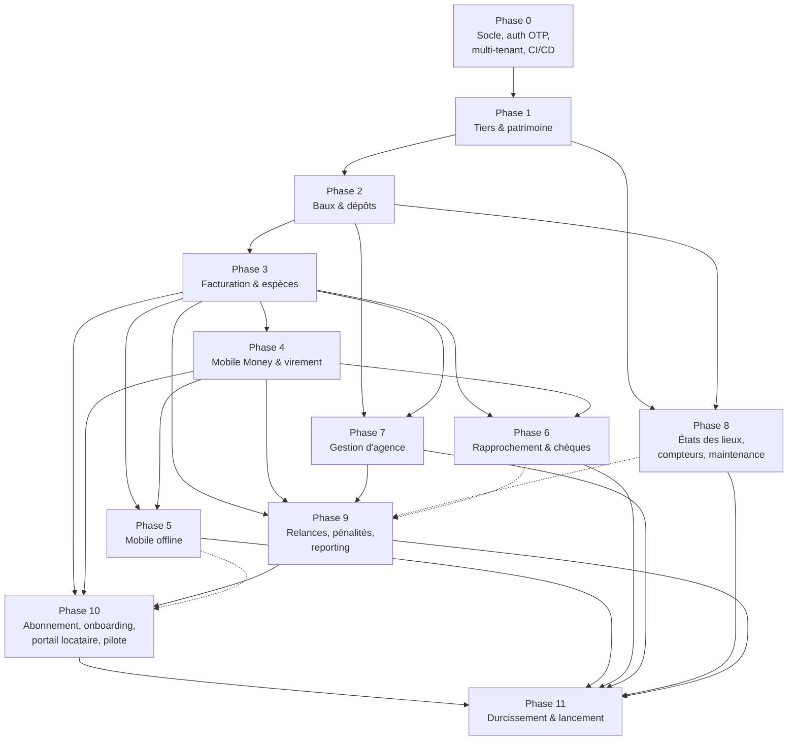

# Immodesk — Plan de phases (Phases 0 à 11)

Document de delivery. Il décline le référentiel `_DECISIONS_COMMUNES.md` en douze phases exécutables, chacune décrite par son objectif, ses prérequis, son périmètre (epics et user stories), les tables et modules concernés, les endpoints, les écrans, les tests, les livrables, la charge et les risques.

**Règles d'usage du document**

- La numérotation des phases est celle du référentiel et **ne doit jamais être renumérotée**. Une nouvelle brique s'insère dans une phase existante ou fait l'objet d'une phase 12+.
- Les noms de tables, colonnes, statuts, rôles et modules cités ici sont **normatifs** et repris tels quels du référentiel. Toute divergence se règle en faveur du référentiel.
- Une phase n'est déclarée terminée que lorsque **tous** les points de sa Definition of Done sont cochés en revue de fin de phase, en présence du PO, du lead technique et de la QA.
- Les charges sont exprimées en **semaines-personnes** (sp) : une personne à temps plein pendant une semaine. La durée indicative est la durée calendaire de la phase, chevauchements compris.
- Les rôles cités dans la colonne « Rôle requis » des tableaux d'endpoints sont ceux du référentiel : `OWNER`, `MANAGER`, `COLLECTOR`, `ACCOUNTANT`, `VIEWER`, auxquels s'ajoute `TENANT` (utilisateur locataire du portail, sans appartenance à `organization_members`) et `PUBLIC` (route non authentifiée).

**Vue d'ensemble du séquencement**

| Phase | Intitulé court                                         | Durée indicative | Jalon de sortie                                            |
| :---- | :----------------------------------------------------- | :--------------- | :--------------------------------------------------------- |
| 0     | Socle technique, auth OTP, multi-tenant                | 6 semaines       | Squelette déployé sur staging, connexion OTP fonctionnelle |
| 1     | Tiers & patrimoine                                     | 4 semaines       | Une agence peut saisir son portefeuille complet            |
| 2     | Baux & dépôts                                          | 4 semaines       | Contrat de bail PDF généré et archivé                      |
| 3     | Facturation & espèces                                  | 7 semaines       | Quittance envoyée par WhatsApp après encaissement espèces  |
| 4     | Mobile Money & virement déclaré                        | 5 semaines       | Loyer payé de bout en bout par Mobile Money                |
| 5     | Application mobile offline                             | 8 semaines       | Démarcheur encaisse hors réseau et synchronise             |
| 6     | Rapprochement bancaire & chèques                       | 4 semaines       | Relevé bancaire importé et rapproché à 80 %                |
| 7     | Gestion d'agence                                       | 5 semaines       | Relevé de gérance mensuel et reversement bailleur          |
| 8     | États des lieux, compteurs & charges, maintenance      | 5 semaines       | Charges d'eau et d'électricité refacturées                 |
| 9     | Relances, pénalités, reporting                         | 4 semaines       | Relances automatiques et tableau de bord impayés           |
| 10    | Abonnement SaaS, onboarding, portail locataire, pilote | 6 semaines       | Pilote Brazzaville en production                           |
| 11    | Durcissement et lancement commercial                   | 5 semaines       | Go-live commercial                                         |

**Décision transverse à valider avant le démarrage d'une phase** : le taux et la durée du programme d'apport d'affaires (commission en bps sur `subscription_invoices`, durée d'éligibilité en mois, montant minimum de versement, plafond mensuel par partenaire) doivent être tranchés avant le démarrage de la phase 10 — voir la liste des décisions à prendre en section 10.2.

---

# Phase 0 — Cadrage, monorepo, CI/CD, infra, auth OTP, multi-tenant, design system, OpenAPI

## 0.1 Objectif et valeur livrée

Poser un socle sur lequel les onze phases suivantes s'appuieront sans jamais avoir à revenir en arrière : monorepo opérationnel, pipeline d'intégration continue, environnements dev/staging/prod, isolation multi-tenant vérifiée par des tests, authentification par téléphone et OTP, design system et contrat d'API publié.

La valeur livrée est technique et non fonctionnelle pour le client final, mais elle est décisive : un utilisateur peut créer une organisation, s'y connecter avec son numéro de téléphone, inviter un collègue et lui attribuer un rôle. Toute la sécurité applicative du produit repose sur ce que l'on décide ici.

## 0.2 Prérequis

- **Phases précédentes** : aucune.
- **Contrats externes à obtenir** — à lancer dès le jour 1, voir la checklist de démarrage en fin de document :
  - compte agrégateur Mobile Money (CinetPay ou équivalent) : dossier KYC entreprise, délai bancaire CEMAC long et imprévisible ;
  - **accès Meta WhatsApp Business Cloud API : prérequis bloquant à lancer dès le jour 1** (compte Meta Business et numéro WhatsApp dédié), vérification Meta Business, templates à soumettre ;
  - passerelle SMS locale pour l'envoi des OTP (indispensable dès cette phase, car WhatsApp est le canal par défaut et le SMS le canal de repli automatique) ;
  - comptes cloud (VPS Hetzner/OVH région Europe-Paris avec reverse proxy Caddy), GitHub, GlitchTip auto-hébergé, MinIO auto-hébergé.
- **Équipement à acquérir dès le jour 1** :
  - téléphone Android dédié et carte SIM MTN (forfait SMS illimité), servant de passerelle SMS de repli pour le pilote.
- **Décisions à prendre en début de phase** :
  - stratégie d'isolation multi-tenant : **RLS PostgreSQL** sur toutes les tables portant `organization_id`, avec `SET LOCAL app.current_organization_id` par requête — décision actée dans le référentiel, à implémenter et à prouver par test ;
  - format des identifiants : **UUID v7 généré par l'application**, `gen_random_uuid()` en défaut SQL ;
  - convention de nommage des modules NestJS (Clean Architecture : `domain/`, `application/`, `infrastructure/`, `presentation/`) ;
  - politique de versions et de branches (voir « Stratégie de release »).

## 0.3 Périmètre détaillé

### Epic 0.A — Monorepo et outillage

- En tant que développeur, je veux un monorepo `apps/api`, `apps/web`, `apps/mobile`, `packages/shared`, `infra/` afin de partager les types, les énumérations et les schémas de validation entre backend, web et mobile.
- En tant que développeur, je veux une commande unique de démarrage local (Docker Compose : PostgreSQL 16, Redis, MinIO en substitut R2) afin d'être productif en moins de trente minutes sur un poste neuf.
- En tant que lead technique, je veux un pipeline GitHub Actions (lint, typecheck, tests, build, migrations Prisma en dry-run) afin qu'aucune pull request non conforme ne soit fusionnée.

### Epic 0.B — Socle multi-tenant et sécurité

- En tant que responsable sécurité, je veux que chaque table portant `organization_id` soit protégée par Row Level Security afin qu'une erreur de code applicatif ne puisse pas exposer les données d'une autre organisation.
- En tant que développeur, je veux un intercepteur NestJS qui ouvre la transaction, positionne `app.current_organization_id` et la referme, afin que la RLS soit systématiquement active sans effort côté cas d'usage.
- En tant qu'auditeur, je veux que toute transition d'état écrive dans `audit_logs` avec le JSONB avant/après, afin de pouvoir reconstituer l'historique d'un enregistrement.

### Epic 0.C — Authentification téléphone + OTP

- En tant qu'utilisateur, je veux me connecter avec mon numéro de téléphone et un code reçu par WhatsApp (canal par défaut), avec repli automatique par SMS si WhatsApp est indisponible, afin de ne pas avoir à retenir un mot de passe.
- En tant qu'utilisateur, je veux rester connecté un mois sans ressaisir mon code, afin de ne pas être interrompu en tournée.
- En tant que responsable sécurité, je veux que les OTP expirent en 5 minutes, soient limités à 5 tentatives et soient stockés hachés dans `otp_codes`, afin de contenir les attaques par force brute.

### Epic 0.D — Organisations, membres et invitations

- En tant que fondateur d'agence, je veux créer mon organisation de type `AGENCY` et devenir automatiquement `OWNER`, afin de démarrer immédiatement.
- En tant que bailleur seul, je veux créer une organisation de type `INDEPENDENT_LANDLORD` afin de gérer mes biens sans structure d'agence.
- En tant qu'`OWNER`, je veux inviter un collaborateur par son numéro de téléphone avec un rôle prédéfini, afin de constituer mon équipe.

### Epic 0.E — Design system et contrat d'API

- En tant que développeur web, je veux un design system Tailwind + shadcn/ui avec les composants de base (formulaires, tableaux, badges de statut, sélecteur de montant XAF) afin d'assurer une cohérence visuelle sur tout le produit.
- En tant que développeur mobile, je veux un client Dart généré à partir de l'OpenAPI 3.1 afin de ne jamais écrire d'appel HTTP à la main.

### Critères d'acceptation (Gherkin)

```gherkin
Scénario: Connexion réussie par OTP
  Étant donné un utilisateur enregistré avec le numéro "+242066000001"
  Et qu'aucun OTP valide n'existe pour ce numéro
  Quand il demande un code sur "POST /auth/otp/request"
  Alors un enregistrement est créé dans "otp_codes" avec un code haché et une expiration à 5 minutes
  Et un message est envoyé via le canal WhatsApp (canal par défaut) et tracé dans "message_logs"
  Quand il soumet le bon code sur "POST /auth/otp/verify"
  Alors il reçoit un JWT d'accès valide 15 minutes et un refresh token valide 30 jours
  Et l'OTP est marqué consommé et ne peut plus être réutilisé
```

```gherkin
Scénario: Repli automatique par SMS si WhatsApp échoue
  Étant donné un utilisateur enregistré avec le numéro "+242066000002"
  Et que ce numéro n'a pas WhatsApp actif, ou que l'envoi WhatsApp échoue
  Quand il demande un code sur "POST /auth/otp/request"
  Alors le système tente l'envoi via le canal WhatsApp
  Et bascule automatiquement vers la passerelle SMS Android sans nouvelle action de l'utilisateur
  Et le canal effectivement utilisé est tracé dans "message_logs"
```

```gherkin
Scénario: Blocage après cinq codes erronés
  Étant donné un OTP actif pour le numéro "+242066000001"
  Quand l'utilisateur soumet un code erroné 5 fois de suite
  Alors la 5e tentative renvoie une erreur 429
  Et l'OTP est invalidé
  Et une entrée est écrite dans "audit_logs" avec l'action "OTP_LOCKED"
```

```gherkin
Scénario: Isolation stricte entre deux organisations
  Étant donné une organisation A et une organisation B
  Et un utilisateur membre de A uniquement
  Quand il appelle une route de lecture avec un identifiant de ressource appartenant à B
  Alors la réponse est 404 et non 403
  Et aucune ligne de B n'est retournée, la politique RLS filtrant la requête en base
```

```gherkin
Scénario: Rotation du refresh token
  Étant donné un refresh token valide stocké dans "refresh_tokens"
  Quand il est présenté sur "POST /auth/refresh"
  Alors un nouveau couple access/refresh est émis
  Et l'ancien refresh token est marqué révoqué
  Quand l'ancien refresh token est présenté une seconde fois
  Alors la réponse est 401
  Et toute la famille de tokens de cet appareil est révoquée
```

## 0.4 Tables et modules concernés

**Tables** : `organizations`, `organization_settings`, `organization_members`, `users`, `user_credentials`, `otp_codes`, `refresh_tokens`, `invitations`, `api_keys`, `audit_logs`, `feature_flags`, `idempotency_keys`, `notification_templates`, `message_logs`.

**Modules NestJS (Clean Architecture)** :

| Module      | Responsabilité                                                                                                                      |
| :---------- | :---------------------------------------------------------------------------------------------------------------------------------- |
| `iam`       | Authentification OTP, JWT, refresh tokens, `api_keys`, gardes de rôles                                                              |
| `tenancy`   | `organizations`, `organization_settings`, `organization_members`, `invitations`, contexte de tenant et RLS                          |
| `messaging` | Interfaces `SmsProvider` et `WhatsAppProvider`, `notification_templates`, `message_logs` (implémentation SMS uniquement en phase 0) |
| `audit`     | Écriture de `audit_logs`, décorateur `@Audited`                                                                                     |
| `platform`  | Santé, configuration, `feature_flags`, `idempotency_keys`, génération OpenAPI                                                       |

## 0.5 Endpoints API principaux

| Méthode | Route                                    | Rôle requis | Description courte                                          |
| :------ | :--------------------------------------- | :---------- | :---------------------------------------------------------- |
| POST    | `/auth/otp/request`                      | PUBLIC      | Demande un code OTP pour un numéro de téléphone             |
| POST    | `/auth/otp/verify`                       | PUBLIC      | Vérifie l'OTP et émet les jetons                            |
| POST    | `/auth/refresh`                          | PUBLIC      | Rotation du refresh token                                   |
| POST    | `/auth/logout`                           | Authentifié | Révoque le refresh token de l'appareil                      |
| GET     | `/me`                                    | Authentifié | Profil de l'utilisateur et liste de ses organisations       |
| POST    | `/organizations`                         | Authentifié | Crée une organisation `AGENCY` ou `INDEPENDENT_LANDLORD`    |
| GET     | `/organizations/{id}`                    | VIEWER      | Détail d'une organisation                                   |
| GET     | `/organizations/{id}/settings`           | MANAGER     | Lit `organization_settings`                                 |
| PATCH   | `/organizations/{id}/settings`           | OWNER       | Met à jour les paramètres (jour d'échéance, fuseau, devise) |
| GET     | `/organizations/{id}/members`            | MANAGER     | Liste les membres et leurs rôles                            |
| PATCH   | `/organizations/{id}/members/{memberId}` | OWNER       | Change le rôle d'un membre                                  |
| DELETE  | `/organizations/{id}/members/{memberId}` | OWNER       | Retire un membre                                            |
| POST    | `/organizations/{id}/invitations`        | OWNER       | Invite un collaborateur avec un rôle                        |
| POST    | `/invitations/{token}/accept`            | Authentifié | Accepte une invitation                                      |
| GET     | `/feature-flags`                         | Authentifié | Flags actifs pour l'organisation courante                   |
| GET     | `/health`                                | PUBLIC      | Sonde de disponibilité (base, Redis, stockage)              |
| GET     | `/openapi.json`                          | PUBLIC      | Contrat OpenAPI 3.1                                         |

## 0.6 Écrans concernés

**Web — dashboard agence/bailleur (Next.js)**

- Écran de connexion (saisie du numéro, saisie du code à 6 chiffres, renvoi de code avec compte à rebours).
- Assistant de création d'organisation (type d'organisation, raison sociale, ville, téléphone, logo).
- Paramètres de l'organisation (identité, jour d'échéance par défaut, fuseau `Africa/Brazzaville`).
- Gestion de l'équipe : liste des membres, invitation, changement de rôle, retrait.
- Sélecteur d'organisation dans l'en-tête pour les utilisateurs multi-organisations.
- Page d'erreur et page « accès refusé » cohérentes avec le design system.

**Mobile (Flutter)**

- Écran de connexion OTP, stockage sécurisé du refresh token (`flutter_secure_storage`).
- Écran de sélection d'organisation.
- Écran « à propos / diagnostic » (version, état réseau, dernière synchronisation) — coquille qui sera enrichie en phase 5.

**Portail locataire** : non ouvert en phase 0 (livré en phase 10), mais la route d'authentification est commune.

## 0.7 Tests exigés

- **Unitaires** : génération et vérification d'OTP, hachage, expiration, comptage de tentatives ; émission et rotation de JWT ; résolution du rôle effectif d'un utilisateur dans une organisation. Couverture minimale 80 % sur les modules `iam` et `tenancy`.
- **Intégration** : suite dédiée « RLS » qui, pour chaque table portant `organization_id`, vérifie qu'une requête exécutée sous le contexte de l'organisation A ne retourne aucune ligne de l'organisation B, en lecture comme en écriture. Cette suite est bloquante en CI et doit être étendue à chaque nouvelle table dans toutes les phases suivantes.
- **Intégration** : cycle complet demande d'OTP → envoi simulé → vérification → appel authentifié → rafraîchissement → déconnexion.
- **e2e (Playwright)** : parcours « nouvel utilisateur → création d'organisation → invitation d'un second utilisateur → acceptation → visibilité partagée ».
- **Sécurité** : test de rejeu d'un refresh token révoqué, test de limitation de débit sur `/auth/otp/request` (par numéro et par adresse IP).
- **Terrain** : réception effective d'un SMS OTP sur les réseaux congolais (MTN et Airtel), mesure du délai médian de réception sur 30 envois répartis sur la journée.

## 0.8 Livrables et critères de sortie

- [ ] Monorepo publié sur GitHub avec protection de la branche principale et revue obligatoire.
- [ ] `docker compose up` démarre l'ensemble de la pile locale et exécute les migrations et les données de démonstration.
- [ ] Pipeline CI vert : lint, typecheck, tests unitaires, tests d'intégration, build des trois applications.
- [ ] Environnements `dev`, `staging`, `prod` provisionnés (région Europe-Paris), avec secrets gérés hors du dépôt.
- [ ] Sauvegarde PostgreSQL quotidienne chiffrée configurée et **restauration testée au moins une fois** sur staging.
- [ ] GlitchTip et Grafana/Prometheus branchés sur l'API et le web.
- [ ] Politique RLS active sur toutes les tables du périmètre de la phase, suite de tests d'isolation verte.
- [ ] Authentification OTP complète (WhatsApp par défaut, repli SMS automatique), rotation de refresh token, révocation, limitation de débit.
- [ ] Design system publié (tokens, composants de base, formatage des montants XAF sans décimale).
- [ ] `openapi.json` généré automatiquement, clients TypeScript et Dart générés et publiés dans `packages/shared`.
- [ ] Table `feature_flags` opérationnelle avec au moins un flag de démonstration lisible côté web et mobile.
- [ ] Registre des décisions d'architecture (ADR) initialisé avec les décisions de la phase.
- [ ] Démarches Mobile Money et WhatsApp Business **lancées dès le jour 1 et tracées** avec un référent nommé et une date de relance ; téléphone Android passerelle et carte SIM MTN acquis.

## 0.9 Durée et charge

Durée indicative : **6 semaines**.

| Profil               | Semaines-personnes |
| :------------------- | :----------------- |
| Backend NestJS       | 8 sp               |
| Frontend web Next.js | 5 sp               |
| Mobile Flutter       | 3 sp               |
| DevOps / infra       | 5 sp               |
| QA                   | 3 sp               |
| Product / QA terrain | 2 sp               |
| **Total**            | **26 sp**          |

## 0.10 Risques et plan B

| Risque                                                                 | Impact                                          | Probabilité | Plan B                                                                                                                                                                         |
| :--------------------------------------------------------------------- | :---------------------------------------------- | :---------- | :----------------------------------------------------------------------------------------------------------------------------------------------------------------------------- |
| Délai d'obtention du compte agrégateur Mobile Money supérieur à 3 mois | Fort — bloque la phase 4                        | Élevée      | Lancer le dossier au jour 1, ouvrir en parallèle un dossier chez un second agrégateur, développer la phase 4 contre un simulateur conforme à l'interface `MobileMoneyProvider` |
| Vérification Meta Business refusée ou lente                            | Fort — bloque l'envoi des quittances en phase 3 | Élevée      | Basculer les envois sur la passerelle SMS locale via l'interface `SmsProvider`, avec lien court vers la quittance                                                              |
| Passerelle SMS locale peu fiable pour les OTP                          | Fort — bloque toute connexion                   | Moyenne     | Contractualiser deux passerelles et implémenter un basculement automatique dès la phase 0 ; OTP par WhatsApp en secours une fois Meta obtenu                                   |
| Complexité RLS sous-estimée, requêtes lentes                           | Moyen                                           | Moyenne     | Index systématique sur `organization_id`, revue de plan d'exécution sur les requêtes critiques, gabarit de politique RLS unique réutilisé partout                              |
| Équipe non complète au démarrage                                       | Moyen                                           | Moyenne     | Prioriser backend et DevOps, décaler le mobile en phase 1, recruter en parallèle                                                                                               |

---

# Phase 1 — Tiers & patrimoine

## 1.1 Objectif et valeur livrée

Permettre à une agence ou à un bailleur indépendant de saisir la totalité de son portefeuille : bailleurs, locataires, garants, canaux de contact, immeubles, lots, comptes bancaires et pièces justificatives. À l'issue de la phase, une agence pilote peut être « chargée » dans le produit et y retrouver son patrimoine réel, ce qui rend possible toutes les phases contractuelles et financières.

## 1.2 Prérequis

- **Phases précédentes** : phase 0 terminée (multi-tenant, auth, design system, CI).
- **Contrats externes** : aucun. Le stockage objet est MinIO auto-hébergé (URL signées, cycle de vie des objets) ; Cloudflare R2 seulement si le volume l'exige.
- **Décisions à prendre** :
  - typologie des lots (`units`) retenue pour le marché congolais : studio, appartement, villa, chambre, magasin/local commercial, entrepôt, parcelle ;
  - modèle d'adressage local : ville, arrondissement, quartier (Poto-Poto, Bacongo, Makélékélé, Mpila, Talangaï…), rue et repère, la numérotation postale n'étant pas fiable ;
  - normalisation des numéros de téléphone au format E.164 `+242…` et gestion des numéros multiples par tiers via `contact_channels` ;
  - politique de rétention et de classification des pièces d'identité dans `documents`.

## 1.3 Périmètre détaillé

### Epic 1.A — Bailleurs et mandants

- En tant que `MANAGER`, je veux créer une fiche bailleur (personne physique ou morale) avec ses coordonnées et ses comptes bancaires, afin de pouvoir lui rattacher des biens et, plus tard, lui reverser ses loyers.
- En tant qu'`OWNER` d'une organisation `INDEPENDENT_LANDLORD`, je veux qu'un bailleur « self » soit créé automatiquement à la création de l'organisation, afin de ne pas avoir à me saisir moi-même comme tiers.

### Epic 1.B — Locataires et garants

- En tant que `MANAGER`, je veux créer une fiche locataire avec pièce d'identité, profession, employeur et personne à prévenir, afin de disposer du dossier requis avant la signature d'un bail.
- En tant que `MANAGER`, je veux rattacher un garant optionnel à un locataire, afin de sécuriser le recouvrement.
- En tant que `MANAGER`, je veux enregistrer plusieurs canaux de contact par tiers (téléphone d'appel, numéro WhatsApp distinct, email) avec un canal préféré, afin que les relances partent sur le bon numéro.

### Epic 1.C — Immeubles et lots

- En tant que `MANAGER`, je veux créer un immeuble avec sa localisation (ville, arrondissement, quartier, repère) et son bailleur, afin de structurer le portefeuille.
- En tant que `MANAGER`, je veux créer des lots en série (« créer 12 lots numérotés A1 à A12 ») afin de ne pas saisir douze formulaires.
- En tant que `MANAGER`, je veux voir en un coup d'œil le taux d'occupation d'un immeuble, afin d'identifier les lots vacants à commercialiser.

### Epic 1.D — Comptes bancaires et documents

- En tant qu'`ACCOUNTANT`, je veux enregistrer les comptes bancaires (`bank_accounts`) de l'organisation et des bailleurs, avec banque, RIB et titulaire, afin de préparer virements et rapprochements.
- En tant que `MANAGER`, je veux téléverser une pièce jointe (pièce d'identité, titre foncier, photo du bien) rattachée à n'importe quelle entité, afin de centraliser le dossier.
- En tant que responsable sécurité, je veux que les fichiers ne soient accessibles que par URL signée à durée limitée, afin d'éviter toute fuite par lien partagé.

### Critères d'acceptation (Gherkin)

```gherkin
Scénario: Création d'un immeuble avec lots en série
  Étant donné un bailleur "SCI Mpila" existant dans l'organisation courante
  Quand un MANAGER crée l'immeuble "Résidence Mpila" à Brazzaville, quartier Mpila
  Et demande la création en série de 12 lots de type "APARTMENT" numérotés de "A1" à "A12"
  Alors 12 lignes sont créées dans "units" rattachées à la ligne de "properties" créée
  Et chaque lot a le statut vacant
  Et le taux d'occupation affiché de l'immeuble est de 0 %
```

```gherkin
Scénario: Unicité du numéro de téléphone d'un locataire dans l'organisation
  Étant donné un locataire existant avec le canal de contact "+242066123456" dans l'organisation A
  Quand un MANAGER tente de créer un second locataire avec le même numéro dans l'organisation A
  Alors la création est refusée avec un message indiquant le locataire existant
  Quand le même numéro est saisi dans l'organisation B
  Alors la création est acceptée, l'unicité étant portée par organisation
```

```gherkin
Scénario: Accès à un document par URL signée
  Étant donné un document rattaché à un locataire de l'organisation A
  Quand un MANAGER de l'organisation A demande le lien de téléchargement
  Alors une URL signée valable 10 minutes est retournée
  Quand cette URL est appelée après son expiration
  Alors le stockage refuse l'accès
  Et un membre de l'organisation B qui demande le lien reçoit une réponse 404
```

```gherkin
Scénario: Suppression logique d'un lot occupé
  Étant donné un lot rattaché à un bail actif
  Quand un MANAGER tente de supprimer ce lot
  Alors la suppression est refusée avec le motif "lot rattaché à un bail actif"
  Et la colonne "deleted_at" du lot reste nulle
```

## 1.4 Tables et modules concernés

**Tables** : `landlords`, `tenants`, `guarantors`, `contact_channels`, `properties`, `units`, `bank_accounts`, `documents`, `audit_logs`.

**Modules NestJS** :

| Module      | Responsabilité                                                         |
| :---------- | :--------------------------------------------------------------------- |
| `parties`   | `landlords`, `tenants`, `guarantors`, `contact_channels`               |
| `portfolio` | `properties`, `units`, indicateurs d'occupation                        |
| `banking`   | `bank_accounts` (partagé ensuite avec `reconciliation` et `payouts`)   |
| `documents` | Téléversement R2, URL signées, classification, rattachement polymorphe |

## 1.5 Endpoints API principaux

| Méthode | Route                                   | Rôle requis | Description courte                                       |
| :------ | :-------------------------------------- | :---------- | :------------------------------------------------------- |
| POST    | `/landlords`                            | MANAGER     | Crée un bailleur                                         |
| GET     | `/landlords`                            | VIEWER      | Liste paginée et recherche des bailleurs                 |
| GET     | `/landlords/{id}`                       | VIEWER      | Détail d'un bailleur et de ses biens                     |
| PATCH   | `/landlords/{id}`                       | MANAGER     | Met à jour un bailleur                                   |
| DELETE  | `/landlords/{id}`                       | OWNER       | Suppression logique (`deleted_at`)                       |
| POST    | `/tenants`                              | MANAGER     | Crée un locataire                                        |
| GET     | `/tenants`                              | VIEWER      | Liste et recherche par nom ou téléphone                  |
| PATCH   | `/tenants/{id}`                         | MANAGER     | Met à jour un locataire                                  |
| POST    | `/tenants/{id}/guarantors`              | MANAGER     | Ajoute un garant                                         |
| POST    | `/parties/{type}/{id}/contact-channels` | MANAGER     | Ajoute un canal de contact                               |
| PATCH   | `/contact-channels/{id}`                | MANAGER     | Modifie ou marque un canal comme préféré                 |
| POST    | `/properties`                           | MANAGER     | Crée un immeuble                                         |
| GET     | `/properties`                           | VIEWER      | Liste des immeubles avec taux d'occupation               |
| GET     | `/properties/{id}`                      | VIEWER      | Détail d'un immeuble et de ses lots                      |
| POST    | `/properties/{id}/units`                | MANAGER     | Crée un lot                                              |
| POST    | `/properties/{id}/units/bulk`           | MANAGER     | Crée des lots en série                                   |
| PATCH   | `/units/{id}`                           | MANAGER     | Met à jour un lot (loyer de référence, superficie, type) |
| GET     | `/units`                                | VIEWER      | Liste des lots filtrable par statut d'occupation         |
| POST    | `/bank-accounts`                        | ACCOUNTANT  | Enregistre un compte bancaire                            |
| GET     | `/bank-accounts`                        | ACCOUNTANT  | Liste des comptes de l'organisation et des bailleurs     |
| POST    | `/documents/upload-url`                 | MANAGER     | Demande une URL signée de téléversement                  |
| POST    | `/documents`                            | MANAGER     | Enregistre le document après téléversement               |
| GET     | `/documents/{id}/download-url`          | VIEWER      | URL signée de téléchargement                             |
| DELETE  | `/documents/{id}`                       | MANAGER     | Supprime un document                                     |

## 1.6 Écrans concernés

**Web — dashboard**

- Liste des bailleurs avec recherche, filtre par ville et création rapide.
- Fiche bailleur : identité, coordonnées, comptes bancaires, biens rattachés, documents.
- Liste des locataires avec recherche par nom, téléphone ou lot.
- Fiche locataire : identité, pièce d'identité, garants, canaux de contact, documents, historique (vide à ce stade).
- Liste des immeubles en cartes avec taux d'occupation, et vue tableau des lots.
- Fiche immeuble : localisation, bailleur, liste des lots avec statut, création de lots en série.
- Fiche lot : caractéristiques, loyer de référence, photos.
- Composant transverse de téléversement de documents (glisser-déposer, barre de progression, prévisualisation image et PDF).

**Mobile (Flutter)**

- Consultation en lecture seule du portefeuille (immeubles, lots, locataires) avec recherche locale.
- Fiche locataire consultable en tournée (nom, numéro, lot, appel direct et ouverture WhatsApp).
- Prise de photo d'un bien rattachée à un lot.

## 1.7 Tests exigés

- **Unitaires** : normalisation E.164 des numéros congolais (saisies `066123456`, `+242 06 612 34 56`, `00242066123456` → `+242066123456`) ; calcul du taux d'occupation ; génération d'une série de numéros de lots.
- **Intégration** : création en série de 12 lots dans une transaction unique ; refus de suppression d'un lot lié à un bail ; unicité du couple `(organization_id, phone)` sur `contact_channels` ; extension de la suite RLS aux nouvelles tables.
- **Intégration stockage** : téléversement vers R2, expiration effective de l'URL signée, refus d'accès cross-organisation.
- **e2e** : parcours « créer un bailleur → créer un immeuble → créer 12 lots → créer un locataire avec garant → téléverser une pièce d'identité ».
- **Performance** : liste de 500 lots et 300 locataires rendue en moins de 800 ms au 95e centile côté API.
- **Terrain** : atelier de saisie avec une agence pilote, chronométrage du temps réel de saisie d'un immeuble de 12 lots (cible : moins de 15 minutes), relevé des champs manquants ou inutiles.

## 1.8 Livrables et critères de sortie

- [ ] Toutes les tables de la phase migrées via Prisma, avec index et contraintes d'unicité documentés.
- [ ] RLS active et testée sur `landlords`, `tenants`, `guarantors`, `contact_channels`, `properties`, `units`, `bank_accounts`, `documents`.
- [ ] Endpoints publiés dans l'OpenAPI et clients régénérés.
- [ ] Écrans web de gestion du portefeuille complets et conformes au design system.
- [ ] Import initial d'au moins une agence pilote réelle réalisé et validé par elle.
- [ ] Téléversement de documents opérationnel avec URL signées et limite de taille appliquée.
- [ ] Suppression logique effective sur les entités de référence, aucune suppression physique possible via l'API.
- [ ] Journalisation `audit_logs` sur création, modification et suppression logique de chaque entité de la phase.
- [ ] Documentation utilisateur courte (2 pages) « saisir mon portefeuille ».

## 1.9 Durée et charge

Durée indicative : **4 semaines**.

| Profil               | Semaines-personnes |
| :------------------- | :----------------- |
| Backend NestJS       | 5 sp               |
| Frontend web Next.js | 5 sp               |
| Mobile Flutter       | 2 sp               |
| DevOps / infra       | 1 sp               |
| QA                   | 2 sp               |
| Product / QA terrain | 2 sp               |
| **Total**            | **17 sp**          |

## 1.10 Risques et plan B

| Risque                                                            | Impact                   | Probabilité | Plan B                                                                                     |
| :---------------------------------------------------------------- | :----------------------- | :---------- | :----------------------------------------------------------------------------------------- |
| Modèle d'adressage inadapté aux quartiers de Brazzaville          | Moyen                    | Moyenne     | Champ « repère » libre obligatoire et géolocalisation optionnelle du lot dès la phase 1    |
| Données existantes des agences sur papier ou Excel hétérogène     | Fort — freine l'adoption | Élevée      | Fournir un gabarit d'import CSV et une prestation de reprise assistée dès la phase 1       |
| Numéros de téléphone partagés entre plusieurs locataires (foyers) | Moyen                    | Moyenne     | Unicité en avertissement plutôt qu'en blocage, avec confirmation explicite du gestionnaire |
| Volume de photos supérieur au budget de stockage                  | Faible                   | Moyenne     | Compression côté client, limite de taille et politique de cycle de vie R2                  |

---

# Phase 2 — Baux & dépôts

## 2.1 Objectif et valeur livrée

Transformer le patrimoine saisi en relation contractuelle : création d'un bail rattachant un locataire à un lot, définition des conditions financières (loyer, charges, jour d'échéance, périodicité), gestion du dépôt de garantie et de ses mouvements, génération du contrat de bail en PDF et archivage. À la fin de la phase, une agence peut sortir un contrat imprimable conforme aux usages congolais et suivre les dépôts de garantie qu'elle détient.

## 2.2 Prérequis

- **Phases précédentes** : phases 0 et 1.
- **Contrats externes** : aucun nouveau, mais validation juridique du modèle de contrat de bail (habitation et bail commercial) par un conseil local ; ce point doit être lancé dès le début de la phase.
- **Décisions à prendre** :
  - périodicités supportées : mensuelle (défaut), trimestrielle, semestrielle, annuelle ;
  - règle du jour d'échéance et gestion des mois courts (échéance au 31 → dernier jour du mois) ;
  - nombre de mois de dépôt de garantie et éventuelle avance de loyers, pratique courante localement ;
  - modèle de calcul du prorata d'entrée et de sortie (au jour calendaire, base mois réel) ;
  - liste des mentions légales obligatoires du contrat, arrêtée avec le conseil juridique.

## 2.3 Périmètre détaillé

### Epic 2.A — Cycle de vie du bail

- En tant que `MANAGER`, je veux créer un bail entre un locataire et un lot avec date d'effet, durée, loyer, charges forfaitaires et jour d'échéance, afin de contractualiser la location.
- En tant que `MANAGER`, je veux qu'un bail passe par les états brouillon, actif, résilié et expiré, afin de refléter la réalité juridique et de piloter la facturation.
- En tant que `MANAGER`, je veux ajouter des parties au bail (colocataires, garants, représentant du bailleur) via `lease_parties`, afin que le contrat mentionne tous les signataires.
- En tant que `MANAGER`, je veux réviser le loyer à une date donnée en conservant l'historique, afin que les factures passées restent inchangées.
- En tant que `MANAGER`, je veux résilier un bail avec un motif et une date d'effet, afin de déclencher la clôture du dépôt et l'arrêt de la facturation.

### Epic 2.B — Dépôts de garantie

- En tant qu'`ACCOUNTANT`, je veux enregistrer l'encaissement d'un dépôt de garantie et suivre son solde, afin de savoir à tout moment combien l'agence détient pour le compte des locataires.
- En tant qu'`ACCOUNTANT`, je veux enregistrer les mouvements du dépôt (encaissement, retenue, restitution) dans `deposit_movements`, afin de justifier chaque euro retenu en fin de bail.
- En tant que `MANAGER`, je veux qu'à la résiliation, le solde du dépôt soit calculé automatiquement après retenues, afin de préparer la restitution.

### Epic 2.C — Contrat PDF et documents du bail

- En tant que `MANAGER`, je veux générer le contrat de bail en PDF depuis un gabarit paramétré par l'organisation, afin de l'imprimer et de le faire signer.
- En tant que `MANAGER`, je veux téléverser le contrat signé et scanné dans `lease_documents`, afin de disposer de l'original numérisé.
- En tant que `MANAGER`, je veux qu'une version de contrat générée soit immuable et horodatée, afin qu'aucune modification postérieure du bail ne réécrive un document déjà signé.

### Critères d'acceptation (Gherkin)

```gherkin
Scénario: Activation d'un bail et création du dépôt de garantie
  Étant donné un lot vacant et un locataire complet
  Quand un MANAGER crée un bail avec un loyer de 150000 XAF, des charges de 10000 XAF,
    un jour d'échéance au 5 et un dépôt de 2 mois de loyer
  Et qu'il active le bail
  Alors la ligne de "leases" passe à l'état actif
  Et le lot passe au statut occupé
  Et une ligne est créée dans "deposits" avec un montant attendu de 300000 XAF et un solde encaissé de 0 XAF
  Et une entrée est écrite dans "audit_logs" pour la transition d'état
```

```gherkin
Scénario: Refus d'un chevauchement de baux sur un même lot
  Étant donné un bail actif sur le lot "A3" du 01/01/2026 au 31/12/2026
  Quand un MANAGER tente d'activer un second bail sur "A3" à effet du 01/06/2026
  Alors l'activation est refusée avec le motif "chevauchement de baux sur le lot"
  Et aucune ligne n'est ajoutée à "leases" à l'état actif
```

```gherkin
Scénario: Restitution du dépôt après retenues
  Étant donné un bail résilié dont le dépôt encaissé est de 300000 XAF
  Quand un ACCOUNTANT enregistre une retenue de 45000 XAF pour dégradations
  Alors une ligne de type retenue est ajoutée dans "deposit_movements"
  Et le solde restituable calculé est de 255000 XAF
  Quand il enregistre la restitution de 255000 XAF
  Alors une ligne de type restitution est ajoutée
  Et le solde du dépôt est de 0 XAF
  Et aucune ligne de "deposit_movements" n'a été modifiée ni supprimée
```

```gherkin
Scénario: Génération immuable du contrat de bail
  Étant donné un bail actif
  Quand un MANAGER demande la génération du contrat
  Alors un travail est mis en file BullMQ et un PDF est produit par le worker Puppeteer
  Et une ligne est créée dans "lease_documents" avec la version 1, un horodatage et une empreinte SHA-256
  Quand le loyer du bail est révisé puis le contrat régénéré
  Alors une ligne de version 2 est créée
  Et le PDF de la version 1 reste accessible et inchangé
```

## 2.4 Tables et modules concernés

**Tables** : `leases`, `lease_parties`, `lease_documents`, `deposits`, `deposit_movements`, `units` (statut d'occupation), `sequences` (numérotation des baux), `documents`, `audit_logs`.

**Modules NestJS** :

| Module      | Responsabilité                                                                           |
| :---------- | :--------------------------------------------------------------------------------------- |
| `leases`    | Cycle de vie du bail, `lease_parties`, révisions, résiliation, contrôle de chevauchement |
| `deposits`  | `deposits`, `deposit_movements`, calcul du solde restituable                             |
| `pdf`       | Worker BullMQ Puppeteer, gabarits HTML, empreinte et archivage R2                        |
| `numbering` | Table `sequences` verrouillée en transaction, formats de numéros                         |

## 2.5 Endpoints API principaux

| Méthode | Route                            | Rôle requis | Description courte                                       |
| :------ | :------------------------------- | :---------- | :------------------------------------------------------- |
| POST    | `/leases`                        | MANAGER     | Crée un bail à l'état brouillon                          |
| GET     | `/leases`                        | VIEWER      | Liste des baux filtrable par statut, immeuble, locataire |
| GET     | `/leases/{id}`                   | VIEWER      | Détail d'un bail, parties, dépôt, documents              |
| PATCH   | `/leases/{id}`                   | MANAGER     | Modifie un bail en brouillon                             |
| POST    | `/leases/{id}/activate`          | MANAGER     | Active le bail et occupe le lot                          |
| POST    | `/leases/{id}/terminate`         | MANAGER     | Résilie le bail avec motif et date d'effet               |
| POST    | `/leases/{id}/rent-revisions`    | MANAGER     | Enregistre une révision de loyer datée                   |
| POST    | `/leases/{id}/parties`           | MANAGER     | Ajoute une partie au bail                                |
| DELETE  | `/leases/{id}/parties/{partyId}` | MANAGER     | Retire une partie du bail                                |
| POST    | `/leases/{id}/contract`          | MANAGER     | Déclenche la génération du contrat PDF                   |
| GET     | `/leases/{id}/documents`         | VIEWER      | Liste des versions de documents du bail                  |
| POST    | `/leases/{id}/documents`         | MANAGER     | Téléverse un contrat signé scanné                        |
| GET     | `/leases/{id}/deposit`           | ACCOUNTANT  | Détail du dépôt et de ses mouvements                     |
| POST    | `/leases/{id}/deposit/movements` | ACCOUNTANT  | Enregistre encaissement, retenue ou restitution          |
| GET     | `/deposits/summary`              | ACCOUNTANT  | Total des dépôts détenus par l'organisation              |

## 2.6 Écrans concernés

**Web — dashboard**

- Assistant de création de bail en trois étapes : lot et locataire, conditions financières, dépôt et parties.
- Liste des baux avec badges de statut et filtres (actifs, en fin de bail à 90 jours, résiliés).
- Fiche bail : conditions, parties, historique des révisions, dépôt, documents, actions (activer, réviser, résilier, générer le contrat).
- Écran de résiliation : date d'effet, motif, aperçu du solde de dépôt.
- Écran des dépôts de garantie : total détenu, détail par bail, mouvements.
- Prévisualisation du contrat PDF dans le navigateur avant impression.
- Paramétrage du gabarit de contrat au niveau de l'organisation (en-tête, mentions, clauses optionnelles).

**Mobile (Flutter)**

- Consultation d'un bail depuis la fiche du lot ou du locataire.
- Téléchargement et partage du contrat PDF.

## 2.7 Tests exigés

- **Unitaires** : calcul du prorata d'entrée et de sortie ; résolution du jour d'échéance en février et sur les mois de 30 jours ; sélection du loyer applicable à une date donnée en présence de révisions ; calcul du solde restituable du dépôt.
- **Intégration** : refus de chevauchement de baux sur un même lot ; transition d'état invalide refusée (activation d'un bail déjà résilié) ; atomicité de l'activation (bail + statut du lot + dépôt dans une seule transaction).
- **Intégration PDF** : génération asynchrone, empreinte SHA-256 stable pour un même jeu de données, versionnage incrémental, stockage R2 et URL signée.
- **e2e** : parcours « créer un bail → activer → générer le contrat → téléverser le contrat signé → résilier → restituer le dépôt ».
- **Non-régression** : les tests RLS et d'audit sont étendus aux nouvelles tables.
- **Terrain** : relecture du contrat généré par une agence pilote et par un conseil juridique local ; impression réelle sur imprimante A4 pour vérifier marges, sauts de page et lisibilité.

## 2.8 Livrables et critères de sortie

- [ ] Machine à états du bail implémentée, documentée et couverte par des tests de transitions invalides.
- [ ] Contrôle de chevauchement de baux garanti par une contrainte en base et non seulement applicative.
- [ ] Dépôt de garantie avec mouvements append-only et solde calculé, jamais recalculé à la volée sans traçabilité.
- [ ] Génération du contrat PDF en worker BullMQ, avec versionnage et empreinte.
- [ ] Gabarit de contrat validé par un conseil juridique local pour le bail d'habitation et pour le bail commercial.
- [ ] Numérotation des baux via `sequences`, sans trou ni doublon sous charge concurrente (test de 100 créations simultanées).
- [ ] Écrans web complets, y compris la prévisualisation PDF.
- [ ] Documentation utilisateur « créer et gérer un bail ».

## 2.9 Durée et charge

Durée indicative : **4 semaines**.

| Profil               | Semaines-personnes |
| :------------------- | :----------------- |
| Backend NestJS       | 6 sp               |
| Frontend web Next.js | 4 sp               |
| Mobile Flutter       | 1 sp               |
| DevOps / infra       | 1 sp               |
| QA                   | 2 sp               |
| Product / QA terrain | 2 sp               |
| **Total**            | **16 sp**          |

## 2.10 Risques et plan B

| Risque                                                    | Impact                       | Probabilité | Plan B                                                                                                                     |
| :-------------------------------------------------------- | :--------------------------- | :---------- | :------------------------------------------------------------------------------------------------------------------------- |
| Modèle de contrat non conforme aux usages locaux          | Fort — rejet par les agences | Moyenne     | Gabarit paramétrable par organisation et possibilité de téléverser son propre contrat en attendant la validation juridique |
| Worker Puppeteer coûteux en mémoire et instable           | Moyen                        | Moyenne     | Worker dédié isolé, limite de concurrence, redémarrage périodique, file de reprise sur échec                               |
| Pratiques locales d'avance de loyers non modélisées       | Moyen                        | Élevée      | Modéliser l'avance comme un crédit locataire (`tenant_credits`) dès la phase 3, et non comme un dépôt                      |
| Révisions de loyer rétroactives demandées par les agences | Moyen                        | Moyenne     | Interdire la rétroactivité sur période déjà facturée ; passer par un avoir en phase 3                                      |

---

# Phase 3 — Facturation & espèces

## 3.1 Objectif et valeur livrée

C'est la phase qui rend le produit utile au quotidien. Elle installe le moteur de facturation (`rent_invoices` générées par cron mensuel), la séparation stricte facture/paiement, l'encaissement en espèces par les démarcheurs avec reçu numéroté et signature, le contrôle des remises d'espèces à l'agence, et l'émission de la quittance PDF envoyée par WhatsApp.

À la fin de la phase, une agence pilote peut faire tourner un mois complet de loyers en espèces dans Immodesk, du calcul de la facture à la quittance reçue par le locataire sur son téléphone.

## 3.2 Prérequis

- **Phases précédentes** : phases 0, 1 et 2.
- **Contrats externes obligatoires** :
  - **WhatsApp Business Cloud API opérationnel** : compte Meta Business et numéro dédié obtenus dès la phase 0, **au moins deux templates approuvés** ici (quittance de loyer, avis d'échéance). Le délai d'approbation des templates se compte en jours à semaines : les soumettre au plus tard au début de la phase 2.
  - Passerelle SMS de secours (téléphone Android + SIM MTN) opérationnelle, mise en place dès la phase 0.
- **Décisions à prendre** :
  - nombre de jours avant échéance pour la génération des factures (paramètre `organization_settings`, défaut J-5) ;
  - règle d'imputation d'un paiement partiel : la plus ancienne facture d'abord, puis pénalités, puis charges, puis loyer — à figer et à documenter ;
  - traitement du trop-perçu : création systématique d'un `tenant_credits` ;
  - format des numéros de reçus et de quittances, conforme au référentiel : `CASH-{org}-{collector}-{seq}`, `QUI-{YYYYMM}-{seq}`, `LOY-{YYYYMM}-{seq}` ;
  - plafond de détention d'espèces par démarcheur avant remise obligatoire.

## 3.3 Périmètre détaillé

### Epic 3.A — Moteur de facturation

- En tant que `MANAGER`, je veux que les factures de loyer soient générées automatiquement chaque mois pour tous les baux actifs, afin de ne plus tenir de tableur.
- En tant que `MANAGER`, je veux qu'une facture porte des lignes distinctes (loyer, charges, pénalités, autres) dans `invoice_lines`, afin que le locataire comprenne ce qu'il paie.
- En tant qu'`ACCOUNTANT`, je veux qu'une facture ne puisse jamais être générée deux fois pour le même bail et la même période, afin d'éviter les doublons de créance.
- En tant que `MANAGER`, je veux pouvoir annuler une facture émise par erreur avec un motif, afin de corriger sans supprimer.

### Epic 3.B — Paiements et affectation

- En tant qu'`ACCOUNTANT`, je veux enregistrer un paiement indépendamment des factures, puis l'affecter à une ou plusieurs factures via `payment_allocations`, afin de gérer les règlements partiels et groupés.
- En tant qu'`ACCOUNTANT`, je veux que le reliquat d'un paiement supérieur au dû devienne un crédit locataire dans `tenant_credits`, afin de l'imputer sur la période suivante.
- En tant qu'`ACCOUNTANT`, je veux contre-passer un paiement erroné par une écriture d'annulation, afin de respecter l'append-only sur `payments`.

### Epic 3.C — Encaissement en espèces

- En tant que `COLLECTOR`, je veux encaisser un loyer en espèces et faire signer le locataire sur mon téléphone, afin de lui remettre immédiatement un reçu numéroté.
- En tant que `COLLECTOR`, je veux que le reçu porte un numéro séquentiel qui m'est propre, afin que l'agence puisse contrôler l'intégralité de mes encaissements.
- En tant que locataire, je veux recevoir mon reçu par WhatsApp, afin d'avoir une preuve même si je perds le papier.

### Epic 3.D — Remises d'espèces

- En tant que `COLLECTOR`, je veux déclarer une remise d'espèces regroupant les reçus que j'ai encaissés, afin de remettre les fonds à l'agence.
- En tant que `MANAGER`, je veux contrôler une remise reçu par reçu et signaler un écart de caisse, afin de sécuriser la chaîne de l'argent liquide.
- En tant qu'`OWNER`, je veux voir en temps réel les espèces détenues par chaque démarcheur et non encore remises, afin de limiter l'exposition.

### Epic 3.E — Quittances et communication

- En tant que locataire, je veux recevoir ma quittance de loyer en PDF par WhatsApp dès que ma facture est soldée, afin d'avoir un justificatif officiel.
- En tant que gestionnaire, je veux qu'un QR code sur la quittance permette de vérifier publiquement son authenticité, afin de lutter contre les faux reçus.
- En tant que `MANAGER`, je veux voir dans `message_logs` si le message a été remis et lu, afin de savoir si le locataire a bien été informé.
- En tant que locataire dont le numéro n'a pas WhatsApp actif ou en cas d'échec de remise WhatsApp, je veux recevoir un SMS de repli contenant un lien vers ma quittance PDF et sa page de vérification QR, afin de disposer malgré tout d'un justificatif accessible.

### Critères d'acceptation (Gherkin)

```gherkin
Scénario: Génération mensuelle des factures de loyer
  Étant donné 40 baux actifs dont le jour d'échéance est le 5
  Et un paramètre d'organisation fixant la génération à J-5
  Quand le travail répétable BullMQ de facturation s'exécute le 31 du mois précédent
  Alors 40 lignes sont créées dans "rent_invoices" au statut ISSUED pour la période du mois à venir
  Et chaque facture porte au moins une ligne de loyer dans "invoice_lines"
  Et le numéro de chaque facture suit le format "LOY-{YYYYMM}-{seq}" sans trou de séquence
  Quand le même travail est relancé manuellement le lendemain
  Alors aucune facture supplémentaire n'est créée, la contrainte d'unicité bail+période s'appliquant
```

```gherkin
Scénario: Paiement partiel en espèces et statut de la facture
  Étant donné une facture ISSUED de 160000 XAF pour le bail "BL-0042"
  Quand un COLLECTOR enregistre un encaissement espèces de 100000 XAF affecté à cette facture
  Alors une ligne est créée dans "payments" avec la méthode CASH et le statut CONFIRMED
  Et une ligne est créée dans "payment_allocations" pour 100000 XAF
  Et la facture passe au statut PARTIALLY_PAID
  Et une ligne est créée dans "cash_receipts" avec un numéro au format "CASH-{org}-{collector}-{seq}"
  Et aucune quittance n'est émise
  Quand un second encaissement de 60000 XAF est affecté à la même facture
  Alors la facture passe au statut PAID
  Et une quittance est créée dans "receipts" avec un numéro "QUI-{YYYYMM}-{seq}"
  Et un message de type quittance est envoyé et tracé dans "message_logs"
```

```gherkin
Scénario: Trop-perçu transformé en crédit locataire
  Étant donné une facture ISSUED de 160000 XAF
  Quand un paiement espèces de 200000 XAF est enregistré et affecté à cette facture
  Alors 160000 XAF sont affectés dans "payment_allocations"
  Et la facture passe au statut PAID
  Et une ligne de 40000 XAF est créée dans "tenant_credits" au bénéfice du locataire
  Et le total des affectations plus le crédit est strictement égal au montant du paiement
```

```gherkin
Scénario: Remise d'espèces avec écart de caisse
  Étant donné un COLLECTOR détenant 5 reçus de caisse pour un total de 750000 XAF
  Quand il crée une remise dans "cash_remittances" incluant ces 5 reçus via "cash_remittance_items"
  Et qu'il déclare remettre 750000 XAF
  Et qu'un MANAGER contrôle la remise et saisit un montant effectivement reçu de 720000 XAF
  Alors la remise est enregistrée avec un écart de 30000 XAF
  Et la remise passe au statut contrôlé avec écart
  Et une entrée est écrite dans "audit_logs" mentionnant l'écart, le contrôleur et le démarcheur
  Et les reçus concernés restent inchangés, aucun paiement n'étant annulé
```

```gherkin
Scénario: Contre-passation d'un paiement erroné
  Étant donné un paiement CONFIRMED de 160000 XAF affecté à une facture PAID
  Quand un ACCOUNTANT demande la contre-passation avec le motif "erreur de locataire"
  Alors le paiement d'origine n'est pas modifié
  Et une écriture d'annulation est créée avec le statut REVERSED et une référence au paiement d'origine
  Et les affectations sont neutralisées
  Et la facture revient au statut ISSUED ou OVERDUE selon la date du jour
  Et la quittance émise est marquée annulée sans être supprimée
```

```gherkin
Scénario: Vérification publique d'une quittance par QR code
  Étant donné une quittance émise portant un token de vérification
  Quand un tiers appelle la route publique de vérification avec ce token
  Alors la réponse indique le numéro de quittance, le montant, la période et le nom du bailleur
  Et aucune donnée personnelle du locataire au-delà de son nom n'est exposée
  Quand le token est falsifié d'un caractère
  Alors la réponse est 404
```

## 3.4 Tables et modules concernés

**Tables** : `sequences`, `rent_invoices`, `invoice_lines`, `payments`, `payment_allocations`, `tenant_credits`, `cash_receipts`, `cash_remittances`, `cash_remittance_items`, `receipts`, `notification_templates`, `notifications`, `message_logs`, `documents`, `audit_logs`.

**Modules NestJS** :

| Module      | Responsabilité                                                                                                |
| :---------- | :------------------------------------------------------------------------------------------------------------ |
| `billing`   | `rent_invoices`, `invoice_lines`, cron de génération, machine à états des factures                            |
| `payments`  | `payments`, `payment_allocations`, `tenant_credits`, contre-passation, moteur d'imputation                    |
| `cash`      | `cash_receipts`, `cash_remittances`, `cash_remittance_items`, signature, contrôle de caisse                   |
| `receipts`  | `receipts`, token de vérification, route publique                                                             |
| `messaging` | Implémentation `WhatsAppProvider` (Meta Cloud API), `notification_templates`, `notifications`, `message_logs` |
| `pdf`       | Gabarits de reçu de caisse et de quittance                                                                    |
| `numbering` | `sequences` par type de document et par démarcheur                                                            |

## 3.5 Endpoints API principaux

| Méthode | Route                             | Rôle requis | Description courte                                       |
| :------ | :-------------------------------- | :---------- | :------------------------------------------------------- |
| GET     | `/invoices`                       | ACCOUNTANT  | Liste des factures, filtres statut, période, immeuble    |
| GET     | `/invoices/{id}`                  | ACCOUNTANT  | Détail d'une facture et de ses lignes                    |
| POST    | `/invoices`                       | MANAGER     | Crée une facture manuelle (hors cron)                    |
| POST    | `/invoices/{id}/issue`            | MANAGER     | Passe la facture de DRAFT à ISSUED                       |
| POST    | `/invoices/{id}/cancel`           | MANAGER     | Annule une facture avec motif (CANCELLED)                |
| POST    | `/invoices/{id}/lines`            | MANAGER     | Ajoute une ligne à une facture DRAFT                     |
| POST    | `/billing/runs`                   | OWNER       | Déclenche manuellement une campagne de facturation       |
| GET     | `/billing/runs/{id}`              | MANAGER     | Résultat d'une campagne (créées, ignorées, erreurs)      |
| POST    | `/payments`                       | COLLECTOR   | Enregistre un paiement (avec `client_ref` d'idempotence) |
| GET     | `/payments`                       | ACCOUNTANT  | Liste des paiements, filtres méthode et statut           |
| POST    | `/payments/{id}/allocations`      | ACCOUNTANT  | Affecte un paiement à des factures                       |
| POST    | `/payments/{id}/reverse`          | ACCOUNTANT  | Contre-passe un paiement                                 |
| GET     | `/tenants/{id}/credits`           | ACCOUNTANT  | Solde et mouvements de crédit du locataire               |
| POST    | `/cash-receipts`                  | COLLECTOR   | Encaissement espèces avec signature et `client_ref`      |
| GET     | `/cash-receipts`                  | ACCOUNTANT  | Liste des reçus de caisse                                |
| GET     | `/cash-receipts/{id}/pdf`         | COLLECTOR   | PDF du reçu de caisse                                    |
| GET     | `/cash/collectors/{id}/balance`   | MANAGER     | Espèces détenues et non remises par un démarcheur        |
| POST    | `/cash-remittances`               | COLLECTOR   | Déclare une remise d'espèces                             |
| GET     | `/cash-remittances`               | MANAGER     | Liste des remises et de leurs statuts                    |
| POST    | `/cash-remittances/{id}/verify`   | MANAGER     | Contrôle la remise et enregistre l'écart éventuel        |
| GET     | `/receipts/{id}`                  | VIEWER      | Détail d'une quittance                                   |
| GET     | `/receipts/{id}/pdf`              | VIEWER      | PDF de la quittance                                      |
| POST    | `/receipts/{id}/send`             | MANAGER     | (Re)envoie la quittance par WhatsApp ou SMS              |
| GET     | `/public/receipts/verify/{token}` | PUBLIC      | Vérification publique d'authenticité                     |
| GET     | `/message-logs`                   | MANAGER     | Journal des envois et de leurs statuts de remise         |

## 3.6 Écrans concernés

**Web — dashboard**

- Tableau de bord d'encaissement du mois : attendu, encaissé, reste à encaisser, par immeuble.
- Liste des factures avec badges DRAFT / ISSUED / PARTIALLY_PAID / PAID / OVERDUE / CANCELLED et actions groupées.
- Fiche facture : lignes, paiements affectés, historique, actions (émettre, annuler, relancer).
- Écran de saisie d'un paiement au comptoir (espèces reçues à l'agence) avec affectation assistée.
- Écran de contrôle des remises d'espèces : file des remises à contrôler, détail reçu par reçu, saisie du montant reçu, constat d'écart.
- Tableau de bord « caisse démarcheurs » : encours par démarcheur, ancienneté des espèces détenues, alerte de dépassement de plafond.
- Journal des messages : statut d'envoi, de remise et de lecture, avec relance manuelle.
- Paramétrage des gabarits de quittance et de reçu.

**Mobile (Flutter)** — première version en ligne, l'offline arrivant en phase 5

- Écran « ma tournée » : liste des factures dues des lots affectés au démarcheur.
- Écran d'encaissement : montant, sélection de la ou des factures, pad de signature du locataire, validation.
- Aperçu et partage du reçu de caisse.
- Écran « ma caisse » : total détenu, liste des reçus non remis, création d'une remise.

**Portail locataire** : non ouvert (phase 10). Le locataire reçoit ses documents par WhatsApp.

## 3.7 Tests exigés

- **Unitaires** : moteur d'imputation d'un paiement sur plusieurs factures ; calcul du reste dû ; transitions de statut de facture ; génération de numéros de séquence ; formatage des montants XAF sans décimale.
- **Intégration** : idempotence de `POST /payments` et `POST /cash-receipts` via `client_ref` (deux appels identiques → un seul paiement) ; atomicité paiement + affectation + mise à jour du statut de facture ; absence d'UPDATE sur `payments` et `receipts` vérifiée par un test qui inspecte les migrations et par une contrainte de base.
- **Intégration** : campagne de facturation sur 500 baux, idempotence de la relance, rapport d'exécution.
- **Concurrence** : 50 encaissements simultanés d'un même démarcheur → séquence de reçus continue, sans doublon.
- **e2e** : parcours « facture émise → encaissement partiel → second encaissement → quittance générée → message WhatsApp envoyé → vérification publique du QR ».
- **Tests terrain (obligatoires)** :
  - encaissement réel chez un locataire, signature au doigt sur téléphone d'entrée de gamme, lisibilité du reçu imprimé ou reçu sur WhatsApp ;
  - encaissement en zone de réseau dégradé : mesurer le temps de réponse, vérifier qu'aucun double paiement n'est créé quand le démarcheur appuie deux fois sur « valider » faute de retour visuel ;
  - remise d'espèces réelle à l'agence avec comptage physique et confrontation au total affiché ;
  - simulation d'un écart de caisse volontaire pour valider la procédure de constat ;
  - réception effective des messages WhatsApp sur des numéros MTN et Airtel congolais, y compris sur téléphones à mémoire limitée.

## 3.8 Livrables et critères de sortie

- [ ] Cron de facturation en travail répétable BullMQ, idempotent, avec rapport d'exécution consultable.
- [ ] Contrainte d'unicité `(lease_id, period)` sur `rent_invoices` en base.
- [ ] Séparation facture/paiement respectée : aucun montant payé stocké directement sur la facture, seulement dérivé des affectations.
- [ ] Immutabilité garantie : `audit_logs` et `payment_allocations` strictement append-only ; `payments`, `receipts` et `cash_receipts` sans DELETE et avec colonnes financières verrouillées par le trigger `guard_financial_row` (seules les colonnes de workflow sont modifiables). Test d'intégration prouvant le rejet d'un UPDATE de montant et d'un DELETE.
- [ ] Chaîne complète des espèces opérationnelle : reçu signé numéroté → détention démarcheur → remise → contrôle → écart.
- [ ] Quittance PDF avec QR code et route publique de vérification en production.
- [ ] Au moins deux templates WhatsApp approuvés et utilisés en production, avec repli SMS automatique via la passerelle Android en cas d'échec (SMS contenant un lien vers le PDF de la quittance et sa page de vérification QR, un SMS ne pouvant transporter de pièce jointe).
- [ ] Tests terrain réalisés avec au moins deux démarcheurs réels et compte rendu écrit.
- [ ] Un mois complet de loyers d'une agence pilote traité de bout en bout dans le produit.
- [ ] Procédure écrite de gestion des écarts de caisse remise aux agences pilotes.

## 3.9 Durée et charge

Durée indicative : **7 semaines**.

| Profil               | Semaines-personnes |
| :------------------- | :----------------- |
| Backend NestJS       | 14 sp              |
| Frontend web Next.js | 8 sp               |
| Mobile Flutter       | 6 sp               |
| DevOps / infra       | 2 sp               |
| QA                   | 5 sp               |
| Product / QA terrain | 4 sp               |
| **Total**            | **39 sp**          |

## 3.10 Risques et plan B

| Risque                                                      | Impact                          | Probabilité | Plan B                                                                                                                                  |
| :---------------------------------------------------------- | :------------------------------ | :---------- | :-------------------------------------------------------------------------------------------------------------------------------------- |
| Templates WhatsApp non approuvés à temps                    | Fort — pas de quittance envoyée | Élevée      | Repli SMS avec lien court signé vers la quittance ; envoi manuel du PDF par le gestionnaire depuis son propre WhatsApp                  |
| Doubles encaissements dus à la latence réseau               | Fort — litige financier         | Élevée      | `client_ref` obligatoire, `idempotency_keys` côté API, bouton verrouillé côté mobile, écran de confirmation affichant le numéro de reçu |
| Résistance des démarcheurs à la traçabilité des espèces     | Fort — contournement de l'outil | Élevée      | Accompagnement terrain, intéressement lié au taux de reçus émis, reçu papier conservé en double, arbitrage direction d'agence           |
| Signature tactile inexploitable sur téléphones bas de gamme | Moyen                           | Moyenne     | Alternative : photo du reçu papier signé rattachée au `cash_receipts`                                                                   |
| Erreur d'imputation des paiements sur les anciennes dettes  | Fort                            | Moyenne     | Règle d'imputation figée, écran d'affectation manuelle avec aperçu avant validation, contre-passation possible                          |
| Volume de génération PDF au pic mensuel                     | Moyen                           | Moyenne     | File dédiée, montée en charge du worker, génération à la demande plutôt qu'en masse                                                     |

---

# Phase 4 — Mobile Money & virement déclaré

## 4.1 Objectif et valeur livrée

Ouvrir les canaux de paiement numériques via deux modes Mobile Money, activables ensemble ou séparément par organisation dans `organization_settings`, ainsi que la déclaration de virement bancaire :

- **Mobile Money déclaré** (livré en priorité) : le locataire paie sur le numéro Mobile Money du bailleur ou de l'agence puis déclare la référence de transaction de l'opérateur (capture d'écran facultative) ; validation manuelle par le gestionnaire ou rapprochement avec le relevé opérateur ; zéro commission ; aucun contrat externe requis.
- **Mobile Money agrégateur** (sous-module conditionné à la signature du contrat CinetPay) : paiement via l'interface `MobileMoneyProvider`, avec commission par transaction. La confirmation d'un paiement agrégateur repose sur une **re-interrogation du statut auprès de l'agrégateur**, jamais sur la seule foi du webhook.
- **Virement bancaire déclaré** : preuve téléversée par le locataire puis validation par le gestionnaire.

Le mode déclaré ne dépendant d'aucun contrat externe, le pilote peut démarrer avec lui seul ; si le contrat CinetPay glisse, le sous-module agrégateur glisse avec lui sans bloquer le pilote.

Valeur livrée : un locataire peut payer son loyer depuis son téléphone sans rencontrer personne, et l'agence réduit sa manipulation d'espèces.

## 4.2 Prérequis

- **Phases précédentes** : phases 0, 1, 2 et 3 (les `payments` et `payment_allocations` existent déjà).
- **Prérequis du mode Mobile Money déclaré** (aucun contrat externe) :
  - numéro Mobile Money du bailleur ou de l'agence, déjà saisi en phase 1 ;
  - colonnes du mode déclaré disponibles sur `mobile_money_transactions` (`channel = DECLARED`, `declared_by_user_id`, `proof_document_id`, `verified_by_user_id`, `verified_at`, `rejection_reason`).
- **Prérequis du sous-module Mobile Money agrégateur** (concernent uniquement ce sous-module, conditionné à la signature du contrat, non bloquant pour le pilote) :
  - **compte agrégateur Mobile Money en production** (CinetPay ou équivalent) : KYC entreprise validé, compte de règlement ouvert auprès d'une banque de la zone CEMAC, clés d'API de production, adresse de webhook déclarée et liste blanche d'adresses IP ;
  - convention de reversement précisant la périodicité des règlements de l'agrégateur vers le compte de l'organisation et la grille de frais.
- **Prérequis communs** : coordonnées bancaires complètes des bailleurs et des organisations (déjà saisies en phase 1).
- **Décisions à prendre** :
  - activation indépendante du mode déclaré et du mode agrégateur par organisation, via `organization_settings` ;
  - qui supporte les frais Mobile Money agrégateur : le locataire (majoration affichée avant validation) ou le bailleur — paramètre d'organisation, valeur par défaut à trancher avec le pilote ;
  - montant minimum et maximum d'une transaction ;
  - délai au-delà duquel une transaction `PENDING` (déclarée ou agrégateur) est considérée comme expirée (recommandation : 15 minutes, avec réconciliation différée) ;
  - politique d'activation par pays et par organisation via `feature_flags`.

## 4.3 Périmètre détaillé

### Epic 4.A — Mobile Money déclaré

- En tant que locataire, je veux déclarer mon paiement Mobile Money en saisissant la référence de transaction de l'opérateur, avec une capture d'écran facultative, afin que mon paiement soit pris en compte sans passer par un agrégateur.
- En tant qu'`ACCOUNTANT` ou `MANAGER`, je veux valider ou rejeter avec motif une déclaration de paiement Mobile Money, en la rapprochant si besoin du relevé opérateur, afin de n'enregistrer que les fonds réellement reçus.
- En tant qu'`ACCOUNTANT`, je veux qu'une déclaration validée crée un paiement au statut `CONFIRMED` sans commission, afin que le locataire et le bailleur ne supportent aucun frais sur ce mode.
- En tant qu'`OWNER`, je veux activer ou désactiver indépendamment le mode déclaré et le mode agrégateur dans `organization_settings`, afin d'adapter l'offre à la situation contractuelle de mon organisation.

**Mobile Money agrégateur** (sous-module conditionné à la signature du contrat CinetPay — peut glisser sans bloquer le pilote, qui peut démarrer avec le seul mode déclaré) :

### Epic 4.B — Interface d'agrégateur et initiation de paiement

- En tant qu'architecte, je veux une interface `MobileMoneyProvider` unique derrière laquelle se branchent CinetPay, PawaPay ou une connexion directe opérateur, afin de changer de fournisseur sans réécrire le domaine.
- En tant que locataire, je veux payer ma facture depuis mon téléphone en saisissant mon numéro Mobile Money, afin de ne pas me déplacer à l'agence.
- En tant que locataire, je veux voir clairement le montant, les frais éventuels et le total débité avant de valider, afin de ne pas avoir de mauvaise surprise.
- En tant que `COLLECTOR`, je veux déclencher une demande de paiement Mobile Money pour un locataire depuis mon téléphone, afin de l'encaisser sans manipuler d'espèces.

### Epic 4.C — Webhooks, re-interrogation et confirmation

- En tant qu'architecte, je veux que tout webhook reçu soit persisté brut dans `webhook_events` avant tout traitement, afin de pouvoir rejouer une intégration défaillante.
- En tant que responsable financier, je veux que la confirmation d'un paiement passe systématiquement par une re-interrogation du statut auprès de l'agrégateur, afin qu'un webhook falsifié ne puisse jamais créditer un compte.
- En tant qu'exploitant, je veux qu'une transaction restée `PENDING` soit re-interrogée automatiquement selon un repli exponentiel puis clôturée, afin qu'aucune transaction ne reste orpheline.

### Epic 4.D — Virement bancaire déclaré

- En tant que locataire, je veux déclarer un virement en téléversant l'avis d'opération de ma banque, afin que mon paiement soit pris en compte avant même le rapprochement bancaire.
- En tant que locataire, je veux disposer d'une référence de virement à recopier dans le libellé, afin que mon paiement soit identifié automatiquement.
- En tant qu'`ACCOUNTANT`, je veux valider ou rejeter une déclaration de virement avec motif, afin de n'enregistrer que les fonds réellement reçus.
- En tant qu'`ACCOUNTANT`, je veux qu'une déclaration validée crée un paiement au statut `PENDING_VERIFICATION` jusqu'au rapprochement bancaire de la phase 6, afin de distinguer le déclaré du confirmé.

### Critères d'acceptation (Gherkin)

```gherkin
Scénario: Paiement Mobile Money confirmé après re-interrogation
  Étant donné une facture ISSUED de 160000 XAF
  Et l'organisation dont le flag "mobile_money" est actif dans "feature_flags"
  Quand le locataire initie un paiement Mobile Money sur son numéro "+242066123456"
  Alors une ligne est créée dans "mobile_money_transactions" au statut initié avec la référence de l'agrégateur
  Et une ligne est créée dans "payments" avec la méthode MOBILE_MONEY et le statut PENDING
  Et la facture reste au statut ISSUED
  Quand l'agrégateur envoie un webhook de succès
  Alors le contenu brut est persisté dans "webhook_events" et la réponse HTTP 200 est immédiate
  Et un travail asynchrone re-interroge l'API de l'agrégateur sur le statut de la transaction
  Et seulement si l'agrégateur confirme le succès, le paiement passe à CONFIRMED
  Et une affectation est créée dans "payment_allocations" et la facture passe à PAID
  Et une quittance est émise et envoyée par WhatsApp
```

```gherkin
Scénario: Webhook falsifié rejeté
  Étant donné une transaction Mobile Money au statut initié
  Quand un webhook prétendant un succès est reçu avec une signature invalide
  Alors l'événement est persisté dans "webhook_events" avec un marqueur de signature invalide
  Et aucun changement n'est appliqué au paiement
  Et une alerte de sécurité est émise vers la supervision
  Quand un webhook de succès valide est reçu mais que la re-interrogation de l'agrégateur retourne un échec
  Alors le paiement passe à REJECTED et non à CONFIRMED
```

```gherkin
Scénario: Webhook reçu deux fois
  Étant donné un webhook de succès déjà traité pour la transaction "TX-9981"
  Quand le même webhook est reçu une seconde fois
  Alors il est persisté dans "webhook_events"
  Et la clé d'idempotence dans "idempotency_keys" empêche tout second traitement
  Et il n'existe qu'une seule ligne CONFIRMED dans "payments" pour cette transaction
  Et une seule quittance existe dans "receipts"
```

```gherkin
Scénario: Transaction restée en attente puis expirée
  Étant donné une transaction Mobile Money initiée depuis 20 minutes sans webhook reçu
  Quand le travail de réconciliation des transactions en attente s'exécute
  Alors l'agrégateur est interrogé sur le statut de la transaction
  Et si le statut est toujours en attente au-delà du délai d'expiration paramétré,
    la transaction est marquée expirée et le paiement passe à CANCELLED
  Et la facture reste au statut ISSUED sans avoir jamais été marquée payée
```

```gherkin
Scénario: Déclaration de paiement Mobile Money en attente de validation
  Étant donné une facture ISSUED de 50000 XAF et le numéro Mobile Money du bailleur communiqué au locataire
  Quand le locataire déclare un paiement de 50000 XAF en saisissant la référence de transaction de l'opérateur
  Alors une ligne est créée dans "mobile_money_transactions" avec le canal DECLARED et le statut DECLARED, avec la capture d'écran facultative si fournie
  Et une notification est envoyée au gestionnaire
  Quand un MANAGER ou un ACCOUNTANT ouvre la déclaration pour instruction
  Alors la déclaration passe au statut PENDING_VERIFICATION en attendant validation manuelle ou rapprochement avec le relevé opérateur
```

```gherkin
Scénario: Validation d'une déclaration de paiement Mobile Money
  Étant donné une déclaration de paiement Mobile Money au statut PENDING_VERIFICATION
  Quand un ACCOUNTANT la valide après rapprochement avec le relevé opérateur
  Alors la déclaration passe au statut CONFIRMED
  Et un paiement de méthode MOBILE_MONEY est créé sans commission
  Et la facture passe au statut PARTIALLY_PAID ou PAID selon le montant
```

```gherkin
Scénario: Rejet d'une déclaration de paiement Mobile Money
  Étant donné une déclaration de paiement Mobile Money au statut PENDING_VERIFICATION
  Quand un ACCOUNTANT la rejette avec le motif "référence introuvable sur le relevé opérateur"
  Alors la déclaration passe au statut REJECTED
  Et aucune ligne n'est créée dans "payments"
  Et le locataire est notifié du rejet et du motif
```

```gherkin
Scénario: Déclaration de virement validée par le gestionnaire
  Étant donné une facture ISSUED de 300000 XAF et une référence de virement communiquée au locataire
  Quand le locataire déclare un virement de 300000 XAF en téléversant l'avis d'opération
  Alors une ligne est créée dans "bank_transfer_declarations" au statut déclaré
  Et le document est stocké et rattaché à la déclaration
  Et une notification est envoyée au gestionnaire
  Quand un ACCOUNTANT valide la déclaration
  Alors un paiement de méthode BANK_TRANSFER est créé au statut PENDING_VERIFICATION
  Et la facture passe au statut PARTIALLY_PAID ou PAID selon le montant, avec la mention "en attente de confirmation bancaire"
  Quand l'ACCOUNTANT rejette une autre déclaration avec le motif "montant non reçu"
  Alors aucune ligne n'est créée dans "payments"
  Et le locataire est notifié du rejet et du motif
```

## 4.4 Tables et modules concernés

**Tables** : `mobile_money_transactions` (canaux `AGGREGATOR` et `DECLARED`), `bank_transfer_declarations`, `payments`, `payment_allocations`, `tenant_credits`, `rent_invoices`, `receipts`, `webhook_events`, `idempotency_keys`, `documents`, `organization_settings`, `feature_flags`, `message_logs`, `audit_logs`.

**Modules NestJS** :

| Module           | Responsabilité                                                                                                                                                                                                                                                                                            |
| :--------------- | :-------------------------------------------------------------------------------------------------------------------------------------------------------------------------------------------------------------------------------------------------------------------------------------------------------- |
| `mobile-money`   | Mode déclaré (`mobile_money_transactions` en canal `DECLARED`, statuts DECLARED → SUCCEEDED/REJECTED, `payment` en PENDING_VERIFICATION → CONFIRMED/REJECTED) et sous-module agrégateur : interface `MobileMoneyProvider`, adaptateur CinetPay, initiation, re-interrogation, `mobile_money_transactions` |
| `webhooks`       | Réception, vérification de signature, persistance brute dans `webhook_events`, mise en file de traitement                                                                                                                                                                                                 |
| `bank-transfers` | `bank_transfer_declarations`, génération de la référence de virement, validation et rejet                                                                                                                                                                                                                 |
| `payments`       | Extension aux méthodes MOBILE_MONEY et BANK_TRANSFER, statut PENDING_VERIFICATION                                                                                                                                                                                                                         |
| `platform`       | Activation par `feature_flags` (par pays et par organisation)                                                                                                                                                                                                                                             |

## 4.5 Endpoints API principaux

| Méthode | Route                                              | Rôle requis          | Description courte                                         |
| :------ | :------------------------------------------------- | :------------------- | :--------------------------------------------------------- |
| POST    | `/payments/mobile-money/initiate`                  | COLLECTOR / TENANT   | Initie une demande de paiement Mobile Money                |
| GET     | `/payments/mobile-money/{id}`                      | VIEWER / TENANT      | Statut d'une transaction Mobile Money                      |
| POST    | `/payments/mobile-money/{id}/refresh`              | MANAGER              | Force la re-interrogation du statut auprès de l'agrégateur |
| POST    | `/payments/mobile-money/declare`                   | TENANT / COLLECTOR   | Déclare un paiement Mobile Money avec référence opérateur  |
| GET     | `/payments/mobile-money/declarations`              | ACCOUNTANT / MANAGER | File des déclarations Mobile Money à valider               |
| POST    | `/payments/mobile-money/declarations/{id}/approve` | ACCOUNTANT / MANAGER | Valide la déclaration et crée le paiement                  |
| POST    | `/payments/mobile-money/declarations/{id}/reject`  | ACCOUNTANT / MANAGER | Rejette la déclaration avec motif                          |
| POST    | `/webhooks/mobile-money/{provider}`                | PUBLIC (signé)       | Point de réception des webhooks de l'agrégateur            |
| GET     | `/webhook-events`                                  | OWNER                | Journal des événements reçus et de leur traitement         |
| POST    | `/webhook-events/{id}/replay`                      | OWNER                | Rejoue un événement après correction                       |
| GET     | `/leases/{id}/transfer-reference`                  | TENANT / MANAGER     | Référence à porter dans le libellé du virement             |
| POST    | `/bank-transfer-declarations`                      | TENANT / MANAGER     | Déclare un virement avec preuve                            |
| GET     | `/bank-transfer-declarations`                      | ACCOUNTANT           | File des déclarations à traiter                            |
| POST    | `/bank-transfer-declarations/{id}/approve`         | ACCOUNTANT           | Valide la déclaration et crée le paiement                  |
| POST    | `/bank-transfer-declarations/{id}/reject`          | ACCOUNTANT           | Rejette la déclaration avec motif                          |
| GET     | `/organizations/{id}/payment-methods`              | MANAGER              | Méthodes de paiement actives selon les `feature_flags`     |
| PATCH   | `/organizations/{id}/payment-methods`              | OWNER                | Active ou désactive une méthode pour l'organisation        |

## 4.6 Écrans concernés

**Web — dashboard**

- File des déclarations de virement à valider, avec prévisualisation de la preuve côte à côte avec la facture.
- File des déclarations de paiement Mobile Money à valider, avec rapprochement possible face au relevé opérateur.
- Journal des transactions Mobile Money : statut, référence opérateur, frais, montant net, action de re-interrogation.
- Journal technique des webhooks (réservé à `OWNER`) avec possibilité de rejeu.
- Paramétrage des méthodes de paiement de l'organisation et de la prise en charge des frais.
- Bandeau d'information sur la facture : « paiement déclaré, en attente de confirmation bancaire ».

**Mobile (Flutter)**

- Écran de paiement Mobile Money : sélection de la facture, saisie du numéro, affichage du montant, des frais et du total, écran d'attente avec compte à rebours et re-interrogation périodique.
- Écran de résultat : succès avec quittance, échec avec motif lisible, expiration avec proposition de nouvelle tentative.
- Écran de déclaration de paiement Mobile Money : numéro utilisé, référence de transaction, montant, capture d'écran facultative.
- Écran de déclaration de virement : montant, banque, référence, capture ou sélection de l'avis d'opération.

**Portail locataire** : les écrans de paiement Mobile Money (agrégateur et déclaré) et de déclaration de virement sont développés ici en version web mais exposés au locataire à partir de la phase 10 ; en phase 4, ils sont accessibles aux gestionnaires agissant pour le compte du locataire.

## 4.7 Tests exigés

- **Unitaires** : formatage des numéros Mobile Money congolais et détection de l'opérateur ; calcul des frais et du montant net ; machine à états de `mobile_money_transactions` ; vérification de signature HMAC.
- **Intégration avec simulateur** : simulateur d'agrégateur conforme à l'interface `MobileMoneyProvider` couvrant succès, échec, timeout, webhook en double, webhook avant réponse d'initiation, webhook avec signature invalide, divergence entre webhook et re-interrogation.
- **Intégration** : idempotence complète (un webhook rejoué cinq fois ne produit qu'un paiement et une quittance) ; persistance systématique dans `webhook_events` avant traitement ; réponse HTTP au webhook en moins de 500 ms.
- **Intégration** : cycle complet de déclaration de virement, validation, création du paiement en `PENDING_VERIFICATION`.
- **e2e** : parcours locataire « facture → paiement Mobile Money → quittance reçue ».
- **Sécurité** : tentative de rejeu avec signature valide mais transaction appartenant à une autre organisation ; injection d'un montant différent entre webhook et re-interrogation (le montant de l'agrégateur fait foi).
- **Tests terrain** : au moins 20 paiements réels de bout en bout en sandbox puis en production avec de petits montants, sur MTN Mobile Money et Airtel Money, y compris des cas d'annulation par le payeur et de solde insuffisant ; mesure du délai médian entre validation par le locataire et réception de la quittance.

## 4.8 Livrables et critères de sortie

- [ ] Mode Mobile Money déclaré livré en priorité : déclaration par référence de transaction, validation manuelle ou rapprochement, statuts PENDING → PENDING_VERIFICATION → CONFIRMED/REJECTED, zéro commission, activable indépendamment de l'agrégateur.
- [ ] Interface `MobileMoneyProvider` documentée, avec l'adaptateur CinetPay et un simulateur utilisable en CI (sous-module agrégateur, conditionné à la signature du contrat — son retard ne bloque pas le pilote qui peut fonctionner avec le seul mode déclaré).
- [ ] Aucune confirmation de paiement possible sur la seule base d'un webhook : la re-interrogation est obligatoire et testée.
- [ ] `webhook_events` alimenté systématiquement, avec rejeu possible et sans effet de bord.
- [ ] Travail répétable de réconciliation des transactions en attente, avec repli exponentiel et clôture automatique.
- [ ] Déclaration de virement complète, avec référence structurée réutilisée par le rapprochement de la phase 6.
- [ ] Activation par `feature_flags` par pays et par organisation, vérifiée sur deux organisations distinctes.
- [ ] 20 paiements réels réussis en production sur petits montants, procès-verbal signé par le PO.
- [ ] Grille de frais documentée et affichée au locataire avant validation.
- [ ] Runbook d'exploitation : que faire en cas d'incident agrégateur, comment identifier les paiements orphelins.

## 4.9 Durée et charge

Durée indicative : **5 semaines**.

| Profil               | Semaines-personnes |
| :------------------- | :----------------- |
| Backend NestJS       | 10 sp              |
| Frontend web Next.js | 4 sp               |
| Mobile Flutter       | 4 sp               |
| DevOps / infra       | 2 sp               |
| QA                   | 4 sp               |
| Product / QA terrain | 3 sp               |
| **Total**            | **27 sp**          |

## 4.10 Risques et plan B

| Risque                                                         | Impact                  | Probabilité | Plan B                                                                                                                                   |
| :------------------------------------------------------------- | :---------------------- | :---------- | :--------------------------------------------------------------------------------------------------------------------------------------- |
| Compte agrégateur toujours non obtenu au démarrage de la phase | Fort — phase bloquée    | Élevée      | Développer et recetter intégralement contre le simulateur, livrer derrière un `feature_flags` désactivé, activer dès obtention du compte |
| Agrégateur indisponible ou webhooks non délivrés               | Fort                    | Moyenne     | Réconciliation périodique par interrogation active ; écran de rapprochement manuel ; second agrégateur derrière la même interface        |
| Frais de transaction jugés excessifs par les locataires        | Moyen — faible adoption | Élevée      | Paramètre de prise en charge par le bailleur, communication claire, seuil de montant en dessous duquel le Mobile Money est déconseillé   |
| Divergence de montant entre webhook et statut réel             | Fort                    | Faible      | Le montant retourné par la re-interrogation fait foi ; écart consigné dans `audit_logs` et alerte                                        |
| Reversement de l'agrégateur non rapproché du compte bancaire   | Moyen                   | Moyenne     | Rattacher les `mobile_money_transactions` aux règlements de l'agrégateur lors du rapprochement de la phase 6                             |
| Numéro Mobile Money du payeur différent de celui du locataire  | Faible                  | Élevée      | Autoriser explicitement le paiement par un tiers, tracer le numéro payeur dans la transaction                                            |

---

---

# Phase 5 — Application mobile offline

## 5.1 Objectif et valeur livrée

Jusqu'ici, l'application mobile des démarcheurs (`COLLECTOR`) fonctionne en ligne uniquement (phase 3). Cette phase la rend **offline-first** : base locale Flutter/Riverpod/Drift (SQLite), file d'attente locale (« outbox ») pour les écritures créées hors connexion, moteur de synchronisation bidirectionnel (`SyncEngine`) avec le serveur, capture de signature tactile et de photos compressées, chiffrement des données au repos sur l'appareil, et un mode démarcheur au périmètre volontairement restreint.

À la fin de la phase, un démarcheur peut partir en tournée à Brazzaville ou Pointe-Noire sans réseau pendant plusieurs heures, encaisser des loyers en espèces avec signature, réaliser des états des lieux avec photos, puis synchroniser l'ensemble sans doublon et sans perte dès que la connexion revient.

## 5.2 Prérequis

- **Phases précédentes** : phases 0, 1, 2, 3 et 4 (moteur de facturation, encaissement espèces, mobile money déjà en place en mode connecté).
- **Contrats externes obligatoires** : aucun nouveau fournisseur ; réutilisation de l'infrastructure existante (R2 pour les photos et signatures, API interne).
- **Décisions à prendre** :
  - stratégie de résolution de conflits à figer par type d'entité (horodatage serveur qui fait foi pour les entités de référence type factures ; résolution manuelle par un `MANAGER` pour les paiements) ;
  - fenêtre de rétention des données préchargées sur l'appareil (durée maximale avant purge locale d'une tournée non synchronisée) ;
  - format et qualité cible de compression des photos avant envoi, adapté aux réseaux 2G/3G congolais ;
  - mécanisme de chiffrement au repos de la base Drift (clé dérivée du code PIN applicatif ou de la biométrie) ;
  - liste précise des entités synchronisables en écriture offline (`cash_receipts`, `inspections`, `inspection_items`, `inspection_photos`, `meter_readings`, `maintenance_requests`) par opposition aux données en lecture seule préchargées (baux, factures, locataires).

## 5.3 Périmètre détaillé

### Epic 5.A — Base locale et consultation hors ligne

- En tant que `COLLECTOR`, je veux précharger ma tournée du jour (baux, factures dues, coordonnées locataires) dans la base locale Drift avant de partir sur le terrain, afin de travailler sans réseau.
- En tant que `COLLECTOR`, je veux voir clairement l'état de synchronisation de chaque élément que j'ai créé hors ligne (en attente, synchronisé, en erreur), afin de savoir ce qui reste à transmettre.
- En tant qu'`OWNER`, je veux que les données préchargées sur un appareil soient purgées après une fenêtre de rétention définie, afin de limiter l'exposition en cas de perte du téléphone.

### Epic 5.B — Outbox et SyncEngine

- En tant que `COLLECTOR`, je veux que toute écriture que je crée hors ligne (encaissement, état des lieux, relevé de compteur) soit stockée dans une outbox locale avec un identifiant `client_ref` au format ULID généré sur l'appareil, afin de garantir qu'elle ne sera jamais dupliquée côté serveur.
- En tant que `COLLECTOR`, je veux que la synchronisation reprenne automatiquement dès que le réseau redevient disponible, sans que j'aie à ressaisir quoi que ce soit.
- En tant que `MANAGER`, je veux que chaque lot d'écritures envoyé par un démarcheur soit tracé côté serveur dans `sync_batches`, avec le détail des éléments acceptés et rejetés, afin de superviser la fiabilité de la synchronisation.

### Epic 5.C — Signature tactile et photos compressées

- En tant que `COLLECTOR`, je veux faire signer le locataire du doigt sur l'écran pour un encaissement ou un état des lieux, même hors connexion, afin de disposer d'une preuve immédiate.
- En tant que `COLLECTOR`, je veux que les photos que je prends (compteur, état des lieux, incident de maintenance) soient compressées automatiquement avant tout envoi, afin de limiter la consommation de données sur des réseaux souvent lents ou coûteux.

### Epic 5.D — Mode démarcheur et permissions restreintes

- En tant qu'`OWNER`, je veux que le rôle `COLLECTOR` sur mobile n'ait accès qu'à sa propre tournée, ses propres reçus et sa propre caisse, sans visibilité sur les données financières globales de l'organisation, afin de limiter les risques en cas de perte ou de vol de l'appareil.
- En tant que `COLLECTOR`, je veux une interface mobile simplifiée centrée sur la collecte terrain (tournée, encaissement, état des lieux, caisse), sans les écrans de gestion réservés au dashboard web.

### Epic 5.E — Conflits de synchronisation et sécurité des données locales

- En tant que `MANAGER`, je veux être notifié lorsqu'un conflit de synchronisation survient (par exemple une facture modifiée côté serveur pendant qu'un démarcheur était hors ligne), afin de trancher manuellement quand la règle automatique ne suffit pas.
- En tant qu'`OWNER`, je veux que les données stockées localement sur l'appareil soient chiffrées au repos, afin qu'un vol de téléphone n'expose pas les données des locataires et des paiements.

---

### Critères d'acceptation (Gherkin)

```gherkin
Scénario: Encaissement créé hors ligne puis synchronisé sans doublon
  Étant donné un démarcheur en mode avion ayant préchargé sa tournée dans Drift
  Quand il enregistre un encaissement espèces avec signature du locataire
  Alors l'écriture est stockée dans l'outbox locale avec un "client_ref" ULID unique
  Et aucun appel réseau n'est tenté tant que l'appareil est hors connexion
  Quand la connexion réseau est rétablie
  Alors le SyncEngine envoie l'écriture au serveur qui l'enregistre dans "sync_batches"
  Et un "cash_receipts" est créé côté serveur avec ce même "client_ref"
  Quand le démarcheur relance la synchronisation deux fois de suite par erreur
  Alors un seul "cash_receipts" existe côté serveur, la contrainte d'unicité sur "client_ref" l'empêchant
```

```gherkin
Scénario: Traitement d'un lot de synchronisation partiellement en erreur
  Étant donné un lot de 12 écritures en attente dans l'outbox d'un démarcheur
  Quand le mobile envoie ce lot au serveur via le SyncEngine
  Alors une ligne est créée dans "sync_batches" avec le nombre d'éléments reçus
  Et 11 écritures sont acceptées et transformées en enregistrements métier
  Et 1 écriture échoue, par exemple sur une facture entre-temps annulée
  Alors l'échec est journalisé dans "sync_batches" avec un motif explicite
  Et le mobile marque les 11 éléments réussis comme synchronisés
  Et l'élément en erreur reste visible au démarcheur avec une action de résolution
```

```gherkin
Scénario: Conflit de synchronisation résolu par horodatage serveur
  Étant donné une facture ISSUED consultée hors ligne sur le téléphone d'un démarcheur
  Quand cette facture est annulée par un MANAGER depuis le dashboard pendant qu'il est hors ligne
  Et que le démarcheur tente ensuite d'y affecter un encaissement une fois reconnecté
  Alors le serveur détecte le conflit de version au regard de son horodatage
  Et refuse l'affectation automatique sur la facture désormais annulée
  Et le paiement reste en attente de résolution manuelle par un MANAGER
  Et l'événement est journalisé dans "audit_logs"
```

```gherkin
Scénario: Signature tactile hors ligne rattachée à un état des lieux
  Étant donné un état des lieux en cours de saisie sans connexion réseau
  Quand le démarcheur fait signer le locataire du doigt sur l'écran
  Alors la signature est enregistrée localement comme pièce jointe de l'inspection
  Et l'état des lieux reste en brouillon local jusqu'à synchronisation
  Quand la synchronisation aboutit
  Alors la signature est transmise et associée à "inspections" côté serveur sans perte visible de qualité
```

```gherkin
Scénario: Compression d'une photo avant envoi
  Étant donné une photo de compteur prise en haute résolution par l'appareil
  Quand elle est ajoutée à l'outbox de synchronisation
  Alors elle est compressée localement à une taille cible compatible avec un réseau 2G/3G
  Et le poids du fichier envoyé est inférieur au seuil défini dans les paramètres mobiles
  Et la photo est associée à "inspection_photos" une fois synchronisée
```

```gherkin
Scénario: Chiffrement local et périmètre restreint du mode démarcheur
  Étant donné un téléphone appartenant à un démarcheur connecté avec le rôle COLLECTOR
  Quand quelqu'un tente de lire directement le fichier de base Drift sans déverrouiller l'application
  Alors les données sont illisibles, la base locale étant chiffrée au repos
  Et l'utilisateur COLLECTOR, une fois connecté, n'a accès qu'à sa propre tournée et à sa propre caisse
  Et il ne peut ni consulter ni exporter les données financières globales de l'organisation
```

## 5.4 Tables et modules concernés

**Tables** : `sync_batches`, `idempotency_keys`, `cash_receipts`, `receipts`, `inspections`, `inspection_items`, `inspection_photos`, `meter_readings`, `maintenance_requests`, `documents`, `audit_logs`, `organization_members`.

**Modules NestJS** :

| Module        | Responsabilité                                                                            |
| :------------ | :---------------------------------------------------------------------------------------- |
| `mobile-sync` | `sync_batches`, endpoint de synchronisation par lots, détection et arbitrage des conflits |
| `capture`     | Réception des photos compressées et des signatures, association aux entités métier        |
| `inspections` | `inspections`, `inspection_items`, `inspection_photos` créés en contexte offline          |

**Modules Flutter (mobile)** :

| Module           | Responsabilité                                                                |
| :--------------- | :---------------------------------------------------------------------------- |
| `offline_store`  | Schéma Drift, DAOs, chiffrement de la base locale                             |
| `sync_engine`    | Outbox, génération des `client_ref` ULID, envoi par lots, reprise automatique |
| `capture_ui`     | Pad de signature tactile, prise et compression de photo                       |
| `collector_mode` | Navigation et permissions restreintes du mode démarcheur                      |

## 5.5 Endpoints API principaux

| Méthode | Route                          | Rôle requis | Description courte                                                              |
| :------ | :----------------------------- | :---------- | :------------------------------------------------------------------------------ |
| POST    | `/sync/batches`                | COLLECTOR   | Envoie un lot d'écritures offline, idempotent via `client_ref`                  |
| GET     | `/sync/batches/{id}`           | COLLECTOR   | Statut de traitement d'un lot de synchronisation                                |
| GET     | `/sync/pull`                   | COLLECTOR   | Télécharge le delta des données de référence depuis la dernière synchronisation |
| GET     | `/sync/conflicts`              | MANAGER     | Liste des conflits de synchronisation à résoudre                                |
| POST    | `/sync/conflicts/{id}/resolve` | MANAGER     | Résout manuellement un conflit de synchronisation                               |
| POST    | `/inspections/{id}/photos`     | COLLECTOR   | Upload d'une photo compressée liée à un état des lieux, avec `client_ref`       |
| POST    | `/inspections/{id}/signature`  | COLLECTOR   | Upload d'une signature tactile liée à un état des lieux                         |
| GET     | `/mobile/config`               | COLLECTOR   | Paramètres mobiles (taille max photo, fenêtre de rétention offline)             |

---

## 5.6 Écrans concernés

**Mobile (Flutter) — mode démarcheur**

- Écran de préchargement de tournée : sélection et confirmation des données mises en cache local avant départ.
- Indicateur global de synchronisation (badge en attente / synchronisé / en erreur) visible en permanence.
- Écran « outbox » : liste des éléments créés hors ligne avec détail par élément, statut et action de nouvelle tentative.
- Pad de signature tactile réutilisable (encaissement, état des lieux).
- Écran de capture photo avec aperçu de la compression avant envoi.
- Écran « ma tournée / ma caisse » simplifié, périmètre strictement limité aux données du démarcheur.
- Écran de conflit côté mobile : informe l'utilisateur qu'un élément nécessite l'arbitrage d'un gestionnaire, sans bloquer le reste de son travail.

**Web — dashboard**

- File des lots de synchronisation (`sync_batches`) avec statut, nombre d'éléments, erreurs.
- Écran de résolution manuelle des conflits de synchronisation.
- Vue de supervision des appareils/démarcheurs : dernière synchronisation réussie, taille de l'outbox en attente par démarcheur.

## 5.7 Tests exigés

- **Unitaires** : génération et unicité des `client_ref` ULID ; sérialisation/désérialisation de l'outbox Drift ; algorithme de compression photo ; chiffrement/déchiffrement de la base locale.
- **Intégration** : idempotence de `POST /sync/batches` (un même lot envoyé deux fois → aucun doublon) ; traitement d'un lot mêlant succès et échecs ; résolution de conflit par horodatage serveur sur une facture modifiée entre-temps.
- **Concurrence** : deux démarcheurs synchronisant simultanément de gros lots sans interblocage ni perte d'écriture.
- **e2e mobile** : création de plusieurs écritures en mode avion (encaissement, état des lieux, photo, signature), reconnexion, puis vérification de la cohérence complète côté serveur.
- **Tests terrain (obligatoires) à Brazzaville** :
  - tournée complète réalisée dans un quartier périphérique sans réseau, synchronisation différée de plusieurs heures ;
  - coupures réseau répétées pendant la synchronisation d'un gros lot, vérification de la reprise sans perte ni doublon ;
  - capture de signature tactile et de photo sur des téléphones d'entrée de gamme utilisés par les démarcheurs ;
  - simulation de perte ou de vol de téléphone, vérification que les données locales restent chiffrées et inaccessibles ;
  - test du mode démarcheur avec un utilisateur COLLECTOR réel, vérifiant qu'il ne peut accéder à aucune donnée hors de son périmètre.

## 5.8 Livrables et critères de sortie

- [ ] Application Flutter fonctionnelle intégralement hors ligne pour le rôle COLLECTOR (consultation de tournée, encaissement, état des lieux).
- [ ] Base locale Drift chiffrée au repos, activée par défaut sur tout appareil.
- [ ] Outbox avec `client_ref` ULID garantissant l'idempotence, validée par des tests de double envoi automatisés.
- [ ] SyncEngine bidirectionnel opérationnel, avec traitement par lots tracé dans `sync_batches` côté serveur.
- [ ] Stratégie de résolution de conflits documentée et implémentée pour chaque type d'entité synchronisée.
- [ ] Signature tactile et capture photo compressée fonctionnelles hors ligne, avec seuil de poids de fichier respecté.
- [ ] Mode démarcheur restreignant strictement le périmètre de données accessible au rôle COLLECTOR sur mobile.
- [ ] Tests terrain réalisés à Brazzaville avec au moins deux démarcheurs réels en conditions de réseau dégradé, compte rendu écrit.
- [ ] Procédure écrite de résolution manuelle des conflits de synchronisation remise aux agences pilotes.

## 5.9 Durée et charge

Durée indicative : **6 semaines**.

| Profil               | Semaines-personnes |
| :------------------- | :----------------- |
| Backend NestJS       | 6 sp               |
| Mobile Flutter       | 16 sp              |
| Frontend web Next.js | 3 sp               |
| DevOps / infra       | 2 sp               |
| QA                   | 5 sp               |
| Product / QA terrain | 3 sp               |
| **Total**            | **35 sp**          |

## 5.10 Risques et plan B

| Risque                                                                                                    | Impact                  | Probabilité | Plan B                                                                                                                                          |
| :-------------------------------------------------------------------------------------------------------- | :---------------------- | :---------- | :---------------------------------------------------------------------------------------------------------------------------------------------- |
| Perte de données locales avant synchronisation (téléphone cassé ou volé)                                  | Fort                    | Moyenne     | Synchronisation automatique dès que le réseau est disponible, fenêtre de rétention locale limitée, incitation à synchroniser en fin de tournée  |
| Conflits de synchronisation fréquents sur les factures modifiées en double contexte (dashboard et mobile) | Fort — litige financier | Moyenne     | Règle déterministe par entité, horodatage serveur qui fait foi pour les factures, résolution manuelle obligatoire pour les paiements en conflit |
| Compression excessive dégradant la lisibilité des photos (compteurs, états des lieux)                     | Moyen                   | Moyenne     | Qualité de compression ajustable par paramètre, aperçu avant envoi, re-upload en haute qualité possible une fois en Wi-Fi                       |
| Signature tactile inexploitable sur téléphones bas de gamme                                               | Moyen                   | Moyenne     | Alternative déjà prévue en phase 3 : photo du document papier signé rattachée à l'entité                                                        |
| Résistance des démarcheurs au périmètre restreint du mode démarcheur                                      | Moyen                   | Moyenne     | Accompagnement terrain, explication du motif de sécurité, canal de remontée pour les besoins non couverts                                       |
| Chiffrement local compliquant le support technique en cas de mot de passe oublié                          | Moyen                   | Faible      | Procédure de réinitialisation par ré-authentification OTP suivie d'un nouveau préchargement complet des données                                 |

---

# Phase 6 — Rapprochement bancaire & chèques

## 6.1 Objectif et valeur livrée

Cette phase ferme la boucle des paiements par virement ouverte en phase 4 et installe le chèque comme moyen de paiement à part entière. Elle apporte l'import des relevés bancaires (adaptateurs CSV propres à chaque banque, ou format standard MT940), un moteur de rapprochement à trois niveaux entre les lignes de relevé et les transactions internes (`payments`, `bank_transfer_declarations`), et le cycle de vie complet du chèque, de sa saisie à sa compensation ou son rejet.

À la fin de la phase, un `ACCOUNTANT` peut importer le relevé mensuel d'un compte BGFI, LCB, Ecobank ou UBA, voir la majorité des lignes rapprochées automatiquement ou proposées par suggestion, valider ou rapprocher manuellement le reste, et suivre chaque chèque remis par un locataire jusqu'à son encaissement effectif ou son rejet.

## 6.2 Prérequis

- **Phases précédentes** : phases 0, 1, 2, 3 et 4 (en particulier `bank_transfer_declarations` et `payments` de la phase 4, `bank_accounts` de la phase 1).
- **Contrats externes obligatoires** :
  - accès à un export réel de relevé pour chacune des banques pilotes (BGFI, LCB, Ecobank, UBA), à obtenir avant le début du développement des adaptateurs ;
  - confirmation du format MT940 accepté en repli pour les comptes dont la banque ne fournit pas d'export CSV exploitable.
- **Décisions à prendre** :
  - format canonique interne de ligne de relevé (date, libellé, montant, sens, référence) vers lequel convergent tous les adaptateurs ;
  - seuil de score de similarité au-dessus duquel un rapprochement est proposé en "suggéré" plutôt que laissé "non rapproché" ;
  - règle de priorité entre rapprochement automatique exact et rapprochement d'une déclaration de virement déjà existante (phase 4) ;
  - délai par défaut avant relance d'un chèque déposé et non compensé (ex. J+15) ;
  - conduite à tenir sur une facture déjà soldée par un chèque ensuite rejeté (réouverture, pénalité de rejet).

## 6.3 Périmètre détaillé

### Epic 6.A — Import de relevés bancaires

- En tant qu'`ACCOUNTANT`, je veux importer un fichier CSV export de ma banque, afin de ne plus ressaisir les mouvements bancaires à la main.
- En tant qu'`ACCOUNTANT`, je veux que le système reconnaisse le format propre à ma banque (BGFI, LCB, Ecobank, UBA) ou accepte un fichier MT940 standard, afin de ne pas avoir à convertir le fichier moi-même.
- En tant qu'`ACCOUNTANT`, je veux qu'un relevé déjà importé ne puisse pas être rejoué en double sur la même période, afin d'éviter les doublons de lignes bancaires.
- En tant qu'`ACCOUNTANT`, je veux voir un rapport d'import indiquant les lignes acceptées, ignorées (doublons) et en erreur de format, afin de vérifier la qualité de l'import.

### Epic 6.B — Rapprochement automatique et suggéré

- En tant qu'`ACCOUNTANT`, je veux que les lignes bancaires dont le montant et la référence correspondent exactement à un paiement ou une déclaration de virement soient rapprochées automatiquement, afin de ne traiter à la main que les cas ambigus.
- En tant qu'`ACCOUNTANT`, je veux que les lignes proches sans correspondance exacte (montant identique, date proche, référence partielle) me soient proposées avec un score de similarité, afin de gagner du temps sans risquer d'erreur.
- En tant qu'`ACCOUNTANT`, je veux valider ou rejeter une suggestion en un clic, afin de rapprocher rapidement le gros du volume mensuel.

### Epic 6.C — Rapprochement manuel

- En tant qu'`ACCOUNTANT`, je veux rapprocher manuellement une ligne bancaire restée non rapprochée avec un paiement de mon choix, afin de traiter les cas que l'automatisation ne peut pas résoudre.
- En tant qu'`ACCOUNTANT`, je veux pouvoir annuler un rapprochement manuel erroné, afin de corriger sans perdre l'historique.
- En tant qu'`OWNER`, je veux voir le taux de lignes non rapprochées de plus de 30 jours par compte bancaire, afin de mesurer la qualité du suivi comptable.

### Epic 6.D — Cycle de vie des chèques

- En tant qu'`ACCOUNTANT`, je veux saisir un chèque reçu d'un locataire avec son numéro, sa banque émettrice et son montant, afin de le tracer dès sa réception.
- En tant qu'`ACCOUNTANT`, je veux déclarer le dépôt en banque d'un ou plusieurs chèques, afin de suivre leur passage en compensation.
- En tant qu'`ACCOUNTANT`, je veux enregistrer la compensation d'un chèque une fois créditée sur le relevé, afin de solder la facture correspondante.
- En tant qu'`ACCOUNTANT`, je veux enregistrer le rejet d'un chèque impayé, afin de rouvrir la facture concernée et d'alerter le gestionnaire.

### Critères d'acceptation (Gherkin)

```gherkin
Scénario: Import réussi d'un relevé BGFI au format CSV
  Étant donné un compte bancaire BGFI actif dans "bank_accounts"
  Et un fichier CSV export BGFI contenant 120 lignes de mouvement pour le mois de mars
  Quand un ACCOUNTANT importe ce fichier via l'adaptateur BGFI
  Alors une ligne est créée dans "bank_statements" pour la période importée
  Et 120 lignes sont créées dans "bank_statement_lines" au statut UNMATCHED
  Et un rapport d'import indique 120 lignes acceptées et 0 ligne en erreur
  Quand le même fichier est importé une seconde fois
  Alors aucune nouvelle ligne n'est créée, l'import étant reconnu comme doublon
```

```gherkin
Scénario: Rapprochement automatique exact
  Étant donné une ligne de relevé de 160000 XAF portant la référence "LOY-202503-000042"
  Et un paiement CONFIRMED de 160000 XAF portant la même référence dans "payments"
  Quand le moteur de rapprochement s'exécute après l'import
  Alors une ligne est créée dans "reconciliation_matches" avec match_type EXACT et match_status CONFIRMED
  Et la ligne de relevé passe au statut MATCHED
  Et aucune action de l'ACCOUNTANT n'est nécessaire
```

```gherkin
Scénario: Validation d'une suggestion de rapprochement
  Étant donné une ligne de relevé de 95000 XAF sans référence exploitable
  Et une déclaration de virement de 95000 XAF datée de deux jours plus tôt dans "bank_transfer_declarations"
  Quand le moteur de rapprochement calcule un score de similarité supérieur au seuil configuré
  Alors une ligne est créée dans "reconciliation_matches" avec match_type SUGGESTED et match_status PENDING
  Et la ligne de relevé passe au statut SUGGESTED
  Quand un ACCOUNTANT valide la suggestion
  Alors le match_status passe à CONFIRMED et la ligne de relevé passe au statut MATCHED
  Et la facture liée à la déclaration de virement est mise à jour en conséquence
```

---

```gherkin
Scénario: Rapprochement manuel d'une ligne isolée
  Étant donné une ligne de relevé de 45000 XAF restée au statut UNMATCHED après le passage du moteur automatique
  Quand un ACCOUNTANT recherche et sélectionne manuellement un paiement de 45000 XAF non encore rapproché
  Alors une ligne est créée dans "reconciliation_matches" avec match_type MANUAL et match_status CONFIRMED
  Et la ligne de relevé passe au statut MATCHED
  Et l'action est tracée dans "audit_logs" avec l'identifiant de l'ACCOUNTANT
```

```gherkin
Scénario: Cycle de vie complet d'un chèque jusqu'à compensation
  Étant donné un chèque de 200000 XAF saisi dans "bank_checks" au statut REGISTERED pour la facture "LOY-202503-000017"
  Quand un ACCOUNTANT déclare le dépôt en banque du chèque
  Alors le chèque passe au statut DEPOSITED avec une date de dépôt renseignée
  Quand la ligne correspondante apparaît sur le relevé bancaire suivant et est rapprochée
  Alors le chèque passe au statut CLEARED
  Et la facture "LOY-202503-000017" passe au statut PAID
  Et une quittance est créée dans "receipts"
```

```gherkin
Scénario: Rejet d'un chèque impayé et réouverture de la facture
  Étant donné un chèque DEPOSITED de 200000 XAF associé à une facture passée au statut PAID par anticipation
  Quand un ACCOUNTANT enregistre le rejet du chèque avec le motif "provision insuffisante"
  Alors le chèque passe au statut REJECTED
  Et la facture repasse au statut ISSUED ou OVERDUE selon la date du jour
  Et une entrée est écrite dans "audit_logs" mentionnant le rejet et son motif
  Et une notification est envoyée au MANAGER
```

## 6.4 Tables et modules concernés

**Tables** : `bank_accounts`, `bank_statements`, `bank_statement_lines`, `reconciliation_matches`, `bank_checks`, `payments`, `payment_allocations`, `bank_transfer_declarations`, `rent_invoices`, `receipts`, `notifications`, `audit_logs`.

**Modules NestJS** :

| Module            | Responsabilité                                                                                                                                                                                      |
| :---------------- | :-------------------------------------------------------------------------------------------------------------------------------------------------------------------------------------------------- |
| `bank-statements` | `bank_statements`, `bank_statement_lines`, adaptateurs d'import (`BgfiAdapter`, `LcbAdapter`, `EcobankAdapter`, `UbaAdapter`, `Mt940Adapter`) derrière une interface commune `BankStatementAdapter` |
| `reconciliation`  | `reconciliation_matches`, moteur de correspondance exacte, calcul de score de similarité, file de suggestions                                                                                       |
| `bank-checks`     | `bank_checks`, machine à états du cycle de vie du chèque, alerte de relance                                                                                                                         |

## 6.5 Endpoints API principaux

| Méthode | Route                                    | Rôle requis | Description courte                                                               |
| :------ | :--------------------------------------- | :---------- | :------------------------------------------------------------------------------- |
| POST    | `/bank-accounts/{id}/statements/import`  | ACCOUNTANT  | Importe un fichier de relevé (CSV banque ou MT940), détection ou choix du format |
| GET     | `/bank-accounts/{id}/statements`         | ACCOUNTANT  | Liste des relevés importés pour un compte                                        |
| GET     | `/bank-statements/{id}`                  | ACCOUNTANT  | Détail d'un relevé et rapport d'import                                           |
| GET     | `/bank-statements/{id}/lines`            | ACCOUNTANT  | Lignes d'un relevé, filtrables par statut                                        |
| GET     | `/bank-statement-lines`                  | ACCOUNTANT  | Lignes non rapprochées tous relevés confondus, filtres compte et ancienneté      |
| GET     | `/bank-statement-lines/{id}/suggestions` | ACCOUNTANT  | Suggestions de rapprochement calculées pour une ligne, avec score                |
| POST    | `/reconciliation-matches`                | ACCOUNTANT  | Crée un rapprochement manuel entre une ligne bancaire et une transaction interne |
| POST    | `/reconciliation-matches/{id}/confirm`   | ACCOUNTANT  | Valide une suggestion (passe SUGGESTED → CONFIRMED)                              |
| POST    | `/reconciliation-matches/{id}/reject`    | ACCOUNTANT  | Rejette une suggestion, la ligne redevient UNMATCHED                             |
| DELETE  | `/reconciliation-matches/{id}`           | ACCOUNTANT  | Annule un rapprochement manuel                                                   |
| POST    | `/bank-checks`                           | ACCOUNTANT  | Saisit un chèque reçu (statut REGISTERED)                                        |
| GET     | `/bank-checks`                           | ACCOUNTANT  | Liste des chèques, filtres statut et échéance                                    |
| GET     | `/bank-checks/{id}`                      | ACCOUNTANT  | Détail d'un chèque et historique de ses transitions                              |
| POST    | `/bank-checks/{id}/deposit`              | ACCOUNTANT  | Déclare le dépôt en banque (statut DEPOSITED)                                    |
| POST    | `/bank-checks/{id}/clear`                | ACCOUNTANT  | Enregistre la compensation (statut CLEARED)                                      |
| POST    | `/bank-checks/{id}/reject`               | ACCOUNTANT  | Enregistre le rejet avec motif (statut REJECTED)                                 |

---

## 6.6 Écrans concernés

**Web — dashboard**

- Écran d'import de relevé : sélection du compte bancaire, dépôt du fichier, détection ou choix explicite du format (BGFI, LCB, Ecobank, UBA, MT940), aperçu avant validation, rapport d'import (acceptées / doublons / erreurs).
- Liste des relevés importés par compte, avec taux de rapprochement de chacun.
- Écran de rapprochement : file des lignes non rapprochées et suggérées, panneau de suggestions avec score, recherche manuelle d'un paiement ou d'une déclaration de virement, validation ou rejet en un clic.
- Tableau de bord des lignes non rapprochées de plus de 30 jours, par compte bancaire.
- Écran de gestion des chèques : liste avec badges REGISTERED / DEPOSITED / CLEARED / REJECTED, filtres par échéance de compensation attendue.
- Fiche chèque : identité, montant, banque émettrice, facture liée, historique complet des transitions.
- Formulaire de saisie d'un chèque et action de dépôt groupé de plusieurs chèques en une seule remise bancaire.

**Mobile (Flutter)** : non concerné directement — import et rapprochement bancaires réservés au back-office. La saisie d'un chèque remis en tournée reste possible via l'écran d'encaissement existant (phase 3), en méthode BANK_CHECK, avec finalisation côté web par l'`ACCOUNTANT`.

**Portail locataire** : non ouvert (phase 10).

## 6.7 Tests exigés

- **Unitaires** : parseur de chaque adaptateur bancaire (BGFI, LCB, Ecobank, UBA, MT940) sur des fichiers d'exemple réels ; calcul du score de similarité ; machine à états du chèque (transitions autorisées et interdites) ; normalisation du format canonique de ligne de relevé.
- **Intégration** : idempotence de l'import (un même fichier importé deux fois ne crée pas de doublon) ; atomicité de la confirmation d'un rapprochement et de la mise à jour du statut de facture ; rejet d'un chèque déclenchant la réouverture correcte de la facture liée.
- **Intégration** : campagne de rapprochement automatique sur un relevé de 500 lignes, mesure du taux d'exact, de suggéré et de non rapproché.
- **Concurrence** : deux `ACCOUNTANT` validant simultanément la même suggestion → un seul rapprochement confirmé, le second appel est rejeté proprement.
- **e2e** : parcours « import du relevé → rapprochement automatique et suggéré → validation manuelle du reliquat → dépôt d'un chèque → compensation → quittance émise ».
- **Tests terrain (obligatoires)** :
  - import d'au moins un relevé réel de chacune des quatre banques pilotes, comparaison ligne à ligne avec le relevé papier ou PDF ;
  - test d'un fichier MT940 réel si une banque pilote ne fournit pas de CSV exploitable ;
  - suivi réel d'un chèque de la remise au locataire jusqu'à sa compensation en banque ;
  - simulation d'un rejet de chèque avec une banque partenaire pour valider la procédure de relance du locataire.

## 6.8 Livrables et critères de sortie

- [ ] Adaptateurs opérationnels pour BGFI, LCB, Ecobank et UBA, plus un parseur MT940 générique, validés sur des fichiers réels.
- [ ] Contrainte empêchant le double import d'un même relevé sur une même période et un même compte.
- [ ] Moteur de rapprochement exact et de suggestion en production, taux de rapprochement automatique mesuré sur le relevé pilote.
- [ ] Écran de validation des suggestions utilisé en routine par au moins un `ACCOUNTANT` pilote.
- [ ] Rapprochement manuel disponible et tracé dans `audit_logs`, avec possibilité d'annulation.
- [ ] Cycle de vie du chèque complet (REGISTERED → DEPOSITED → CLEARED ou REJECTED) tracé de bout en bout.
- [ ] Rejet de chèque déclenchant automatiquement la réouverture de la facture concernée.
- [ ] Tests terrain réalisés avec des relevés réels d'au moins deux banques et un cycle complet de chèque, compte rendu écrit.

## 6.9 Durée et charge

Durée indicative : **5 semaines**.

| Profil               | Semaines-personnes |
| :------------------- | :----------------- |
| Backend NestJS       | 10 sp              |
| Frontend web Next.js | 5 sp               |
| DevOps / infra       | 1 sp               |
| QA                   | 3 sp               |
| Product / QA terrain | 2 sp               |
| **Total**            | **21 sp**          |

## 6.10 Risques et plan B

| Risque                                                 | Impact                             | Probabilité | Plan B                                                                                                                       |
| :----------------------------------------------------- | :--------------------------------- | :---------- | :--------------------------------------------------------------------------------------------------------------------------- |
| Format CSV d'une banque modifié sans préavis           | Fort — import cassé                | Moyenne     | Détection d'échec de parsing avec alerte immédiate, bascule temporaire en saisie manuelle des lignes, contact bancaire dédié |
| Faux positifs du rapprochement automatique exact       | Fort — mauvaise transaction soldée | Faible      | Contrainte stricte montant + référence exacte pour le niveau EXACT, tout le reste en SUGGESTED à validation humaine          |
| Chèques sans référence exploitable sur le relevé       | Moyen                              | Élevée      | Rapprochement par montant et date de dépôt déclarée, validation manuelle systématique pour les chèques                       |
| Volume de rapprochement manuel trop élevé au démarrage | Moyen                              | Moyenne     | Ajustement progressif du seuil de score de suggestion, apprentissage sur les validations passées                             |
| Délai de compensation variable selon les banques       | Faible                             | Élevée      | Délai de relance paramétrable par banque dans `bank_accounts`, alerte plutôt que blocage                                     |
| Rejet de chèque découvert tardivement                  | Fort — créance non couverte        | Moyenne     | Alerte immédiate au `MANAGER`, pénalité de rejet paramétrable, procédure de relance du locataire documentée                  |

---

# Phase 7 — Gestion d'agence

## 7.1 Objectif et valeur livrée

Cette phase transforme Immodesk en véritable outil de gérance pour compte de tiers. Elle formalise le mandat de gestion confié par un bailleur à l'agence (`management_mandates`), automatise le calcul de la commission d'agence sur les loyers encaissés (`commissions`), permet d'imputer au bailleur les dépenses engagées pour son bien (`expenses`), et produit chaque mois un relevé de gérance (`owner_statements` / `owner_statement_lines`) suivi d'un reversement net au bailleur (`owner_payouts`).

À la fin de la phase, une agence pilote peut clôturer un mois de gérance de bout en bout : loyers encaissés, commission prélevée, dépenses déduites, relevé PDF généré et mis à disposition du bailleur, reversement validé et exécuté — y compris pour un bailleur résidant à l'étranger.

## 7.2 Prérequis

- **Phases précédentes** : phases 0, 1, 2, 3, 4 et 6 (facturation, encaissement espèces, mobile money, virement déclaré et rapprochement bancaire doivent être opérationnels pour nourrir le relevé de gérance en données fiables).
- **Contrats externes obligatoires** :
  - capacité de virement international ou de mobile money international via l'agrégateur pour les reversements aux bailleurs en diaspora ; à défaut, procédure manuelle documentée en attendant l'intégration ;
  - au moins un template WhatsApp approuvé « relevé de gérance disponible ».
- **Décisions à prendre** :
  - mode de calcul de la commission : taux fixe par mandat appliqué aux loyers effectivement encaissés dans le mois (jamais sur le montant facturé) ;
  - règle de gestion d'un mandat résilié ou suspendu en cours de mois : prorata et clôture du dernier relevé ;
  - traitement d'un solde négatif (dépenses supérieures aux loyers encaissés) : report sur le relevé suivant ou appel de fonds au bailleur, à figer avant développement ;
  - devise et méthode de reversement par défaut pour un bailleur en diaspora (virement international en priorité, mobile money international si le pays de résidence est couvert par l'agrégateur) ;
  - périodicité du relevé : mensuelle, calée sur le mois calendaire, généré après clôture des encaissements du mois.

## 7.3 Périmètre détaillé

### Epic 7.A — Mandats de gestion

- En tant qu'`OWNER`, je veux créer un mandat de gestion pour un bailleur en précisant sa durée, son périmètre (un ou plusieurs biens) et son taux de commission, afin de formaliser la relation contractuelle avant tout encaissement pour son compte.
- En tant que `MANAGER`, je veux consulter la liste des mandats actifs, suspendus et résiliés, afin de savoir pour quels biens l'agence perçoit une commission.
- En tant qu'`OWNER`, je veux résilier un mandat avec une date d'effet et un motif, afin d'arrêter proprement la gérance sans perdre l'historique.
- En tant qu'`ACCOUNTANT`, je veux qu'un bien ne puisse être rattaché qu'à un seul mandat actif à la fois, afin d'éviter toute ambiguïté sur la commission applicable.

### Epic 7.B — Dépenses et commissions

- En tant que `MANAGER`, je veux enregistrer une dépense (travaux, entretien) imputée à un bien sous mandat, avec justificatif joint, afin qu'elle soit répercutée sur le relevé du bailleur concerné.
- En tant qu'`ACCOUNTANT`, je veux valider une dépense avant qu'elle n'apparaisse sur un relevé, afin d'éviter les erreurs de saisie du gestionnaire de terrain.
- En tant qu'`ACCOUNTANT`, je veux que la commission d'agence soit calculée automatiquement au taux du mandat sur chaque loyer confirmé encaissé dans le mois, afin de ne dépendre d'aucun calcul manuel.
- En tant qu'`OWNER`, je veux consulter le cumul des commissions perçues par mandat et par période, afin de suivre le chiffre d'affaires de gérance de l'agence.

### Epic 7.C — Relevé de gérance

- En tant qu'`ACCOUNTANT`, je veux générer automatiquement un relevé de gérance mensuel par mandat, détaillant loyers encaissés, commissions et dépenses ligne à ligne, afin de produire un document fiable et vérifiable.
- En tant que bailleur, je veux recevoir mon relevé de gérance en PDF chaque mois, afin de savoir précisément ce que je dois percevoir et pourquoi.
- En tant qu'`OWNER`, je veux valider un relevé avant sa mise à disposition du bailleur, afin de garder un contrôle humain avant l'envoi.

### Epic 7.D — Reversement au bailleur

- En tant qu'`ACCOUNTANT`, je veux déclencher le reversement du solde net d'un relevé validé, afin de payer le bailleur après déduction de la commission et des dépenses.
- En tant qu'`OWNER`, je veux qu'un reversement passe par une étape de validation avant exécution, afin d'éviter tout virement erroné.
- En tant qu'`ACCOUNTANT`, je veux que chaque reversement soit tracé dans `audit_logs` avec la référence du relevé d'origine, afin de garantir un lien vérifiable entre relevé et paiement.

### Epic 7.E — Bailleur en diaspora

- En tant que bailleur résidant à l'étranger, je veux que mon reversement mensuel soit exécuté par virement international ou par mobile money international, afin de percevoir mes revenus locatifs sans avoir à me déplacer au Congo.
- En tant que bailleur en diaspora, je veux consulter mes relevés de gérance et l'historique de mes reversements à distance depuis l'application mobile ou par email, afin de suivre mon bien sans dépendre d'un correspondant local.
- En tant que `MANAGER`, je veux être alerté si les coordonnées de reversement d'un bailleur en diaspora sont incomplètes, afin d'éviter un relevé validé sans reversement possible.

### Epic 7.F — Espace gestionnaire indépendant et portail bailleur

- En tant que démarcheur ou gestionnaire informel, je veux créer une organisation de type `INDEPENDENT_MANAGER` et signer mon premier mandat en moins de 10 minutes depuis mon téléphone, afin de démarrer mon activité de gérance sans matériel ni formation lourde.
- En tant qu'`OWNER` d'une organisation `INDEPENDENT_MANAGER`, je veux qu'un taux de commission de 10 % du loyer encaissé soit appliqué par défaut à chaque nouveau mandat, afin de ne pas avoir à négocier ni saisir ce taux à chaque fois.
- En tant que gestionnaire indépendant, je veux inviter le bailleur d'un mandat à activer son portail par un simple message WhatsApp, afin de lui prouver la transparence de ma gestion sans démarche administrative de sa part.
- En tant que bailleur invité, je veux activer mon accès au portail par OTP sur mon numéro de téléphone, afin de consulter mes données sans créer de mot de passe.
- En tant que bailleur, je veux consulter en lecture seule mes encaissements, mes quittances, mes relevés de gérance et mes reversements depuis le portail, afin de vérifier moi-même que mon bien est correctement géré, y compris depuis l'étranger.
- En tant que responsable sécurité, je veux que le compte du portail bailleur ne porte aucun rôle `organization_members` et ne puisse exécuter aucune action d'écriture, afin de garantir l'étanchéité entre consultation et gestion.

---

### Critères d'acceptation (Gherkin)

```gherkin
Scénario: Calcul automatique de la commission d'agence sur un loyer encaissé
  Étant donné un mandat de gestion actif au taux de 10 % pour un bien
  Et un loyer de 200000 XAF encaissé et confirmé dans "payments" ce mois-ci
  Quand la campagne mensuelle de génération des relevés s'exécute
  Alors une ligne de 20000 XAF est créée dans "commissions" au bénéfice de l'agence
  Et cette commission apparaît comme une ligne négative dans "owner_statement_lines" du relevé du bailleur
  Et le loyer encaissé apparaît lui-même comme une ligne positive du même relevé
```

```gherkin
Scénario: Génération du relevé de gérance mensuel avec dépense imputée
  Étant donné un mandat actif dont le bien a généré 500000 XAF de loyers confirmés ce mois-ci
  Et une commission de 50000 XAF calculée au taux du mandat
  Et une dépense validée de 60000 XAF pour des travaux de plomberie
  Quand la campagne mensuelle génère les relevés
  Alors un relevé est créé dans "owner_statements" pour ce mandat et cette période
  Et il contient trois lignes dans "owner_statement_lines" : loyers encaissés, commission, dépense
  Et le solde du relevé est de 390000 XAF
  Et le relevé est créé au statut brouillon, non encore visible du bailleur
  Quand le même travail est relancé manuellement le lendemain
  Alors aucun relevé supplémentaire n'est créé pour ce mandat et cette période
```

```gherkin
Scénario: Validation et mise à disposition du relevé au bailleur
  Étant donné un relevé de gérance au statut brouillon avec un solde de 390000 XAF
  Quand un OWNER valide le relevé
  Alors le relevé passe au statut validé
  Et un PDF est généré et stocké comme "documents" rattaché au relevé
  Et un message de type relevé de gérance est envoyé au bailleur et tracé dans "message_logs"
  Et le bailleur peut consulter le relevé et télécharger le PDF depuis son espace
```

```gherkin
Scénario: Reversement au bailleur après validation du relevé
  Étant donné un relevé de gérance validé avec un solde net de 390000 XAF
  Quand un ACCOUNTANT initie un reversement dans "owner_payouts" pour ce relevé
  Alors le reversement est créé au statut en attente de validation
  Quand un OWNER valide le reversement
  Et que le reversement est exécuté via virement bancaire
  Alors le reversement passe au statut exécuté avec une référence de virement
  Et une entrée est écrite dans "audit_logs" reliant le reversement, le relevé et le montant
  Et le solde du relevé est marqué comme reversé, sans modification rétroactive des lignes d'origine
```

```gherkin
Scénario: Reversement à un bailleur en diaspora
  Étant donné un bailleur dont l'adresse de résidence est déclarée à l'étranger
  Et un relevé de gérance validé avec un solde net de 390000 XAF
  Et des coordonnées de virement international enregistrées pour ce bailleur
  Quand un ACCOUNTANT initie le reversement
  Alors le mode de reversement proposé par défaut est le virement international
  Et le relevé et sa notification restent consultables à distance depuis l'application mobile ou par email
  Quand les coordonnées de virement international sont absentes
  Alors le reversement ne peut pas être exécuté
  Et un MANAGER est alerté pour compléter les coordonnées du bailleur avant nouvelle tentative
```

```gherkin
Scénario: Onboarding d'un gestionnaire indépendant en moins de dix minutes
  Étant donné un démarcheur non enregistré avec le numéro "+242055123456"
  Quand il crée une organisation de type "INDEPENDENT_MANAGER" depuis l'application mobile
  Et il déclare un premier bailleur, un premier immeuble et signe un premier mandat de gestion
  Alors l'organisation est créée avec un plan tarifaire dédié aux gestionnaires indépendants
  Et le mandat est créé avec un taux de commission par défaut de 10 % (1000 bps, "RATE_BPS_ON_RENT_COLLECTED")
  Et le parcours complet, de la création de l'organisation à l'activation du mandat, est mesuré à moins de 10 minutes
```

```gherkin
Scénario: Invitation du bailleur et accès au portail en lecture seule
  Étant donné un mandat de gestion actif rattaché au bailleur "Jean Makosso"
  Et qu'aucun compte "users" n'est encore lié à ce bailleur
  Quand le gestionnaire déclenche l'invitation WhatsApp depuis la fiche du mandat
  Alors un message contenant un lien d'activation est envoyé et tracé dans "message_logs"
  Quand le bailleur ouvre le lien et se connecte par OTP
  Alors un compte "users" est créé et lié à "landlords.user_id"
  Et ce compte n'a accès qu'en lecture seule à ses encaissements, ses quittances, ses relevés de gérance et ses reversements
  Et toute tentative d'action d'écriture depuis ce compte est refusée
```

## 7.4 Tables et modules concernés

**Tables** : `management_mandates`, `commissions`, `expenses`, `owner_statements`, `owner_statement_lines`, `owner_payouts`, ainsi que `landlords`, `properties`, `bank_accounts`, `rent_invoices`, `payments`, `receipts`, `documents`, `notification_templates`, `notifications`, `message_logs`, `audit_logs`, `organizations`, `organization_settings`, `users`.

**Modules NestJS** :

| Module             | Responsabilité                                                                                                                        |
| :----------------- | :------------------------------------------------------------------------------------------------------------------------------------ |
| `mandates`         | `management_mandates`, cycle de vie (actif, suspendu, résilié), rattachement des biens                                                |
| `expenses`         | `expenses`, saisie terrain, validation, justificatifs                                                                                 |
| `commissions`      | Calcul de `commissions` au taux du mandat sur les loyers confirmés du mois                                                            |
| `owner-statements` | Campagne mensuelle, `owner_statements`, `owner_statement_lines`, machine à états du relevé                                            |
| `owner-payouts`    | `owner_payouts`, validation, exécution via `MobileMoneyProvider` ou virement, traçabilité                                             |
| `pdf`              | Gabarit du relevé de gérance                                                                                                          |
| `messaging`        | Notification de mise à disposition du relevé, repli email pour la diaspora                                                            |
| `tenancy` (étendu) | Type d'organisation `INDEPENDENT_MANAGER`, plan tarifaire dédié, onboarding mobile                                                    |
| `landlord-portal`  | Session du compte bailleur scopée à `landlords.user_id`, sans rôle `organization_members`, endpoints de consultation en lecture seule |

## 7.5 Endpoints API principaux

| Méthode | Route                                           | Rôle requis | Description courte                                                                                                                        |
| :------ | :---------------------------------------------- | :---------- | :---------------------------------------------------------------------------------------------------------------------------------------- |
| GET     | `/management-mandates`                          | MANAGER     | Liste des mandats, filtres statut et bailleur                                                                                             |
| POST    | `/management-mandates`                          | OWNER       | Crée un mandat (durée, périmètre, taux de commission)                                                                                     |
| GET     | `/management-mandates/{id}`                     | MANAGER     | Détail d'un mandat et des biens rattachés                                                                                                 |
| PATCH   | `/management-mandates/{id}`                     | OWNER       | Modifie le périmètre ou le taux de commission                                                                                             |
| POST    | `/management-mandates/{id}/terminate`           | OWNER       | Résilie un mandat avec date d'effet et motif                                                                                              |
| POST    | `/expenses`                                     | MANAGER     | Enregistre une dépense imputée à un bien sous mandat                                                                                      |
| POST    | `/expenses/{id}/validate`                       | ACCOUNTANT  | Valide une dépense avant intégration au relevé                                                                                            |
| GET     | `/expenses`                                     | ACCOUNTANT  | Liste des dépenses, filtres bien et statut                                                                                                |
| GET     | `/commissions`                                  | OWNER       | Cumul des commissions par mandat et période                                                                                               |
| POST    | `/owner-statements/runs`                        | ACCOUNTANT  | Déclenche la campagne mensuelle de génération des relevés                                                                                 |
| GET     | `/owner-statements`                             | ACCOUNTANT  | Liste des relevés, filtres mandat, période, statut                                                                                        |
| GET     | `/owner-statements/{id}`                        | ACCOUNTANT  | Détail d'un relevé et de ses lignes                                                                                                       |
| POST    | `/owner-statements/{id}/validate`               | OWNER       | Valide un relevé et déclenche l'envoi au bailleur                                                                                         |
| GET     | `/owner-statements/{id}/pdf`                    | MANAGER     | PDF du relevé de gérance                                                                                                                  |
| POST    | `/owner-payouts`                                | ACCOUNTANT  | Initie un reversement pour un relevé validé                                                                                               |
| POST    | `/owner-payouts/{id}/approve`                   | OWNER       | Valide le reversement avant exécution                                                                                                     |
| POST    | `/owner-payouts/{id}/execute`                   | ACCOUNTANT  | Exécute le reversement et enregistre la référence                                                                                         |
| GET     | `/owner-payouts`                                | ACCOUNTANT  | Liste des reversements, filtres statut et bailleur                                                                                        |
| GET     | `/landlords/{id}/statements`                    | VIEWER      | Consultation des relevés par le bailleur (portail/mobile)                                                                                 |
| GET     | `/landlords/{id}/payouts`                       | VIEWER      | Historique des reversements perçus par le bailleur                                                                                        |
| POST    | `/organizations/independent-manager/onboarding` | Authentifié | Crée une organisation `INDEPENDENT_MANAGER`, son premier mandat et applique la commission par défaut de 10 % en un parcours mobile unique |
| POST    | `/management-mandates/{id}/landlord-invitation` | MANAGER     | Invite le bailleur du mandat par WhatsApp à activer son portail en lecture seule                                                          |
| GET     | `/landlords/{id}/collections`                   | VIEWER      | Encaissements confirmés du bailleur, consultables depuis son portail                                                                      |
| GET     | `/landlords/{id}/receipts`                      | VIEWER      | Quittances liées aux baux de ses biens, consultables depuis son portail                                                                   |

---

## 7.6 Écrans concernés

**Web — dashboard agence**

- Liste des mandats de gestion : bailleur, biens rattachés, taux de commission, statut (actif, suspendu, résilié).
- Fiche mandat : historique, biens, relevés associés, action de résiliation.
- Écran de saisie et de validation des dépenses par bien, avec pièce jointe.
- Écran de génération du relevé mensuel : lancement de la campagne, aperçu par mandat avant validation, détail des lignes.
- Fiche relevé de gérance : lignes détaillées (loyers, commission, dépenses, solde), export PDF, statut d'envoi.
- File de validation et d'exécution des reversements : montant net, mode de reversement, pièce justificative après exécution.
- Vue consolidée des commissions perçues par mandat et par période.

**Tableau de bord bailleur (web et mobile) — portail en lecture seule**

- Accueil bailleur : solde à percevoir, dernier relevé, dernier reversement.
- Liste des encaissements confirmés sur ses biens, avec date, locataire et méthode de paiement (lecture seule).
- Liste des quittances, avec téléchargement du PDF et QR de vérification (lecture seule).
- Liste des relevés de gérance avec téléchargement du PDF.
- Historique des reversements perçus, avec date, montant net et mode de reversement.
- Pour un bailleur en diaspora : indication claire de la devise, du mode de reversement international utilisé et du délai estimé.
- Écran d'activation du portail par OTP, atteint depuis le lien d'invitation WhatsApp envoyé par le gestionnaire.

**Espace gestionnaire indépendant (mobile, priorité) et web**

- Parcours d'onboarding mobile en une suite d'écrans courts : création de l'organisation `INDEPENDENT_MANAGER`, premier bailleur, premier immeuble, premier mandat avec commission par défaut de 10 % pré-remplie.
- Fiche mandat : bouton « inviter le bailleur par WhatsApp » avec statut de l'invitation (envoyée, activée).
- Bandeau de suivi du temps d'onboarding pour l'équipe produit (mesure du parcours à moins de 10 minutes).

**Mobile (Flutter)**

- Écran « mes biens en gérance » côté bailleur, reprenant encaissements, quittances, relevés et reversements en consultation.
- Notification push/WhatsApp à la mise à disposition d'un nouveau relevé.

## 7.7 Tests exigés

- **Unitaires** : calcul de la commission au taux du mandat sur les seuls loyers confirmés ; calcul du solde net d'un relevé (loyers − commission − dépenses) ; gestion du solde négatif reporté ; arrondi des montants XAF sans décimale.
- **Intégration** : campagne mensuelle de génération des relevés sur 50 mandats, idempotence en cas de relance ; atomicité relevé + lignes + statut ; impossibilité de rattacher un bien à deux mandats actifs simultanément.
- **Intégration** : chaîne complète relevé validé → reversement initié → validé → exécuté, avec écriture correspondante dans `audit_logs` et impossibilité de modifier un relevé déjà reversé.
- **e2e** : parcours « dépense saisie et validée → génération du relevé → validation par l'OWNER → PDF envoyé au bailleur → reversement validé et exécuté ».
- **Tests terrain (obligatoires)** :
  - clôture réelle d'un mois de gérance avec une agence pilote gérant au moins un bailleur en diaspora ;
  - vérification de la réception effective du relevé PDF et de sa lisibilité par un bailleur à l'étranger (WhatsApp et email) ;
  - simulation d'un reversement par virement international avec mesure du délai réel et confrontation au délai affiché au bailleur ;
  - test d'une résiliation de mandat en cours de mois et vérification du prorata sur le relevé de clôture.

## 7.8 Livrables et critères de sortie

- [ ] Cycle de vie complet d'un mandat de gestion (création, modification, résiliation) opérationnel.
- [ ] Calcul automatique de la commission sur les loyers confirmés, sans intervention manuelle.
- [ ] Campagne mensuelle de génération des relevés de gérance, idempotente, avec rapport d'exécution.
- [ ] Relevé de gérance PDF conforme, avec lignes détaillées et solde net vérifiable.
- [ ] Circuit de reversement avec étape de validation distincte de l'exécution, tracé dans `audit_logs`.
- [ ] Reversement international ou mobile money international opérationnel pour au moins un bailleur en diaspora pilote.
- [ ] Espace bailleur (web ou mobile) permettant la consultation des relevés et des reversements à distance.
- [ ] Procédure écrite de traitement d'un solde négatif et d'un mandat résilié en cours de mois.
- [ ] Un mois complet de gérance d'une agence pilote clôturé de bout en bout, diaspora incluse.
- [ ] Type d'organisation `INDEPENDENT_MANAGER` disponible à la création, avec plan tarifaire dédié et onboarding mobile mesuré à moins de 10 minutes sur un échantillon d'utilisateurs pilotes.
- [ ] Commission par défaut de 10 % (`RATE_BPS_ON_RENT_COLLECTED`, 1000 bps) appliquée automatiquement à la création d'un mandat, modifiable manuellement par mandat.
- [ ] Invitation du bailleur par WhatsApp opérationnelle, avec suivi de l'état d'activation dans `message_logs`.
- [ ] Portail bailleur en lecture seule ouvert, donnant accès aux encaissements, quittances, relevés de gérance et reversements, sans aucune action d'écriture possible.
- [ ] Session du compte bailleur scopée à `landlords.user_id`, sans rôle `organization_members`, couverte par la suite de tests d'isolation.

## 7.9 Durée et charge

Durée indicative : **6 semaines**.

| Profil               | Semaines-personnes |
| :------------------- | :----------------- |
| Backend NestJS       | 11 sp              |
| Frontend web Next.js | 6 sp               |
| Mobile Flutter       | 3 sp               |
| DevOps / infra       | 1 sp               |
| QA                   | 4 sp               |
| Product / QA terrain | 3 sp               |
| **Total**            | **28 sp**          |

## 7.10 Risques et plan B

| Risque                                                                | Impact                         | Probabilité | Plan B                                                                                                            |
| :-------------------------------------------------------------------- | :----------------------------- | :---------- | :---------------------------------------------------------------------------------------------------------------- |
| Erreur de calcul de commission ou de solde du relevé                  | Fort — litige avec le bailleur | Moyenne     | Relevé toujours au statut brouillon avant validation humaine ; capacité de recalcul avant envoi, jamais après     |
| Délai ou échec de virement international vers un bailleur en diaspora | Fort — perte de confiance      | Élevée      | Suivi manuel du virement, communication proactive du délai estimé, repli mobile money international si disponible |
| Coordonnées de reversement incomplètes pour un bailleur en diaspora   | Moyen                          | Moyenne     | Alerte au `MANAGER`, blocage de l'exécution tant que les coordonnées ne sont pas complètes                        |
| Dépenses supérieures aux loyers encaissés (solde négatif)             | Moyen                          | Moyenne     | Règle de report figée en amont, affichage explicite du report sur le relevé suivant                               |
| Contestation d'une ligne du relevé par le bailleur                    | Moyen                          | Moyenne     | Relevé append-only, toute correction passe par une ligne complémentaire tracée, jamais par une modification       |
| Mandat résilié en cours de mois mal proratisé                         | Moyen                          | Faible      | Relevé de clôture dédié généré à la date de résiliation, hors campagne mensuelle standard                         |

---

# Phase 8 — États des lieux, compteurs & charges, maintenance

## 8.1 Objectif et valeur livrée

Cette phase outille le suivi physique du patrimoine dans la durée : constater l'état d'un logement à l'entrée et à la sortie d'un locataire, relever les compteurs d'eau et d'électricité pour refacturer les charges réelles, et tracer les demandes de réparation jusqu'à leur résolution. Elle prolonge le moteur de facturation de la phase 3 en y injectant des lignes de charges calculées, et complète le cycle de dépôt de garantie ouvert en phase 2 avec le constat contradictoire de sortie.

À la fin de la phase, un état des lieux d'entrée et de sortie comparables pièce par pièce, un relevé de compteur qui se transforme en ligne de charge sur la facture suivante, et une demande de maintenance suivie de bout en bout sont opérationnels pour une agence pilote.

## 8.2 Prérequis

- **Phases précédentes** : phases 0, 1, 2 et 3.
- **Décisions à prendre** :
  - liste des postes standard d'un état des lieux par type de pièce (sol, murs, plafond, menuiseries, sanitaires, électricité) et échelle d'état constaté (NEUF, BON, USAGE, DEGRADE, HORS_SERVICE) à figer avant le premier état des lieux terrain ;
  - fréquence attendue des relevés de compteurs (mensuelle, alignée sur le cycle de facturation) et qui en a la responsabilité (démarcheur en tournée ou locataire) ;
  - grille tarifaire initiale par fournisseur (SNE pour l'électricité, SNDE pour l'eau) à saisir dans `utility_tariffs`, y compris tarification par tranches si applicable ;
  - règle de refacturation : au tarif réel calculé sur le relevé, ou au forfait si aucun relevé n'est disponible sur la période ;
  - qui peut valider un état des lieux (signature contradictoire bailleur/locataire, ou gestionnaire seul en son absence) ;
  - délais de prise en charge cibles par gravité d'une demande de maintenance (urgente, normale) et qui les arbitre.

## 8.3 Périmètre détaillé

### Epic 8.A — États des lieux

- En tant que `COLLECTOR`, je veux réaliser un état des lieux d'entrée pièce par pièce avec une photo par poste constaté, afin de disposer d'une preuve opposable en cas de litige à la sortie.
- En tant que `MANAGER`, je veux comparer automatiquement l'état des lieux d'entrée et de sortie d'un même lot poste par poste, afin d'identifier rapidement les dégradations imputables au locataire.
- En tant que `MANAGER`, je veux que l'état des lieux de sortie propose une retenue sur le dépôt de garantie pour chaque poste dégradé, afin d'alimenter la décision de restitution du dépôt via `deposit_movements`.
- En tant qu'`OWNER`, je veux qu'un état des lieux signé devienne non modifiable, afin qu'il garde sa valeur de preuve.

### Epic 8.B — Compteurs et relevés

- En tant que `COLLECTOR`, je veux enregistrer le relevé d'un compteur d'eau ou d'électricité avec sa date et son index, afin d'alimenter le calcul de charges du lot.
- En tant que `MANAGER`, je veux qu'un nouveau relevé ne puisse pas porter un index inférieur au précédent sans confirmation explicite, afin d'éviter les erreurs de saisie qui fausseraient la charge.
- En tant qu'`ACCOUNTANT`, je veux consulter l'historique des relevés d'un compteur, afin de vérifier la cohérence de la consommation dans le temps.

### Epic 8.C — Refacturation des charges

- En tant qu'`ACCOUNTANT`, je veux que la consommation entre deux relevés soit valorisée avec la grille tarifaire en vigueur dans `utility_tariffs`, afin d'obtenir un montant de charge fiable.
- En tant que `MANAGER`, je veux que ce montant soit ajouté comme ligne de charge dans `invoice_lines` de la prochaine facture du bail, afin que le locataire paie sa consommation réelle.
- En tant qu'`ACCOUNTANT`, je veux qu'aucune charge ne soit refacturée deux fois pour la même période de relevé, afin d'éviter un double comptage.

### Epic 8.D — Maintenance

- En tant que `MANAGER`, je veux créer une demande de maintenance rattachée à un lot, avec une gravité et une description, afin de déclencher une intervention.
- En tant que `COLLECTOR`, je veux ajouter une mise à jour à une demande de maintenance depuis le terrain (photo, commentaire, changement de statut), afin de tracer l'avancement.
- En tant qu'`OWNER`, je veux suivre le nombre de demandes ouvertes et leur ancienneté par immeuble, afin d'arbitrer les priorités d'entretien.
- En tant que `MANAGER`, je veux qu'une dégradation constatée lors d'un état des lieux puisse générer directement une demande de maintenance, afin de ne pas ressaisir l'information.

### Critères d'acceptation (Gherkin)

```gherkin
Scénario: Réalisation d'un état des lieux d'entrée pièce par pièce
  Étant donné un bail "BL-0091" en cours de signature pour le lot "APT-12"
  Quand un COLLECTOR crée un état des lieux de type ENTRY pour ce lot
  Et qu'il saisit un état constaté pour chaque poste de chaque pièce dans "inspection_items"
  Et qu'il attache au moins une photo par poste dans "inspection_photos"
  Alors l'état des lieux est enregistré dans "inspections" au statut DRAFT
  Quand le locataire et le représentant de l'agence signent sur l'appareil
  Alors l'état des lieux passe au statut SIGNED
  Et aucune modification n'est plus possible sur ses items ou ses photos
```

```gherkin
Scénario: Comparaison entrée/sortie et retenue proposée sur le dépôt
  Étant donné un état des lieux d'entrée SIGNED pour le lot "APT-12" avec un poste "peinture salon" à l'état BON
  Quand un COLLECTOR réalise l'état des lieux de sortie du même lot
  Et que le poste "peinture salon" est constaté à l'état DEGRADE
  Alors l'écart est signalé automatiquement entre les deux inspections
  Et une retenue proposée est associée au poste dégradé
  Quand un MANAGER valide la retenue
  Alors une ligne est créée dans "deposit_movements" au débit du dépôt de garantie du bail
```

---

```gherkin
Scénario: Saisie d'un relevé de compteur avec index régressif
  Étant donné un compteur d'eau "CPT-EAU-045" rattaché au lot "APT-12"
  Et un dernier relevé enregistré à l'index 1240
  Quand un COLLECTOR saisit un nouveau relevé à l'index 1180 sans confirmation
  Alors la saisie est refusée avec un message d'index inférieur au précédent
  Quand il confirme explicitement l'anomalie avec un motif
  Alors le relevé est enregistré dans "meter_readings" avec un indicateur d'anomalie
  Et il n'est pas utilisé automatiquement pour le calcul de charge
```

```gherkin
Scénario: Refacturation d'une charge d'eau calculée sur relevé
  Étant donné deux relevés successifs du compteur "CPT-EAU-045" indiquant une consommation de 12 m³
  Et une grille tarifaire active dans "utility_tariffs" fixant le m³ d'eau à 500 XAF
  Quand la campagne de refacturation des charges s'exécute avant la génération de la facture du mois
  Alors un montant de 6000 XAF est calculé pour cette période
  Et une ligne de type charge est créée dans "invoice_lines" rattachée à la facture "rent_invoices" du bail concerné
  Et la ligne référence le relevé source utilisé pour le calcul
  Quand la campagne est relancée pour la même période
  Alors aucune ligne de charge supplémentaire n'est créée pour ce même relevé
```

```gherkin
Scénario: Cycle de vie complet d'une demande de maintenance
  Étant donné une fuite signalée sur le lot "APT-12"
  Quand un MANAGER crée une demande dans "maintenance_requests" avec la gravité URGENTE
  Alors la demande est créée au statut OPEN
  Quand un COLLECTOR est assigné et se rend sur place
  Et qu'il ajoute une mise à jour dans "maintenance_updates" avec le statut IN_PROGRESS et une photo
  Alors le statut de la demande passe à IN_PROGRESS
  Quand la réparation est terminée et confirmée par le MANAGER
  Alors la demande passe au statut RESOLVED puis CLOSED
  Et l'historique complet des mises à jour reste consultable dans "maintenance_updates"
```

```gherkin
Scénario: Génération d'une demande de maintenance depuis un état des lieux
  Étant donné un état des lieux de sortie SIGNED comportant un poste "robinetterie" à l'état HORS_SERVICE
  Quand un MANAGER choisit de convertir ce constat en intervention
  Alors une demande est créée dans "maintenance_requests" au statut OPEN
  Et la demande référence l'inspection et l'item d'origine
  Et aucune retenue sur dépôt n'est appliquée en double pour le même poste
```

## 8.4 Tables et modules concernés

**Tables** : `inspections`, `inspection_items`, `inspection_photos`, `meters`, `meter_readings`, `utility_tariffs`, `invoice_lines`, `maintenance_requests`, `maintenance_updates`, `deposit_movements`, `documents`, `audit_logs`.

**Modules NestJS** :

| Module        | Responsabilité                                                                                                 |
| :------------ | :------------------------------------------------------------------------------------------------------------- |
| `inspections` | `inspections`, `inspection_items`, `inspection_photos`, comparaison entrée/sortie, verrouillage à la signature |
| `meters`      | `meters`, `meter_readings`, contrôle d'index, historique de consommation                                       |
| `utilities`   | `utility_tariffs`, moteur de valorisation de la consommation, campagne de refacturation vers `invoice_lines`   |
| `maintenance` | `maintenance_requests`, `maintenance_updates`, machine à états, conversion depuis une inspection               |
| `deposits`    | (phase 2, étendu) application des retenues issues des états des lieux sur `deposit_movements`                  |
| `storage`     | Upload et URLs signées R2 pour `inspection_photos` et les photos de `maintenance_updates`                      |

## 8.5 Endpoints API principaux

| Méthode | Route                                                  | Rôle requis | Description courte                                         |
| :------ | :----------------------------------------------------- | :---------- | :--------------------------------------------------------- |
| POST    | `/inspections`                                         | COLLECTOR   | Crée un état des lieux (ENTRY ou EXIT) pour un lot         |
| POST    | `/inspections/{id}/items`                              | COLLECTOR   | Ajoute un poste constaté à un état des lieux DRAFT         |
| POST    | `/inspections/{id}/items/{itemId}/photos`              | COLLECTOR   | Attache une photo à un poste                               |
| POST    | `/inspections/{id}/sign`                               | COLLECTOR   | Enregistre les signatures et verrouille l'état des lieux   |
| GET     | `/inspections/{id}`                                    | MANAGER     | Détail d'un état des lieux et de ses postes                |
| GET     | `/units/{id}/inspections/compare`                      | MANAGER     | Comparaison entrée/sortie poste par poste avec écarts      |
| POST    | `/inspections/{id}/items/{itemId}/deposit-deduction`   | MANAGER     | Propose ou valide une retenue sur dépôt                    |
| POST    | `/meters`                                              | MANAGER     | Crée un compteur rattaché à un bien ou un lot              |
| POST    | `/meters/{id}/readings`                                | COLLECTOR   | Enregistre un relevé d'index avec `client_ref`             |
| GET     | `/meters/{id}/readings`                                | ACCOUNTANT  | Historique des relevés d'un compteur                       |
| GET     | `/utility-tariffs`                                     | ACCOUNTANT  | Liste des grilles tarifaires actives et historiques        |
| POST    | `/utility-tariffs`                                     | OWNER       | Crée ou met à jour une grille tarifaire                    |
| POST    | `/billing/utility-runs`                                | MANAGER     | Déclenche la campagne de refacturation des charges         |
| GET     | `/billing/utility-runs/{id}`                           | MANAGER     | Résultat de la campagne (lignes créées, ignorées, erreurs) |
| POST    | `/maintenance-requests`                                | MANAGER     | Crée une demande de maintenance                            |
| POST    | `/inspections/{id}/items/{itemId}/maintenance-request` | MANAGER     | Convertit un poste dégradé en demande de maintenance       |
| GET     | `/maintenance-requests`                                | MANAGER     | Liste des demandes, filtres statut, gravité, immeuble      |
| GET     | `/maintenance-requests/{id}`                           | MANAGER     | Détail d'une demande et de ses mises à jour                |
| POST    | `/maintenance-requests/{id}/updates`                   | COLLECTOR   | Ajoute une mise à jour (statut, commentaire, photo)        |

---

## 8.6 Écrans concernés

**Web — dashboard**

- Fiche lot : onglet « états des lieux » listant les inspections ENTRY/EXIT avec accès à la comparaison poste par poste.
- Écran de comparaison entrée/sortie : deux colonnes synchronisées par poste, photos côte à côte, retenues proposées et validation.
- Fiche lot : onglet « compteurs » avec liste des compteurs, courbe de consommation, dernier index et historique des relevés.
- Écran de paramétrage des grilles tarifaires par fournisseur, avec effet de date et tranches éventuelles.
- Écran de résultat de campagne de refacturation : charges calculées, lots sans relevé, erreurs à corriger manuellement.
- Liste des demandes de maintenance avec filtres statut/gravité/immeuble et indicateur d'ancienneté.
- Fiche demande de maintenance : description, historique des mises à jour, photos, changement de statut, assignation.

**Mobile (Flutter)** — première version en ligne, l'offline arrivant en phase 5

- Écran « réaliser un état des lieux » : navigation pièce par pièce, sélection de l'état par poste, prise de photo directe, récapitulatif avant signature.
- Écran de signature contradictoire (locataire + agence) en fin d'état des lieux.
- Écran « relever un compteur » : sélection du compteur, saisie de l'index, photo du cadran, alerte si index régressif.
- Écran « mes demandes de maintenance » : liste assignée au démarcheur, détail, ajout d'une mise à jour avec photo et changement de statut.

**Portail locataire** : non ouvert (phase 10). Une dégradation ou une panne signalée par le locataire est saisie par un `MANAGER` ou un `COLLECTOR` à partir d'un appel ou d'un message WhatsApp reçu hors produit.

## 8.7 Tests exigés

- **Unitaires** : calcul de consommation entre deux relevés ; valorisation d'une consommation selon une grille tarifaire simple et une grille par tranches ; règle de non-régression d'index ; machine à états d'une demande de maintenance ; verrouillage d'un état des lieux signé.
- **Intégration** : idempotence de `POST /meters/{id}/readings` via `client_ref` ; non-double refacturation d'un même relevé lors d'une relance de campagne ; création atomique d'une ligne `invoice_lines` liée à son relevé source ; conversion d'un poste d'inspection en `maintenance_requests` sans double retenue sur dépôt.
- **Intégration** : campagne de refacturation sur 200 lots avec compteurs, rapport d'exécution avec lots ignorés faute de relevé.
- **e2e** : parcours « état des lieux d'entrée signé → relevés mensuels → charge refacturée sur la facture suivante → état des lieux de sortie → écart détecté → retenue sur dépôt ».
- **e2e** : parcours « demande de maintenance créée → mises à jour terrain → résolution → clôture ».
- **Tests terrain (obligatoires)** :
  - réalisation d'un état des lieux réel dans un logement occupé, mesure du temps de saisie complet pièce par pièce ;
  - prise de photo et upload en réseau dégradé sans perte de poste ni de photo ;
  - relevé de compteur réel avec confrontation de l'index saisi à la facture du fournisseur du mois suivant ;
  - suivi d'une demande de maintenance réelle du signalement à la clôture avec au moins un changement de statut terrain.

## 8.8 Livrables et critères de sortie

- [ ] Formulaire d'état des lieux pièce par pièce opérationnel en ligne (mobile) et en consultation (web), avec verrouillage à la signature.
- [ ] Écran de comparaison entrée/sortie produisant une proposition de retenue sur dépôt exploitable par un `MANAGER`.
- [ ] Compteurs et relevés opérationnels avec contrôle de cohérence des index et historique consultable.
- [ ] Au moins une grille tarifaire par fournisseur (eau, électricité) paramétrée pour l'agence pilote dans `utility_tariffs`.
- [ ] Campagne de refacturation des charges idempotente, produisant des lignes dans `invoice_lines` sans double comptage.
- [ ] Cycle complet d'une demande de maintenance opérationnel, de la création à la clôture, avec historique dans `maintenance_updates`.
- [ ] Conversion d'un poste d'état des lieux dégradé en demande de maintenance disponible pour un `MANAGER`.
- [ ] Tests terrain réalisés avec au moins deux démarcheurs réels et compte rendu écrit.
- [ ] Un mois complet de relevés et de refacturation traité de bout en bout pour l'agence pilote.

## 8.9 Durée et charge

Durée indicative : **6 semaines**.

| Profil               | Semaines-personnes |
| :------------------- | :----------------- |
| Backend NestJS       | 11 sp              |
| Frontend web Next.js | 6 sp               |
| Mobile Flutter       | 7 sp               |
| DevOps / infra       | 1 sp               |
| QA                   | 4 sp               |
| Product / QA terrain | 3 sp               |
| **Total**            | **32 sp**          |

## 8.10 Risques et plan B

| Risque                                                                       | Impact                                                   | Probabilité | Plan B                                                                                                                                |
| :--------------------------------------------------------------------------- | :------------------------------------------------------- | :---------- | :------------------------------------------------------------------------------------------------------------------------------------ |
| Relevés de compteurs non saisis à temps par les démarcheurs                  | Fort — pas de charge refacturée, litige avec le bailleur | Élevée      | Refacturation au forfait par défaut si aucun relevé sur la période, rattrapage au relevé suivant                                      |
| Grilles tarifaires des fournisseurs changeantes ou mal connues               | Moyen                                                    | Moyenne     | Grille versionnée avec date d'effet, saisie manuelle validée par un `OWNER`, écart signalé si tarif ancien                            |
| Photos d'état des lieux volumineuses ou manquantes en zone de réseau dégradé | Moyen                                                    | Élevée      | Compression et upload différé en file, poste marqué incomplet tant que la photo n'est pas confirmée                                   |
| Contestation d'une retenue sur dépôt par le locataire                        | Fort — litige juridique                                  | Moyenne     | État des lieux signé par les deux parties, photos horodatées obligatoires, validation d'un `MANAGER` avant toute retenue              |
| Demandes de maintenance orales non tracées faute de portail locataire        | Moyen                                                    | Élevée      | Consigne de saisie systématique par le gestionnaire ou le démarcheur dès réception de l'appel, avant ouverture du portail en phase 10 |
| Confusion entre compteur du bien et compteur privatif du lot                 | Moyen                                                    | Moyenne     | Rattachement explicite du compteur à un bien ou un lot dès la création, contrôle à la saisie du relevé                                |

---

# Phase 9 — Relances, pénalités, reporting & tableaux de bord

## 9.1 Objectif et valeur livrée

Cette phase transforme Immodesk d'un outil d'enregistrement en un outil de pilotage actif du recouvrement. Elle automatise la relance des locataires en retard (WhatsApp puis SMS, avec escalade possible vers le garant puis vers le gestionnaire), applique des pénalités de retard paramétrables sur les factures échues non payées, et met à disposition des dirigeants d'agence et des bailleurs des tableaux de bord de recouvrement, d'impayés, de vacance locative et d'encaissements par mode de paiement, avec export CSV/Excel.

À la fin de la phase, un gestionnaire configure ses règles de relance et de pénalité une fois, laisse tourner les crons quotidien et mensuel, et consulte chaque matin un tableau de bord qui lui indique qui est en retard, depuis quand, et combien cela représente — sans ressaisie ni tableur manuel.

## 9.2 Prérequis

- Phases précédentes obligatoires : phase 0 (auth, multi-tenant, RLS, infrastructure de cron BullMQ), phase 3 (moteur de facturation rent_invoices/invoice_lines, cron mensuel de génération, notification_templates, message_logs, statut OVERDUE), phase 4 (méthodes de paiement CASH/MOBILE_MONEY/BANK_TRANSFER/BANK_CHECK nécessaires à la ventilation par mode dans les tableaux de bord).
- Phases non bloquantes mais enrichissantes : phase 6 (bank_checks, rapprochement bancaire) fiabilise les encaissements bancaires affichés dans les tableaux de bord ; phase 7 (owner_statements) permettra à terme un reporting bailleur plus détaillé — cette phase ne modifie pas owner_statements, elle expose un reporting agrégé indépendant ; phase 8 (occupation des units, historique des leases) alimente le calcul de vacance locative.
- Décisions à prendre avant développement : nombre maximal de paliers de relance par organisation (recommandé : 4, ex. J+3, J+7, J+15, J+30) ; canal par défaut (WhatsApp puis repli SMS en cas d'échec) ; règle d'arrêt de la relance (paiement intégral de la facture, ou résiliation du bail) ; mode de calcul de la pénalité par défaut (taux ou montant fixe) et sa franchise par défaut ; granularité de restitution des tableaux de bord (jour, semaine, mois) et profondeur d'historique conservée pour les agrégats.

## 9.3 Périmètre détaillé

### Epic 9.A — Règles de relance (dunning_rules)

- En tant que MANAGER, je veux définir plusieurs paliers de relance en jours après échéance, afin d'automatiser la pression de recouvrement sans intervention manuelle.
- En tant que MANAGER, je veux associer à chaque palier un canal (WhatsApp ou SMS) et un template de notification_templates, afin de garder un message cohérent et conforme aux templates approuvés.
- En tant que MANAGER, je veux configurer une escalade (locataire, puis garant, puis gestionnaire) au-delà d'un certain palier, afin de responsabiliser le garant et d'alerter l'agence sur les dossiers difficiles.
- En tant que OWNER, je veux activer ou désactiver une règle de relance sans la supprimer, afin de pouvoir suspendre temporairement les relances, par exemple pendant une médiation en cours.

### Epic 9.B — Exécution des relances (dunning_runs)

- En tant que MANAGER, je veux qu'un cron quotidien scanne automatiquement toutes les rent_invoices au statut OVERDUE et applique les dunning_rules actives, afin de ne dépendre d'aucune action humaine quotidienne.
- En tant que MANAGER, je veux qu'une facture ne reçoive jamais deux fois la même relance le même jour même si le cron est rejoué, afin de ne pas harceler le locataire.
- En tant que ACCOUNTANT, je veux consulter le rapport d'une exécution de relance (factures scannées, relances créées, ignorées, en erreur), afin de vérifier que le mécanisme fonctionne et d'identifier les échecs d'envoi.
- En tant que MANAGER, je veux que la relance s'arrête automatiquement dès qu'une facture n'est plus OVERDUE, afin de ne pas relancer un locataire déjà à jour.

### Epic 9.C — Pénalités de retard (penalty_rules)

- En tant que OWNER, je veux définir un taux ou un montant fixe de pénalité, une franchise en jours et un plafond, afin d'appliquer une politique de retard conforme à mes contrats de bail.
- En tant que MANAGER, je veux que le cron de facturation existant de la phase 3 ajoute automatiquement une invoice_line de type pénalité sur les factures OVERDUE ayant dépassé la franchise, afin de ne pas calculer les pénalités manuellement.
- En tant que ACCOUNTANT, je veux qu'une pénalité ne soit jamais appliquée deux fois sur la même facture pour la même période, afin de garantir l'exactitude des montants dus.
- En tant que MANAGER, je veux pouvoir désactiver une penalty_rule sans affecter les pénalités déjà émises, afin de changer de politique pour l'avenir sans réécrire l'historique.

### Epic 9.D — Tableaux de bord de pilotage

- En tant que OWNER, je veux voir mon taux de recouvrement (encaissé / dû) sur une période choisie, filtrable par immeuble et par bailleur, afin de suivre la performance de mon portefeuille.
- En tant que MANAGER, je veux voir les impayés par tranche d'ancienneté (0-30, 31-60, 61-90, plus de 90 jours), afin de prioriser les relances et les actions de recouvrement.
- En tant que OWNER, je veux voir le taux de vacance locative (lots vacants rapportés au total, durée moyenne de vacance), afin d'évaluer la performance commerciale de mes biens.
- En tant que ACCOUNTANT, je veux voir la répartition des encaissements par mode de paiement (espèces, mobile money, virement, chèque), afin de suivre la bancarisation des paiements.
- En tant que VIEWER, je veux consulter ces tableaux de bord en lecture seule, sans pouvoir en modifier les paramètres.

### Epic 9.E — Exports

- En tant que ACCOUNTANT, je veux exporter en CSV ou en Excel la liste des factures, des paiements ou des impayés filtrée, afin de la transmettre à un bailleur ou à un partenaire bancaire.
- En tant que MANAGER, je veux exporter un tableau de bord affiché à l'écran dans le même format, afin de le présenter en réunion sans devoir le reconstruire.

### Critères d'acceptation (Gherkin)

```
Scénario : Relance automatique au premier palier
Étant donné une dunning_rule à J+3 avec canal WhatsApp pour l'organisation
Et une rent_invoice au statut OVERDUE depuis 3 jours
Quand le dunning_run quotidien s'exécute
Alors une notification est créée et envoyée au locataire via le template associé
Et un message_logs est écrit avec le statut SENT
Et la relance n'est pas recréée si le cron est rejoué le même jour

Scénario : Idempotence en cas de double exécution du cron
Étant donné qu'une relance a déjà été envoyée aujourd'hui pour une facture et une règle données
Quand le dunning_run est déclenché une seconde fois le même jour
Alors aucune nouvelle notification n'est envoyée
Et le rapport d'exécution comptabilise cette facture comme ignorée

Scénario : Escalade vers le garant
Étant donné une dunning_rule à J+15 avec escalade vers le garant
Et une rent_invoice OVERDUE depuis 15 jours sur un bail ayant un guarantor actif
Quand le dunning_run s'exécute
Alors une notification est envoyée au garant en plus du locataire
Et le message_logs distingue le destinataire, locataire ou garant

Scénario : Application d'une pénalité de retard
Étant donné une penalty_rule à taux 2 %, franchise 5 jours, plafond 20000 XAF
Et une rent_invoice OVERDUE depuis 10 jours dont le loyer dû est de 150000 XAF
Quand le cron de facturation traite cette facture
Alors une invoice_line de type pénalité de 3000 XAF est ajoutée une seule fois
Et une nouvelle exécution du cron le lendemain n'ajoute pas de seconde ligne de pénalité

Scénario : Consultation du tableau de bord des impayés filtré par immeuble
Étant donné plusieurs rent_invoices impayées réparties sur deux immeubles
Quand un MANAGER consulte le tableau de bord des impayés en filtrant sur un immeuble
Alors seules les factures de cet immeuble apparaissent, regroupées par tranche d'ancienneté
Et le montant total affiché correspond à la somme des soldes dus de ces factures

Scénario : Export CSV d'une liste de factures filtrée
Étant donné une liste de rent_invoices filtrée par période et par statut
Quand un ACCOUNTANT déclenche l'export CSV
Alors un fichier est généré et rattaché à la table documents
Et un lien de téléchargement signé est renvoyé à l'utilisateur
```

---

## 9.4 Tables et modules concernés

| Module                        | Responsabilité                                                                                                        | Tables                                                                                                                                                 |
| ----------------------------- | --------------------------------------------------------------------------------------------------------------------- | ------------------------------------------------------------------------------------------------------------------------------------------------------ |
| `dunning` (nouveau)           | Gestion des règles de relance et exécution quotidienne                                                                | dunning_rules, dunning_runs ; écrit dans message_logs ; lit notification_templates                                                                     |
| `billing` (extension phase 3) | Lecture des penalty_rules et injection de la ligne de pénalité dans le cron mensuel existant, sans réécriture du cron | penalty_rules ; écrit dans invoice_lines ; lit rent_invoices                                                                                           |
| `reporting` (nouveau)         | Calcul et exposition des tableaux de bord agrégés                                                                     | lecture seule de rent_invoices, invoice_lines, payments, payment_allocations, units, leases, landlords, properties — aucune nouvelle table de stockage |
| `exports` (nouveau)           | Génération à la demande de fichiers CSV/Excel                                                                         | écrit dans documents (persistance du fichier généré si le volume le justifie) ; lit rent_invoices, payments et les agrégats du module reporting        |

Statuts et colonnes clés introduits :

- `dunning_rules` : organization_id, label, days_after_due (entier), channel (WHATSAPP, SMS), notification_template_id, escalation_target (TENANT, GUARANTOR, MANAGER), is_active (booléen), deleted_at.
- `dunning_runs` : organization_id, run_date, status (RUNNING, COMPLETED, FAILED), started_at, finished_at, invoices_scanned, actions_created, actions_skipped, actions_failed. L'idempotence quotidienne repose sur une contrainte unique (organization_id, rent_invoice_id, dunning_rule_id, run_date) portée par les lignes de message_logs créées, dont le statut prend l'une des valeurs PENDING, SENT, DELIVERED, FAILED, SKIPPED — SKIPPED signalant une relance déjà émise le jour même.
- `penalty_rules` : organization_id, label, calculation_type (FIXED_AMOUNT, PERCENTAGE), amount (BIGINT XAF, si FIXED_AMOUNT), rate_bps (entier en points de base, si PERCENTAGE, pour bannir tout flottant), grace_period_days (franchise), cap_amount (BIGINT XAF, plafond, nullable), applies_to (RENT_ONLY, RENT_AND_CHARGES), is_active (booléen), deleted_at. Le cron de facturation vérifie, avant d'ajouter la ligne de pénalité, qu'aucune invoice_line de type PENALTY ne porte déjà la même (rent_invoice_id, penalty_rule_id).

## 9.5 Endpoints API principaux

| Méthode | Route                                         | Rôle requis                        | Description courte                                     |
| ------- | --------------------------------------------- | ---------------------------------- | ------------------------------------------------------ |
| POST    | /organizations/:id/dunning-rules              | OWNER, MANAGER                     | Créer une règle de relance                             |
| GET     | /organizations/:id/dunning-rules              | OWNER, MANAGER, ACCOUNTANT, VIEWER | Lister les règles de relance                           |
| PATCH   | /dunning-rules/:id                            | OWNER, MANAGER                     | Modifier une règle (palier, canal, template, escalade) |
| PATCH   | /dunning-rules/:id/activate                   | OWNER, MANAGER                     | Activer ou désactiver une règle                        |
| DELETE  | /dunning-rules/:id                            | OWNER                              | Suppression logique d'une règle                        |
| GET     | /organizations/:id/dunning-runs               | MANAGER, ACCOUNTANT, VIEWER        | Lister l'historique des exécutions                     |
| GET     | /dunning-runs/:id                             | MANAGER, ACCOUNTANT                | Détail d'une exécution et de ses compteurs             |
| POST    | /organizations/:id/dunning-runs/trigger       | OWNER, MANAGER                     | Déclenchement manuel exceptionnel du scan quotidien    |
| POST    | /organizations/:id/penalty-rules              | OWNER                              | Créer une règle de pénalité                            |
| GET     | /organizations/:id/penalty-rules              | OWNER, MANAGER, ACCOUNTANT, VIEWER | Lister les règles de pénalité                          |
| PATCH   | /penalty-rules/:id                            | OWNER                              | Modifier une règle de pénalité                         |
| PATCH   | /penalty-rules/:id/activate                   | OWNER, MANAGER                     | Activer ou désactiver une règle de pénalité            |
| GET     | /organizations/:id/dashboards/collection-rate | OWNER, MANAGER, ACCOUNTANT, VIEWER | Taux de recouvrement, filtrable                        |
| GET     | /organizations/:id/dashboards/arrears         | OWNER, MANAGER, ACCOUNTANT, VIEWER | Impayés par tranche d'ancienneté                       |
| GET     | /organizations/:id/dashboards/vacancy         | OWNER, MANAGER, VIEWER             | Vacance locative                                       |
| GET     | /organizations/:id/dashboards/payment-methods | OWNER, MANAGER, ACCOUNTANT, VIEWER | Répartition des encaissements par mode de paiement     |
| POST    | /organizations/:id/exports/invoices           | OWNER, MANAGER, ACCOUNTANT         | Export CSV/Excel des factures filtrées                 |
| POST    | /organizations/:id/exports/payments           | OWNER, MANAGER, ACCOUNTANT         | Export CSV/Excel des paiements filtrés                 |
| POST    | /organizations/:id/exports/arrears            | OWNER, MANAGER, ACCOUNTANT         | Export CSV/Excel des impayés                           |
| POST    | /organizations/:id/exports/dashboard/:type    | OWNER, MANAGER, ACCOUNTANT         | Export d'un tableau de bord affiché                    |
| GET     | /exports/:documentId                          | OWNER, MANAGER, ACCOUNTANT         | Récupérer le lien signé du fichier généré              |

## 9.6 Écrans concernés

Web — dashboard :

- Page « Relances » : liste des dunning_rules, formulaire de création/modification par palier, historique des dunning_runs avec détail d'une exécution.
- Page « Pénalités » : liste et formulaire des penalty_rules avec simulateur de calcul.
- Page « Tableaux de bord » : quatre widgets filtrables par immeuble, période et bailleur — taux de recouvrement, impayés par ancienneté, vacance locative, répartition par mode de paiement.
- Bouton d'export présent sur chaque liste principale et sur chaque widget de tableau de bord.

Mobile (Flutter) :

- Écran de consultation en lecture seule des relances déjà envoyées pour un locataire, utile au démarcheur en visite terrain ; aucune configuration de règle côté mobile, réservée au web.

Portail locataire :

- Bandeau affichant le nombre de relances envoyées et le solde dû, sans exposer le détail des règles de pénalité, uniquement le montant déjà inclus dans la facture.

## 9.7 Tests exigés

- Unitaires : calcul de la tranche d'ancienneté d'un impayé, calcul de pénalité selon les trois combinaisons taux/montant fixe/plafond/franchise, sélection de la dunning_rule applicable pour un nombre de jours de retard donné.
- Intégration : exécution du dunning_run sur un jeu de rent_invoices variées avec vérification des message_logs produits ; exécution du cron de facturation avec injection de penalty_rules ; endpoints de tableaux de bord avec filtres combinés (immeuble + période + bailleur).
- Concurrence : deux exécutions simultanées du même dunning_run ne doivent produire qu'une seule action par (facture, règle, jour) grâce à la contrainte unique et à la transaction ; deux exécutions concurrentes du cron de facturation ne doivent pas dupliquer une invoice_line de pénalité pour une même facture.
- e2e : parcours complet retard de paiement, relance à J+3, relance à J+7 avec escalade vers le garant, pénalité appliquée, paiement reçu, arrêt automatique des relances, mise à jour du tableau de bord.
- Tests terrain (obligatoires) : vérification, sur un échantillon réel de locataires en retard avec l'agence pilote, que les messages WhatsApp puis SMS partent effectivement, pendant au moins un cycle de facturation mensuel complet.

## 9.8 Livrables et critères de sortie

- [ ] dunning_rules et penalty_rules configurables par organisation via l'API et l'écran web
- [ ] cron dunning_runs quotidien opérationnel avec idempotence garantie par contrainte unique
- [ ] cron de facturation de la phase 3 étendu pour injecter les pénalités, sans régression sur son comportement existant
- [ ] quatre tableaux de bord (recouvrement, impayés, vacance, modes de paiement) filtrables par immeuble, période et bailleur
- [ ] exports CSV et Excel fonctionnels sur les listes principales et sur chaque tableau de bord
- [ ] audit_logs alimenté pour toute création ou modification de dunning_rules et penalty_rules
- [ ] rapport d'exécution consultable pour chaque dunning_run
- [ ] documentation OpenAPI à jour pour tous les nouveaux endpoints
- [ ] jeu de tests unitaires, intégration, concurrence et e2e passant en CI
- [ ] test terrain réalisé avec l'agence pilote sur un cycle de facturation complet

## 9.9 Durée et charge

Durée indicative : 5 semaines.

| Profil                       | Semaines-personnes |
| ---------------------------- | ------------------ |
| Backend (NestJS)             | 2,5                |
| Frontend web                 | 1,5                |
| QA / tests terrain           | 0,5                |
| Product / design fonctionnel | 0,5                |
| **Total**                    | **5**              |

## 9.10 Risques et plan B

| Risque                                                                       | Impact                                                  | Probabilité | Plan B                                                                                            |
| ---------------------------------------------------------------------------- | ------------------------------------------------------- | ----------- | ------------------------------------------------------------------------------------------------- |
| Volume élevé de messages WhatsApp dépassant les quotas Meta                  | Relances retardées ou bloquées                          | Moyenne     | Bascule automatique vers le SMS de secours au-delà d'un seuil configurable                        |
| Double envoi de relance en cas de reprise du cron après incident             | Locataire harcelé, image dégradée                       | Faible      | Contrainte d'unicité (organisation, facture, règle, jour) et réconciliation manuelle a posteriori |
| Calcul de pénalité contesté par un locataire ou un bailleur                  | Litige, perte de confiance                              | Moyenne     | Traçabilité complète en invoice_lines et audit_logs, contre-passation possible                    |
| Tableaux de bord lents sur de gros volumes de données historiques            | Mauvaise expérience gestionnaire                        | Moyenne     | Agrégations pré-calculées par job planifié plutôt que requêtes à la volée, pagination stricte     |
| Confusion entre règles de relance et règles de pénalité par les utilisateurs | Mauvais paramétrage, relances ou pénalités incohérentes | Faible      | Écrans séparés avec exemples chiffrés et valeurs par défaut pré-remplies                          |

---

# Phase 10 — Abonnement SaaS, onboarding, portail locataire, pilote Brazzaville

## 10.1 Objectif et valeur livrée

La phase 10 clôt le socle de mise en marché d'Immodesk : elle transforme le produit construit dans les phases 0 à 4, enrichi par les phases 5 à 9 livrées en parallèle, en un service commercialisable et auto-portant. Trois blocs sont visés : la monétisation du produit lui-même via un abonnement SaaS réglé en Mobile Money par les organisations clientes, l'ouverture du portail locataire jusque-là fermé, et l'outillage de mise en route (onboarding guidé, import de portefeuille) qui permet à une agence de migrer son parc existant vers Immodesk sans ressaisie manuelle fastidieuse.

La valeur business est double : réduire le coût d'acquisition et de mise en route d'une nouvelle agence grâce à l'onboarding et à l'import CSV, et sécuriser le modèle de revenu du produit grâce à l'abonnement et à sa suspension automatique en cas d'impayé. L'ouverture du portail locataire augmente le taux de recouvrement en ligne et réduit la charge des collecteurs sur le terrain. Cette phase se conclut par un pilote réel à Brazzaville, dont les indicateurs conditionnent le déploiement commercial plus large en zone CEMAC.

## 10.2 Prérequis

- Phases 0 à 4 livrées et stables en production : auth OTP, multi-tenant avec Row Level Security, tiers & patrimoine, baux & dépôts, facturation & espèces, Mobile Money & virement déclaré.
- Phase 9 (relances, pénalités, reporting) disponible au moins en version bêta interne : `dunning_rules`/`dunning_runs` et les tableaux de bord de recouvrement sont réutilisés tels quels pour mesurer le taux de recouvrement du pilote.
- Contrats externes obligatoires :
  - Extension du contrat de l'agrégateur Mobile Money (CinetPay) pour couvrir les encaissements d'abonnement SaaS, flux distinct des encaissements de loyers — délai estimé 2 semaines.
  - Validation juridique des conditions générales de l'abonnement SaaS et de la politique de suspension pour impayé — délai estimé 2 à 3 semaines, à lancer en tout début de phase.
  - Accord signé avec l'agence ou les deux agences pilotes de Brazzaville, incluant engagement de portefeuille et disponibilité d'un référent — délai estimé 2 semaines.
- Décisions à prendre avant développement :
  - Nombre et grille des plans d'abonnement (par exemple starter, pro, agence) et durée de la période d'essai gratuite.
  - Durée du délai de grâce avant suspension et paliers de restriction d'accès.
  - Modalités de facturation de l'abonnement : mensuel uniquement en phase 10, en XAF uniquement.
  - Format exact du gabarit CSV d'import et limites de volume par lot.
  - **Taux et durée du programme d'apport d'affaires** : taux de commission en bps appliqué à chaque `subscription_invoice` payée du filleul, durée en mois pendant laquelle un parrainage reste éligible à commission, montant minimum de versement, plafond mensuel par partenaire — à trancher et publier dans `referral_programs` avant tout développement de l'epic 10.F.

## 10.3 Périmètre détaillé

### Epic 10.A — Catalogue et facturation de l'abonnement SaaS

- En tant qu'OWNER, je veux consulter les plans d'abonnement disponibles et leurs limites, afin de choisir l'offre adaptée à la taille de mon agence.
- En tant qu'OWNER, je veux payer l'abonnement de mon organisation par Mobile Money, afin de garder mon accès à Immodesk actif.
- En tant qu'ACCOUNTANT, je veux consulter l'historique des factures d'abonnement de mon organisation, afin de justifier ces dépenses auprès de ma direction.

### Epic 10.B — Cycle de vie de l'abonnement et suspension pour impayé

- En tant qu'OWNER, je veux bénéficier d'une période d'essai gratuite à la création de mon organisation, afin d'évaluer Immodesk avant de payer.
- En tant que système, je veux suspendre automatiquement l'accès d'une organisation en impayé au-delà du délai de grâce, afin de protéger le modèle économique du produit.
- En tant qu'OWNER, je veux être averti avant toute restriction d'accès, afin de régulariser mon paiement à temps.

### Epic 10.C — Onboarding guidé d'une nouvelle organisation

- En tant qu'OWNER, je veux être guidé pas à pas pour créer mon premier bien, mon premier bail et inviter mon premier collaborateur, afin de démarrer sur Immodesk sans me perdre dans les menus.
- En tant que MANAGER invité, je veux recevoir une invitation avec un lien d'activation simple, afin de rejoindre l'organisation sans friction.

### Epic 10.D — Import de portefeuille CSV

- En tant qu'OWNER d'une agence en migration, je veux importer en masse mes bailleurs, biens, lots, locataires et baux existants via un fichier CSV, afin d'éviter une ressaisie manuelle.
- En tant que MANAGER, je veux recevoir un rapport d'erreurs ligne par ligne après un import, afin de corriger uniquement les lignes en échec.

### Epic 10.E — Portail et application locataire

- En tant que locataire, je veux me connecter au portail avec mon numéro de téléphone et un code OTP, afin d'accéder à mes factures sans mot de passe complexe.
- En tant que locataire, je veux consulter mes factures de loyer et payer en ligne par Mobile Money, afin de régler mon loyer sans me déplacer.
- En tant que locataire, je veux télécharger mes quittances avec leur QR de vérification, afin de justifier mes paiements auprès de tiers.
- En tant que locataire, je veux déclarer un virement bancaire directement depuis le portail avec une preuve téléversée, afin que mon paiement soit rapproché sans passer par un collecteur.

### Epic 10.F — Programme d'apport d'affaires

- En tant qu'utilisateur (démarcheur en priorité), je veux devenir partenaire apporteur d'affaires `referral_partner` et obtenir un code de parrainage unique, afin de percevoir une commission sur les organisations que j'oriente vers Immodesk.
- En tant que fondateur d'une nouvelle organisation, je veux saisir un code de parrainage à mon inscription, afin que le partenaire qui m'a orienté soit reconnu et rémunéré pour son apport.
- En tant que partenaire, je veux enregistrer le premier immeuble d'un bailleur que j'ai démarché, avec confirmation du bailleur concerné par OTP, afin de rattacher ce filleul à mon parrainage même sans code saisi à l'inscription.
- En tant que système, je veux qualifier un parrainage (`PENDING` → `QUALIFIED` → `ACTIVE`) dès la première facture d'abonnement payée par l'organisation filleule, afin de ne rémunérer que des filleuls réellement actifs et non de simples inscriptions.
- En tant que partenaire, je veux consulter un tableau de bord listant mes filleuls, leur statut et mes commissions `ACCRUED`, `APPROVED` et `PAID`, afin de suivre mes revenus d'apport d'affaires.
- En tant qu'`ACCOUNTANT` de la plateforme, je veux approuver mensuellement les commissions `ACCRUED` puis déclencher un versement groupé par Mobile Money via `referral_payouts`, afin de payer les partenaires en un lot maîtrisé plutôt qu'un par un.
- En tant qu'`ACCOUNTANT` de la plateforme, je veux contre-passer (`REVERSED`) une commission déjà comptabilisée lorsque la facture d'abonnement à son origine est remboursée, afin de ne jamais verser une commission sur un revenu qui n'a pas été réellement perçu par la plateforme.

### Critères d'acceptation (Gherkin)

```gherkin
Scénario: Paiement d'un abonnement par Mobile Money avec re-vérification
  Étant donné une facture d'abonnement "subscription_invoices" ISSUED de 25000 XAF pour l'organisation "AG-BZV-01"
  Quand l'OWNER initie un paiement Mobile Money pour cette facture
  Et l'agrégateur envoie un webhook indiquant un paiement réussi
  Alors le système re-interroge le statut de la transaction auprès de l'agrégateur avant toute confirmation
  Et seule une transaction confirmée par cette re-interrogation fait passer la facture au statut PAID
  Et une ligne est créée dans "webhook_events" avant tout traitement du webhook

Scénario: Suspension automatique pour impayé après délai de grâce
  Étant donné un abonnement "subscriptions" au statut PAST_DUE depuis 10 jours pour l'organisation "AG-BZV-02"
  Et un délai de grâce configuré à 7 jours
  Quand le cron de suspension d'abonnement s'exécute
  Alors l'abonnement passe au statut SUSPENDED
  Et l'accès de l'organisation passe en lecture seule pour tous les rôles sauf OWNER
  Et une notification est envoyée à l'OWNER via WhatsApp et SMS de secours
  Et une ligne est écrite dans "audit_logs" avec l'état avant/après de l'abonnement

Scénario: Import CSV avec erreurs partielles
  Étant donné un fichier CSV de 500 lignes de baux à importer pour l'organisation "AG-BZV-01"
  Quand le MANAGER lance l'import de portefeuille
  Alors chaque ligne est validée individuellement selon les règles métier des baux
  Et 480 lignes sont importées avec succès dans "leases" et "lease_parties"
  Et un rapport d'erreurs liste les 20 lignes en échec avec le motif de rejet par ligne
  Et ce rapport est renvoyé en réponse d'API et archivé dans "documents"

Scénario: Connexion locataire scopée à ses baux
  Étant donné un locataire enregistré dans "tenants" avec un bail actif "BL-0091"
  Quand ce locataire demande un code OTP sur son numéro de téléphone
  Et saisit le code reçu par SMS
  Alors une session est ouverte, scopée à son ou ses tenant_id et baux
  Et cette session ne porte aucun rôle "organization_members"
  Et l'accès aux factures d'un autre locataire est refusé

Scénario: Paiement en ligne d'une facture de loyer depuis le portail locataire
  Étant donné une facture "rent_invoices" ISSUED de 95000 XAF pour le bail "BL-0091"
  Quand le locataire authentifié paie cette facture par Mobile Money depuis le portail
  Et le statut confirmé est obtenu par re-interrogation de l'agrégateur
  Alors une ligne CONFIRMED est créée dans "payments" avec la méthode MOBILE_MONEY
  Et une ligne est créée dans "payment_allocations" pour 95000 XAF
  Et la facture passe au statut PAID
  Et une quittance est générée dans "receipts" et téléchargeable avec son QR de vérification

Scénario: Déclaration de virement depuis le portail locataire
  Étant donné une facture "rent_invoices" PARTIALLY_PAID avec 60000 XAF restant dus pour le bail "BL-0102"
  Quand le locataire déclare un virement bancaire de 60000 XAF avec une preuve téléversée depuis le portail
  Alors une ligne est créée dans "bank_transfer_declarations" en attente de validation
  Et un MANAGER ou ACCOUNTANT reçoit une notification pour valider ou rejeter la déclaration
  Et aucune écriture n'est faite dans "payments" tant que la déclaration n'est pas validée

Scénario: Saisie d'un code de parrainage valide à l'inscription
  Étant donné un partenaire "referral_partner" actif avec le code "PARR-KIN042"
  Quand une nouvelle organisation "AGENCE-TALANGAI" s'inscrit en saisissant le code "PARR-KIN042"
  Alors une ligne "referrals" est créée au statut PENDING, reliant le partenaire et l'organisation
  Et l'organisation n'a encore reçu aucune facture d'abonnement payée

Scénario: Refus de l'auto-parrainage
  Étant donné un utilisateur "referral_partner" avec le code "PARR-BZV007"
  Quand ce même utilisateur tente de créer une organisation en saisissant son propre code "PARR-BZV007"
  Alors la création du parrainage est refusée avec le motif "auto-parrainage interdit"
  Et aucune ligne n'est créée dans "referrals"

Scénario: Unicité du parrain actif d'une organisation filleule
  Étant donné une organisation "AGENCE-TALANGAI" déjà rattachée à un parrainage ACTIVE avec le partenaire A
  Quand un second partenaire B tente de rattacher cette même organisation comme filleule via son propre code
  Alors la tentative est refusée avec le motif "un seul parrain actif par organisation"
  Et le parrainage existant entre l'organisation et le partenaire A reste inchangé

Scénario: Enregistrement d'un immeuble par le partenaire avec confirmation OTP du bailleur
  Étant donné un partenaire "referral_partner" en tournée démarchant un bailleur non encore client
  Quand le partenaire enregistre un premier immeuble pour ce bailleur avec son numéro de téléphone
  Alors un code OTP est envoyé au bailleur pour confirmer l'exactitude de la déclaration
  Et tant que l'OTP n'est pas validé par le bailleur, aucune ligne "referrals" n'est créée
  Quand le bailleur confirme le code OTP reçu
  Alors une ligne "referrals" est créée au statut PENDING, reliant le partenaire à l'organisation du bailleur

Scénario: Qualification du parrainage à la première facture d'abonnement payée
  Étant donné un parrainage au statut PENDING entre un partenaire et l'organisation "AGENCE-TALANGAI"
  Et un programme "referral_programs" fixant un taux de 1500 bps sur 12 mois
  Quand la première "subscription_invoice" de l'organisation "AGENCE-TALANGAI" passe au statut PAID pour 25000 XAF
  Alors le parrainage passe du statut PENDING à QUALIFIED puis à ACTIVE
  Et une ligne de 3750 XAF est créée dans "referral_commissions" au statut ACCRUED
  Et la date de fin d'éligibilité du parrainage est fixée à 12 mois à compter de cette facture

Scénario: Approbation mensuelle et versement groupé en Mobile Money
  Étant donné trois commissions au statut ACCRUED pour trois partenaires distincts, totalisant 45000 XAF
  Quand un ACCOUNTANT de la plateforme approuve la campagne mensuelle de commissions
  Alors les trois commissions passent au statut APPROVED
  Quand un versement groupé est déclenché via "referral_payouts"
  Alors une transaction Mobile Money est initiée par partenaire, son statut est re-vérifié auprès de l'agrégateur avant confirmation
  Et chaque commission versée avec succès passe au statut PAID, référencée par l'identifiant du versement groupé

Scénario: Contre-passation d'une commission après remboursement de la facture d'origine
  Étant donné une commission au statut PAID de 3750 XAF, calculée sur une "subscription_invoice" de 25000 XAF
  Quand cette facture d'abonnement est intégralement remboursée
  Alors une ligne de contre-passation est créée dans "referral_commissions" au statut REVERSED, liée à la commission d'origine
  Et le montant contre-passé est déduit du prochain versement groupé du partenaire concerné
  Et aucune ligne de "referral_commissions" déjà versée n'est modifiée ou supprimée
```

### Plan de pilote Brazzaville

- Deux agences pilotes réelles à Brazzaville, sélectionnées parmi les organisations ayant signé un accord de pilote (cf. 10.2).
- Portefeuille de test de l'ordre de 150 à 300 lots au total sur les deux agences, mélangeant biens résidentiels et quelques locaux commerciaux.
- Durée du pilote : 8 semaines pleines après la bascule effective (import de portefeuille et onboarding), précédées d'une semaine de préparation.
- Indicateurs suivis chaque semaine : taux d'adoption du portail locataire (locataires ayant consulté ou payé au moins une facture rapporté au total des locataires importés), taux de recouvrement (montant encaissé rapporté au montant facturé sur la période), nombre de tickets support ouverts et délai moyen de résolution, disponibilité technique de la plateforme mesurée sur l'API.

| Indicateur                            | Seuil go                                        | Seuil no-go / action corrective                                             |
| ------------------------------------- | ----------------------------------------------- | --------------------------------------------------------------------------- |
| Taux d'adoption du portail locataire  | ≥ 30 % des locataires actifs à S8               | < 15 % : revoir l'ergonomie et relancer une campagne d'activation           |
| Taux de recouvrement                  | ≥ 85 % du montant facturé sur la période pilote | < 70 % : analyser les causes techniques et comportementales avant extension |
| Tickets support critiques (bloquants) | ≤ 5 sur la durée du pilote                      | > 15 : geler le déploiement commercial, plan de stabilisation               |
| Disponibilité technique (API)         | ≥ 99,0 % sur la fenêtre du pilote               | < 97 % : revue infrastructure obligatoire avant extension                   |

Si tous les seuils go sont atteints, le déploiement commercial est autorisé en parallèle du durcissement de la phase 11. Si un seul seuil tombe en zone no-go, le go commercial est reporté et un plan correctif ciblé est exécuté avant une nouvelle évaluation à 4 semaines.

---

## 10.4 Tables et modules concernés

Tables mobilisées, toutes issues du référentiel canonique : `subscription_plans`, `subscriptions`, `subscription_invoices`, `feature_flags`, `documents`, `webhook_events`, `mobile_money_transactions`, `otp_codes`, `refresh_tokens`, `invitations`, `organization_members`, `organizations`, `organization_settings`, `landlords`, `properties`, `units`, `tenants`, `leases`, `lease_parties`, `rent_invoices`, `payments`, `payment_allocations`, `receipts`, `bank_transfer_declarations`, `notifications`, `notification_templates`, `message_logs`, `audit_logs`, `sequences`, `referral_programs`, `referral_partners`, `referrals`, `referral_commissions`, `referral_payouts`.

| Module                                | Responsabilité                                                                                                                                                                                                                                                                                     |
| ------------------------------------- | -------------------------------------------------------------------------------------------------------------------------------------------------------------------------------------------------------------------------------------------------------------------------------------------------- |
| SubscriptionModule                    | Catalogue des plans (`subscription_plans`), cycle de vie de l'abonnement (`subscriptions`), cron de suspension et de relance                                                                                                                                                                       |
| SubscriptionBillingModule             | Génération et paiement des `subscription_invoices`, intégration `MobileMoneyProvider` dédiée à l'abonnement                                                                                                                                                                                        |
| OnboardingModule                      | Orchestration de l'assistant de configuration, réutilise les modules Properties, Leases et Invitations livrés en phases 0 à 2                                                                                                                                                                      |
| PortfolioImportModule                 | Parsing et validation ligne à ligne des CSV, écriture transactionnelle dans landlords/properties/units/tenants/leases, génération du rapport d'erreurs                                                                                                                                             |
| TenantPortalAuthModule                | Authentification OTP du locataire, émission de sessions scopées tenant_id/baux, sans passer par `organization_members`                                                                                                                                                                             |
| TenantPortalModule                    | Endpoints de consultation des factures, paiement, quittances et déclaration de virement pour le locataire authentifié                                                                                                                                                                              |
| FeatureFlagsModule (existant, étendu) | Activation des fonctionnalités par plan d'abonnement, par pays et par organisation                                                                                                                                                                                                                 |
| ReferralModule                        | `referral_partners`, génération et vérification du code de parrainage, saisie du code à l'inscription, enregistrement d'immeuble avec confirmation OTP du bailleur, qualification `referrals` (PENDING/QUALIFIED/ACTIVE/EXPIRED/CANCELLED), règles anti-abus (auto-parrainage, unicité du parrain) |
| ReferralCommissionModule              | Calcul des `referral_commissions` au taux du `referral_program` sur chaque `subscription_invoice` payée, cycle ACCRUED/APPROVED/PAID/REVERSED, campagne mensuelle d'approbation, versement groupé via `referral_payouts` et `MobileMoneyProvider`, contre-passation sur remboursement              |

## 10.5 Endpoints API principaux

| Méthode | Route                                             | Rôle requis            | Description courte                                                             |
| ------- | ------------------------------------------------- | ---------------------- | ------------------------------------------------------------------------------ |
| GET     | /subscription-plans                               | Authentifié            | Liste des plans d'abonnement disponibles                                       |
| GET     | /organizations/{id}/subscription                  | OWNER, MANAGER         | Détail de l'abonnement courant                                                 |
| POST    | /organizations/{id}/subscription                  | OWNER                  | Souscrire ou changer de plan                                                   |
| POST    | /organizations/{id}/subscription/cancel           | OWNER                  | Résilier l'abonnement à échéance                                               |
| GET     | /organizations/{id}/subscription-invoices         | OWNER, ACCOUNTANT      | Historique des factures d'abonnement                                           |
| POST    | /subscription-invoices/{id}/pay                   | OWNER                  | Initier un paiement Mobile Money de l'abonnement                               |
| POST    | /webhooks/mobile-money/subscription               | Public (signé)         | Réception du webhook agrégateur, écrit dans `webhook_events`                   |
| POST    | /onboarding/organizations                         | OWNER                  | Créer l'organisation et lancer l'assistant                                     |
| POST    | /onboarding/{orgId}/first-property                | OWNER                  | Étape guidée : premier bien                                                    |
| POST    | /onboarding/{orgId}/first-lease                   | OWNER                  | Étape guidée : premier bail                                                    |
| POST    | /onboarding/{orgId}/invite                        | OWNER                  | Étape guidée : inviter un collaborateur                                        |
| POST    | /portfolio-imports                                | OWNER, MANAGER         | Téléverser un fichier CSV de portefeuille                                      |
| GET     | /portfolio-imports/{id}                           | OWNER, MANAGER         | Statut et rapport d'erreurs de l'import                                        |
| POST    | /tenant-auth/otp/request                          | Public                 | Demander un code OTP locataire                                                 |
| POST    | /tenant-auth/otp/verify                           | Public                 | Vérifier l'OTP et ouvrir une session locataire scopée                          |
| GET     | /tenant/invoices                                  | Locataire authentifié  | Liste des factures du ou des baux du locataire                                 |
| GET     | /tenant/invoices/{id}                             | Locataire authentifié  | Détail d'une facture                                                           |
| POST    | /tenant/invoices/{id}/pay                         | Locataire authentifié  | Payer une facture par Mobile Money                                             |
| GET     | /tenant/receipts/{id}                             | Locataire authentifié  | Télécharger une quittance PDF                                                  |
| POST    | /tenant/bank-transfer-declarations                | Locataire authentifié  | Déclarer un virement avec preuve                                               |
| GET     | /tenant/bank-transfer-declarations                | Locataire authentifié  | Historique de ses déclarations                                                 |
| POST    | /bank-transfer-declarations/{id}/validate         | MANAGER, ACCOUNTANT    | Valider une déclaration reçue du portail                                       |
| GET     | /admin/subscriptions/at-risk                      | OWNER interne Immodesk | Vue support des abonnements en impayé                                          |
| POST    | /referral-partners                                | Authentifié            | Devient partenaire apporteur d'affaires et génère un code de parrainage unique |
| GET     | /referral-partners/me                             | Partenaire authentifié | Profil du partenaire, code de parrainage, statut de vérification               |
| POST    | /organizations/{id}/referral-code                 | OWNER                  | Saisit un code de parrainage à l'inscription de l'organisation                 |
| POST    | /referral-partners/me/properties                  | Partenaire authentifié | Enregistre un immeuble pour le compte d'un bailleur démarché                   |
| POST    | /referral-partners/me/properties/{id}/confirm-otp | Public (bailleur)      | Confirme par OTP l'enregistrement de l'immeuble déclaré par le partenaire      |
| GET     | /referral-partners/me/referrals                   | Partenaire authentifié | Liste des filleuls et de leur statut de parrainage                             |
| GET     | /referral-partners/me/commissions                 | Partenaire authentifié | Détail des commissions ACCRUED, APPROVED, PAID, REVERSED                       |
| POST    | /admin/referral-commissions/approve               | OWNER interne Immodesk | Approuve mensuellement les commissions ACCRUED du mois écoulé                  |
| POST    | /admin/referral-payouts                           | OWNER interne Immodesk | Déclenche un versement groupé Mobile Money des commissions approuvées          |
| GET     | /admin/referral-payouts/{id}                      | OWNER interne Immodesk | Détail et statut d'un versement groupé                                         |

## 10.6 Écrans concernés

**Web (dashboard agences/bailleurs, Next.js) :**

- Page "Abonnement" : plan courant, historique des factures, changement de plan, paiement Mobile Money.
- Assistant d'onboarding en trois étapes : premier bien, premier bail, première invitation — complété d'un champ optionnel « code de parrainage » à la création de l'organisation.
- Écran d'import de portefeuille : téléversement du CSV, suivi de progression, rapport d'erreurs téléchargeable.
- Page "Devenir partenaire" : formulaire d'inscription au programme d'apport d'affaires (identité, numéro Mobile Money), affichage du code de parrainage généré et des supports à partager.
- Tableau de bord partenaire : liste des filleuls avec statut (PENDING, QUALIFIED, ACTIVE, EXPIRED, CANCELLED), cumul des commissions par statut, historique des versements.
- Back-office plateforme (équipe Immodesk) : file d'approbation mensuelle des commissions `ACCRUED`, écran de lancement et de suivi d'un versement groupé Mobile Money, vue des contre-passations.

**Mobile (Flutter) :**

- Le pilote s'appuie sur l'application mobile déjà livrée en phase 5 pour les locataires : activation du paiement en ligne Mobile Money et de la déclaration de virement dans les écrans existants de consultation de factures, derrière un `feature_flag` par organisation.
- Écran partenaire (prioritairement destiné aux démarcheurs en tournée) : enregistrement d'un immeuble pour un bailleur démarché et déclenchement de l'OTP de confirmation du bailleur.
- Aucun autre nouvel écran mobile agence ou bailleur n'est requis en phase 10 ; l'onboarding et l'import de portefeuille restent des parcours web.

**Portail locataire — statut :** passe de fermé (phase 3) à ouvert en production, sur web et sur mobile, avec authentification autonome par OTP et paiement en ligne actif.

## 10.7 Tests exigés

- **Unitaires** : calcul des statuts d'abonnement et des transitions autorisées, calcul du délai de grâce, moteur de validation ligne à ligne du CSV, résolution du scope de session locataire.
- **Intégration** : cycle complet souscription → facture d'abonnement → paiement Mobile Money → re-vérification → statut PAID ; cron de suspension sur un jeu d'organisations à échéances multiples ; import CSV avec dépendances croisées bailleur/bien/lot/locataire/bail dans un même fichier.
- **Concurrence** : deux paiements Mobile Money simultanés sur la même `subscription_invoice` ; validation concurrente d'une même `bank_transfer_declaration` par deux gestionnaires ; import de deux fichiers CSV simultanés sur la même organisation.
- **E2E** : parcours complet OWNER de la création de l'organisation à la première facture de loyer émise via l'onboarding ; parcours locataire de la connexion OTP au téléchargement de quittance.
- **Tests terrain obligatoires** : exécution réelle du pilote Brazzaville avec les deux agences, sur connectivité mobile réelle en 2G/3G dégradée, incluant des paiements Mobile Money réels de faible montant.
- **Programme d'apport d'affaires — tests spécifiques (obligatoires)** :
  - **Anti auto-parrainage** : un utilisateur ne peut ni se parrainer lui-même, ni parrainer une organisation dont il est déjà membre (`organization_members`), avec vérification côté API et non seulement côté interface.
  - **Unicité du parrain** : une organisation filleule ne peut avoir qu'un seul parrainage au statut ACTIVE à la fois ; toute tentative de rattachement à un second partenaire est refusée tant que le premier parrainage n'est pas EXPIRED ou CANCELLED.
  - **Qualification** : un parrainage ne passe de PENDING à QUALIFIED/ACTIVE qu'au moment où une `subscription_invoice` de l'organisation filleule passe réellement au statut PAID, jamais sur la seule inscription.
  - **Confirmation OTP du bailleur** : aucune ligne `referrals` n'est créée lorsqu'un immeuble est déclaré par un partenaire tant que le bailleur concerné n'a pas confirmé par OTP ; expiration et nombre de tentatives de cet OTP alignés sur les règles de `otp_codes`.
  - **Cycle des commissions** : transitions ACCRUED → APPROVED → PAID testées en intégration, avec impossibilité de verser une commission non approuvée et impossibilité de modifier une commission déjà PAID autrement que par une ligne REVERSED.
  - **Contre-passation** : le remboursement d'une `subscription_invoice` à l'origine d'une commission déjà PAID génère une ligne REVERSED et est correctement déduit du versement groupé suivant du partenaire, sans jamais modifier la ligne d'origine.
  - **Plafond mensuel par partenaire** : une commission dépassant le plafond mensuel configuré est mise en attente au-delà du plafond plutôt que versée intégralement.

## 10.8 Livrables et critères de sortie

- [ ] Catalogue `subscription_plans` configuré et publié pour au moins deux offres.
- [ ] Cycle de vie `subscriptions` implémenté avec les statuts TRIALING, ACTIVE, PAST_DUE, SUSPENDED, CANCELLED.
- [ ] Paiement d'abonnement par Mobile Money avec re-interrogation systématique du statut avant toute confirmation.
- [ ] Cron de suspension automatique avec délai de grâce configurable et restriction progressive : lecture seule puis blocage.
- [ ] Assistant d'onboarding guidé de bout en bout : organisation, premier bien, premier bail, première invitation.
- [ ] Import de portefeuille CSV avec validation ligne à ligne et rapport d'erreurs exploitable, archivé dans `documents`.
- [ ] Portail locataire ouvert en production, web et mobile, avec authentification OTP scopée aux baux.
- [ ] Paiement en ligne, téléchargement de quittance et déclaration de virement disponibles côté locataire.
- [ ] Pilote Brazzaville exécuté sur sa durée complète, indicateurs mesurés chaque semaine.
- [ ] Décision go/no-go documentée et validée par le comité produit.
- [ ] Programme `referral_programs` configuré (taux en bps, durée en mois, montant minimum de versement) et publié.
- [ ] Parcours partenaire complet opérationnel : inscription, génération du code, saisie du code à l'inscription d'une organisation, enregistrement d'immeuble avec confirmation OTP du bailleur.
- [ ] Qualification automatique du parrainage à la première facture d'abonnement payée, sans intervention manuelle.
- [ ] Tableau de bord partenaire en production, exposant filleuls, statuts et commissions par statut.
- [ ] Cycle complet des commissions ACCRUED → APPROVED → PAID → REVERSED implémenté et testé, avec campagne mensuelle d'approbation et versement groupé Mobile Money.
- [ ] Règles anti-abus vérifiées et testées : interdiction de l'auto-parrainage, unicité du parrain actif par organisation, vérification d'identité légère avant tout versement, plafond mensuel par partenaire.

## 10.9 Durée et charge

Durée indicative : 8 semaines de développement, suivies (avec un léger chevauchement pendant la stabilisation) de 8 semaines de pilote, soit environ 10 semaines calendaires jusqu'à la décision go/no-go.

| Profil                                    | Semaines-personnes |
| ----------------------------------------- | ------------------ |
| Backend NestJS                            | 7                  |
| Frontend Web (Next.js)                    | 5                  |
| Mobile (Flutter, activation feature-flag) | 1                  |
| QA / Tests terrain                        | 3                  |
| Product / Lead delivery                   | 2                  |
| DevOps / Infra                            | 1                  |
| **Total**                                 | **19**             |

## 10.10 Risques et plan B

| Risque                                                                                             | Impact                                                     | Probabilité | Plan B                                                                                                                                                                                                              |
| -------------------------------------------------------------------------------------------------- | ---------------------------------------------------------- | ----------- | ------------------------------------------------------------------------------------------------------------------------------------------------------------------------------------------------------------------- |
| Webhook Mobile Money non fiable pour l'abonnement comme pour les loyers                            | Facture d'abonnement non soldée à tort, suspension abusive | Moyenne     | Re-interrogation systématique déjà en place depuis la phase 4 ; ajouter une réconciliation quotidienne des `subscription_invoices` en attente                                                                       |
| Suspension automatique perçue comme trop agressive                                                 | Perte de confiance client, désabonnement                   | Moyenne     | Délai de grâce généreux au lancement, restriction progressive lecture seule puis blocage, alerte préalable multicanal                                                                                               |
| Qualité hétérogène des fichiers CSV des agences en migration                                       | Import bloqué ou données incohérentes                      | Élevée      | Gabarit CSV strict fourni, validation ligne à ligne avec rapport détaillé, import possible par lots partiels                                                                                                        |
| Faible adoption du portail locataire (accès internet limité, aisance numérique variable)           | Objectif d'adoption du pilote non atteint                  | Moyenne     | Accompagnement terrain par les collecteurs, campagne SMS/WhatsApp d'activation, canal espèces et virement maintenu en parallèle                                                                                     |
| Connectivité dégradée à Brazzaville pendant le pilote                                              | Paiements en échec, mauvaise expérience terrain            | Moyenne     | Tests terrain sur réseau dégradé avant le pilote, retry côté client, file d'attente offline réutilisée depuis la phase 5                                                                                            |
| Fraude au parrainage (auto-parrainage déguisé, immeubles ou bailleurs fictifs, comptes multiples)  | Fort — commissions versées sans apport réel                | Moyenne     | Vérification d'identité légère (CNI + numéro Mobile Money) avant tout versement, confirmation OTP systématique du bailleur, plafond mensuel par partenaire, revue manuelle des filleuls atypiques avant approbation |
| Requalification fiscale ou sociale des commissions versées aux partenaires (démarcheurs informels) | Moyen — exposition juridique de la plateforme              | Moyenne     | Cadrage juridique local du statut du partenaire (prestation occasionnelle vs relation salariale), seuils de versement documentés, conservation des pièces justificatives dans `documents`                           |
| Contestation d'une contre-passation par un partenaire                                              | Moyen                                                      | Faible      | Commission et contre-passation toutes deux append-only et tracées, lien explicite vers la `subscription_invoice` remboursée à l'origine                                                                             |
| Parrainage concurrent ou ambigu (plusieurs démarcheurs revendiquant le même bailleur)              | Moyen                                                      | Moyenne     | Règle d'unicité du parrain actif imposée en base, priorité au premier parrainage confirmé par OTP ou code saisi                                                                                                     |

---

# Phase 11 — Durcissement et lancement commercial

## 11.1 Objectif et valeur livrée

Cette phase ne livre presque aucune fonctionnalité métier nouvelle. Elle transforme un produit qui fonctionne chez quelques organisations pilotes en un produit qu'on peut vendre, exploiter et défendre. Le système manipule désormais de l'argent réel (loyers en espèces, Mobile Money, virements), des données personnelles de tiers congolais (téléphones, pièces d'identité dans `documents`) et des engagements contractuels envers des bailleurs. Ouvrir cette base à des dizaines d'agences sans preuve externe de sa solidité serait un pari, pas une décision.

La valeur livrée est faite de preuves opposables : une preuve externe que le système résiste à une attaque (pentest applicatif et infra, y compris l'isolation multi-tenant par RLS), une preuve chiffrée qu'il tient un pic de fin de mois, une preuve par l'exercice qu'on sait remonter la base après un sinistre avec un RTO et un RPO mesurés et non estimés, un cadre écrit et défendable pour le traitement des données personnelles, et un dispositif de documentation, de support et de formation qui permet à une nouvelle agence d'être autonome sans intervention de l'équipe produit.

À la fin de la phase, aucun finding critique ou élevé du rapport d'audit ne reste ouvert, le plan de reprise d'activité est écrit et testé sur au moins un scénario réel, le registre des traitements existe, un référent protection des données est désigné, et la bascule commerciale s'opère organisation par organisation derrière `feature_flags`, réversible sans redéploiement.

## 11.2 Prérequis

- **Phases précédentes** : phases 0 à 10 complètes et en production chez les organisations pilotes. En particulier : RLS active sur toutes les tables portant `organization_id` (phase 0), `audit_logs` alimenté par toute transition d'état (phase 0), `feature_flags` opérationnels (phase 0), sauvegardes PostgreSQL quotidiennes chiffrées (phase 0), portail locataire ouvert et pilote terrain de Brazzaville mené à son terme (phase 10).
- **Contrats et prestataires externes obligatoires** (à engager avant le démarrage, les délais conditionnent le calendrier) :
  - **cabinet d'audit sécurité** pour un pentest applicatif et infra en boîte grise : appel d'offres, cadrage du périmètre et signature à prévoir **6 à 8 semaines avant** la fenêtre d'audit ; prévoir contractuellement **un contre-test de remédiation inclus** dans la prestation, sans quoi la clôture des findings n'est pas opposable ;
  - **prestataire ou outillage de test de charge** (plateforme d'injection distribuée) : environnement de charge dédié, jeu de données synthétique représentatif, **3 à 4 semaines** de préparation ;
  - **conseil juridique local** (Congo-Brazzaville) sur la conservation des pièces comptables et fiscales, la valeur probante du reçu numéroté et les mentions obligatoires du contrat de bail : **4 semaines** ;
  - **conseil ou juriste protection des données** pour l'hébergement en Europe de données de personnes résidant au Congo : **4 semaines** ;
  - **hébergeur (région Europe/Paris)** : engagement contractuel écrit sur la disponibilité, la localisation des données et les délais d'intervention ; clause de réversibilité et d'export.
- **Décisions à prendre** :
  - périmètre exact du pentest : API NestJS, application web Next.js, application mobile Flutter (binaire et stockage local Drift), webhooks Mobile Money et WhatsApp, politiques RLS PostgreSQL, gestion des `api_keys` et des `refresh_tokens` — et ce qui est **exclu** explicitement ;
  - seuil de blocage du go-live : la règle retenue est **aucun finding CRITIQUE ni ÉLEVÉ ouvert**, les MOYENS acceptés avec plan de remédiation daté, les FAIBLES en dette documentée ;
  - objectifs de service chiffrés (SLO) : p95 des lectures API, p95 des écritures, débit de génération de factures, délai de production d'un PDF, disponibilité mensuelle cible ;
  - objectifs de reprise : **RPO cible ≤ 15 minutes** (sauvegarde continue par WAL en complément du dump quotidien) et **RTO cible ≤ 4 heures** — à confirmer par l'exercice, pas à décréter ;
  - durée de conservation par catégorie de données : identification des tiers, pièces d'identité, journaux techniques, `message_logs`, écritures financières (durée légale locale, à confirmer par le conseil juridique) ;
  - désignation nominative du référent protection des données et du responsable d'astreinte ;
  - canal de support retenu (WhatsApp Business, téléphone, e-mail) et SLA par gravité ;
  - stratégie de bascule : vagues successives d'organisations, ou ouverture générale à date — la phase retient la bascule par vagues derrière `feature_flags`.

## 11.3 Périmètre détaillé

### Epic 11.A — Audit de sécurité externe et remédiation

- En tant qu'`OWNER` de la plateforme, je veux faire auditer l'API, le web, le mobile et les webhooks par un cabinet externe, afin de disposer d'une évaluation indépendante avant d'ouvrir le produit à des agences qui ne me connaissent pas.
- En tant que responsable technique, je veux que l'auditeur tente explicitement de franchir l'isolation multi-tenant (accès croisé entre deux organizations, contournement du filtre applicatif, escalade de rôle `VIEWER` vers `MANAGER`), afin de vérifier que la RLS PostgreSQL constitue bien la dernière ligne de défense et pas une simple redondance déclarative.
- En tant que responsable technique, je veux que les webhooks Mobile Money et WhatsApp soient testés contre le rejeu, la falsification de signature et l'injection de montants, afin de garantir qu'aucune écriture financière ne peut être provoquée depuis l'extérieur.
- En tant qu'`OWNER`, je veux que chaque finding critique ou élevé fasse l'objet d'un correctif puis d'un **contre-test par le cabinet**, afin que la clôture soit prononcée par l'auditeur et non par l'équipe qui a écrit le correctif.
- En tant qu'`OWNER`, je veux disposer d'un centre de sécurité listant les sessions actives, les `api_keys` et les derniers événements sensibles de mon organisation, afin de détecter et couper moi-même un accès suspect.

### Epic 11.B — Tests de charge et capacité

- En tant que responsable technique, je veux rejouer un pic de fin de mois réaliste (génération de masse des `rent_invoices`, campagnes `dunning_runs`, encaissements simultanés en agence), afin de connaître le point de rupture avant que les clients ne le trouvent.
- En tant que responsable technique, je veux mesurer séparément les trois goulots identifiés — worker PDF Puppeteer, cron BullMQ, pool de connexions PostgreSQL — afin de dimensionner chacun sur une donnée et non sur une intuition.
- En tant qu'`OWNER`, je veux que la consultation des écrans reste fluide pendant qu'un traitement de masse tourne en arrière-plan, afin que la génération des factures ne paralyse pas l'accueil des locataires en agence.
- En tant que responsable technique, je veux un plan de capacité chiffré (nombre d'organizations, de baux et de paiements par mois supportés à configuration donnée), afin de savoir quand provisionner avant la saturation.

### Epic 11.C — Restauration réelle et plan de reprise d'activité

- En tant qu'`OWNER` de la plateforme, je veux qu'un exercice de restauration complet soit mené sur un environnement isolé, afin de vérifier que les sauvegardes automatisées depuis la phase 0 sont réellement exploitables et pas seulement produites.
- En tant que responsable d'exploitation, je veux mesurer le RTO et le RPO effectifs au chronomètre pendant l'exercice, afin de publier des engagements tenables auprès des agences.
- En tant que responsable d'exploitation, je veux un PRA écrit couvrant la perte de la base, l'indisponibilité de l'hébergeur, la compromission d'un compte `OWNER`, et la panne prolongée de l'agrégateur Mobile Money ou de l'API WhatsApp, afin que la conduite à tenir ne dépende pas de la présence d'une personne précise.
- En tant que responsable d'exploitation, je veux pouvoir basculer la plateforme en mode lecture seule en une action, afin de figer les écritures financières pendant un incident au lieu de laisser se créer des données à réconcilier ensuite.

### Epic 11.D — Conformité des données personnelles

- En tant que référent protection des données, je veux un registre des traitements décrivant chaque finalité, chaque catégorie de données et chaque destinataire (agrégateur Mobile Money, Meta, hébergeur, Cloudflare R2), afin de pouvoir répondre à une demande d'un tiers ou d'une autorité.
- En tant que locataire, je veux savoir quelles données sont collectées sur moi et donner un consentement explicite dans le portail, afin d'utiliser le service en connaissance de cause.
- En tant que référent protection des données, je veux une procédure d'effacement qui anonymise les données d'identification sans jamais toucher aux écritures financières, afin de concilier le droit à l'effacement et l'obligation de conservation des pièces comptables.
- En tant qu'`OWNER`, je veux exporter l'intégralité des données de mon organisation dans un format ouvert, afin de garantir la réversibilité promise contractuellement.

### Epic 11.E — Documentation, support et formation

- En tant que `MANAGER` d'une nouvelle agence, je veux un guide illustré du parcours quotidien (encaisser, relancer, clôturer le mois), afin d'être opérationnel sans formation individuelle.
- En tant que bailleur, je veux une notice courte expliquant mon relevé de gérance et mon reversement, afin de comprendre ce que je reçois sans appeler l'agence.
- En tant que démarcheur (`COLLECTOR`), je veux une fiche terrain d'une page sur le mode hors ligne et la synchronisation, afin de savoir quoi faire quand le réseau tombe en tournée.
- En tant qu'`OWNER`, je veux un canal de support identifié avec un SLA par gravité et une procédure d'escalade, afin de savoir quoi promettre à mes clients.

### Epic 11.F — Plan de go-live

- En tant qu'`OWNER` de la plateforme, je veux activer le lancement commercial organisation par organisation via `feature_flags`, afin de contenir l'impact d'un problème à une vague et de revenir en arrière sans redéploiement.
- En tant qu'`OWNER` de la plateforme, je veux migrer d'abord les organisations pilotes déjà rodées, afin d'éprouver le parcours commercial et l'abonnement sur des utilisateurs qui savent signaler un écart.
- En tant que `MANAGER` d'une organisation pilote, je veux être prévenu du calendrier de bascule et des changements visibles, afin de préparer mes équipes et mes locataires.
- En tant que responsable d'exploitation, je veux une page de statut publique et une communication d'incident préécrite, afin de ne pas improviser un message pendant une panne.

### Critères d'acceptation (Gherkin)

```gherkin
Scénario: Finding critique du pentest bloquant le lancement commercial
  Étant donné un rapport d'audit externe listant un finding CRITIQUE permettant à un MANAGER de l'organisation A de lire une facture de l'organisation B
  Quand l'équipe corrige la politique RLS et le filtre applicatif du module concerné
  Et que le cabinet d'audit exécute le contre-test prévu au contrat sur le même scénario
  Alors le contre-test échoue à reproduire l'accès et le finding est clos par le cabinet, pas par l'équipe
  Et tant qu'un finding CRITIQUE ou ÉLEVÉ reste ouvert, le flag "commercial_launch" ne peut pas être activé
```

```gherkin
Scénario: Isolation multi-tenant testée contre un contournement du filtre applicatif
  Étant donné un jeton d'accès valide d'un COLLECTOR de l'organisation A
  Quand l'auditeur rejoue une requête en substituant l'identifiant d'une ressource de l'organisation B
  Alors l'API répond 404 sans divulguer l'existence de la ressource
  Et la politique RLS de PostgreSQL retourne zéro ligne même si le filtre applicatif est neutralisé
  Et la tentative est écrite dans "audit_logs" avec l'utilisateur, l'adresse IP et la ressource visée
```

```gherkin
Scénario: Pic de fin de mois sur la génération de masse des factures
  Étant donné un environnement de charge peuplé de 200 organizations, 25000 baux actifs et 12 mois d'historique
  Quand le cron BullMQ de génération des "rent_invoices" est déclenché pour l'ensemble des organizations
  Et que 50 encaissements espèces par minute sont injectés en parallèle
  Alors les 25000 factures sont créées en moins de 30 minutes sans dépasser 80 % du pool de connexions PostgreSQL
  Et le p95 des endpoints de consultation reste sous 800 ms pendant toute la durée du traitement
  Et aucune facture n'est créée en double lorsque le job est relancé sur le même mois
```

---

```gherkin
Scénario: Exercice de restauration complet et mesure du RTO/RPO effectifs
  Étant donné une sauvegarde chiffrée de la veille et le journal des transactions de la journée en cours
  Quand l'équipe déclenche l'exercice de restauration sur un environnement isolé, sans aucun accès à la production
  Alors la base est restaurée à un point antérieur de moins de 15 minutes à l'instant du sinistre simulé
  Et le chronomètre de l'exercice donne un RTO mesuré inférieur à 4 heures, API rouverte et files BullMQ reprises
  Et un contrôle d'intégrité vérifie que les totaux de "payments", "receipts" et "audit_logs" correspondent au point de restauration
  Et le compte rendu daté de l'exercice est versionné dans la documentation d'exploitation
```

```gherkin
Scénario: Effacement d'un locataire sorti et conservation des pièces comptables
  Étant donné un locataire dont le dernier bail est clos depuis plus que la durée de conservation des données d'identification
  Et 14 paiements CONFIRMED et 14 reçus numérotés rattachés à ses baux
  Quand un OWNER valide la demande d'effacement après vérification de l'identité du demandeur
  Alors les données d'identification sont anonymisées dans "tenants", "contact_channels" et "guarantors"
  Et les pièces d'identité rattachées dans "documents" sont supprimées du stockage objet
  Et aucune ligne de "payments", "receipts", "payment_allocations" ou "audit_logs" n'est modifiée ni supprimée
  Et les reçus déjà émis conservent le nom figé au moment de leur émission, au titre de l'obligation de conservation des pièces comptables
  Et l'opération d'anonymisation est elle-même écrite dans "audit_logs" avec l'état avant/après
```

```gherkin
Scénario: Bascule commerciale progressive et retour arrière
  Étant donné trois organizations pilotes en production et le flag "commercial_launch" désactivé globalement
  Quand un OWNER de la plateforme active le flag pour ces trois organizations uniquement
  Alors seules ces organizations voient le parcours d'abonnement et la tarification commerciale
  Et les organizations de la vague suivante restent inchangées
  Quand un incident majeur est constaté sur la première vague
  Alors la désactivation du flag ramène immédiatement ces organizations à l'état antérieur sans redéploiement ni migration de schéma
```

## 11.4 Tables et modules concernés

**Aucune nouvelle table métier.** La phase s'appuie sur les tables transverses existantes : `audit_logs` (traçabilité des accès refusés, des anonymisations, des activations de flags), `feature_flags` (bascule commerciale, mode lecture seule, secours SMS et Mobile Money), `organization_settings` (durées de conservation, coordonnées du référent, version des mentions légales acceptées), `documents` (suppression physique des pièces d'identité sur R2), `api_keys`, `refresh_tokens`, `user_credentials` (revocation et centre de sécurité), `notifications` et `message_logs` (purge des journaux de messagerie selon la rétention), `tenants`, `landlords`, `guarantors`, `contact_channels` (anonymisation des données d'identification).

| Module           | Responsabilité                                                                                                                               |
| :--------------- | :------------------------------------------------------------------------------------------------------------------------------------------- |
| `security`       | Centre de sécurité par organization : sessions actives, révocation globale, rotation et révocation des `api_keys`, journal des accès refusés |
| `audit`          | (phase 0, étendu) exposition consultable de `audit_logs`, rétention et archivage froid des entrées anciennes                                 |
| `privacy`        | Registre des traitements, anonymisation des tiers, export de réversibilité, purge planifiée selon les durées de rétention                    |
| `platform-admin` | Pilotage de `feature_flags` par organization, mode lecture seule global, vagues de bascule                                                   |
| `observability`  | (phase 0, étendu) endpoints de santé, métriques Prometheus des files BullMQ et du pool PostgreSQL, page de statut publique                   |
| `infra/backup`   | Scripts de sauvegarde chiffrée, restauration point-in-time, exercice de restauration outillé et rapport d'intégrité                          |
| `portal`         | (phase 10, étendu) mentions légales, politique de confidentialité et recueil du consentement locataire                                       |

## 11.5 Endpoints API principaux

| Méthode | Route                                     | Rôle requis      | Description courte                                                        |
| :------ | :---------------------------------------- | :--------------- | :------------------------------------------------------------------------ |
| GET     | `/health`                                 | Aucun            | Vivacité du service (sonde infra)                                         |
| GET     | `/health/ready`                           | Aucun            | Disponibilité base, Redis, R2 et agrégateur Mobile Money                  |
| GET     | `/status`                                 | Aucun            | Page de statut publique et incidents en cours                             |
| POST    | `/me/security/sessions/revoke`            | Tout rôle        | Liste et révoque les appareils et `refresh_tokens` de l'utilisateur       |
| GET     | `/organizations/{id}/security`            | OWNER            | Centre de sécurité : membres, `api_keys`, accès refusés récents           |
| POST    | `/organizations/{id}/security/revoke-all` | OWNER            | Révoque toutes les sessions et clés de l'organization (compromission)     |
| GET     | `/organizations/{id}/audit-logs`          | OWNER            | Consultation filtrée de `audit_logs` (acteur, entité, période)            |
| GET     | `/organizations/{id}/data-export`         | OWNER            | Génère l'export de réversibilité complet (asynchrone, BullMQ)             |
| POST    | `/privacy/erasure-requests`               | OWNER            | Enregistre et exécute une demande d'effacement d'un tiers                 |
| GET     | `/privacy/processing-register`            | OWNER            | Registre des traitements en vigueur et coordonnées du référent            |
| GET     | `/portal/legal`                           | Locataire        | Mentions légales et politique de confidentialité en vigueur               |
| POST    | `/portal/consents`                        | Locataire        | Enregistre l'acceptation d'une version des mentions légales               |
| POST    | `/admin/feature-flags/{key}`              | OWNER plateforme | Consulte, active ou désactive un flag pour une ou plusieurs organizations |
| POST    | `/admin/read-only-mode`                   | OWNER plateforme | Bascule la plateforme en lecture seule pendant un incident                |

## 11.6 Écrans concernés

**Web — dashboard**

- Centre de sécurité de l'organization : membres et rôles, sessions actives, `api_keys` avec date de dernière utilisation, bouton de révocation globale.
- Journal d'audit consultable par un `OWNER` : filtres acteur, entité, période, affichage de l'état avant/après en JSONB lisible.
- Écran de confidentialité : durées de conservation appliquées, référent protection des données, lancement d'une demande d'effacement, export de réversibilité.
- Bandeau permanent en mode lecture seule, et page de statut publique (hors authentification) avec historique des incidents et des maintenances planifiées.

**Web — console plateforme (interne)**

- Pilotage des `feature_flags` par organization et par vague de bascule, avec journalisation de chaque activation.
- Tableau de suivi du go-live : organizations migrées, en attente, en anomalie.

**Mobile (Flutter)**

- Écran « sécurité de mon compte » : appareils connectés, déconnexion à distance, date de dernière synchronisation ; en mode lecture seule, message explicite indiquant que la saisie hors ligne reste possible et que la synchronisation est simplement différée, sans perte de donnée.

**Portail locataire**

- Mentions légales et politique de confidentialité accessibles depuis toutes les pages, écran de consentement à la première connexion et réaffichage lors d'un changement de version.
- Écran « mes données » : données détenues, canal de contact du référent, demande d'effacement.

## 11.7 Tests exigés

- **Unitaires** : logique d'anonymisation d'un tiers (champs d'identification vidés, identifiants techniques conservés) ; calcul des dates de purge par catégorie de données ; résolution d'un `feature_flag` par organization avec valeur globale par défaut ; refus d'écriture en mode lecture seule.
- **Intégration** : tentative d'accès inter-organization sur les 40 endpoints les plus sensibles, avec et sans filtre applicatif actif, pour prouver que la RLS seule suffit ; rejeu d'un webhook Mobile Money avec signature falsifiée puis avec signature valide déjà consommée ; expiration et rotation des `refresh_tokens` ; révocation globale coupant effectivement les sessions mobiles.
- **Intégration** : anonymisation d'un locataire disposant de paiements et reçus, avec vérification qu'aucune ligne financière n'est modifiée et que les totaux comptables sont inchangés.
- **Concurrence** : 200 encaissements espèces simultanés sur la même organization pendant la génération de masse des factures, vérification de l'unicité des numéros issus de `sequences` ; deux campagnes `dunning_runs` déclenchées en parallèle sur le même périmètre ; double exécution du cron de facturation sur le même mois.
- **Charge** : trois scénarios chronométrés — pic de fin de mois (25000 `rent_invoices`), campagne de relance de masse avec envois WhatsApp, journée d'encaissement en agence ; mesure séparée du worker PDF Puppeteer (débit de reçus et de relevés par minute), de la profondeur des files BullMQ et de la saturation du pool PostgreSQL ; test de rupture jusqu'à dégradation pour établir le plan de capacité.
- **e2e** : parcours « finding critique → correctif → contre-test → clôture → activation du flag `commercial_launch` ».
- **e2e** : parcours « incident hébergeur → bascule en lecture seule → restauration → réouverture → communication ».
- **Tests terrain (obligatoires)** :
  - exercice de restauration complet mené en conditions réelles par l'astreinte, sans assistance de l'auteur des scripts, chronométré de bout en bout ;
  - simulation de compromission d'un compte `OWNER` d'une agence pilote : détection, révocation globale, réinitialisation OTP, compte rendu ;
  - coupure simulée de l'agrégateur Mobile Money pendant une demi-journée en agence pilote, bascule sur l'encaissement espèces et reprise des transactions en attente ;
  - session de formation réelle d'une agence non pilote avec le seul matériel de formation, sans intervention de l'équipe produit, et mesure du temps avant premier encaissement autonome.

## 11.8 Livrables et critères de sortie

- [ ] Rapport d'audit de sécurité externe remis, périmètre couvrant API, web, mobile, webhooks et RLS PostgreSQL.
- [ ] **Zéro finding CRITIQUE ou ÉLEVÉ ouvert**, chacun clos par un contre-test du cabinet ; findings MOYENS assortis d'un plan daté.
- [ ] Rapport de tests de charge avec objectifs chiffrés atteints, point de rupture identifié, plan de capacité écrit et goulots dimensionnés (workers PDF Puppeteer, concurrence BullMQ, pool PostgreSQL).
- [ ] Exercice de restauration réalisé sur environnement isolé, avec RTO et RPO **mesurés**, compte rendu signé et procédure documentée pas à pas, exécutable par un membre de l'astreinte n'ayant pas écrit les scripts.
- [ ] PRA écrit et diffusé, couvrant les quatre scénarios de sinistre, avec rôles nommés, arbre de décision et délais cibles.
- [ ] Mode lecture seule opérationnel et testé en conditions proches de la production.
- [ ] Registre des traitements complet, incluant sous-traitants et transferts (hébergeur Europe, Cloudflare R2, agrégateur Mobile Money, Meta).
- [ ] Politique de rétention et de suppression écrite, avec articulation explicite entre droit à l'effacement et conservation des pièces comptables ; procédure d'effacement éprouvée sur un cas réel de locataire sorti, sans altération d'une seule ligne financière.
- [ ] Référent protection des données désigné nommément, mentions légales, politique de confidentialité et recueil du consentement en ligne dans le portail locataire.
- [ ] Export de réversibilité complet disponible pour un `OWNER`, testé sur une organization réelle.
- [ ] Guides utilisateurs publiés en français : agence (`OWNER`, `MANAGER`, `ACCOUNTANT`), démarcheur (`COLLECTOR`), bailleur, locataire.
- [ ] Canal de support ouvert avec SLA par gravité et escalade documentée, matériel de formation validé par une session réelle avec une agence non pilote.
- [ ] Page de statut publique en ligne et communications d'incident préécrites.
- [ ] Plan de go-live validé : vagues d'organizations, calendrier, critères d'arrêt, procédure de retour arrière par `feature_flags`.
- [ ] Organizations pilotes migrées en premier sur le parcours commercial, sans régression constatée sur un cycle mensuel complet.

## 11.9 Durée et charge

Durée indicative : **8 semaines**, dont une fenêtre d'audit externe de 2 semaines et une fenêtre de remédiation et contre-test de 2 semaines. La préparation contractuelle des prestataires démarre pendant la phase 10.

| Profil                                  | Semaines-personnes |
| :-------------------------------------- | :----------------- |
| Backend NestJS                          | 8 sp               |
| Frontend web Next.js                    | 4 sp               |
| Mobile Flutter                          | 2 sp               |
| DevOps / infra                          | 9 sp               |
| QA                                      | 5 sp               |
| Product / rédaction et formation        | 6 sp               |
| Juridique et conformité (externe)       | 3 sp               |
| Audit de sécurité (prestataire externe) | 4 sp               |
| Test de charge (prestataire externe)    | 2 sp               |
| **Total**                               | **43 sp**          |

## 11.10 Risques et plan B

| Risque                                                                             | Impact                                                                    | Probabilité | Plan B                                                                                                                                                                                                            |
| :--------------------------------------------------------------------------------- | :------------------------------------------------------------------------ | :---------- | :---------------------------------------------------------------------------------------------------------------------------------------------------------------------------------------------------------------- |
| Findings critiques nombreux repoussant le lancement commercial                     | Fort — calendrier commercial décalé                                       | Moyenne     | Fenêtre de remédiation de 2 semaines déjà budgétée ; lancement maintenu sur les seules organizations pilotes derrière `commercial_launch` tant que la remédiation n'est pas close                                 |
| Faille d'isolation multi-tenant découverte en profondeur (RLS contournée)          | Critique — fuite de données entre agences concurrentes                    | Faible      | Blocage immédiat du go-live, mode lecture seule, correction en priorité absolue, notification des organizations concernées selon la procédure du PRA                                                              |
| Worker PDF Puppeteer saturé et pool PostgreSQL épuisé au pic de fin de mois        | Fort — reçus et relevés non produits, API dégradée pendant la facturation | Élevée      | File PDF dédiée à priorité et montée en workers, pré-génération nocturne des relevés de gérance, pooler dédié avec séparation des pools API et workers, plafonnement de la concurrence BullMQ et lots plus petits |
| Exercice de restauration révélant un RTO très supérieur à la cible                 | Fort — engagement de service intenable                                    | Moyenne     | Réplique chaude préprovisionnée, procédure raccourcie et répétée, engagement révisé à la baisse et annoncé honnêtement plutôt que promis                                                                          |
| Compromission d'un compte `OWNER` d'agence (téléphone perdu, OTP intercepté)       | Fort — accès à toutes les données financières d'une agence                | Moyenne     | Révocation globale en une action, réinitialisation OTP avec vérification d'identité hors bande, alerte sur connexion depuis un nouvel appareil, journal d'audit consultable par le client                         |
| Cadre juridique local incertain sur la conservation et l'hébergement hors du Congo | Moyen — exposition réglementaire                                          | Moyenne     | Position écrite du conseil juridique local, durées de conservation prudentes (les plus longues des cadres applicables), clause de réversibilité et capacité technique à relocaliser l'hébergement                 |
| Conflit entre demande d'effacement et append-only des tables financières           | Moyen — impossibilité de satisfaire une demande                           | Moyenne     | Doctrine écrite : l'effacement porte sur les données d'identification, jamais sur l'écriture financière ; réponse type au demandeur expliquant l'obligation de conservation                                       |
| Panne prolongée de l'agrégateur Mobile Money ou de l'API WhatsApp au lancement     | Fort — encaissements et relances bloqués                                  | Moyenne     | Bascule sur `SmsProvider` de secours pour les relances, encaissement espèces avec reçus numérotés, re-interrogation systématique de l'agrégateur à la reprise, aucune transaction perdue grâce à `webhook_events` |
| Agences non pilotes en difficulté malgré la documentation                          | Moyen — support saturé, image dégradée                                    | Élevée      | Bascule par vagues limitées en nombre, accompagnement renforcé sur la première semaine de chaque vague, critère d'arrêt si le volume de tickets dépasse le seuil défini                                           |

---

# Dépendances entre phases



Le chemin critique du produit est **0 → 1 → 2 → 3 → 4 → 9 → 10 → 11** : c'est la chaîne minimale qui permet de facturer, d'encaisser, de relancer et de facturer l'abonnement. Les phases 5 à 8 sont des extensions de valeur greffées sur ce tronc : elles consomment les tables des phases 1 à 4 mais aucune phase du chemin critique n'attend leur livraison pour fonctionner. Les liens en pointillés du diagramme signalent des dépendances d'**enrichissement** (la phase amont améliore la phase aval sans la conditionner), à distinguer des liens pleins qui sont des dépendances **bloquantes**.

## Dépendances bloquantes (ordre strict imposé)

| Phase | Dépend de | Nature du blocage                                                                                                                                         |
| ----- | --------- | --------------------------------------------------------------------------------------------------------------------------------------------------------- |
| 1     | 0         | `organization_id`, RLS, auth OTP, design system, socle OpenAPI                                                                                            |
| 2     | 1         | Un bail exige `landlords`, `tenants`, `properties`, `units` existants                                                                                     |
| 3     | 2         | `rent_invoices` est généré depuis `leases` ; la numérotation passe par `sequences`                                                                        |
| 4     | 3         | Un paiement Mobile Money s'impute sur une `rent_invoices` ; idempotence via `idempotency_keys`                                                            |
| 5     | 3, 4      | Le mode démarcheur hors ligne encaisse (`cash_receipts`) et consulte les statuts de paiement                                                              |
| 6     | 3, 4      | Le rapprochement met en regard `bank_statements` et les encaissements existants                                                                           |
| 7     | 2, 3      | Les commissions se calculent sur des loyers facturés et des baux mandatés                                                                                 |
| 8     | 1, 2      | `meters` et `inspections` s'attachent à `units` et à `leases`                                                                                             |
| 9     | 3, 4, 7   | Extension du cron de facturation (pénalités) + ventilation par mode de paiement + charges d'agence dans le reporting                                      |
| 10    | 3, 4, 9   | L'abonnement réutilise l'intégration Mobile Money ; le portail locataire expose factures et quittances ; le go/no-go s'appuie sur le taux de recouvrement |
| 11    | 0 à 10    | Pentest, charge, RPO/RTO et go-live portent sur le périmètre complet                                                                                      |

## Dépendances non évidentes à anticiper

- **Phase 8 → Phase 3 (rétro-alimentation).** Les charges issues des `meter_readings` et des `utility_tariffs` doivent être refacturées dans les `rent_invoices`. L'ordre 3 avant 8 n'est pas obligatoire, mais la **structure de ligne de facture doit prévoir dès la phase 3** un type de ligne « charge » et un rattachement optionnel à un relevé, sous peine de migration lourde en phase 8.
- **Phase 9 → Phase 3 (extension, pas réécriture).** `penalty_rules` s'applique via une extension du cron mensuel de facturation. Le cron de la phase 3 doit donc être écrit avec un point d'extension explicite (chaîne de calculateurs de lignes) plutôt qu'en procédure monolithique.
- **Phase 6 → Phase 9 (enrichissement).** Sans rapprochement bancaire, les impayés par ancienneté restent justes mais les virements non rapprochés génèrent des relances à tort. Prévoir un statut « en attente de rapprochement » exclu du périmètre de `dunning_runs`.
- **Phase 5 → Phase 10 (enrichissement).** Le pilote Brazzaville est réalisable sans l'application mobile, mais les critères go/no-go de terrain (encaissement chez le locataire) perdent leur réalisme si le mobile n'est pas livré. Traiter le lien comme fortement recommandé.
- **Phase 4 → Phase 10 (webhooks distincts).** Le webhook d'abonnement SaaS est **séparé** de celui des loyers, mais réutilise la même table `webhook_events` et la même discipline de re-interrogation de statut. La phase 4 doit donc rendre son handler paramétrable par contexte dès l'origine.
- **Feature flags transverses.** `feature_flags` (phase 0) est la couture qui permet de livrer les phases 4 à 10 en production sans les exposer : toute phase aval doit déclarer son flag dès son premier commit.

# Stratégie de release

## Versionnement

| Composant              | Schéma                                      | Règle                                                                                            |
| ---------------------- | ------------------------------------------- | ------------------------------------------------------------------------------------------------ |
| API (`apps/api`)       | SemVer + version majeure dans l'URL (`/v1`) | Une rupture de contrat impose `/v2` ; `v1` reste servi pendant toute la fenêtre de compatibilité |
| Contrat OpenAPI 3.1    | SemVer aligné sur l'API                     | Publié en artefact de CI à chaque tag ; toute PR modifiant un schéma exige la régénération       |
| Web (`apps/web`)       | SemVer applicatif                           | Déploiement continu ; toujours ≥ la version d'API minimale requise                               |
| Mobile (`apps/mobile`) | SemVer + `build_number` incrémental         | Publication par magasin, cycle plus lent, versions anciennes en circulation durablement          |
| `packages/shared`      | SemVer strict                               | Types et constantes partagés ; une rupture ici est une rupture d'API                             |

## Compatibilité ascendante de l'API

Le mobile ne peut pas être forcé à se mettre à jour au rythme du web : un terminal de démarcheur peut rester plusieurs semaines sur une version ancienne, hors réseau. La politique est donc **additive par défaut**.

- **Fenêtre de compatibilité : 6 mois minimum** pour toute version majeure d'API, à compter de la publication du successeur.
- **Autorisé sans nouvelle version majeure** : ajout d'un endpoint, ajout d'un champ optionnel en réponse, ajout d'un paramètre optionnel en requête, ajout d'une valeur d'énumération _si_ les clients traitent l'inconnu comme neutre.
- **Interdit sans nouvelle version majeure** : retrait ou renommage d'un champ, resserrement d'une validation, changement de type, changement de sémantique d'un statut, passage d'un champ d'optionnel à obligatoire.
- **Version minimale supportée** : l'API expose une version cliente minimale ; en deçà, le mobile affiche un blocage explicite invitant à la mise à jour, sans jamais perdre les données locales non synchronisées.
- **En-tête de version cliente** obligatoire sur toute requête mobile, journalisé pour mesurer le parc réel avant toute dépréciation.
- **Dépréciation** : marquage `deprecated` dans OpenAPI, en-tête de dépréciation en réponse, communication aux organisations, retrait seulement après vérification par télémétrie que l'usage résiduel est nul.

---

## Release progressive par `feature_flags`

La table `feature_flags` introduite en phase 0 est le mécanisme central de mise en production : le code part en production continûment, l'exposition est décidée séparément.

| Portée           | Usage                        | Exemple                                             |
| ---------------- | ---------------------------- | --------------------------------------------------- |
| Globale          | Coupe-circuit produit        | `read_only_mode` en incident                        |
| Par pays         | Déploiement CEMAC progressif | Mobile Money activé hors Congo-Brazzaville          |
| Par organisation | Pilote, bêta, onboarding     | Portail locataire ouvert au pilote Brazzaville seul |

- Tout développement d'une phase ≥ 4 naît **derrière un flag désactivé par défaut**.
- Le flag est un point de bascule, pas une branche permanente : il est retiré du code au plus tard une version majeure après généralisation.
- Les flags de sécurité (`read_only_mode`, `commercial_launch`) sont modifiables sans redéploiement et tracés dans `audit_logs`.
- Un flag ne doit jamais conditionner l'intégrité d'une écriture financière : il masque une fonctionnalité, il ne modifie pas une règle comptable déjà appliquée.

## Migrations de données Prisma

Règle unique : **ajouter avant de retirer**, jamais de migration destructive en une seule étape.

| Étape           | Contenu                                                                         | Déployé avec |
| --------------- | ------------------------------------------------------------------------------- | ------------ |
| 1 — Expansion   | Ajout de la colonne/table, nullable ou avec défaut, double écriture applicative | Version N    |
| 2 — Backfill    | Remplissage par tâche BullMQ idempotente, par lots, mesurable et reprenable     | Version N    |
| 3 — Bascule     | Lecture sur le nouveau champ, ancien champ encore écrit                         | Version N+1  |
| 4 — Contraction | Retrait de l'ancien champ après vérification d'usage nul                        | Version N+2  |

- Aucune migration ne tourne sans avoir été exécutée au préalable sur une **copie récente de production** restaurée depuis la sauvegarde chiffrée.
- Les migrations longues (index, backfill) sont exécutées hors du démarrage applicatif, en tâche dédiée, avec `read_only_mode` si nécessaire. Toute migration touchant `payments`, `receipts`, `audit_logs`, `rent_invoices` fait l'objet d'une revue à deux personnes obligatoire.

## Plan de rollback

| Niveau                | Procédure                                                                     | Contrainte                                                                |
| --------------------- | ----------------------------------------------------------------------------- | ------------------------------------------------------------------------- |
| Applicatif (API, web) | Redéploiement de l'image de la version précédente                             | Rapide, réversible ; cible < 15 min                                       |
| Mobile                | Pas de rollback de magasin : correctif en avant + blocage de version minimale | Le terrain reste sur l'ancienne version, d'où la compatibilité ascendante |
| Fonctionnel           | Désactivation du `feature_flag` concerné                                      | Voie de repli privilégiée, sans redéploiement                             |
| Base de données       | Rollback de migration **non garanti**                                         | Voir ci-dessous                                                           |

- Les tables à écritures immuables (`payments`, `receipts`, `cash_receipts`, `payment_allocations`, `audit_logs`) rendent certaines migrations **irréversibles par nature** : une écriture financière produite sous le nouveau schéma ne peut pas être défaite, seulement contre-passée.
- Conséquence opérationnelle : le rollback de référence est **applicatif + flag**, jamais base. Une migration est conçue pour que la version N-1 continue de fonctionner sur le schéma N (compatibilité descendante du schéma).
- Toute migration classée irréversible est identifiée comme telle dans la PR, testée sur copie de production, et exécutée en fenêtre annoncée.

## Environnements et promotion

| Environnement     | Données                                                               | Déclencheur         | Accès                                 |
| ----------------- | --------------------------------------------------------------------- | ------------------- | ------------------------------------- |
| Développement     | Jeux de fixtures anonymisés                                           | Push sur branche    | Équipe complète                       |
| Recette / staging | Copie anonymisée de production, agrégateur et WhatsApp en bac à sable | Merge sur `main`    | Équipe + testeurs métier              |
| Production        | Données réelles, région Europe (Paris)                                | Tag `vX.Y.Z` validé | Accès nominatif restreint, journalisé |

Règle de promotion : aucun artefact n'est reconstruit entre environnements — **la même image Docker** promue de recette vers production, seule la configuration change. Une promotion exige : CI verte (tests, lint, migrations à blanc), recette métier signée, migrations rejouées sur copie de production, flags de la version positionnés à l'avance.

# Plan de pilote terrain intégré aux phases 3 à 5

Les tests terrain des phases 3, 4 et 5 ne sont pas trois exercices séparés : ils forment **un pilote resserré unique**, mené avec la même agence partenaire et le même noyau de démarcheurs suivis dans la durée. L'objectif est d'accumuler de la confiance opérationnelle sur un petit périmètre avant le pilote élargi de la phase 10.

## Agence partenaire et périmètre

- **Une agence unique** à Brazzaville, type AGENCY, sélectionnée en phase 2, dotée d'un portefeuille réel d'au moins 120 lots.
- **Une convention de pilote** signée : gratuité, engagement de disponibilité terrain, droit de collecte de retours, clause de confidentialité.
- **Un référent unique côté agence** (gestionnaire senior) et un **noyau stable de démarcheurs**, les mêmes du début à la fin.

## Progression par étape

| Étape                 | Phase | Durée      | Lots suivis | Démarcheurs | Ce qui est testé en réel                                                                                                                                                     |
| --------------------- | ----- | ---------- | ----------- | ----------- | ---------------------------------------------------------------------------------------------------------------------------------------------------------------------------- |
| P1 — Espèces          | 3     | 3 semaines | 20 à 30     | 2           | Encaissement chez le locataire, signature tactile, quittance PDF + QR, remise d'espèces avec comptage physique, écart de caisse simulé, réception WhatsApp sur MTN et Airtel |
| P2 — Paiement digital | 4     | 4 semaines | 50 à 80     | 3           | Transactions MTN Mobile Money et Airtel Money réelles, virements déclarés validés par le gestionnaire, webhook en retard et webhook dupliqué provoqués volontairement        |
| P3 — Offline          | 5     | 5 semaines | 100 à 150   | 4 à 5       | Tournées de plusieurs jours sans réseau, synchronisation différée, photos et signatures, mesure et résolution des conflits                                                   |

- Le périmètre s'élargit sans jamais changer d'agence : les lots de l'étape P1 restent dans P2 puis P3, ce qui permet de mesurer des séries longues (récurrence des encaissements sur trois cycles mensuels). Chaque étape ne s'ouvre qu'après clôture formelle de la précédente (revue de fin d'étape, anomalies bloquantes corrigées).

## Rôles côté produit

| Rôle                 | Présence terrain                                            | Responsabilité                                                                             |
| -------------------- | ----------------------------------------------------------- | ------------------------------------------------------------------------------------------ |
| Lead delivery        | 1 journée par semaine, plus les fins d'étape                | Arbitrages de périmètre, décision d'ouverture d'étape                                      |
| Product owner        | 2 journées par semaine en P1 et P2, 1 en P3                 | Observation directe des tournées, tenue du journal de terrain, qualification des anomalies |
| Développeur mobile   | 1 journée par semaine à partir de P2, 2 en P3               | Instrumentation, reproduction des conflits de synchronisation, correctifs à chaud          |
| Développeur back-end | À la demande, astreinte pendant les fenêtres d'encaissement | Webhooks, re-interrogation de statut, incidents d'idempotence                              |
| Référent agence      | Continue                                                    | Relais auprès des locataires, remontée des irritants                                       |

Rituels : point quotidien de 15 minutes pendant les semaines d'encaissement, revue hebdomadaire des anomalies, **revue de fin d'étape** avec décision explicite de poursuite.

## Indicateurs collectés et transmission au pilote Phase 10

| Indicateur du pilote resserré                                       | Critère go/no-go de phase 10 qu'il alimente                              |
| ------------------------------------------------------------------- | ------------------------------------------------------------------------ |
| Taux de quittances émises sans reprise manuelle                     | Seuil de fiabilité documentaire du portail locataire                     |
| Taux de messages WhatsApp effectivement reçus par opérateur         | Cible de délivrabilité des relances (`dunning_runs`)                     |
| Nombre de doubles paiements détectés en réseau dégradé              | Exigence : zéro double encaissement, condition d'entrée en pilote élargi |
| Délai médian de confirmation Mobile Money après re-interrogation    | Cible de délai d'imputation à afficher au locataire                      |
| Taux de conflits de synchronisation et part résolue automatiquement | Dimensionnement du support pendant le pilote élargi                      |
| Écarts de caisse constatés sur les remises réelles                  | Seuil de tolérance et procédure d'écart à figer avant l'élargissement    |
| Temps moyen de formation d'un démarcheur                            | Charge d'onboarding à provisionner pour 150 à 300 lots                   |

Chaque indicateur est chiffré en fin d'étape et **repris tel quel** comme valeur de référence dans la grille go/no-go de la phase 10 : le pilote Brazzaville ne rediscute pas ces seuils, il vérifie qu'ils tiennent à plus grande échelle.

---

# Checklist de démarrage — jour 1 à jour 10

## J1 — Démarches à délai long, à lancer avant tout code

Ces quatre chantiers conditionnent des phases très tardives (3 et 4) mais leurs délais externes se comptent en semaines. Ils démarrent le premier jour, avant même que le socle technique n'existe.

| #   | Action                                                                                                                                                                                       | Responsable   | Délai externe estimé                                    | Phase débloquée |
| --- | -------------------------------------------------------------------------------------------------------------------------------------------------------------------------------------------- | ------------- | ------------------------------------------------------- | --------------- |
| 1   | Création du compte Meta Business, dépôt du dossier de vérification d'entreprise (statuts, registre de commerce, justificatif d'adresse)                                                      | Lead delivery | 2 à 6 semaines                                          | 0               |
| 2   | Demande d'accès WhatsApp Business Cloud API, enregistrement du numéro d'expédition, soumission des premiers gabarits de messages (quittance, rappel d'échéance, confirmation de paiement)    | Product owner | 1 à 3 semaines après vérification                       | 0, 9            |
| 3   | Prise de contact avec l'agrégateur Mobile Money, ouverture du dossier contractuel et KYC entreprise (identité des dirigeants, RCCM, NIU, relevé bancaire, compte de règlement)               | Direction     | 4 à 10 semaines, rythmé par les délais bancaires locaux | 4, 10           |
| 4   | Ouverture d'une consultation juridique locale : valeur probante d'une quittance électronique avec QR code en droit congolais, mentions obligatoires, conservation, articulation avec l'OHADA | Lead delivery | 2 à 4 semaines                                          | 3               |

- Achat immédiat (délai court, à mener en parallèle, ne bloque aucun chantier long) : un téléphone Android et une carte SIM MTN (forfait SMS illimité) pour la passerelle SMS de repli du pilote.

- Un **suivi hebdomadaire écrit** de ces quatre dossiers est tenu dès J1 et présenté à chaque revue de phase, avec date de relance et interlocuteur nommé.
- Le résultat de la consultation juridique est une **entrée de conception** de la phase 3 : le gabarit de quittance n'est pas figé avant sa réception.
- En cas de dérive du dossier agrégateur, le pilote n'est pas bloqué : le mode Mobile Money **déclaré** (Epic 4.A) est toujours disponible sans contrat externe, et le mode **agrégateur** (Epic 4.B/4.C) reste activable plus tard par le `feature_flag` Mobile Money dès la mise en production du contrat, la phase 4 étant conçue pour fonctionner avec le seul mode déclaré si nécessaire.

## J1-J2 — Comptes et fournisseurs

- [ ] Organisation GitHub créée, plan choisi, authentification à deux facteurs imposée à tous les membres.
- [ ] VPS Hetzner ou OVH (région Europe, Paris) loué, reverse proxy Caddy configuré, facturation et contact technique renseignés.
- [ ] MinIO auto-hébergé provisionné sur le VPS (bucket documents/photos/PDF), politique de cycle de vie des fichiers définie ; Cloudflare R2 gardé en option de bascule ultérieure si le volume l'exige.
- [ ] Compte GlitchTip auto-hébergé provisionné sur le VPS (projets `api`, `web`, `mobile`).
- [ ] Pile de supervision décidée et provisionnée (Grafana/Prometheus), alerting rattaché à une adresse d'astreinte.
- [ ] Téléphone Android et carte SIM MTN (forfait SMS illimité) achetés pour la passerelle SMS de repli du pilote.
- [ ] Registre des fournisseurs et des coûts ouvert (base du registre des traitements de la phase 11).

## J2-J3 — Accès et secrets

- [ ] Gestionnaire de secrets choisi ; **aucun secret dans le dépôt**, contrôle automatisé activé en CI.
- [ ] Deux administrateurs nommés par service (jamais un seul), procédure de récupération documentée, comptes nominatifs pour chaque membre et accès production restreint et journalisé.
- [ ] Clés de chiffrement des sauvegardes PostgreSQL générées et déposées hors ligne.
- [ ] Matrice des accès rédigée : qui accède à quoi, en développement, en recette, en production.

## J3-J5 — Dépôt et structure

- [ ] Monorepo initialisé : `apps/api`, `apps/web`, `apps/mobile`, `packages/shared`, `infra/`, `docs/`.
- [ ] Conventions posées : TypeScript strict, lint, formatage, conventions de commit, modèle de PR.
- [ ] Protection de la branche `main` : revue obligatoire, CI verte requise, pas de poussée directe.
- [ ] Squelette NestJS en Clean Architecture, Prisma initialisé, première migration (`organizations`, `users`, `feature_flags`, `sequences`, `audit_logs`).
- [ ] Décisions structurantes matérialisées dès le premier commit : montants BIGINT XAF, UUID v7, `organization_id`/`created_at`/`updated_at` partout.
- [ ] Docker Compose local : PostgreSQL 16, Redis, API, web.

## J5-J8 — CI/CD et environnements

- [ ] Workflows GitHub Actions : lint, tests, build, migrations à blanc, publication de l'image Docker.
- [ ] Environnement de développement partagé opérationnel, fixtures anonymisées chargées.
- [ ] Environnements de recette (agrégateur et WhatsApp en bac à sable) et de production (TLS, nom de domaine, journalisation) provisionnés.
- [ ] Sauvegardes PostgreSQL quotidiennes chiffrées activées **avant** la première donnée réelle, avec test de restauration immédiat.
- [ ] Règle de promotion appliquée : même image Docker de la recette vers la production.

## J8-J10 — Vérification de bout en bout

- [ ] Row Level Security active et vérifiée par un test automatisé d'isolation entre deux organisations.
- [ ] Authentification téléphone + OTP fonctionnelle sur un numéro congolais réel (MTN et Airtel), JWT 15 min et refresh rotatif 30 j vérifiés.
- [ ] Contrat OpenAPI 3.1 généré et publié en artefact de CI.
- [ ] GlitchTip et supervision remontant des événements réels depuis les trois environnements.
- [ ] `feature_flags` pilotable par organisation et par pays, modification tracée dans `audit_logs`.
- [ ] Point de revue J10 : état des quatre dossiers à délai long, décision de démarrage de la phase 1.

## Décision différée à valider avant la phase 10

- [ ] Taux et durée du programme d'apport d'affaires (commission en bps sur `subscription_invoices`, durée d'éligibilité en mois, montant minimum de versement, plafond mensuel par partenaire) tranchés et publiés dans `referral_programs`, avant le démarrage de la phase 10 (epic 10.F).
